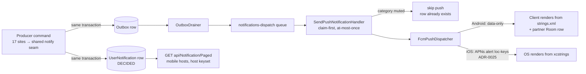
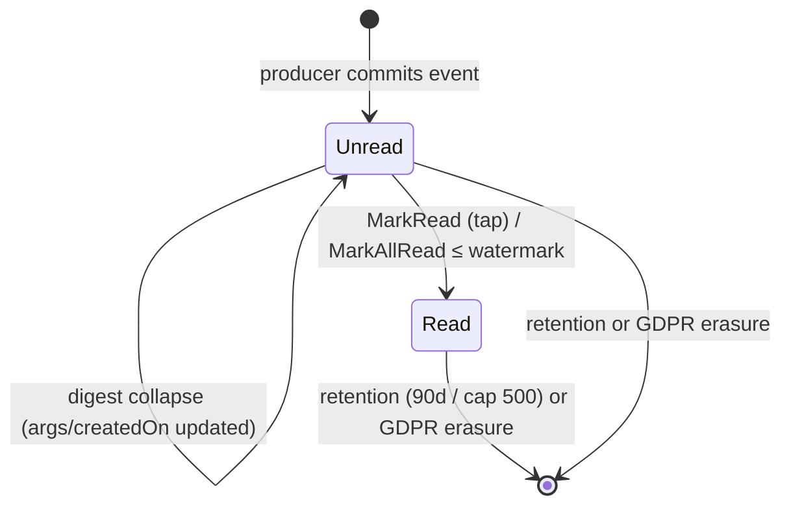

# Notifications — Business Logic (living doc)

> Domain: push notifications + the in-app notifications feed, both personas (Customer, Partner).
> Cross-links: `../architecture/decisions/push-notifications.md` (architect view),
> `docs/architecture/push-notifications.md` (dev/published view), ADR-0002 (outbox/dispatch),
> ADR-0025 (iOS push display, loc-keys), T-0393 (feed), T-0404 (iOS display), T-0403 (iOS FCM
> tokens).

**Status legend:** SHIPPED = in code today · DECIDED = finalized by panel, awaiting build (T-0393
feed design, 2026-07-17).

## The rules

1. **Event catalog is the single source of truth** (`Cleansia.Core.Domain/Notifications/
   NotificationEventCatalog.cs`): 13 event keys; each maps to exactly one `NotificationCategory`
   (the per-user opt-in toggle). Category enum values are pinned — append, never renumber. SHIPPED.
2. **Localization is client-side, always.** The server ships `event_key` + args, never rendered
   text; each app renders from its bundled templates in the *device* locale (Android `strings.xml`,
   iOS `Localizable.xcstrings` per ADR-0025). One exception: `promo.new_sitewide` carries
   admin-authored pre-localized `title`/`body` (no fixed template exists anywhere). SHIPPED (push) /
   DECIDED (feed follows the same model).
3. **Client-first rule for new events:** templates ship in BOTH apps' catalogs before the backend
   catalog/map gains the key; clients silently drop unknown keys (drop-parity). SHIPPED (push),
   DECIDED (feed hides unknown-key rows).
4. **Mute gates the interruption, not the record.** A muted category suppresses the push; the feed
   row is still written for transactional events. Exception: the partner new-jobs digest skips muted
   cleaners at the producer (job availability is ephemeral, not history). DECIDED.
5. **Push delivery is fire-and-forget, at-most-once after the idempotency claim** (ADR-0002 D2.2) —
   a lost push is re-notified by the next event; a lost fiscal artifact never is. The feed exists
   precisely because delivery is not a record. SHIPPED (dispatch) / DECIDED (feed).
6. **Feed row per targeted send, written by the producer, transactionally** with the domain change
   and the outbox row, via one shared notify seam (T-0393 FD-AC12 pins the seam by grep). Entity
   `UserNotification`: `EventKey` + `ArgsJson` + `CreatedOn` + `ReadOn` (null = unread),
   tenant-scoped. DECIDED.
7. **Audience keysets** (beside the catalog): Customer = 11 keys (6 order lifecycle, dispute.reply,
   recurring.scheduled, 2 membership, loyalty.tier_upgrade); Partner = `order.new_available` only —
   the only partner-targeted dispatch that exists. Every feed operation (list, unread count,
   mark-read, mark-all) is scoped to the calling mobile host's keyset. DECIDED. Promo rows: OPEN
   Q-FEED-01 (default excluded). New partner events: OPEN Q-FEED-02 (default: follow-up ticket).
8. **Digest collapse:** a new `order.new_available` updates the cleaner's existing *unread* digest
   row instead of inserting (max one unread digest row per cleaner). DECIDED — mirrors the push
   notification-tag collapse Android already does.
9. **Read semantics:** badge = host-keyset unread count ("99+" cap; fetched on Home load +
   app-foreground; local +1 on push receipt). Opening the inbox marks fetched rows seen via
   watermarked mark-all (`upToCreatedOn` = newest fetched row) — rows arriving after the fetch stay
   unread. Single mark-read exists for row taps; idempotent, owner-only (S1). DECIDED (matches the
   shipped partner-Android Room semantic).
10. **Retention:** feed rows hard-delete after 90 days, safety cap newest 500/user
    (`DataRetentionTimerFunction`); GDPR erasure deletes all the user's rows
    (`GdprDeletionService`). DECIDED.

## Event flow (push + feed)

## Feed item lifecycle

## Story map

| Capability | Persona | State | Where |
|---|---|---|---|
| Push opt-in preferences (per category) | Customer, Partner | SHIPPED | both apps' settings; `UserNotificationPreferences` |
| Order-lifecycle / dispute / membership / loyalty pushes | Customer | SHIPPED (Android display; iOS display = T-0404) | producers + dispatch |
| New-jobs digest push (30-min sweep) | Partner | SHIPPED (Android) | `NewJobsDigestService` |
| Local device-only feed (Room) | Partner (Android) | SHIPPED — migrates to server feed later (T-0393 D6 follow-up) | `NotificationDao` |
| Interim empty-state inbox behind Home bell | Customer | SHIPPED (both platforms) | `NotificationsInboxSheet.{swift,kt}` |
| Server-backed inbox + badge + read state | Customer (v1 UI), Partner (endpoint only) | DECIDED — T-0393 `## Feed design (analyst panel)` | this doc, rules 6–10 |
| Promo rows in the feed | Customer | OPEN Q-FEED-01 (default: excluded) | questions/open.md |
| Partner-targeted assignment/cancellation/invoice events | Partner | OPEN Q-FEED-02 (default: follow-up ticket) | questions/open.md |
