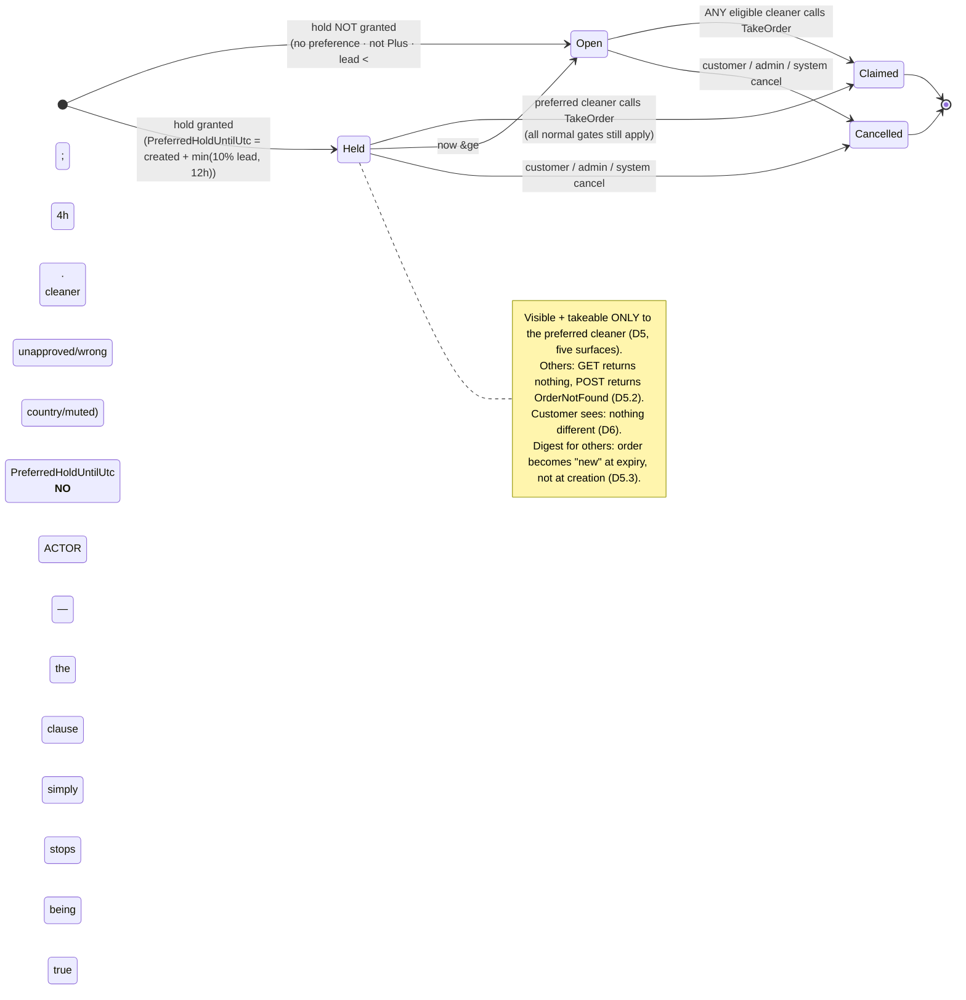
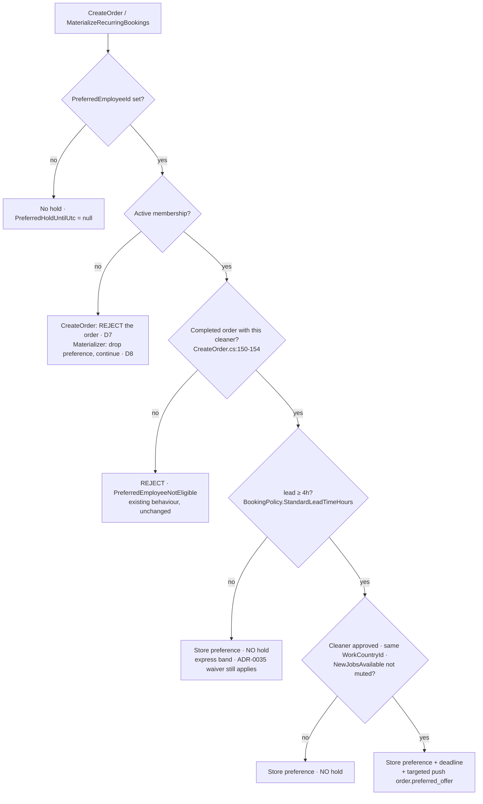

# ADR-0036 — A customer's preferred cleaner gets **first refusal, not priority**: a **lead-time-proportional exclusive hold**, stored as an absolute deadline (`Order.PreferredHoldUntilUtc`) that **expires by clock with no job, no sweep and no state transition**, capped so that **at least 90% of every order's fill window is always open to the whole board**; the hold is **not created at all** when it cannot be acted on (express lead time, ineligible or muted cleaner, non-member); and the perk becomes **Plus-only** at creation while **already-created orders keep what they were granted**

- **Status:** `proposed` — **needs the panel.** Written in `author` mode. Five of the eleven decisions
  below are real trade-offs with a live loser (D1 mechanism, D3 the window, D4 the targeted push +
  privacy, D7 reject-vs-ignore on the gate, D8 the recurring asymmetry). Three challengers are named in
  `## Challenge` with the exact seams to attack (`analyst` → D1/D3/D6 the customer promise;
  `architect` → D2/D5 the visibility predicate; `backend`/`optimizer` → D4/D5.3 the digest interaction).
- **Date:** 2026-08-02
- **Supersedes:** — . **Composes with ADR-0035** (metered membership benefits — the express waiver;
  D3 below is where the two perks meet on one order) · **adopts ADR-0035 D2.1's placement rule**
  unchanged (*platform-wide numbers live on `BookingPolicy`; per-plan numbers live on `MembershipPlan`*)
  · **adopts ADR-0009 D2 / ADR-0035 D1's freeze principle** (*what was granted at creation is not
  re-derived later*) · **rides ADR-0002/ADR-0008** for the targeted push (outbox, unchanged) ·
  **rides ADR-0025** for the push display contract (loc-keys, unchanged) · **does not touch** ADR-0001
  (authorization), ADR-0007 (soft delete), ADR-0017 (region seam), or any fiscal path.
- **Applies to:** `Cleansia.Core.Domain` (one nullable column on `Order`, one shared visibility
  expression, one nullable column on `RecurringBookingTemplate`) · `Cleansia.Infra.Database`
  (**two owner-run additive migrations**, no backfill) · `Cleansia.Core.AppServices` (one resolver, one
  factory wiring, one validator rule, one predicate applied in five places, one notification event) ·
  **Partner + Partner-Mobile hosts read the new predicate; Customer/Admin hosts are byte-untouched** —
  no host coupling · **no NSwag-breaking change** (no field leaves or changes shape on any client DTO;
  one new error key is a string, not a contract change).
- **Ticket:** T-0495 (this ADR). **Consumers:** T-0515 (the dispatch rule + the `Order.cs:217-224`
  comment correction), T-0516 (the Plus gate — `Q-PLUS-03` is **answered**, see below), plus **one new
  ticket this ADR asks the PM to file** (recurring carry-through, D8) and **one the ticket already
  named** (the web wizard has no picker at all — `order-wizard.facade.ts:580` sends `undefined`).
- **Owner input this ADR executes (verbatim, 2026-08-02):** *"It exists, you can select in the app but
  I think it doesn't work fully. And I'd like to have it working fully."* — so *withdraw the claim* is
  off the table; and, on whether the perk stays universal or becomes Plus-only: **"plus-only"**.
  **`Q-PLUS-03` is therefore ANSWERED and T-0516 is unblocked** (`questions/open.md:896-908` — the PM
  should record the answer there in the same pass).

> ## AC3 — the assignment-model sentence, at the top, in one sentence
>
> **No assignment-model change is required, anywhere, for any order:** the platform still *offers* and
> cleaners still *take*, `TakeOrder` remains the only path by which an order acquires a cleaner, and a
> preferred cleaner who does nothing is never assigned anything — this ADR changes **who may see and
> take an order for a bounded interval**, never **whom an order belongs to**.

> ## AC1 — the mechanism, in one sentence a test can check
>
> **An order carrying a granted hold is invisible and un-takeable to every cleaner except the preferred
> one until `Order.PreferredHoldUntilUtc`, and from that instant behaves in every respect exactly like
> an order that never had a preference.**
>
> Corollary, and the reason this is safe: **the hold delays *assignment*, never the *appointment*.**
> The customer's cleaning time is a field they chose; nothing here moves it.

---

## Context — every citation re-verified by this panel by reading, 2026-08-02

### What exists (the PM's five findings, confirmed independently)

| Claim | Evidence |
|---|---|
| `Order.PreferredEmployeeId` is **written and read by nothing** | **CONFIRMED.** Whole-solution grep for `PreferredEmployeeId` returns 18 hits: the entity (`Order.cs:226`), its setter (`Order.cs:349`), its EF config (`OrderEntityConfiguration.cs:78`), the anonymizer (`Order.cs:621`), the factory pass-through (`OrderFactory.cs:124`), the command/DTO plumbing (`CreateOrder.cs:208,300`, `IOrderFactory.cs:67`), the validator (`CreateOrder.cs:140-154`), migrations, two tests, one comment, and `MaterializeRecurringBookings.cs:138` (`null`). **Zero queries, zero orderings, zero notifications, zero assignment logic.** |
| Dispatch is first-come-first-served | **CONFIRMED.** `TakeOrder.cs` gates on available spots (`:44`), caller-is-employee (`:49`), an address (`:51`, *"Availability is no longer a gate"* — `:102-105`), `ContractStatus.Approved` (`:53`), not-already-assigned (`:55`), a rating-tiered weekly limit (`:57`, 3/6/10 at `:135-140`), and a time conflict (`:59`). **`PreferredEmployeeId` appears nowhere in the file.** |
| The entity doc describes an algorithm that does not exist | **CONFIRMED.** `Order.cs:217-224` — *"The matching algorithm boosts this employee's score…"*, and *"today the field exists but no UI sets it"*. **Both halves are false**; three clients set it and no scorer exists. AC12: corrected by **T-0515**, verbatim text supplied in §Naming below. |
| The gate is wrong in the **opposite** direction from the copy | **CONFIRMED.** `CreateOrder.cs:140-154` fires only `When(PreferredEmployeeId is set && a user is signed in)` and asserts exactly one thing — `UserHasCompletedOrderWithEmployeeAsync` (`OrderRepository.cs:294-305`: an order with that employee assigned whose `CurrentStatus == Completed`). **There is no membership check of any kind**, while iOS advertises *"**Plus benefit** · choose someone who's cleaned for you before"*. |
| Recurring drops it | **CONFIRMED, and sharper than reported.** `MaterializeRecurringBookings.cs:138` passes `PreferredEmployeeId: null` — but `RecurringBookingTemplate` has **no field to pass**. `RecurringBookingTemplate.Create(...)` (`CreateRecurringBooking.cs:102-114`) takes userId, frequency, dayOfWeek, timeOfDay, rooms, bathrooms, savedAddressId, service/package ids, paymentType, startsOn, endsOn — **and nothing else.** The preference was never *modelled* on the template. This is a **design gap, not a dropped assignment** (D8). |

### The two facts that decide the mechanism, and neither is in the ticket

**Fact A — "may this cleaner see/take this order" is already expressed in FIVE independent places.**
This is the single most important structural finding of this panel, because a sixth condition added to
four of five places is a leak, and to three of five is a bug:

| # | Where | Expression |
|---|---|---|
| 1 | `GetPagedOrders.cs:91` → `OrderSpecification.RestrictToEmployeeId` (`:134-139`) | the partner board list |
| 2 | `GetAvailableJobsPreview.cs:50` → `DashboardSpecifications.CreateAvailableOrdersSpec` (`:8-29`) | the mobile "available work" card |
| 3 | `OrderAccessService.CanBrowseOrderAsync` (`IOrderAccessService.cs:14-19` — *"any employee can view an order that still has open spots"*) | the order **detail** page |
| 4 | `NewJobsDigestService.cs:98-114` | a **hand-rolled** predicate that does **not** use the specification |
| 5 | `TakeOrder.Validator.HasAvailableSpotsAsync` (`:63-71`) | the **write** gate |

**Fact B — the digest's freshness watermark is timestamp-based, and any suppression silently
un-notifies an order forever.** `NewJobsDigestService.cs:109-114` selects orders whose *latest*
`OrderStatusTrack.CreatedOn` is newer than the cleaner's `LastNewJobsDigestAt`. A held order's status
track is written at creation (`OrderFactory.cs:166`). **If a hold hides the order from other cleaners
for 45 minutes, then at expiry its status-track timestamp is older than every cleaner's watermark and
the order will never appear in any digest again** — it becomes board-only, discoverable solely by
someone who happens to scroll. That is precisely *"an order sitting unclaimed because we waited for one
person"*, arriving through a back door that no reasonable implementer would predict. **D5.3 fixes it.**

### The trade-off space (the ticket's four mechanisms, priced against Fact A/B)

| Mechanism | Honours the preference? | Buys it with | Fatal problem |
|---|---|---|---|
| **Board ordering / visual boost** | **No.** Sorting is not exclusivity; a faster cleaner still wins. `GetAvailableJobsPreview` already sorts by `TotalPrice DESC` (`:54`) and the paged list is client-sorted. | nothing | **It honours nothing** — the ticket's own table says so, and the owner asked for *"working fully"*. It would let us keep the copy while changing no outcome. |
| **Notification-only nudge** | Weakly. The preferred cleaner hears first; anyone who has the board open still beats them. | nothing | Non-deterministic: it works only for orders nobody was looking at. Untestable as a promise. |
| **Exclusive hold (chosen)** | **Yes, deterministically.** | **latency, bounded and proportional** | The latency — answered by D3's 90% invariant and D5.3. |
| **Assignment model** | Yes | an epic + a product change | Out of scope by AC3; the platform has no assigner, no acceptance step, no decline flow, no reassignment path. |

---

## Decision

### D1 — The mechanism is a **first-refusal exclusive hold**; the promise is *first chance*, never *your cleaner*

For a bounded interval after the order is created, the order is **withheld from the board** and only the
preferred cleaner may see and take it. At the deadline it opens to everyone, unchanged.

**Why exclusivity and not a boost:** on a pull board, "priority" that is not exclusivity is a sort order,
and a sort order is not an outcome. The only lever a pull model actually has is *who the offer is shown
to*. Everything else is decoration.

**Why "first refusal" is also the honest name of the product.** The perk cannot be *"the same cleaner
every time"* — a cleaner is a person with a schedule, a weekly cap (`TakeOrder.cs:135-140`) and a life.
What the platform *can* guarantee is that they get the offer before anyone else does. **The copy must
promise that and nothing more** (§Copy).

### D2 — The hold is a **stored absolute deadline** on the order, not a duration evaluated at read time

`Order` gains **one nullable column**:

| Field | Type | Notes |
|---|---|---|
| `PreferredHoldUntilUtc` | `DateTime?` (UTC) | Set **once**, in `OrderFactory`, at creation. **Never recomputed. Never updated** (except by the future decline action, below). `null` = **no hold, ever** — the default for every existing row and every order without a granted hold. |

Four consequences, each of which is a reason:

1. **Expiry needs no actor.** `now >= PreferredHoldUntilUtc` is a `WHERE` clause. There is **no sweep,
   no timer, no outbox message, no status transition, no `IsActive` flip**. The failure mode of a
   job-driven expiry is *an order stuck held* — the exact catastrophic outcome. The failure mode of a
   clock comparison is that the clock is wrong. **The fallback is the absence of a hold, not an event.**
2. **The predicate keys on the DEADLINE, never on `PreferredEmployeeId`.** This is what makes the change
   safe for the ~existing corpus: every order ever created is `PreferredHoldUntilUtc = null`, so no
   legacy row acquires behaviour retroactively, and **no backfill and no data migration are needed.**
   (A predicate keyed on `PreferredEmployeeId` would have switched behaviour on for every historical
   non-member order the moment it shipped — see D7.)
3. **Tuning the policy cannot rewrite live orders.** If the fraction or the ceiling changes, orders
   already created keep the deadline they were granted. This is ADR-0009 D2 / ADR-0035 D1's freeze
   principle applied to time instead of money, and it is the same reason ADR-0035 stores `PeriodKey`
   rather than recomputing it.
4. **It makes two future changes cheap and one impossible-to-get-wrong.** A cleaner-side **"pass on
   this"** action (the natural follow-on, D5.4) is `PreferredHoldUntilUtc = now` — one write, no new
   column, no new state. Making the window **per-country** later (`CountryConfiguration`) is a change to
   the *computation*, with **no schema change and no effect on live orders**. A computed-at-read-time
   duration would have needed a new column for both.

**`PreferredEmployeeId` and `PreferredHoldUntilUtc` are deliberately two columns with two lifetimes.**
The first is *what the customer asked for* (a durable fact, already GDPR-handled at `Order.cs:621` — the
anonymizer must null the deadline too). The second is *what the platform granted* (a policy outcome).
Collapsing them would make "we stored your preference but could not act on it" inexpressible, which is
exactly the state D5.1 needs.

### D3 — The window is **proportional to lead time**, with a ceiling, and is **zero inside the express band**

> **The governing rule, stated before its numbers:** *the hold may never consume more than a small
> fixed fraction of the time available to fill the order, and it may never touch an order that is
> already urgent.*

```csharp
// BookingPolicy — platform-wide numbers, per ADR-0035 D2.1's placement rule.
public const decimal PreferredHoldFraction    = 0.10m;  // a tenth of the fill window
public const int     PreferredHoldCeilingHours = 12;    // and never more than this

/// PURE. Returns TimeSpan.Zero when no hold may be granted for this lead time.
public static TimeSpan ComputePreferredHold(DateTime cleaningUtc, DateTime nowUtc)
{
    var leadHours = (cleaningUtc - nowUtc).TotalHours;
    if (leadHours < StandardLeadTimeHours) return TimeSpan.Zero;      // 4 — the SAME constant
    var hours = Math.Min(leadHours * (double)PreferredHoldFraction, PreferredHoldCeilingHours);
    return TimeSpan.FromHours(hours);
}
```

Worked, so a reviewer can check it by arithmetic rather than by reading:

| Lead time at creation | Hold | Fill window left open to the whole board |
|---|---|---|
| < 2 h | *not bookable* (`BookingPolicy.IsBelowMinimumLeadTime`) | — |
| 2–4 h — **the express band** | **0** | **100%** |
| 4 h | 24 min | 3 h 36 (90%) |
| 8 h | 48 min | 7 h 12 (90%) |
| 24 h (next day) | 2 h 24 | 21 h 36 (90%) |
| 72 h (3 days) | 7 h 12 | 64 h 48 (90%) |
| 168 h (7 days — every recurring occurrence, D8) | **12 h** (ceiling) | 156 h (93%) |
| 30 days | **12 h** (ceiling) | 99.3% |

**Invariant H, which is this ADR's answer to the ticket's central warning:**

> **At least 90% of every order's fill window is always open to the entire board.** The hold can never
> be the reason an order goes unfilled, because the hold is never more than a tenth of the time there
> was — and if a tenth of the window was the difference, the order was going to fail anyway.

Four things fall out of this shape rather than being bolted on:

- **The express collision with ADR-0035 is resolved by construction, using an existing constant.**
  `StandardLeadTimeHours` (4) is *already* the boundary between express and standard
  (`BookingPolicy.cs:18-24, 68-72`). Reusing it as the hold floor means the hold band and the express
  band **can never drift apart**, because they are the same number. A Plus member who books 3 hours out,
  uses their ADR-0035 express waiver **and** has a preferred cleaner gets: the waiver (D-0035 D1) and
  **no hold**. Named as an accepted consequence below.
- **A minimum hold falls out for free.** The shortest lead time that gets any hold is 4 h, so the
  shortest hold the formula can produce is **24 minutes** — long enough to be actionable, short enough
  to be invisible. No extra constant, nothing to tune, nothing to get wrong.
- **The "leave enough time" clamp is unnecessary.** 90% always remains, at every lead time. A
  fixed-duration window (e.g. "30 minutes, always") would need such a clamp *and* would be 12.5% of a
  4-hour booking and 0.4% of a two-week one — arbitrary at both ends.
- **The ceiling exists for a supply reason, not a customer one.** Without it a 30-day-ahead booking
  would be held ~3 days. 12 h is chosen because it is the smallest window that **always intersects a
  normal waking period** for any creation time (a 22:00→10:00 hold still covers 07:00–10:00), which is
  the actual thing a hold needs to be worth granting.

**Rejected: making the window a per-plan number** (a hypothetical Pro tier holding longer). A longer
hold is *worse for the marketplace*, so it is a product lever that degrades fill rate as it upsells. If
a tier ever differentiates here it should be on *eligibility breadth*, not duration.

### D4 — The preferred cleaner gets an **immediate targeted push that bypasses the digest**; and the "hidden from the cleaner" rule is **deliberately dropped on their side only** (AC4)

**The push.** A new event key, produced inline in the create path exactly as `TakeOrder` produces
`OrderConfirmed` (`TakeOrder.cs:200-211`) — same `INotificationProducer`, same outbox
(ADR-0002/ADR-0008), same display contract (ADR-0025):

```csharp
/// Partner-targeted: a customer who has worked with this cleaner before asked for them
/// specifically, and the order is held for them until PreferredHoldUntilUtc. Args:
/// orderNumber (loc) + orderId (deep link). NOT argless, NOT a count — this is one order.
public const string PreferredOffer = "order.preferred_offer";
// GetCategoryFor: PreferredOffer => NotificationCategory.NewJobsAvailable
```

- **It bypasses the 30-minute digest cadence and does not touch `LastNewJobsDigestAt`.** Bypassing is
  the point: **the hold length must be set by the customer's tolerance for latency, not by our
  notification cadence.** If the preferred cleaner learned via the digest, the *minimum* useful hold
  would be 30–60 minutes for every booking including a 4-hour-lead one — i.e. we would be buying
  latency to compensate for our own sweep interval. It must not stamp the watermark either: stamping
  would suppress the cleaner's next digest of *other* jobs.
- **It reuses `NotificationCategory.NewJobsAvailable`** for the opt-out. A cleaner who muted new-job
  notifications must not receive a push-shaped bypass of that mute.
- **And therefore: no notification ⇒ no hold.** If the preferred cleaner has muted the category, the
  hold is **not created**. A hold exists only to give someone a chance to act on a signal; with no
  signal there is no chance, and the latency is pure loss. (D5.1 folds this into the resolver.)
- **Duplicate-signal note, accepted:** the preferred cleaner may also see the order counted in their
  next ordinary digest. Harmless; not worth a suppression rule.

**The privacy ruling (AC4), against `Order.cs:221-222` (*"Not exposed to the cleaner side (avoids
'they didn't pick me' awkwardness)"*):**

> **The rule is KEPT, absolutely, for every cleaner who was not chosen — and DROPPED, deliberately,
> for the one who was.**

- **The rule's stated purpose is fully preserved.** The awkwardness it names is felt by the cleaners who
  were *not* picked — and **exclusivity is invisible to the excluded by construction**: a board is a
  query result, not a diff. A cleaner who never sees an order cannot know it was withheld.
- **Telling the chosen cleaner is not awkward — it is the most valuable sentence we have for the
  supply side** (*"a customer asked for you again"*), and it is the only thing that makes a 24-minute
  hold get acted on. Suppressing it makes the push indistinguishable from the digest and destroys the
  mechanism's one lever.
- **It is not a secret we could keep anyway.** A cleaner offered a single job that nobody else appears
  to have will work it out in one booking. A "privacy" rule that survives exactly one use is not a rule.
- **The hard line that stays, and it is checkable:** `PreferredEmployeeId` never appears on any
  partner-facing DTO; no surface ever says "held for someone else"; no cleaner ever learns the identity
  of a preferred cleaner or that they themselves were passed over.

### D5 — Enforcement: **one shared expression**, applied in all five places from Fact A

Because five places already answer "may this cleaner see/take this order", the new condition is written
**once**, in the Domain, next to the entity:

```csharp
// Cleansia.Core.Domain/Orders/OrderVisibility.cs — the ONE expression.
/// An order is open to `employeeId` unless a preferred hold is live and belongs to someone else.
/// Null deadline (every legacy row, every order without a granted hold) => always open.
public static Expression<Func<Order, bool>> NotHeldFromEmployee(string employeeId, DateTime nowUtc)
    => o => o.PreferredHoldUntilUtc == null
         || o.PreferredHoldUntilUtc <= nowUtc
         || o.PreferredEmployeeId == employeeId;
```

Applied at: `OrderSpecification` (a new `NotHeldFromEmployeeId` term, ANDed alongside
`RestrictToEmployeeId` at `:134-139`, which makes surfaces 1 **and** 2 correct at once),
`OrderAccessService.CanBrowseOrderAsync` (surface 3), `NewJobsDigestService` (surface 4, plus D5.3),
and `TakeOrder.Validator` (surface 5). **The client is never the control** — every one of these is
server-side, and the employee is server-derived from the caller (`GetCallerEmployeeIdAsync`), never a
client field (S1, the posture `TakeOrder.cs:109-115` already documents).

#### D5.1 — When a hold is granted: `IPreferredCleanerHoldResolver`, a pure read, mirroring `CancellationPolicyResolver` / `IExpressWaiverResolver`

```csharp
// Cleansia.Core.AppServices/Services/Interfaces/IPreferredCleanerHoldResolver.cs
public interface IPreferredCleanerHoldResolver
{
    /// PURE READ. Never writes. Safe to call from the quote path and from the factory.
    Task<PreferredCleanerHold> ResolveAsync(
        string? userId, string? preferredEmployeeId,
        DateTime cleaningUtc, DateTime nowUtc, CancellationToken cancellationToken);
}

/// Granted=false carries WHY, so the decision is loggable and testable rather than a bare null.
public record PreferredCleanerHold(bool Granted, DateTime? HoldUntilUtc, HoldDeclineReason Reason);

public enum HoldDeclineReason { None = 0, NoPreference = 1, NoMembership = 2, ExpressLeadTime = 3,
    CleanerNotApproved = 4, CleanerCountryMismatch = 5, CleanerMutedNewJobs = 6, CleanerNotFound = 7 }
```

**Checked at creation (statically knowable) — failure means NO hold, and the order goes straight to the
open board with zero latency cost:**

| Condition | Source | Why here |
|---|---|---|
| a preference is set | `input.PreferredEmployeeId` | trivially |
| the customer has an **active** membership | `IUserMembershipRepository.GetActiveForUserNoTrackingAsync` — the **one** live-membership predicate (`UserMembershipRepository.ActiveForUserQuery:20-29`), already used by `CancellationPolicyResolver:32`, `OrderFactory:76`, `QuoteOrder:141`, `CreateRecurringBooking:84-85` | D7; **no second predicate is created** |
| lead time ≥ 4 h | `BookingPolicy.ComputePreferredHold` | D3 |
| the cleaner is `ContractStatus.Approved` (or `Active`) and exists | `IEmployeeRepository` | a hold for a cleaner `TakeOrder.cs:53` would reject is pure latency |
| the cleaner's `WorkCountryId` == the order's service-address country | `Employee.WorkCountryId`, `Address.CountryId` | **the ticket's "different work country" case.** This is the same country key `NewJobsDigestService.cs:100` and `OrderFactory.cs:152` already use — not a new notion of country |
| the cleaner has **not muted** `NotificationCategory.NewJobsAvailable` | `IUserNotificationPreferencesRepository` (default-allow when the row is absent, matching `NewJobsDigestService.cs:151-158`) | D4 — no signal, no hold |

**Deliberately NOT checked (dynamic) — the hold is created and simply expires:** the **weekly order
limit** (`TakeOrder.cs:125-143`) and the **time conflict** (`:145-161`). Both can change in either
direction between creation and the moment the cleaner opens the app, so a creation-time check would be
wrong in both directions; and the cost of being wrong is bounded by Invariant H at ≤10% of the fill
window. **This is the AC6 interaction table**: the hold never *overrides* a `TakeOrder` gate — a
preferred cleaner who is over their weekly limit is refused exactly as anyone else would be, and the
order they were holding opens on schedule.

#### D5.2 — The take-time refusal must **agree with the read surface**, so it cannot leak

A cleaner with a stale board can still `POST` a take on a held order. The refusal returns the **existing
`BusinessErrorMessage.OrderNotFound`** — **no new error key, no new translation, no leak.**

The rule that makes this principled rather than a fib: **the error a caller gets must agree with what
that same caller's `GET` would return.** During the hold, surfaces 1–3 already return nothing for this
cleaner; a `POST` that answered *"held for another cleaner"* would leak precisely the fact D4 said we
keep. (Contrast `NoAvailableSpots`, which would be false — spots exist.)

#### D5.3 — The digest's freshness comparison must use the hold expiry, or held orders are never notified again

**This is Fact B, and it is the defect this mechanism would otherwise create.** In
`NewJobsDigestService.cs:109-114`, an order's "became available to *this* cleaner" instant becomes:

```
availableToCleanerAt = (cleaner is the preferred one)
    ? latest OrderStatusTrack.CreatedOn
    : max(latest OrderStatusTrack.CreatedOn, PreferredHoldUntilUtc)
```

One expression change. **No new column, no new job, no new state.** Without it, every held order that
the preferred cleaner declines silently falls out of the notification channel forever and becomes
board-only — turning a 24-minute optimisation into a permanent loss of reach. This is a **blocking**
part of the decision, not an optimisation: T-0515 that ships D5 without D5.3 is a regression.

#### D5.4 — What is **not** built, and why the shape leaves room for it

- **No early release when the preferred cleaner takes a conflicting job.** It needs either a sweep or a
  rescan inside `TakeOrder`, whose failure mode is an order stuck held. Bounded by Invariant H;
  **rejected on cost, recorded so it is not re-litigated.**
- **No cleaner-side "pass on this" action.** It only ever *improves* latency and it is one write
  (`PreferredHoldUntilUtc = now`) against a shape that already exists — the natural follow-on ticket,
  deliberately not in the first wave because it adds a partner-side UI surface.

### D6 — The customer is told **once, at booking, in the future tense** — and never watches a clock we set (AC2)

> **No new customer-visible order state. No countdown. No "waiting for Anna". No push when the hold
> expires.**

- A countdown converts a silent, bounded, invisible optimisation into a **watched wait**, and invents a
  state the order does not have (it is `New`/`Pending` either way; the customer's screen already says we
  are finding a cleaner).
- A push on expiry is a notification **whose entire content is bad news about something the customer did
  not know was in doubt.** *"Anna couldn't take it"* manufactures a disappointment out of a normal
  outcome. **A silent 30-minute delay is worse than the perk is better — but only if the customer is
  watching it.** This decision is what makes D3's latency acceptable.
- **The success case is already visible** where it belongs: the assigned cleaner on the order detail is
  the one they asked for, and the existing `order.confirmed` push fires unchanged (`TakeOrder.cs:200`).
- **What the customer IS told** is one sentence at the moment of choosing — §Copy, owned by T-0491.

#### The AC2 fallback state machine



**The `Held → Open` edge is the whole design.** It has no writer, no message, no job and no row change —
which is why it cannot fail, cannot be missed, and cannot leave an order stranded.

#### And the decision tree at creation



### D7 — The Plus gate (AC8): server-side, at creation, **reject rather than silently ignore**; nothing already granted is taken back

**The owner ruled Plus-only. `Q-PLUS-03` is answered.** The specification T-0516 implements:

- **Where:** a **second `MustAsync`** inside the *existing* `When(...)` block at `CreateOrder.cs:140-147`
  — beside `PreferredEmployeeIsEligibleAsync`, not in the handler. (The recurring perk gates in its
  *handler* instead — `CreateRecurringBooking.cs:84-91`. **Observation, not a change:** the two perks
  gate in two different layers. The `CreateOrder` gate belongs in the validator because the rule it
  joins is already there and CLAUDE.md puts validation in validators.)
- **How:** `IUserMembershipRepository.GetActiveForUserNoTrackingAsync(userId) is not null`. **The one
  live-membership predicate**, no new expression, exactly as D5.1.
- **Error:** a new `BusinessErrorMessage.PreferredEmployeeMembershipRequired`, mirroring the shipped
  `RecurringTemplateMembershipRequired`. ⚠️ **Five languages × the per-client error namespaces** — the
  prefix differs per client; a key added under one client's `errors.*` does not resolve in another.
- **Anonymous bookings are untouched.** The `When` already requires a signed-in user
  (`CreateOrder.cs:140-141`); a guest cannot set a preference today and still cannot.

**Reject, not silently ignore — and the precedent is in the same four lines.** The alternative (accept
the order, null the field) means a customer who *believes* they got the perk gets nothing, with no
signal — the same class of failure as ADR-0035's shipped *"same-day"* copy: a false statement to a
paying customer. **Decisive evidence:** this field **already fails the whole order** when the preference
is ineligible (`CreateOrder.cs:143-146` → `PreferredEmployeeNotEligible`). Rejecting on membership is
**consistent with the shipped posture for the same field**, not a new harshness — and the client gates
the picker on membership, so the error is nearly unreachable in practice.

**AC8's other half — what happens to people who have it today:**

| Case | Ruling | Why |
|---|---|---|
| **An existing non-member order that already carries a preference** | **Left exactly alone. No backfill, no null-out.** | It is a historical fact about a booking made under the rules of the day; rewriting it is rewriting a customer's order after the fact. And it is **inert by construction**: `PreferredHoldUntilUtc` is `null` on every pre-existing row, and the predicate keys on the deadline (D2.2), so those orders keep behaving exactly as they do today — which is *no differently from any other order*. **Zero-risk by design, not by care.** |
| **A non-member's *next* order** | Rejected at creation with the new error; they rebook without the preference (one tap). | The gate is a creation-time rule. |
| **A member who lapses — orders already created** | **The hold stands.** Not re-evaluated, not cancelled. | ADR-0009 D2 / ADR-0035 D1's freeze: what was granted at creation is not re-derived later. Practically moot — the hold is over within ≤12 h. |
| **A member who lapses — new orders** | Gate applies; rejected. | — |
| **A member who lapses — recurring templates** | The occurrence materializes **without** the preference and **without** a hold; the cleaning still happens. | D8 — the one deliberate asymmetry. |

### D8 — Recurring (AC7): the preference was never modelled on the template; it should be, and the gate degrades there instead of rejecting

**The finding, precisely.** `MaterializeRecurringBookings.cs:138` passing `null` is *not* a dropped
assignment — `RecurringBookingTemplate` has **no field to pass** (`CreateRecurringBooking.cs:102-114`).
No client can express a preference on a schedule. **This is the strongest case for the perk, wired to
nothing:** a recurring customer is precisely the customer who wants the same cleaner, recurring lead
time is ~7 days (`HorizonDays = 7`), and at 168 h the hold hits the 12 h ceiling — **7% of the fill
window**, the cheapest hold the system can grant.

**Ruling — in scope for the decision, out of scope for T-0515:**

1. `RecurringBookingTemplate` gains **`PreferredEmployeeId`** (nullable, `MaxLength(26)`) — an additive
   migration; `CreateRecurringBooking.Command` and the clients gain the field.
2. `MaterializeRecurringBookings.cs:138` passes `template.PreferredEmployeeId`, and the factory resolves
   the hold with the same resolver (D5.1).
3. **The sweep must re-run the gate, and when it fails it DEGRADES rather than rejects.** The sweep has
   no user session (`GetQueryableIgnoringTenant` + a per-template tenant override, `:54-74`) and runs
   long after the template was created; a membership can lapse, and a cleaner can leave, in between. So
   at materialization: resolve → **no active membership / ineligible cleaner ⇒ materialize the
   occurrence with `PreferredEmployeeId = null` and no hold**, and **never** fail the occurrence.

   **The asymmetry with D7 is deliberate and is the point:** at `CreateOrder` a human is present to read
   an error and fix it in one tap; in a 03:00 sweep there is nobody, and the only alternative to
   degrading is **dropping a customer's cleaning** because a perk lapsed. *Reject where someone can
   react; degrade where nobody can.*
4. **`CreateRecurringBooking` is already Plus-gated** (`:84-91`), so the *template* gate exists; this
   adds only the per-occurrence re-check.

**Filed as its own ticket, not folded into T-0515** — it is a second migration, a second client surface
(three clients' recurring UI) and a different failure posture. Sizing in D10 (C3).

### D9 — Eligibility (AC5): **KEEP `UserHasCompletedOrderWithEmployeeAsync` unchanged** — and it is now load-bearing in a way it was not before

The ticket asks whether requiring a *completed* order with that cleaner is still right once the perk is
real. **It is, and the hold makes it more important, not less:**

1. **It is the only thing stopping the perk from becoming a customer-controlled targeting primitive.**
   Without it, `PreferredEmployeeId` is *any employee id a client chooses*, and a hold would let a
   customer **withhold an order from the entire board and hand it to a cleaner they name**. With it, the
   set of holdable-for cleaners is exactly the set the customer has already been served by — and the
   error already prevents enumeration of foreign employee ids.
2. **The validator and the picker already agree exactly, and this is worth preserving.**
   `GetMyServingCleaners.cs:27-28` feeds the picker from `CurrentStatus == Completed`;
   `OrderRepository.cs:300-304` validates on `CurrentStatus == Completed`. **Same predicate, same
   column.** A reviewer can check the agreement in two greps. Changing one without the other would make
   the picker offer a cleaner the server then refuses.
3. **"Unusable for a new subscriber's first booking" is correct behaviour, not a defect.** The perk is
   *"the cleaner you already trust"*; before the first clean there is no such person. The repository's
   own comment already reasons this out (`:296-299` — *"you can't request 'the cleaner I'm currently
   with'… they need to have finished one"*). **It is not the reason nobody uses it — the reason nobody
   uses it is that the field is read by nothing.**
4. **Completed, not merely assigned, is right:** a cleaner who took an order and cancelled it should not
   become a preferrable relationship.

### D10 — Implementation candidates (AC9). **This ticket builds nothing** — `git diff --stat -- src/` is empty.

| # | Candidate | Size | Ticket |
|---|---|---|---|
| **C1** | **The Plus gate.** One `MustAsync` in the existing `When` block + one `BusinessErrorMessage` + 5 languages × the per-client namespaces + a client-side picker gate. **No migration, no NSwag change.** | **S** | **T-0516** (unblocked — `Q-PLUS-03` answered) |
| **C2a** | **The hold, server-side.** `Order.PreferredHoldUntilUtc` (⚠️ **`ef-migration`, owner-only**) + `OrderVisibility.NotHeldFromEmployee` + `BookingPolicy.ComputePreferredHold` + `IPreferredCleanerHoldResolver` + `OrderFactory` wiring + the predicate applied at all five surfaces + **D5.3's digest fix** + the `Order.cs:217-224` comment correction (AC12) + tests. | **M** | **T-0515** |
| **C2b** | **The targeted push.** `NotificationEventCatalog.PreferredOffer` + `GetCategoryFor` + the producer call + loc-keys on **both** partner clients × 5 languages (ADR-0025). | **S** | **T-0515** (same release — see below) |
| **C3** | **Recurring carry-through (D8).** `RecurringBookingTemplate.PreferredEmployeeId` (⚠️ **second `ef-migration`, owner-only**) + command/DTO field (⚠️ **`nswag-regen`, owner-only**) + materializer wiring + the degrade rule + three clients' recurring UI. | **S–M** | **NEW — PM to file** |

**AC9's "any L is split in the ADR": C2 was an L and is split above.** But they are **two tickets, one
release**: C2a alone creates holds for a signal that arrives *after* the window closes (a 24-minute hold
against a 30-minute digest — D4). **If only one can ship, ship neither.** The rule that enforces this
without a process note is already in D5.1: *no notification ⇒ no hold*; with C2b absent there is no
targeted notification, so C2a must grant no holds, so C2a alone is a no-op by its own logic.

**Sequencing against the copy:** C1 (the gate) may ship before C2 — a gate with no mechanism behind it
is *less* wrong than today, because today the copy claims a Plus perk the server does not gate.

### D11 — Scope boundary

- **In scope:** the mechanism, the window, the fallback, the notification, the privacy ruling, the
  eligibility ruling, the Plus-gate specification, the recurring ruling, the naming corrections, and the
  catalog + living-doc updates.
- **Byte-untouched:** `TakeOrder`'s six existing gates (a new one is *added*; none is modified),
  `OrderStatus` and the lifecycle, the pay formula, `EmployeePayConfig`, every fiscal path,
  `ITenantEntity` / the global query filter, `IIdempotencyGuard` / `ProcessedMessage`, the outbox
  contract, the Customer and Admin API hosts.
- **Not decided here:** the copy's final wording (T-0491 — §Copy constrains it), the web wizard's
  missing picker, an admin view of holds, and a cleaner-side decline action (D5.4).

---

## Alternatives considered

| # | Alternative | Why not |
|---|---|---|
| **A1** | **Board ordering / a visual boost — the preferred cleaner sees it pinned at the top, anyone can take it.** Genuinely attractive: cosmetic, zero schema, zero latency, zero risk to fill rate, and it cannot strand an order. | **It honours nothing, and the owner asked for "working fully".** First-come still wins: a cleaner refreshing the board beats a cleaner reading a pin. Worse, it is **unfalsifiable as a promise** — there is no test that distinguishes "the boost worked" from "they happened to be first", so we could never tell a customer whether they got what they paid for. It also does not survive its own surface: `GetAvailableJobsPreview.cs:54` sorts by `TotalPrice DESC`, so a boost would have to fight an existing ordering on one of the two board surfaces and be absent on the other. **Kept in the record because it is the correct answer if a challenger shows Invariant H does not hold.** |
| **A2** | **Notification-only nudge — push the preferred cleaner first, change no visibility.** | Strictly weaker than A1 plus a push: it works only for orders nobody happens to be looking at, so the perk's value is inversely proportional to how healthy the marketplace is. And it still costs the push. If we are going to build the targeted notification anyway (D4), the marginal cost of making it *mean* something is one nullable column. |
| **A3** | **A fixed window for everyone (e.g. "30 minutes, always").** The simplest thing that could work, and easy to explain. | 30 minutes is **12.5% of a 4-hour booking and 0.4% of a two-week one** — arbitrarily aggressive at the urgent end and pointlessly timid where holding is free. It needs a separate "don't do this on express bookings" clamp (a second rule that can drift from `StandardLeadTimeHours`), whereas the proportional form gets that boundary from the constant that already defines express. And it makes Invariant H unstateable. |
| **A4** | **A duration constant read at query time** (`created + HoldMinutes > now`), no stored column. | Saves a migration and costs correctness three ways: **(a)** tuning the constant retroactively moves the expiry of every live order — the same history-recompute defect ADR-0035 A1 was rejected for; **(b)** the predicate would key on `PreferredEmployeeId`, so **every historical non-member order would acquire hold behaviour the moment it shipped** (D2.2); **(c)** it makes the future decline action (D5.4) and any per-country window need a new column anyway. The migration is one additive nullable column with no backfill. |
| **A5** | **Expire the hold with a background job / a sweep** (an `OrderStatus`, an outbox message, or a hook on the existing recurring/stale-order sweeps). | The failure mode is **an order stuck held** — the exact catastrophe the ticket names. A clock comparison in a `WHERE` clause has no failure mode of that shape, no queue, no retry, no dead letter, and no operational surface. This is the same instinct ADR-0035 D3.2 used in the opposite direction (a sweep is right for *reclaiming* an orphan; it is wrong for *the primary path*). |
| **A6** | **Check the weekly limit and time conflict at creation and skip the hold if the cleaner cannot take it.** | Both are genuinely dynamic (`TakeOrder.cs:125-161`): the limit resets weekly and the conflict depends on orders taken *after* creation. A creation-time check is wrong in both directions — it suppresses holds for cleaners who will be free and grants them to cleaners who will not. Cost of being wrong is capped at 10% of the fill window (Invariant H), which is cheaper than a check that is confidently wrong. |
| **A7** | **Release the hold early when the preferred cleaner takes a conflicting job.** | Needs a sweep or a rescan inside `TakeOrder`; reintroduces A5's stuck-order failure mode for a saving bounded by Invariant H. **Rejected on cost, not on principle** — and the stored-deadline shape (D2) makes it a one-line write if a challenger shows the saving is real. |
| **A8** | **Show the customer a countdown / notify them when the hold expires.** | D6. It converts a bounded invisible optimisation into a **watched wait** and manufactures a disappointment out of a normal outcome. A push whose entire content is *"the person you asked for couldn't come"* is worse than the perk is better. |
| **A9** | **Keep `Order.cs:221-222` literally — never tell even the preferred cleaner.** | D4. The rule's purpose (protecting the cleaners who were *not* chosen) is preserved for free by exclusivity being invisible to the excluded; applying it to the chosen cleaner makes the push indistinguishable from the digest, which removes the only reason a 24-minute hold gets acted on — and it is a secret that survives exactly one booking anyway. |
| **A10** | **Silently ignore `PreferredEmployeeId` for non-members instead of rejecting.** | D7. It ships a silent downgrade to a paying customer's expectation, and it **contradicts the shipped posture for this very field** — an *ineligible* preference already fails the whole order (`CreateOrder.cs:143-146`). Two different failure modes for two failures of the same field is how a support thread becomes unanswerable. |
| **A11** | **Null out `PreferredEmployeeId` on existing non-member orders when the gate lands.** | D7. Rewriting a customer's booking after the fact for a policy that did not exist when they booked, in exchange for nothing: those rows are already inert because the predicate keys on the deadline, which is `null` on every one of them. A migration whose only effect is to destroy history. |
| **A12** | **Drop the "completed order with this cleaner" eligibility rule so a new subscriber can use the perk immediately.** | D9. It converts the perk into a **customer-controlled targeting primitive** — a customer could withhold any order from the whole board and hand it to any employee id. It also desynchronises the validator from `GetMyServingCleaners`, which feeds the picker from the same predicate. And the premise is wrong: the perk is *"the cleaner you already trust"*, which does not exist before the first clean. |
| **A13** | **Make the hold length a per-plan number** (a Pro tier holds longer). | D3. A longer hold is *worse* for fill rate, so it is an upsell that degrades the marketplace as it sells. Per ADR-0035 D2.1's placement rule this is a platform number, not a plan number: it is the same for everyone by design. |
| **A14** | **Move to an assignment model for preferred orders only** ("if a preference exists, assign directly"). | AC3, and it is not a small change dressed up: the platform has **no acceptance step, no decline flow, no reassignment path and no assigner**. `TakeOrder` is the only way an order acquires a cleaner. A direct assignment would create an order with a cleaner who never agreed to it, whose only escape is `OrderAssignmentCancelled` — i.e. we would build cleaner-side cancellation into the happy path of a perk. |

---

## Consequences

**Cheaper / safer**
- **The fallback is the absence of a hold, not an event.** No job, no message, no state, no retry — the
  one failure mode that would matter (an order stuck held) is not expressible.
- **Invariant H makes the central risk arithmetic rather than judgement.** ≥90% of every fill window is
  always open to the whole board, at every lead time, forever.
- **The express collision cannot drift**, because the hold floor *is* `StandardLeadTimeHours` — one
  number, two uses.
- **Zero risk to existing data.** Two additive nullable columns, no backfill, and a predicate keyed on
  the new column, so no historical order changes behaviour.
- **The visibility rule is written once** and the five existing expressions converge on it — the change
  makes that sprawl *more* reviewable than it is today.
- **The future changes this shape makes cheap:** a cleaner-side decline is one write; a per-country
  window is a resolver change with no schema change and no effect on live orders.
- **`Q-PLUS-03` closes** and T-0516 unblocks.

**More expensive (accepted, and named)**
- **A customer who pays for both perks and books 3 hours out gets the express waiver and NO hold.** The
  two Plus benefits do not compose on an urgent order. Deliberate: at 2–4 hours' notice the customer's
  real want is *"someone comes at all"*, and spending any of a two-hour window on exclusivity risks the
  booking itself. **The copy must therefore not promise the preference applies to express bookings.**
- **Up to 12 hours of assignment latency on a far-future booking, invisible to the customer.** Bounded
  by Invariant H; invisible by D6; and *assignment* latency only — the appointment never moves.
- **A sixth condition on an already-sprawling visibility rule.** Mitigated by one shared expression and
  §verify #2, but a reviewer must actually check all five call sites.
- **D5.3 is a non-obvious coupling to the digest's watermark.** Anyone who later changes either the hold
  or the digest freshness rule must re-read it; §verify #6 and TC-PREF-DIGEST-0 pin it.
- **Two owner-run `ef-migration`s** (C2a, C3) and **one owner-run `nswag-regen`** (C3's template DTO
  field only — C1/C2 add no client contract).
- **We are taking a capability away from non-members** who can use it today. Accepted on the owner's
  ruling; softened by the fact that what they lose is a field that does nothing (nothing reads it
  today), so **the capability being withdrawn is currently worth exactly zero** — the withdrawal happens
  *before* it becomes worth something, which is the only humane moment to do it.
- **Five languages × two clients of new push loc-keys, plus five languages × the per-client error
  namespaces** for one error key. The per-client prefix differs; a key added in one place does not
  resolve in another.

---

## How a reviewer verifies compliance

**Mechanical**
1. **`Order.PreferredHoldUntilUtc` is written in exactly ONE place.** Grep: one assignment, in
   `OrderFactory`, from `IPreferredCleanerHoldResolver`'s answer. **No `UPDATE` sets it anywhere**
   (until the decline action lands, which is a superseding change). `Order.AnonymizeCustomerData()`
   (`Order.cs:613-626`) nulls it alongside `PreferredEmployeeId`.
2. **One expression, five call sites.** Grep `NotHeldFromEmployee` — it appears in `OrderSpecification`,
   `OrderAccessService.CanBrowseOrderAsync`, `NewJobsDigestService`, `TakeOrder.Validator`. Four hits
   plus the definition; `GetAvailableJobsPreview` inherits via the specification. **Fewer than four call
   sites is a leak; a hand-rolled copy of the predicate anywhere is a hard reject.**
3. **The predicate keys on the DEADLINE, never on `PreferredEmployeeId` alone.** Any visibility
   predicate of the form `o.PreferredEmployeeId == x` without a `PreferredHoldUntilUtc` term switches
   behaviour on for every legacy row. **Hard reject.**
4. **The take-time refusal agrees with the read surface.** `TakeOrder` returns
   `BusinessErrorMessage.OrderNotFound` for a held order. Grep for any **new** error key mentioning
   *hold*, *reserved*, *preferred* on the partner side — there must be none.
5. **`PreferredEmployeeId` reaches no partner-facing DTO.** Grep the partner/partner-mobile mappers and
   DTOs — zero hits. (It may reach the *customer's* own order DTO; that is their own data.)
6. **The digest uses the hold expiry as the availability instant for non-preferred cleaners.** Read
   `NewJobsDigestService`'s freshness clause: it compares the watermark against
   `max(latest status-track CreatedOn, PreferredHoldUntilUtc)` for a non-preferred cleaner. **Absent
   this, held orders are permanently un-notified — this is the single highest-value line in the
   review.**
7. **The hold floor is the express constant, not a new number.** Grep `ComputePreferredHold` — it
   returns `TimeSpan.Zero` on `< BookingPolicy.StandardLeadTimeHours`. A literal `4` here instead of the
   constant is a finding.
8. **The resolver never writes.** Grep `IPreferredCleanerHoldResolver`'s implementation for
   `Add`/`Commit`/`ExecuteSql` — none. It uses
   `IUserMembershipRepository.GetActiveForUserNoTrackingAsync` and creates **no second
   live-membership predicate** (compare `CancellationPolicyResolver.cs:32`).
9. **The targeted push does not stamp the digest watermark.** Grep the create path for
   `MarkNewJobsDigestSent` — zero hits outside `NewJobsDigestService`.
10. **`GetCategoryFor` maps `PreferredOffer` to `NewJobsAvailable`**, so the existing mute governs it —
    and the resolver checks the same preference before granting a hold.
11. **The Plus gate is server-side and in the validator.** `CreateOrder.cs`'s existing `When(...)` block
    carries two `MustAsync` rules. A client-only gate is not a gate.
12. **The materializer degrades, never rejects.** `MaterializeRecurringBookings` never returns a failure
    or skips an occurrence because of a membership/eligibility outcome — it materializes with
    `PreferredEmployeeId = null`.
13. **`Order.cs:217-224` no longer describes a scoring algorithm** (AC12, §Naming).

**Test contract (red first — `TC-PREF-*`)**
14. **TC-PREF-HOLD-0.** A held order is absent from `GetPagedOrders`, `GetAvailableJobsPreview` and
    `CanBrowseOrderAsync` for a non-preferred cleaner, and present for the preferred one. Four
    assertions, one fixture.
15. **TC-PREF-EXPIRE-0.** The **same** order, same fixture, clock advanced past `PreferredHoldUntilUtc`
    with **no code executed in between**, is visible and takeable by the non-preferred cleaner. This is
    the test that proves the fallback needs no actor.
16. **TC-PREF-TAKE-0.** A non-preferred cleaner calling `TakeOrder` during the hold gets **exactly** the
    same error a non-existent order id returns. Assert on the error key, not the outcome.
17. **TC-PREF-WINDOW-0..3.** Lead times of 3 h → `TimeSpan.Zero`; 4 h → 24 min; 24 h → 2 h 24; 30 days →
    12 h. Pure-function tests on `BookingPolicy.ComputePreferredHold`. **TC-PREF-WINDOW-H** asserts
    Invariant H over a range of lead times: `hold <= 0.1 * lead` always.
18. **TC-PREF-EXPRESS-0.** A Plus member booking inside the express band with a preferred cleaner gets
    the ADR-0035 waiver **and** `PreferredHoldUntilUtc == null`. The test that pins the collision.
19. **TC-PREF-DIGEST-0.** An order held for 45 min, not taken; after expiry a non-preferred cleaner whose
    watermark is newer than the order's status track **still receives it in the next digest**. **Fails
    against a naive implementation** — this is D5.3's pin.
20. **TC-PREF-INELIGIBLE-0..3.** No hold when the preferred cleaner is (0) not `Approved`, (1) in a
    different `WorkCountryId`, (2) muted for `NewJobsAvailable`, (3) missing. In every case the order is
    created, the preference is stored, and the order is on the open board immediately.
21. **TC-PREF-DYNAMIC-0.** A hold **is** granted when the preferred cleaner is at their weekly limit or
    has a time conflict; and their `TakeOrder` is refused by the **existing** gate with the **existing**
    error, and the order opens on schedule (AC6).
22. **TC-PREF-GATE-0..2.** (0) A non-member setting a preference is **rejected** with
    `PreferredEmployeeMembershipRequired`. (1) A member setting an *ineligible* preference still gets
    `PreferredEmployeeNotEligible` (unchanged). (2) A member whose membership lapses **after** creation
    keeps the hold on the already-created order.
23. **TC-PREF-LEGACY-0.** An order row with `PreferredEmployeeId` set and `PreferredHoldUntilUtc = null`
    is visible and takeable by **every** eligible cleaner. The regression that guards D2.2.
24. **TC-PREF-RECUR-0..1.** (0) A template with a preference materializes occurrences that carry it and
    a 12 h hold. (1) The **same** template whose owner's membership has lapsed still materializes the
    occurrence, with no preference and no hold, and **returns success**.

---

## The copy — what this ADR constrains (T-0491 owns the wording)

Three clients currently promise three different things, and **only the web string promises
prioritisation** (`cleansia.app en.json:1097` — *"they'll be prioritized when matching"*), which was
false until this ADR. The constraints, as checkable facts the sentence must not contradict:

1. It promises **first chance**, never *"the same cleaner every time"* — Android/iOS's
   `membership_perk_favorite_cleaner_desc` (*"Request the same cleaner you trust on every booking"*) is
   the one that must change most.
2. It **names no duration.** The window is lead-time-dependent (D3); naming a number turns a policy
   constant into a promise.
3. It states the fallback in the customer's favour and it is **true**: *if they can't take it, we open
   it to everyone straight away — **your cleaning time never changes***.
4. It does **not** claim the preference applies to **express** bookings (D3: no hold under 4 hours'
   lead), and it must not collide with ADR-0035's express-waiver sentence on the same benefits screen.
5. It is **Plus-only** everywhere — iOS's *"**Plus benefit** ·…"* is already correct; the other two
   surfaces must match, and the web wizard's string must stop promising a picker the web has
   (`order-wizard.facade.ts:580` sends `undefined` — **the web has no picker at all**).

An anchor sentence satisfying all five, offered and **not** the decision:
> *"Ask for a cleaner you've had before — they get first chance at your booking. If they can't take it,
> we open it to everyone right away and your cleaning time doesn't change."*

## Naming — the AC12 correction, written here so T-0515 pastes rather than re-decides

`Order.cs:217-224` today describes a scoring algorithm that does not exist **and** claims no UI sets the
field, which three clients do. Replacement:

```csharp
/// <summary>
/// Customer-requested cleaner (a Cleansia Plus perk — gated at creation by
/// <c>CreateOrder.Validator</c>: an active membership plus a previously COMPLETED
/// order with this cleaner). Stored as the customer's stated preference; whether the
/// platform could act on it is <see cref="PreferredHoldUntilUtc"/>, which is a separate
/// column with a separate lifetime. There is no matching algorithm and no score —
/// dispatch is first-come-first-served off a pull board (ADR-0036).
/// Nulled by <see cref="AnonymizeCustomerData"/>. Never exposed on a partner-facing DTO.
/// </summary>

/// <summary>
/// Absolute UTC instant until which ONLY <see cref="PreferredEmployeeId"/> may see and take
/// this order (ADR-0036 D2). Null = no hold, ever — the value for every order without a
/// granted hold and for every row created before ADR-0036. Set ONCE at creation, never
/// recomputed; it expires by clock comparison with no job, no sweep and no state change.
/// </summary>
```

---

## Roles affected

Role card written with this ADR (marked proposed until it is accepted):
- **`agents/knowledge/roles/preferred-cleaner-hold-resolver.md`** — the pure resolver + the shared
  visibility expression it feeds.

Existing cards touched on acceptance: none. `express-waiver-resolver.md`'s "does NOT know" list stays
true — the two resolvers share a shape and answer different questions on the same order.

**Catalog edit to land ON ACCEPTANCE (not before — a `proposed` ADR must not become enforceable):**
`agents/knowledge/patterns-backend.md`, a new section, prepared verbatim so acceptance is a paste:

> ### Bounded exclusivity on a pull board — the stored-deadline hold (ADR-0036)
> When a rule must give one actor temporary exclusive access to a work item on a first-come board:
> - **Store an absolute deadline, never a duration.** `<X>UntilUtc`, nullable, set **once** at creation,
>   **never recomputed**. `null` means "no exclusivity, ever" — so existing rows and rows outside the
>   rule are unaffected **by construction**, with no backfill.
> - **Key the visibility predicate on the DEADLINE column, never on the beneficiary id alone.** A
>   predicate keyed on the beneficiary retroactively switches behaviour on for every historical row.
> - **Expiry must have no actor.** `now >= deadline` in a `WHERE` clause. A job/sweep/status-transition
>   expiry has a failure mode — *the item is stuck exclusive* — that a clock comparison does not.
> - **Bound the exclusivity as a FRACTION of the item's own fill window, with a ceiling**, and state the
>   resulting invariant as a number (Cleansia: *≥90% of every fill window is always open to everyone*).
>   A fixed duration is arbitrarily aggressive on urgent items and timid on distant ones.
> - **Reuse the constant that already defines "urgent"** as the floor below which no exclusivity is
>   granted (`BookingPolicy.StandardLeadTimeHours`) — one number, two uses, no drift.
> - **Write the visibility rule ONCE** as a `static Expression<Func<T,bool>>` in the Domain and apply it
>   at **every** surface that answers "may this actor see/take this" — list, preview, detail-access,
>   notification sweep **and** the write gate. Enumerate the surfaces in the ADR; a rule applied to
>   n−1 of n surfaces is a leak.
> - **The refusal at the write gate must agree with what the same caller's read returns.** If the read
>   returns nothing, the write returns "not found" — a bespoke "reserved for someone else" error leaks
>   exactly what the exclusivity was meant to hide.
> - **A watermark-based notification sweep must treat the expiry as the item's arrival instant** for
>   non-beneficiaries, or suppressed items fall out of the notification channel permanently.
> - **No exclusivity without a signal**: if the beneficiary cannot be notified (muted, unreachable),
>   grant no exclusivity — the latency is pure loss.

Living companion updated in the same change:
**`agents/architecture/decisions/preferred-cleaner-dispatch.md`**.

---

## Challenge

> **⚠️ PROCESS STATE — read this before treating the section below as a deliberation trail.**
> `agents/process/deliberation.md` requires the author, the challengers and the lead to be **different
> instances**. **Only the author has run.** The entries below are **AUTHOR-RAISED** — the attacks I can
> see against my own draft, pre-answered so a challenger starts past them rather than at them. **They
> are not independent challenges.** This ADR stays `proposed` until real challengers and a lead have
> run (see §Verdict).

| # | Challenge (AUTHOR-RAISED) | Where it bites |
|---|---|---|
| CH-1 | *"A1 (board ordering) is dismissed for 'honouring nothing', but it is the only option that cannot hurt fill rate. On a thin marketplace at launch — CZ, DEV, a handful of cleaners — every minute of exclusivity is a real risk and the perk is a rounding error. Ship the boost."* | D1 / A1 — the alternative the ticket said must be argued against. |
| CH-2 | *"Invariant H is a percentage, not a guarantee. 10% of a 4-hour booking is 24 minutes, and 24 minutes is a long time when three cleaners are online. You have proven the hold is small relative to the window, not that the window has slack."* | D3 / the ticket's central warning. |
| CH-3 | *"You add a condition to five visibility expressions and then claim it is one expression. `NewJobsDigestService` does not use the specification at all (`:98-114`) and `CanBrowseOrderAsync` is not a query. Two of the five will drift."* | D5 / Fact A. |
| CH-4 | *"D5.3 is a correctness fix bolted onto an unrelated service's watermark semantics. If the hold requires changing how the digest decides freshness, the hold is coupled to the notification design and the seam is wrong."* | D5.3. |
| CH-5 | *"D6 says the customer is never told, and §Copy says we promise 'first chance'. So a customer buys a perk whose operation is unobservable to them. `deliberation.md` says an AC a challenger shows is unobservable does not survive."* | D6 / the customer promise. |
| CH-6 | *"D7 rejects the whole order because of an optional field. That is revenue lost over a perk. The precedent you cite (`PreferredEmployeeNotEligible`) may itself be the bug."* | D7. |
| CH-7 | *"The hold floor is `StandardLeadTimeHours = 4`, a constant that exists to price express bookings. Reusing it for a dispatch decision couples two unrelated policies — the day someone tunes express to 6h, holds silently vanish for 4–6h bookings."* | D3's "one number, two uses". |
| CH-8 | *"D8 has the materializer degrade silently — exactly the silent downgrade D7 refuses. Two failure modes for the same rule."* | D7 vs D8. |
| CH-9 | *"D5.1 puts six checks (membership, approval, country, mute, lead time, preference) behind one resolver called from `OrderFactory`, which already resolves discounts, VAT, currency, services and packages. You are growing a god-factory."* | D5.1 / the handler-dependency bar. |
| CH-10 | *"Nobody measured anything. There is no data on how long orders currently sit unclaimed, so 10% and 12h are invented numbers dressed as a principle."* | D3 / the whole quantitative claim. |

## Defense

- **CH-1 — REBUT, and CONCEDE the escape hatch.** A1 fails the owner's instruction on its face
  (*"working fully"* — a sort order changes no outcome), and it is **unfalsifiable**: no test
  distinguishes "the boost worked" from "they were first", so we could never answer a customer asking
  whether they got what they paid for. That is disqualifying for a **paid** perk. But the thin-market
  risk is real and I am not dismissing it: **Invariant H is the concession** — the hold is capped at a
  tenth of the window precisely so that a thin market loses at most a tenth of its fill time.
  **Recorded for the lead:** if a challenger produces evidence that fill time is already marginal (see
  CH-10), the correct response is to lower `PreferredHoldFraction`, **not** to switch to A1 — the
  fraction is a one-line constant and the stored-deadline shape means changing it never touches a live
  order.
- **CH-2 — CONCEDE the distinction, REBUT the conclusion.** The challenge is right that a percentage of
  a window is not slack in that window, and I have no measurement (CH-10). What bounds it instead:
  **(a)** the hold is never granted at all below 4 hours' lead, so the most time-critical orders carry
  zero risk; **(b)** the loss is *bounded and known in advance*, unlike A2's, which is unbounded and
  unknowable; **(c)** the failure is recoverable — an order that opens 24 minutes late is still 3 h 36
  from its cleaning, which is longer than the platform's own minimum viable lead time (`2 h`). **The
  case I cannot defend and am naming rather than hiding:** an order created at 4h01m lead where the
  *only* eligible cleaner checks the board once, during the hold, and never again. **Recommended to the
  lead as a candidate blocking amendment:** raise the hold floor from `StandardLeadTimeHours` (4) to
  `2 × StandardLeadTimeHours` (8), which costs the perk nothing anybody notices and removes the entire
  short-lead risk class. I did not take it unilaterally because it weakens CH-7's "one number, two
  uses" property.
- **CH-3 — CONCEDE, and it is the sharpest structural point raised.** Two of the five surfaces cannot
  consume the specification (`CanBrowseOrderAsync` takes a loaded `Order`; the digest hand-rolls its
  predicate). **Revised:** D5 now defines the rule as a **`static Expression<Func<Order,bool>>` in the
  Domain**, which the specification composes, the digest query composes, and which `CanBrowseOrderAsync`
  compiles or mirrors as a two-line in-memory check on the same three fields; §verify #2 makes the call
  sites countable by grep and declares fewer than four a leak. **What remains unresolved and I will not
  paper over:** `CanBrowseOrderAsync` operating on a materialized entity means the *shape* is shared but
  the *evaluation* is not, so it is enforceable only by review and by TC-PREF-HOLD-0's fourth assertion.
- **CH-4 — REBUT.** D5.3 is not coupling introduced by the hold; it is a **pre-existing fragility the
  hold exposes**. `NewJobsDigestService.cs:109-114` already defines "new to this cleaner" as a
  timestamp comparison against a *global* transition instant — it is already wrong for **any** per-
  cleaner eligibility that changes over time (the overlap filter at `:137-142` has the same latent
  shape: an order skipped for being busy, once the conflict clears, is also never re-notified). The hold
  is simply the first rule to make that concrete and observable. Fixing it is one expression, and TC-
  PREF-DIGEST-0 is red-first proof. **Escalated as an observation, not a blocker:** the overlap-filter
  variant of this bug exists **today**, independent of this ADR, and the PM should file it.
- **CH-5 — CONCEDE the framing, REBUT the conclusion, and the distinction matters.** "Unobservable to
  the customer in the moment" is not "unobservable". The perk's outcome **is** observable and is the
  only thing the copy promises: *did the cleaner I asked for get my booking?* — visible on the order the
  moment it is taken, and testable server-side (TC-PREF-HOLD-0/EXPIRE-0). What D6 withholds is the
  **in-flight mechanism**, and withholding it is the decision, because a countdown converts a bounded
  invisible optimisation into a watched wait and manufactures a disappointment out of the normal
  outcome. **Revised:** §Copy constraint 3 now requires the fallback to be stated **up front, at the
  moment of choosing** — so the customer is told what happens when it does not work *before* it does not
  work, which is the honest version of not narrating it live.
- **CH-6 — REBUT on the precedent, CONCEDE the risk is worth a challenger's time.** The precedent is
  not incidental: **this exact field already fails the whole order** when the preference is ineligible
  (`CreateOrder.cs:143-146`), so *accept-and-ignore* would give one field two opposite failure modes
  depending on which of its two rules you broke — unanswerable in support. The blast radius is also
  narrow: the field is only sent when the user actively picked someone, the picker sits behind Plus copy
  on all three mobile clients, and the web sends `undefined` unconditionally. **If the lead disagrees,
  the cheap middle is a client-side gate landing one release *before* the server gate** — which T-0516
  should sequence anyway.
- **CH-7 — REBUT, with the coupling inverted.** The coupling is the *feature*. The two policies are not
  unrelated: `StandardLeadTimeHours` is the platform's single definition of *"this booking is urgent"*,
  and both the surcharge and the hold-suppression are consequences of urgency. If someone tunes it to
  6 h, holds vanishing for 4–6 h bookings is **correct** — those bookings just became urgent by the
  platform's own definition. The alternative (a second constant) means the day express moves, express
  and hold-suppression disagree, and a Plus member gets a hold on a booking we simultaneously call
  urgent enough to surcharge. **A second number is the drift; one number is the fix.**
- **CH-8 — REBUT: the asymmetry is the ruling, not an inconsistency.** *Reject where a human can react;
  degrade where nobody can.* At `CreateOrder` a person is holding a phone and can clear the picker in
  one tap. In a 03:00 sweep the alternatives are (a) degrade or (b) **drop a paying customer's scheduled
  cleaning because a subscription lapsed** — and (b) is indefensible for a *recurring* commitment. The
  cases differ in the one variable that matters: whether an error message has an audience. **Revised:**
  D8.3 now states the rule in those words so the next reader does not read it as an oversight.
- **CH-9 — CONCEDE the smell, REBUT the count.** The resolver is **one** collaborator added to
  `OrderFactory`, and it exists precisely so the six checks do **not** land in the factory — the same
  move `CancellationPolicyResolver` and `IExpressWaiverResolver` already made. Inside, it is four
  repositories, three of which the factory or its neighbours already hold. **Recorded honestly:**
  `OrderFactory` is on a trajectory (discounts, VAT, express waiver, now this) and the third resolver
  added to it should trigger a look at the factory itself — **flagged for the lead as a watch-list item,
  not a blocker for this ADR**, because refusing this seam would mean putting the checks *inline*, which
  is strictly worse.
- **CH-10 — CONCEDE, fully and without mitigation. This is the weakest part of the ADR.** No query was
  run against DEV; there is no measurement of current time-to-claim, no distribution of lead times, and
  no count of active cleaners. `0.10` and `12h` are **reasoned defaults, not calibrated ones**. What
  defends *shipping anyway*: the shape is right regardless of the numbers (a stored deadline, a
  fraction, a ceiling), and **both numbers are single constants that can be tuned without touching a
  live order or a schema** — which is the specific property D2 was chosen for. **Recorded in §What this
  panel did not examine, and recommended to the lead as a required condition of acceptance:** T-0515
  ships with the fraction and ceiling in `BookingPolicy` as named constants and the PM files a
  follow-up to look at real fill times once DEV has traffic.

## Verdict

**NOT REACHED. Status stays `proposed`.**

`agents/process/deliberation.md` step 5 requires a **lead** to adjudicate challenges raised by
**independent challengers**. Only the author has run, and per the ticket's own AC11 and the ADR record
discipline this artifact cannot be `accepted` on an author's self-review.

**What must happen before `accepted`:**

1. **2–3 challenger instances**, each attacking and each recording what they checked (silence is not
   assent). Suggested split so they do not collide:
   - **Challenger A — `analyst`, the customer promise (the ticket names this one explicitly).** Attack
     D1, D3 and D6. The bar: show either that a customer would rather be told and wait, or that "first
     chance" is not a sellable perk at all — and if D6 falls, say what the customer sees instead of
     "nothing". Also rule on §Copy's anchor sentence against the three shipped strings.
   - **Challenger B — `architect`, the seam.** Attack Fact A / D5 / D2. Read all five visibility
     surfaces side by side and decide whether one expression genuinely covers them or whether CH-3's
     unresolved half blocks. Attack D2's stored-deadline claim by trying to design the decline action
     and the per-country window against alternative A4.
   - **Challenger C — `backend`/`optimizer`, the mechanics.** Attack D4/D5.3 and CH-2/CH-10. Verify
     the digest defect by reading `NewJobsDigestService.cs:90-142` and decide whether D5.3's expression
     is correct **and** index-servable. Model the 4h-lead worst case with a small cleaner pool.
2. **The author defends** each challenge in writing (rebut with evidence / concede + revise / escalate).
3. **A lead adjudicates.** Three points are pre-flagged as candidates for a **blocking amendment**
   rather than a defence:
   - **CH-2** — raise the hold floor from `4 h` to `8 h` lead. *(Author: genuinely undecided; it costs
     the perk almost nothing and removes the whole short-lead risk class, but it breaks the
     one-number-two-uses property CH-7 defends. **This is the single decision I most want a challenger
     to make for me.**)*
   - **CH-3** — whether `CanBrowseOrderAsync`'s in-memory evaluation of the shared rule is acceptable or
     must be restructured.
   - **CH-10** — whether `proposed → accepted` may proceed on uncalibrated constants. *(Author
     recommends: **yes**, conditional on both being named constants and a measurement ticket being
     filed.)*
4. **On acceptance, in the same change:** the `patterns-backend.md` section above is pasted in, the role
   card drops its "proposed" banner, `agents/architecture/decisions/preferred-cleaner-dispatch.md` flips
   from "tracking a proposed ADR" to "current shape", and the PM records the **`Q-PLUS-03` answer**
   (*plus-only*) in `questions/open.md`.

**Not blocking acceptance:** the exact copy (T-0491 owns it) and the web wizard's missing picker
(separate ticket).

---

## What this panel did NOT examine (AC13 · Gate 0.5 leg 3)

**Every claim in this ADR is a READ of source in the working tree, 2026-08-02. Nothing was run** — no
build, no test, no query, no migration, no client launched.

- **Not measured, and this is the ADR's weakest evidence (CH-10):** current time-to-claim, the
  distribution of booking lead times, the number of active cleaners per country, and how often orders go
  unclaimed. **`PreferredHoldFraction = 0.10` and `PreferredHoldCeilingHours = 12` are reasoned, not
  calibrated.** DEV is live and could have been queried; it was not.
- **Not verified as index-servable:** D5's predicate adds an `OR` over a new nullable column to queries
  that already carry correlated subqueries over `AssignedEmployees` and `OrderStatusHistory`. **No
  `EXPLAIN` was run.** Whether `PreferredHoldUntilUtc` needs an index (probably not — it is null for the
  overwhelming majority of rows, which argues for a *partial* index if anything) is unanswered, and
  D5.3's `max(...)` comparison inside the digest's per-cleaner loop is **the most likely performance
  regression in this design**.
- **Not examined:** the three clients' preferred-cleaner UI beyond the strings and the two call sites
  the ticket cites (`ConfirmStep.swift:77,198`, `ConfirmStep.kt:362-363`, `PreferredCleanerPicker.kt`) —
  **no client file was opened by this panel**; the partner apps' push-handling code (ADR-0025's loc-key
  plumbing is assumed, not verified, to accept a new key without client changes beyond strings); the
  admin order views (does an admin need to see a live hold? **undecided**); and the Stripe/payment path
  (a `Pending` card order is on the board per `CreateAvailableOrdersSpec:24`, and the interaction of a
  hold with a payment that never completes was **reasoned about but not traced**).
- **Not decided (deliberately):** the copy's wording (T-0491), an admin view or override of holds, a
  cleaner-side decline action (D5.4), whether a *second* preferred cleaner (a fallback list) is ever
  wanted, and whether the hold should ever apply to an order that returns to the board after a cleaner
  cancels (**named as an open edge: `OrderAssignmentCancelled` puts an order back on the board with a
  long-past creation time — this ADR grants no new hold in that case, and did not examine whether it
  should**).
- **Read but not deeply verified:** `NewJobsDigestService`'s watermark semantics were read carefully
  (Fact B / D5.3) but the claim that a suppressed order is *permanently* un-notified rests on
  `:109-114` plus `StampWatermarkAsync:211-220`, not on an executed test. **TC-PREF-DIGEST-0 must be
  written red-first to prove the defect exists before the fix is graded.**
