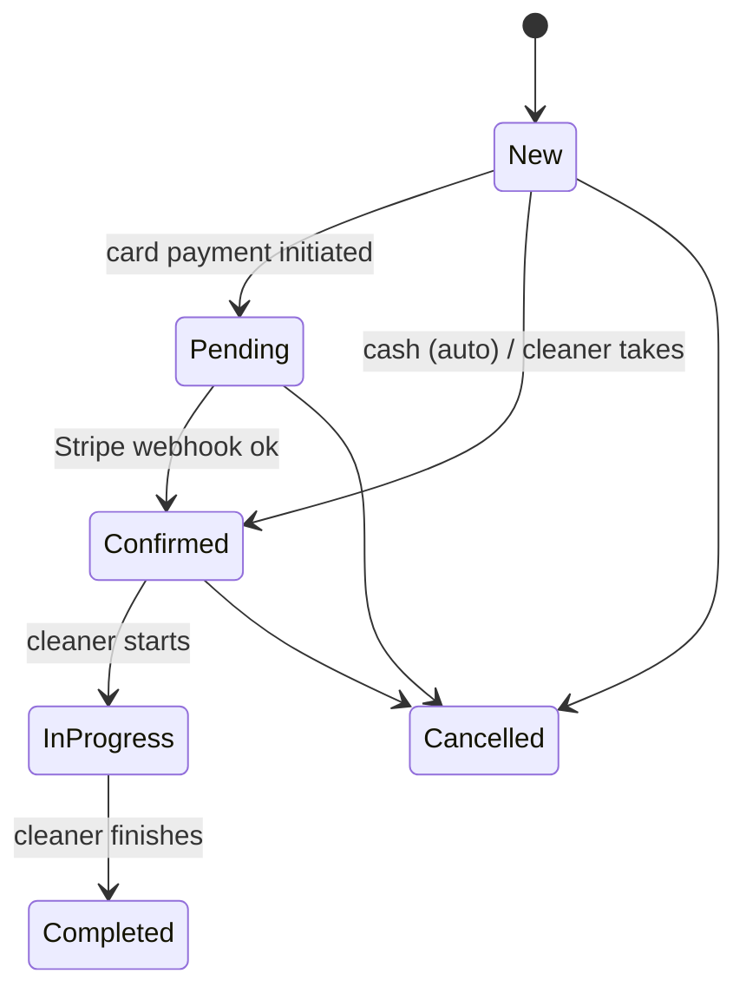

# Documentation — Role-Owned, Living, In-Parallel

Every role keeps its own living documentation, updated **in parallel with the work** by the role that
owns it. A finalized story/decision/ticket with stale docs is **not finalized**. This is how the team
keeps track of business logic, decisions, and implementation as the platform changes — instead of
docs rotting into fiction.

## Who owns what

| Role | Owns | Location | Contains |
|---|---|---|---|
| **Analysts** | the **business-logic** view | `agents/analysts/<domain>.md` | the domain's business rules in prose **+ Mermaid diagrams** (flows, state machines, decision trees), the living **story map** (which stories cover which capability), open questions |
| **Architects** | the **decision** view | `agents/architecture/decisions/<topic>.md` | living design notes, the trade-off space, current shape, links to the immutable ADRs. (The **ADRs** themselves stay in `backlog/adr/` — immutable once accepted; these decision docs are the *evolving* companion that explains the current state.) |
| **Developers** | the **implementation** view | `docs/architecture/*` (canonical, published) + short impl notes in the ticket | how it's actually built; kept in sync by the `docs` agent when behavior ships |
| **Docs agent** | the **published** site | `docs/**` (VitePress) + changelog | the polished, user/dev-facing output synced from the above |

> Internal deliberation/working docs live under `agents/` (not the published site). The published
> `docs/` stays the clean output. The three internal views (analyst/architect/dev) are separate trees
> so each role's living doc is theirs to maintain, but they **cross-link**: an analyst business-logic
> doc links the architect decisions and the dev docs for the same domain, and vice versa.

## Domains (the unit of documentation)
Use the same domain grouping as the audit, so docs map to how we think about the system:
`orders-booking`, `payments-fiscal`, `pay-payroll`, `employees`, `identity-auth`, `catalog-config`,
`loyalty-growth`, `disputes-addresses`. One `agents/analysts/<domain>.md` and the relevant
`agents/architecture/decisions/<topic>.md` per area.

## Mermaid diagram conventions (analysts)
Diagrams are **diagrams-as-code** (Mermaid in fenced ```mermaid blocks) so they live in Git, diff
cleanly, and render in the docs site. Per domain, maintain at least:
- a **flow** for each primary capability (e.g. "place an order", "complete a job", "subscribe to Plus"),
- a **state machine** for each lifecycle (order status, pay-period, dispute, membership),
- a **decision tree** where business rules branch (fiscal mode by country, cancellation-fee rate,
  pay-config override precedence).



(The example above is the order lifecycle — every domain's lifecycles get one like it, kept current.)

## The update rule (when, by whom)
- A **story** is finalized (survives the defense panel) → the **author analyst** updates
  `agents/analysts/<domain>.md`: add/adjust the business rule, update the diagram, add the story to the
  map — **in the same step**. The lead won't declare consensus if the doc wasn't updated.
- A **decision/ADR** is accepted → the **author architect** updates
  `agents/architecture/decisions/<topic>.md` and writes the immutable ADR.
- A **ticket** ships behavior → the **developer** updates the implementation note + flags the `docs`
  agent to sync `docs/**`; the `docs` agent updates the published page + changelog (Gate 7).

## Keeping it honest
- Docs describe what's **decided/built now**, not aspirations (aspirations are stories/tickets).
- A diagram that contradicts the code is a defect — the reviewer flags it like any other.
- Cross-links must resolve; a dangling link is a doc bug.
- The `docs` agent periodically reconciles the published `docs/` against the internal analyst/architect
  docs and the code, and raises drift as findings.
