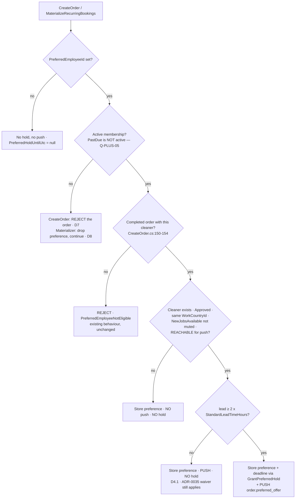

# ADR-0036 — A customer's preferred cleaner gets **first refusal, not priority**: a **lead-time-proportional exclusive hold on the order's FIRST seat**, stored as an absolute deadline (`Order.PreferredHoldUntilUtc`) that **expires by clock with no job, no sweep and no state transition**, capped so that **at least 90% of every seat's fill window is always open to the whole board**; the hold is **not created at all** when it cannot be acted on (lead time under `2 × StandardLeadTimeHours`, ineligible, unreachable or muted cleaner, non-member) while the **targeted notification is granted on a wider predicate than the hold**; and the perk becomes **Plus-only** at creation while **already-created orders keep what they were granted**

- **Status:** `accepted` — **panel complete, consensus reached 2026-08-02.** Author (`architect`),
  three independent challengers (`analyst` → the customer promise, `0036-A-promise.md`; `architect` →
  the visibility seam, `0036-B-visibility.md`; `optimizer` → the digest + query cost,
  `0036-C-digest.md`), lead adjudication in `## Verdict`. **The shape survived; the enumeration and
  two safety claims under it did not** and have been amended in place per §Defense. Acceptance carries
  **three named preconditions on the consumer tickets** and **two owner escalations** (§Verdict) —
  neither reopens the decision.
- ⚠️ **PARTIALLY SUPERSEDED, 2026-08-03, by owner instruction — see the dated section at the END of this
  file.** **D5.1's "Deliberately NOT checked (dynamic)" paragraph and alternative A6 are superseded in
  their TIME-CONFLICT half** by
  [ADR-0039](./adr-0039).
  A6's **weekly-cap** half stands. **Nothing else in this ADR is affected** — the hold mechanism,
  Invariant H, the six surfaces, the digest rules and the copy rulings are untouched. *(Pointer only.
  No decision text in the body below has been edited; the amendment is appended, per
  `adr/README.md` §"Accepted ADRs are immutable".)*
- ⚠️ **TWO ESCALATIONS ANSWERED, 2026-08-03, by owner instruction — see the SECOND dated section at the
  END of this file.** **`Q-PLUS-05`** (does `PastDue` keep perks during Stripe's retries?) → **NO —
  cut everything on first payment failure, no grace window**; D7's interim ruling becomes binding and
  **nothing in D7 changes**. **`Q-PLUS-04`** (should a lapsed member's recurring schedule keep
  materializing?) → **YES — occurrences keep being generated, at full non-member price, and the
  customer is notified of the price change**; D8.6's named asymmetry is now a **ruled** asymmetry.
  *(Pointer only. No decision text in the body below has been edited.)*
- **Date:** 2026-08-02 (proposed) / 2026-08-02 (accepted, amended by the panel)
- **Owner decisions carried by this ADR:** `Q-PLUS-03` → **plus-only**; **CH-2 → the hold floor is
  8 hours**, expressed as `2 * BookingPolicy.StandardLeadTimeHours`. Both are settled and are not
  reopened by any later reading of this document.
- **Supersedes:** — . **Composes with ADR-0035** (metered membership benefits — the express waiver;
  D3 below is where the two perks meet on one order) · **adopts ADR-0035 D2.1's placement rule**
  unchanged (*platform-wide numbers live on `BookingPolicy`; per-plan numbers live on `MembershipPlan`*)
  · **adopts ADR-0009 D2 / ADR-0035 D1's freeze principle** (*what was granted at creation is not
  re-derived later*) · **rides ADR-0002/ADR-0008** for the targeted push (outbox, unchanged) ·
  **rides ADR-0025** for the push display contract (loc-keys, unchanged) · **does not touch** ADR-0001
  (authorization), ADR-0007 (soft delete), ADR-0017 (region seam), or any fiscal path.
- **Applies to:** `Cleansia.Core.Domain` (one nullable column on `Order`, **two aggregate methods that
  own the hold pair**, one shared visibility rule in two forms, one nullable column on
  `RecurringBookingTemplate`) · `Cleansia.Infra.Database`
  (**two owner-run additive migrations**, no backfill, **no index — see D5.5**) ·
  `Cleansia.Core.AppServices` (one resolver, one
  factory wiring, one validator rule, one rule applied at **six** surfaces of **four kinds**, one
  notification event) ·
  **No host coupling — but stated precisely, because the draft's version was loose (CH-V9 "found
  sound").** The Partner + Partner-Mobile hosts are the only ones whose *behaviour* changes.
  `CanBrowseOrderAsync` is also executed by the Admin host (`AdminOrderController.cs:35-37`) and both
  Customer hosts (`Web.Customer`/`Web.Mobile.Customer` `OrderController.cs:107`), so the code does land
  in their path — **it cannot change what they see**, because `CanAccessOrderAsync` returns `true` for
  `Administrator` (`OrderAccessService.cs:37-41`) and for the order's own customer (`:49-52`), and
  returns `false` for any non-`Employee` role (`:54-57`) *before* the browse branch is reached
  (`:78-82`). "Byte-untouched" was the wrong claim; **"unreachable for those callers by an existing
  early return"** is the right one, and it is checkable. · **No NSwag-breaking change** (no field leaves
  or changes shape on any client DTO; one new error key is a string, not a contract change).
- **Ticket:** T-0495 (this ADR). **Consumers:** T-0515 (the dispatch rule + the comment corrections),
  T-0516 (the Plus gate — `Q-PLUS-03` is **answered**), T-0491 (the copy — its **sequencing** and ten
  constraints are decided here). **Six tickets the panel asks the PM to file**, of which **one (C0, the
  corrective copy wave) ships FIRST and two are preconditions of T-0515** — enumerated in §Verdict.
- **Owner input this ADR executes (verbatim, 2026-08-02):** *"It exists, you can select in the app but
  I think it doesn't work fully. And I'd like to have it working fully."* — so *withdraw the claim* is
  off the table; and, on whether the perk stays universal or becomes Plus-only: **"plus-only"**.
  **`Q-PLUS-03` is therefore ANSWERED and T-0516 is unblocked** (`questions/open.md:896-908` — the PM
  should record the answer there in the same pass).

> ## AC3 — the assignment-model sentence, at the top, in one sentence
>
> **No assignment-model change is required, anywhere, for any order:** the platform still *offers* and
> cleaners still *take*, `TakeOrder` remains the only path by which an order acquires a cleaner, and a
> preferred cleaner who does nothing is never assigned anything — this ADR changes **who may see and
> take an order for a bounded interval**, never **whom an order belongs to**.

> ## AC1 — the mechanism, in one sentence a test can check
>
> **An order that has no cleaner on it yet and carries a granted hold is invisible and un-takeable to
> every cleaner except the preferred one, until the earlier of `Order.PreferredHoldUntilUtc` and the
> moment any cleaner is assigned; from that instant it behaves in every respect exactly like an order
> that never had a preference.**
>
> *(Amended by the panel — CH-V4. The unamended sentence was false for the second seat: every order
> carries `MaxEmployees = RequiredEmployees + 1` (`Order.cs:519`, called unconditionally at
> `OrderFactory.cs:148`), so after the preferred cleaner takes seat 1 the original predicate hid the
> spare seat from the whole board — including from the beneficiary, whom `TakeOrder.cs:79-90` refuses
> a second seat. **The hold is first refusal on the order's FIRST assignment, not a lease on the
> order.**)*
>
> Corollary, and the reason this is safe: **the hold delays *assignment*, never the *appointment*.**
> The customer's cleaning time is a field they chose; nothing here moves it.

---

## Context — every citation re-verified by this panel by reading, 2026-08-02

### What exists (the PM's five findings, confirmed independently)

| Claim | Evidence |
|---|---|
| `Order.PreferredEmployeeId` is **written and read by nothing** | **CONFIRMED.** Whole-solution grep for `PreferredEmployeeId` returns 18 hits: the entity (`Order.cs:226`), its setter (`Order.cs:349`), its EF config (`OrderEntityConfiguration.cs:78`), the anonymizer (`Order.cs:621`), the factory pass-through (`OrderFactory.cs:124`), the command/DTO plumbing (`CreateOrder.cs:208,300`, `IOrderFactory.cs:67`), the validator (`CreateOrder.cs:140-154`), migrations, two tests, one comment, and `MaterializeRecurringBookings.cs:138` (`null`). **Zero queries, zero orderings, zero notifications, zero assignment logic.** |
| Dispatch is first-come-first-served | **CONFIRMED.** `TakeOrder.cs` gates on available spots (`:44`), caller-is-employee (`:49`), an address (`:51`, *"Availability is no longer a gate"* — `:102-105`), `ContractStatus.Approved` (`:53`), not-already-assigned (`:55`), a rating-tiered weekly limit (`:57`, 3/6/10 at `:135-140`), and a time conflict (`:59`). **`PreferredEmployeeId` appears nowhere in the file.** |
| The entity doc describes an algorithm that does not exist | **CONFIRMED.** `Order.cs:217-224` — *"The matching algorithm boosts this employee's score…"*, and *"today the field exists but no UI sets it"*. **Both halves are false**; three clients set it and no scorer exists. AC12: corrected by **T-0515**, verbatim text supplied in §Naming below. |
| The gate is wrong in the **opposite** direction from the copy | **CONFIRMED.** `CreateOrder.cs:140-154` fires only `When(PreferredEmployeeId is set && a user is signed in)` and asserts exactly one thing — `UserHasCompletedOrderWithEmployeeAsync` (`OrderRepository.cs:294-305`: an order with that employee assigned whose `CurrentStatus == Completed`). **There is no membership check of any kind**, while iOS advertises *"**Plus benefit** · choose someone who's cleaned for you before"*. |
| Recurring drops it | **CONFIRMED, and sharper than reported.** `MaterializeRecurringBookings.cs:138` passes `PreferredEmployeeId: null` — but `RecurringBookingTemplate` has **no field to pass**. `RecurringBookingTemplate.Create(...)` (`CreateRecurringBooking.cs:102-114`) takes userId, frequency, dayOfWeek, timeOfDay, rooms, bathrooms, savedAddressId, service/package ids, paymentType, startsOn, endsOn — **and nothing else.** The preference was never *modelled* on the template. This is a **design gap, not a dropped assignment** (D8). |

### The two facts that decide the mechanism, and neither is in the ticket

**Fact A (AMENDED BY THE PANEL — CH-V2 / CH-V5 / CH-Q10.1) — "may this cleaner see/take this order" is
answered at SIX places of FOUR kinds, and they already disagree with each other.** The author's original
table listed five homogeneous "surfaces"; all three challengers broke it, in three different places.
What replaces it:

| Kind | Surface | Call site | What the hold rule does here |
|---|---|---|---|
| **Queryable visibility** | partner board list | `GetPagedOrders.cs:91` → `OrderSpecification` (`RestrictToEmployeeId`, `:134-139`) | a **new independent term** ANDed in (D5) |
| **Queryable visibility** | mobile "available work" card | `GetAvailableJobsPreview.cs:50` → `DashboardSpecifications.CreateAvailableOrdersSpec` (`:8-29`) | same term — **but the spec must be given the id; it does not have one today** |
| **Queryable visibility** | **the dashboard count (surface 6, never named in the draft)** | `GetDashboardStats.cs:236` → the **same** `CreateAvailableOrdersSpec` | same term, same fix, free once the signature changes |
| **In-memory authorization** | order **detail** + order **photos** | `OrderAccessService.CanBrowseOrderAsync` (`:68-86`, `order.HasAvailableSpots` at `:85`), consumed by `GetOrderDetails.cs:45` **and** `GetOrderPhotos.cs:58` | the **in-memory form** of the same rule (D5) |
| **Write gate** | `TakeOrder` | `TakeOrder.Validator`, the `RuleFor(x => x.OrderId)` chain (`:38-45`) | folded **into the `ExistsAsync` rule's query** (D5.2) — not a new rule |
| **Notification freshness — NOT a disclosure surface** | the 30-min digest | `NewJobsDigestService.cs:98-122` | **two rules, deliberately**: the shared visibility term as a conjunct **and** D5.3's freshness disjunction. It emits a **count** (`:173`), never an identity — nothing can leak here; but a count that includes an order the cleaner cannot take is a lie. |

**Three corrections the panel forced, each verified by reading:**

1. **`CreateAvailableOrdersSpec` never sets `RestrictToEmployeeId`** (`DashboardSpecifications.cs:8-29`
   passes `excludeEmployeeId` and omits `restrictToEmployeeId`, which is a defaulted parameter at
   `OrderSpecification.cs:150`). The draft's *"ANDed alongside `RestrictToEmployeeId`… makes surfaces 1
   **and** 2 correct at once"* was **false**: it would have fixed one surface, left two leaking, and
   **passed §verify #2's grep**. A green grep over broken wiring is worse than no grep.
2. **`ExcludeEmployeeId` carries the caller's own id under the opposite polarity**
   (`OrderSpecification.cs:129-132` → *"orders I am NOT on"*). The hold term needs the same id with the
   inverse sense. **It must not reuse that parameter.**
3. **The set is not homogeneous and has already drifted**: `DashboardSpecifications.cs:24` uses
   `{Pending, Confirmed}`; `NewJobsDigestService.cs:52-53` uses `{New, Pending, Confirmed}` **under a
   comment at `:49-50` claiming it mirrors the former**. It does not. The draft's consequence *"the
   change makes that sprawl more reviewable"* is **withdrawn** (CH-Q10.1): a shared term is being added
   to surfaces that disagree on term #1. §verify #2 is rewritten from a hit count to a call-site check.

**And the fact that decides the fixtures:** `OrderStatus.Confirmed` is written by **three** paths and
only one involves a cleaner — `TakeOrder.cs:194` (a cleaner took it), `HandlePaymentNotification.cs:261`
(the Stripe webhook, **no cleaner**) and `ConfirmRecurringOrder.cs:111` (cash auto-confirm, **no
cleaner**). **`Confirmed` does not mean "a cleaner has it."** Any reasoning in this ADR or in a test
fixture that treats it that way is wrong: a cleanerless `Confirmed` order with two open seats is an
ordinary board row, and it is the row the hold is *for*.

**Fact B — the digest's freshness watermark is timestamp-based, and any suppression silently
un-notifies an order forever.** `NewJobsDigestService.cs:109-114` selects orders whose *latest*
`OrderStatusTrack.CreatedOn` is newer than the cleaner's `LastNewJobsDigestAt`. A held order's status
track is written at creation (`OrderFactory.cs:166`). **If a hold hides the order from other cleaners
for 45 minutes, then at expiry its status-track timestamp is older than every cleaner's watermark and
the order will never appear in any digest again** — it becomes board-only, discoverable solely by
someone who happens to scroll. That is precisely *"an order sitting unclaimed because we waited for one
person"*, arriving through a back door that no reasonable implementer would predict. **D5.3 fixes it.**

> **Panel amendment (CH-Q2/Q5/Q10).** Fact B is real and was independently reproduced. But the draft's
> fix was written as a `max(...)` **value** comparison against an instant in the **future**, which
> reintroduced the same defect one layer up (see D5.3, rewritten). And the root cause is broader than
> this ADR: `LastNewJobsDigestAt` is a **single per-cleaner scalar** that assumes "eligible to you" is
> monotone in time and derivable from a **global** timestamp on the order. Both assumptions fail for any
> **per-cleaner, non-monotone** eligibility rule. The overlap filter (`:135-143`) is the first such rule;
> **the hold is the second.** D5.3 is a point fix inside a design with a known structural limit — this
> ADR **does not** claim to resolve the class, and the overlap variant is filed separately.

### The trade-off space (the ticket's four mechanisms, priced against Fact A/B)

| Mechanism | Honours the preference? | Buys it with | Fatal problem |
|---|---|---|---|
| **Board ordering / visual boost** | **No.** Sorting is not exclusivity; a faster cleaner still wins. `GetAvailableJobsPreview` already sorts by `TotalPrice DESC` (`:54`) and the paged list is client-sorted. | nothing | **It honours nothing** — the ticket's own table says so, and the owner asked for *"working fully"*. It would let us keep the copy while changing no outcome. |
| **Notification-only nudge** | Weakly. The preferred cleaner hears first; anyone who has the board open still beats them. | nothing | Non-deterministic: it works only for orders nobody was looking at. Untestable as a promise. |
| **Exclusive hold (chosen)** | **Yes, deterministically.** | **latency, bounded and proportional** | The latency — answered by D3's 90% invariant and D5.3. |
| **Assignment model** | Yes | an epic + a product change | Out of scope by AC3; the platform has no assigner, no acceptance step, no decline flow, no reassignment path. |

---

## Decision

### D1 — The mechanism is a **first-refusal exclusive hold**; the promise is *first chance*, never *your cleaner*

For a bounded interval after the order is created, the order is **withheld from the board** and only the
preferred cleaner may see and take it. At the deadline it opens to everyone, unchanged.

**Why exclusivity and not a boost:** on a pull board, "priority" that is not exclusivity is a sort order,
and a sort order is not an outcome. The only lever a pull model actually has is *who the offer is shown
to*. Everything else is decoration.

**Why "first refusal" is also the honest name of the product.** The perk cannot be *"the same cleaner
every time"* — a cleaner is a person with a schedule, a weekly cap (`TakeOrder.cs:135-140`) and a life.
What the platform *can* guarantee is that they get the offer before anyone else does. **The copy must
promise that and nothing more** (§Copy).

### D2 — The hold is a **stored absolute deadline** on the order, not a duration evaluated at read time

`Order` gains **one nullable column** and — **panel amendment, CH-V1** — **two aggregate methods that
own the pair**:

| Field | Type | Notes |
|---|---|---|
| `PreferredHoldUntilUtc` | `DateTime?` (UTC) | Set **once**, at creation, **through `Order.GrantPreferredHold`**. **No independent setter.** **Never recomputed. Never updated** (except by the future decline action, below). `null` = **no hold, ever** — the default for every existing row and every order without a granted hold. |

```csharp
// Cleansia.Core.Domain/Orders/Order.cs — the ONLY writer of the pair.
// Throws on a null/empty beneficiary: a deadline without someone who can act on it
// is not a state this aggregate can be put into.
public Order GrantPreferredHold(string preferredEmployeeId, DateTime untilUtc);

/// Drops both halves together. Called by AnonymizeCustomerData() and by any future
/// path that returns an order to the board (D5.4, CH-V9).
public Order ClearPreferredHold();
```

**Why the aggregate owns it, and why this is not ceremony.** The draft left the pair to `OrderFactory`
and relegated the companion null-out to a parenthetical and a review checklist item. Challenger B then
reached the stranded state from shipped code: `Order.AnonymizeCustomerData()` (`Order.cs:613-626`) nulls
`PreferredEmployeeId` at `:621` and touches nothing else, and `Order.Create` independently null-collapses
the id at `:349` while the deadline would be assigned separately. **Two fields, two writers, one
invariant, no owner** — which is how the ADR's headline safety property came to be defended by a reviewer
remembering. It is now defended by the type system.

Four consequences, each of which is a reason:

1. **Expiry needs no actor.** `now >= PreferredHoldUntilUtc` is a `WHERE` clause. There is **no sweep,
   no timer, no outbox message, no status transition, no `IsActive` flip**. The failure mode of a
   job-driven expiry is *an order stuck held* — the exact catastrophic outcome. The failure mode of a
   clock comparison is that the clock is wrong. **The fallback is the absence of a hold, not an event.**
2. **The predicate keys on the DEADLINE, never on `PreferredEmployeeId`.** This is what makes the change
   safe for the ~existing corpus: every order ever created is `PreferredHoldUntilUtc = null`, so no
   legacy row acquires behaviour retroactively, and **no backfill and no data migration are needed.**
   (A predicate keyed on `PreferredEmployeeId` would have switched behaviour on for every historical
   non-member order the moment it shipped — see D7.)
3. **Tuning the policy cannot rewrite live orders.** If the fraction or the ceiling changes, orders
   already created keep the deadline they were granted. This is ADR-0009 D2 / ADR-0035 D1's freeze
   principle applied to time instead of money, and it is the same reason ADR-0035 stores `PeriodKey`
   rather than recomputing it.
4. **It makes two future changes cheap and one impossible-to-get-wrong.** A cleaner-side **"pass on
   this"** action (the natural follow-on, D5.4) is `PreferredHoldUntilUtc = now` — one write, no new
   column, no new state. Making the window **per-country** later (`CountryConfiguration`) is a change to
   the *computation*, with **no schema change and no effect on live orders**. A computed-at-read-time
   duration would have needed a new column for both.

**`PreferredEmployeeId` and `PreferredHoldUntilUtc` are deliberately two columns with two lifetimes.**
The first is *what the customer asked for* (a durable fact, already GDPR-handled at `Order.cs:621` — the
anonymizer now calls `ClearPreferredHold()` so both halves go together). The second is *what the platform
granted* (a policy outcome). Collapsing them would make "we stored your preference but could not act on
it" inexpressible, which is exactly the state D5.1 needs. **What must never exist is the reverse pair —
a deadline with no beneficiary** — and D2's amendment plus D5's null-beneficiary disjunct close it at
both ends.

#### D2.5 — The safety claim, restated so it is true (CH-V1)

The draft claimed *"an order stuck held is not expressible."* **That was false as written.** No branch of
the drafted predicate covered `PreferredEmployeeId == null && PreferredHoldUntilUtc > now`; every
disjunct is false, so such a row is invisible on every list, un-browsable on detail and un-takeable by
anyone for up to 12 hours — **with no actor permitted to clear it**, because D2.1 forbids the sweep that
would. The claim is replaced by one the code delivers:

> **The stuck-held state has no writer and no reader.** *No writer:* `Order.GrantPreferredHold` is the
> only path that sets the deadline and it requires a beneficiary. *No reader:* if a row carries the pair
> inconsistently anyway — a manual `UPDATE`, a bad backfill, a future writer — the visibility rule's
> `PreferredEmployeeId == null` disjunct treats it as **no hold**. **Fail-open at both ends.** That is
> what "not expressible" was reaching for and did not deliver.

**A safety property defended by a review checklist is not a safety property.** This is the general rule
the panel extracted, and it goes in the catalog.

### D3 — The window is **proportional to lead time**, with a ceiling, and is **zero below 8 hours' lead** (owner ruling on CH-2)

> **The governing rule, stated before its numbers:** *the hold may never consume more than a small
> fixed fraction of the time available to fill the order, and it may never touch an order that is
> already urgent — where "urgent" is defined as a **derivation of** the platform's one urgency constant,
> not as a second constant.*

```csharp
// BookingPolicy — platform-wide numbers, per ADR-0035 D2.1's placement rule.
public const decimal PreferredHoldFraction     = 0.10m;  // a tenth of the fill window
public const int     PreferredHoldCeilingHours = 12;     // and never more than this

/// PURE. Returns TimeSpan.Zero when no hold may be granted for this lead time.
public static TimeSpan ComputePreferredHold(DateTime cleaningUtc, DateTime nowUtc)
{
    var leadHours = (cleaningUtc - nowUtc).TotalHours;
    // 2 × the SAME constant that defines express. NOT a literal 8, NOT a second constant.
    if (leadHours < 2 * StandardLeadTimeHours) return TimeSpan.Zero;
    var hours = Math.Min(leadHours * (double)PreferredHoldFraction, PreferredHoldCeilingHours);
    return TimeSpan.FromHours(hours);
}
```

Worked, so a reviewer can check it by arithmetic rather than by reading:

| Lead time at creation | Hold | Fill window left open to the whole board |
|---|---|---|
| < 2 h | *not bookable* (`BookingPolicy.IsBelowMinimumLeadTime`) | — |
| 2–4 h — **the express band** | **0** (targeted push only, D4) | **100%** |
| 4–8 h — **the short-lead band** | **0** (targeted push only, D4) | **100%** |
| 8 h — the shortest hold the formula can produce | **48 min** | 7 h 12 (90%) |
| 24 h (next day) | 2 h 24 | 21 h 36 (90%) |
| 72 h (3 days) | 7 h 12 | 64 h 48 (90%) |
| 120 h (5 days) — where the ceiling starts binding | **12 h** (ceiling) | 108 h (90%) |
| 168 h (7 days — every recurring occurrence, D8) | **12 h** (ceiling) | 156 h (93%) |
| 30 days | **12 h** (ceiling) | 99.3% |

**The 8-hour floor is the owner's ruling on CH-2 and is settled.** The grounds, recorded so they are not
re-litigated: **(a)** at a five-hour lead the named cleaner is the *least* likely person on the board to
be free, precisely *because* the notice is short — the slot is on a day they have already planned — and
D5.1 deliberately checks neither the weekly cap (`TakeOrder.cs:125-143`) nor the time conflict
(`:145-161`) at creation, so the short-lead hold is the one most likely to expire unused; **(b)** a
24-minute hold fails the ADR's own test of what a hold must be worth granting (*"the smallest window that
always intersects a normal waking period"* — the criterion the draft applied at the ceiling and abandoned
at the floor); **(c)** the perk's audience is the planner, not the five-hours-from-now booker — D8 argues
recurring is the strongest case at 168 h. What it costs is the 4–8 h band, which under D4's amendment
**still gets the notification half of the perk** — so the floor now costs a *reduction* in the perk, not
its absence.

**Invariant H, RESTATED BY THE PANEL (CH-V4) — the draft's version was false for the second seat:**

> **For every SEAT on every order, at least 90% of that seat's fill window is open to the entire
> board.** The hold covers the order's **first** seat only and is spent the instant any cleaner is
> assigned; a seat that opens later — the spare seat every order carries (`Order.cs:519`), or a seat
> freed by an admin unassign — is never withheld from anyone. The hold can never be the reason an
> order or a seat goes unfilled, because it is never more than a tenth of the time there was.

*Why the restatement was needed:* the draft bounded the hold as a fraction of **the order's** fill
window. The preferred cleaner takes seat 1 at minute 3 of a 48-minute hold; `HasAvailableSpots`
(`Order.cs:116-117`) is still true; the drafted predicate returned **false for everyone else** for the
remaining 45 minutes, and `TakeOrder.cs:79-90` refuses the beneficiary a second seat. **A seat no one on
the platform may take** — the stuck-held catastrophe in its second reachable form, consuming 100% of
that seat's fill window, for a perk that had already been honoured. D5's consumption clause fixes it.

Four things fall out of this shape rather than being bolted on:

- **The express collision with ADR-0035 is resolved by construction, using a derivation of an existing
  constant.** `StandardLeadTimeHours` (4) is *already* the boundary between express and standard
  (`BookingPolicy.cs:18-24, 68-72`). The floor is `2 ×` it, so there is still **one** number in the
  codebase, expressed once, and the express/hold relationship stays **derivational, not duplicated** —
  if express moves to 6 h the hold floor moves to 12 h with no drift. What CH-7 was defending (a second
  *constant* is the drift) survives intact; only the coincidence of a shared literal is given up. A Plus
  member who books 3 hours out, uses their ADR-0035 express waiver **and** has a preferred cleaner gets:
  the waiver (ADR-0035 D1), **no hold**, and **the targeted push** (D4). Named as an accepted
  consequence below.
- **A minimum hold falls out for free.** The shortest lead time that gets any hold is 8 h, so the
  shortest hold the formula can produce is **48 minutes** — long enough to intersect a period in which
  someone checks their phone, short enough to be invisible, and comfortably longer than the outbox
  drain the signal rides on (CH-V8b). No extra constant, nothing to tune, nothing to get wrong.
- **The "leave enough time" clamp is unnecessary.** 90% always remains, at every lead time. A
  fixed-duration window (e.g. "30 minutes, always") would need such a clamp *and* would be 12.5% of a
  4-hour booking and 0.4% of a two-week one — arbitrary at both ends.
- **The ceiling exists for a supply reason, not a customer one.** Without it a 30-day-ahead booking
  would be held ~3 days. 12 h is chosen because it is the smallest window that **always intersects a
  normal waking period** for any creation time (a 22:00→10:00 hold still covers 07:00–10:00), which is
  the actual thing a hold needs to be worth granting.

**Rejected: making the window a per-plan number** (a hypothetical Pro tier holding longer). A longer
hold is *worse for the marketplace*, so it is a product lever that degrades fill rate as it upsells. If
a tier ever differentiates here it should be on *eligibility breadth*, not duration.

### D4 — The preferred cleaner gets an **immediate targeted push that bypasses the digest**; and the "hidden from the cleaner" rule is **deliberately dropped on their side only** (AC4)

**The push.** A new event key, produced inline in the create path exactly as `TakeOrder` produces
`OrderConfirmed` (`TakeOrder.cs:200-211`) — same `INotificationProducer`, same outbox
(ADR-0002/ADR-0008), same display contract (ADR-0025):

```csharp
/// Partner-targeted: a customer who has worked with this cleaner before asked for them
/// specifically, and the order is held for them until PreferredHoldUntilUtc. Args:
/// orderNumber (loc) + orderId (deep link). NOT argless, NOT a count — this is one order.
public const string PreferredOffer = "order.preferred_offer";
// GetCategoryFor: PreferredOffer => NotificationCategory.NewJobsAvailable
```

- **It bypasses the 30-minute digest cadence and does not touch `LastNewJobsDigestAt`.** Bypassing is
  the point: **the hold length must be set by the customer's tolerance for latency, not by our
  notification cadence.** If the preferred cleaner learned via the digest, the *minimum* useful hold
  would be 30–60 minutes for every booking — i.e. we would be buying
  latency to compensate for our own sweep interval. It must not stamp the watermark either: stamping
  would suppress the cleaner's next digest of *other* jobs. (CH-Q8 makes this sharper than the draft
  knew: the watermark's single writer is already fragile; a second writer on the create path would be
  the wrong kind of clever.)
- **It reuses `NotificationCategory.NewJobsAvailable`** for the opt-out. A cleaner who muted new-job
  notifications must not receive a push-shaped bypass of that mute.
- **Duplicate-signal note, accepted:** the preferred cleaner may also see the order counted in their
  next ordinary digest. Harmless; not worth a suppression rule.

#### D4.1 — **PANEL AMENDMENT (CH-P2 / CH-P4 / CH-2): the notification is granted on a WIDER predicate than the hold**

The draft coupled the two: no hold ⇒ no push. That is backwards in one direction and incomplete in the
other, and it is what left §Copy with no sentence that is true in every case (CH-P2).

> **`Reachable-and-able ⇒ notify. Notify + enough lead ⇒ hold.`** The resolver returns **two**
> outcomes, and the invariant runs one way only: **`HoldUntilUtc != null ⇒ NotifyPreferred == true`.**
> *"No signal ⇒ no hold"* survives exactly as stated; what is dropped is its false converse.

| Resolver outcome | Notify? | Hold? |
|---|---|---|
| Granted | **yes** | **yes** |
| `ShortLeadTime` (renamed from `ExpressLeadTime` — it is now the whole 2–8 h band, which is wider than express) | **yes** | no |
| `CleanerNotApproved` · `CleanerCountryMismatch` · `CleanerNotFound` | no | no |
| `CleanerMutedNewJobs` · `CleanerUnreachableForPush` | no | no |
| `NoPreference` · `NoMembership` | no | no |

**Three reasons this earns its one extra branch:**

1. **It makes the owner's 8-hour floor cheap.** Without it, the floor means the 2–8 h band gets *nothing*
   and a Plus member's short-lead booking silently ignores the perk they paid for. With it, the band
   gets the weaker half — which is exactly alternative **A2** (notification-only nudge), correctly
   rejected as the *primary* mechanism and correctly used as the *fallback* where exclusivity is unsafe.
   One outbox row; no exclusivity; no board cost.
2. **It shrinks the set of cases in which no honest sentence exists** (CH-P2) to precisely the cases in
   which the cleaner cannot be told anything at all — where no copy could have been true regardless.
3. **It puts reachability where it belongs.** The notify half is gated on exactly one question — *can we
   signal this person* — which is now checked properly (below), and the hold half inherits it.

**Reachability is a real check and the draft was missing two thirds of it (CH-P4).** The draft checked
`UserNotificationPreferences` only. The platform has **three** ways of not receiving a push, and the
other two are server-stored, statically knowable facts of exactly the shape the resolver's other checks
have:

- **`Device.NotificationsEnabled == false`** — `Device.cs:14-20`, verbatim: *"System-level kill switch
  driven by the OS notification permission. **When false, the push dispatcher skips this row entirely —
  even if the user's per-category preferences allow the event.**"*
- **No `Device` row at all** — which is the state of every cleaner who works from the **partner web
  SPA**; it registers no push devices (challenger's whole-app grep for `registerDevice|deviceToken`:
  zero files).

⇒ `HoldDeclineReason.CleanerUnreachableForPush = 8`, checked in D5.1, governing both halves.
**Named consequence, and it is a product fact, not a technicality: until the partner web app registers
devices, this perk is effectively mobile-cleaner-only.** A customer's favourite who works from the web
board gets neither push nor hold — correctly, because a hold with no signal is pure latency — but the
copy must not imply otherwise and the PM should know the perk's reach is bounded by push adoption.

**The privacy ruling (AC4), against `Order.cs:221-222` (*"Not exposed to the cleaner side (avoids
'they didn't pick me' awkwardness)"*):**

> **The rule is KEPT, absolutely, for every cleaner who was not chosen — and DROPPED, deliberately,
> for the one who was.**

- **The rule's stated purpose is fully preserved.** The awkwardness it names is felt by the cleaners who
  were *not* picked — and **exclusivity is invisible to the excluded by construction**: a board is a
  query result, not a diff. A cleaner who never sees an order cannot know it was withheld.
- **Telling the chosen cleaner is not awkward — it is the most valuable sentence we have for the
  supply side** (*"a customer asked for you again"*), and it is the only thing that makes a 48-minute
  hold get acted on. Suppressing it makes the push indistinguishable from the digest and destroys the
  mechanism's one lever.
- **It is not a secret we could keep anyway.** A cleaner offered a single job that nobody else appears
  to have will work it out in one booking. A "privacy" rule that survives exactly one use is not a rule.
- **The hard line that stays, and it is checkable:** `PreferredEmployeeId` never appears on any
  partner-facing DTO; no surface ever says "held for someone else"; no cleaner ever learns the identity
  of a preferred cleaner or that they themselves were passed over.

### D5 — Enforcement: **one rule, five terms, two forms, six surfaces** (rewritten by the panel)

Because six places already answer "may this cleaner see/take this order", the new condition is written
**once**, in the Domain, next to the entity. **Five terms, every one of which a challenger put there:**

```csharp
// Cleansia.Core.Domain/Orders/OrderVisibility.cs — the ONE rule.
//
// An order is open to `employeeId` unless a preferred hold is live, belongs to
// someone else, and has not yet been consumed.
//   1. no deadline            -> open   (every legacy row, every ungranted order)
//   2. no beneficiary         -> open   (CH-V1: fail OPEN on an inconsistent pair)
//   3. deadline passed        -> open   (the expiry, with no actor)
//   4. caller IS the benefic. -> open   (the perk)
//   5. the order already has a cleaner -> open   (CH-V4: the hold is first refusal
//                                                 on the FIRST seat, not a lease)
public static Expression<Func<Order, bool>> NotHeldFrom(string? employeeId, DateTime nowUtc)
    => o => o.PreferredHoldUntilUtc == null
         || o.PreferredEmployeeId == null
         || o.PreferredHoldUntilUtc <= nowUtc
         || o.PreferredEmployeeId == employeeId
         || o.AssignedEmployees.Any();

/// The SAME five terms, transcribed for a materialized entity. Sole caller:
/// OrderAccessService.CanBrowseOrderAsync. Pinned to the queryable form by TC-PREF-EQUIV-0.
public static bool NotHeldFrom(Order order, string? employeeId, DateTime nowUtc);
```

**Term 5 is broader than the challenger asked for, deliberately.** CH-V4 proposed
`o.AssignedEmployees.Any(ae => ae.EmployeeId == o.PreferredEmployeeId)` — "consumed when the beneficiary
is on the order". `Any()` strictly contains that case **and** covers the one it misses: an **admin**
assignment during a live hold (`AdminReassignOrder.cs:86,98`) would otherwise leave the spare seats
locked for a perk that has already been overridden by a human. The rule reads as a sentence — *a hold is
first refusal on an order's first assignment* — which is exactly what D1 promises, and it fails **open**,
which is this ADR's whole posture. It is also cheaper: a bare correlated `EXISTS` rather than a
column-to-column comparison inside one.

**Term 4's null semantics are a trap and both forms must handle it identically.** In SQL,
`PreferredEmployeeId = @emp` with a null parameter is `UNKNOWN` ⇒ the caller is never the beneficiary
(challenger C verified the emitted predicate). In C#, `null == null` is **true** ⇒ a caller with no
employee id *would be* the beneficiary. **A null or empty `employeeId` is never the beneficiary** — the
in-memory form must guard it explicitly. This is the single highest-value assertion in TC-PREF-EQUIV-0.

#### D5.0 — Why two forms and not one shared lambda (CH-V3, adjudicated)

Challenger B proposed one three-argument `Expression`, partially applied for the queryable form and
`.Compile()`d once statically for the in-memory form. **Rejected, on three grounds:**

1. **It does not deliver the equivalence it is bought for.** Sharing a tree does not make the two
   evaluators agree — see term 4 above: the *same* tree gives opposite answers for a null caller id under
   SQL three-valued logic and under C# equality. The property everyone wants must be tested either way;
   once it is tested, the machinery buys much less than it costs.
2. **The premise about the repo's machinery is wrong.** `ExpressionBuilder.Compose`
   (`ExpressionBuilder.cs:7-13`) rebinds **parameter → parameter** (`ToDictionary(p => p.s, p => p.f)`
   over `ParameterExpression`s). Partial application needs **parameter → captured value**, which is a
   *different* visitor that does not exist here. "No new technique" was not accurate.
3. **The "zero precedent for `.Compile()`" premise is also wrong** — and I checked because it was
   load-bearing: `LoginValidator.cs:48-50` compiles three selectors in production today, plus ~14 test
   sites. B's *conclusion* (never `.Compile()` inside a request) is right and is kept; the argument for
   it was not.

**What is adopted instead:** two members, adjacent in one file, over one documented term list, with the
in-memory one written as a literal transcription — **and the enforcement moved from review to a test**:

> **TC-PREF-EQUIV-0 (blocking).** Over a fixture table covering
> `(PreferredHoldUntilUtc ∈ {null, past, future}) × (PreferredEmployeeId ∈ {null, self, other}) ×
> (order has an assignment? {none, beneficiary, other}) × (callerEmployeeId ∈ {null, self, other})`,
> assert `db.Orders.Where(NotHeldFrom(caller, now)).Select(o => o.Id)` returns **exactly** the id set of
> `allRows.Where(o => NotHeldFrom(o, caller, now)).Select(o => o.Id)`. **Against PostgreSQL, not an
> in-memory provider** — an in-memory provider proves nothing about the translation, which is the only
> thing under test.

#### D5.0b — Where it is applied, and the wiring the draft got wrong

- **`OrderSpecification`** gains a **new independent property with its own `if` block**
  (`NotHeldFromEmployeeId` + `NowUtc`) — **not** a term inside the `RestrictToEmployeeId` block
  (`:134-139`), which `CreateAvailableOrdersSpec` never sets, and **not** a reuse of `ExcludeEmployeeId`,
  whose polarity is the opposite (`:129-132`).
- **`DashboardSpecifications.CreateAvailableOrdersSpec` changes signature** and **both** callers pass the
  id: `GetAvailableJobsPreview.cs:50` **and** `GetDashboardStats.cs:236`.
  *Cost note, corrected from the challenge:* `OrderSpecification.Create`'s parameters are **all optional**
  (`:144-150`), so adding two trailing ones compiles at all twelve call sites untouched. That is not a
  saving — **it is the danger**: a call site that forgets the new argument is a silent leak that builds
  green. Hence §verify #2 is a call-site check, not a grep count.
- **`OrderAccessService.CanBrowseOrderAsync`** (`:85`) uses the in-memory form. This covers
  `GetOrderDetails.cs:45` **and** `GetOrderPhotos.cs:58` in one edit — nobody should "fix" photos
  separately.
- **`TakeOrder.Validator`** — folded into the `ExistsAsync` rule's query (D5.2), not a new rule.
- **`NewJobsDigestService`** — the queryable form as a **conjunct**, plus D5.3's freshness disjunction.
  See D5.3 for why this surface carries two rules and why that is not a contradiction.

**The client is never the control** — every one of these is server-side, and the employee is
server-derived from the caller (`GetCallerEmployeeIdAsync`), never a client field (S1, the posture
`TakeOrder.cs:109-115` already documents).

#### D5.1 — When a hold is granted: `IPreferredCleanerHoldResolver`, a pure read, mirroring `CancellationPolicyResolver` / `IExpressWaiverResolver`

```csharp
// Cleansia.Core.AppServices/Services/Interfaces/IPreferredCleanerHoldResolver.cs
public interface IPreferredCleanerHoldResolver
{
    /// PURE READ. Never writes. Safe to call from the quote path and from the factory.
    Task<PreferredCleanerOutcome> ResolveAsync(
        string? userId, string? preferredEmployeeId,
        DateTime cleaningUtc, DateTime nowUtc, CancellationToken cancellationToken);
}

/// TWO outcomes, not one (D4.1). Reason carries WHY, so the decision is loggable and
/// testable rather than a bare null. INVARIANT: HoldUntilUtc != null => NotifyPreferred.
public record PreferredCleanerOutcome(
    bool NotifyPreferred, DateTime? HoldUntilUtc, HoldDeclineReason Reason);

public enum HoldDeclineReason { None = 0, NoPreference = 1, NoMembership = 2, ShortLeadTime = 3,
    CleanerNotApproved = 4, CleanerCountryMismatch = 5, CleanerMutedNewJobs = 6, CleanerNotFound = 7,
    CleanerUnreachableForPush = 8 }
```

**Checked at creation (statically knowable) — failure means NO hold, and the order goes straight to the
open board with zero latency cost:**

| Condition | Source | Why here |
|---|---|---|
| a preference is set | `input.PreferredEmployeeId` | trivially |
| the customer has an **active** membership | `IUserMembershipRepository.GetActiveForUserNoTrackingAsync` — the **one** live-membership predicate (`UserMembershipRepository.ActiveForUserQuery:20-31`), already used by `CancellationPolicyResolver:32`, `OrderFactory:77`, `QuoteOrder:142`, `CreateRecurringBooking:84-85` (⚠️ the last three call the **tracking** sibling — same predicate, one query method; citation corrected per CH-V-nit) | D7; **no second predicate is created.** `PastDue` is **excluded** — see D7's escalation |
| lead time ≥ `2 × StandardLeadTimeHours` (8 h) | `BookingPolicy.ComputePreferredHold` | D3 — **hold only.** A shorter lead still notifies (D4.1) |
| the cleaner is `ContractStatus.Approved` (or `Active`) and exists | `IEmployeeRepository` | a hold for a cleaner `TakeOrder.cs:53` would reject is pure latency — **and so is a push** |
| the cleaner's `WorkCountryId` == the order's service-address country | `Employee.WorkCountryId`, `Address.CountryId` | **the ticket's "different work country" case.** This is the same country key `NewJobsDigestService.cs:100` and `OrderFactory.cs:152` already use — not a new notion of country |
| the cleaner has **not muted** `NotificationCategory.NewJobsAvailable` | `IUserNotificationPreferencesRepository` (default-allow when the row is absent, matching `NewJobsDigestService.cs:155-158`) | D4 — no signal, no hold |
| **the cleaner is reachable at all** — ≥1 `Device` row with `NotificationsEnabled == true` | `Device.cs:14-20` | **CH-P4.** The mute check alone covers one of three ways not to receive a push; `Device.NotificationsEnabled` is a documented hard kill switch and "no device row" is the partner-web-only cleaner |

**Deliberately NOT checked (dynamic) — the hold is created and simply expires:** the **weekly order
limit** (`TakeOrder.cs:125-143`) and the **time conflict** (`:145-161`). Both can change in either
direction between creation and the moment the cleaner opens the app, so a creation-time check would be
wrong in both directions; and the cost of being wrong is bounded by Invariant H at ≤10% of the fill
window. **This is the AC6 interaction table**: the hold never *overrides* a `TakeOrder` gate — a
preferred cleaner who is over their weekly limit is refused exactly as anyone else would be, and the
order they were holding opens on schedule.

#### D5.2 — The take-time refusal must **not name the exclusivity** — and the placement is part of the decision

A cleaner with a stale board can still `POST` a take on a held order. The refusal returns the **existing
`BusinessErrorMessage.OrderNotFound`** — **no new error key, no new translation, no leak.**

**Placement (CH-V7 / CH-Q9 — this is mechanical and the draft left it to chance).** `TakeOrder.Validator`
runs `RuleFor(x => x.OrderId).Cascade(Stop).NotEmpty() → ExistsAsync/OrderNotFound →
HasAvailableSpotsAsync/NoAvailableSpots` (`:38-45`). Appended **after** the spots check, a **full** held
order returns `NoAvailableSpots` — the wrong error for the one case the rule exists for. And that chain
never resolves the caller's employee id (only the `RuleFor(x => x)` chain at `:47-60` does).

> **The hold predicate is folded INTO the existence rule**, not added as a third one: a repository method
> `ExistsVisibleToEmployeeAsync(orderId, employeeId, nowUtc)` carrying `OrderVisibility.NotHeldFrom` in
> its `WHERE`, with the employee id resolved server-side from `IOrderAccessService`, never from the
> command. The row is already being fetched, the outcome is already `OrderNotFound`, and read/write
> agreement holds **by construction with zero added round trips** — against a validator that already
> loads the same order three times (`:42`, `:65-68`, `:150-152`).

*Named consequence:* a non-employee caller (null employee id) now gets `OrderNotFound` on a held order
rather than `EmployeeNotFound`. That is the better answer — less enumeration — and it is deliberate.

**The general rule the draft wanted is too strong and the codebase already violates it (CH-V7).**
*"The refusal at the write gate must agree with what the same caller's read returns"* is broken today:
`HasAvailableSpotsAsync` returns `NoAvailableSpots` for a fully-assigned order that the same caller's
`GetPagedOrders` does not return at all (`RestrictToEmployeeId` = assigned-to-me OR has-a-spot,
`:134-139`). Shipping a catalog rule the codebase violates on day one is the "rule that keeps being
violated" failure mode. **The rule is narrowed to what is defensible and checkable — and it is what
§verify #4 already tests:**

> **Never introduce an error key that names the exclusivity. Reuse the most generic refusal the caller
> could already have received.**

This defends `OrderNotFound` for the held case without retroactively condemning a shipped error, and it
is the form that goes in `patterns-backend.md`. (Whether `NoAvailableSpots` is itself a leak is a
pre-existing question, filed separately, **not** decided here.)

#### D5.3 — The digest carries TWO rules: the shared visibility term (a conjunct) and a **bounded disjunctive** freshness term. **REWRITTEN BY THE PANEL — the drafted `max(...)` form was wrong in the direction it was meant to fix.**

**Fact B is real and D5.3 is still blocking.** Without a freshness fix, every held order that the
preferred cleaner declines silently falls out of the notification channel forever and becomes board-only
— turning a 48-minute optimisation into a permanent loss of reach. But the drafted fix,

```
availableToCleanerAt = max(latest OrderStatusTrack.CreatedOn, PreferredHoldUntilUtc)   // WRONG
```

compares the watermark against an instant that is **in the future**. Every prior input to that test —
`OrderStatusTrack.CreatedOn` — is always in the past; `PreferredHoldUntilUtc` is the first availability
instant in this system that is not. The consequence, walked with the ADR's own 24 h example
(hold = 2 h 24): from creation onward `max(...) > since` is **TRUE**, so the held order is counted in
`takeable` (`:142`), pushed as *"N new jobs"* (`:173`) to cleaners who **cannot see it** (D5) and
**cannot take it** (D5.2), and the watermark is stamped forward on every sweep (`:182`) until it has
walked **past the hold expiry** — at which point the order is genuinely available and permanently stale.
**Fact B, reproduced by the fix for Fact B**, plus a push count that is a lie for the whole hold window.

**The corrected specification — a *window*, not a lower bound, and written disjunctively:**

```
-- CONJUNCT 1: visibility. The SHARED rule (D5), same as every other surface.
(hold IS NULL OR preferredEmployeeId IS NULL OR hold <= @sweepStartedAt
 OR preferredEmployeeId = @cleaner OR EXISTS(assignment))

-- CONJUNCT 2: freshness. "Has this become new TO THIS CLEANER since their watermark?"
(EXISTS (h IN OrderStatusHistory : h.CreatedOn > @since)
 OR (preferredEmployeeId <> @cleaner AND hold > @since AND hold <= @sweepStartedAt))
```

Four rulings folded in, each of which changes what a reviewer must look for:

1. **Disjunction, never `max(...)` (CH-Q1).** `max(a,b) > k ⟺ a > k OR b > k`. The value form compiles —
   challenger C rendered the actual Npgsql output — to a per-row `CASE` over **two** correlated
   `max()` SubPlans plus a per-row `PreferredHoldUntilUtc::timestamptz` **cast on a column**, in a
   non-sargable position. §verify #6's original wording is what steered an implementer into it. The
   cast appears only when the two columns are compared *to each other*; comparing each to its own
   parameter emits none.
2. **The upper bound `hold <= @sweepStartedAt` is the CORRECTNESS condition (CH-Q2), not an
   optimisation.** It is what stops a future instant from marking an order "new" before it is available.
   Omitting it is a hard reject.
3. **The existing top-N is replaced, not wrapped (CH-Q5).** Today's clause is
   `EXISTS(SELECT CreatedOn … ORDER BY CreatedOn DESC LIMIT 1 WHERE CreatedOn > @since)` — a top-N
   subquery materialised per candidate row. Since `latest > k ⟺ max > k ⟺ ∃ > k`, it becomes a plain
   `EXISTS` semi-join servable from `IX_OrderStatusHistory_OrderId` (the only index on that table),
   able to stop at the first qualifying row. **Written this way D5.3 makes the digest query cheaper than
   it is today** — the opposite of what the draft conceded — and it removes a latent requirement for an
   `(OrderId, CreatedOn DESC)` index that does not exist. The equivalence is recorded here so a later
   reader does not "restore" the top-N thinking it was load-bearing.
4. **`nowUtc` is `sweepStartedAt`, the same value the sweep stamps (CH-Q4).** Captured once at
   `NewJobsDigestService.cs:57`, used at `:164`/`:182`, with the reason already in the comment at
   `:206-209`. If the predicate used `DateTime.UtcNow` while the watermark stamps `sweepStartedAt`, the
   two disagree by the sweep's duration; **`now` earlier than the stamp is permanent loss**, and that is
   not a property to leave to luck. **The digest must never call `UtcNow` inside the loop.**

**Why this surface carries two rules, and why that is not the contradiction it looks like (CH-V5,
adjudicated against the challenger on the substance and with them on the taxonomy).** Challenger B is
right that the digest emits a **count** (`:173`) and never an identity (`:120-122` projects
`{Id, CleaningDateTime, EstimatedTime}` and never leaves the service) — so it is **not a disclosure
surface** and D4's privacy line cannot be breached here. B concluded the shared visibility rule must
therefore **not** be applied. **That is wrong, and challenger C's own probe SQL contains both conjuncts.**
The count is the count of jobs *this cleaner can take* — the query already excludes full orders (`:101`)
and orders assigned to them (`:102`), and filters overlaps (`:135-143`). A hold is one more "can this
cleaner take it". Drop the conjunct and the freshness branch fires on the *creation* status track, and
the cleaner is pushed about an order that is invisible to them: CH-Q2's harm, arriving by the other door.

The two rules answer **two different questions** and compose as a conjunction — *may I take it* (shared,
never hand-rolled) AND *is it new to me* (local to the digest, and the only place this notion exists).
Stating them as competing rules over the same columns was the draft's error; stating them as one rule of
each kind is the fix. **The digest is the one surface that carries two, and that is now written down.**

#### D5.4 — What is **not** built, and why the shape leaves room for it

- **No early release when the preferred cleaner takes a conflicting job.** It needs either a sweep or a
  rescan inside `TakeOrder`, whose failure mode is an order stuck held. Bounded by Invariant H;
  **rejected on cost, recorded so it is not re-litigated.**
- **No cleaner-side "pass on this" action.** It only ever *improves* latency and it is one call
  (`Order.ClearPreferredHold()`, or a deadline set to `now`) against a shape that already exists — the
  natural follow-on ticket, deliberately not in the first wave because it adds a partner-side UI surface.
- **No re-arm rule for an order that returns to the board.** Challenger B's lifecycle attack **failed**
  and the result is worth recording: there is **no reschedule path** (`Order.CleaningDateTime` is
  `private set`, assigned only in `Order.Create:337`; no `RescheduleOrder`/`UpdateOrder` command exists),
  cancel-and-recreate is correct by construction (the new row resolves against its own lead time), and
  the only un-assign is `AdminReassignOrder.cs:86`, which re-assigns at `:98` inside the same handler.
  **The draft's "open edge" is not reachable today** and should say so. But it must be *designed*, not
  merely absent: under D5's term 5, an un-assign back to an empty order with a still-future deadline
  **re-arms the hold**. Therefore: **any future path that returns an order to the board unassigned must
  decide the hold explicitly**, and the default answer is `Order.ClearPreferredHold()` — one call, which
  is the second reason D2's aggregate methods earn their place.

#### D5.5 — `PreferredHoldUntilUtc` gets **no index**, and a partial index on it is a **hard reject** (CH-Q9)

This closes an open question the draft left open, and it reverses the draft's instinct. The predicate's
**satisfying set is NULL-dominant** — it matches ~100% of rows. A partial index
`WHERE PreferredHoldUntilUtc IS NOT NULL` indexes exactly the rows the predicate mostly *excludes*: it
cannot serve this predicate, would have to be BitmapOr'd with a scan for the `IS NULL` branch, and costs
maintenance on every `INSERT INTO Orders`. Its only conceivable reader is an admin view of live holds,
which D11 explicitly does not build.

**The term is a residual filter** evaluated after a selective index has narrowed the set:
`IX_Orders_CurrentStatus_CleaningDateTime` (`OrderEntityConfiguration.cs:111`) still drives the board
query, with the hold term appended as a flat column test — no cast, no subquery beyond the one correlated
`EXISTS` that the pre-existing `AssignedEmployees.Count < MaxEmployees` on the line above already pays
for. Selectivity *improves* over time (`Pending`/`Confirmed` are transient buckets; `Completed` grows
without bound). **Surfaces 1, 2, 3, 6 and the write gate are free; the entire cost of this ADR lives in
the digest**, and D5.3's rewrite makes that surface net cheaper than today.

### D6 — The customer is told **once, at booking, in the future tense** — and never watches a clock we set (AC2)

> **No new customer-visible order state. No countdown. No "waiting for Anna". No push when the hold
> expires.**

- A countdown converts a silent, bounded, invisible optimisation into a **watched wait**, and invents a
  state the order does not have (it is `New`/`Pending` either way; the customer's screen already says we
  are finding a cleaner).
- A push on expiry is a notification **whose entire content is bad news about something the customer did
  not know was in doubt.** *"Anna couldn't take it"* manufactures a disappointment out of a normal
  outcome. **A silent 30-minute delay is worse than the perk is better — but only if the customer is
  watching it.** This decision is what makes D3's latency acceptable.
- **The success case is already visible** where it belongs: the assigned cleaner on the order detail is
  the one they asked for, and the existing `order.confirmed` push fires unchanged (`TakeOrder.cs:200`).
- **What the customer IS told** is one sentence at the moment of choosing — §Copy, owned by T-0491.

#### D6.1 — **PANEL AMENDMENT (CH-P1 / CH-P2): D6's "told once" had no surface, and the platform already makes a contradicting numeric promise**

Two findings the draft did not have, both verified:

1. **The picker destroys its own explanation.** In both customer clients the explanatory line is the
   `?:` fallback for the selected cleaner's **name** — Android
   `PreferredCleanerPicker.kt:131-135` (`selected?.fullName ?: …subtitle`), iOS
   `ConfirmExtrasComponents.swift:71-73` (`selected?.fullName ?? …preferredCleanerSubtitle`). There is no
   other text in the row. **The sentence D6 rests everything on exists only while the customer has chosen
   nobody, and is destroyed by the act it explains.** ⇒ **Required, in the same wave as C2:** a
   **persistent second line that survives selection**, both clients × five locales, budgeted as **C2c**
   in D10 (the draft budgeted zero customer-client work).
2. **The platform already promises a number that this ADR contradicts.** Immediately after booking, both
   clients show *"Cleaner being assigned · **Within 1 hour**"* — Android `values/strings.xml:741-742`
   plus `values-cs/:731-732`, `values-sk/:728-729`, `values-ru/:728-729`, `values-uk/:728-729`; iOS the
   same keys — **unconditionally** (`BookingSuccessTimeline.swift:44-46` makes the `assigning` step
   active whenever no order status has loaded). A 12-hour hold is 12× that promise. The draft's entire
   latency argument assumed the customer had **no** expectation about time-to-assignment; the platform
   states one, as a number, in five languages, on the very next screen. **See §Copy for the ruling: the
   numeric claim is CORRECTIVE work — it is unbacked today (nothing in a pull board enforces an hour) —
   and it ships ahead of the mechanism, not with it.**

**What the panel did NOT adopt, and why.** Challenger A's alternative fix — resolve the hold at quote
time and ship a `firstChanceApplies` boolean to the client so the subtitle can be conditional — is
**rejected for the first wave**. It re-opens D6's core decision (no customer-visible hold state), it adds
a customer-DTO field this ADR promised not to add, and the answer is not stable: a quote is not a
booking, and lead time, membership and the cleaner's reachability can all change between the quote and
the submit, so a "yes" shown at quote time can be a "no" at creation — a *worse* failure than saying
nothing. **The static sentence is made true instead**, two ways: D4.1 shrinks the decline set to the
cases where the cleaner cannot be told anything at all, and §Copy constraint 6 requires a sentence that
is true in **both** outcomes. Recorded as the named follow-on if the static sentence proves insufficient.

#### The AC2 fallback state machine

```mermaid
stateDiagram-v2
    direction LR
    [*] --> Open : hold NOT granted<br/>(no preference · not Plus · lead &lt; 8h ·<br/>cleaner unapproved/wrong country/muted/unreachable)
    [*] --> Held : hold granted<br/>(PreferredHoldUntilUtc = created + min(10% lead, 12h))

    Held --> Claimed : preferred cleaner calls TakeOrder<br/>(all normal gates still apply)
    Held --> Open : now &ge; PreferredHoldUntilUtc<br/><b>NO ACTOR — the clause simply stops being true</b>
    Held --> Open : ANY cleaner is assigned<br/><b>the hold is CONSUMED — first seat only (CH-V4)</b>
    Open --> Claimed : ANY eligible cleaner calls TakeOrder

    Held --> Cancelled : customer / admin / system cancel
    Open --> Cancelled : customer / admin / system cancel

    Claimed --> [*]
    Cancelled --> [*]

    note right of Held
      Held == deadline in the future AND a beneficiary AND no cleaner on the order.
      Visible + takeable ONLY to the preferred cleaner (D5: 6 surfaces, 4 kinds).
      Others: GET returns nothing, POST returns OrderNotFound (D5.2).
      Customer sees: nothing different in-flight (D6); told once at booking (D6.1).
      Digest for others: order becomes "new" in the window (expiry, sweepStart] (D5.3).
      A deadline with NO beneficiary is NOT this state — it is Open (D2.5 / CH-V1).
    end note
```



**The two `Held → Open` edges are the whole design.** Neither has a writer, a message, a job or a row
change: one is the clock passing the deadline, the other is a row appearing in `OrderEmployees` for a
reason that has nothing to do with the hold. **A state you leave without anyone acting cannot strand.**

#### And the decision tree at creation



**Note the order of the two gates, which is the D4.1 amendment:** reachability is tested **before** lead
time, because it governs both halves; lead time is tested last, because it governs only the hold.

### D7 — The Plus gate (AC8): server-side, at creation, **reject rather than silently ignore**; nothing already granted is taken back

**The owner ruled Plus-only. `Q-PLUS-03` is answered.** The specification T-0516 implements:

- **Where:** a **second `MustAsync`** inside the *existing* `When(...)` block at `CreateOrder.cs:140-147`
  — beside `PreferredEmployeeIsEligibleAsync`, not in the handler. (The recurring perk gates in its
  *handler* instead — `CreateRecurringBooking.cs:84-91`. **Observation, not a change:** the two perks
  gate in two different layers. The `CreateOrder` gate belongs in the validator because the rule it
  joins is already there and CLAUDE.md puts validation in validators.)
- **How:** `IUserMembershipRepository.GetActiveForUserNoTrackingAsync(userId) is not null`. **The one
  live-membership predicate**, no new expression, exactly as D5.1.
- **Error:** a new `BusinessErrorMessage.PreferredEmployeeMembershipRequired`, mirroring the shipped
  `RecurringTemplateMembershipRequired`. ⚠️ **Five languages × the per-client error namespaces** — the
  prefix differs per client; a key added under one client's `errors.*` does not resolve in another.
  **Its five translations must name the ACTION, not the rule (CH-P6).** The mirrored string
  (`en.json:1569` — *"Recurring cleanings are a Cleansia Plus benefit — subscribe to set one up"*) is
  fine when the customer is *starting* something optional; on a booking they have already filled in it
  is an upsell at the moment of failure with no statement of what to do next. D7's own justification for
  rejecting rather than ignoring is *"a human is present and can fix it in one tap"* — **which is only
  true if the message names the tap.** Constraint for T-0491, e.g. *"Cleansia Plus is needed to request
  a specific cleaner. Remove the cleaner request to book now."*
- **Anonymous bookings are untouched.** The `When` already requires a signed-in user
  (`CreateOrder.cs:140-141`); a guest cannot set a preference today and still cannot.

**Reject, not silently ignore — and the precedent is in the same four lines.** The alternative (accept
the order, null the field) means a customer who *believes* they got the perk gets nothing, with no
signal — the same class of failure as ADR-0035's shipped *"same-day"* copy: a false statement to a
paying customer. **Decisive evidence:** this field **already fails the whole order** when the preference
is ineligible (`CreateOrder.cs:143-146` → `PreferredEmployeeNotEligible`). Rejecting on membership is
**consistent with the shipped posture for the same field**, not a new harshness — and the client gates
the picker on membership, so the error is nearly unreachable in practice.

**AC8's other half — what happens to people who have it today:**

| Case | Ruling | Why |
|---|---|---|
| **An existing non-member order that already carries a preference** | **Left exactly alone. No backfill, no null-out.** | It is a historical fact about a booking made under the rules of the day; rewriting it is rewriting a customer's order after the fact. And it is **inert by construction**: `PreferredHoldUntilUtc` is `null` on every pre-existing row, and the predicate keys on the deadline (D2.2), so those orders keep behaving exactly as they do today — which is *no differently from any other order*. **Zero-risk by design, not by care.** |
| **A non-member's *next* order** | Rejected at creation with the new error; they rebook without the preference (one tap). | The gate is a creation-time rule. |
| **A member who lapses — orders already created** | **The hold stands.** Not re-evaluated, not cancelled. | ADR-0009 D2 / ADR-0035 D1's freeze: what was granted at creation is not re-derived later. Practically moot — the hold is over within ≤12 h. |
| **A member who lapses — new orders** | Gate applies; rejected. | — |
| **A member who lapses — recurring templates** | The occurrence materializes **without** the preference and **without** a hold; the cleaning still happens. | D8 — the one deliberate asymmetry. |
| **A `PastDue` member (card failed, Stripe retrying)** | **Rejected, on the one live-membership predicate — and ESCALATED to the owner as `Q-PLUS-05`.** | See below. |

**The `PastDue` hole, and why it is an escalation rather than a ruling (CH-P6).** The platform documents
a grace window it does not implement: `MembershipStatus.cs:18-19` says verbatim *"PastDue = 2 — Latest
invoice failed; Stripe is retrying. **Benefits still apply during the grace window.**"* — while
`UserMembership.IsActive` (`:84-85`) and the one live-membership predicate
(`UserMembershipRepository.cs:27-29`) both require `Status == Active`. **PastDue is excluded from both.**
D7 does not merely inherit that: **D7 makes it load-bearing for a hard rejection of an entire booking**,
for a customer whose card is still being retried and who has been told their benefits continue.

- **Escalated:** *"does a failed card payment revoke Plus perks immediately, or after Stripe's retries?"*
  is a business decision with revenue and support consequences — the owner's, not an architect's.
  **`Q-PLUS-05`, for the PM to record.** It is **not** blocking: it changes one `WHERE` clause.
- **Interim ruling so T-0516 is not blocked:** the gate uses **the one live-membership predicate,
  unchanged** — `PastDue` is not active. Grounds: inventing a second membership predicate for one perk is
  precisely the drift D5.1 exists to prevent, and if the owner rules the other way the change lands in
  **one place**, which is the whole reason there is one predicate. **And in the same wave,
  `MembershipStatus.cs:18-19`'s comment is corrected** so the enum stops documenting a window that does
  not exist — a rejection path whose predicate contradicts the platform's own comment is not shippable
  either way.
- **`TC-PREF-GATE-3` exists regardless of the answer**, because today the behaviour is decided by an
  unstated `WHERE` clause and nothing pins it.

**A second, narrower hole in D7's reachability defense (CH-P6, accepted, not blocking).** D7 argues the
error is "nearly unreachable" because the client gates the picker on membership. `GetMyMembership.cs:35`
does use the same predicate — but both pickers cache per session (iOS
`PreferredCleanerViewModel.swift:27-29` loads once per view-model lifetime; Android
`PreferredCleanerPicker.kt:78-82` refreshes only when the membership state is null, against a singleton
repo its own comment calls possibly stale). A webhook landing mid-session leaves the picker on screen and
the submit rejected. Narrow, real, and it is the *whole* of the reachability defense — which is why the
error message naming the tap (above) is a requirement and not a nicety.

### D8 — Recurring (AC7): the preference was never modelled on the template; it should be, and the gate degrades there instead of rejecting

**The finding, precisely.** `MaterializeRecurringBookings.cs:138` passing `null` is *not* a dropped
assignment — `RecurringBookingTemplate` has **no field to pass** (`CreateRecurringBooking.cs:102-114`).
No client can express a preference on a schedule. **This is the strongest case for the perk, wired to
nothing:** a recurring customer is precisely the customer who wants the same cleaner, recurring lead
time is ~7 days (`HorizonDays = 7`), and at 168 h the hold hits the 12 h ceiling — **7% of the fill
window**, the cheapest hold the system can grant.

**Ruling — in scope for the decision, out of scope for T-0515:**

1. `RecurringBookingTemplate` gains **`PreferredEmployeeId`** (nullable, `MaxLength(26)`) — an additive
   migration; `CreateRecurringBooking.Command` and the clients gain the field.
2. `MaterializeRecurringBookings.cs:138` passes `template.PreferredEmployeeId`, and the factory resolves
   the hold with the same resolver (D5.1).
3. **The sweep must re-run the gate, and when it fails it DEGRADES rather than rejects.** The sweep has
   no user session (`GetQueryableIgnoringTenant` + a per-template tenant override, `:54-74`) and runs
   long after the template was created; a membership can lapse, and a cleaner can leave, in between. So
   at materialization: resolve → **no active membership / ineligible cleaner ⇒ materialize the
   occurrence with `PreferredEmployeeId = null` and no hold**, and **never** fail the occurrence.

   **The asymmetry with D7 is deliberate and is the point:** at `CreateOrder` a human is present to read
   an error and fix it in one tap; in a 03:00 sweep there is nobody, and the only alternative to
   degrading is **dropping a customer's cleaning** because a perk lapsed. *Reject where someone can
   react; degrade where nobody can.*
4. **`CreateRecurringBooking` is already Plus-gated** (`:84-91`), so the *template* gate exists; this
   adds only the per-occurrence re-check.
5. **PANEL AMENDMENT (CH-P5) — the conversion moment is a named case.** `order_detail_make_recurring`
   ("Make this recurring") prefills the recurring wizard **from a past Completed order**
   (`recurring-bookings.facade.ts:167-180`) — by definition an order the customer completed *with a
   cleaner*, i.e. exactly the customer the perk is for, quite possibly an order carrying
   `PreferredEmployeeId`. The conversion drops it **silently**, and the platform already owns the
   disclosure surface for exactly this: `prefill_dropped_items` (*"We removed these from your prefill —
   they're no longer available: &#123;&#123;items}}"*). ⇒ **C3 must carry the preference through the prefill; until
   C3 lands, the dropped preference belongs in that existing disclosure**, not nowhere.
6. **PANEL AMENDMENT (CH-P6) — name the asymmetry this creates, do not let it be discovered later.**
   `MaterializeRecurringBookings.Handler`'s constructor (`:39-47`) takes **no** membership repository:
   the sweep checks membership **nowhere** today, so a lapsed member's schedule keeps materializing. D8.3
   adds a membership re-check **for the preference only** — meaning the *smaller* perk is revoked on
   lapse while the *larger* one (the Plus-gated schedule itself) is not. That is defensible under *"never
   drop a cleaning"*, but it is a **new asymmetry this ADR creates**, and it is stated here rather than
   found later: **materialization itself is deliberately not membership-gated; only the preference is.
   Whether a lapsed member's schedule should continue is `Q-PLUS-04`, escalated to the owner, not this
   ADR's to decide.**

**Filed as its own ticket, not folded into T-0515** — it is a second migration, a second client surface
(three clients' recurring UI) and a different failure posture. Sizing in D10 (C3).

### D9 — Eligibility (AC5): **KEEP `UserHasCompletedOrderWithEmployeeAsync` unchanged** — and it is now load-bearing in a way it was not before

The ticket asks whether requiring a *completed* order with that cleaner is still right once the perk is
real. **It is, and the hold makes it more important, not less:**

1. **It is the only thing stopping the perk from becoming a customer-controlled targeting primitive.**
   Without it, `PreferredEmployeeId` is *any employee id a client chooses*, and a hold would let a
   customer **withhold an order from the entire board and hand it to a cleaner they name**. With it, the
   set of holdable-for cleaners is exactly the set the customer has already been served by — and the
   error already prevents enumeration of foreign employee ids.
2. **The validator and the picker already agree exactly, and this is worth preserving.**
   `GetMyServingCleaners.cs:27-28` feeds the picker from `CurrentStatus == Completed`;
   `OrderRepository.cs:300-304` validates on `CurrentStatus == Completed`. **Same predicate, same
   column.** A reviewer can check the agreement in two greps. Changing one without the other would make
   the picker offer a cleaner the server then refuses.
3. **"Unusable for a new subscriber's first booking" is correct behaviour, not a defect.** The perk is
   *"the cleaner you already trust"*; before the first clean there is no such person. The repository's
   own comment already reasons this out (`:296-299` — *"you can't request 'the cleaner I'm currently
   with'… they need to have finished one"*). **It is not the reason nobody uses it — the reason nobody
   uses it is that the field is read by nothing.**
4. **Completed, not merely assigned, is right:** a cleaner who took an order and cancelled it should not
   become a preferrable relationship.

### D10 — Implementation candidates (AC9). **This ticket builds nothing** — `git diff --stat -- src/` is empty.

| # | Candidate | Size | Ticket |
|---|---|---|---|
| **C0** | **The corrective copy wave — ships FIRST, depends on nothing.** Remove the numeric *"Within 1 hour"* claim (2 clients × 5 locales); remove the **assignment verbs** from `benefit_favorite_body` cs/sk/ru and the priority claim from en/uk; drop *"on every booking"* until C3; stop selling the perk on web surfaces that cannot reach it. **No code.** | **S** | **NEW — PM to file, ahead of C1/C2** |
| **C1** | **The Plus gate.** One `MustAsync` in the existing `When` block + one `BusinessErrorMessage` + 5 languages × the per-client namespaces + a client-side picker gate + the `MembershipStatus.cs:18-19` comment correction. **No migration, no NSwag change.** | **S** | **T-0516** (unblocked — `Q-PLUS-03` answered) |
| **C2a** | **The hold, server-side.** `Order.PreferredHoldUntilUtc` (⚠️ **`ef-migration`, owner-only**) + `Order.GrantPreferredHold`/`ClearPreferredHold` + `OrderVisibility.NotHeldFrom` (both forms) + `BookingPolicy.ComputePreferredHold` + `IPreferredCleanerHoldResolver` + `OrderFactory` wiring + the rule applied at **all six** surfaces (incl. `CreateAvailableOrdersSpec`'s signature change and `GetDashboardStats.cs:236`) + **D5.3's rewritten digest clause** + the `NewJobsDigestService.cs:49-50` false-comment fix + the `Order.cs:217-224` comment correction (AC12) + tests incl. **TC-PREF-EQUIV-0 against Postgres**. | **M** | **T-0515** |
| **C2b** | **The targeted push.** `NotificationEventCatalog.PreferredOffer` + `GetCategoryFor` + the producer call **on the wider notify predicate (D4.1)** + loc-keys on **both** partner clients × 5 languages (ADR-0025). | **S** | **T-0515** (same release — see below) |
| **C2c** | **The customer-side copy the draft budgeted at zero (CH-P2).** A **persistent** explanatory line on the picker row that survives selection — Android `PreferredCleanerPicker.kt:131-135`, iOS `ConfirmExtrasComponents.swift:71-73` — × 5 locales, plus the picker **title** change (all five locales, both clients). | **S** | **T-0491** (must ship **with** C2) |
| **C3** | **Recurring carry-through (D8).** `RecurringBookingTemplate.PreferredEmployeeId` (⚠️ **second `ef-migration`, owner-only**) + command/DTO field (⚠️ **`nswag-regen`, owner-only**) + materializer wiring + the degrade rule + the `prefillFromOrder` case + three clients' recurring UI. | **S–M** | **NEW — PM to file** |

**AC9's "any L is split in the ADR": C2 was an L and is split above.** C2a/C2b are **two tickets, one
release**: C2a alone creates holds for a signal that arrives *after* the window closes. **If only one can
ship, ship neither.** The rule that enforces this without a process note is D4.1's invariant:
`HoldUntilUtc != null ⇒ NotifyPreferred`; with C2b absent there is no targeted notification, so C2a must
grant no holds, so C2a alone is a no-op by its own logic. **C2c ships with them** — a mechanism the
customer is told nothing truthful about is the failure this ADR exists to end.

**Sequencing (panel ruling on CH-P7 — this ADR adopts ADR-0035's corrective-ships-first rule rather than
filing copy under "not blocking"):**

1. **C0 ships first and waits for nothing.** Every statement in it is false **today**, independent of
   this build. *"Waiting for the mechanism to ship is choosing to keep a false statement live for the
   length of a build."*
2. **C1 may ship before C2** — a gate with no mechanism behind it is *less* wrong than today, because
   today the copy claims a Plus perk the server does not gate.
3. **C2a + C2b + C2c ship together.**
4. **C3 whenever; its copy dependency is discharged by C0.**

### D11 — Scope boundary

- **In scope:** the mechanism, the window, the fallback, the notification, the privacy ruling, the
  eligibility ruling, the Plus-gate specification, the recurring ruling, the naming corrections, and the
  catalog + living-doc updates.
- **Byte-untouched:** `TakeOrder`'s six existing gates (the hold rides *inside* the existing existence
  rule; none of the six is modified), `OrderStatus` and the lifecycle, the pay formula,
  `EmployeePayConfig`, every fiscal path, `ITenantEntity` / the global query filter, `IIdempotencyGuard`
  / `ProcessedMessage`, the outbox contract.
- **Behaviour-untouched but code-touched:** the Customer and Admin API hosts, which execute
  `CanBrowseOrderAsync` and cannot reach its browse branch (see §Applies-to). **Do not restate this as
  "byte-untouched"** — the panel corrected that once.
- **Not decided here:** the copy's final wording (T-0491 — §Copy constrains it), the web wizard's
  missing picker, an admin view of holds, and a cleaner-side decline action (D5.4).

---

## Alternatives considered

| # | Alternative | Why not |
|---|---|---|
| **A1** | **Board ordering / a visual boost — the preferred cleaner sees it pinned at the top, anyone can take it.** Genuinely attractive: cosmetic, zero schema, zero latency, zero risk to fill rate, and it cannot strand an order. | **It honours nothing, and the owner asked for "working fully".** First-come still wins: a cleaner refreshing the board beats a cleaner reading a pin. Worse, it is **unfalsifiable as a promise** — there is no test that distinguishes "the boost worked" from "they happened to be first", so we could never tell a customer whether they got what they paid for. It also does not survive its own surface: `GetAvailableJobsPreview.cs:54` sorts by `TotalPrice DESC`, so a boost would have to fight an existing ordering on one of the two board surfaces and be absent on the other. **Kept in the record because it is the correct answer if a challenger shows Invariant H does not hold.** |
| **A2** | **Notification-only nudge — push the preferred cleaner first, change no visibility.** | Strictly weaker than A1 plus a push: it works only for orders nobody happens to be looking at, so the perk's value is inversely proportional to how healthy the marketplace is. And it still costs the push. If we are going to build the targeted notification anyway (D4), the marginal cost of making it *mean* something is one nullable column. |
| **A3** | **A fixed window for everyone (e.g. "30 minutes, always").** The simplest thing that could work, and easy to explain. | 30 minutes is **12.5% of a 4-hour booking and 0.4% of a two-week one** — arbitrarily aggressive at the urgent end and pointlessly timid where holding is free. It needs a separate "don't do this on express bookings" clamp (a second rule that can drift from `StandardLeadTimeHours`), whereas the proportional form gets that boundary from the constant that already defines express. And it makes Invariant H unstateable. |
| **A4** | **A duration constant read at query time** (`created + HoldMinutes > now`), no stored column. | Saves a migration and costs correctness three ways: **(a)** tuning the constant retroactively moves the expiry of every live order — the same history-recompute defect ADR-0035 A1 was rejected for; **(b)** the predicate would key on `PreferredEmployeeId`, so **every historical non-member order would acquire hold behaviour the moment it shipped** (D2.2); **(c)** it makes the future decline action (D5.4) and any per-country window need a new column anyway. The migration is one additive nullable column with no backfill. |
| **A5** | **Expire the hold with a background job / a sweep** (an `OrderStatus`, an outbox message, or a hook on the existing recurring/stale-order sweeps). | The failure mode is **an order stuck held** — the exact catastrophe the ticket names. A clock comparison in a `WHERE` clause has no failure mode of that shape, no queue, no retry, no dead letter, and no operational surface. This is the same instinct ADR-0035 D3.2 used in the opposite direction (a sweep is right for *reclaiming* an orphan; it is wrong for *the primary path*). |
| **A6** | **Check the weekly limit and time conflict at creation and skip the hold if the cleaner cannot take it.** | Both are genuinely dynamic (`TakeOrder.cs:125-161`): the limit resets weekly and the conflict depends on orders taken *after* creation. A creation-time check is wrong in both directions — it suppresses holds for cleaners who will be free and grants them to cleaners who will not. Cost of being wrong is capped at 10% of the fill window (Invariant H), which is cheaper than a check that is confidently wrong. |
| **A7** | **Release the hold early when the preferred cleaner takes a conflicting job.** | Needs a sweep or a rescan inside `TakeOrder`; reintroduces A5's stuck-order failure mode for a saving bounded by Invariant H. **Rejected on cost, not on principle** — and the stored-deadline shape (D2) makes it a one-line write if a challenger shows the saving is real. |
| **A8** | **Show the customer a countdown / notify them when the hold expires.** | D6. It converts a bounded invisible optimisation into a **watched wait** and manufactures a disappointment out of a normal outcome. A push whose entire content is *"the person you asked for couldn't come"* is worse than the perk is better. |
| **A9** | **Keep `Order.cs:221-222` literally — never tell even the preferred cleaner.** | D4. The rule's purpose (protecting the cleaners who were *not* chosen) is preserved for free by exclusivity being invisible to the excluded; applying it to the chosen cleaner makes the push indistinguishable from the digest, which removes the only reason a 24-minute hold gets acted on — and it is a secret that survives exactly one booking anyway. |
| **A10** | **Silently ignore `PreferredEmployeeId` for non-members instead of rejecting.** | D7. It ships a silent downgrade to a paying customer's expectation, and it **contradicts the shipped posture for this very field** — an *ineligible* preference already fails the whole order (`CreateOrder.cs:143-146`). Two different failure modes for two failures of the same field is how a support thread becomes unanswerable. |
| **A11** | **Null out `PreferredEmployeeId` on existing non-member orders when the gate lands.** | D7. Rewriting a customer's booking after the fact for a policy that did not exist when they booked, in exchange for nothing: those rows are already inert because the predicate keys on the deadline, which is `null` on every one of them. A migration whose only effect is to destroy history. |
| **A12** | **Drop the "completed order with this cleaner" eligibility rule so a new subscriber can use the perk immediately.** | D9. It converts the perk into a **customer-controlled targeting primitive** — a customer could withhold any order from the whole board and hand it to any employee id. It also desynchronises the validator from `GetMyServingCleaners`, which feeds the picker from the same predicate. And the premise is wrong: the perk is *"the cleaner you already trust"*, which does not exist before the first clean. |
| **A13** | **Make the hold length a per-plan number** (a Pro tier holds longer). | D3. A longer hold is *worse* for fill rate, so it is an upsell that degrades the marketplace as it sells. Per ADR-0035 D2.1's placement rule this is a platform number, not a plan number: it is the same for everyone by design. |
| **A14** | **Move to an assignment model for preferred orders only** ("if a preference exists, assign directly"). | AC3, and it is not a small change dressed up: the platform has **no acceptance step, no decline flow, no reassignment path and no assigner**. `TakeOrder` is the only way an order acquires a cleaner. A direct assignment would create an order with a cleaner who never agreed to it, whose only escape is `OrderAssignmentCancelled` — i.e. we would build cleaner-side cancellation into the happy path of a perk. |
| **A15** | **Cap `PreferredHoldCeilingHours` at 1 h so the hold never exceeds the platform's own *"Cleaner being assigned · Within 1 hour"* claim** (challenger A's option 1 for CH-P1). | Rejected. It destroys the perk's best case (recurring, 168 h lead, a 12 h hold that is 7% of the fill window) to preserve a string that is **already unbacked**: nothing on a first-come pull board enforces an hour, nothing measures it, and the timeline step renders unconditionally. **Fixing a policy to match an unmeasured marketing number is the tail wagging the dog** — the number goes, not the mechanism (C0). |
| **A16** | **Make the post-booking assigning-step subtitle conditional on the hold** — resolve at quote time, ship a `firstChanceApplies` boolean to the client (challenger A's option 3 / CH-P2 ask 1). | Rejected **for wave 1**, recorded as the named follow-on. It re-opens D6's core decision, adds a customer-DTO field this ADR promised not to add, and — decisively — **the answer is not stable**: lead time, membership and the cleaner's reachability can all change between the quote and the submit, so a "yes" at quote time can be a "no" at creation. A conditional promise that flips is worse than a static one that is true in both branches, which D4.1 + §Copy constraint 6 deliver instead. |
| **A17** | **One shared `Expression<Func<Order,string?,DateTime,bool>>`, partially applied for SQL and `.Compile()`d once for memory** (challenger B's CH-V3 step 2). | Rejected on evidence, D5.0: sharing the tree **does not** make the two evaluators agree (term 4's null semantics diverge between SQL three-valued logic and C# equality), the partial application needs a **parameter → value** visitor that `ExpressionBuilder.Compose` (`:7-13`, parameter → parameter) does not provide, and the "zero `.Compile()` precedent" premise is false (`LoginValidator.cs:48-50`). The equivalence must be **tested** either way; once it is, the machinery earns nothing. |
| **A18** | **Apply only D5.3's freshness rule at the digest and NOT the shared visibility rule**, on the grounds that a count is not a disclosure surface (challenger B's CH-V5). | Rejected on the substance, adopted on the taxonomy (D5.3). The count premise is right — `:173` emits a count, `:120-122` never leaves the service — but the count is *"jobs you can take"*, and without the visibility conjunct the freshness branch fires on the **creation** status track and pushes the cleaner about an order that is invisible and un-takeable to them. Challenger C's own probe SQL carries both conjuncts. |

---

## Consequences

**Cheaper / safer**
- **The fallback is the absence of a hold, not an event.** No job, no message, no state, no retry — and
  the failure mode that would matter (an order stuck held) has **no writer and no reader**: the aggregate
  cannot produce it and the predicate fails open if a row carries it anyway (D2.5).
- **Invariant H makes the central risk arithmetic rather than judgement.** ≥90% of every **seat's** fill
  window is always open to the whole board, at every lead time, forever.
- **The express collision cannot drift**, because the hold floor is `2 × StandardLeadTimeHours` — one
  number, one derivation, no second constant.
- **Zero risk to existing data.** Two additive nullable columns, **no index**, no backfill, and a
  predicate keyed on the new column, so no historical order changes behaviour.
- **The digest gets *cheaper*, not more expensive.** D5.3's disjunctive form replaces a per-candidate-row
  top-N subquery with an `EXISTS` semi-join servable from the one index that exists on
  `OrderStatusHistory` (CH-Q5) — and removes a latent requirement for an index that does not.
- **The short-lead band is not left empty.** D4.1's wider notify predicate means the 2–8 h band gets the
  notification half of the perk rather than nothing, which is what makes the owner's 8-hour floor cheap.
- **The visibility rule is written once** and the six existing expressions are made to name the same
  rule. **The draft's stronger claim — that this makes the sprawl *more reviewable* — is withdrawn**
  (CH-Q10.1): two of the surfaces already disagree on their **first** term
  (`{Pending,Confirmed}` vs `{New,Pending,Confirmed}`) under a comment asserting they match. Adding a
  shared sixth term to a set that disagrees on the first is an improvement in *one* dimension only, and
  the enforcement is a test (TC-PREF-EQUIV-0) plus a call-site check, never a grep count.
- **The future changes this shape makes cheap:** a cleaner-side decline is one write; a per-country
  window is a resolver change with no schema change and no effect on live orders.
- **`Q-PLUS-03` closes** and T-0516 unblocks.

**More expensive (accepted, and named)**
- **Every booking with under 8 hours' lead gets the notification half of the perk and no hold.** The two
  Plus benefits do not fully compose on an urgent order: a Plus member booking 3 hours out gets the
  ADR-0035 express waiver, a targeted push to their favourite, and **no exclusivity**. Deliberate — at
  short notice the customer's real want is *"someone comes at all"* and the named cleaner is least likely
  to be free. **The copy must therefore not promise exclusivity on short-lead bookings.**
- **Up to 12 hours of assignment latency on a far-future booking, invisible to the customer.** Bounded
  by Invariant H; invisible by D6; and *assignment* latency only — the appointment never moves.
- **The perk is effectively mobile-cleaner-only** until the partner web SPA registers push devices
  (D4.1): a favourite who works from the web board gets neither push nor hold.
- **A sixth condition on an already-sprawling visibility rule, applied at six surfaces of four kinds.**
  Mitigated by one rule, an equivalence test and a call-site check — but a reviewer must actually walk
  all six, and a call site that omits the new argument **compiles green**.
- **The digest is the one surface carrying two rules** (shared visibility + local freshness). Anyone who
  later changes either the hold or the digest freshness rule must re-read D5.3; §verify #6 and
  TC-PREF-DIGEST-0a/0b pin it. **And the watermark design has a known structural limit** that D5.3 does
  not resolve — it is a point fix, not a class fix.
- **The hold term multiplies by the number of cleaners.** `NewJobsDigestService.cs:86` runs the candidate
  query once per cleaner per sweep, 48 sweeps/day, and every cleaner in the same `WorkCountryId` re-scans
  the same rows. D5.3's terms are cheap (D5.5: residual filters) and its rewrite is net negative cost —
  but *"one expression change"* was the wrong framing and is withdrawn. Grouping the sweep by country is
  a separate optimizer ticket, **not a precondition** of this ADR.
- **`0.10` and `12h` are `const`s, and a `const` is a release, not a knob.** `BookingPolicy.cs:4-5`
  exists to keep mobile, web and backend in sync on these numbers. The honest tuning cost (correcting
  CH-10's mitigation, per CH-V8a): **one backend release, no client change** — because no client reads
  the hold constants; the hold is computed server-side only. That is cheaper than the other
  `BookingPolicy` numbers, and it is *not* "tunable without a release".
- **The targeted push rides the outbox, which is an actor with a latency the hold does not know about**
  (CH-V8b). If the drain lags past the deadline, the perk did nothing while still costing board latency.
  Accepted consequence, now bounded: **the minimum hold (48 min at the 8 h floor) must exceed the outbox
  drain SLO; if the drain's p99 ever approaches it, the floor moves — not the mechanism.**
- **Two owner-run `ef-migration`s** (C2a, C3) and **one owner-run `nswag-regen`** (C3's template DTO
  field only — C1/C2 add no client contract).
- **We are taking a capability away from non-members** who can use it today. Accepted on the owner's
  ruling; softened by the fact that what they lose is a field that does nothing (nothing reads it
  today), so **the capability being withdrawn is currently worth exactly zero** — the withdrawal happens
  *before* it becomes worth something, which is the only humane moment to do it.
- **Five languages × two clients of new push loc-keys, plus five languages × the per-client error
  namespaces** for one error key. The per-client prefix differs; a key added in one place does not
  resolve in another.

---

## How a reviewer verifies compliance

**Mechanical**
1. **`PreferredHoldUntilUtc` has NO independent setter and exactly ONE writer.** Grep: the property is
   `private set`; the only assignments are inside `Order.GrantPreferredHold` and
   `Order.ClearPreferredHold`. `OrderFactory` calls `GrantPreferredHold` with the resolver's answer and
   **never touches either column directly**. **No `UPDATE` sets it anywhere** (until the decline action
   lands, which is a superseding change). `Order.AnonymizeCustomerData()` (`Order.cs:613-626`) calls
   `ClearPreferredHold()` — **a bare `PreferredEmployeeId = null` there is a hard reject** (CH-V1).
2. **One rule, six surfaces — a CALL-SITE check, not a hit count** (CH-V2; the draft's grep would have
   gone green over broken wiring). Walk them: (a) `OrderSpecification` has a **new independent `if`
   block** for `NotHeldFromEmployeeId`/`NowUtc` — **inside the `RestrictToEmployeeId` block is a hard
   reject**, and **reusing `ExcludeEmployeeId` is a hard reject** (opposite polarity); (b) **every**
   `OrderSpecification.Create` invoked on behalf of an employee passes the new arguments — a call that
   omits them **compiles green and leaks**; (c) `DashboardSpecifications.CreateAvailableOrdersSpec`
   takes the id and **both** callers pass it (`GetAvailableJobsPreview.cs:50`,
   `GetDashboardStats.cs:236`); (d) `OrderAccessService.CanBrowseOrderAsync` uses the in-memory form
   (covering `GetOrderDetails.cs:45` and `GetOrderPhotos.cs:58`); (e) `TakeOrder` carries it inside the
   **existence** rule (§verify #4); (f) `NewJobsDigestService` carries it as a **conjunct** alongside
   D5.3. **A hand-rolled copy of the rule anywhere is a hard reject.**
2b. **TC-PREF-EQUIV-0 exists and runs against PostgreSQL.** The two forms are pinned by a test, not by
   review. **An equivalence test against an in-memory provider is worth nothing here** — the translation
   is the thing under test. Assert specifically that a **null/empty caller employee id is never treated
   as the beneficiary** in either form.
3. **The predicate keys on the DEADLINE, never on `PreferredEmployeeId` alone.** Any visibility
   predicate of the form `o.PreferredEmployeeId == x` without a `PreferredHoldUntilUtc` term switches
   behaviour on for every legacy row. **Hard reject.** And it carries **all five** terms — a missing
   `PreferredEmployeeId == null` disjunct (CH-V1) or a missing `AssignedEmployees.Any()` disjunct
   (CH-V4) is a hard reject: each one reintroduces a stuck-held state.
4. **The take-time refusal names no exclusivity, and is in the right place.** The hold predicate lives
   **inside the `ExistsAsync` rule's query** (`TakeOrder.cs:42-43`), not as a rule appended after
   `HasAvailableSpotsAsync` — appended there, a **full** held order returns `NoAvailableSpots`, which is
   the disagreement the rule exists to prevent. Grep for any **new** error key mentioning *hold*,
   *reserved*, *preferred* on the partner side — there must be none. The employee id comes from
   `IOrderAccessService`, never from the command.
5. **`PreferredEmployeeId` reaches no partner-facing DTO.** Grep the partner/partner-mobile mappers and
   DTOs — zero hits. (It may reach the *customer's* own order DTO; that is their own data.)
6. **The digest's freshness clause is a BOUNDED DISJUNCTION — no `CASE`, no `GREATEST`, no scalar
   `(SELECT max(...))`.** (Rewritten by the panel; the draft's wording is what produced the expensive and
   *incorrect* plan.) It reads: an `EXISTS` semi-join on `OrderStatusHistory.CreatedOn > @since`
   **OR** (`PreferredEmployeeId <> @cleaner` AND `PreferredHoldUntilUtc > @since` AND
   `PreferredHoldUntilUtc <= @sweepStartedAt`).
   - **A `CASE` or `GREATEST` here is a hard reject** (CH-Q1).
   - **A missing `<= @sweepStartedAt` upper bound is a hard reject** (CH-Q2) — without it a future
     instant marks the order "new" from creation, the push count is inflated with orders the cleaner
     cannot see, and the watermark walks past the expiry.
   - **The old top-N (`ORDER BY CreatedOn DESC … LIMIT 1`) must be GONE, not wrapped** (CH-Q5);
     `latest > k ⟺ ∃ > k`.
   - **`nowUtc` is `sweepStartedAt` (`:57`), the same value stamped at `:182`.** Grep the digest for
     `UtcNow` — **exactly one hit, at `:57`** (CH-Q4).
   - **The shared visibility rule is present here too, as a separate conjunct** (D5.3).
   - **T-0515 attaches the final query's `ToQueryString()` output to the ticket.** This converts an
     unverifiable instruction into a checkable one, and it is how the panel found the defect.
7. **The hold floor is a DERIVATION of the express constant, not a new number.** Grep
   `ComputePreferredHold` — it returns `TimeSpan.Zero` below `2 * BookingPolicy.StandardLeadTimeHours`.
   **A literal `8` (or a bare `4`) is a finding.**
8. **The resolver never writes.** Grep `IPreferredCleanerHoldResolver`'s implementation for
   `Add`/`Commit`/`ExecuteSql` — none. It uses
   `IUserMembershipRepository.GetActiveForUserNoTrackingAsync` and creates **no second
   live-membership predicate** (compare `CancellationPolicyResolver.cs:32`).
9. **The targeted push does not stamp the digest watermark.** Grep the create path for
   `MarkNewJobsDigestSent` — zero hits outside `NewJobsDigestService`.
10. **`GetCategoryFor` maps `PreferredOffer` to `NewJobsAvailable`**, so the existing mute governs it —
    and the resolver checks the same preference before granting a hold.
10b. **The resolver's reachability check covers all three ways not to get a push** (D4.1): the muted
    category, `Device.NotificationsEnabled == false`, and **no `Device` row at all**. A resolver that
    checks only `UserNotificationPreferences` fails D4's own stated rule.
10c. **No index is added on `PreferredHoldUntilUtc`, and a partial index on it is a hard reject** (D5.5).
10d. **No `.Compile()` on a request path.** The in-memory form is a plain method or a `static readonly`
    delegate compiled once; `expression.Compile()` inside a handler, validator or service call is a
    hard reject (~10–100 µs and an allocation per request).
11. **The Plus gate is server-side and in the validator.** `CreateOrder.cs`'s existing `When(...)` block
    carries two `MustAsync` rules. A client-only gate is not a gate.
12. **The materializer degrades, never rejects.** `MaterializeRecurringBookings` never returns a failure
    or skips an occurrence because of a membership/eligibility outcome — it materializes with
    `PreferredEmployeeId = null`.
13. **`Order.cs:217-224` no longer describes a scoring algorithm** (AC12, §Naming).

**Test contract (red first — `TC-PREF-*`)**
14. **TC-PREF-HOLD-0.** A held order is absent from `GetPagedOrders`, `GetAvailableJobsPreview`,
    `GetDashboardStats`'s `AvailableOrdersCount` and `CanBrowseOrderAsync` for a non-preferred cleaner,
    and present for the preferred one. **Fixture correction (CH-V6): the order must be seeded
    `Confirmed` with no assignment and an open seat** — a freshly created order is `New`
    (`OrderFactory.cs:166`) and `CreateAvailableOrdersSpec` filters `{Pending, Confirmed}`
    (`DashboardSpecifications.cs:24`), so a `New` fixture makes the preview/stats assertions **pass
    before the fix is written**. Cleanerless `Confirmed` is the ordinary state of a card order after the
    webhook (`HandlePaymentNotification.cs:261`) and of a cash recurring order
    (`ConfirmRecurringOrder.cs:111`) — it is the real case, not a contrivance.
15. **TC-PREF-EXPIRE-0.** The **same** order, same fixture, clock advanced past `PreferredHoldUntilUtc`
    with **no code executed in between**, is visible and takeable by the non-preferred cleaner. This is
    the test that proves the fallback needs no actor.
15b. **TC-PREF-CONSUMED-0 (CH-V4).** A 2-seat held order whose **preferred** cleaner takes seat 1 at
    minute 3 of a 48-minute hold is visible and takeable by a second cleaner at **minute 4**, not at
    minute 49. Repeat with an **admin** assignment instead of the beneficiary's take — same assertion
    (D5 term 5 is `Any()`, not `Any(ae == preferred)`).
15c. **TC-PREF-NULLPAIR-0 (CH-V1).** A row with `PreferredHoldUntilUtc` in the future and
    `PreferredEmployeeId = null` — written directly to the DB, because the aggregate must refuse to
    produce it — is visible and takeable by **every** eligible cleaner. Plus: `GrantPreferredHold` with a
    null/empty employee id **throws**, and `AnonymizeCustomerData` leaves **both** columns null.
16. **TC-PREF-TAKE-0.** A non-preferred cleaner calling `TakeOrder` during the hold gets **exactly** the
    same error a non-existent order id returns. Assert on the error key, not the outcome. **And the same
    assertion for a held order with NO free seats** — the case that returns `NoAvailableSpots` if the
    rule is placed after the spots check instead of inside the existence rule (CH-V7).
17. **TC-PREF-WINDOW-0..4.** Lead times of 3 h → `TimeSpan.Zero`; **4 h → `TimeSpan.Zero`**; **8 h →
    48 min**; 24 h → 2 h 24; 30 days → 12 h. Pure-function tests on `BookingPolicy.ComputePreferredHold`.
    **TC-PREF-WINDOW-H** asserts Invariant H over a range of lead times: `hold <= 0.1 * lead` always.
18. **TC-PREF-SHORTLEAD-0..1** (was TC-PREF-EXPRESS-0). (0) A Plus member booking inside the **express**
    band (2–4 h) with a preferred cleaner gets the ADR-0035 waiver, `PreferredHoldUntilUtc == null`,
    **and an `order.preferred_offer` push** (D4.1). (1) A member booking at **5 h** lead gets **no**
    waiver, **no** hold, and the push. Together they pin the express collision **and** the notify/hold
    split **and** the fact that the two bands are no longer the same band.
19. **TC-PREF-DIGEST-0a (during) — the blocking pin (CH-Q3).** Hold live; a *second* unrelated order is
    also new. Assert the digest is sent with `count == 1` (**not 2**) and the **held order is not
    counted**. *Without 0a, green tests here mean nothing:* the draft's single after-expiry test passes
    against both the correct and the broken implementation.
19b. **TC-PREF-DIGEST-0b (after, with an intervening notified sweep).** Same fixture; 0a's sweep has
    already advanced the watermark to an instant **later than the order's latest status track and
    earlier than the hold expiry**; advance the clock past `PreferredHoldUntilUtc`; assert the order
    **is** counted in the next digest. **This is the one that goes red against the naive fix.**
20. **TC-PREF-INELIGIBLE-0..4.** No hold **and no push** when the preferred cleaner is (0) not
    `Approved`, (1) in a different `WorkCountryId`, (2) muted for `NewJobsAvailable`, (3) missing,
    **(4) unreachable — every `Device` row has `NotificationsEnabled == false`, or there is no `Device`
    row at all (CH-P4)**. In every case the order is created, the preference is stored, and the order is
    on the open board immediately.
20b. **TC-PREF-EQUIV-0 (blocking, Postgres).** The queryable and in-memory forms of
    `OrderVisibility.NotHeldFrom` return **identical id sets** over the full fixture matrix (D5.0),
    including `callerEmployeeId == null`, where SQL and C# disagree by default.
21. **TC-PREF-DYNAMIC-0.** A hold **is** granted when the preferred cleaner is at their weekly limit or
    has a time conflict; and their `TakeOrder` is refused by the **existing** gate with the **existing**
    error, and the order opens on schedule (AC6).
22. **TC-PREF-GATE-0..3.** (0) A non-member setting a preference is **rejected** with
    `PreferredEmployeeMembershipRequired`. (1) A member setting an *ineligible* preference still gets
    `PreferredEmployeeNotEligible` (unchanged). (2) A member whose membership lapses **after** creation
    keeps the hold on the already-created order. **(3) A `PastDue` member setting a preference gets
    whatever `Q-PLUS-05` rules — and the test exists either way (CH-P6), because today the behaviour is
    decided by an unstated `WHERE` clause and nothing pins it.**
23. **TC-PREF-LEGACY-0.** An order row with `PreferredEmployeeId` set and `PreferredHoldUntilUtc = null`
    is visible and takeable by **every** eligible cleaner. The regression that guards D2.2.
24. **TC-PREF-RECUR-0..1.** (0) A template with a preference materializes occurrences that carry it and
    a 12 h hold. (1) The **same** template whose owner's membership has lapsed still materializes the
    occurrence, with no preference and no hold, and **returns success**.

---

## The copy — what this ADR constrains (T-0491 owns the wording) · **SEQUENCING IS PART OF THE DECISION**

**Panel ruling on CH-P7 — this ADR adopts ADR-0035's corrective-ships-first rule.** The draft filed all
of this under *"not blocking acceptance"*; the panel then catalogued five live false statements, one of
which **this decision would make false**. ADR-0035's own §Copy ruling applies unchanged:

> **The corrective half ships immediately and does NOT wait for the implementation. The affirmative half
> ships only with the mechanism.** *"Waiting for the mechanism to ship is choosing to keep a false
> statement live for the length of a build."*

| # | Statement | Where (verified) | Class |
|---|---|---|---|
| 1 | *"he **will be assigned** first / preferentially assigned"* | web **`cs`/`sk`/`ru` `.json:1095`** (`benefit_favorite_body`), rendered by `membership-subscribe.component.html:102-103` — **the checkout page** | **corrective** — contradicts AC3 outright, in three locales, at the point of sale |
| 2 | *"they'll be prioritized when matching"* | web `en`/`uk` `.json:1095` | **corrective** — false today; nothing reads the field |
| 3 | *"Request the same cleaner you trust on **every booking**"* | Android + iOS × 5 locales | **corrective** — false for every recurring occurrence until C3 |
| 4 | *"Cleaner being assigned · **Within 1 hour**"* | Android `values/strings.xml:741-742` + `values-cs/:731-732`, `values-sk/:728-729`, `values-ru/:728-729`, `values-uk/:728-729`; iOS same keys; unconditional per `BookingSuccessTimeline.swift:44-46` | **corrective** — see the ruling below |
| 5 | a Plus perk sold on a surface with no picker | web `en.json:1084`, `:1094-1095`; `order-wizard.facade.ts:576-580` sends `undefined` | **corrective** — unreachable where it is sold |

**The ruling on row 4, which is the one the panel argued over.** Challenger A read it as *"made false by
this ADR"* and asked for either a 1-hour ceiling or a conditional subtitle. **Both rejected (A15/A16).
It is reclassified as CORRECTIVE:** the platform has no mechanism that makes "within 1 hour" true today —
dispatch is a first-come pull board, nothing enforces or measures an hour, and the timeline step renders
unconditionally the moment the order is submitted. It is a hope rendered as a number. **A 12-hour hold
does not make it false; it makes an already-false claim worse.** So the numeric claim comes out — both
clients × five locales, replaced by a non-numeric phrase — **in C0, ahead of the mechanism, depending on
nothing.** This is the cheapest of the three options and the only one that is true whether or not the
hold ever ships.

**Acceptance of this ADR is conditional on C0 being filed as its own ticket with no dependency on
T-0515/T-0516.** That is the panel's answer to *"this platform just finished removing one
advertised-but-unimplemented perk; do not author the next one."*

### The constraints (checkable facts the wording must not contradict)

1. It promises **first chance**, never *"the same cleaner every time"* — Android/iOS's
   `membership_perk_favorite_cleaner_desc` (*"Request the same cleaner you trust on every booking"*) is
   the one that must change most.
2. It **names no duration.** The window is lead-time-dependent (D3); naming a number turns a policy
   constant into a promise. **This constraint now also governs row 4 above** — the platform must stop
   naming a number for assignment latency anywhere.
3. It states the fallback in the customer's favour and it is **true**: *if they can't take it, we open
   it to everyone straight away — **your cleaning time never changes***. Stated **up front, at the moment
   of choosing** — the honest version of not narrating it live.
4. It does **not** claim exclusivity on **short-lead** bookings (D3: no hold below `2 ×
   StandardLeadTimeHours`), and it must not collide with ADR-0035's express-waiver sentence on the same
   benefits screen. *(The 8-hour floor makes this easier, not harder: there is no "express **and** held"
   edge to explain at all.)*
5. It is **Plus-only** everywhere. **Corrected scoping (CH-P3.4):** the *"Plus benefit · choose someone
   who's cleaned for you before"* string is **already correct on BOTH mobile clients** (iOS
   `Localizable.xcstrings`; Android `values/strings.xml:723`) — it is the **web** that must match. And
   the draft's constraint 5 was garbled: **the web has NO picker** (`order-wizard.facade.ts:576-580`
   sends `undefined` unconditionally), so the web string must stop promising a picker **the web does not
   have**. A copy ticket could not act on the sentence as drafted.
6. **NEW (CH-P3.1) — no locale of any client may use an assignment verb for this perk** (`přiřazen` /
   `priradený` / `назначен` / "assigned"). AC3 forbids the outcome, so the copy may not name it.
   Constraint 1 as drafted ("never *the same cleaner every time*") does not catch these.
7. **NEW (CH-P3.2) — the control's TITLE is in scope, not just the perk description.** The picker title
   is a *request* verb in five locales on both clients (`values/strings.xml:722` *"Request your favorite
   cleaner"*, `values-ru/:709` / `values-uk/:709` likewise; cs/sk say *"choose"*). *"Request X"* means
   *I am asking for that person*; it does not mean *that person gets 48 minutes' head start*. If D1 says
   the honest name of the product is **first chance**, the control must say so.
8. **NEW (CH-P2) — the per-booking sentence must be TRUE IN BOTH OUTCOMES and must NOT name a reason.**
   The resolver can decline for eight reasons, most decided after the customer taps, and three of them
   are facts about the cleaner that D4's privacy line forbids showing. A sentence that is true only when
   the hold is granted is the ADR-0035 failure in miniature. **And it must never say "we'll still note
   your request"** — the preference is stored and read by nothing outside the hold; that clause would be
   the same failure again.
9. **NEW (CH-P5) — until C3 ships, the recurring wizard must say the perk does not cover schedules.**
   *"Favourite-cleaner requests apply to one-off bookings; schedules go to whichever cleaner is free."*
   When C3 lands, that line and row 3 change back together.
10. **Citation fixes** the copy ticket needs: the web string is **`en.json:1095`**, not `:1097` (`:1097`
    is `cancelled_until`) — the draft inherited the wrong line from T-0495's own description; and the
    false *"matching algorithm boosts that cleaner's score"* myth lives in **three** files, not one:
    `Order.cs:217-224` (AC12), `PreferredCleanerPicker.kt:52-54`, and
    `order-wizard.facade.ts:576-578`. Correct all three in the same wave or the next reader re-learns
    the myth from the client.

An anchor sentence satisfying all ten, offered and **not** the decision. Note what it does: it states
**what the customer asked for** and **what the platform guarantees**, never what the cleaner will do —
and *"as soon as she can't take it"* is satisfied **immediately** in every decline case, which is what
makes one static string true in both outcomes (constraint 8):
> *"You've asked for Anna — we'll give her the first shot at this whenever we can. Either way it goes to
> every cleaner as soon as she can't take it, so your cleaning time doesn't change."*

*(T-0491 may prefer challenger A's two-variant pair if a `Granted` flag ever reaches the client — A16
records why it does not in wave 1.)*

## Naming — the AC12 correction, written here so T-0515 pastes rather than re-decides

`Order.cs:217-224` today describes a scoring algorithm that does not exist **and** claims no UI sets the
field, which three clients do. Replacement:

```csharp
/// <summary>
/// Customer-requested cleaner (a Cleansia Plus perk — gated at creation by
/// <c>CreateOrder.Validator</c>: an active membership plus a previously COMPLETED
/// order with this cleaner). Stored as the customer's stated preference; whether the
/// platform could act on it is <see cref="PreferredHoldUntilUtc"/>, which is a separate
/// column with a separate lifetime. There is no matching algorithm and no score —
/// dispatch is first-come-first-served off a pull board (ADR-0036).
/// Nulled by <see cref="AnonymizeCustomerData"/>. Never exposed on a partner-facing DTO.
/// </summary>

/// <summary>
/// Absolute UTC instant until which ONLY <see cref="PreferredEmployeeId"/> may see and take
/// this order — and only while the order has NO cleaner on it yet (ADR-0036 D2/D5). The hold
/// is first refusal on the FIRST seat, not a lease on the order. Null = no hold, ever — the
/// value for every order without a granted hold and for every row created before ADR-0036.
/// Set ONCE, only via <see cref="GrantPreferredHold"/>, which requires a beneficiary: a
/// deadline without one is not a state this aggregate can be put into, and the visibility
/// rule treats it as "no hold" if a row ever carries it anyway. Never recomputed; it expires
/// by clock comparison with no job, no sweep and no state change.
/// </summary>
```

**And the same wave corrects two other false comments the panel found** (AC12 is wider than one file):

- `NewJobsDigestService.cs:49-50` claims the digest's status set *"Mirrors
  `DashboardSpecifications.CreateAvailableOrdersSpec`"*. **It does not** — `{New, Pending, Confirmed}`
  vs `{Pending, Confirmed}` (`:52-53` vs `DashboardSpecifications.cs:24`). One line, actively misleading,
  and it sits three lines above the code this ADR modifies.
- `MembershipStatus.cs:18-19` documents a `PastDue` grace window that no code implements (D7).

---

## Roles affected

Role card landed with acceptance — **`docs/domain/roles/preferred-cleaner-hold-resolver.md`**. The
panel widened it from one role to **three collaborating ones**, because CH-V1 showed the missing
collaborator *was* the bug:

| | Owns |
|---|---|
| `IPreferredCleanerHoldResolver` | **decides** — notify? hold? until when? (a pure read) |
| **`Order`** (new) | **owns the hold pair.** The only writer; refuses a deadline without a beneficiary |
| `OrderVisibility` | **answers** "is this order open to this cleaner", in two evaluation forms |

**The "does NOT know" line that would have caught CH-V1 in the ADR instead of in code:** *`OrderFactory`
does not know how to set a deadline without a beneficiary* — and it did, because the pair had no owner.
Two fields, two writers, one invariant, **no owner** is the smell; the fix is always a collaborator, not
a checklist item.

Existing cards touched: none. `express-waiver-resolver.md`'s "does NOT know" list stays true — the two
resolvers share a shape and answer different questions on the same order.

**Catalog edit landed WITH acceptance** in `agents/knowledge/patterns-backend.md` — rewritten by the
panel, because six of the draft's nine bullets were the versions the challengers broke. The accepted
text is the section *"Bounded exclusivity on a pull board — the stored-deadline hold (ADR-0036)"*; the
substantive changes from the draft, so a later reader can see what deliberation bought:

| Draft bullet | What the panel changed it to | Why |
|---|---|---|
| *"key on the deadline, never the beneficiary id alone"* | + *"and make a deadline **without** a beneficiary fail OPEN, at both ends — the aggregate refuses to write it, and the predicate ignores it"* | CH-V1: the draft's headline safety claim was false |
| *"≥90% of every fill window"* | *"of every **SEAT's** fill window; exclusivity is consumed the moment the item has any holder"* | CH-V4: the spare seat was locked after the perk was delivered |
| *"reuse the constant that defines urgent — one number, two uses"* | *"reuse it or **derive from it**; a multiple of the one constant is not a second constant"* | CH-2/CH-7: the owner's 8 h floor keeps the property |
| *"write the rule once as a `static Expression`… apply it at every surface"* | + *"**classify the surfaces by kind** (queryable / in-memory / write-gate / notification) and enforce with an **equivalence test against the real provider**. **Sharing one lambda does not make two evaluators agree** — SQL and C# disagree on null equality. Enumerating hits is not coverage; check **call sites**."* | CH-V2/V3/V5: a green grep over broken wiring |
| *"the refusal at the write gate must agree with the caller's read"* | *"**never introduce an error key that names the exclusivity; reuse the most generic refusal the caller could already have received**"* | CH-V7: the strong form is violated by shipped code (`NoAvailableSpots`) |
| *"a watermark sweep must treat the expiry as the arrival instant"* | + *"as a **bounded window** (`> watermark AND <= sweepStart`), written **disjunctively**, never as `max(...)`. An availability instant in the **future** marks the item new before it is available."* | CH-Q1/Q2/Q5: the fix reintroduced the bug and inflated the count |
| *"no exclusivity without a signal"* | + *"and **check every way the signal can fail** (category mute, device kill switch, no device at all). Grant the **notification** on a wider predicate than the exclusivity — the weaker half is free and keeps the promise honest where the strong half is unsafe."* | CH-P4/CH-P2/CH-2 |

Living companion updated in the same change:
**`agents/architecture/decisions/preferred-cleaner-dispatch.md`**.

---

## Challenge

**Round 1 — author-raised (CH-1..CH-10), pre-answered so challengers start past them.
Round 2 — three independent challengers (CH-P*, CH-V*, CH-Q*), full text in
`agents/archive/2026-08/backlog/adr/challenges/0036-{A-promise,B-visibility,C-digest}.md`.**

### Round 2 — the independent challenges, by id

| id | Lane / challenge | Verdict (see §Defense) |
|---|---|---|
| **CH-P1** | Both clients promise *"Cleaner being assigned · Within 1 hour"* unconditionally in 5 locales; a 12 h hold is 12× it, and D6 shows the customer nothing. | **CONCEDE** — reclassified as *corrective* (already unbacked) and ruled into **C0, ships first** |
| **CH-P2** | D6's *"told once at booking"* has **no surface**: both pickers overwrite the explanatory line with the cleaner's name on selection. And no static string is true in all decline cases. | **CONCEDE** — C2c (persistent line) + §Copy constraint 8 + **D4.1** shrinks the decline set. `firstChanceApplies` boolean **rejected** (A16) |
| **CH-P3** | The control says *"Request"*; **cs/sk/ru web promise ASSIGNMENT** on the checkout page; the ADR read one locale and cited the wrong line. | **CONCEDE** — constraints 6, 7, 10 |
| **CH-2** | *(author-raised, ruled by challenger A)* raise the hold floor 4 h → 8 h. | **OWNER RULING: 8 h**, as `2 * StandardLeadTimeHours` |
| **CH-P4** | A hold can be granted to a cleaner the platform knows it cannot reach — `Device.NotificationsEnabled`, and cleaners with no device row at all. D4 says it must not. | **CONCEDE** — `CleanerUnreachableForPush`, D4.1 |
| **CH-P5** | The perk is sold *"on every booking"*, delivered on **zero** recurring occurrences; and *"Make this recurring"* silently destroys a stated preference. | **CONCEDE on copy** (C0 row 3, constraint 9) + **D8.5**; C3 sequencing accepted |
| **CH-P6** | `PastDue` is documented as a grace window and implemented as a lapse — and D7 makes that predicate load-bearing for rejecting a whole booking. Plus the error copy upsells at the moment of failure. | **ESCALATE (`Q-PLUS-05`)** with an interim ruling + error-copy constraint |
| **CH-P7** | The ADR abandons ADR-0035's corrective-ships-first ruling and files every false statement under "not blocking". | **CONCEDE** — §Copy now carries the sequencing ruling; **C0 is a condition of acceptance** |
| **CH-V1** | The predicate is **fail-CLOSED on a null beneficiary**; reachable from `AnonymizeCustomerData` (`Order.cs:621`). **The headline safety claim is false as written.** | **CONCEDE** — 5th term + `GrantPreferredHold`/`ClearPreferredHold` + **D2.5 restates the claim** |
| **CH-V2** | `CreateAvailableOrdersSpec` never sets `RestrictToEmployeeId`, so the stated wiring fixes one surface, leaves two leaking — **and §verify #2 passes**. Sixth surface at `GetDashboardStats.cs:236`. | **CONCEDE** — Fact A rebuilt; §verify #2 is a call-site check |
| **CH-V3** | Three in-memory sites, not two; the proposed *"compiles or mirrors"* is either a new technique or the hand-rolled copy §verify #2 calls a hard reject. | **PARTIAL** — steps 1 & 3 adopted, **step 2 (`.Compile()` of a shared tree) rejected on evidence** (A17) |
| **CH-V4** | Every order has a spare seat (`Order.cs:519`); after the beneficiary takes seat 1 the hold locks seat 2 from **everyone**, including them. Invariant H does not cover it. | **CONCEDE — the worst consequence in the draft.** 5th term (broader than proposed) + **Invariant H restated per SEAT** |
| **CH-V5** | Surface 4 emits a **count**, never an identity — it is not a visibility surface; D5 + D5.3 put two rules over the same columns. | **SPLIT** — taxonomy adopted, **substance rejected**: the digest carries both rules (A18) |
| **CH-V6** | Surfaces 2 and 4 already disagree on the status set under a comment claiming they mirror; TC-PREF-HOLD-0 would go green for the wrong reason. | **CONCEDE** — fixture re-specified, false comment fixed in-ticket, divergence recorded |
| **CH-V7** | The read/write-agreement rule is violated by `NoAvailableSpots` today; and the hold rule's **placement** in the validator chain decides which error leaks. | **CONCEDE** — rule narrowed (D5.2), placement named |
| **CH-V8** | *"Tunable"* is false — they are `const`s; *"expiry has no actor"* is true of the deadline, not of the outbox the signal rides. | **CONCEDE** — both stated honestly in Consequences |
| **CH-V9** | The lifecycle attack (reschedule / cancel-recreate / return-to-board) **fails** — and the reason should be written down. | **ACCEPT the finding** — D5.4 records it, plus the re-arm rule |
| **CH-Q1** | D5.3 as worded compiles to a per-row `CASE` over two correlated aggregates + a per-row cast — and §verify #6 is what steers an implementer into it. | **CONCEDE** — D5.3 and §verify #6 rewritten to the disjunctive form |
| **CH-Q2** | **The fix is wrong in the direction it was meant to fix**: `max(...)` compares against a **future** instant, so a held order is "new" from creation, the push count is a lie, and the watermark walks past the expiry. | **CONCEDE — blocking, fixed.** The upper bound is the correctness condition |
| **CH-Q3** | TC-PREF-DIGEST-0 cannot fail against that defect. | **CONCEDE** — split into 0a (blocking pin) and 0b |
| **CH-Q4** | The digest's `nowUtc` is unspecified; only `sweepStartedAt` is safe. | **CONCEDE** — specified + §verify grep |
| **CH-Q5** | The existing top-N should be **replaced**, not wrapped: written correctly D5.3 makes the query **cheaper than today**. | **CONCEDE** — equivalence recorded so nobody restores it |
| **CH-Q6/Q7** | The sweep is C queries + Σ N_c queries per run; the overlap check scans a cleaner's lifetime history. The ADR adds to the innermost loop without pricing it. | **PARTIAL** — the ×C framing is adopted; the redesign is **filed, not a precondition** |
| **CH-Q8** | `StampWatermarkAsync` loads **tenant-scoped** inside a tenant-ignoring sweep — under multi-tenancy the watermark can never advance after the push is enqueued. | **ACCEPT as a hard PRECONDITION** of T-0515 (pre-existing; ticketed separately) |
| **CH-Q9** | No index is needed anywhere; the floated **partial index would be actively wrong**. Say it as a decision. | **CONCEDE** — **D5.5** |
| **CH-Q10** | Withdraw the unearned "convergence" claim; three code comments assert unmeasured bounds. | **CONCEDE** — claim withdrawn in Consequences |
| **CH-10 / CH-V10** | The constants are uncalibrated and DEV was not queried. | **PROCEED**, conditional on the honest tuning cost + a **named** measurement ticket before T-0515 starts |

### Round 1 — author-raised

| # | Challenge (AUTHOR-RAISED) | Where it bites |
|---|---|---|
| CH-1 | *"A1 (board ordering) is dismissed for 'honouring nothing', but it is the only option that cannot hurt fill rate. On a thin marketplace at launch — CZ, DEV, a handful of cleaners — every minute of exclusivity is a real risk and the perk is a rounding error. Ship the boost."* | D1 / A1 — the alternative the ticket said must be argued against. |
| CH-2 | *"Invariant H is a percentage, not a guarantee. 10% of a 4-hour booking is 24 minutes, and 24 minutes is a long time when three cleaners are online. You have proven the hold is small relative to the window, not that the window has slack."* | D3 / the ticket's central warning. |
| CH-3 | *"You add a condition to five visibility expressions and then claim it is one expression. `NewJobsDigestService` does not use the specification at all (`:98-114`) and `CanBrowseOrderAsync` is not a query. Two of the five will drift."* | D5 / Fact A. |
| CH-4 | *"D5.3 is a correctness fix bolted onto an unrelated service's watermark semantics. If the hold requires changing how the digest decides freshness, the hold is coupled to the notification design and the seam is wrong."* | D5.3. |
| CH-5 | *"D6 says the customer is never told, and §Copy says we promise 'first chance'. So a customer buys a perk whose operation is unobservable to them. `deliberation.md` says an AC a challenger shows is unobservable does not survive."* | D6 / the customer promise. |
| CH-6 | *"D7 rejects the whole order because of an optional field. That is revenue lost over a perk. The precedent you cite (`PreferredEmployeeNotEligible`) may itself be the bug."* | D7. |
| CH-7 | *"The hold floor is `StandardLeadTimeHours = 4`, a constant that exists to price express bookings. Reusing it for a dispatch decision couples two unrelated policies — the day someone tunes express to 6h, holds silently vanish for 4–6h bookings."* | D3's "one number, two uses". |
| CH-8 | *"D8 has the materializer degrade silently — exactly the silent downgrade D7 refuses. Two failure modes for the same rule."* | D7 vs D8. |
| CH-9 | *"D5.1 puts six checks (membership, approval, country, mute, lead time, preference) behind one resolver called from `OrderFactory`, which already resolves discounts, VAT, currency, services and packages. You are growing a god-factory."* | D5.1 / the handler-dependency bar. |
| CH-10 | *"Nobody measured anything. There is no data on how long orders currently sit unclaimed, so 10% and 12h are invented numbers dressed as a principle."* | D3 / the whole quantitative claim. |

## Defense

> **Round 1 (CH-1..CH-10) was written by the author.** **Round 2 (CH-P*/CH-V*/CH-Q*) is defended below
> by the LEAD**, because the challengers' findings arrived with the author's mandate discharged and the
> protocol's bar — *rebut with evidence at `file:line`, concede and actually change the artifact, or
> escalate* — applies to whoever answers. **Every CONCEDE below is folded into the decision above; none
> is an acknowledgement without a change.** Where I ruled **against** a challenger I read the code
> myself and say which line refutes them; where a challenger refuted the *author*, or me, I say so.
>
> Round-1 items superseded by round 2: **CH-2** (ruled 8 h by the owner), **CH-3** (subsumed by
> CH-V3/V5), **CH-4** (CH-Q10 sharpened it: D5.3 is a point fix in a design with a known structural
> limit, and the ADR now says so), **CH-9** (unchanged — watch-list), **CH-10** (CH-V8a removed its
> mitigation; the honest cost is now stated).

- **CH-1 — REBUT, and CONCEDE the escape hatch.** A1 fails the owner's instruction on its face
  (*"working fully"* — a sort order changes no outcome), and it is **unfalsifiable**: no test
  distinguishes "the boost worked" from "they were first", so we could never answer a customer asking
  whether they got what they paid for. That is disqualifying for a **paid** perk. But the thin-market
  risk is real and I am not dismissing it: **Invariant H is the concession** — the hold is capped at a
  tenth of the window precisely so that a thin market loses at most a tenth of its fill time.
  **Recorded for the lead:** if a challenger produces evidence that fill time is already marginal (see
  CH-10), the correct response is to lower `PreferredHoldFraction`, **not** to switch to A1 — the
  fraction is a one-line constant and the stored-deadline shape means changing it never touches a live
  order.
- **CH-2 — CONCEDE the distinction, REBUT the conclusion.** The challenge is right that a percentage of
  a window is not slack in that window, and I have no measurement (CH-10). What bounds it instead:
  **(a)** the hold is never granted at all below 4 hours' lead, so the most time-critical orders carry
  zero risk; **(b)** the loss is *bounded and known in advance*, unlike A2's, which is unbounded and
  unknowable; **(c)** the failure is recoverable — an order that opens 24 minutes late is still 3 h 36
  from its cleaning, which is longer than the platform's own minimum viable lead time (`2 h`). **The
  case I cannot defend and am naming rather than hiding:** an order created at 4h01m lead where the
  *only* eligible cleaner checks the board once, during the hold, and never again. **Recommended to the
  lead as a candidate blocking amendment:** raise the hold floor from `StandardLeadTimeHours` (4) to
  `2 × StandardLeadTimeHours` (8), which costs the perk nothing anybody notices and removes the entire
  short-lead risk class. I did not take it unilaterally because it weakens CH-7's "one number, two
  uses" property.
- **CH-3 — CONCEDE, and it is the sharpest structural point raised.** Two of the five surfaces cannot
  consume the specification (`CanBrowseOrderAsync` takes a loaded `Order`; the digest hand-rolls its
  predicate). **Revised:** D5 now defines the rule as a **`static Expression<Func<Order,bool>>` in the
  Domain**, which the specification composes, the digest query composes, and which `CanBrowseOrderAsync`
  compiles or mirrors as a two-line in-memory check on the same three fields; §verify #2 makes the call
  sites countable by grep and declares fewer than four a leak. **What remains unresolved and I will not
  paper over:** `CanBrowseOrderAsync` operating on a materialized entity means the *shape* is shared but
  the *evaluation* is not, so it is enforceable only by review and by TC-PREF-HOLD-0's fourth assertion.
- **CH-4 — REBUT.** D5.3 is not coupling introduced by the hold; it is a **pre-existing fragility the
  hold exposes**. `NewJobsDigestService.cs:109-114` already defines "new to this cleaner" as a
  timestamp comparison against a *global* transition instant — it is already wrong for **any** per-
  cleaner eligibility that changes over time (the overlap filter at `:137-142` has the same latent
  shape: an order skipped for being busy, once the conflict clears, is also never re-notified). The hold
  is simply the first rule to make that concrete and observable. Fixing it is one expression, and TC-
  PREF-DIGEST-0 is red-first proof. **Escalated as an observation, not a blocker:** the overlap-filter
  variant of this bug exists **today**, independent of this ADR, and the PM should file it.
- **CH-5 — CONCEDE the framing, REBUT the conclusion, and the distinction matters.** "Unobservable to
  the customer in the moment" is not "unobservable". The perk's outcome **is** observable and is the
  only thing the copy promises: *did the cleaner I asked for get my booking?* — visible on the order the
  moment it is taken, and testable server-side (TC-PREF-HOLD-0/EXPIRE-0). What D6 withholds is the
  **in-flight mechanism**, and withholding it is the decision, because a countdown converts a bounded
  invisible optimisation into a watched wait and manufactures a disappointment out of the normal
  outcome. **Revised:** §Copy constraint 3 now requires the fallback to be stated **up front, at the
  moment of choosing** — so the customer is told what happens when it does not work *before* it does not
  work, which is the honest version of not narrating it live.
- **CH-6 — REBUT on the precedent, CONCEDE the risk is worth a challenger's time.** The precedent is
  not incidental: **this exact field already fails the whole order** when the preference is ineligible
  (`CreateOrder.cs:143-146`), so *accept-and-ignore* would give one field two opposite failure modes
  depending on which of its two rules you broke — unanswerable in support. The blast radius is also
  narrow: the field is only sent when the user actively picked someone, the picker sits behind Plus copy
  on all three mobile clients, and the web sends `undefined` unconditionally. **If the lead disagrees,
  the cheap middle is a client-side gate landing one release *before* the server gate** — which T-0516
  should sequence anyway.
- **CH-7 — REBUT, with the coupling inverted.** The coupling is the *feature*. The two policies are not
  unrelated: `StandardLeadTimeHours` is the platform's single definition of *"this booking is urgent"*,
  and both the surcharge and the hold-suppression are consequences of urgency. If someone tunes it to
  6 h, holds vanishing for 4–6 h bookings is **correct** — those bookings just became urgent by the
  platform's own definition. The alternative (a second constant) means the day express moves, express
  and hold-suppression disagree, and a Plus member gets a hold on a booking we simultaneously call
  urgent enough to surcharge. **A second number is the drift; one number is the fix.**
- **CH-8 — REBUT: the asymmetry is the ruling, not an inconsistency.** *Reject where a human can react;
  degrade where nobody can.* At `CreateOrder` a person is holding a phone and can clear the picker in
  one tap. In a 03:00 sweep the alternatives are (a) degrade or (b) **drop a paying customer's scheduled
  cleaning because a subscription lapsed** — and (b) is indefensible for a *recurring* commitment. The
  cases differ in the one variable that matters: whether an error message has an audience. **Revised:**
  D8.3 now states the rule in those words so the next reader does not read it as an oversight.
- **CH-9 — CONCEDE the smell, REBUT the count.** The resolver is **one** collaborator added to
  `OrderFactory`, and it exists precisely so the six checks do **not** land in the factory — the same
  move `CancellationPolicyResolver` and `IExpressWaiverResolver` already made. Inside, it is four
  repositories, three of which the factory or its neighbours already hold. **Recorded honestly:**
  `OrderFactory` is on a trajectory (discounts, VAT, express waiver, now this) and the third resolver
  added to it should trigger a look at the factory itself — **flagged for the lead as a watch-list item,
  not a blocker for this ADR**, because refusing this seam would mean putting the checks *inline*, which
  is strictly worse.
- **CH-10 — CONCEDE, fully and without mitigation. This is the weakest part of the ADR.** No query was
  run against DEV; there is no measurement of current time-to-claim, no distribution of lead times, and
  no count of active cleaners. `0.10` and `12h` are **reasoned defaults, not calibrated ones**. What
  defends *shipping anyway*: the shape is right regardless of the numbers (a stored deadline, a
  fraction, a ceiling), and **both numbers are single constants that can be tuned without touching a
  live order or a schema** — which is the specific property D2 was chosen for. **Recorded in §What this
  panel did not examine, and recommended to the lead as a required condition of acceptance:** T-0515
  ships with the fraction and ceiling in `BookingPolicy` as named constants and the PM files a
  follow-up to look at real fill times once DEV has traffic.
  *(Lead: CH-V8a refuted the mitigation — `const` means a release. Restated honestly in Consequences.)*

### Round 2 — lead-adjudicated

- **CH-V4 (the second seat) — CONCEDE, and it is the worst consequence in the draft.** Verified line by
  line: `Order.CalculateRequiredEmployees()` sets `MaxEmployees = RequiredEmployees + 1` at
  `Order.cs:519`; `OrderFactory.cs:148` calls it on **every** order; `HasAvailableSpots`
  (`Order.cs:116-117`) stays true after one take; `TakeOrder.cs:79-90` refuses the beneficiary a second
  seat. So the drafted predicate produced **a seat no one on the platform may take** — the stuck-held
  catastrophe, in the case where the perk had **already been honoured**, for up to 12 hours. Invariant H
  did not cover it because H bounded the hold against the *order's* fill window while the second seat's
  *entire* window was consumed. **Fixed with a 5th term, and I took a broader form than the challenger
  proposed:** `o.AssignedEmployees.Any()` rather than `Any(ae => ae.EmployeeId == o.PreferredEmployeeId)`.
  It strictly contains the challenger's case, additionally covers an **admin** assignment during a live
  hold (`AdminReassignOrder.cs:86,98`) which the narrow form leaves locked, reads as the sentence D1
  already promises (*first refusal on the first assignment*), and is a cheaper `EXISTS`.
  **Invariant H is restated per SEAT** (D3), AC1 is rewritten, and TC-PREF-CONSUMED-0 pins both variants.
- **CH-V1 (fail-closed on a null beneficiary) — CONCEDE, and the headline claim is withdrawn and
  replaced, not patched.** The challenger is right that *"an order stuck held is not expressible"* was
  false: no disjunct covered `PreferredEmployeeId == null && PreferredHoldUntilUtc > now`, and
  `Order.AnonymizeCustomerData()` reaches it (`Order.cs:613-626`, nulling only `:621`), with
  `Order.Create:349` null-collapsing the id independently. **I am taking both halves of the fix, not
  one**, because the parent instruction is right that a safety property defended by a review checklist
  is not a safety property: (a) the predicate gains `|| o.PreferredEmployeeId == null` so the state is
  **harmless if it ever exists**, and (b) `Order.GrantPreferredHold`/`ClearPreferredHold` own the pair
  with **no independent setter** so the state **cannot be created**. (a) alone leaves a row that is
  "held" in the database and "open" to the code — confusing to anyone reading the table; (b) alone does
  not protect against a manual `UPDATE` or a future writer. **D2.5 states the property in the form the
  code actually delivers: no writer, no reader, fail-open at both ends.**
- **CH-Q2 (D5.3 is wrong in the direction it was meant to fix) — CONCEDE, blocking, fixed.** The
  challenger is exactly right and the defect is worse than a slow query: `PreferredHoldUntilUtc` is the
  first availability instant in this system that is **in the future** at evaluation time, so
  `max(track, hold) > since` is true from creation, the held order is counted in `takeable`
  (`NewJobsDigestService.cs:142`), pushed as a count (`:173`) to cleaners who cannot see it, and the
  watermark is stamped forward (`:182`) until it has passed the expiry — **Fact B reproduced by the fix
  for Fact B**, plus a push count that is false for the whole window. **D5.3 now specifies a window
  (`> since AND <= sweepStartedAt`), written disjunctively**, and **§verify #6 is rewritten** because the
  draft's wording — *"check it compares against `max(...)`"* — is precisely what would steer an
  implementer into the expensive **and** incorrect plan. CH-Q1's rendered SQL (a per-row `CASE` over two
  correlated `max()` SubPlans plus a `::timestamptz` cast on a column) is the evidence, and CH-Q5's
  equivalence (`latest > k ⟺ ∃ > k`) is folded in so the replacement **deletes** the existing top-N
  subquery. Net: **the digest query gets cheaper than it is today**, which is the opposite of what the
  draft conceded at its own §What-we-did-not-examine.
- **CH-V5 (surface 4 is not a visibility surface) — SPLIT: taxonomy adopted, substance rejected, and I
  am ruling between two challengers.** B is right on the fact — `NewJobsDigestService.cs:173` emits a
  **count** and `:120-122` projects three fields that never leave the service, so **nothing can leak
  there** and D4's privacy line is untouched by a count that is off by one. B is **wrong** to conclude
  the shared rule must not be applied: the count means *"jobs you can take"* (the query already excludes
  full orders at `:101` and self-assigned ones at `:102`, and filters overlaps at `:135-143`), and
  without the visibility conjunct the freshness branch fires on the **creation** status track and pushes
  a cleaner about an order that is invisible and un-takeable to them — CH-Q2's harm arriving by the other
  door. **Challenger C's own probe SQL carries both conjuncts**, which settles it. The two rules answer
  two different questions and compose as a conjunction; the draft's error was calling them competing
  rules over the same columns. **Fact A is reclassified by kind, and the digest is documented as the one
  surface that carries two.**
- **CH-V2 (the wiring does not work) — CONCEDE in full.** Verified: `DashboardSpecifications.cs:8-29`
  calls `OrderSpecification.Create` with named arguments and **omits `restrictToEmployeeId`** (a
  defaulted parameter at `OrderSpecification.cs:150`), passing `excludeEmployeeId` instead — whose
  polarity is the opposite (`:129-132`). And `GetDashboardStats.cs:236` is a sixth surface on the same
  spec. An implementer following D5 literally would have fixed one surface, left two leaking, **and
  passed §verify #2**. *One correction to the challenger:* the cost is smaller and the danger larger than
  stated — `OrderSpecification.Create`'s parameters are **all optional** (`:144-150`), so new trailing
  ones compile at every call site untouched, including the three test sites. **Nothing breaks; things
  silently leak.** Hence §verify #2 becomes a call-site check, which is what the challenger asked for.
- **CH-V3 (the shared expression cannot serve both) — PARTIAL: steps 1 and 3 adopted, step 2 rejected on
  evidence I gathered myself.** Adopted: (1) the write gate leaves the in-memory set entirely by folding
  the predicate into the `ExistsAsync` rule's query — which also answers CH-Q9's placement point and
  costs **zero** extra round trips against a validator that already loads the same order three times
  (`TakeOrder.cs:42`, `:65-68`, `:150-152`); (3) **TC-PREF-EQUIV-0 against PostgreSQL** replaces review
  as the enforcement. Rejected: the single `Expression<Func<Order,string?,DateTime,bool>>` partially
  applied and statically `.Compile()`d. Three reasons, in order of weight: **(i)** it does not deliver
  what it is bought for — the *same tree* gives opposite answers for a null caller id, because SQL's
  `= NULL` is UNKNOWN while C#'s `null == null` is true (challenger C verified the emitted predicate),
  so the equivalence must be tested either way; **(ii)** `ExpressionBuilder.Compose`
  (`ExpressionBuilder.cs:7-13`) rebinds **parameter → parameter**, so partial application needs a
  visitor this repo does not have — *"no new technique"* was not accurate; **(iii)** the *"zero
  `.Compile()` precedent"* premise is **false** — `LoginValidator.cs:48-50` compiles three selectors in
  production today. The challenger's *conclusion* (never `.Compile()` inside a request) is right, is
  kept as §verify #10d, and did not need the false premise.
- **CH-P1 (the "Within 1 hour" promise) — CONCEDE the finding, RECLASSIFY the fix, and it ships first.**
  Verified in all five locales on Android (`values/strings.xml:741-742`, `values-cs/:731-732`,
  `values-sk/:728-729`, `values-ru/:728-729`, `values-uk/:728-729`) and on iOS, rendered unconditionally.
  The challenger frames it as *made false by this ADR*; **it is already false** — dispatch is a
  first-come pull board, nothing enforces or measures an hour, and the step renders the instant the order
  is submitted. That reclassification is the whole ruling: it makes the string **corrective** work under
  ADR-0035's rule, so it ships **now, ahead of the mechanism, depending on nothing** (C0) rather than
  being sequenced against C2. I rejected the two alternatives on the record (A15: capping the ceiling at
  1 h destroys the perk's best case to protect an unmeasured marketing number; A16: a conditional
  subtitle re-opens D6 and can flip between quote and submit). **The parent's instruction stands
  satisfied: no hold code ships while that string is live.**
- **CH-P2 (no surface for "told once") — CONCEDE, with a structural fix the challenger did not ask
  for.** The picker really does destroy its own explanation (`PreferredCleanerPicker.kt:131-135`,
  `ConfirmExtrasComponents.swift:71-73` — the subtitle is the `?:` fallback for the *name*), and the
  challenger is right that no static string was true across the decline reasons. Three responses: the
  persistent line is **required and budgeted** (C2c — the draft budgeted zero customer-client work);
  §Copy constraint 8 requires a sentence true in **both** outcomes and forbids the *"we'll still note
  your request"* clause; and **D4.1 changes the mechanism so the copy can be true** — the targeted
  notification is granted on a wider predicate than the hold, which shrinks the "nothing happened" set to
  the cases where the cleaner cannot be told anything at all. That amendment does double duty: it is also
  what makes the owner's 8-hour floor cheap, because the 2–8 h band now gets the notification half of the
  perk rather than nothing. **`firstChanceApplies` rejected** for wave 1 (A16).
- **CH-P4 (unreachable beneficiary) — CONCEDE.** `Device.cs:14-20` documents a hard kill switch that the
  dispatcher honours *"even if the user's per-category preferences allow the event"* — a server-stored,
  statically knowable fact of exactly the shape D5.1's other checks have, and the draft checked one of
  three failure modes. Added as `CleanerUnreachableForPush`, governing both halves under D4.1. **And the
  consequence is named rather than buried: until the partner web SPA registers devices, this perk is
  effectively mobile-cleaner-only.**
- **CH-P3 / CH-P5 / CH-P7 (copy) — CONCEDE all three.** I verified the cs/sk/ru assignment verbs at
  `en.json:1095`'s siblings and their render site (`membership-subscribe.component.html:102-103` — the
  **checkout** page), and the picker-title verbs. Constraints 6–10 added; the citation corrected
  (`:1095`, not `:1097` — the draft inherited the error from T-0495's own description); the garbled
  constraint 5 rewritten; the *"Plus benefit"* scoping corrected (**both** mobile clients are already
  right — `values/strings.xml:723` — it is the web that must match). §Copy now carries the sequencing
  ruling and **C0 is a condition of acceptance**.
- **CH-P6 (`PastDue`) — ESCALATE, with an interim ruling so nothing blocks.** The contradiction is real
  (`MembershipStatus.cs:18-19` promises benefits during the grace window;
  `UserMembershipRepository.cs:27-29` and `UserMembership.cs:84-85` both require `Active`), and D7 makes
  it load-bearing for rejecting a whole booking. **Whether a failed card payment revokes perks
  immediately is a business decision, not an architect's** → `Q-PLUS-05` for the owner. Interim: the one
  predicate, unchanged, **and the enum comment corrected in the same wave** — a rejection path whose
  predicate contradicts the platform's own comment is not shippable in either direction. The error copy
  must name the tap; `TC-PREF-GATE-3` exists either way. The recurring-materialization asymmetry the
  challenger surfaced is named in D8.6 and escalated as `Q-PLUS-04`.
- **CH-V6 / CH-Q10.1 (the set already disagrees) — CONCEDE.** Verified: `{Pending, Confirmed}`
  (`DashboardSpecifications.cs:24`) vs `{New, Pending, Confirmed}`
  (`NewJobsDigestService.cs:52-53`) under a comment at `:49-50` asserting they mirror. The draft's
  consequence *"makes that sprawl more reviewable"* is **withdrawn**, the false comment is fixed in
  T-0515, and TC-PREF-HOLD-0's fixture is re-specified. **One correction to challenger B**, and it
  matters for the fixture: B inferred that a held order *"cannot appear on surface 2 until it is taken"*,
  so the hold's only visible effect there is hiding second seats — *"exactly backwards"*. That inference
  treats `Confirmed` as "a cleaner has it". It is not: `Confirmed` is written by three paths and only one
  involves a cleaner (`TakeOrder.cs:194`), the other two being the Stripe webhook
  (`HandlePaymentNotification.cs:261`) and cash auto-confirm (`ConfirmRecurringOrder.cs:111`). **A
  cleanerless `Confirmed` order with two open seats is the ordinary board row and is exactly what the
  hold is for.** B's "exactly backwards" line does not stand; **CH-V4 stands on its own without it.**
- **CH-V7 — CONCEDE, taking option (b).** The strong rule is violated by shipped code:
  `HasAvailableSpotsAsync` → `NoAvailableSpots` (`TakeOrder.cs:44-45`, `:63-71`) for a fully-assigned
  order that `RestrictToEmployeeId` (`OrderSpecification.cs:134-139`) keeps out of the same caller's
  `GET`. Shipping a catalog rule the codebase breaks on day one is the failure mode my own charter names.
  **Narrowed to "never name the exclusivity; reuse the most generic refusal"**, which is what §verify #4
  already tests. The mechanical half — placement before the spots check, caller id supplied explicitly —
  is now specified in D5.2, because otherwise it *will* be appended.
- **CH-V8 — CONCEDE both.** (a) `BookingPolicy.cs:4-5` exists to keep clients in sync on these numbers, so
  a `const` is a release; the honest cost is stated (one backend release, **no** client change, because
  no client reads the hold constants). (b) The outbox is an actor with its own latency: the accepted
  consequence is stated and bounded — **the 48-minute minimum hold must exceed the drain SLO, or the
  floor moves.**
- **CH-V9 — ACCEPT the finding and go one step further.** The challenger tried to break "computed once at
  creation" via reschedule/edit/cancel-recreate and could not, and the reasons are worth keeping
  (`Order.CleaningDateTime` is `private set`, assigned only at `Order.Create:337`; no reschedule command
  exists; the only un-assign re-assigns in the same handler). Recorded in D5.4 — **plus the rule the
  challenger's own finding implies**: under term 5, un-assigning back to an empty order with a
  still-future deadline **re-arms** the hold, so any future return-to-board path must decide it
  explicitly, and `ClearPreferredHold()` is the one-call answer.
- **CH-Q6 / CH-Q7 — PARTIAL: framing adopted, redesign filed, NOT a precondition.** The ×C multiplication
  is real (`NewJobsDigestService.cs:86`) and *"one expression change"* is withdrawn. But requiring a
  digest redesign as a precondition would hold a customer-facing perk hostage to an **unmeasured**
  optimisation — the challenger has emitted SQL, not `EXPLAIN` output or row counts, and says so. D5.5
  establishes the added terms are residual filters and D5.3's rewrite makes the surface net cheaper.
  **Filed for the PM as an optimizer ticket, with the country-grouping shape recorded.**
- **CH-Q8 — ACCEPT as a hard PRECONDITION of T-0515, and it is not this ADR's to fix.**
  `StampWatermarkAsync` (`:211-220`) calls the tenant-scoped `GetByIdAsync` inside a sweep that selects
  cleaners with `GetQueryableIgnoringTenant()` (`:63`) and sets no tenant override — so for any tenanted
  cleaner the load returns null, `:217` returns early **after** `NotifyAsync` at `:168` has already
  enqueued the push, and the watermark can **never** advance. Latent today, guaranteed the moment
  multi-tenancy is switched on. **D5.3's correctness argument is "the watermark advances past the expiry
  exactly once"** — it is unimplementable on a watermark that can silently refuse to move. Ticketed
  separately; **T-0515 must not land before it.**
- **CH-Q9 — CONCEDE, and the draft's instinct was backwards.** The predicate's satisfying set is
  NULL-dominant, so a partial index on `PreferredHoldUntilUtc IS NOT NULL` indexes the complement of what
  the predicate matches and has no reader (D11 does not build the admin hold view). **D5.5 states it as a
  decision and closes the open question.**
- **CH-10 / CH-V10 — PROCEED, conditionally.** Both remaining challengers declined to block on the
  uncalibrated constants and I agree: the shape is right independently of the numbers, wrong numbers
  cannot corrupt data (additive nullable column; the worst case is latency), and CH-Q10.4 establishes the
  fraction is a **product** risk, not a performance one. **Conditions:** the tuning cost is stated
  truthfully (done), and the PM files the measurement ticket **before T-0515 starts**, naming the three
  queries so the follow-up is executable rather than aspirational — time-to-first-assignment by lead-time
  bucket; approved+active cleaners per `WorkCountryId`; share of orders never claimed.

## Verdict

**CONSENSUS REACHED. Status: `accepted`, as amended above. 2026-08-02.**

Author + three independent challengers + lead adjudication, per `agents/process/deliberation.md`. **Zero
blocking challenges remain unanswered:** every one is REBUTTED with code at `file:line`, CONCEDED with
the artifact actually changed, or ESCALATED with an interim ruling that unblocks the work.

### What survived, what did not

**The shape survived every attack, from three directions.** A stored **absolute deadline**; **no expiry
actor**; **one rule** for "may this cleaner see/take this order"; **the hold delays assignment, never the
appointment**. Challenger B attacked the lifecycle (reschedule, cancel-recreate, return-to-board) and
**failed** — and named what they checked. Challenger A attacked the mechanism from the customer's side
and could not make board-ordering (A1) work for a **paid** perk, because it is unfalsifiable as a
promise. Challenger C confirmed Fact B independently and confirmed the predicate is sargable and
translation-safe. **A5 (sweep-driven expiry) and A4 (read-time duration) stay dead.**

**Two safety claims under it did not survive, and both were headline claims.**
1. *"An order stuck held is not expressible"* — **false as written** (CH-V1: fail-CLOSED on a null
   beneficiary, reachable from `Order.cs:621`). Replaced by a property the code delivers (D2.5).
2. *"At least 90% of every order's fill window is open to the whole board"* — **false for the second
   seat** (CH-V4: every order carries a spare seat and the draft locked it *after* the perk was
   delivered). Restated **per seat**, with the consumption term that makes it true.

**And one fix was wrong in the direction it was meant to fix** (CH-Q2): D5.3's `max(...)` compared
against a **future** instant. Rewritten disjunctively with an upper bound — which, per CH-Q5, makes the
digest **cheaper than it is today** instead of the regression the draft conceded.

### Key decisions recorded (the things a later reader must not re-litigate)

| Decision | Ruling |
|---|---|
| Hold floor | **8 h**, as `2 * BookingPolicy.StandardLeadTimeHours` — **owner ruling**, settled |
| The hold's scope | **First refusal on the order's FIRST seat.** Consumed by any assignment |
| A hold with no beneficiary | **Impossible to write, harmless to read.** Both ends, not one |
| Notify vs hold | **Notification on a wider predicate than the hold** (D4.1) — this is what makes the 8 h floor cheap and the copy true |
| The digest | Carries **two** rules: the shared visibility conjunct **and** the local freshness disjunction. Not a contradiction; documented as such |
| Freshness form | **Bounded disjunction.** `CASE`/`GREATEST`/`max(...)` is a hard reject |
| Two evaluation forms | **Two members, one term list, one equivalence test against Postgres.** Not one shared lambda (A17) |
| Index | **None. A partial index is a hard reject** (D5.5) |
| Write-gate refusal | Inside the **existence** rule; the catalog rule is narrowed to *"never name the exclusivity"* |
| Copy | **Corrective ships first (C0), independent of the mechanism.** Affirmative ships with C2 |

### Conditions of acceptance — these bind the CONSUMER tickets, not the decision

The PM owns the ticket file; this panel does not edit `backlog/tickets/**` or `questions/open.md`.
**Three preconditions and two escalations, listed here for the PM to action:**

1. **C0, the corrective copy wave, is filed as its own ticket with NO dependency on T-0515/T-0516 and
   ships first.** Five live false statements are catalogued in §Copy, one of them (*"Within 1 hour"*) on
   the screen the customer sees immediately after booking, in five languages, on both clients. This
   platform has just finished removing one advertised-but-unimplemented perk; **no hold code ships while
   these are live.** (ADR-0035's corrective-ships-first ruling, adopted here rather than waived.)
2. **CH-Q8 — `StampWatermarkAsync`'s tenant trap is fixed before T-0515 lands.** Pre-existing, ticketed
   separately, **not** in this ADR's scope — but D5.3's correctness rests on a watermark that advances,
   and under multi-tenancy this one silently cannot, *after* the push has been enqueued.
3. **The measurement ticket is filed before T-0515 starts**, naming its three queries (§Defense,
   CH-10/CH-V10). A named measurement is worth more than a calibrated guess.

**Escalations to the owner (neither blocks; both have interim rulings that ship):**

- **`Q-PLUS-05` — does a failed card payment (`PastDue`, Stripe retrying) revoke Plus perks
  immediately, or after the retries?** The platform documents a grace window
  (`MembershipStatus.cs:18-19`) that no code implements, and D7 makes that predicate load-bearing for
  **rejecting an entire booking**. Interim: the one live-membership predicate, unchanged (`PastDue` is
  not active), **plus** correcting the enum comment in the same wave. A reversal changes one `WHERE`
  clause in one place — which is the whole reason there is one predicate.
- **`Q-PLUS-04` — should a lapsed member's recurring schedule keep materializing?** Surfaced by CH-P6:
  the sweep checks membership nowhere today, so D8 creates an asymmetry in which the *smaller* perk is
  revoked on lapse and the *larger* one is not. Named in D8.6; **not this ADR's to decide.**

**Tickets for the PM to file (not preconditions):** the digest's overlap-filter variant of the watermark
defect (pre-existing, same root cause as Fact B); the per-cleaner sweep redesign (CH-Q6/Q7, with the
country-grouping shape recorded); whether surface 2/6's `{Pending, Confirmed}` should include `New`
(CH-V6 — a product question this ADR deliberately does not answer); the web wizard's missing picker;
and C3 (recurring carry-through, D8).

### Landed with this acceptance

- `agents/knowledge/patterns-backend.md` — the *"Bounded exclusivity on a pull board"* section, **in the
  form that survived the panel**, not the drafted form (the diff is tabulated in §Roles affected).
- `docs/domain/roles/preferred-cleaner-hold-resolver.md` — banner dropped, `Order` added as the
  owner of the hold pair, the notify/hold split, six surfaces, the equivalence test.
- `agents/architecture/decisions/preferred-cleaner-dispatch.md` — flipped from *"tracking a proposed
  ADR"* to **current shape**.
- The PM records the **`Q-PLUS-03` answer** (*plus-only*) plus `Q-PLUS-04`/`Q-PLUS-05` in
  `questions/open.md`.

**This ADR is now immutable. Any change to a decision above requires a superseding ADR.**

---

## What this panel did NOT examine (AC13 · Gate 0.5 leg 3)

**Every claim in this ADR is a READ of source in the working tree, 2026-08-02.** No build, no test, no
migration, no client launched, and **no database was queried**. **One exception, and it is the reason
CH-Q1/Q2/Q5 exist:** challenger C built a throwaway harness *outside the repo* that wires the real
`CleansiaDbContext` to the Npgsql provider against a dead connection string and prints
`ToQueryString()` — so the SQL quoted in D5.3 and D5.5 is **the provider's actual output**, not a
reconstruction. What that still does not give anyone is `EXPLAIN` output or row counts; **every
statement about plan choice remains reasoning about emitted SQL.** This is why CH-Q6/Q7's redesign is
filed rather than preconditioned.

**Items below that the panel CLOSED are struck through in effect and noted inline.**

- **Not measured, and this is the ADR's weakest evidence (CH-10):** current time-to-claim, the
  distribution of booking lead times, the number of active cleaners per country, and how often orders go
  unclaimed. **`PreferredHoldFraction = 0.10` and `PreferredHoldCeilingHours = 12` are reasoned, not
  calibrated.** DEV is live and could have been queried; it was not.
- ~~**Not verified as index-servable**~~ — **CLOSED by CH-Q9 → D5.5.** The emitted SQL shows the hold
  term as a residual conjunct behind `IX_Orders_CurrentStatus_CleaningDateTime`; **no index, and a
  partial index is a hard reject.** The draft's worry about `max(...)` in the per-cleaner loop was right
  about the location and wrong about the cause — and the disjunctive rewrite makes that surface
  **cheaper than today**. What remains open: no `EXPLAIN`, no row counts, and the sweep's per-cleaner
  loop (CH-Q6/Q7) is priced by reasoning, not measurement.
- **Client code: examined by challenger A, not by the author.** All five locales of every string named
  in §Copy, both pickers, the booking-success timeline and the two membership perk blocks **were
  opened** — that is where CH-P1/P2/P3/P5 came from. Still **not** examined: the partner apps'
  push-handling code (ADR-0025's loc-key plumbing is assumed, not verified, to accept a new key without
  client changes beyond strings); the admin order views (does an admin need to see a live hold?
  **undecided**); and the Stripe/payment path — though the panel established the fact that matters:
  **`Confirmed` does not imply a cleaner** (three writers, one of them the webhook at
  `HandlePaymentNotification.cs:261`), which is what re-specified TC-PREF-HOLD-0's fixture. The
  interaction of a hold with a payment that never completes was **reasoned about but not traced**.
- **Not decided (deliberately):** the copy's exact wording (T-0491 — but its **sequencing and ten
  constraints** are decided here), an admin view or override of holds, a cleaner-side decline action
  (D5.4), whether a *second* preferred cleaner (a fallback list) is ever wanted, and whether surface 2/6
  should show `New` orders at all (CH-V6 — a product question, filed).
- ~~**The return-to-board open edge**~~ — **CLOSED by CH-V9.** It is **not reachable today**
  (no reschedule path; the only un-assign re-assigns in the same handler), and the rule for any future
  path that opens one is now written down in D5.4 rather than left to be discovered.
- **Read but not deeply verified:** the claim that a suppressed order is *permanently* un-notified rests
  on `NewJobsDigestService.cs:109-114` plus `:211-220`, not on an executed test — **TC-PREF-DIGEST-0a
  must be written red-first**, and CH-Q3 showed the draft's single after-expiry test could not have
  detected the defect at all. Related and **confirmed by challenger C by reading**: the same watermark
  burns *any* order skipped for a time conflict as soon as the cleaner is notified about anything else —
  which is *"narrow in logic and broad in incidence"*, i.e. close to always, not rare. Filed separately;
  **this ADR does not claim to fix the class.**

---

## Amended by owner instruction — 2026-08-03 (`architect`, author mode) · **partial supersede of D5.1 / A6**

> **Recorded, not rewritten.** Per `agents/archive/2026-08/backlog/adr/README.md` §"Accepted ADRs are immutable", this
> is a **dated appended section**. **No line of the body above has been edited.** D5.1's original
> paragraph and A6's original row stay exactly as the panel accepted them — they were right given their
> premise, and the premise is what the owner changed.

**The owner's words, verbatim, 2026-08-03:**

> *"there is a need to mark somehow if this cleaner has order assigned to him already or not on this
> date and time, if yes then mark that this cleaner isn't available for that date and time"*

### What is superseded

**D5.1's "Deliberately NOT checked (dynamic)" paragraph and alternative A6 — in their TIME-CONFLICT
half only.** The preferred cleaner's availability at the booking's own date and time **is** now checked,
at the moment the customer chooses and again at creation.

- **The new decision lives in [ADR-0039](./adr-0039)**,
  which carries the mechanism, the read path, the customer treatment and the race handling. This
  section exists so a reader of ADR-0036 alone is never misled.
- **The reasoning that is being overturned is preserved and is worth keeping.** D5.1/A6 priced the cost
  of a wrong creation-time answer in **latency**, correctly bounded by Invariant H. The owner is pricing
  a different cost: **a choice offered to a customer that the platform cannot honour.** Invariant H does
  not bound that, because it bounds what the marketplace loses, not what the customer was told.
- **The direction A6 actually feared is unchanged and still accepted:** a cleaner who is *free at
  creation* and *busy by the time they open the app*. That is not knowable at creation and the hold
  simply expires, exactly as D5.1 says. What ADR-0039 closes is the third case D5.1 did not name —
  **busy at creation and still busy at the take** — where the hold spends up to 100% of the first
  seat's fill window on an outcome with probability zero.

### What is NOT superseded — and this half is settled on evidence, not judgement

**A6's WEEKLY-CAP half stands, unchanged.** `GetEmployeeOrderCountThisWeekAsync`
(`OrderRepository.cs:247-258`) derives its window from **`DateTime.UtcNow.Date`** (`:249-252`), not from
the order's `CleaningDateTime`. At creation, for a booking more than a week out, it answers about a week
that **does not contain the booking**. A creation-time cap check is not a wrong answer — it is an answer
to a different question. Anyone "completing the job" by adding it to the resolver is reintroducing a
defect. The two halves of A6 differ in the two methods' signatures, which is why one falls and one holds.

### The consequential ruling this forces, decided in ADR-0039 D2

**A cleaner the platform already knows is busy gets no hold — and no targeted push either.** The second
half is **this ADR's own rule applied**, not a new one: D5.1 says verbatim *"a hold for a cleaner
`TakeOrder.cs:53` would reject is pure latency — **and so is a push**."* That sentence was written about
`ContractStatus`; it is true word for word about the time conflict.

Concretely, against the artifacts this ADR specifies:

- `HoldDeclineReason` gains **`CleanerBusyAtCleaningTime = 9`**.
- Its row in **D4.1's outcome table** is **notify: no · hold: no** — beside `CleanerNotApproved` /
  `CleanerCountryMismatch`, **not** beside `ShortLeadTime`. *Short lead means we cannot hold; busy means
  they cannot take.*
- **D4.1's invariant is untouched:** `HoldUntilUtc != null ⇒ NotifyPreferred == true` (both are false).
- **D5.1's decision tree** gains one node, between the reachability gate and the lead-time gate — and
  the busy check runs **last** among the resolver's checks, because it is the only one that costs a
  range scan.

### What is byte-untouched by the amendment

D1–D4 (including D4.1's wider notify predicate), D5.0, **D5.2–D5.5** (the take-time refusal, the digest's
two rules, the no-early-release ruling, the no-index ruling), **D6/D6.1** (the customer is told once, no
countdown, no expiry push), D7 (the Plus gate and its reject-don't-ignore posture), D8 (recurring
degrades), D9 (the eligibility rule), D10/D11, **Invariant H**, and the `OrderVisibility` five-term rule.
**The hold mechanism itself is unchanged in every respect** — ADR-0039 changes only *who is judged
worth granting one to*.

### Consumers of this amendment

- **T-0515** gains one AC (the resolver's busy check + the new decline reason). It is `XS` inside a
  ticket that is already building the resolver; it is **not** a separate ticket.
- **T-0491** (copy) gains the constraint set in ADR-0039 D7.2 — and, importantly, the constraint that
  **C2c's persistent explanatory line is unchanged**: marking some cleaners unavailable must not be
  allowed to upgrade the promise for the rest (ADR-0039 D7.3).
- `agents/architecture/decisions/preferred-cleaner-dispatch.md` and
  `docs/domain/roles/preferred-cleaner-hold-resolver.md` are updated in the same change; the
  role card's *"Does NOT know → `TakeOrder`'s dynamic gates"* entry is now **half wrong** and is
  corrected there rather than here.

---

## Amended by owner instruction — 2026-08-03 (`architect`) · **`Q-PLUS-05` and `Q-PLUS-04` are ANSWERED**

> **Recorded, not rewritten.** Per `agents/archive/2026-08/backlog/adr/README.md` §"Accepted ADRs are immutable", this
> is a **dated appended section**, the second on this ADR. **No line of the body above has been
> edited.** D7's `PastDue` paragraph, its interim ruling, and D8.6's statement of the asymmetry stay
> exactly as the panel wrote them — the panel escalated correctly, and both interim positions turned
> out to be the ones the owner chose. **This section converts them from interim to binding and works
> out what they cost together.**

**The owner's rulings, verbatim, 2026-08-03:**

> 1. *"PastDue keeps NO benefits. Cut everything on first payment failure."* — no grace window.
>    (Also answers ADR-0035 E-2; the full predicate analysis lives there, in **AM-17**.)
> 4. *"A lapsed membership does NOT stop a recurring schedule. Occurrences keep being generated, at
>    full non-member price, and the customer is notified of the price change."*

---

### AM-A — **`Q-PLUS-05` ANSWERED: D7's interim ruling is now the ruling. Not one line of D7 changes.**

D7's interim was: *"the gate uses the one live-membership predicate, unchanged — `PastDue` is not
active"*, on the ground that a second membership predicate for one perk is the drift D5.1 exists to
prevent. **The owner ruled the same way, for the whole platform rather than for this gate.**

- The **`PastDue` row of D7's AC8 table** (*"Rejected, on the one live-membership predicate — and
  ESCALATED"*) reads **"Rejected"** with the escalation discharged.
- The D7 requirement that ***"in the same wave, `MembershipStatus.cs:18-19`'s comment is corrected"***
  is **satisfied**: the comment was corrected in this same pass and now states that benefits stop
  immediately with no grace window, citing this ruling. **T-0516 no longer carries it.**
- **`TC-PREF-GATE-3` is now a pinning test with a known expected value**, not a test that "exists either
  way": a `PastDue` member setting a preference is **rejected** with
  `PreferredEmployeeMembershipRequired`.
- **D7's error-copy constraint is promoted from strong advice to a requirement.** D7 argued the
  rejection is defensible because *"a human is present and can fix it in one tap"* — **which is only
  true if the message names the tap.** Under this ruling the most likely person to hit that error is no
  longer a non-subscriber who knows they are not a subscriber; it is a **paying customer whose card
  expired and who has been told nothing** (ADR-0035 AM-17, consequence C-1: `GetMyMembership` returns
  `HasMembership: false` for them, so the app shows them the *subscribe* upsell). An upsell string at
  that moment is not merely tone-deaf — it is factually confusing. **T-0491's five translations must
  name the action, per D7.** Non-negotiable now.
- **The narrow reachability hole D7 named (cached pickers, `PreferredCleanerViewModel.swift:27-29` /
  `PreferredCleanerPicker.kt:78-82`) gets wider, not narrower**, under this ruling: a dunning webhook is
  precisely the kind of mid-session state change those caches miss. Recorded; it does not change the
  decision, and the answer remains the error copy, not cache invalidation.

**What does NOT change:** D5.1's resolver checks, D4.1's outcome table, the hold mechanism, Invariant H,
D8's degrade posture, and the `OrderVisibility` rule. `Q-PLUS-05` *"changes one `WHERE` clause"* — and
the answer is that **it changes none**, which is the whole return on there being one predicate.

---

### AM-B — **`Q-PLUS-04` ANSWERED: a lapsed member's schedule keeps running, at full price, with a notification**

**The ruling settles D8.6's asymmetry in favour of keeping it.** D8.6 named it and refused to decide it:
*"materialization itself is deliberately not membership-gated; only the preference is."* The owner has
now ruled that this is correct **and** has added the half the ADR could not: **the customer must be told
the price changed.**

#### Ruling 1 and ruling 4 must compose. They do — and two thirds of it is free.

The composed scenario the two rulings jointly create: **a `PastDue` member's recurring occurrence is
generated, priced without the member discount, and the customer is notified.** Verified against the
materialization path by reading, 2026-08-03:

| Leg | Is it expressible today? | Evidence | Cost |
|---|---|---|---|
| **Keep generating** | **YES — already the behaviour.** `MaterializeRecurringBookings.Handler`'s constructor (`:39-47`) takes **no** `IUserMembershipRepository`. The sweep selects on `t.IsActive`, `StartsOn`, `EndsOn` only (`:54-59`). Membership is never consulted. | `MaterializeRecurringBookings.cs:39-59` | **Zero.** The ruling makes an accident into a decision. |
| **Price at full non-member price** | **YES — already the behaviour, and it composes with ruling 1 by construction.** The sweep calls `orderFactory.CreateAsync` per occurrence (`:141`); `OrderFactory.cs:76-83` re-reads `GetActiveForUserAsync` **per order** and applies `membershipDiscount` only when it returns non-null. A `PastDue` (or `Cancelled`, or `Paused`) member ⇒ null ⇒ `membershipDiscount = 0` ⇒ full price, frozen into `Order.TotalPrice`. | `MaterializeRecurringBookings.cs:141`; `OrderFactory.cs:76-83` | **Zero.** The *same* predicate ruling 1 settles is the one the factory re-evaluates. |
| **Notify the customer of the price change** | **NO. This does not exist.** | below | **A ticket.** |

> **The two rulings compose without a special case, and the reason is structural:** the discount is
> resolved **per occurrence, inside the factory**, from the one predicate — not cached on the template,
> not frozen at template creation. So "PastDue means no benefits" reaches recurring pricing through the
> ordinary path, with no recurring-specific membership rule anywhere. **Nothing in `MaterializeRecurring
> Bookings` needs to learn about memberships**, and it must not be given a membership repository for
> pricing reasons. (ADR-0036 D8.3 gives it one for the **preference** only; that stays scoped to the
> preference.)
>
> One detail worth pinning so it is not "optimized" away: `rawSubtotalResult` is computed **once per
> template** outside the occurrence loop (`:105-113`), but the **discount** is computed **per occurrence**
> inside the factory. That split is correct and load-bearing — hoisting the discount alongside the
> subtotal would freeze a membership state across a whole batch.

#### The notification does NOT exist. Naming it rather than assuming it.

Verified, three ways:

- **`MaterializeRecurringBookings.Handler` takes no `INotificationProducer`** (`:39-47`). Materialization
  notifies **nobody**, about anything, today.
- The only recurring-facing push is **`recurring.scheduled`**
  (`NotificationEventCatalog.cs:24`), produced solely by `SendRecurringOrderReminders.cs:77-87` with
  args **`orderId` + `orderNumber`** — **no price, no price delta, no membership state**.
- That producer also fires at **~T-24h** and only for `PaymentStatus.Pending` orders
  (`:63-70`), whereas materialization runs **7 days ahead** (`HorizonDays = 7`). So even a price argument
  bolted onto it would reach the customer six days after the price was set — long after they could act.

⇒ **A new notification is required. Filed as a ticket (P-3), not assumed.** It needs: a new event key in
`NotificationEventCatalog`, a `NotificationCategory` mapping + a `UserNotificationPreferences` toggle (or
a reasoned reuse of `RecurringScheduled`), registration in `NotificationFeedEventKeys`, the ADR-0025
loc-key display contract on both mobile clients, and five-locale copy on three clients.

**Two design constraints this ADR pins now, because they are architecture and not copy:**

1. **One notification per PRICE TRANSITION, not per occurrence.** A weekly template whose owner lapses
   would otherwise emit *"your price went up"* every week, forever — the same class of defect as an
   un-idempotent sweep. The transition is readable with **no new column**: `Order.MembershipDiscount
   Amount` (`Order.cs:207`) and `Order.MembershipPlanIdAtPurchase` (`:215`) are persisted per order and
   `Order.RecurringTemplateId` links them, so "the previous occurrence of this template carried a
   membership discount and this one does not" is one indexed query per template per sweep. Prefer that
   over a new stamp on the template; if the query proves too costly, a per-template stamp is the
   fallback — **the invariant is one-per-transition either way.**
2. **It must also fire on the way back.** A customer who fixes their card and returns to `Active` should
   be told the price went **down**, by the same transition rule in the opposite direction. Omitting the
   good-news half turns a fairness mechanism into a dunning tool.

#### The composed consequence, stated plainly — this is the sharpest form of the trade the owner accepted

Rulings 1 and 4, together with **D8.3** (recurring drops the preference when the membership gate fails)
and **ADR-0035 AM-17**, mean that when a card expires, the next automatically-generated occurrence of a
recurring schedule arrives having **silently lost four things at once**: the membership **discount**, the
**preferred cleaner**, the **hold**, and (once ADR-0035 ships) the **express waiver** — on a booking the
customer did not initiate, at a price they did not choose, while `GetMyMembership` tells them they have
**no membership at all** (AM-17 C-1).

**Ruling 4's notification is the only thing standing between that and a chargeback.** That is the
argument for treating P-3 as a **precondition of turning recurring loose in production**, not a
follow-up — and it is why P-1 (a surface that says *"your card failed"*) is filed as its sibling.

---

### What is byte-untouched by this amendment

D1, D2, D2.5, D3 (Invariant H), D4, D4.1, D5 and every sub-section, **D7 in full** (this amendment
converts an interim to binding and changes no text), **D8.1–D8.5**, D9, D10, D11, every alternative's
disposition, and the 2026-08-03 ADR-0039 partial supersede appended above. **D8.6's asymmetry is
confirmed, not removed.**

### Consumers of this amendment

- **T-0516** — `TC-PREF-GATE-3` gains a pinned expected value (`PastDue` ⇒ rejected);
  `−` the `MembershipStatus.cs` comment fix (**already done in this pass**).
- **T-0491** (copy) — the "name the tap, do not upsell" constraint on
  `PreferredEmployeeMembershipRequired` × five locales is now a **requirement**.
- **C3** (recurring preference on the template) — unchanged; D8.3's degrade rule already composes.
- **New ticket P-3** — the recurring price-change notification (both directions, one per transition).
- **New tickets P-1 / P-2** — the `PastDue` visibility gap and the double-subscription hole; both are
  filed off ADR-0035 AM-17 and are listed there.
- `agents/architecture/decisions/preferred-cleaner-dispatch.md` and
  `agents/architecture/decisions/membership-benefits.md` updated in the same change.
