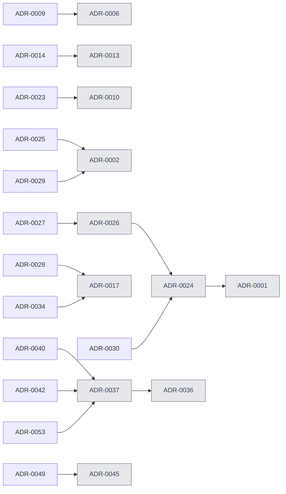

# Decisions

Every architecture and business decision on record, with the argument that settled it.

**55 records.** A decision keeps a stable id — `ADR-0037` — and roughly six hundred source
files cite ids in that form. The id is the reference, not the file name or the title, so a record can
be retitled without breaking a single citation.

```
ADR-0037   →   /decisions/adr-0037
```

## Supersession

An arrow means *replaces, in whole or in part*. A superseded record is kept rather than deleted: code
may still cite it, and the fact that a decision was reversed is part of the history.



Grey nodes are superseded in whole or in part.

## All records

| | Decision | Status |
|---|---|---|
| **[ADR-0001](./adr-0001)** | Authorization model ⟲ | `accepted` |
| **[ADR-0002](./adr-0002)** | Outbox dispatch contract ⟲ | `accepted` |
| **[ADR-0003](./adr-0003)** | Partitioned rate limiting | `accepted` |
| **[ADR-0004](./adr-0004)** | Fiscal receipt idempotency boundary | `accepted` |
| **[ADR-0005](./adr-0005)** | Integration resilience contract | `accepted` |
| **[ADR-0006](./adr-0006)** | Refund dispute money path ⟲ | `accepted` |
| **[ADR-0007](./adr-0007)** | Soft delete policy | `accepted` |
| **[ADR-0008](./adr-0008)** | Outbox table and drainer | `accepted` |
| **[ADR-0009](./adr-0009)** | Refund policy | `accepted` |
| **[ADR-0010](./adr-0010)** | Durable consumer idempotency ⟲ | `accepted` |
| **[ADR-0011](./adr-0011)** | Mobile apiresult contract | `accepted` |
| **[ADR-0012](./adr-0012)** | Admin action audit log | `accepted` |
| **[ADR-0013](./adr-0013)** | Ios app architecture and port strategy ⟲ | `accepted` |
| **[ADR-0014](./adr-0014)** | Ios deployment target ios16 and state mechanism | `accepted` |
| **[ADR-0015](./adr-0015)** | Azure dev deployment bicep and github environments | `accepted` |
| **[ADR-0016](./adr-0016)** | Apple app review compliance and ios quality bar | `accepted` |
| **[ADR-0017](./adr-0017)** | Multi region expansion seam and its composition… ⟲ | `accepted` |
| **[ADR-0018](./adr-0018)** | Ios design parity principle | `accepted` |
| **[ADR-0019](./adr-0019)** | Ios generated client authenticates via the core… | `accepted` |
| **[ADR-0020](./adr-0020)** | Ios partner router is a flat enum root switch gated… | `accepted` |
| **[ADR-0021](./adr-0021)** | Ios non modal 3 snap map sheet on the ios16 floor | `accepted` |
| **[ADR-0022](./adr-0022)** | Ios shell single navigation stack pager and pill bar | `accepted` |
| **[ADR-0023](./adr-0023)** | Per consumer claim ordering email claims after… | `accepted` |
| **[ADR-0024](./adr-0024)** | Mobile access token ttl is the device revocation… ⟲ | `accepted` |
| **[ADR-0025](./adr-0025)** | Ios push display per platform apns alert with loc… | `accepted` |
| **[ADR-0026](./adr-0026)** | Immediate device revocation via device id claim and… ⟲ | `accepted` |
| **[ADR-0027](./adr-0027)** | Immediate user session cutoff on password reset via… | `accepted` |
| **[ADR-0028](./adr-0028)** | Multi tenant activation pack | `accepted` |
| **[ADR-0029](./adr-0029)** | Ios live activity for in progress clean | `accepted` |
| **[ADR-0030](./adr-0030)** | Web admin access token ttl 15 min | `accepted` |
| **[ADR-0031](./adr-0031)** | Nswag regen drift is guarded at regen time | `accepted` |
| **[ADR-0032](./adr-0032)** | Catalog law declarations require a named ci gate | `accepted` |
| **[ADR-0033](./adr-0033)** | Catalog edit authority the routing test and cross… | `accepted` |
| **[ADR-0034](./adr-0034)** | Partner payout details shape | `accepted` |
| **[ADR-0035](./adr-0035)** | Metered membership benefit usage | `accepted` |
| **[ADR-0036](./adr-0036)** | Preferred cleaner first refusal hold ⟲ | `accepted` |
| **[ADR-0037](./adr-0037)** | Order offerability is a payment qualified status… ⟲ | `accepted` |
| **[ADR-0038](./adr-0038)** | Promo redemption reservation runs after the uow… | `accepted` |
| **[ADR-0039](./adr-0039)** | Preferred cleaner slot availability is checked at… | `accepted` |
| **[ADR-0040](./adr-0040)** | Order currentstatus is non nullable the pre… | `proposed` |
| **[ADR-0041](./adr-0041)** | Self billing agreement is a versioned append only… | `accepted` |
| **[ADR-0042](./adr-0042)** | Shared wire enums are generated from the nswag… | `proposed` |
| **[ADR-0043](./adr-0043)** | User artifact metadata is scrubbed at intake by… | `accepted` |
| **[ADR-0044](./adr-0044)** | Stored content type is byte derived on every intake | `accepted` |
| **[ADR-0045](./adr-0045)** | Favourite cleaner is a reservation the cleaner must… ⟲ | `accepted` |
| **[ADR-0046](./adr-0046)** | Payout invoice variable symbol is a claimed number… | `accepted` |
| **[ADR-0047](./adr-0047)** | A server redacted field is rendered off its own… | `accepted` |
| **[ADR-0048](./adr-0048)** | A generated dto is refused at the repository… | `accepted` |
| **[ADR-0049](./adr-0049)** | A disclosure block is withheld by the server when… | `accepted` |
| **[ADR-0050](./adr-0050)** | A dormant tenant column arbitrates nothing the… | `proposed` |
| **[ADR-0051](./adr-0051)** | A reads tenancy posture is decided by the write… | `proposed` |
| **[ADR-0052](./adr-0052)** | A cleaners own deletion files a request; only an admin… | `proposed` |
| **[ADR-0053](./adr-0053)** | The live-commitment cap is one admins decision about one… | `accepted` |
| **[ADR-0054](./adr-0054)** | Cleaner job reminders dedupe on a stamp per recipient… | `accepted` |
| **[ADR-0055](./adr-0055)** | A cleaner may set off or start only inside a 60-minute… | `accepted` |

⟲ = superseded in whole or in part by a later record.

## Where the deliberation lives

Several of these were argued by an author→challenger→lead panel before being accepted. The challenge
and draft documents are **not published here** — they are the argument, not the decision — and are
archived in the repository under `agents/archive/2026-08/adr-deliberation/`.
