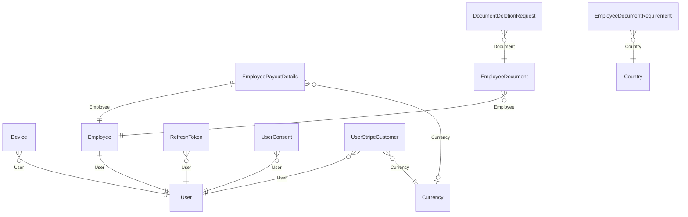
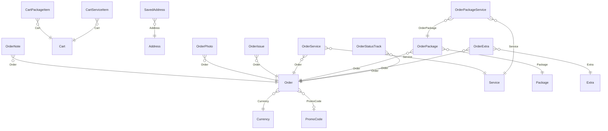
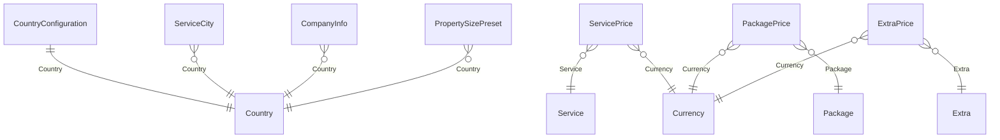
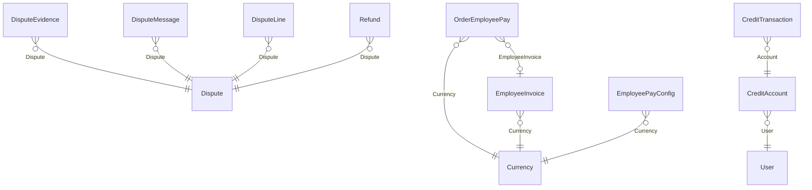
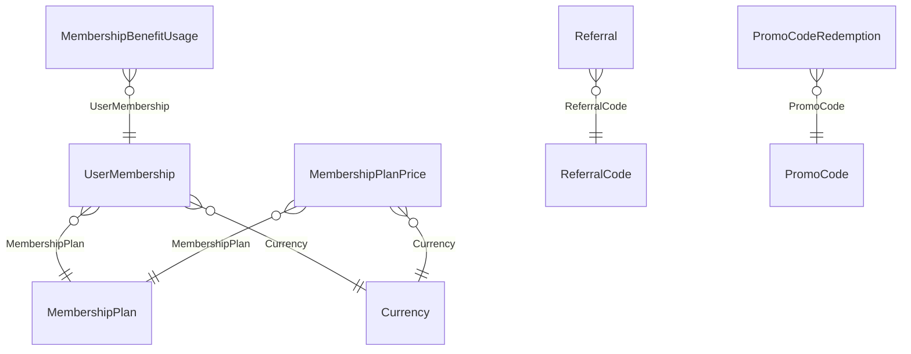

# Domain model

Generated from the EF Core entity configurations, not described from memory. A relationship on a
diagram is a `HasOne(...)` declared in a configuration file; if it is not there, it is not enforced.

One diagram per area, because a single picture of all 83 entities is a picture nobody reads. Entities
appear in the area they are owned by, not everywhere they are referenced.

::: tip Checking the count
`grep -c 'migrationBuilder.CreateTable' src/Cleansia.Infra.Database/Migrations/*_Initial.cs` — the
migration is regenerated rather than stacked, so it always reflects the current model. The count above
was 70 for long enough to be wrong by six before anyone noticed, and then 76 for long enough to be wrong
by five, which is why the check is written down rather than the number being trusted.
:::

## Identity and access

| Entity | |
|---|---|
| `User` | references `PreferredLanguage` |
| `Employee` | references `Nationality`, `User`, `WorkCountry` |
| `RefreshToken` | references `User` |
| `Device` | references `User` |
| `EmployeePayoutDetails` | references `BankCountry`, `Currency` (nullable, Restrict — the currency the cleaner declares the account holds), `Employee` (Cascade); unique `(TenantId, EmployeeId)` with nulls not distinct |
| `EmployeeDocument` | references `Employee`, `PreviousVersion` |
| `EmployeeDocumentRequirement` | references `Country` (Restrict); unique `(CountryId, DocumentType)` — which document types a country requires of a cleaner |
| `DocumentDeletionRequest` | references `Document` (Restrict) — a cleaner's request to have a document removed, answered by an admin |
| `EmployeeActionAudit` | — bare `EmployeeId` and `OrderId` scalars with no FK, because the act it records deletes the `OrderEmployee` row it describes and must survive an erased order |
| `UserConsent` | references `User` |
| `UserStripeCustomer` | references `User` (Restrict), `Currency` (Restrict); unique `(UserId, CurrencyId)` with no tenant term, unique `StripeCustomerId` — the Stripe Customer that bills this user in **one** currency. Stripe locks a Customer to the currency of its first invoice, so a user holds one per currency and can re-subscribe to Plus in a new market; `User.StripeCustomerId` stays as the legacy field one-off order payments use, adopted as the first row for a currency it has only ever billed. GDPR erasure deletes the rows; `DeleteCurrency` answers `currency.in_use` for them. → [ADR-0059](/decisions/adr-0059) amendment |

## Ordering

**`OrderService`, `OrderPackage` and `OrderExtra` are the order's line items** — what was actually
bought. An order with none bought nothing. `OrderPackageService` records which services a package
contained at purchase, so a later edit to the package cannot restate a historical order. `OrderExtra`
snapshots the extra's `Slug` and `UnitPrice` for the same reason. `OrderStatusTrack` is the append-only
status history; `Order.CurrentStatus` is a denormalisation of its latest row, and the history is
authoritative.

**`Order.CurrencyId` is the unit of every money column on the row**, stamped at creation from the
service address's country and never changed. The foreign key is `ON DELETE RESTRICT`, so a currency
that any order was ever priced in cannot be deleted. → [Business rules](/product/business-rules#price-stages)

| Entity | |
|---|---|
| `Order` | references `Currency` (Restrict), `PromoCode` (nullable, Restrict — the code that was actually honoured; a losing promo leaves it null), `Receipt` |
| `OrderEmployee` | — |
| `OrderExtra` | references `Order` (Cascade), `Extra` (Restrict — a catalogue extra referenced by any order line cannot be deleted, only deactivated); unique `(OrderId, ExtraId)` |
| `OrderPackageService` | references `OrderPackage` (Cascade), `Service` (Restrict); unique `(OrderPackageId, ServiceId)` |
| `OrderPhoto` | references `CapturedBy`, `Order` |
| `OrderNote` | references `Order` |
| `OrderIssue` | references `Order` |
| `OrderReceipt` | references `Language` |
| `Address` | — |
| `RecurringBookingTemplate` | references `User` |
| `SavedAddress` | references `Address`, `User` |
| `Cart` | references `User` |
| `CartServiceItem` | references `Cart`, `Service` |
| `CartPackageItem` | references `Cart`, `Package` |
| `OrderService` | references `Order`, `Service` |
| `OrderPackage` | references `Order`, `Package` |
| `OrderStatusTrack` | references `Order` |

## Catalogue and configuration

**A catalogue entry carries no price.** `Service`, `Package` and `Extra` have no price column; a price
is a row in `ServicePrices` (`BasePrice`, `PerRoomPrice`), `PackagePrices` (`Price`) or `ExtraPrices`
(`Price`), one per (entry, currency). Nothing converts between rows — an entry with no row in a
currency is simply not sold in it. `Currency` has no exchange rate: its columns are `Code` (unique,
case-insensitive), `Symbol`, `Name`, `IsDefault` (a filtered unique index holds exactly one), `IsActive`
(the market switch — a new currency is born switched off), `LoyaltyPointsDivisor` (how much of the
currency earns one point; required before the market can be switched on) and `NoShowCredit` (the
apology credit paid on an order in this currency when its slot arrives with no cleaner; null = none —
not an activation gate).
→ [Platform expandability](/architecture/platform-expandability#market-switch)

**A market is not an entity.** It is a `Country` that is serviced, whose `CountryConfiguration.DefaultCurrencyCode`
names an active `Currency` — three existing rows joined by the anonymous `Market/GetOverview` read.
`Country` carries `IsoCode` (alpha-3, what clients persist) and `IsoAlpha2` (what the market chip
prints); `CountryConfiguration` carries, besides the fiscal and formatting columns, `InsuranceCoverageAmount`
— the one marketing figure in customer copy, a number in the country's currency, per country because
a policy is written per jurisdiction, null = the copy names no figure (CZE seeded at 1 000 000) — and
`IsDefaultMarket`, the market a customer surface pre-selects before any choice is made: a filtered
unique index (`IX_CountryConfigurations_IsDefaultMarket_Unique`, the `Currency.IsDefault` shape) holds
at most one, `SetDefaultMarket` is the only writer, CZE is seeded with it. → [ADR-0058](/decisions/adr-0058),
[ADR-0060](/decisions/adr-0060)

| Entity | |
|---|---|
| `Service` | references `Category` |
| `Package` | — |
| `Extra` | — |
| `ServicePrice` | references `Service` (Cascade — a price has no meaning without the thing it prices), `Currency` (Restrict); unique `(ServiceId, CurrencyId)` |
| `PackagePrice` | references `Package` (Cascade), `Currency` (Restrict); unique `(PackageId, CurrencyId)` |
| `ExtraPrice` | references `Extra` (Cascade), `Currency` (Restrict); unique `(ExtraId, CurrencyId)` |
| `Currency` | — ; `NoShowCredit` (nullable) is the per-currency apology credit |
| `Country` | — ; `IsoCode` alpha-3 + `IsoAlpha2` (required, two letters) |
| `Language` | — |
| `CompanyInfo` | references `Country` |
| `CountryConfiguration` | references `Country`; `InsuranceCoverageAmount` (nullable) is the per-country copy figure; `IsDefaultMarket` (filtered unique — at most one row) is the landing-page pre-selection |
| `PropertySizePreset` | references `Country` (Restrict); unique `(CountryId, Code)` — the size chips a country's booking wizard offers |
| `ServiceCity` | references `Country` |

## Money and payroll

**Every money-carrying row names its currency.** A pay row is in the currency of the order that earned
it, an invoice is in the currency of the pay rows it invoices (one invoice per employee, period and
currency), a pay rate is an amount in a currency and counts for nothing in any other, and a customer
holds one credit account per currency. Every one of those foreign keys is `Restrict`, so a currency
that money was ever recorded in cannot be deleted. → [Pay and payouts](/flows/pay-and-payouts#one-invoice-per-currency)

| Entity | |
|---|---|
| `OrderEmployeePay` | references `Currency` (Restrict), `EmployeeInvoice` (nullable, SetNull), `Employee`, `Order`; unique `(OrderId, EmployeeId)` |
| `EmployeeInvoice` | references `Country`, `Currency` (Restrict), `Employee`, `Language`; unique `(EmployeeId, PayPeriodId, CurrencyId)`, unique `InvoiceNumber`, unique filtered `VariableSymbol` |
| `PayPeriod` | — |
| `EmployeePayConfig` | references `Currency`, `Employee`, `Package`, `Service` |
| `CreditAccount` | references `User` (Restrict); `CurrencyId` is a plain column with **no declared foreign key**; unique `(UserId, CurrencyId)` |
| `CreditTransaction` | references `Account` (Cascade); unique `IdempotencyKey` — unfiltered and with no tenant term, because this is money and the backstop has to fire |
| `Refund` | references `Dispute`, `Order`, `Receipt` |
| `Dispute` | references `Order`, `User` |
| `DisputeLine` | references `Dispute` (Cascade), `Service` and `Package` (both Restrict, no navigation); unique `(DisputeId, ServiceId, PackageId)` — the order lines a dispute is about |
| `DisputeEvidence` | references `Dispute` |
| `DisputeMessage` | references `Author`, `Dispute` |
| `FiscalCounter` | — |

## Loyalty and membership

**A plan carries no price, like a catalogue entry.** `MembershipPlan` is the benefits and the billing
cadence; what it costs, and which Stripe Price charges it, is a `MembershipPlanPrice` row per
(plan, currency) — the `PackagePrice` shape plus the Stripe id. A plan with no row in a currency is not
on sale in that market. `UserMembership.CurrencyId` is the currency the subscription was created in
(the chosen market's), never updated: Stripe refuses a currency change on a live subscription, so a
plan swap reads the target plan's row in this currency. Both plan tables are platform config; the
membership is tenant-scoped. → [ADR-0059](/decisions/adr-0059)

| Entity | |
|---|---|
| `LoyaltyAccount` | references `User` |
| `LoyaltyTransaction` | — |
| `LoyaltyTierConfig` | — |
| `ReferralCode` | references `User` |
| `Referral` | references `FirstQualifyingOrder`, `ReferralCode`, `Referred`, `Referrer` |
| `PromoCode` | references `Currency` |
| `PromoCodeRedemption` | references `Order`, `PromoCode`, `User` |
| `MembershipPlan` | — (no price column) |
| `MembershipPlanPrice` | references `MembershipPlan` (Cascade), `Currency` (Restrict); unique `(MembershipPlanId, CurrencyId)` with no tenant term, unique `StripePriceId` |
| `UserMembership` | references `MembershipPlan`, `Currency` (Restrict — the subscription's currency for life), `User` |
| `MembershipBenefitUsage` | references `Order`, `UserMembership`, `User` |

## Platform

*Mostly referenced by id rather than by a configuration-declared relationship. The exceptions are
named on their rows: `OrderReview` and `OrderReviewLine` (declared, with delete behaviour) and
`PackageService` (the package–service join).*

| Entity | |
|---|---|
| `AdminActionAudit` | — |
| `CountryInvoiceConfig` | references `Country` |
| `DeadLetter` | — |
| `EmailTemplateTranslation` | references `Language` |
| `EmailTranslation` | — |
| `GdprRequest` | references `User` |
| `LiveActivityToken` | — |
| `OrderReview` | references `Order` |
| `OrderReviewLine` | references `Review` (Cascade), `Service` and `Package` (both Restrict, no navigation); unique `(OrderReviewId, ServiceId, PackageId)` — the per-line ratings under a review |
| `OutboxMessage` | — |
| `ServiceCategory` | — |
| `TenantConfiguration` | — |
| `UserNotification` | — |
| `UserNotificationPreferences` | references `User` |
| `PackageService` | references `Package`, `Service` — which services a package contains |
| `ProcessedStripeEvent` | — the replay guard; a unique index makes a redelivered webhook a no-op |
| `ProcessedMessage` | — the same guard for queue messages |
| `PayoutReferenceCounter` | — atomic `ON CONFLICT` numbering for payout references |
| `CampaignProgress` | — resumable cursor for a long-running campaign sweep |

## What the diagrams do not show

A foreign key is not an invariant. The rules that actually hold this data together — a seat is unique
per order, a promo code is redeemed once per user, a receipt number is never reused — are enforced by
unique indexes and append-only seams rather than by relationships, and are documented in
[Offerability](/domain/offerability) and [Order lifecycle](/domain/order-lifecycle).
