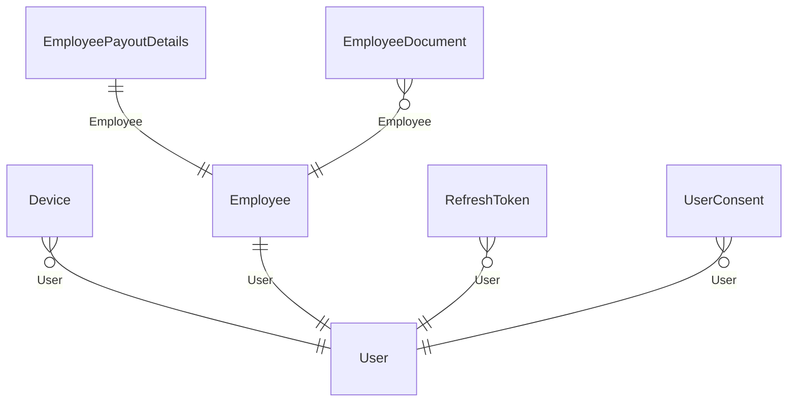
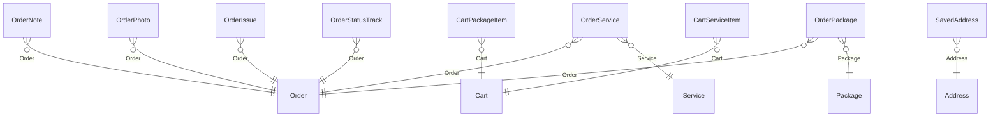
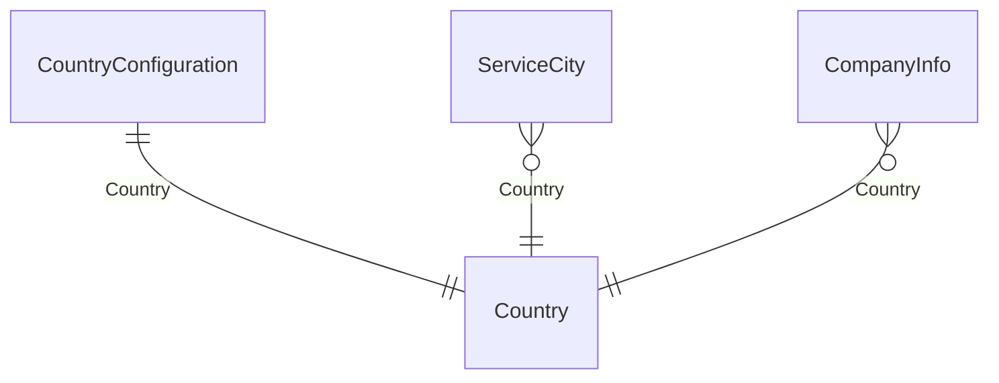
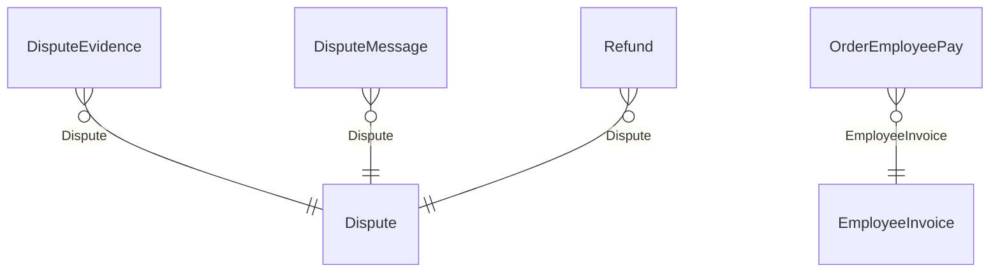
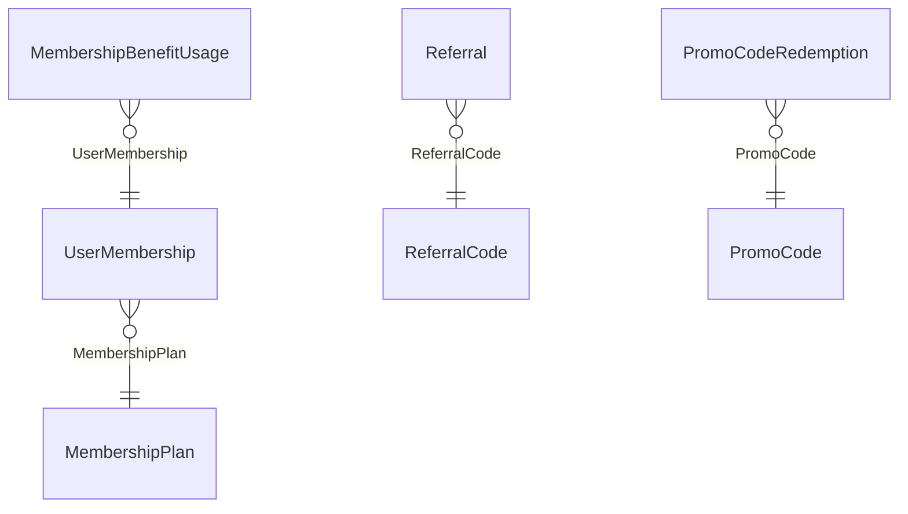

# Domain model

Generated from the 70 EF Core entity configurations, not described from memory. A relationship on a
diagram is a `HasOne(...)` declared in a configuration file; if it is not there, it is not enforced.

One diagram per area, because a single picture of 70 entities is a picture nobody reads. Entities
appear in the area they are owned by, not everywhere they are referenced.

## Identity and access

| Entity | |
|---|---|
| `User` | references `PreferredLanguage` |
| `Employee` | references `Nationality`, `User`, `WorkCountry` |
| `RefreshToken` | references `User` |
| `Device` | references `User` |
| `EmployeePayoutDetails` | references `BankCountry`, `Employee` |
| `EmployeeDocument` | references `Employee`, `PreviousVersion` |
| `UserConsent` | references `User` |

## Ordering

**`OrderService` and `OrderPackage` are the order's line items** — what was actually bought. An order
with neither bought nothing. `OrderStatusTrack` is the append-only status history; `Order.CurrentStatus`
is a denormalisation of its latest row, and the history is authoritative.

| Entity | |
|---|---|
| `Order` | references `Receipt` |
| `OrderEmployee` | — |
| `OrderPhoto` | references `CapturedBy`, `Order` |
| `OrderNote` | references `Order` |
| `OrderIssue` | references `Order` |
| `OrderReceipt` | references `Language` |
| `Address` | — |
| `RecurringBookingTemplate` | references `User` |
| `SavedAddress` | references `Address`, `User` |
| `Cart` | references `User` |
| `CartServiceItem` | references `Cart`, `Service` |
| `CartPackageItem` | references `Cart`, `Package` |
| `OrderService` | references `Order`, `Service` |
| `OrderPackage` | references `Order`, `Package` |
| `OrderStatusTrack` | references `Order` |

## Catalogue and configuration

| Entity | |
|---|---|
| `Service` | references `Category` |
| `Package` | — |
| `Extra` | — |
| `Currency` | — |
| `Country` | — |
| `Language` | — |
| `CompanyInfo` | references `Country` |
| `CountryConfiguration` | references `Country` |
| `ServiceCity` | references `Country` |

## Money and payroll

| Entity | |
|---|---|
| `OrderEmployeePay` | references `EmployeeInvoice`, `Employee`, `Order` |
| `EmployeeInvoice` | references `Country`, `Currency`, `Employee`, `Language` |
| `PayPeriod` | — |
| `EmployeePayConfig` | references `Currency`, `Employee`, `Package`, `Service` |
| `Refund` | references `Dispute`, `Order`, `Receipt` |
| `Dispute` | references `Order`, `User` |
| `DisputeEvidence` | references `Dispute` |
| `DisputeMessage` | references `Author`, `Dispute` |
| `FiscalCounter` | — |

## Loyalty and membership

| Entity | |
|---|---|
| `LoyaltyAccount` | references `User` |
| `LoyaltyTransaction` | — |
| `LoyaltyTierConfig` | — |
| `ReferralCode` | references `User` |
| `Referral` | references `FirstQualifyingOrder`, `ReferralCode`, `Referred`, `Referrer` |
| `PromoCode` | references `Currency` |
| `PromoCodeRedemption` | references `Order`, `PromoCode`, `User` |
| `MembershipPlan` | — |
| `UserMembership` | references `MembershipPlan`, `User` |
| `MembershipBenefitUsage` | references `Order`, `UserMembership`, `User` |

## Platform

*No configuration-declared relationships between these entities — they are referenced by id.*

| Entity | |
|---|---|
| `AdminActionAudit` | — |
| `CountryInvoiceConfig` | references `Country` |
| `DeadLetter` | — |
| `EmailTemplateTranslation` | references `Language` |
| `EmailTranslation` | — |
| `FeatureFlag` | — |
| `GdprRequest` | references `User` |
| `LiveActivityToken` | — |
| `OrderReview` | references `Order` |
| `OutboxMessage` | — |
| `ServiceCategory` | — |
| `TenantConfiguration` | — |
| `UserNotification` | — |
| `UserNotificationPreferences` | references `User` |
| `PackageService` | references `Package`, `Service` — which services a package contains |
| `ProcessedStripeEvent` | — the replay guard; a unique index makes a redelivered webhook a no-op |
| `ProcessedMessage` | — the same guard for queue messages |
| `PayoutReferenceCounter` | — atomic `ON CONFLICT` numbering for payout references |
| `CampaignProgress` | — resumable cursor for a long-running campaign sweep |

## What the diagrams do not show

A foreign key is not an invariant. The rules that actually hold this data together — a seat is unique
per order, a promo code is redeemed once per user, a receipt number is never reused — are enforced by
unique indexes and append-only seams rather than by relationships, and are documented in
[Offerability](/domain/offerability) and [Order lifecycle](/domain/order-lifecycle).
