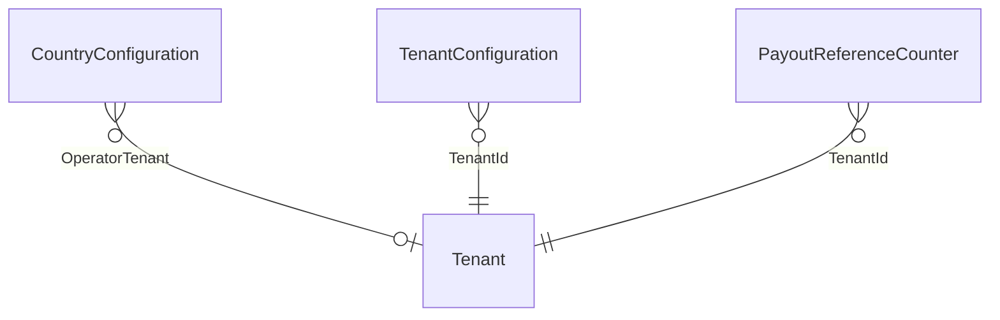
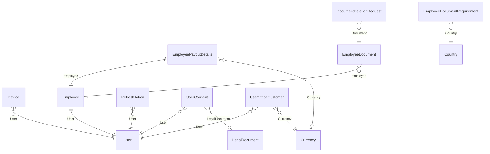
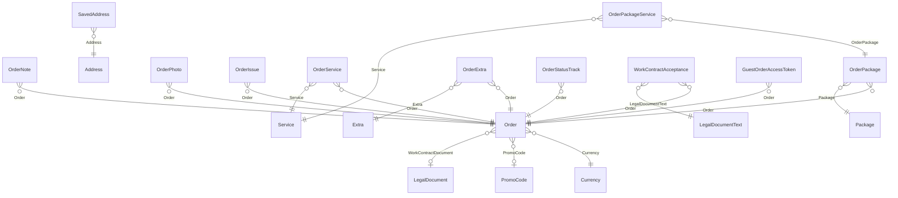
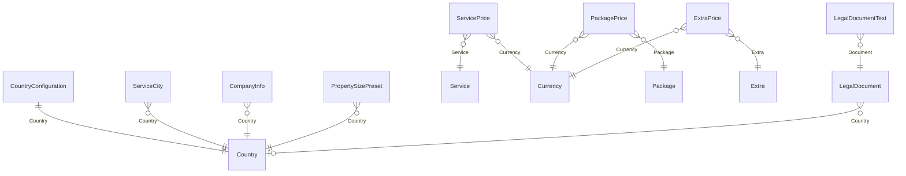
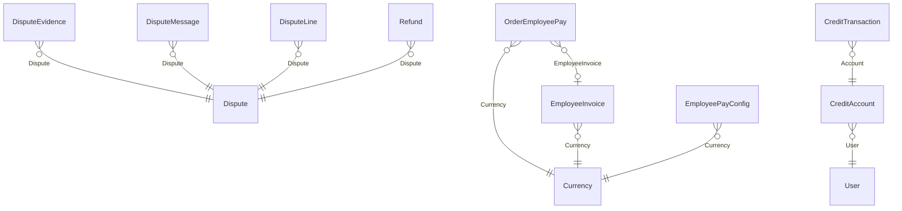
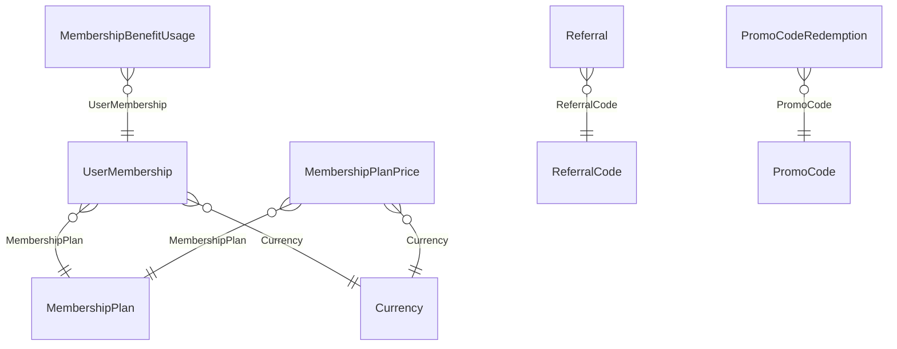

# Domain model

Generated from the EF Core entity configurations, not described from memory. A relationship on a
diagram is a `HasOne(...)` declared in a configuration file; if it is not there, it is not enforced.

One diagram per area, because a single picture of all 84 tables is a picture nobody reads. Entities
appear in the area they are owned by, not everywhere they are referenced.

::: tip Checking the count
`grep -c 'migrationBuilder.CreateTable' src/Cleansia.Infra.Database/Migrations/*_Initial.cs` — the
migration is regenerated rather than stacked, so it always reflects the current model. The count above
was 70 for long enough to be wrong by six before anyone noticed, and then 76 for long enough to be wrong
by five, which is why the check is written down rather than the number being trusted. It fell from 88
to 84 on 2026-09-20, when the never-read `Carts`, `CartServiceItems`, `CartPackageItems` and
`EmailTranslations` tables were dropped along with `Employees.Availability` and
`Employees.PreferredCurrencyCode` (`20260920204705_Initial`).
:::

## Tenancy — who a row belongs to

**A tenant is an operating company under the holding** — the legal entity that contracts the customer,
employs the cleaner, issues the receipt and pays the payout ([ADR-0061](/decisions/adr-0061)). `Tenant`
is the registry row **and the company's lifecycle** ([ADR-0064](/decisions/adr-0064)): `Tenant :
Auditable` — `Id varchar(26)`, assigned not generated (`cleansia-cz`); `Name`; the `Auditable` stamps
(`CreatedBy/On`, `UpdatedBy/On`, `DeactivatedBy/On`, `IsActive`); and nine lifecycle columns —
`WindDownFrom` (date), `WindDownRequestedOn/By`, `WindDownRunStartedOn`, `WindDownLastRunOn`,
`ArchiveRequestedOn/By`, `ArchivedOn`, `ArchiveManifestSha256` (char 64). The *registry* — which
companies exist — is still written only by the seed; the *lifecycle* is written by the company's own
administrators through four commands (deactivate, reactivate, wind down, archive) and read by one query.
`IsActive` means **deactivated**, read through `IsDeactivated` — by the serviced-country predicate (a
deactivated company's markets are not markets), the partner sign-in gate, the recurring-booking
materialiser and the pay-period rollover; `ArchiveRequestedOn` means **frozen**, read by the commit's
write guard. The registry keeps one job reader — `ITenantRepository.GetAllIdsAsync`, every company,
deactivated and archived ones included — that the retention job loops. **A country is served by at most
one operator and an operator serves one or more countries**: `CountryConfiguration.OperatorTenantId`
(nullable, FK Restrict, indexed) is the whole map. Null — or a deactivated operator — means nobody
serves that market: `Market/GetOverview` does not list it and an anonymous write naming it is refused
`country.not_serviced`. → [Tenant](/domain/roles/tenant), [Company lifecycle](/domain/roles/company-lifecycle)

**Every stamped row carries its operator, and the column is a foreign key.** A type that belongs to
one company extends **`TenantAuditable : Auditable, ITenantEntity`** — 47 of them — or is one of the
two `BaseEntity + ITenantEntity` audits (`AdminActionAudit`, `CustomerActionAudit`): **49 stamped
tables**, each with `FK_<T>_Tenants_TenantId` (`Restrict`, no navigation — the two `TenantId` arrows
above stand in for all 49; the area diagrams below do not repeat them). The `TenantId` column is
**NOT NULL** on 47 of them and
nullable only on `OutboxMessage` and `DeadLetter` (an envelope may have no tenant; a `NULL` passes the
FK). The value is written at commit time from the ambient tenant — the JWT claim, the market's operator
for an anonymous write, the user's tenant on a token mint, the row's own tenant or the registry's
company in a job — and the database refuses a row with none (`23502`) or with a company it does not
know (`23503`). A plain **`Auditable` carries no tenant column at all**: the 21 catalogue and per-country
tables (`CountryConfiguration`, `Service`, `MembershipPlan`, …) lost the dead inherited column and its
index on 2026-09-15 (ADR-0061 D8 as amended), and a model sweep fails a non-`ITenantEntity` type that
grows one.

| Entity | |
|---|---|
| `Tenant` | — ; referenced by `CountryConfiguration.OperatorTenantId` and by `TenantId` on all 49 stamped tables. `Auditable` (tenantless by construction); the lifecycle columns above; the company's state is the highest of *archived* (`ArchivedOn`), *frozen* (`ArchiveRequestedOn`), *deactivated* (`!IsActive`), *winding down* (`WindDownFrom`), *operating* → [Company lifecycle](/domain/roles/company-lifecycle) |
| `TenantConfiguration` | references `Tenant`; one row per `(TenantId, Key)` (unique, `NULLS NOT DISTINCT`) holding a company's override of one catalogued setting — the ten `retention.*` windows today; no row means the catalogue default. Written by the admin's *Company settings* page, read per company by the retention job → [TenantConfiguration](/domain/roles/tenant-configuration) |

## Identity and access

| Entity | |
|---|---|
| `User` | references `PreferredLanguage`; unique `Email` (`citext`) **with no tenant term** — one identity per email across the holding ([ADR-0061](/decisions/adr-0061) D5.1); `TenantId` NOT NULL is the operating company the account belongs to, the market's operator at registration; `AdminRole` (nullable int: Administrator 1 / Manager 2 / Support 3 / Accountant 4) is NOT NULL iff `Profile` is `Administrator` — `CK_Users_AdminRole_Profile` ([ADR-0066](/decisions/adr-0066)) |
| `Employee` | references `Nationality`, `User`, `WorkCountry` — at approval the work country's operator must be the admin's own tenant (`employee.work_country_operator_mismatch`) |
| `RefreshToken` | references `User` |
| `Device` | references `User` |
| `EmployeePayoutDetails` | references `BankCountry`, `Currency` (nullable, Restrict — the currency the cleaner declares the account holds), `Employee` (Cascade); unique `(TenantId, EmployeeId)`, nulls not distinct |
| `EmployeeDocument` | references `Employee`, `PreviousVersion` |
| `EmployeeDocumentRequirement` | references `Country` (Restrict); unique `(CountryId, DocumentType)` — which document types a country requires of a cleaner |
| `DocumentDeletionRequest` | references `Document` (Restrict) — a cleaner's request to have a document removed, answered by an admin |
| `EmployeeActionAudit` | — bare `EmployeeId` and `OrderId` scalars with no FK, because the act it records deletes the `OrderEmployee` row it describes and must survive an erased order; indexed `(OrderId, CreatedOn DESC)` for the admin timeline that reads it by order ([ADR-0062](/decisions/adr-0062) D6) |
| `CustomerActionAudit` | — bare `UserId` scalar with no FK (null for a guest act), because the row must outlive everything it names; `ClientAudience`, `IpAddress`, `DeviceLabel`, `DeviceId` are the request context, `PayloadJson` (jsonb) the typed evidence a handler emitted, `ErrorCode` the refusal key on a failure row. `TenantId` NOT NULL. Append-only — `Pseudonymise()` (erasure blanks the three request-metadata columns) is the one mutator; indexed `(TenantId, OccurredOn DESC)`, `(UserId, OccurredOn DESC)`, `(ResourceType, ResourceId)`, `(OccurredOn)` for the three-year-per-row retention scan → [ADR-0062](/decisions/adr-0062), [`customer-action-audit`](/domain/roles/customer-action-audit) |
| `UserConsent` | references `User`, `LegalDocument` (nullable, Restrict — a text a customer accepted can never be deleted from under the row); one row per `(UserId, ConsentType)` — the **current state**, overwritten on regrant, with `DocumentVersion` (`varchar(32)`, nullable — the document's effective date as `yyyy-MM-dd`) and `LegalDocumentId` written together (both null on consent types with no document and on every employee row, which stamps nothing until ADR-0041's agreement lands). A regrant under a *different document identity* moves the row. IP, user agent, version and document id **survive erasure** on the withdrawn row (`RetainedByPolicy`). The history of grants and withdrawals is the `customer.consent.*` rows in `CustomerActionAudit` → [ADR-0063](/decisions/adr-0063), [ADR-0062](/decisions/adr-0062) D4 |
| `UserStripeCustomer` | references `User` (Restrict), `Currency` (Restrict); unique `(UserId, CurrencyId)` with no tenant term, unique `StripeCustomerId` — the Stripe Customer that bills this user in **one** currency. Stripe locks a Customer to the currency of its first invoice, so a user holds one per currency and can re-subscribe to Plus in a new market; `User.StripeCustomerId` stays as the legacy field one-off order payments use, adopted as the first row for a currency it has only ever billed. GDPR erasure deletes the rows; `DeleteCurrency` answers `currency.in_use` for them. → [ADR-0059](/decisions/adr-0059) amendment |

## Ordering

**`OrderService`, `OrderPackage` and `OrderExtra` are the order's line items** — what was actually
bought. An order with none bought nothing. `OrderPackageService` records which services a package
contained at purchase, so a later edit to the package cannot restate a historical order. `OrderExtra`
snapshots the extra's `Slug` and `UnitPrice` for the same reason. `OrderStatusTrack` is the append-only
status history; `Order.CurrentStatus` is a denormalisation of its latest row, and the history is
authoritative.

**`Order.CurrencyId` is the unit of every money column on the row**, stamped at creation from the
service address's country and never changed. The foreign key is `ON DELETE RESTRICT`, so a currency
that any order was ever priced in cannot be deleted. → [Business rules](/product/business-rules#price-stages)

**`Order.WorkContractDocumentId` is the contract for work the job was booked under** — the
customer-audience `WorkContract` `LegalDocument` in force for the address's market on the booking day,
stamped once by `OrderFactory` and never changed; `Restrict`, so a text any order was booked under
cannot be deleted. Nullable in the schema only because `Order.Create` has 153 callers, 152 in tests —
the one production writer always stamps it and the take refuses an order without one. **A
`WorkContractAcceptance` is one cleaner's acceptance of that text for one seat**: `OrderEmployeeId`
(unique — one contract per seat; a bare scalar, the seat row is hard-deleted by the next drop),
`EmployeeId` (bare scalar, the cleaner is anonymised on erasure), `LegalDocumentTextId` (the exact
text row read — document, version, language and hash by join), `DocumentVersion`, `AcceptedOn`,
`ClientAudience`, `IpAddress` / `DeviceLabel` / `DeviceId` (the request trio, blanked by erasure and
by the three-year sweep), `FactsJson` (the job as shown at acceptance; never a name or a street).
Append-only, `TenantAuditable` stamped with the order's operator. → [ADR-0068](/decisions/adr-0068),
[`work-contract-acceptance`](/domain/roles/work-contract-acceptance)

**`GuestOrderAccessToken` is the credential a guest proves a booking with** — 256 bits, stored only as
a SHA-256 digest (`TokenHash`, unique, the single lookup path), with `ExpiresOn` 30 days past the
cleaning and a nullable `RevokedOn`. It replaced the (display number, e-mail, confirmation code)
triple, which was not a secret: the code was served on the order detail to every assigned cleaner.
**Several live rows per order are normal** — every message that carries a track link mints its own,
and none supersedes another; cancelling the booking revokes all of them. An account booking has none.
The raw value is returned to the issuing caller once, on a `[NotMapped]` carrier, and is never
retrievable again — the same contract as `RefreshToken` and the account confirmation token.
→ [The guest access token](/flows/booking-and-pricing#guest-access-token)

| Entity | |
|---|---|
| `Order` | references `Currency` (Restrict), `PromoCode` (nullable, Restrict — the code that was actually honoured; a losing promo leaves it null), `WorkContractDocument` → `LegalDocument` (nullable, Restrict, indexed — the contract-for-work text the job was booked under, ADR-0068 D1), `Receipt`. `UserId` is null on a guest booking and is never attached afterwards, so **`SubjectOrders.Of(userId, email)`** (`Core.Domain/Orders`) is the one definition of a data subject's orders for the erasure and the subject export: the account's orders **or** the rows with no `UserId` whose `CustomerEmail` matches case-folded (owner ruling 2026-09-15) — asked past the tenant filter, because a guest checkout is stamped with the market's operator → [ADR-0062](/decisions/adr-0062) D5 as amended 2026-09-15. `ExpressSurchargeAmount` (`numeric(18,2)`, default 0) is the surcharge the booking was charged and `LanguageCode` (nullable, `varchar(5)`, no foreign key) the language the booking request stated — null on a recurring occurrence; the receipt prints the first as its own line and is written in the second → [What the receipt says](/flows/payment-and-fiscal#what-the-receipt-says) |
| `OrderEmployee` | — |
| `GuestOrderAccessToken` | references `Order` (Cascade — a deleted booking takes its keys with it); unique `TokenHash` (`IX_GuestOrderAccessTokens_TokenHash`, the only lookup path), indexed `(OrderId, RevokedOn)` for the revoke-on-cancellation read. `TenantAuditable`, stamped with the order's operator; resolved past the tenant filter, because a guest presents the token without knowing which operator took the booking |
| `WorkContractAcceptance` | references `Order` (Restrict), `LegalDocumentText` (Restrict — `FK_WorkContractAcceptances_LegalDocumentTexts_TextId`; a text a cleaner accepted can never be deleted from under the row), `Tenant`; **unique `(OrderEmployeeId)`** — one contract per seat and the arbiter of a concurrent double accept; indexed `(OrderId, EmployeeId)`, `(EmployeeId, AcceptedOn DESC)`, `(TenantId, AcceptedOn)`; `OrderEmployeeId` and `EmployeeId` are bare scalars with no FK. `Pseudonymise()` (the trio) is the one mutator; no delete path → [ADR-0068](/decisions/adr-0068) D2 |
| `OrderExtra` | references `Order` (Cascade), `Extra` (Restrict — a catalogue extra referenced by any order line cannot be deleted, only deactivated); unique `(OrderId, ExtraId)` |
| `OrderPackageService` | references `OrderPackage` (Cascade), `Service` (Restrict); unique `(OrderPackageId, ServiceId)` |
| `OrderPhoto` | references `CapturedBy`, `Order` |
| `OrderNote` | references `Order` |
| `OrderIssue` | references `Order` |
| `OrderReceipt` | references `Language`; unique `(TenantId, ReceiptNumber)`, nulls not distinct — the number comes from a per-operator `FiscalCounter`, so two operators' first receipts of a year are the same string and the tenant term is what keeps them apart |
| `Address` | — |
| `RecurringBookingTemplate` | references `User` |
| `SavedAddress` | references `Address`, `User` |
| `OrderService` | references `Order`, `Service` |
| `OrderPackage` | references `Order`, `Package` |
| `OrderStatusTrack` | references `Order` |

## Catalogue and configuration

**The legal texts are stored documents, versioned by the date they start applying.** `LegalDocument`
is one version of one text — `Audience` (Customer | Employee), `Type` (TermsOfService |
PrivacyPolicy | WorkContract — the third, customer-audience, is the contract for work an order is
booked under, ADR-0068), `CountryId` (the market the copy is for; **null = the platform-wide text a market
without its own falls back to**), `EffectiveFrom` and `Version`, which *is* `EffectiveFrom` as
`yyyy-MM-dd` — with one `LegalDocumentText` per language (`Language`, `Title`, `ContentMarkdown`,
`ContentHash` SHA-256). Tenantless like `CountryConfiguration`: platform copy per market. **A document
in force is immutable** — the seeder that writes them refuses to change an in-force text, and a
wording change is a new document with a new date — so every text a customer ever accepted is still
in the table, pointed at by `UserConsent.LegalDocumentId`, by `Order.WorkContractDocumentId` and — per
text row — by `WorkContractAcceptance.LegalDocumentTextId`. The documents are seeded from embedded
markdown at every host start; there is no admin writer. → [ADR-0063](/decisions/adr-0063),
[`legal-document`](/domain/roles/legal-document)

**A catalogue entry carries no price.** `Service`, `Package` and `Extra` have no price column; a price
is a row in `ServicePrices` (`BasePrice`, `PerRoomPrice`), `PackagePrices` (`Price`) or `ExtraPrices`
(`Price`), one per (entry, currency). Nothing converts between rows — an entry with no row in a
currency is simply not sold in it. `Currency` has no exchange rate: its columns are `Code` (unique,
case-insensitive), `Symbol`, `Name`, `IsDefault` (a filtered unique index holds exactly one), `IsActive`
(the market switch — a new currency is born switched off), `LoyaltyPointsDivisor` (how much of the
currency earns one point; required before the market can be switched on) and `NoShowCredit` (the
apology credit paid on an order in this currency when its slot arrives with no cleaner; null = none —
not an activation gate).
→ [Platform expandability](/architecture/platform-expandability#market-switch)

**A market is not an entity.** It is a `Country` that is serviced, whose `CountryConfiguration.DefaultCurrencyCode`
names an active `Currency` — three existing rows joined by the anonymous `Market/GetOverview` read.
`Country` carries `IsoCode` (alpha-3, what clients persist) and `IsoAlpha2` (what the market chip
prints); `CountryConfiguration` carries, besides the fiscal and formatting columns, `InsuranceCoverageAmount`
— the one marketing figure in customer copy, a number in the country's currency, per country because
a policy is written per jurisdiction, null = the copy names no figure (CZE seeded at 1 000 000) — and
`IsDefaultMarket`, the market a customer surface pre-selects before any choice is made: a filtered
unique index (`IX_CountryConfigurations_IsDefaultMarket_Unique`, the `Currency.IsDefault` shape) holds
at most one, `SetDefaultMarket` is the only writer, CZE is seeded with it — and **`OperatorTenantId`**,
the operating company that serves the market (see [Tenancy](#tenancy-who-a-row-belongs-to)); a market
with none is not listed and cannot be flagged the default. → [ADR-0058](/decisions/adr-0058),
[ADR-0060](/decisions/adr-0060), [ADR-0061](/decisions/adr-0061)

| Entity | |
|---|---|
| `Service` | references `Category` |
| `Package` | — |
| `Extra` | — |
| `ServicePrice` | references `Service` (Cascade — a price has no meaning without the thing it prices), `Currency` (Restrict); unique `(ServiceId, CurrencyId)` |
| `PackagePrice` | references `Package` (Cascade), `Currency` (Restrict); unique `(PackageId, CurrencyId)` |
| `ExtraPrice` | references `Extra` (Cascade), `Currency` (Restrict); unique `(ExtraId, CurrencyId)` |
| `Currency` | — ; `NoShowCredit` (nullable) is the per-currency apology credit |
| `Country` | — ; `IsoCode` alpha-3 + `IsoAlpha2` (required, two letters) |
| `Language` | — |
| `CompanyInfo` | references `Country`; **stamped** — it is the operator's legal issuer identity on every receipt and invoice, so each operating company holds its own row |
| `CountryConfiguration` | references `Country`, `OperatorTenant` (nullable, Restrict — the company that serves this market); `InsuranceCoverageAmount` (nullable) is the per-country copy figure; `IsDefaultMarket` (filtered unique — at most one row) is the landing-page pre-selection. Tenantless: a per-country fact |
| `PropertySizePreset` | references `Country` (Restrict); unique `(CountryId, Code)` — the size chips a country's booking wizard offers |
| `ServiceCity` | references `Country` |
| `LegalDocument` | references `Country` (nullable, Restrict — null is the platform-wide copy); unique `(Audience, Type, CountryId, Version)`, indexed `(Audience, Type, EffectiveFrom)`; tenantless; **no delete path** |
| `LegalDocumentText` | references `Document` (Cascade); unique `(LegalDocumentId, Language)`; `ContentHash` is what the seeder compares and the admin preview shows |

## Money and payroll

**Every money-carrying row names its currency.** A pay row is in the currency of the order that earned
it, an invoice is in the currency of the pay rows it invoices (one invoice per employee, period and
currency), a pay rate is an amount in a currency and counts for nothing in any other, and a customer
holds one credit account per currency. Every one of those foreign keys is `Restrict`, so a currency
that money was ever recorded in cannot be deleted. → [Pay and payouts](/flows/pay-and-payouts#one-invoice-per-currency)

| Entity | |
|---|---|
| `OrderEmployeePay` | references `Currency` (Restrict), `EmployeeInvoice` (nullable, SetNull), `Employee`, `Order`; unique `(OrderId, EmployeeId)` |
| `EmployeeInvoice` | references `Country`, `Currency` (Restrict), `Employee`, `Language`; unique `(EmployeeId, PayPeriodId, CurrencyId)`, unique `(TenantId, InvoiceNumber)`, unique filtered `(TenantId, VariableSymbol)` — both per company, `NULLS NOT DISTINCT`; `InvoiceNumber` is `INV-YYYY-NNNNNN` from the company's own series |
| `PayPeriod` | — |
| `EmployeePayConfig` | references `Currency`, `Employee`, `Package`, `Service`; unique `IX_EmployeePayConfigs_Tenant_Scope` on `(TenantId, EmployeeId, ServiceId, PackageId, CurrencyId)`, nulls not distinct — the tenant term is what lets two operators each hold a platform default (`EmployeeId` null) for the same service and currency |
| `CreditAccount` | references `User` (Restrict); `CurrencyId` is a plain column with **no declared foreign key**; unique `(UserId, CurrencyId)` |
| `CreditTransaction` | references `Account` (Cascade); unique `IdempotencyKey` — unfiltered and with no tenant term, because this is money and the backstop has to fire |
| `Refund` | references `Dispute`, `Order`, `Receipt` |
| `Dispute` | references `Order`, `User` (**nullable**, Restrict — a dispute hangs off the order, an order may have no account, and the Stripe webhook's two writers (a chargeback, a double settlement) copy the order's `UserId`; a null matches no caller on any ownership read); `TextRetainedUntil` (nullable, indexed) is the stamp an erasure sets to `now + retention.dispute_text.years` — the description, messages and resolution notes stay readable for defence of claims until the weekly `DisputeText` sweep finds the stamp past, blanks them and clears it (owner ruling 2026-09-14, Q-AUD-L3; the evidence blobs still go at erasure). Exported whole — thread, notes, refund, evidence names, text as stored — in the subject's Art. 15 JSON export when filed on the account or on a `SubjectOrders` order (owner ruling 2026-09-15) → [ADR-0062](/decisions/adr-0062) D5/D6 as amended |
| `DisputeLine` | references `Dispute` (Cascade), `Service` and `Package` (both Restrict, no navigation); unique `(DisputeId, ServiceId, PackageId)` — the order lines a dispute is about |
| `DisputeEvidence` | references `Dispute` |
| `DisputeMessage` | references `Author`, `Dispute` |
| `FiscalCounter` | — |

## Loyalty and membership

**A plan carries no price, like a catalogue entry.** `MembershipPlan` is the benefits and the billing
cadence; what it costs, and which Stripe Price charges it, is a `MembershipPlanPrice` row per
(plan, currency) — the `PackagePrice` shape plus the Stripe id. A plan with no row in a currency is not
on sale in that market. `UserMembership.CurrencyId` is the currency the subscription was created in
(the chosen market's), never updated: Stripe refuses a currency change on a live subscription, so a
plan swap reads the target plan's row in this currency. Both plan tables are platform config; the
membership is tenant-scoped. → [ADR-0059](/decisions/adr-0059)

| Entity | |
|---|---|
| `LoyaltyAccount` | references `User` |
| `LoyaltyTransaction` | — |
| `LoyaltyTierConfig` | — ; **tenantless** since [ADR-0061](/decisions/adr-0061) D7 — the brand's programme, sold identically by every operator (the `MembershipPlan` sibling); unique `Tier` |
| `ReferralCode` | references `User` |
| `Referral` | references `FirstQualifyingOrder`, `ReferralCode`, `Referred`, `Referrer` |
| `PromoCode` | references `Currency`; stamped — a code gives away the operator's money, and a sitewide campaign fans out to its operator's users only |
| `PromoCodeRedemption` | references `Order`, `PromoCode`, `User` |
| `MembershipPlan` | — (no price column) |
| `MembershipPlanPrice` | references `MembershipPlan` (Cascade), `Currency` (Restrict); unique `(MembershipPlanId, CurrencyId)` with no tenant term, unique `StripePriceId` |
| `UserMembership` | references `MembershipPlan`, `Currency` (Restrict — the subscription's currency for life), `User` |
| `MembershipBenefitUsage` | references `Order`, `UserMembership`, `User` |

## Platform

*Mostly referenced by id rather than by a configuration-declared relationship. The exceptions are
named on their rows: `OrderReview` and `OrderReviewLine` (declared, with delete behaviour) and
`PackageService` (the package–service join).*

| Entity | |
|---|---|
| `AdminActionAudit` | no references; `ActorAdminRole` (nullable int) records the administrator role the act ran under, read from the `admin_role` claim ([ADR-0066](/decisions/adr-0066) D5) |
| `CountryInvoiceConfig` | references `Country` |
| `DeadLetter` | — |
| `EmailTemplateTranslation` | references `Language` — the one translation table the renderer reads |
| `GdprRequest` | references `User`; `Status` gained a live `Failed` writer — an erasure that throws or is refused after its walk began leaves a `Failed` row written out of band (`ProcessedBy` the actor — `"self"` for the subject's own deletion *and* export (never their e-mail: the row outlives the erasure), the admin's e-mail or `"system"` — and `Notes` the exception type and message with any e-mail-shaped token blanked, **appended** per attempt within the 1 000-char bound, oldest text dropped first); a `Failed` row, or a `Processing` row older than 30 minutes, is what the daily retry sweep and the admin **Retry** re-run, and every row not yet `Completed` counts as *pending* for a second filing → [ADR-0062](/decisions/adr-0062) D5 as amended |
| `LiveActivityToken` | — |
| `OrderReview` | references `Order` |
| `OrderReviewLine` | references `Review` (Cascade), `Service` and `Package` (both Restrict, no navigation); unique `(OrderReviewId, ServiceId, PackageId)` — the per-line ratings under a review |
| `OutboxMessage` | — |
| `ServiceCategory` | — |
| `UserNotification` | — |
| `UserNotificationPreferences` | references `User` |
| `PackageService` | references `Package`, `Service` — which services a package contains |
| `ProcessedStripeEvent` | — the replay guard; a unique index makes a redelivered webhook a no-op |
| `ProcessedMessage` | — the same guard for queue messages |
| `PayoutReferenceCounter` | references `Tenant` — one row per `(TenantId, Year, Scope)` (unique, `NULLS NOT DISTINCT`), the atomic `ON CONFLICT` counter behind a payout invoice's two per-company series: the ten-digit variable symbol (`VariableSymbol` scope) and `INV-YYYY-NNNNNN` (`InvoiceNumber` scope); each operating company numbers its own since 2026-09-15 → [PayoutReferenceAllocator](/domain/roles/payout-reference-allocator) |
| `CampaignProgress` | — resumable cursor for a long-running campaign sweep |

## What the diagrams do not show

A foreign key is not an invariant. The rules that actually hold this data together — a seat is unique
per order, a promo code is redeemed once per user, a receipt number is never reused — are enforced by
unique indexes and append-only seams rather than by relationships, and are documented in
[Offerability](/domain/offerability) and [Order lifecycle](/domain/order-lifecycle).
