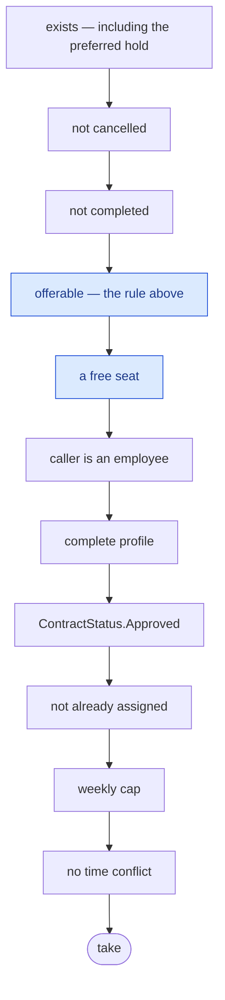

# Offerability

**Which orders a cleaner may be shown, and which they may take.** One rule, evaluated at two moments,
living in exactly one place: `OrderAvailability`. Every surface reads it; none re-derives it.

## The rule

It is a property of the **order alone** — four columns in, a bool out — and it spans both axes of the
[order lifecycle](/domain/order-lifecycle):

```csharp
(CurrentStatus == Confirmed || (CurrentStatus == New && PaymentType == Cash))
&& (PaymentStatus == Paid  || (PaymentType == Cash && RecurringTemplateId == null))
```

## Why a status list cannot express it

Two conditionals make the fulfilment axis insufficient on its own:

- **`New` is offerable only for cash.** On a one-off cash order the take *is* the confirmation, so
  there is nothing to wait for. On a card order, `New` means the webhook has not landed.
- **`Confirmed` is offerable only once nothing scheduled can still retract it.** A recurring occurrence
  the customer has not confirmed can still be withdrawn, and a cleaner should not be standing in a
  doorway when that happens.

`OfferableStatuses = { New, Confirmed }` exists, but it is **the coarse floor, not the rule** — the
statuses the rule can ever admit. It is there because the clients cannot evaluate the money term (they
filter on none of the three money columns) and because it is the index-served prefilter on
`Orders.CurrentStatus`.

## Two evaluation forms, on purpose

| Form | Used by |
|---|---|
| `IsOfferableSql` | queries — `OrderSpecification`, the new-jobs digest sweep |
| `IsOfferable` | the in-memory write gate in `TakeOrder` |

They are **not** one shared expression. SQL and C# disagree on null semantics, and compiling an
expression tree on a request path is banned here. Instead they are pinned against each other by an
equivalence test over real Postgres — never by review.

A cross-stack check also holds the eight client-side status literals — across TypeScript, Kotlin and
Swift — to the canonical C# list, so a client cannot quietly drift into offering something the server
will refuse.

## The take is gated, not just the list

Showing an order and letting someone take it are different questions, and the second one is a single
ordered `Cascade.Stop` chain in `TakeOrder.Validator`:



**The order matters and a second chain would break it.** FluentValidation's class-level default is
`Continue`, so a second chain would run regardless of this one's verdict — the cascade is the whole
mechanism.

Note where *cancelled* and *completed* sit: **before** offerability. A cancelled order with a free seat
should say the job is gone, not that it is full.

## The preferred-cleaner hold

A separate question, conjoined by the surfaces that need it. Until `Order.PreferredHoldUntilUtc`, the
order's **first seat** is offered to `Order.PreferredEmployeeId` alone.

`OrderVisibility.NotHeldFrom` opens it on any of five terms — no hold set, no preferred cleaner, the
deadline passed, *you* are the preferred cleaner, or somebody is already assigned.

> The hold is folded into `TakeOrder`'s **existence** check deliberately. A held order must be
> indistinguishable from a missing one, or the refusal itself leaks the fact that someone else was
> named. For the same reason `PreferredEmployeeId` never appears on a partner-facing DTO.

## Seat allocation

Passing the gate is not the end. The seat itself is arbitrated by a unique index on
`(OrderId, SeatOrdinal)` — the three in-memory capacity checks are unlocked reads, and two cleaners
tapping the same single-seat job both pass all three. The loser's insert is rejected at commit and
turned back into the ordinary "no available spots" refusal, so the two paths cannot disagree.
