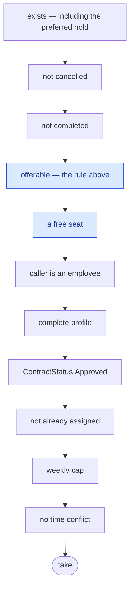

# Offerability

**Which orders a cleaner may be shown, and which they may take.** One rule, evaluated at two moments,
living in exactly one place: `OrderAvailability`. Every surface reads it; none re-derives it.

## The rule

It is a property of the **order alone** — four columns in, a bool out — and it spans both axes of the
[order lifecycle](/domain/order-lifecycle):

```csharp
(CurrentStatus == New || CurrentStatus == Confirmed
    || CurrentStatus == OnTheWay || CurrentStatus == InProgress)                 // the work is not over
&& (PaymentStatus == Paid || (PaymentType == Cash && RecurringTemplateId == null)) // nothing can retract it
```

The status term asks one thing — is the work over? — and qualifies nothing about money. The money term
carries the whole payment qualification. That split is [ADR-0057](/decisions/adr-0057) (owner ruling
2026-09-08): until then the status term read `Confirmed || (New && Cash)`, because the Stripe webhook
wrote `Confirmed` when a card payment settled. `Confirmed` now means only that a cleaner took the job,
so a paid card order rests at `New`, and the cash qualifier would have taken every card job off every
board.

## Why a status list cannot express it

Every status the rule admits is also a status it refuses, depending on the money. What the money term
decides:

| Order | Offerable | Why |
|---|---|---|
| One-off, cash | **yes, from creation** | Nothing scheduled can retract it. The take *is* the confirmation, and the money changes hands at the door |
| One-off, card, `Paid` | **yes** | The webhook's `Paid` write puts it on the board; the status stays `New` until a cleaner takes it |
| One-off, card, `Pending` or `Failed` | no | The money has not landed. A `Pending` checkout is cancelled by `CleanupStalePendingOrders` once it is more than an hour old (the sweep runs every 15 minutes). `Failed` is only ever written together with a cancellation — by that sweep, or by the webhook when Stripe expires or cancels the payment |
| Recurring occurrence, `Pending` (cash or card) | no | The customer has not confirmed it, and `AutoCancelStaleRecurringOrders` withdraws it an hour before the slot. A cleaner should not be standing in a doorway when that happens |
| Recurring occurrence, `Paid` | **yes** | A cash occurrence gets its `Paid` from the customer's confirm (`ConfirmRecurringOrder`); a card one from the webhook |

The money term **refuses everything either retracting sweep can still reach** —
`CleanupStalePendingOrders` (card, `Pending`, not recurring) and `AutoCancelStaleRecurringOrders`
(recurring, `Pending`): an order is offerable only when neither sweep's filter would match it. The one
`Pending` order it admits is a one-off cash order, which neither sweep touches. A third scheduled
retractor must be refused there too, or the board offers orders that are about to disappear.

The status term says the work is **not over**, not that it has **not started** (owner ruling
2026-09-06). A job longer than two hours has several seats, and the first cleaner to tap *on my way*
writes an order-level `OnTheWay` while another seat is still empty. Only `Completed`, `Cancelled` and
the dead `Pending` are out.

`OfferableStatuses = { New, Confirmed, OnTheWay, InProgress }` is the status term on its own — **the
coarse floor, not the rule**. It is there because the clients cannot evaluate the money term (they
filter on none of the three money columns) and because it is the index-served prefilter on
`Orders.CurrentStatus`. A read that asks *"may a cleaner be offered this?"* and uses it without the
money term offers orders the rule refuses; the reads that use it on purpose ask a different question —
whether the work is still owed.

## Two evaluation forms, on purpose

| Form | Used by |
|---|---|
| `IsOfferableSql` | queries — `OrderSpecification`, the new-jobs digest sweep |
| `IsOfferable` | the in-memory write gate in `TakeOrder` |

They are **not** one shared expression. SQL and C# disagree on null semantics, and compiling an
expression tree on a request path is banned here. Instead they are pinned against each other by an
equivalence test over real Postgres — never by review.

A cross-stack check also holds the eight client-side status literals — across TypeScript, Kotlin and
Swift — to the canonical C# list, so a client cannot quietly drift into offering something the server
will refuse.

## The take is gated, not just the list

Showing an order and letting someone take it are different questions, and the second one is a single
ordered `Cascade.Stop` chain in `TakeOrder.Validator`:


```mermaid
flowchart TB
  A["exists — including the preferred hold"] --> B["not cancelled"]
  B --> C["not completed"]
  C --> D["offerable — the rule above"]
  D --> E["a free seat"]
  E --> F["caller is an employee"]
  F --> G["complete profile"]
  G --> H["ContractStatus.Approved"]
  H --> I["not already assigned"]
  I --> J["weekly cap"]
  J --> K["no time conflict"]
  K --> L(["take"])

  classDef gate fill:#dbeafe,stroke:#1d4ed8,color:#1e3a8a
  class D,E gate
```

**The order matters and a second chain would break it.** FluentValidation's class-level default is
`Continue`, so a second chain would run regardless of this one's verdict — the cascade is the whole
mechanism.

Note where *cancelled* and *completed* sit: **before** offerability. A cancelled order with a free seat
should say the job is gone, not that it is full.

## The preferred-cleaner hold

A separate question, conjoined by the surfaces that need it. Until `Order.PreferredHoldUntilUtc`, the
order's **first seat** is offered to `Order.PreferredEmployeeId` alone.

`OrderVisibility.NotHeldFrom` opens it on any of five terms — no hold set, no preferred cleaner, the
deadline passed, *you* are the preferred cleaner, or somebody is already assigned.

> The hold is folded into `TakeOrder`'s **existence** check deliberately. A held order must be
> indistinguishable from a missing one, or the refusal itself leaks the fact that someone else was
> named. For the same reason `PreferredEmployeeId` never appears on a partner-facing DTO.

**A release ends the hold its beneficiary held.** A cleaner dropping a job ends their own live
reservation on it, and — since [ADR-0067](/decisions/adr-0067) — **an admin rejection ends a hold whose
beneficiary is the rejected cleaner**: an order returned to the board must be *on* the board, and a
live hold would hide the seat from every other cleaner for up to twelve hours on behalf of someone who
can no longer work. A hold naming a *different* cleaner on a multi-seat job is not the release's to
end. Nothing else about offerability moves on a walk-back: `New` and `Confirmed` are both in the
coarse floor and the rule reads no seats, so an order that was offerable at `Confirmed` with a free
seat is offerable at `New`; the offer window and the lapse sweep are status-blind and unchanged.

## The cleaner's currency {#cleaner-currency}

The second (order, cleaner) question, and the same type answers it. A cleaner is paid in the currency
of the country they work in (owner ruling 2026-09-12), and an order in any other currency would earn
them a pay row, then an invoice, in a currency their payout account does not hold. So
`OrderVisibility.PayableTo` — the order is in the cleaner's currency, or the cleaner is already on it —
is conjoined with the hold into `OpenTo`, which the board, the count, the browse gate and the take all
read; the pending-offer list conjoins `PayableTo` alone. A null resolved currency fails closed: an
empty board, never every board. The resolver itself never hands the predicate a guess: a work country
with no configured currency throws before the board is read (owner ruling 2026-09-12), so a cleaner is
never shown the platform default's orders because their country's row is missing. The take answers
`order.not_found`, exactly as for a held order, for the same reason. `AdminReassignOrder` does not
read `PayableTo` — it is the override — but it does refuse a cleaner who is not approved, does not
work in the order's market, or is busy at the time
([reassignment](/admin-app/order-management#order-reassignment)). An assignment made over the
currency rule stays visible to the cleaner it was made for.
→ [Business rules](/product/business-rules#cleaner-currency)

## Seat allocation

Passing the gate is not the end. The seat itself is arbitrated by a unique index on
`(OrderId, SeatOrdinal)` — the three in-memory capacity checks are unlocked reads, and two cleaners
tapping the same single-seat job both pass all three. The loser's insert is rejected at commit and
turned back into the ordinary "no available spots" refusal, so the two paths cannot disagree.
