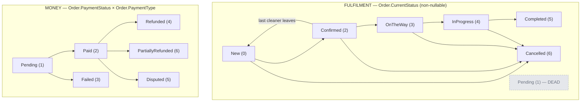

# Order lifecycle

An order's state is **two independent axes, not one**. Reading only the fulfilment axis is the single
most common mistake made against this domain, and it is the reason this page exists before any of the
flow pages.

## The two axes

`PaymentType` is `Cash (1)` or `Card (2)` and never changes after creation. `Cash` is chosen only by a
signed-in customer whose booking needs one cleaner → [Paying in cash](/product/business-rules#cash).

## Why one axis is not enough

**Every** order starts at `New` with `PaymentStatus.Pending` — cash and card alike. From there the two
axes move independently, and the combination is what any real question is actually asking:

| Situation | `CurrentStatus` | `PaymentType` | `PaymentStatus` |
|---|---|---|---|
| Card order awaiting the Stripe webhook | `New` | `Card` | `Pending` |
| Card order paid, nobody has taken it | `New` | `Card` | `Paid` |
| One-off cash order, nobody has taken it | `New` | `Cash` | `Pending` |
| Cash order a cleaner has taken | `Confirmed` | `Cash` | `Pending` |
| Card order a cleaner has taken | `Confirmed` | `Card` | `Paid` |

**The two axes are genuinely independent, and the table shows it.** Paying does not move the
fulfilment axis; a cleaner accepting does not move the money axis. A cash order reaches `Confirmed`
with no money having moved, and a card order reaches `Paid` with nobody assigned.

## `Confirmed` means one thing: a cleaner took the job

**Owner ruling 2026-09-08 → [ADR-0057](/decisions/adr-0057).** It used to mean *either* "money
settled" *or* "a cleaner took it", and this page used to record that as deliberate. It is not any
more. Two producers stopped writing it:

| Writer | What actually happened | Writes `Confirmed`? |
|---|---|---|
| `TakeOrder` | a cleaner took the job | **yes** |
| `AdminReassignOrder` | an admin assigned a cleaner | **yes** — added with the split |
| `HandlePaymentNotification` | the Stripe webhook landed | no — sets `PaymentStatus.Paid` only |
| `ConfirmRecurringOrder` | the customer confirmed a recurring occurrence | no — money axis only |
| `AdminOverrideOrderStatus` | an admin forced it | yes — but only onto an order that has a crew; on an unstaffed one the target is refused (`order.status.confirmed_needs_crew`, ADR-0067) |

> **`Confirmed` means a cleaner took it — and since [ADR-0067](/decisions/adr-0067) (owner ruling
> 2026-09-19) the word is walked back when that stops being true.** When the last assigned cleaner
> leaves a `Confirmed` order — a **drop**, or an admin **rejecting** the cleaner — the order returns to
> `New` through one domain writer, `Order.ReturnToBoardIfUnstaffed()`, and the fresh `New` row is also
> its re-advertisement to the board. Only two writers can empty a crew: **a cover request removes
> nobody** (the cleaner stays assigned until somebody takes the seat), and a reassign or a cover swap
> **replaces** — remove then add, never a release. An order past `Confirmed` is never walked back: a
> drop at `OnTheWay` or `InProgress` leaves the status where it is (a cleaner may be in the home) and
> the company's administrators are told instead. Two releases racing on one order can still leave
> `Confirmed` with nobody on it — `CurrentStatus` is the only concurrency token and neither commit
> changes it — which is why every sweep, reminder and validator keeps reading `AssignedEmployees`:
> **the crew is the fact, the status its summary.** `CancellationAssessor` does exactly that, and did
> so even before the split. → [Business rules — when the last cleaner leaves](/product/business-rules#crew-lost)

> **And `Confirmed` still says nothing about the contract for work.** Since [ADR-0068](/decisions/adr-0068)
> (2026-09-20) a cleaner who *took* the job accepted the contract in the same act, but an admin's
> reassignment writes `Confirmed` with **no** acceptance — the `WorkContractAcceptances` row for the
> seat is the fact, and `StartOrder` / `CompleteOrder` read that row, never the status.
> → [Execution and completion — the contract gate](/flows/execution-and-completion#the-contract-gate)

## `Pending (1)` is dead, and stays

Nothing in production writes `OrderStatus.Pending`. The state the old documentation described — *"card
payment initiated, waiting for the webhook"* — is real and shipping, but it lives on the **money**
axis, which is what the sweeps and the offerability rule actually read.

So the "missing" writer is not missing. It is a duplicate that was never built, and adding one would
give a single fact two sources of truth.

It is **not deleted**, for two reasons: the integer is on the wire to three generated clients, and
legacy rows may still hold it. Readers must keep tolerating it **in the conservative direction** — a
`Pending` row counts as live for the calendar and for GDPR erasure, and it stays rankable by the admin
override. It is never offerable, and the override refuses it as a *target*.

## `CurrentStatus` is a denormalisation with one writer

`Order.CurrentStatus` is non-nullable and is a persisted copy of the latest `OrderStatusHistory` row.
It is written **only** by the `Order.AddOrderStatus` append seam, which also assigns each history row a
strictly-increasing `Sequence` — `CreatedOn` is millisecond-resolution and ties when two transitions
land in the same tick.

There is no history fallback and no `!= null` conjunct. Dropping those is what lets Postgres seek on
`IX_Orders_CurrentStatus_CleaningDateTime`. **Do not reintroduce a nullable read.**

**The one backward edge has one writer, and the override cannot fake the forward one.**
`OrderStatusTrack.Create(OrderStatus.New, …)` reaches `AddOrderStatus` from exactly two places: the
factory at creation, and `Order.ReturnToBoardIfUnstaffed()` — a no-op unless the crew is empty *and*
the order is `Confirmed`, called by the two release writers (`DropOrder`, `RejectEmployee`) after their
unassign and never by a swap. In the other direction, `AdminOverrideOrderStatus` keeps its strictly
forward rank rule and gains one refusal: **`Confirmed` as a target on an order with nobody assigned is
refused** (`order.status.confirmed_needs_crew`) — an administrator who wants a cleaner on the job
reassigns, which writes `Confirmed` itself. The other forward moves stay open on an unstaffed order
(`New → OnTheWay / InProgress / Completed` are the *"the cleaner is there but never tapped"* repairs);
they are the administrator's own audited act, and an override to `Completed` now also stamps
`CompletedAt`, because the revenue report reads it. → [Admin order management](/admin-app/order-management#order-status-override)

## Where the axes are read together

Two rules span both axes and neither can be expressed as a status list:

- **Offerability** — whether a cleaner may be shown, and may take, an order. See
  [Offerability](/domain/offerability).
- **The stale-order sweep** — matches `PaymentStatus == Pending && PaymentType == Card &&
  RecurringTemplateId == null`, with **no status term at all**.

## Seats

`RequiredEmployees = ceil(EstimatedTime / 120)`, and `MaxEmployees = RequiredEmployees +
BookingPolicy.SpareSeatsPerOrder`.

**`SpareSeatsPerOrder` is `0`.** There is no spare seat, by owner ruling: pay is one row per assigned
employee with no crew-size term, so a filled spare seat is a second full wage against an unchanged
customer price.

Which seat a cleaner occupies is recorded as `OrderEmployee.SeatOrdinal`, unique per order at the
database. That unique index — not the in-memory checks — is what stops two cleaners taking the same
seat concurrently.
