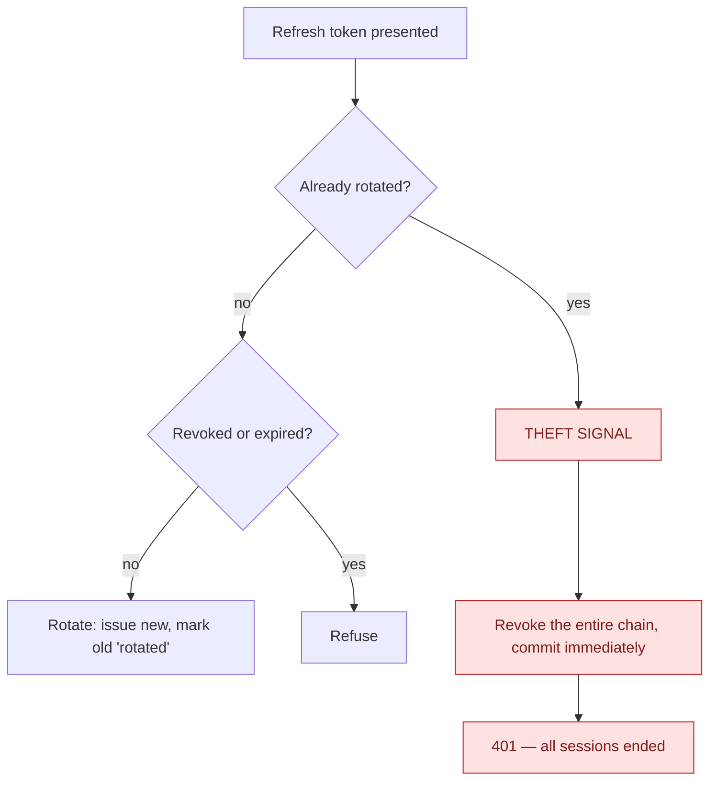

# Auth and identity

Sign-in, sessions, and how a stolen session is ended.

## Sessions

An access token is short-lived; a refresh token is the long-lived credential and is **rotated on every
use**. Only a hash of it is stored.

| Host | Access token |
|---|---|
| Admin web | 15 min |
| Partner web, Customer web | 24 h |
| Both mobile hosts | 30 min |

The admin figure is deliberate: on web there is no device id, so the TTL *is* the revocation window.
Partner and customer web stay at 24 h by a separate, recorded decision.

## Rotation detects theft

Presenting an already-rotated token means either a client that retried, or a thief. Both are handled
the same way: kill the chain.

**The chain revoke commits itself**, independently of the caller. The unit-of-work pipeline commits
only on success, and this path deliberately returns a failure — so without its own commit the security
revocation would be rolled back and every stolen token would stay valid.

Revocation is idempotent, so it retries on a concurrency collision rather than surfacing a 500. When
the retry budget is spent it falls back to a **set-based revoke that verifies termination** and throws
rather than reporting a revocation that provably did not complete. A kill switch cannot be outraced
into failing open.

## Registration writes the consent, and the record of it

A sign-up that ticks the terms box sends `termsAccepted: true`, and the **server** grants
`TermsOfService` and `PrivacyPolicy` in the same commit as the account — each `UserConsents` row
stamped with the version in force (`LegalDocumentVersions`, `"2026-09-draft"` today), the IP address
and the device, read server-side and never from the body. Nothing is parked in the browser to be
flushed later. An email registration additionally leaves a `customer.account.register` audit row
carrying the method, the language, whether a referral code was given, the tick and both versions —
with the new user's id, which the session cannot supply because the user did not exist when the
request began. A Google or Apple sign-up grants the same two consent rows and leaves **no** audit row:
those commands sign an existing user in before they provision a new one, so a marker would record a
registration on every social login and an IP-bearing failure row on every bad token, which is a login
history the platform declines. A refused email registration is a row — with the caller's IP, no user,
and the key — bounded by the `auth` window.

A client that sends no tick — every shipped mobile build — is recorded as *not asserted*, and the
registration is **not refused** for it (record only, until the legal texts are final). A customer
granting a consent again later under a different document version moves the consent row to the new
version and writes a `customer.consent.grant` row; withdrawing writes `customer.consent.withdraw`. The
consent row is the current state; those audit rows are the history. On the partner hosts the same
`GrantConsent` command stamps no version: a cleaner accepts a different document
([ADR-0041](/decisions/adr-0041)), whose versioning is not built. → [ADR-0062](/decisions/adr-0062) D4,
[What is recorded about a customer](/product/business-rules#customer-record)

## Immediate cutoff beyond the token TTL

Mobile hosts additionally consult polled directories of revoked devices and revoked users, so a
password reset or a device revocation takes effect without waiting for the token to expire. The web
hosts have no device id, which is why the admin TTL was shortened instead.

## Edge cases

| Case | What happens |
|---|---|
| Logout presenting an already-rotated token | Walks the successor chain and kills the live descendant — session-scoped, so a benign client race logs out one session rather than all devices. |
| Logout with an unknown token | Silently succeeds. Logout is idempotent and must not confirm whether a token exists. |
| Password reset while a thief holds a session | All sessions revoked; the revoke is committed before the password change, so the failure mode is "tokens dead, retry" and never "tokens alive". |
| Rotation racing a revoke | The revoke wins — the rotation's commit fails on the concurrency token and rolls back both the mark and the new token. |
| Device revoked | Only tokens carrying that device id are ended. A token with no device id survives to natural expiry rather than being killed by an unrelated device. |
| Google or Apple sign-in | Resolved by **subject**, never by email address. No audit row on either branch; a first sign-in writes the two versioned consent rows. |
| Login, logout, refresh, password reset | No audit row. The `RefreshToken` row (IP, device, audience, 90 days) is the session record; a longer login history is a lawyer's question, answered no for now. |
