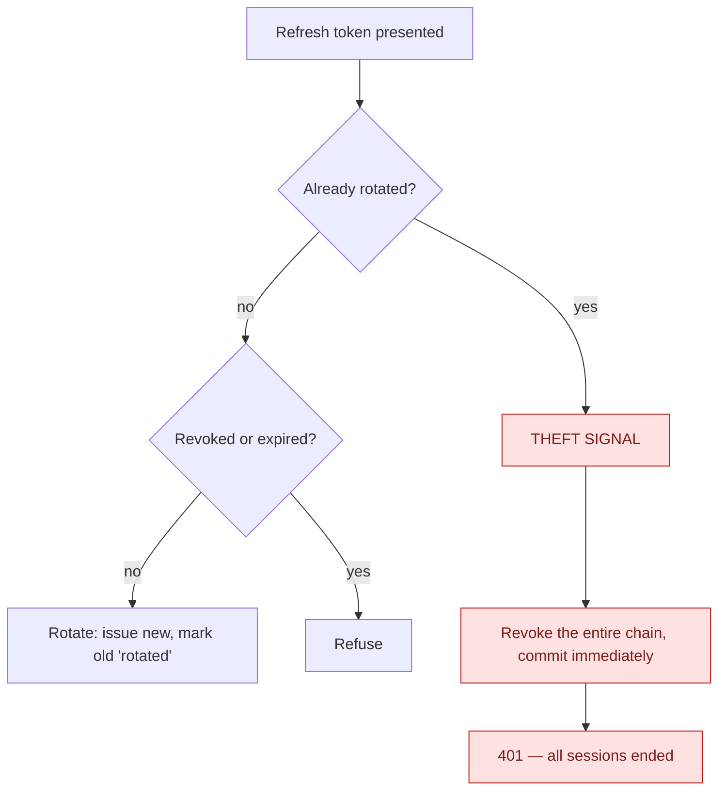

# Auth and identity

Sign-in, sessions, and how a stolen session is ended.

## Sessions

An access token is short-lived; a refresh token is the long-lived credential and is **rotated on every
use**. Only a hash of it is stored.

| Host | Access token |
|---|---|
| Admin web | 15 min |
| Partner web, Customer web | 24 h |
| Both mobile hosts | 30 min |

The admin figure is deliberate: on web there is no device id, so the TTL *is* the revocation window.
Partner and customer web stay at 24 h by a separate, recorded decision.

## Rotation detects theft

Presenting an already-rotated token means either a client that retried, or a thief. Both are handled
the same way: kill the chain.

**The chain revoke commits itself**, independently of the caller. The unit-of-work pipeline commits
only on success, and this path deliberately returns a failure — so without its own commit the security
revocation would be rolled back and every stolen token would stay valid.

Revocation is idempotent, so it retries on a concurrency collision rather than surfacing a 500. When
the retry budget is spent it falls back to a **set-based revoke that verifies termination** and throws
rather than reporting a revocation that provably did not complete. A kill switch cannot be outraced
into failing open.

One caller does **not** want that commit: the GDPR erasure, which must be one transaction, revokes
every session through a *staged* variant that rides the erasure's own single commit — a concurrency
collision there fails the erasure as a whole, which is the correct answer, and the retry is the
erasure's (→ [GDPR — erasure is one commit](/flows/gdpr-and-audit#erasure-is-anonymise-in-place)).

## Registration requires the tick, writes the consent, and the record of it

A customer sign-up **must** send `termsAccepted: true` — a missing or `false` tick is refused as
`consent.terms_not_accepted` before any account exists (owner ruling 2026-09-14; the refusal itself
is a row with the caller's IP). With the tick, the **server** grants `TermsOfService` and
`PrivacyPolicy` in the same commit as the account — each `UserConsents` row stamped with the
**document in force for the chosen market** (its version is its effective date, `2026-09-14` today,
and its id; [ADR-0063](/decisions/adr-0063)), the IP address and the device, read server-side and never
from the body. Nothing is parked in the browser or on the phone to be flushed later: the customer web,
the Android and the iOS customer apps all send the tick on the registration itself. An email
registration additionally leaves a `customer.account.register` audit row carrying the method, the
language, whether a referral code was given, the tick and both versions — with the new user's id,
which the session cannot supply because the user did not exist when the request began.

A Google or Apple **sign-up** grants the same two consent rows and writes no registration row — the
command is a sign-in-or-register, and its marker records the **sign-in** (below); on the provisioning
branch the handler declines the success row, and the consent rows are the proof. A social sign-up
without the tick is refused as `auth.social_account_not_found`: on the shared endpoint the tick is what
tells the sign-up screen from the sign-in screen, every client refuses client-side first, and the key
reads as "sign up first".

A customer granting a consent again later under a **different document** moves the consent row to it
and writes a `customer.consent.grant` row; withdrawing writes `customer.consent.withdraw`. The consent
row is the current state; those audit rows are the history. Nobody is re-prompted when a new version
of the text takes effect. On the partner hosts the same `GrantConsent` command stamps no document, and
a cleaner's registration (`RegisterEmployee`) sends its tick too — the partner web form does, both
mobile partner apps still park it for the first sign-in — and grants the two employee consents
unversioned: a cleaner accepts a different document ([ADR-0041](/decisions/adr-0041)), whose
versioning is not built, and employee registration is not gated. → [ADR-0062](/decisions/adr-0062) D4 as
amended, [What is recorded about a customer](/product/business-rules#customer-record)

## Sign-in and session acts leave a row {#session-rows}

Since the owner overruled the "no login history" default (2026-09-14, Q-AUD-L5), every session act
on a **customer host** is a `CustomerActionAudits` row through the same pipeline as a booking:

| Act | Row | What it carries |
|---|---|---|
| Password sign-in (web or mobile), Google or Apple sign-in of an existing account | `customer.session.login` | method, remember-me, the client family the token was minted for, and whether the address was confirmed — a right password on an unconfirmed address is a success that **opens no session**, and the row says so |
| Sign-out | `customer.session.logout` | whether a token was there to revoke |
| Password reset requested / completed | `customer.password.reset_requested` / `.reset_completed` | the subject only |
| E-mail confirmed | `customer.account.email_confirmed` | the 6-digit code or a legacy link |
| Refresh-token rotation | **no row** | the `RefreshToken` row is the record |

A wrong password, an unknown address, a bad social token: each is a failure row with the key and the
caller's IP, bounded by the `auth` window. **An unknown address names nobody** — the row has no user,
no resource and no payload, so the address the caller typed reaches no column. A refused sign-in on
an account that exists is `UserId = null` as well (the refusal is a validation reject, which never
reaches the handler that names the subject) — attributable by IP only until the owner rules on naming
the account. **On a partner host none of this is written**: the same commands serve cleaners there,
whose session history belongs in no table, and the audit gate writes an anonymous act only on a
customer host. An Administrator's own sign-out on the admin host lands in the *admin* table.

The row is stamped with the **account's** operating company, not the default market's — the sign-in
adopts the user's tenant before the confirmation check, and the two reset commands (which mint no
token) adopt it themselves — so a second operator's customer never lands in the first operator's feed
([ADR-0061](/decisions/adr-0061) D4 as amended).

## Immediate cutoff beyond the token TTL

Mobile hosts additionally consult polled directories of revoked devices and revoked users, so a
password reset or a device revocation takes effect without waiting for the token to expire. The web
hosts have no device id, which is why the admin TTL was shortened instead.

## Edge cases

| Case | What happens |
|---|---|
| Logout presenting an already-rotated token | Walks the successor chain and kills the live descendant — session-scoped, so a benign client race logs out one session rather than all devices. |
| Logout with an unknown token | Silently succeeds. Logout is idempotent and must not confirm whether a token exists. |
| Password reset while a thief holds a session | All sessions revoked; the revoke is committed before the password change, so the failure mode is "tokens dead, retry" and never "tokens alive". |
| Rotation racing a revoke | The revoke wins — the rotation's commit fails on the concurrency token and rolls back both the mark and the new token. |
| Device revoked | Only tokens carrying that device id are ended. A token with no device id survives to natural expiry rather than being killed by an unrelated device. |
| Google or Apple sign-in | Resolved by **subject**, never by email address. A sign-in of an existing account is a `customer.session.login` row; a first sign-in provisions the account, writes the two versioned consent rows and declines the login row. |
| Login, logout, password reset, e-mail confirmation | A customer audit row each, on a customer host only (→ [Session rows](#session-rows)). Refresh rotations write none; the `RefreshToken` row (IP, device, audience, 90 days) stays their record. |
| Registration or booking without the terms tick | Refused, `consent.terms_not_accepted`; the refusal is a row with the caller's IP. A signed-in customer who already holds both consents sees no box and is not asked. |
