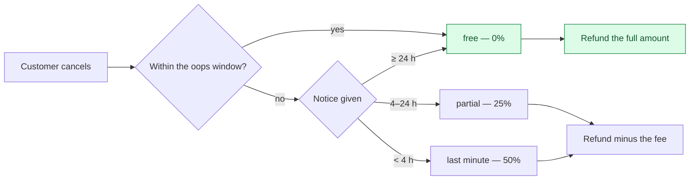

# Cancellation, refund and dispute

Three ways money goes back, with different triggers and different authority.

## Cancellation



The oops window is **15 minutes** from booking, or **60** for a first-time customer, regardless of how
close the cleaning is. A Plus membership can widen the free window. The fee ladder itself is priced in
exactly one place.

When the **cleaner** cancels or no-shows, the customer is refunded *and* credited 500 CZK. The credit
is the apology; the refund is not.

## Refund

A refund is bounded by what is left, and the bound is computed rather than trusted:

```
refundable = order.TotalPrice − already consumed
amount     = min(requested, refundable)      refuse if ≤ 0
```

**The Stripe call happens before the status flips.** A failed call therefore leaves no phantom
`Refunded` — the order keeps its real state and the caller gets a failure. The status becomes
`Refunded` or `PartiallyRefunded` depending on whether the total is now covered.

Re-driving an existing refund row clamps it to what remains rather than issuing a second one.

## Dispute

A dispute has a guarded state machine: the terminal writes — close, escalate, resolve — may only be
reached through the transition guard or the sanctioned webhook path. A direct call from anywhere else
is a build-time violation, because a dispute that skips the guard can land in a state its history
cannot explain.

Chargebacks arrive as Stripe events and are **reflected onto the linked dispute**, not onto the
order's payment status.

## Edge cases

| Case | What happens |
|---|---|
| Refund more than was paid | Clamped to what remains; refused at zero. |
| Stripe refund call fails | No status change. The order is not left claiming a refund that never happened. |
| Refund requested twice | The second resolves to the existing row rather than issuing again. |
| Cancel after the cleaner is on the way | Allowed; the fee ladder decides the cost. |
| Cancel by someone who does not own the order | Refused — the handler checks `order.UserId`. |
| Dispute resolved outside the guard | Cannot happen from application code; the checker fails the build. |
| Express waiver used, then the order cancelled | The consumed benefit slot is forfeited or released by rule, not silently kept. |
