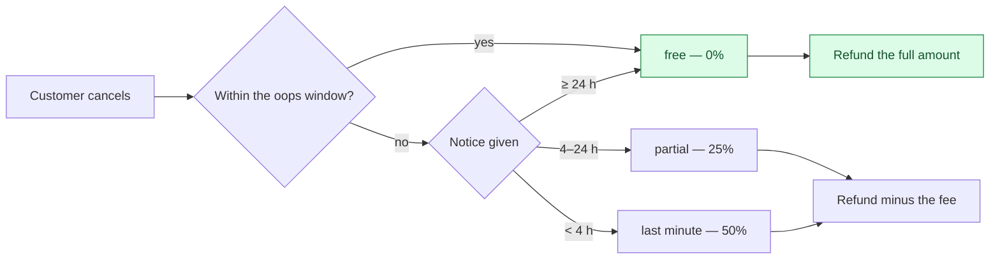

# Cancellation, refund and dispute

Three ways money goes back, with different triggers and different authority.

## Cancellation



The oops window is **15 minutes** from booking, regardless of how close the cleaning is.
`BookingPolicy` also declares a 60-minute first-customer window, but `CancellationAssessor` always
passes `IsFirstTimeCustomer = false`, so that wider window is unreachable. Whether to enable it and
how to count guest history, or remove it, remains an owner decision. A Plus membership can widen
the free cancellation notice window. The fee ladder itself is priced in exactly one place.

When the **cleaner** cancels or no-shows, the customer is refunded *and* credited the apology figure
authored for the order's currency — `Currency.NoShowCredit`, 250 on a CZK order, paid into the
customer's credit account in that currency. The credit is the apology; the refund is not. A currency
with no figure pays no credit and sends the plain cancellation push rather than the one that promises
one. The push that promises it, `order.no_cleaner_refunded`, **names the figure with its currency** —
an `amount` argument formatted on the server from the credit's own currency row ("250 Kč", "10 €":
the number with no trailing zeros, a space, the symbol, the code when there is none), placed by the
Android and iOS bodies as their second slot (owner ruling 2026-09-13; the credit's currency is the
credit's own, which the device cannot derive from the order).
→ [Money constants](/product/business-rules#money-constants)

**The cancel is written down as the server priced it.** `CancelOrder` is marked
`customer.order.cancel` ([ADR-0062](/decisions/adr-0062)): the row that rides its commit carries the
tier, the fee rate and amount, the refund amount, the notice given in hours, the minutes since booking,
whether a cleaner had already accepted (the fact the fee turns on, and one that drop/cover hard-deletes
so it cannot be reconstructed later), the free window applied (Plus or standard), the policy figures at
that moment, whether an express-waiver slot was actually released, whether a refund was initiated,
and that a reason was given — the reason's text stays on the order. The preview the customer saw is
**not** sent back and would not be stored if it were: a row holding "the customer says they were shown
0 %" is their claim, not our evidence; the server's figures at the click plus the deterministic preview
are the proof. A refused cancel is a row too, outside the rolled-back transaction, with the key —
`order.already_cancelled`, `order.in_progress_cannot_cancel` — and, for a customer cancelling someone
else's order, `order.not_found` with the probed order's id, visible only from that order's history.
→ [What is recorded about a customer](/product/business-rules#customer-record)

## Refund

A refund is bounded by what is left, and the bound is computed rather than trusted:

```
refundable = order.TotalPrice − already consumed
amount     = min(requested, refundable)      refuse if ≤ 0
```

**The Stripe call happens before the status flips.** A failed call therefore leaves no phantom
`Refunded` — the order keeps its real state and the caller gets a failure. The status becomes
`Refunded` or `PartiallyRefunded` depending on whether the total is now covered.

Re-driving an existing refund row clamps it to what remains rather than issuing a second one.

**Partial line refunds load every component of the split.** `IssuePartialRefund` uses the order's
persisted service, package and extra snapshots. The detail repository includes `SelectedExtras`, so
their value remains in the denominator even when the selected refund line is a service. On an
undiscounted order with a 1,000 service and a 200 extra, the split allocates 1,000 to that service,
before any applicable processing fee, instead of the whole 1,200. The refund service still applies
its remaining-money ceiling.

## Dispute

A dispute has a guarded state machine: the terminal writes — close, escalate, resolve — may only be
reached through the transition guard or the sanctioned webhook path. A direct call from anywhere else
is a build-time violation, because a dispute that skips the guard can land in a state its history
cannot explain.

Chargebacks arrive as Stripe events and are **reflected onto the linked dispute**, not onto the
order's payment status. The webhook finds the disputed order **by its stored payment intent**, links
the order's open dispute or writes an escalated `Chargeback` one, and acknowledges. Only an order paid
through a PaymentIntent stores one: a mobile PaymentSheet payment or a confirmed recurring occurrence,
both account orders. **A web card booking stores only its Checkout Session, and every guest card
booking is one**, so its chargeback resolves to no order. The webhook logs it and answers `200`. No
dispute is written and no administrator is told.

`Dispute.UserId` is nullable: a dispute hangs off the order, an order may have no account, and the
webhook's writers copy the order's `UserId`. Every ownership read compares that column against the
caller, so no customer can open a dispute that names no account; an administrator can.

**The company's administrators are told of both, in the same commit.** A customer filing a dispute
writes one feed row per administrator of the order's company whose role is Support or above, and one
e-mail per recipient address (`admin.dispute.filed` — the order number and the reason, never the text);
a chargeback writes `admin.dispute.chargeback` — to **every role**, the Accountant included, because the
money that left is theirs to reconcile — with the reversed amount and the dispute the money is now
attached to — the customer's open dispute when there is one, else the chargeback's own — so the console
opens the right file. Both ride the outbox, so a Stripe redelivery that never reaches the handler never mails twice.
→ [Business rules — administrators are told](/product/business-rules#admin-notifications)

**Resolving with a refund moves the money first.** `ResolveDispute` with a refund amount above zero
sends that refund through the one refund seam (reason `DisputeResolution`, the dispute's id on the
`Refund` row) **before** it writes anything on the dispute. The seam splits the amount across the
tenders the order was settled with: the card share goes back through Stripe, clamped to what the card
can still return, and any credit share goes back to the customer's balance in the same commit. Only
when the refund succeeds is the dispute written `Resolved` with its `RefundAmount`, and a customer with
an account told (`order.refunded`, keyed on the refund). The `RefundAmount` recorded is the amount the
administrator asked for, not the figure the seam moved. When the seam refuses — `refund.failed` from
Stripe, `refund.order_not_refundable` on an order with no card charge, `refund.nothing_refundable` once
the ceiling is spent — the resolver gets that error and the dispute stays open. The refund key carries
the dispute's id and no amount, so a retry re-drives the **first attempt's** refund row, clamped to
what remains, whatever amount the retry names. The money moves once, and the dispute records the
retry's amount. A resolution with no amount, or zero, moves nothing and simply resolves. A terminal
dispute is never resolved twice (`dispute.already_resolved`).

**Filing one is recorded against the order, then the dispute.** `CreateDispute` is marked
`customer.dispute.create` with `Order` as its resource, so a filing that is refused — against a clean
that has not started (`dispute.cleaning_not_started`), while another dispute is open on the order, or
naming a line the order does not have — leaves a failure row on the *order* with the key; a filing
that succeeds re-labels its row to the new dispute and records the reason (an enum), the hours since
completion against the 24 h window (a late filing is accepted — the window decides what is promised,
not what is heard — and the row shows on which side of it the filing fell), the window shown, the
description's length and line count — never the text, which lives on the dispute under its own
erasure verdict (kept readable for three years after an erasure, then blanked by the sweep — owner
ruling 2026-09-14, → [GDPR](/flows/gdpr-and-audit#erasure-is-anonymise-in-place)) — and the order total
and currency.
Dispute messages and evidence uploads write no audit row: their own rows are durable and carry author
and time, and the admin's resource history reads the dispute by id. Everything an admin does to the
dispute afterwards — resolve, refund, escalate — is on the same timeline from the admin table, and a
cleaner's drop or cover request on the order from the employee table, so *View audit history* on the
dispute or the order shows the three interleaved, newest first.

## Edge cases

| Case | What happens |
|---|---|
| Refund more than was paid | Clamped to what remains; refused at zero. |
| Stripe refund call fails | No status change. The order is not left claiming a refund that never happened. |
| Refund requested twice | The second resolves to the existing row rather than issuing again. |
| Cancel after the cleaner is on the way | Allowed; the fee ladder decides the cost. |
| Cancel by someone who does not own the order | Refused — the handler checks `order.UserId`. The probe is recorded: a failure row on the caller with `order.not_found` and the probed order as its resource. |
| Dispute resolved outside the guard | Cannot happen from application code; the checker fails the build. |
| Dispute resolved with a refund Stripe refuses | The resolver gets `refund.failed`; the dispute stays open with no `RefundAmount`, and the customer is not told of a refund. Resolving again re-drives the same refund row at the first attempt's amount, even when the retry names another; the dispute then records the retry's amount. |
| Dispute resolved with a refund on a cash booking | `refund.order_not_refundable` — there is no card charge to refund, and the dispute stays open. |
| Chargeback on a web card booking, guest or account | The order is not found, because a Checkout Session order stores no payment intent. The webhook logs it and answers `200`. No dispute is written and the administrators are not told. |
| Express waiver used, then the order cancelled | The consumed benefit slot is forfeited or released by rule, not silently kept. |
