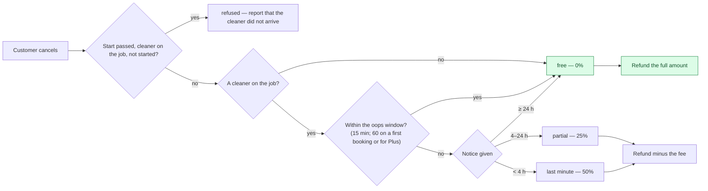

# Cancellation, refund and dispute

Three ways money goes back, with different triggers and different authority.

## Cancellation


```mermaid
flowchart LR
  A[Customer cancels] --> S{"Start passed, cleaner on the job, not started?"}
  S -- yes --> X["refused — report that the cleaner did not arrive"]
  S -- no --> N{A cleaner on the job?}
  N -- no --> F["free — 0%"]
  N -- yes --> B{"Within the oops window? (15 min; 60 on a first booking or for Plus)"}
  B -- yes --> F
  B -- no --> C{Notice given}
  C -- "≥ 24 h" --> F
  C -- "4–24 h" --> P["partial — 25%"]
  C -- "< 4 h" --> L["last minute — 50%"]
  F --> R[Refund the full amount]
  P --> R2[Refund minus the fee]
  L --> R2

  classDef free fill:#dcfce7,stroke:#15803d,color:#14532d
  class F,R free
```

The oops window is **15 minutes** from booking — **60 minutes on a customer's first booking and for an
entitled Plus member** — regardless of how close the cleaning is (owner ruling 2026-09-28, replacing the
2026-09-24 ruling that gave first-time customers 15). A first booking is the first ever on that account,
e-mail or phone, guest or account alike; an abandoned unpaid checkout does not count.
`CancellationPolicyResolver.ResolveForOrderAsync` decides it, live, for the order — the paid-entitlement
read every other Plus benefit uses, then the first-booking read — and every route asks it: the
signed-in and the guest cancel, both previews, and the booking's evidence row. The previews return the figure as `oopsWindowMinutes`, so the sheet states the
customer's own window. A Plus membership separately widens the free cancellation **notice** window
(hours before the cleaning); the two never derive from each other. The fee ladder itself is priced in
exactly one place. → [The oops window](/product/business-rules#oops-window)

**After the booked start, a customer does not cancel.** With a cleaner on the job and nobody having
started it, the cancel and both previews answer `order.start_passed_cannot_cancel` (owner ruling
2026-09-28); the clients replace *Cancel* with *the cleaner did not arrive* — a *service not provided*
dispute when signed in, `ReportGuestNoShow` for a guest. Until then the only self-service answer to an
absent cleaner was a cancel that cost 50 %.

When the **cleaner** cancels or no-shows, the customer is refunded *and* credited the apology figure
authored for the order's currency — `Currency.NoShowCredit`, 250 on a CZK order, paid into the
customer's credit account in that currency. The credit is the apology; the refund is not. A guest has
no credit account and gets the refund only. Nobody-took-the-seat is the unfilled sweep's to settle on
its own; an **assigned** cleaner's absence is confirmed by an administrator (*Cancel as a no-show*,
`AdminCancelOrderAsNoShow`), after the customer's report or the reminder sweep's alert at start + 30
minutes (`admin.order.cleaner_not_started`, once per order). Both run one body,
`CleanerNoShowCancellation`: no fee, the whole card refund, the customer's applied credit back, the
apology, the no-cleaner reason, and a push that says what happened to the money —
`order.no_cleaner_refunded`, `order.no_cleaner_refund_pending` or `order.no_cleaner_nothing_charged`,
each **naming the credit with its currency** as an `amount` formatted on the server from the credit's own
currency row ("250 Kč", "10 €": the number with no trailing zeros, a space, the symbol, the code when
there is none; owner ruling 2026-09-13). A currency with no figure pays no credit and sends the plain
cancellation push. The administrator's confirmation also closes an open *service not provided*
dispute on the order. → [Business rules — when the cleaner no-shows](/product/business-rules#when-the-cleaner-cancels-or-no-shows),
[Money constants](/product/business-rules#money-constants)

**Money never taken is never refunded.** `Order.Cancel` records the fee rate on every cancellation,
but on an order that took no payment (`Order.TookNoPayment`: payment `Pending` or `Failed` — a cash
booking not yet collected, a card never charged) it records a refund of **0**, for every writer: the
customer, an administrator or the company wind-down, and the unfilled sweep. The fee on such an order is
owed and nothing collects it yet; the admin order detail shows the rate and *Fee still owed*
(`CancellationAssessor.FeeOwed` — all of the fee on an unpaid order, zero where a card charge covered
it), two figures only an administrator receives. The previews and the cancel's response report the
same 0 refund, and the web, Android and iOS cancel sheets print no refund line on a cash or unpaid
booking. There is no cash exception any more: a confirmed recurring cash occurrence stays `Pending`
until the cleaner records the cash, so it is inside `TookNoPayment` like every other cash booking.
→ [Business rules — cancellation](/product/business-rules#cancellation)

**The cancel is written down as the server priced it.** `CancelOrder` is marked
`customer.order.cancel` ([ADR-0062](/decisions/adr-0062)): the row that rides its commit carries the
tier, the fee rate and amount, the refund amount, the notice given in hours, the minutes since booking,
the oops window applied and why (`oopsMinutesApplied`, 15 or 60, and `oopsRuleApplied`), whether a cleaner had already accepted (the fact the fee turns on, and one that drop/cover hard-deletes
so it cannot be reconstructed later), the free window applied (Plus or standard), the policy figures at
that moment, whether an express-waiver slot was actually released, whether a refund was initiated,
and that a reason was given — the reason's text stays on the order. The preview the customer saw is
**not** sent back and would not be stored if it were: a row holding "the customer says they were shown
0 %" is their claim, not our evidence; the server's figures at the click plus the deterministic preview
are the proof. A refused cancel is a row too, outside the rolled-back transaction, with the key —
`order.already_cancelled`, `order.in_progress_cannot_cancel`, `order.start_passed_cannot_cancel` — and,
for a customer cancelling someone else's order, `order.not_found` with the probed order's id, visible
only from that order's history.
→ [What is recorded about a customer](/product/business-rules#customer-record)

## Refund

A refund is bounded by what is left, and the bound is computed rather than trusted:

```
refundable = order.TotalPrice − already consumed
amount     = min(requested, refundable)      refuse if ≤ 0
```

**The Stripe call happens before the status flips.** A failed call therefore leaves no phantom
`Refunded` — the order keeps its real state and the caller gets a failure. The status becomes
`Refunded` or `PartiallyRefunded` depending on whether the total is now covered.

Re-driving an existing refund row clamps it to what remains rather than issuing a second one.

**A refund that does not go through is re-driven, not forgotten** (owner ruling 2026-09-28). Until
then a refund Stripe refused or could not be reached for stayed `Pending` for ever, and nobody retried
it. Now:

- **The cancellation survives Stripe.** A signed-in customer's cancel that cannot reach Stripe, or whose refund
  Stripe refuses, still cancels: the `Pending` refund row stays for the re-drive, the credit share goes
  back at once on the refund's key, and the response says `refundPending: true`. The unfilled sweep and
  the admin no-show do the same and say *refund pending* in their push. A guest's cancel still fails on
  a transport fault, so the guest can retry it.
- **The hourly re-drive** (`RedrivePendingRefunds`, on the existing hourly tick of
  `AutoCancelStaleRecurringOrders`, so no new timer) takes every `Pending` app refund older than 30
  minutes, per company, and re-drives a **cancelled order's own** refund through
  `IRefundService.RedriveAsync`: the row's own refund key, clamped to what the order can still return,
  with the credit leg on the same key through the proportional split, so a credit leg already returned
  is never returned twice. On success the customer gets `order.refunded`. A refund with nothing left to
  return is closed; a transport fault on one row is caught and the next run tries again.
- **After 24 hours the administrators are told**, once per order: `admin.payment.refund_stuck` for a
  cancelled order's refund the re-drive keeps trying, `admin.payment.refund_needs_retry` for any other —
  a dispute's, an administrator's or a partial refund, which carries its own key segment, belongs to the
  action that asked for it and is retried there.
  → [Business rules — administrators are told](/product/business-rules#admin-notifications)

**Partial line refunds load every component of the split.** `IssuePartialRefund` uses the order's
persisted service, package and extra snapshots. The detail repository includes `SelectedExtras`, so
their value remains in the denominator even when the selected refund line is a service. On an
undiscounted order with a 1,000 service and a 200 extra, the split allocates 1,000 to that service,
before any applicable processing fee, instead of the whole 1,200. The refund service still applies
its remaining-money ceiling.

## Dispute

A dispute has a guarded state machine: the terminal writes — close, escalate, resolve — may only be
reached through the transition guard or the sanctioned webhook path. A direct call from anywhere else
is a build-time violation, because a dispute that skips the guard can land in a state its history
cannot explain.

Chargebacks arrive as Stripe events and are **reflected onto the linked dispute**, not onto the
order's payment status. The webhook finds the disputed order **by its stored payment intent**, links
the order's open dispute or writes an escalated `Chargeback` one, and acknowledges. Every card order
stores its intent: a mobile PaymentSheet payment and a confirmed recurring occurrence when the intent
is created, and a web Checkout Session — every guest card booking is one — when
`checkout.session.completed` lands. A web order paid before that was recorded is found **through its
Checkout Session**: the webhook asks Stripe for the session behind the intent, reads the order id from
its metadata, stores the intent on the order, and writes the dispute as above.

**A chargeback that matches no order is still heard.** No dispute can be written, so the webhook logs
it, answers `200`, and tells the administrators of **every** operating company
(`admin.dispute.chargeback_unmatched`, with the amount and the Stripe dispute id to answer it by in the
Stripe dashboard): the Stripe account is shared, so the money could be any company's. Only the
`created` event alerts; an update or close for a dispute the platform never recorded is logged and
ignored.

`Dispute.UserId` is nullable: a dispute hangs off the order, an order may have no account, and the
webhook's writers copy the order's `UserId`. Every ownership read compares that column against the
caller, so no customer can open a dispute that names no account; an administrator can.

**The company's administrators are told of both, in the same commit.** A customer filing a dispute
writes one feed row per administrator of the order's company whose role is Support or above, and one
e-mail per recipient address (`admin.dispute.filed` — the order number and the reason, never the text);
a chargeback writes `admin.dispute.chargeback` — to **every role**, the Accountant included, because the
money that left is theirs to reconcile — with the reversed amount and the dispute the money is now
attached to — the customer's open dispute when there is one, else the chargeback's own — so the console
opens the right file. Both ride the outbox, so a Stripe redelivery that never reaches the handler never mails twice.
→ [Business rules — administrators are told](/product/business-rules#admin-notifications)

**How a justified complaint is settled is the customer's choice** (owner ruling 2026-09-28). The
dispute form asks it — a refund to the card, the default, or credit — and `CreateDispute` stores it as
`Dispute.SettlementPreference`; the administrator sees it and decides only the amount. With *credit* and
an account, `ResolveDispute` issues the amount as credit in the order's currency
(`dispute-settlement:{disputeId}`), bounded by what the order has not already given back, records it as
`CreditReturnedAmount`, and moves nothing on the card; *Issue credit* can no longer settle a dispute
(`credit.dispute_settlement_not_issuable`). The rest of this section is the card settlement.
→ [Business rules — dispute settlement](/product/business-rules#dispute-settlement)

**Resolving with a refund moves the money first.** `ResolveDispute` with a refund amount above zero
sends that refund through the one refund seam (reason `DisputeResolution`, the dispute's id on the
`Refund` row) **before** it writes anything on the dispute. The seam splits the amount across the
tenders the order was settled with: the card share goes back through Stripe, clamped to what the card
can still return, and any credit share goes back to the customer's balance in the same commit. Only
when the refund succeeds is the dispute written `Resolved`, and a customer with an account told
(`order.refunded`, keyed on the refund). **The dispute records what was asked and what moved:**

| Field | What it holds |
|---|---|
| `RefundAmount` | the amount the administrator asked for |
| `CardRefundedAmount` | what went back to the card — the seam's clamped amount |
| `CreditReturnedAmount` | what the same refund put back on the customer's credit balance, read from the ledger row written under the refund's key |

The admin dispute detail shows them as *Refund requested*, *Refunded to card* and *Returned as credit*.
A leg that moved nothing shows zero; a dispute resolved without a refund, or before the two legs were
recorded, shows neither. The audit row's before and after carry all three. `DisputeDetails` carries
the two new figures on every host that serves it — admin, customer web and customer mobile — and only
the admin console shows them. When the seam refuses — `refund.failed` from
Stripe, `refund.order_not_refundable` on an order with no card charge, `refund.nothing_refundable` once
the ceiling is spent — the resolver gets that error and the dispute stays open. The refund key carries
the dispute's id and no amount, so a retry re-drives the **first attempt's** refund row, clamped to
what remains, whatever amount the retry names. The money moves once: the dispute records the retry's
amount as requested, and that one refund's card and credit legs as what moved. A resolution with no
amount, or zero, moves nothing and simply resolves. A terminal dispute is never resolved twice
(`dispute.already_resolved`). After an earlier complaint on the order was settled in credit, the card
settlement is held to what the order still has left.

**A refund never touches the cleaner's pay; a finding of fault does.** The resolution may carry
`chargeToCleaner` — the cleaner, an amount and a written reason — which deducts from that cleaner's pay
row on the order, linked to the dispute, with the reason shown on their pay record. It is refused before
any money moves when the pay row is missing, invoiced, already charged or smaller than the charge
(`dispute.cleaner_charge_not_chargeable`). → [Business rules — a cleaner is charged only when found at fault](/product/business-rules#dispute-cleaner-charge)

**"The cleaner did not arrive" is a dispute that also raises the no-show alert.** A signed-in customer's
*service not provided* dispute on a staffed job nobody has started, filed after the start, raises
`admin.order.cleaner_not_started` for the company (once per order, shared with the reminder sweep's
alert); an administrator's no-show confirmation closes it.

**Filing one is recorded against the order, then the dispute.** `CreateDispute` is marked
`customer.dispute.create` with `Order` as its resource, so a filing that is refused — against a clean
that has not started (`dispute.cleaning_not_started`), while another dispute is open on the order, or
naming a line the order does not have — leaves a failure row on the *order* with the key; a filing
that succeeds re-labels its row to the new dispute and records the reason (an enum), the hours since
completion against the 24 h window (a late filing is accepted — the window decides what is promised,
not what is heard — and the row shows on which side of it the filing fell), the window shown, the
description's length and line count — never the text, which lives on the dispute under its own
erasure verdict (kept readable for three years after an erasure, then blanked by the sweep — owner
ruling 2026-09-14, → [GDPR](/flows/gdpr-and-audit#erasure-is-anonymise-in-place)) — and the order total
and currency.
Dispute messages and evidence uploads write no audit row: their own rows are durable and carry author
and time, and the admin's resource history reads the dispute by id. Everything an admin does to the
dispute afterwards — resolve, refund, escalate — is on the same timeline from the admin table, and a
cleaner's drop or cover request on the order from the employee table, so *View audit history* on the
dispute or the order shows the three interleaved, newest first.

## Edge cases

| Case | What happens |
|---|---|
| Refund more than was paid | Clamped to what remains; refused at zero. |
| Stripe refund call fails | No status change. The order is not left claiming a refund that never happened. |
| Refund requested twice | The second resolves to the existing row rather than issuing again. |
| Cancel after the cleaner is on the way, before the start | Allowed; the fee ladder decides the cost. |
| Cancel after the booked start, cleaner assigned, job not started | Refused, `order.start_passed_cannot_cancel`; the customer reports that the cleaner did not arrive, and an administrator confirms the no-show. |
| Stripe unreachable during a signed-in customer's cancel | The order is cancelled, the refund stays `Pending` for the hourly re-drive, the credit share returns now, and the response says `refundPending`. |
| A refund still `Pending` after 24 h | The administrators are told once — `admin.payment.refund_stuck` or `admin.payment.refund_needs_retry`. |
| Cancel by someone who does not own the order | Refused — the handler checks `order.UserId`. The probe is recorded: a failure row on the caller with `order.not_found` and the probed order as its resource. |
| Dispute resolved outside the guard | Cannot happen from application code; the checker fails the build. |
| Dispute resolved with a refund Stripe refuses | The resolver gets `refund.failed`; the dispute stays open with no `RefundAmount`, and the customer is not told of a refund. Resolving again re-drives the same refund row at the first attempt's amount, even when the retry names another; the dispute then records the retry's amount as requested and that refund's legs as what moved. |
| Dispute resolved with a refund on a cash booking | `refund.order_not_refundable` — there is no card charge to refund, and the dispute stays open. A customer who chose credit is settled in credit instead. |
| Dispute settled in credit for more than the order has left | `dispute.invalid_refund_amount`; nothing moves. |
| Chargeback on a web card booking, guest or account | Found by the intent `checkout.session.completed` stored, or through its Checkout Session when the order predates that; the dispute is written and the administrators are told. |
| Chargeback that matches no order | No dispute is written; the webhook answers `200` and the administrators of every company are told (`admin.dispute.chargeback_unmatched`). |
| Express waiver used, then the order cancelled | The consumed benefit slot is forfeited or released by rule, not silently kept. |
