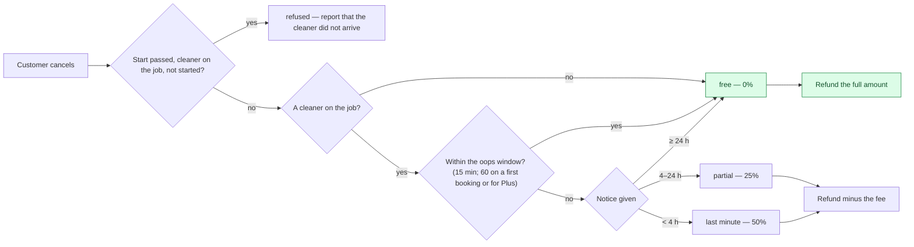
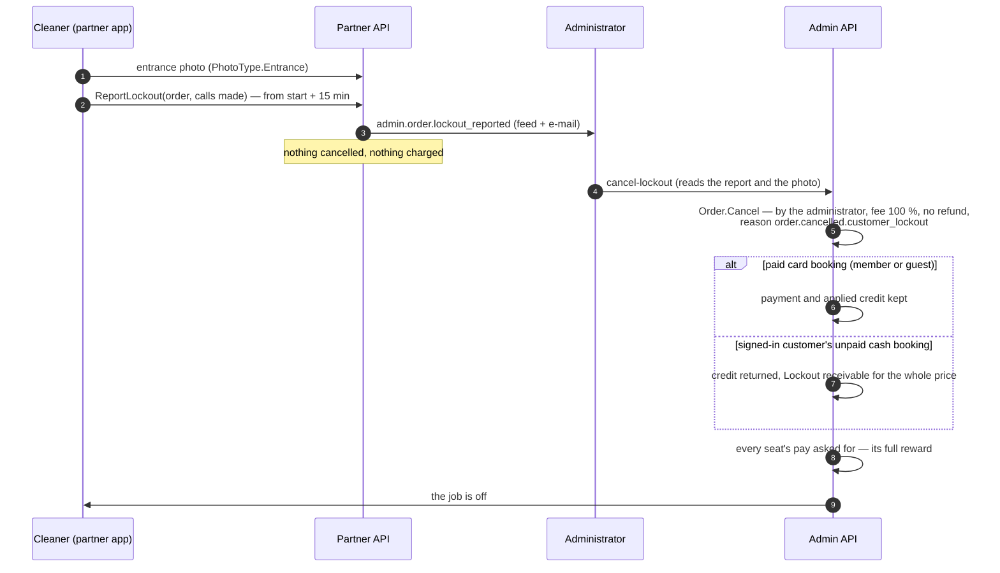

# Cancellation, refund and dispute

Three ways money goes back, with different triggers and different authority.

## Cancellation


```mermaid
flowchart LR
  A[Customer cancels] --> S{"Start passed, cleaner on the job, not started?"}
  S -- yes --> X["refused — report that the cleaner did not arrive"]
  S -- no --> N{A cleaner on the job?}
  N -- no --> F["free — 0%"]
  N -- yes --> B{"Within the oops window? (15 min; 60 on a first booking or for Plus)"}
  B -- yes --> F
  B -- no --> C{Notice given}
  C -- "≥ 24 h" --> F
  C -- "4–24 h" --> P["partial — 25%"]
  C -- "< 4 h" --> L["last minute — 50%"]
  F --> R[Refund the full amount]
  P --> R2[Refund minus the fee]
  L --> R2

  classDef free fill:#dcfce7,stroke:#15803d,color:#14532d
  class F,R free
```

The oops window is **15 minutes** from booking — **60 minutes on a customer's first booking and for an
entitled Plus member** — regardless of how close the cleaning is (owner ruling 2026-09-28, replacing the
2026-09-24 ruling that gave first-time customers 15). A first booking is the first ever on that account,
e-mail or phone, guest or account alike; an abandoned unpaid checkout does not count.
`CancellationPolicyResolver.ResolveForOrderAsync` decides it, live, for the order — the paid-entitlement
read every other Plus benefit uses, then the first-booking read — and every route asks it: the
signed-in and the guest cancel, both previews, and the booking's evidence row. The previews return the figure as `oopsWindowMinutes`, so the sheet states the
customer's own window. A Plus membership separately widens the free cancellation **notice** window
(hours before the cleaning); the two never derive from each other. The fee ladder itself is priced in
exactly one place. → [The oops window](/product/business-rules#oops-window)

**The figures are the order's.** The free notice, the partial threshold, both rates and the Plus free
notice are frozen on the order when it is booked (`Orders.Cancellation*`, owner ruling 2026-10-03 —
terms §19 keep a booking under the version accepted when it was made), so the resolver builds the
policy from the order, never from today's `BookingPolicy`, and a later change of the ladder or of the
Plus window reaches only bookings made after it. Who the customer is — an entitled member, a first
booking — is still judged at the cancel, and the oops minutes are still today's. **The order detail
states the same figure** (owner ruling 2026-10-03). A customer's `GetOrderDetails` carries
`freeCancellationHours`, resolved by `ResolveForOrderAsync` exactly as a cancel would: the order's free
notice, or its Plus notice while the customer is entitled. The customer web's *free cancellation*
note reads it and no longer works the figure out in the browser.
→ [Business rules — cancellation](/product/business-rules#cancellation)

**After the booked start, a customer does not cancel.** With a cleaner on the job and nobody having
started it, the cancel and both previews answer `order.start_passed_cannot_cancel` (owner ruling
2026-09-28); the clients replace *Cancel* with *the cleaner did not arrive* — a *service not provided*
dispute when signed in, `ReportGuestNoShow` for a guest. Until then the only self-service answer to an
absent cleaner was a cancel that cost 50 %.

When the **cleaner** cancels or no-shows, the customer is refunded *and* credited the apology figure
authored for the order's currency — `Currency.NoShowCredit`, 250 on a CZK order, paid into the
customer's credit account in that currency. The credit is the apology; the refund is not. A guest has
no credit account and gets the refund only. Nobody-took-the-seat is the unfilled sweep's to settle on
its own; an **assigned** cleaner's absence is confirmed by an administrator (*Cancel as a no-show*,
`AdminCancelOrderAsNoShow`), after the customer's report or the reminder sweep's alert at start + 30
minutes (`admin.order.cleaner_not_started`, once per order). Both run one body,
`CleanerNoShowCancellation`: no fee, the whole card refund, the customer's applied credit back, the
apology, the no-cleaner reason, and a push that says what happened to the money —
`order.no_cleaner_refunded`, `order.no_cleaner_refund_pending` or `order.no_cleaner_nothing_charged`,
each **naming the credit with its currency** as an `amount` formatted on the server from the credit's own
currency row ("250 Kč", "10 €": the number with no trailing zeros, a space, the symbol, the code when
there is none; owner ruling 2026-09-13). A currency with no figure pays no credit and sends the plain
cancellation push. The administrator's confirmation also closes an open *service not provided*
dispute on the order, unless that dispute's own card refund is still pending (since 2026-10-06): then the
dispute stays open, because resolving it again is that refund's only retry ([Dispute](#dispute)).
→ [Business rules — when the cleaner no-shows](/product/business-rules#when-the-cleaner-cancels-or-no-shows),
[Money constants](/product/business-rules#money-constants)

**Money never taken is never refunded.** `Order.Cancel` records the fee rate on every cancellation,
but on an order that took no payment (`Order.TookNoPayment`: payment `Pending` or `Failed` — a cash
booking not yet collected, a card never charged) it records a refund of **0**, for every writer: the
customer, an administrator or the company wind-down, and the unfilled sweep. The fee on such an order is
owed, not taken. **A signed-in customer's late cancellation of a cash booking opens a receivable for it**
(`Receivable.ForCashCancellationFee`, owner ruling 2026-09-28): while it is open the customer makes no
new booking, cash or card (since 2026-10-06), and it is paid through the customer's pay link or written
off by an administrator
→ [Business rules — what a customer owes](/product/business-rules#receivables). A free cancellation, a
card booking and a guest open none. The admin order detail shows the rate and *Fee still owed*
(`CancellationAssessor.FeeOwed` — all of the fee on an unpaid order, zero where a card charge covered
it), two figures only an administrator receives. The previews and the cancel's response report the
same 0 refund, and the web, Android and iOS cancel sheets print no refund line on a cash or unpaid
booking. There is no cash exception any more: a confirmed recurring cash occurrence stays `Pending`
until the cleaner records the cash, so it is inside `TookNoPayment` like every other cash booking.
→ [Business rules — cancellation](/product/business-rules#cancellation)

**A fee the company collects pays the crew half.** A late cancellation of an order that took a payment
— the fee kept out of the refund — asks for every crew member's pay at the cancel, member or guest; a
cash booking's fee pays when its receivable is paid. Each seat gets its share of 50 % of what the company
still holds, never of a fee still owed → [Business rules — the crew's share](/product/business-rules#fee-share).

## Lockout {#lockout}

The customer's cancellation at the whole price, when the cleaner could not get in (owner rulings
2026-09-28, decisions 11 and 13). A person confirms it, as with an assigned cleaner's no-show.


```mermaid
sequenceDiagram
  autonumber
  participant C as Cleaner (partner app)
  participant API as Partner API
  participant A as Administrator
  participant AD as Admin API

  C->>API: entrance photo (PhotoType.Entrance)
  C->>API: ReportLockout(order, calls made) — from start + 15 min
  API->>A: admin.order.lockout_reported (feed + e-mail)
  Note over API: nothing cancelled, nothing charged
  A->>AD: cancel-lockout (reads the report and the photo)
  AD->>AD: Order.Cancel — by the administrator, fee 100 %, no refund,<br/>reason order.cancelled.customer_lockout
  alt paid card booking (member or guest)
    AD->>AD: payment and applied credit kept
  else signed-in customer's unpaid cash booking
    AD->>AD: credit returned, Lockout receivable for the whole price
  end
  AD->>AD: every seat's pay asked for — its full reward
  AD->>C: the job is off
```

- **The report** (`ReportOrderLockout`, `POST api/Order/ReportLockout` on both partner hosts) is refused
  before `BookingPolicy.LockoutWaitMinutes` (15) past the start (`order.lockout.too_early`), without an
  entrance photo (`order.lockout.photo_required`), a second time (`order.lockout.already_reported`), on a
  finished order (`order.lockout.order_closed`), and off the crew (`order.not_found`). The note of calls
  is required, at most 1 000 characters, and cleared with the order's other customer data.
- **The confirmation** (`AdminCancelOrderAsLockout`, `POST api/AdminOrder/cancel-lockout`, Support and
  above, audited `order.cancel.lockout` with a before/after snapshot) needs a report
  (`order.lockout.not_reported`) and an order that is not cancelled or completed; it is admitted on a job
  in progress. The express waiver stays consumed, loyalty is revoked, the live activity ends. A signed-in
  customer gets the `order.cancelled` push and the cancellation e-mail, a guest the guest cancellation
  e-mail; both carry the lockout reason line with the whole price and no refund line. The customer apps
  do not yet render the reason key; the e-mail states it.
- **A guest keeps nothing back and is never charged more** — a guest always prepays (decision 13 (a)).
  → [Business rules — the lockout](/product/business-rules#lockout)
- **Each seat on the crew is paid its full reward** (owner decision 2026-10-04): what the completed job
  would have paid it, asked for at the confirmation on every lockout and paid whether or not the
  customer ever pays the price. Until then the crew was paid half of the fee, once collected.
  → [Business rules — a confirmed lockout pays the seat's reward](/product/business-rules#lockout-pay)

**The cancel is written down as the server priced it.** `CancelOrder` is marked
`customer.order.cancel` ([ADR-0062](/decisions/adr-0062)): the row that rides its commit carries the
tier, the fee rate and amount, the refund amount, the notice given in hours, the minutes since booking,
the oops window applied and why (`oopsMinutesApplied`, 15 or 60, and `oopsRuleApplied`), whether a cleaner had already accepted (the fact the fee turns on, and one that drop/cover hard-deletes
so it cannot be reconstructed later), the free window applied (Plus or standard), the policy figures it
priced by (the order's frozen ladder and today's oops minutes), whether an express-waiver slot was actually released, whether a refund was initiated,
and that a reason was given — the reason's text stays on the order. The preview the customer saw is
**not** sent back and would not be stored if it were: a row holding "the customer says they were shown
0 %" is their claim, not our evidence; the server's figures at the click plus the deterministic preview
are the proof. A refused cancel is a row too, outside the rolled-back transaction, with the key —
`order.already_cancelled`, `order.in_progress_cannot_cancel`, `order.start_passed_cannot_cancel` — and,
for a customer cancelling someone else's order, `order.not_found` with the probed order's id, visible
only from that order's history.
→ [What is recorded about a customer](/product/business-rules#customer-record)

## Refund

A refund is bounded by what is left, and the bound is computed rather than trusted. Everything an order
gives back — card refunds, credit returned with them or on its own, and complaints settled in credit —
never adds up to more than its `TotalPrice`:

```
settled  = complaints on the order settled in credit
own leg  = credit already returned on this refund's own key
returned = credit returned on the order − own leg
card out = card refunds confirmed, plus those still pending on any other key
ceiling  = card charged − card out
slice    = requested                                          when settled = 0
         = min(requested, TotalPrice − card out
                          − returned − settled)               otherwise
credit   = min(credit share of slice, credit applied − returned)
card     = min(ceiling, slice − credit)                       refuse if the slice is ≤ 0
         when own leg > 0: card = min(that, slice − own leg), and no credit leg is paid
retry    = the row keeps its amount, held to min(ceiling, slice − own leg), where its card out
           counts only the pending refunds claimed before it;
           credit = min(credit share of slice, slice − card), none when own leg > 0
```

The slice is split between the card and the credit in the proportion the price was paid, so a held
refund keeps the proportion the terms promise. A 2 000 order paid with 500 credit, after a 400 complaint
settled in credit, is refunded 1 200 to the card and 400 to the balance — with the settlement, 2 000 in
all. **The hold applies wherever money leaves** (since 2026-10-05): `RefundService`, the one seam
every card refund passes, for an administrator's full or partial refund, a cancellation and a dispute's card settlement; and
the credit-only returns. A member's cancellation, a no-show or a platform cancellation that cannot reach Stripe returns at once the
credit share of the same held slice its pending card row was sized from. An order that ends with no card refund of
its own gets its credit back under `order-ended-unpaid:{orderId}`, counting a settlement by what the
order took: in full off the credit when it took no payment, and otherwise holding the credit to what the
sale has left after card refunds, credit returned and settlements
→ [Business rules — the credit return](/product/business-rules#when-the-cleaner-cancels-or-no-shows).
Until then only a dispute's card settlement was held, and a full refund after a complaint settled in
credit paid the settled part out again. An order with no settlement is refunded exactly as before.

**A pending card refund counts as given back** (since 2026-10-06). A `Pending` row may be one Stripe
paid before its answer was lost, so *card out* above counts it, and so does every complaint settled in
credit (`ResolveDispute`, through `RefundService.LeftToGiveBackAsync`) and every credit return
(`CreditUnwind`). Only the row being retried is left out of its own count
(`RefundService.CardRefundedOrOwedAsync`, over `IRefundRepository.GetPendingRefundTotalForOrderAsync`).
Until then only confirmed rows were counted: a 1 000 card order whose 600 partial refund Stripe paid but
the platform never recorded could still settle 1 000 in credit, and the customer held 1 600. Now the
settlement is held to 400, and the partial's retry finds the 600 Stripe paid on its key and records it:
1 000 in all. A retry keeps its card amount, so when it does send, Stripe sees the same amount on the same
key; a settlement made since comes off its credit leg. The order-ended-unpaid credit return ignores the
card term on an order that never took payment, where no pending row can have been paid. The cost: a row
Stripe refused and never paid also holds back later refunds until it is retried, and a retry closes it
as *not paid* only once the refunds Stripe confirmed have left nothing for it (below). The payment
status, the loyalty clawback and the revenue report still read confirmed refunds only; payroll's
collected fee also counts a refund pending on another key, since 2026-10-06
([the crew's share](/product/business-rules#fee-share)).
→ [Business rules — a pending card refund counts as given back](/product/business-rules#after-the-start)

**A retry asks Stripe first** (since 2026-10-06). Stripe forgets an idempotency key after about a day and
would then pay a late retry as a second refund, so every refund sent to Stripe carries its key as
`RefundKey` metadata, and every retry of an existing row — the hourly re-drive, the action that asked for
it, the loser of two claims on one key — first lists the refunds on the charge and looks for that key
(`IStripeClient.FindRefundAsync`, in `RefundService`'s settle step). A refund Stripe made, or still has
pending, is recorded with its Stripe id (`Refund.StripeRefundId`) and Stripe's amount, and nothing is
sent. One Stripe failed or canceled closes the row `Failed`, sends nothing, answers `refund.failed`, and
raises `admin.payment.refund_needs_retry` at once, in a commit the seam makes itself, so the close and
the alert stand even when the caller rolls back; every later retry on that key closes it again, so the
money goes back only on another key. With none, the retry is sent on the same key. A lookup Stripe cannot
answer sends nothing and leaves the row `Pending`. A first attempt asks Stripe nothing first. A retry
held at the card ceiling never reaches the lookup, and a refund Stripe accepts and fails later is not
seen, because no `refund.failed` webhook is handled
→ [Business rules — a retry asks Stripe first](/product/business-rules#after-the-start).

**A fee-free cancellation of a partly refunded card order refunds the rest** (since 2026-10-06). The
customer's free cancellation, an administrator's cancellation and an administrator's no-show
confirmation used to ask for a card refund only on a `Paid` order, so a `PartiallyRefunded` one got only
its credit back and the card kept the rest. They now ask the seam for the price, and the seam holds it to
what the sale has left on each tender. 1 000 paid with 300 credit, refunded 400 (280 card, 120 credit),
then 200 settled in credit, gets 280 to the card and 120 in credit, so the customer has 1 000 back. The
cancellation records what it gave back, 400, as its refund amount; a refund left pending returns its
credit leg on its own key and no second credit after it. **A cancellation that charges a fee returns what
the sale still holds less the fee** (owner ruling 2026-10-06), through the same seam on both tenders:
`CustomerOrderCancellation` asks for `max(0, left to give back − the credit legs of refunds still pending
− fee)` and records it. 1 000 paid with 300 credit, refunded 400 (280 card, 120 credit), cancelled at
25 %, gets 245 to the card and 105 in credit, 75 % of each tender back; when what came back already
reaches the price less the fee, nothing is sent and credit still out is kept as fee. Until then it sent no
card refund and returned the remaining credit. **The company wind-down and its retry pass reach partly
refunded card bookings too** (since 2026-10-06) and refund the rest; the retry pass skips an order whose
own wind-down refund already went through. The unfilled sweep and the job board still reach only `Paid`
or cash orders.
→ [Business rules — the credit return](/product/business-rules#when-the-cleaner-cancels-or-no-shows)

**A refund's own credit leg is part of its slice** (since 2026-10-05). A refund whose credit leg already
came back on its key — a member's cancellation or a no-show while Stripe was down, or an administrator's refund whose
record of success was lost after Stripe and the leg had both gone through — does not count that leg as
credit returned elsewhere. Its card share is what the slice has left after the leg, no second leg is
paid, and the card and the leg together are held against what the sale has left. When nothing has moved
since the first attempt, the retry first asks Stripe for the refund made on its key and, when Stripe lists
one, records it at the amount Stripe paid and sends nothing; otherwise it sends the amount it sent before
on the same key. Until then the retry counted its own leg twice: the admin full
refund of 2 000 paid with 500 credit and 400 settled retried 1 100 to the card where it had asked 1 200.

**The Stripe call happens before the status flips.** A failed call therefore leaves no phantom
`Refunded` — the order keeps its real state and the caller gets a failure. The seam then writes
`Refunded` when either holds — the card has given back everything it took, or the card refunds, the
credit returned and the complaints settled in credit reach `TotalPrice` — and `PartiallyRefunded`
otherwise (`RefundService.IsFullyRefunded`, since 2026-10-06). The second arm is the one a settlement in
credit needs: the hold stops the card short of its charge, so a no-show refunding 700 to the card after a
300 settlement used to leave a 1 000 order `PartiallyRefunded`. `AdminRefundOrder` and
`IssuePartialRefund` report the status the seam stored. A settlement in credit writes no status of its
own. → [Business rules — dispute settlement](/product/business-rules#dispute-settlement)

Re-driving an existing refund row reuses it rather than issuing a second one, and keeps its card amount
(since 2026-10-06): every other refund and settlement counted the row as owed, so what the sale has left
still holds it, and when the retry sends at all, Stripe sees the same amount on the same key. Only a row
sized before pending refunds were counted can still be clamped, and a refund Stripe paid before the clamp
is recorded at Stripe's amount when the retry finds it. The re-drive marks a row `Failed` with
`refund.nothing_refundable` only when refunds Stripe confirmed have left nothing for it. When only refunds still pending have used
it up, the row stays `Pending` and the re-drive fails with `refund.failed`: Stripe may
have paid this one, so closing it could leave money Stripe paid unrecorded. The hourly job keeps trying it
and raises it after 24 hours. **A retry by the action that asked for it closes a row Stripe cannot have
paid** (since 2026-10-06): Stripe never refunds more than a charge, so once the refunds it confirmed have
given back the whole card charge (`TotalPrice − CreditAppliedAmount`), the seam marks a still-`Pending`
row `Failed`, asks Stripe nothing, answers `refund.nothing_refundable`, and the row is closed when that
action commits — resolving a dispute again ([Dispute](#dispute)) or a cancellation. An administrator's own
refund does not close its row from the console: a partial refund answers `refund.nothing_refundable` and
commits nothing, and a full refund is refused `refund.order_not_refundable` once the order reads
`Refunded`. The hourly job closes such a row instead (since 2026-10-06): a pending row it does not
re-drive is marked `Failed`, with no alert, once the refunds Stripe confirmed took the whole card charge;
one with card money still left is raised after 24 hours as before. A retry of a pending row, by the
re-drive or by the action that asked for it, leaves room on the card only for the pending refunds
claimed before it (since 2026-10-06): one claimed after it counted it as owed. So of two refunds claimed at the same moment, each blind to the other, the
older is retried on its own key, and the retry records it if Stripe lists it under its key, Stripe pays it
if it paid neither, or refuses it when it paid the younger, whose retry still counts the older. Until
then each counted the other, and when Stripe refused both, neither was ever asked again. The slice held to what the sale has left still counts every pending refund,
because a pending refund's credit leg waits for its card; with a complaint settled in credit on the order,
two such refunds can still wait on each other, an open finding
([Business rules](/product/business-rules#after-the-start)).

**An administrator's card refund needs no second step** (checked 2026-10-04). `AdminRefundOrder`,
`IssuePartialRefund` and `ResolveDispute` with a card settlement all go through
`IRefundService.IssueRefundAsync`, which reserves the refund row, calls Stripe in the same command and
marks the refund done, so the money leaves when the administrator confirms the amount. A dispute settled
in credit is on the customer's balance at once. The one manual case is a refund Stripe refuses or does
not answer: it stays `Pending`, the hourly re-drive below does not take it, and the administrators are
told after 24 hours to check it in Stripe and retry it from the action that asked for it. A retry that
finds Stripe failed the refund on its key closes it and tells them at once instead (since 2026-10-06);
that money then goes back only on another key.

**A cash order has no card to refund.** `AdminRefundOrder` refuses it (`refund.order_not_refundable`),
and `IssuePartialRefund` reaches the refund service, which refuses it the same way because there is no
Stripe charge. `ResolveDispute` settles it in credit when the customer chose credit and has an account;
otherwise it is refused and the dispute stays open. An administrator can grant credit by hand
(*Issue credit*). A cash booking cancelled before the cash was collected has nothing to refund. Cash
handed back to the customer outside the platform leaves no refund record
([the revenue report's named gap](/product/business-rules#revenue-report)).

**A refund that does not go through is re-driven, not forgotten** (owner ruling 2026-09-28). Until
then a refund Stripe refused or could not be reached for stayed `Pending` for ever, and nobody retried
it. Now:

- **The cancellation survives Stripe.** A signed-in customer's cancel that cannot reach Stripe, or whose refund
  Stripe refuses, still cancels: the `Pending` refund row stays for the re-drive, the credit share goes
  back at once on the refund's key, and the response says `refundPending: true`. That credit is the
  credit share of the same held slice the card row was sized from: a 1 000 order paid with 300 credit,
  200 of it settled in credit, cancelled free, leaves 560 pending for the card and returns 240 in credit
  now; the re-drive sends Stripe the same 560, and with the settlement the customer has 1 000 back. A
  guest's cancel still fails on a transport fault, so the guest can retry it.
- **The no-show survives Stripe too.** The unfilled sweep and the admin no-show leave the `Pending` row
  the same way, say *refund pending* in their push, and return the credit share at once on the refund's
  own key (since 2026-10-05), cut from the same held slice as the card row: a 2 000 order paid with 500
  credit, after a 200 complaint settled in credit, leaves 1 350 pending for the card and returns 450 credit
  now; the re-drive sends Stripe the same 1 350 on the same key — with the settlement, exactly 2 000. Until
  then the credit came back under the order's own key (`order-ended-unpaid:{orderId}`), and the re-drive
  asked 1 300 on a key Stripe may already have paid 1 350, which Stripe refuses every time. With no refund
  claimed — nothing left for the card, or no charge surface — the credit still comes back under the
  order's key.
- **A platform cancellation survives Stripe the same way** (since 2026-10-06). When Stripe refuses the
  card refund of an administrator's cancellation or the wind-down's, or cannot be reached for it,
  `PlatformOrderCancellation` returns the credit share at once on the refund's own key, so the re-drive
  reads the slice back as the card amount plus that leg, to the minor unit, and the cancellation reports
  the refund as not gone through. Until then the credit waited for the re-drive, which worked it out in
  proportion from the card amount, and a timeout or dropped connection escaped after the cancellation had
  committed, failing the administrator's cancel and stopping the wind-down's run.
- **The hourly re-drive** (`RedrivePendingRefunds`, on the existing hourly tick of
  `AutoCancelStaleRecurringOrders`, so no new timer) takes every `Pending` app refund older than 30
  minutes, per company, and re-drives a **cancelled order's own** refund through
  `IRefundService.RedriveAsync`: the row's own refund key, clamped to what the order can still return.
  The row keeps only the card leg, so the slice it refunds is read back: its card amount plus a credit leg
  already returned on its key, which is not returned again, or, with none on the key, through the
  proportion the split applied, with the credit leg paid on the same key. Before sending, it looks the
  key up at Stripe (since 2026-10-06): a refund Stripe made is recorded (`Refund.StripeRefundId` and
  Stripe's amount), one Stripe failed or canceled closes the row `Failed`, and a lookup Stripe cannot
  answer leaves the row `Pending` for the next run. On success the customer gets
  `order.refunded`. A refund left nothing to return by refunds Stripe confirmed is closed; one held back
  only by refunds still pending stays `Pending` (above). A transport fault on one row is
  caught and the next run tries again. A guest's cancellation refund claimed before a cancel that then
  failed is never re-driven: its order was never cancelled, so re-driving it could refund a clean that
  still happens.
- **After 24 hours the administrators are told**, once per order: `admin.payment.refund_stuck` for a
  cancelled order's refund the re-drive keeps trying, `admin.payment.refund_needs_retry` for a dispute's,
  an administrator's or a partial refund, which carries its own key segment, belongs to the action that
  asked for it and is retried there. Since 2026-10-06 a guest's cancellation refund left pending on an
  order that was never cancelled raises `admin.payment.refund_without_cancel`: every later refund on the
  order counts it, so silence would hold money back with nobody told why. Its notice says to check it in
  Stripe, then, if the booking is still open, to cancel the order, which replays the claim on the same key
  and records what it sends; and if the clean went ahead, to issue no refund on the order until the claim
  is reconciled in Stripe, because no console action retries the row and a *Full refund* would send the
  rest of the sale on a key of its own. A row the re-drive does not touch is closed instead, with no
  notice, once the refunds Stripe confirmed took the whole card charge (since 2026-10-06).
- **A refund Stripe failed is raised at once.** A retry that finds Stripe failed or canceled the refund on
  its key closes the row and raises `admin.payment.refund_needs_retry` at once, however young the row, in
  the same commit, from whichever action retried it: the hourly re-drive, an administrator's or the
  wind-down's cancellation replaying a guest's claim, the guest's own retry, an administrator's full or
  partial refund, or a dispute resolved again (since 2026-10-06). The hourly job adds no alert of its own
  for that row, and its run's count of alerts raised no longer includes it.
  → [Business rules — administrators are told](/product/business-rules#admin-notifications)

**Partial line refunds load every component of the split.** `IssuePartialRefund` uses the order's
persisted service, package and extra snapshots. The detail repository includes `SelectedExtras`, so
their value remains in the denominator even when the selected refund line is a service. On an
undiscounted order with a 1,000 service and a 200 extra, the split allocates 1,000 to that service,
before any applicable processing fee, instead of the whole 1,200. The refund service still applies
its remaining-money ceiling.

**Every refund takes back its share of the order's points** (owner rulings 2026-10-03), **on the
order's running total** (since 2026-10-04). One clawback, `RevokeForRefundAsync`, takes
`floor(earned × returned so far / TotalPrice)` of the order's completion earn, less what the order's
refunds and completion already took, keyed on the refund; no divisor is read. *Returned so far* counts
everything the order has given back, the refund itself included. It holds the customer's owner lock
while it reads and writes, so two refunds of one order at once cannot both take the whole share: the
second takes what the first left. Until then each refund floored its own share, and *N* refunds could
leave *N* − 1 points behind. Three refunds call it:

- `IssuePartialRefund` passes everything the refund returned, the card leg plus the credit leg.
- `AdminRefundOrder` passes the whole price, so a full refund takes everything the earn still holds.
- `ResolveDispute` passes what the settlement returned
  ([below](#dispute)).

The full refund and the dispute settlement call it as their **last** write. The clawback flushes the
unit of work to collapse a duplicate on its key, so that flush commits the whole command, or discards
a concurrent duplicate's work entirely. A refund that fails takes no points. Until the second ruling
that day, a full refund and a dispute refund took back no points, against the customer terms' §11.

**Money returned before completion is taken at completion** (since 2026-10-04). A refund or a dispute
settlement before the order completes finds no earn and takes nothing, so the share is taken when the
order completes. `GrantForCompletedOrderAsync` writes the earn on the whole price and, in the same unit
of work, a refund row of `floor(earned × returned / TotalPrice)`. *Returned* is the succeeded card
refunds, their credit legs and dispute settlements in credit. Later refunds take their share of the
earn on the running total, so a refund before completion and one after take back what one refund of
their sum would: 255 before and 245 after keep 50 of 100 points. The completion grant takes the same
owner lock, so a refund that settles while the order completes is counted by one of the two. A refund
that settled before the earn was written and is replayed after it — the same line selection submitted
again — finds nothing left to take. **Such an order can be completed** (since 2026-10-04):
`CompleteOrder` passes a card order whose payment is `Paid`, `PartiallyRefunded` or `Refunded`, where it
used to refuse anything but `Paid` with `order.payment_not_confirmed` and leave the crew stuck.

**A full refund whose clawback failed can be run again** (since 2026-10-04). The refund seam commits
the settlement, and with it the order's `Refunded` status, before the clawback runs. Until then a
failed clawback left the order refused by `AdminRefundOrder`'s paid-order check, with the points kept.
The check now also passes an order whose own full refund (`refund:{orderId}:admin:full`) succeeded. The
seam answers with that refund and moves nothing. The clawback, on the same key, takes what is left
exactly once. The refund notice is queued when the outbox holds none on its key: the first call staged it
in the unit of work its clawback commits, so a failed clawback lost the notice too. A notice that did
commit is not queued again, because a second row on its key would fail the commit. Any other refunded
or unpaid order is still `refund.order_not_refundable`. A re-run that has nothing left to do, its notice
already queued and no points left to take, answers `refund.nothing_refundable` (since 2026-10-04); it
used to answer that a refund was issued.
→ [Business rules — money constants](/product/business-rules#money-constants)

## Dispute

A dispute has a guarded state machine: the terminal writes — close, escalate, resolve — may only be
reached through the transition guard or the sanctioned webhook path. A direct call from anywhere else
is a build-time violation, because a dispute that skips the guard can land in a state its history
cannot explain.

Chargebacks arrive as Stripe events and are **reflected onto the linked dispute**, not onto the
order's payment status. The webhook finds the disputed order **by its stored payment intent**, links
the order's open dispute or writes an escalated `Chargeback` one, and acknowledges. Every card order
stores its intent: a mobile PaymentSheet payment and a confirmed recurring occurrence when the intent
is created, and a web Checkout Session — every guest card booking is one — when
`checkout.session.completed` lands. A web order paid before that was recorded is found **through its
Checkout Session**: the webhook asks Stripe for the session behind the intent, reads the order id from
its metadata, stores the intent on the order, and writes the dispute as above.

**A chargeback that matches no order is still heard.** No dispute can be written, so the webhook logs
it, answers `200`, and tells the administrators of **every** operating company
(`admin.dispute.chargeback_unmatched`, with the amount and the Stripe dispute id to answer it by in the
Stripe dashboard): the Stripe account is shared, so the money could be any company's. Only the
`created` event alerts; an update or close for a dispute the platform never recorded is logged and
ignored.

`Dispute.UserId` is nullable: a dispute hangs off the order, an order may have no account, and the
webhook's writers copy the order's `UserId`. Every ownership read compares that column against the
caller, so no customer can open a dispute that names no account; an administrator can.

**The company's administrators are told of both, in the same commit.** A customer filing a dispute
writes one feed row per administrator of the order's company whose role is Support or above, and one
e-mail per recipient address (`admin.dispute.filed` — the order number and the reason, never the text);
a chargeback writes `admin.dispute.chargeback` — to **every role**, the Accountant included, because the
money that left is theirs to reconcile — with the reversed amount and the dispute the money is now
attached to — the customer's open dispute when there is one, else the chargeback's own — so the console
opens the right file. Both ride the outbox, so a Stripe redelivery that never reaches the handler never mails twice.
→ [Business rules — administrators are told](/product/business-rules#admin-notifications)

**How a justified complaint is settled is the customer's choice** (owner ruling 2026-09-28). The
dispute form asks it — a refund to the card, the default, or credit — and `CreateDispute` stores it as
`Dispute.SettlementPreference`; the administrator sees it and decides only the amount. With *credit* and
an account, `ResolveDispute` issues the amount as credit in the order's currency
(`dispute-settlement:{disputeId}`), bounded by what the order has not already given back — a pending
card refund counted as given back — records it as
`CreditReturnedAmount`, and moves nothing on the card, unless the dispute's own card refund is still
pending, which the amount then retries ([below](#dispute)); *Issue credit* can no longer settle a dispute
(`credit.dispute_settlement_not_issuable`). The rest of this section is the card settlement.
→ [Business rules — dispute settlement](/product/business-rules#dispute-settlement)

**Resolving with a refund moves the money first.** `ResolveDispute` with a refund amount above zero
sends that refund through the one refund seam (reason `DisputeResolution`, the dispute's id on the
`Refund` row) **before** it writes anything on the dispute. The seam splits the amount across the
tenders the order was settled with: the card share goes back through Stripe, clamped to what the card
can still return, and any credit share goes back to the customer's balance in the same commit. Only
when the refund succeeds is the dispute written `Resolved`, and a customer with an account told
(`order.refunded`, keyed on the refund). **The dispute records what was asked and what moved:**

| Field | What it holds |
|---|---|
| `RefundAmount` | the amount the administrator asked for |
| `CardRefundedAmount` | what went back to the card — the seam's clamped amount |
| `CreditReturnedAmount` | what the same refund put back on the customer's credit balance, read from the ledger row written under the refund's key |

The admin dispute detail shows them as *Refund requested*, *Refunded to card* and *Returned as credit*.
A leg that moved nothing shows zero; a dispute resolved without a refund, or before the two legs were
recorded, shows neither. The audit row's before and after carry all three. `DisputeDetails` carries
the two new figures on every host that serves it — admin, customer web and customer mobile — and only
the admin console shows them. When the seam refuses — `refund.failed` from
Stripe, `refund.order_not_refundable` on an order with no card charge, `refund.nothing_refundable` once
the ceiling is spent — the resolver gets that error and the dispute stays open, save for the one case
below where the seam closed the dispute's own pending row. The refund key carries
the dispute's id and no amount, so a retry re-drives the **first attempt's** refund row, at that
attempt's card amount, whatever amount the retry names. The money moves once: the dispute records the retry's
amount as requested, and that one refund's card and credit legs as what moved. A resolution with no
amount, or zero, moves nothing and simply resolves, unless the dispute's card refund is still pending: then
it is refused with `dispute.refund_pending` (since 2026-10-06), and a resolution with an amount retries that
card refund even when the customer chose credit. A terminal dispute is never resolved twice
(`dispute.already_resolved`). **So a dispute whose card refund is still pending is not closed** (since
2026-10-06): resolving it again is the only retry of that row, on `refund:{orderId}:dispute:{disputeId}`,
and the hourly re-drive never takes it. A no-show confirmation leaves such a dispute open, and
`UpdateDisputeStatus` refuses to close it with `dispute.refund_pending`. The no-show counts the pending row
as given back and refunds what is left, and the second resolve sends the first attempt's amount: a 1 000
card order whose 400 dispute refund Stripe refused gets 600 from the no-show and 400 from the second
resolve, 1 000 in all. After an earlier complaint on the order was settled in credit, the card
settlement is held to what the order still has left, by the seam, like every other refund
([Refund](#refund)).

**A dispute whose card refund Stripe failed stays open** (since 2026-10-06). When the second resolve finds
that Stripe failed or canceled the refund made on the dispute's key, it sends nothing and answers
`refund.failed`; the seam has already closed the row `Failed` and raised `admin.payment.refund_needs_retry`
in a commit of its own, so both stand although the resolve fails. `ResolveDispute` resolves anyway only on
`refund.nothing_refundable`, never on a failed refund that is still owed. The row no longer holds the
dispute open: a customer who chose credit is settled in credit on the next resolve, and a card complaint
resolved with no amount pays nothing on it, so its money goes back by a full or partial refund from the
order; another resolve with an amount answers `refund.failed` again.

**A dispute whose pending card refund Stripe cannot have paid is resolved with nothing sent** (since
2026-10-06). Once refunds Stripe confirmed on other keys have given back the whole card charge, the seam
closes the dispute's pending row as `Failed` without asking Stripe ([Refund](#refund)), and
`ResolveDispute` resolves the dispute anyway: it records the amount asked as `RefundAmount`, no card or
credit leg, and tells the customer of no refund. A no-show and a complaint's 1 000 refund on a 1 000 card
order, claimed at the same moment and both refused: the no-show pays the 1 000 on its own, older key, and
resolving the complaint again closes its row and ends the dispute. Until then that resolve answered
`refund.nothing_refundable` for good, and the dispute could be neither resolved nor closed. When refunds
still pending are what use up the card, the row stays pending and the dispute open.
→ [Business rules — dispute settlement](/product/business-rules#dispute-settlement)

**A settlement takes back its share of the order's points** (owner ruling 2026-10-03). As its last
write, `ResolveDispute` hands the refund clawback what the settlement actually gave back:
`CardRefundedAmount + CreditReturnedAmount`, or the credit issued when the customer chose credit. It
is keyed `dispute-settlement:{disputeId}`, the key the credit ledger already uses, because a dispute
settles once. A settlement paid in credit counts like one paid to the card; otherwise a customer could
keep the points by choosing credit. A resolution that moved nothing takes nothing. A refused refund
leaves the dispute open and takes nothing, so a retry passes the same key and takes the share once.

**A refund never touches the cleaner's pay; a finding of fault does.** The resolution may carry
`chargeToCleaner` — the cleaner, an amount and a written reason — which deducts from that cleaner's pay
row on the order, linked to the dispute, with the reason shown on their pay record. It is refused before
any money moves when the pay row is missing, invoiced, already charged or smaller than the charge
(`dispute.cleaner_charge_not_chargeable`). → [Business rules — a cleaner is charged only when found at fault](/product/business-rules#dispute-cleaner-charge)

**"The cleaner did not arrive" is a dispute that also raises the no-show alert.** A signed-in customer's
*service not provided* dispute on a staffed job nobody has started, filed after the start, raises
`admin.order.cleaner_not_started` for the company (once per order, shared with the reminder sweep's
alert); an administrator's no-show confirmation closes it, unless its card refund is still pending.

**Filing one is recorded against the order, then the dispute.** `CreateDispute` is marked
`customer.dispute.create` with `Order` as its resource, so a filing that is refused — against a clean
that has not started (`dispute.cleaning_not_started`), while another dispute is open on the order, or
naming a line the order does not have — leaves a failure row on the *order* with the key; a filing
that succeeds re-labels its row to the new dispute and records the reason (an enum), the hours since
completion against the 24 h window (a late filing is accepted — the window decides what is promised,
not what is heard — and the row shows on which side of it the filing fell), the window shown, the
description's length and line count — never the text, which lives on the dispute under its own
erasure verdict (kept readable for three years after an erasure, then blanked by the sweep — owner
ruling 2026-09-14, → [GDPR](/flows/gdpr-and-audit#erasure-is-anonymise-in-place)) — and the order total
and currency.
Dispute messages and evidence uploads write no audit row: their own rows are durable and carry author
and time, and the admin's resource history reads the dispute by id. Everything an admin does to the
dispute afterwards — resolve, refund, escalate — is on the same timeline from the admin table, and a
cleaner's drop or cover request on the order from the employee table, so *View audit history* on the
dispute or the order shows the three interleaved, newest first.

## Edge cases

| Case | What happens |
|---|---|
| Refund more than was paid | Clamped to what remains; refused at zero. |
| Refund after a complaint settled in credit | Held to what the sale has left once the settlement is counted, split between card and credit in proportion; nothing is paid out twice. |
| A no-show confirmed after its complaint was settled in credit | The confirmation's card refund is held like any other and is smaller than the full card payment the terms promise; resolve such a complaint with no amount and let the confirmation pay ([dispute settlement](/product/business-rules#dispute-settlement)). |
| Stripe refund call fails | No status change. The order is not left claiming a refund that never happened. |
| Refund requested twice | The second resolves to the existing row rather than issuing again. |
| A refund retried after its credit leg came back on its key | The leg counts as part of the refund's slice: the refund Stripe made on the key is recorded, or Stripe is asked for the same amount on the same key, no second leg is paid, and card and leg together never pass what the sale has left. |
| Any credit return for a customer on a frozen company's books | Skipped — a refund's credit leg, a cancellation's, an ended order's, a failed checkout's; the card share still goes back, and an order that ends later does not write it either ([Business rules — a company's lifecycle](/product/business-rules#company-lifecycle)). |
| Cancel after the cleaner is on the way, before the start | Allowed; the fee ladder decides the cost. |
| Cancel after the booked start, cleaner assigned, job not started | Refused, `order.start_passed_cannot_cancel`; the customer reports that the cleaner did not arrive, and an administrator confirms the no-show. |
| Stripe unreachable during a signed-in customer's cancel | The order is cancelled, the refund stays `Pending` for the hourly re-drive, the credit share of the same held slice returns now, and the response says `refundPending`. |
| Stripe unreachable during a no-show confirmation or the unfilled sweep | The order is cancelled, the refund stays `Pending`, and the credit share of the same held slice returns now on the refund's key; the re-drive asks Stripe for the same card amount on that key, and the total is never more than the price. |
| A refund still `Pending` after 24 h | The administrators are told once — `admin.payment.refund_stuck`, `admin.payment.refund_needs_retry` or `admin.payment.refund_without_cancel` — unless the job does not re-drive it and the refunds Stripe confirmed took the whole card charge: then it is closed `Failed` with no notice. |
| A retry finds Stripe failed or canceled the refund on its key | Nothing is sent; the row is closed `Failed` and `admin.payment.refund_needs_retry` raised at once, however young, in the seam's own commit, from whichever action retried it; the hourly job adds no alert of its own. The money goes back only on another key. |
| A retry finds the refund Stripe made on its key, its answer lost | Recorded with Stripe's refund id and amount; nothing is sent again, however long ago the key was used. |
| A re-drive whose ceiling only pending refunds have used up | The row stays `Pending` and the re-drive answers `refund.failed`; it is retried hourly and raised as `refund_stuck` after 24 h, and closed `Failed` only once refunds Stripe confirmed have used it up. |
| Two refunds claimed at the same moment, both refused by Stripe | The older one's retry does not count the younger, which counted it: Stripe is asked on the older key and pays it, and the younger then finds nothing left. If Stripe had paid the younger and the charge has too little left, both stay `Pending` and are raised after 24 h. |
| Stripe refuses or cannot be reached for an administrator's or the wind-down's cancellation refund | The order is cancelled, the refund stays `Pending`, and the credit share returns now on the refund's key; the re-drive sends the card amount on that key, and the total is exactly what the sale had left. |
| Cancel by someone who does not own the order | Refused — the handler checks `order.UserId`. The probe is recorded: a failure row on the caller with `order.not_found` and the probed order as its resource. |
| Dispute resolved outside the guard | Cannot happen from application code; the checker fails the build. |
| Dispute resolved with a refund Stripe refuses | The resolver gets `refund.failed`; the dispute stays open with no `RefundAmount`, and the customer is not told of a refund. Resolving again re-drives the same refund row at the first attempt's amount, even when the retry names another; the dispute then records the retry's amount as requested and that refund's legs as what moved. |
| Dispute resolved with a refund on a cash booking | `refund.order_not_refundable` — there is no card charge to refund, and the dispute stays open. A customer who chose credit is settled in credit instead. |
| Dispute settled in credit for more than the order has left | `dispute.invalid_refund_amount`; nothing moves. |
| Chargeback on a web card booking, guest or account | Found by the intent `checkout.session.completed` stored, or through its Checkout Session when the order predates that; the dispute is written and the administrators are told. |
| Chargeback that matches no order | No dispute is written; the webhook answers `200` and the administrators of every company are told (`admin.dispute.chargeback_unmatched`). |
| Express waiver used, then the order cancelled | The consumed benefit slot is forfeited or released by rule, not silently kept. |
| A signed-in customer cancels a cash booking late | No refund (nothing was taken); a cash-cancellation-fee receivable for the fee; no new booking, cash or card, until it is paid through the pay link or written off. |
| A card refund left `Pending` that Stripe may have paid | Counted as given back by every other refund, settlement in credit and credit return on the order; its retry asks Stripe for the refund made on its key first, records the one Stripe made, and sends the same amount on the same key only when Stripe has none. |
| A settlement in credit while a card refund is pending | Held to what the sale has left after it: 1 000 with 600 pending settles at most 400. |
| A guest's cancel fails after its refund was claimed, and the booking goes ahead | The row is never re-driven; after 24 h the administrators get `admin.payment.refund_without_cancel`: check it in Stripe, and issue no refund on the order until the claim is reconciled there. |
| A guest's cancel fails after its refund was claimed, and an administrator then cancels the booking | The administrator's cancellation replays the claim on the same key at the claim's amount and records that amount: 750 of a 1 000 booking cancelled at the 25 % tier, not 1 000. |
| A guest's cancel fails after its refund was claimed, and the guest cancels again | The retry replays the claim at its own amount and records it, whatever tier the retry is assessed at: 750, not 500 at the 50 % tier or 1 000 after the cleaner dropped. The fee rate recorded is the retry's. |
| A no-show confirmed while the complaint's card refund is pending | The no-show refunds what is left and the dispute stays open; resolving it again sends the pending amount on the dispute's key. |
| A dispute closed by hand while its card refund is pending | Refused, `dispute.refund_pending`. |
| A dispute resolved with no refund amount while its card refund is pending | Refused, `dispute.refund_pending`; resolving with an amount retries the card refund on the dispute's key, even for a customer who chose credit. |
| A dispute resolved again after refunds Stripe confirmed gave back the whole card charge while its card refund was pending | The pending row is closed `Failed` as not paid and nothing is sent; the dispute resolves with the amount asked recorded, no card or credit leg, and no refund notice. |
| A dispute resolved again after Stripe failed or canceled its card refund | `refund.failed`; nothing is sent; the pending row is closed `Failed` and `admin.payment.refund_needs_retry` raised, and both stay when the resolve fails; the dispute stays open. |
| A partly refunded card order cancelled free, by an administrator, or as a no-show | The rest of the sale goes back on both tenders, in proportion; the cancellation records what it gave back. |
| A partly refunded card order cancelled with a fee | What the sale still holds less the fee goes back on both tenders, in proportion, and is recorded; a refund still pending counts as given back, credit leg included. Nothing is sent once what came back reaches the price less the fee. |
| A partly refunded card booking after a company's last day of service | The wind-down cancels it and refunds the rest on both tenders; its retry pass re-drives a refund still owed and skips one already through. |
| Card refunds, credit returned and a settlement in credit reach the price | The order reads `Refunded`. |
| A card order is cancelled late and its fee kept | The crew's pay is asked for at the cancel: each seat's share of half the fee still held, never more than the fee, with a refund still pending on another key counted as given back. |
| The cleaner reports a lockout before start + 15 | `order.lockout.too_early`; the partner apps open the report at that moment. |
| A lockout confirmed on a paid card order | Payment and applied credit kept, no refund; each seat is paid its full reward. |
| A lockout confirmed on a signed-in customer's unpaid cash booking | Credit returned; a *Lockout* receivable for the whole price; each seat is paid its full reward at the confirmation, whether or not the receivable is ever paid. |
| A lockout confirmed on an order already refunded | Each seat is still paid its full reward; no collected fee is read. |
| Two partial refunds of one order settle at once | The second waits for the first's commit and takes only what the running total leaves. |
| A full refund run again with nothing left to do | `refund.nothing_refundable`; no money moves and no notice is queued. |
| A card order refunded before the job ends | The cleaner completes it; completion asks for the crew's pay and takes the points share of what was returned. |
