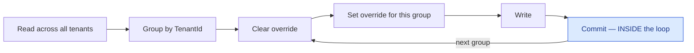
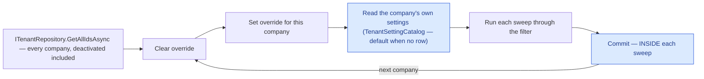
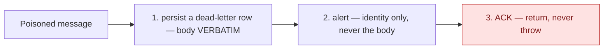

# Cross-cutting concerns

Things that belong to no single flow and are documented once rather than repeated in each.

## Tenancy

A tenant is an **operating company** under the holding ([ADR-0061](/decisions/adr-0061)); each market
is served by one (`CountryConfiguration.OperatorTenantId`), and every tenant-scoped entity carries a
`TenantId` that is **NOT NULL and a foreign key into `Tenants`** — the database refuses a business row
with no owner (`23502`) or with an owner it does not know (`23503`). EF global query filters scope
reads automatically. A row gets its tenant at commit time from whatever is ambient:

| Who is writing | Where the tenant comes from |
|---|---|
| An authenticated request | the JWT's `tenant_id` claim, minted from the user's own row |
| An anonymous request that writes (register, social sign-up, guest booking, promo request, referral check) | the **market** it names (`countryId`, or the default market) → that market's operator, set by `OperatorTenantScopeBehavior` before validation. A country that is not a market — not serviced, or served by nobody, or by a **deactivated** company ([ADR-0064](/decisions/adr-0064) D1) — is `country.not_serviced`; a default market nobody operates is `tenant.not_found` |
| A request that authenticates a user (login, refresh, social sign-in, email confirm) | the user being authenticated — `TokenService` adopts it **before the confirmation check** and before the `RefreshToken` is written, replacing the market's operator on a social sign-in of an existing account; the two password-reset commands mint no token and adopt it themselves. The session acts name no market and implement `IOperatorScopedRequest` with an explicit `CountryId => null`, so their *refusal* audit row lands under the default market's operator and their *success* row under the account's ([ADR-0061](/decisions/adr-0061) D3/D4 as amended) |
| A system job or webhook | the row it read — or, when the work is *per company*, the registry — see below |
| An audit row (admin or customer) | the same ambient tenant as the act it records, stamped by the audit writer (success) or the out-of-band failure sink — so the row and the `Order`/`User` it describes agree by construction. A customer refusal raised *before* an anonymous request's operator is resolved (`country.not_serviced`, `tenant.not_found`) has none, and the sink skips it with one warning rather than writing an orphan ([ADR-0062](/decisions/adr-0062) D7) |
| A `Failed` GDPR request row | the erasure's own ambient tenant — written out of band by `OutOfBandGdprDeletionFailureSink` in a scope of its own, so the rolled-back walk cannot take it with it; the daily retry job sets the row's tenant per candidate scope before re-running it |
| The two company-lifecycle consumers (`company-wind-down`, `company-archive`) | the **envelope's** tenant — the company the admin's act named, set as the override before the first read, so every filtered read inside is that company's and every commit stamps it ([ADR-0064](/decisions/adr-0064) D2/D3; the third job shape, below) |
| A dead letter for a write a frozen company's books refused | the **frozen company's** tenant, set on a fresh scope by `ArchivedCompanyDeadLetter` — from the Stripe webhook filter, or from the `calculate-order-pay` / `generate-receipt` consumers — so the row is that company's to find |

**System jobs carry no JWT**, which makes them the interesting case. They read across tenants
deliberately, and when they *write* they must group by tenant, set the override per group, and commit
**inside** the loop:

> A new row is stamped from the **ambient** tenant at commit time. One deferred commit at the end
> therefore stamps every group with whichever tenant happened to be processed last. Committing inside
> the loop is what makes the override mean anything.

**The second shape: the sweeps that read per company.** Some jobs have no row to derive the tenant
from, because their input is the list of companies and their settings — the nine retention sweeps,
whose windows are each company's own (`TenantConfiguration`, set on the admin's *Company settings* page;
→ [Business rules — retention](/product/business-rules#customer-record)). They loop the **registry**
instead of grouping rows:

Every filtered read inside the loop is that company's, every setting read is that company's, and a
company with no override rows is simply a company on the defaults — so a one-year audit window set on
company B deletes B's two-year-old rows and leaves A's alone. `DataRetentionBackgroundService` is the
reference; `CleanupStalePendingOrders` is the reference for the row-driven shape above. Which one a
new job takes is decided by its input: rows, or companies.

**The third shape: a consumer whose unit of work is one company an admin named.** The company
wind-down sweep and the archive build ([ADR-0064](/decisions/adr-0064)) are neither row-driven nor
registry-driven: an admin's act enqueues one message whose envelope names *their* company, and the
consumer sets that override before its first read and keeps it for the whole run. Every filtered read
inside — the users to notify, the orders to cancel, the templates, the memberships, the credit accounts,
the pay periods; or the twenty books tables to export — is that company's alone, and every step commits
on its own (per order, per membership, per account, per page of notices) so a redelivery resumes past what
is done. The message key carries the request instant (`wind-down:{tenantId}:{yyyyMMddHHmmss}`,
`archive:{tenantId}:{yyyyMMddHHmmss}`), so the same act asked twice within a second is one run and a
later act is a new one; a message naming a company that no longer qualifies (missing, no wind-down date,
frozen; not frozen, already archived, a stale freeze instant) is a **permanent no-op** — logged and
acked, never poisoned. `CompanyWindDownService` and `CompanyArchiveService` are the references; the
input (a row, a company from the registry, or a company from an admin's act) is what picks the shape.

**The archived-company write guard sits under all three shapes.** Once a company is frozen for archive
(`Tenant.ArchiveRequestedOn`), `CleansiaDbContext.CommitAsync` refuses any unit of work that adds,
modifies or deletes one of that company's **books** rows — every stamped table that is not on the
account surface (the person's rows: `User`, sessions, devices, consents, notifications, GDPR requests,
memberships, loyalty, referrals, the three audit tables, the two envelopes) — with
`CompanyArchivedException`, before anything is saved. A request meets it as **409 `tenant.archived`**;
the Stripe webhook is **acknowledged 200** with a dead-letter row for operations (Stripe must never be
asked to retry an endpoint every company shares); a late `calculate-order-pay` or `generate-receipt`
message is dead-lettered and acked as permanent; any other consumer reaches the same dead-letter row
through its poison twin. **The law's writes pass:** the retention sweeps and an erasure open
`IArchiveWriteGate.OpenForLegalObligation` around their work — exactly two call sites, pinned by a
build-time test — because a company's GDPR obligations do not end with its trading. → [Security rules —
S8](/architecture/security-rules#s8-tenant-isolation-correctness), [Company archive](/domain/roles/company-archive)

⚠️ **A job that forgets its override does not read someone else's rows — it reads nothing, and writes
a `23502`.** The filter's `null == null` clause matches nothing on a stamped table now that the column
is NOT NULL, so a sweep with no ambient tenant sees an empty set and a commit with none is refused by
the database. That is the loud direction on purpose; the fix is the override-per-row shape above, never
a default tenant. A unique index containing `TenantId` fires unconditionally on the tenant term; the
ones that arbitrate a race on another nullable term still declare `NULLS NOT DISTINCT`
(→ [Security rules — S8](/architecture/security-rules#s8-tenant-isolation-correctness)).

## The outbox

A state change and its outgoing message commit together, so the message is durable if and only if the
change happened. A drainer then puts it on the wire.

The drainer claims work with a single `UPDATE … RETURNING` carrying a claim token and a lease cutoff —
atomic, so two drainers cannot claim the same row, and a crashed drainer's lease expires rather than
stranding the message.

## Consumer idempotency

A queue consumer claims a message key before performing its terminal effect. The claim **owns its own
commit**, so it is durable even if the effect later crashes — that is the point: at-most-once *after*
the marker. Two parallel redeliveries both racing the claim are separated by a unique index.

## Notifications

One producer writes the in-app row and enqueues the push in the same unit of work as the change that
caused it. The tenant is passed **explicitly** down this path rather than inherited from ambient
context, which is why notification rows from system sweeps are correctly tenanted even where the
sweep itself is not.

## Rate limiting

Two named policies — `auth` and `interactive` — partitioned per real client IP for anonymous callers
and per JWT subject for authenticated ones, plus a separate third policy for the Stripe webhook so a
webhook flood consumes none of the interactive allowance.

Establishing the *real* client IP is load-bearing: behind a front end, a per-IP partition that trusts
the wrong header collapses to one bucket. In non-development the host **refuses to boot** on an unset
or over-broad forwarded-headers configuration rather than starting with the partitioning silently
disabled.

## Authorization posture

Secure by default: the default policy requires an authenticated user, and `[AllowAnonymous]` is the
explicit, greppable opt-out. Counting controllers without an `[Authorize]` attribute tells you nothing
— the fallback is what protects them.

## Poisoned messages and dead letters {#dead-letters}

A message that exhausts its retry budget on a business queue is moved by the Storage-queue runtime to
`<queue>-poison`. Every poison consumer does exactly three things and nothing more:

**It never re-runs the original effect.** No receipt, invoice, push or pay is re-processed here — the
handler is purely *persist and alert*.

**And nothing replays the row either.** No query, no admin endpoint, no replay command reads a
`DeadLetter`; the only code that touches one after the write is GDPR erasure, which deletes it. The row
is **the record that a thing failed, not the mechanism for making it succeed** — recovery today means a
human reading the alert and acting. → [`dead-letter-record`](/domain/roles/dead-letter-record)

**One writer of the row is not a poison consumer.** A write that a frozen company's books refused —
a Stripe event on the synchronous webhook, a late pay calculation, a late receipt — is dead-lettered
**on first delivery** by `ArchivedCompanyDeadLetter` (source `stripe-webhook`, `calculate-order-pay` or
`generate-receipt`, error `tenant.archived:{tenantId}`, the body verbatim), from a fresh scope under the
frozen company, and then acknowledged; the retry budget is never spent, because a redelivery cannot thaw
the books. Same row, same three rules, one delivery sooner. → [ADR-0064](/decisions/adr-0064) D3

**Acking is mandatory.** Throwing would re-poison the message into an endless loop. The durable row is
what makes acking safe.

### Why the alert carries the identity and never the body {#poison-alert-body}

One of the bodies that reaches this path is the outbound-email message, whose code field is a **raw
confirmation or reset token** — a live credential that grants account takeover until it is consumed or
expires.

The dead-letter row's sink is our own database. The alert's sinks are the host's retained log stream
and a separate vendor, where structured values additionally become **indexed tags** and a scope
breadcrumb that re-attaches to later, unrelated events.

The two live consumers on the same worker already hold this line, and the message-key helper hashes the
token so the secret never appears in a key or a log line. The poison handler was the one place on the
queue path that did not.

### When persisting fails {#persist-failed}

The handler still alerts and still acks — never re-poisons — so that message ends with **no durable
row**. The alert is deliberately **not** widened to carry the body as a last-copy substitute:

1. the log was never assigned a recovery role; the dead-letter row is the recovery source;
2. the queues whose durable row is mandatory lose nothing — the receipt and invoice messages contain no
   credential and no PII, and their whole subject is already inside the message key the alert carries;
3. the one body this subtracts is the one where "the log is the last copy" is a **liability**.
   Recovering a poisoned email is a *re-issue*, which needs the user id and the purpose — both already
   in the clear in the key — not a replay of a live token out of a vendor's log store.

Persisting fails when the database does, which is not an independent per-message coin flip: every
poisoned message in that window takes this branch at once. This is the burst case, not the singleton.
