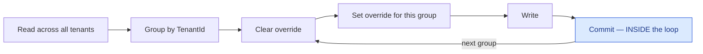
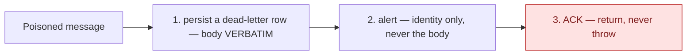

# Cross-cutting concerns

Things that belong to no single flow and are documented once rather than repeated in each.

## Tenancy

Every tenant-scoped entity carries a `TenantId`, and EF global query filters scope reads
automatically. A JWT carries the tenant claim.

**System jobs carry no JWT**, which makes them the interesting case. They read across tenants
deliberately, and when they *write* they must group by tenant, set the override per group, and commit
**inside** the loop:

> A new row is stamped from the **ambient** tenant at commit time. One deferred commit at the end
> therefore stamps every group with whichever tenant happened to be processed last. Committing inside
> the loop is what makes the override mean anything.

⚠️ **A unique index containing `TenantId` enforces nothing while `TenantId` is null.** Postgres treats
NULLs as distinct, so `(TenantId, …)` admits unlimited duplicates in single-tenant mode — which is
production today. No design may use such an index as its only concurrency arbiter; the ones that need
to arbitrate declare `NULLS NOT DISTINCT`.

## The outbox

A state change and its outgoing message commit together, so the message is durable if and only if the
change happened. A drainer then puts it on the wire.

The drainer claims work with a single `UPDATE … RETURNING` carrying a claim token and a lease cutoff —
atomic, so two drainers cannot claim the same row, and a crashed drainer's lease expires rather than
stranding the message.

## Consumer idempotency

A queue consumer claims a message key before performing its terminal effect. The claim **owns its own
commit**, so it is durable even if the effect later crashes — that is the point: at-most-once *after*
the marker. Two parallel redeliveries both racing the claim are separated by a unique index.

## Notifications

One producer writes the in-app row and enqueues the push in the same unit of work as the change that
caused it. The tenant is passed **explicitly** down this path rather than inherited from ambient
context, which is why notification rows from system sweeps are correctly tenanted even where the
sweep itself is not.

## Rate limiting

Two named policies — `auth` and `interactive` — partitioned per real client IP for anonymous callers
and per JWT subject for authenticated ones, plus a separate third policy for the Stripe webhook so a
webhook flood consumes none of the interactive allowance.

Establishing the *real* client IP is load-bearing: behind a front end, a per-IP partition that trusts
the wrong header collapses to one bucket. In non-development the host **refuses to boot** on an unset
or over-broad forwarded-headers configuration rather than starting with the partitioning silently
disabled.

## Authorization posture

Secure by default: the default policy requires an authenticated user, and `[AllowAnonymous]` is the
explicit, greppable opt-out. Counting controllers without an `[Authorize]` attribute tells you nothing
— the fallback is what protects them.

## Poisoned messages and dead letters {#dead-letters}

A message that exhausts its retry budget on a business queue is moved by the Storage-queue runtime to
`<queue>-poison`. Every poison consumer does exactly three things and nothing more:

**It never re-runs the original effect.** No receipt, invoice, push or pay is re-processed here — the
handler is purely *persist and alert*.

**And nothing replays the row either.** No query, no admin endpoint, no replay command reads a
`DeadLetter`; the only code that touches one after the write is GDPR erasure, which deletes it. The row
is **the record that a thing failed, not the mechanism for making it succeed** — recovery today means a
human reading the alert and acting. → [`dead-letter-record`](/domain/roles/dead-letter-record)

**Acking is mandatory.** Throwing would re-poison the message into an endless loop. The durable row is
what makes acking safe.

### Why the alert carries the identity and never the body {#poison-alert-body}

One of the bodies that reaches this path is the outbound-email message, whose code field is a **raw
confirmation or reset token** — a live credential that grants account takeover until it is consumed or
expires.

The dead-letter row's sink is our own database. The alert's sinks are the host's retained log stream
and a separate vendor, where structured values additionally become **indexed tags** and a scope
breadcrumb that re-attaches to later, unrelated events.

The two live consumers on the same worker already hold this line, and the message-key helper hashes the
token so the secret never appears in a key or a log line. The poison handler was the one place on the
queue path that did not.

### When persisting fails {#persist-failed}

The handler still alerts and still acks — never re-poisons — so that message ends with **no durable
row**. The alert is deliberately **not** widened to carry the body as a last-copy substitute:

1. the log was never assigned a recovery role; the dead-letter row is the recovery source;
2. the queues whose durable row is mandatory lose nothing — the receipt and invoice messages contain no
   credential and no PII, and their whole subject is already inside the message key the alert carries;
3. the one body this subtracts is the one where "the log is the last copy" is a **liability**.
   Recovering a poisoned email is a *re-issue*, which needs the user id and the purpose — both already
   in the clear in the key — not a replay of a live token out of a vendor's log store.

Persisting fails when the database does, which is not an independent per-message coin flip: every
poisoned message in that window takes this branch at once. This is the burst case, not the singleton.
