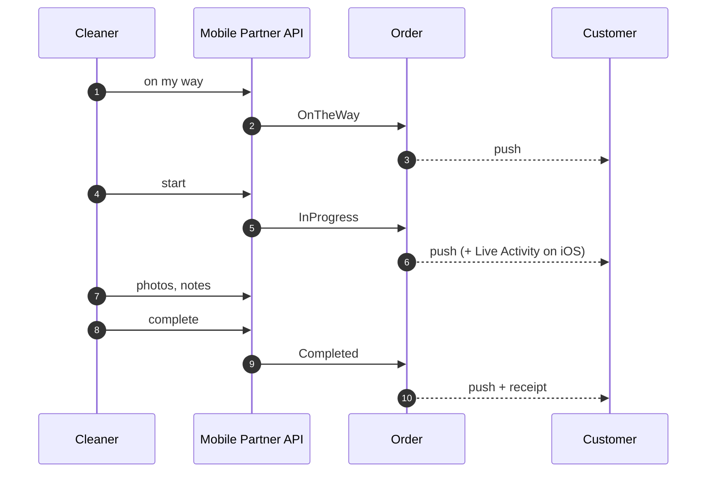

# Execution and completion

From an assigned cleaner to a finished job, a receipt, and a pay row.

## The path

## Only the assigned cleaner may move the job

`StartOrder`, `CompleteOrder` and `NotifyOnTheWay` each gate on the caller being **assigned to this
order**, not merely on being a cleaner. A non-participant cannot advance somebody else's job.

The customer-facing cancel is the mirror image: it is customer-only and checks `order.UserId` against
the caller in the handler.

## What a cleaner who has *not* taken the job can see

A cleaner browsing the board gets **the job, not the household**. The redaction strips the customer's
name, email, phone, address and coordinates, the confirmation code, every free-text field — notes,
special instructions, **entry instructions**, completion notes — the review, and the crew's phone
numbers.

List and detail shapes live in **one file** on purpose: when they lived apart, the detail answered with
everything the list had just withheld. A surface test fails the build until a newly-added field is
explicitly classified as kept or stripped.

## Edge cases

| Case | What happens |
|---|---|
| Non-assigned cleaner tries to start/complete | Refused — the gate is assignment, not role. |
| Photos requested by a non-assignee | Refused by the strict access gate. Browsing detail is redacted; **photographs of a customer's home are not browsable at all**. |
| Status moved out of order | Refused by the transition guard. |
| Admin needs to force a status | A separate admin-only override, which is audited. |
| Live Activity token stale | The push is dropped; the activity ends on its own. |

## Entry instructions

`AccessInstructions` is free text of the form *"key under the mat"*. It is correctly withheld from a
browsing cleaner and needed by an assigned one.

> **Every admin can read it, with no reveal step and therefore no audit record of who looked.** That is
> a known, accepted residue rather than an oversight — the comparable control already exists for
> payout identifiers, where revealing is a *command* precisely so the audit engine records it.
