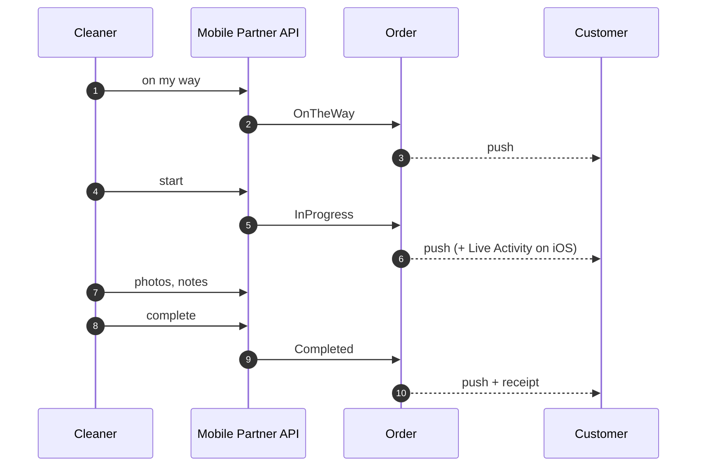

# Execution and completion

From an assigned cleaner to a finished job, a receipt, and a pay row.

## The path

## Only the assigned cleaner may move the job

`StartOrder`, `CompleteOrder` and `NotifyOnTheWay` each gate on the caller being **assigned to this
order**, not merely on being a cleaner. A non-participant cannot advance somebody else's job.

The customer-facing cancel is the mirror image: it is customer-only and checks `order.UserId` against
the caller in the handler.

## And not without the contract for work {#the-contract-gate}

`StartOrder` **and** `CompleteOrder` refuse a cleaner whose **current seat** on the order has no
acceptance of the contract for work — `contract.acceptance_required`, placed right after the
assignment rule on both ([ADR-0068](/decisions/adr-0068) D3). A cleaner who *took* the job never
meets it: the take wrote the acceptance with the seat. The gate exists for the seat an administrator
formed — `AdminReassignOrder` writes no acceptance, because an admin cannot accept on the cleaner's
behalf — and for a cleaner who dropped and was re-added (a new seat, no row).

Both commands, not one: on a two-seat crew the second cleaner never calls Start (the order is already
`InProgress`) but may complete, and Complete is the last act with a contract behind it — the one a
claim turns on. `NotifyOnTheWay` is **not** gated; travel is not the work. The refusal sits **after**
`order.employee_not_assigned`, so a cleaner not on the crew learns nothing about the contract, and
before the clock rule, so a placed cleaner is told about the contract rather than about the time.

The apps answer the key by opening the contract: the job detail already shows a banner (*Accept the
contract for work before you start*) for an assigned cleaner with no acceptance, Start and Complete
stay offered, and either refusal opens the same sheet in *accept* mode; `AcceptWorkContract` writes
the row for that seat (idempotent — a second accept answers success with the same row) and the act
proceeds. A cleaner placed on an in-progress job can accept and complete.
→ [Offerability and the take — the take carries the acceptance](/flows/offerability-and-take#the-take-carries-the-acceptance),
[Business rules — the contract for work](/product/business-rules#work-contract)

## And not before the job's own clock {#start-grace-window}

`StartOrder` and `NotifyOnTheWay` are also gated on **time**: a job may be moved at most
[60 minutes](/product/business-rules#start-grace-window) ahead of when it is booked for. Earlier is
`order.too_early_to_start`. Later is never blocked.

Before 2026-08-22 there was no such gate, and a cleaner could mark next Tuesday's job started today —
which put *"your cleaner is on the way"* on a customer's lock screen days early.

The rule is deliberately the **last** one evaluated on both commands. A cleaner who is not on the crew
is told they are not on the crew and learns nothing about when the job is scheduled; a test pins that
ordering, because moving the clock check earlier would turn the board into a schedule oracle.

The reminders run off the same clock from the other side: a cleaner is told two hours out, and nudged
about half an hour out. Both come off one query that selects only orders still in `Confirmed`, so
marking yourself on the way switches off whichever has not already been sent — in practice the nudge,
since nobody is on the way two hours early. The nudge is additionally suppressed for a cleaner already
out on another job, because asking someone mid-clean whether they have set off is noise.

## What a cleaner who has *not* taken the job can see

A cleaner browsing the board gets **the job, not the household**. The redaction strips the customer's
name, email, phone, address and coordinates, the confirmation code, every free-text field — notes,
special instructions, **entry instructions**, completion notes — the review, and the crew's phone
numbers.

List and detail shapes live in **one file** on purpose: when they lived apart, the detail answered with
everything the list had just withheld. A surface test fails the build until a newly-added field is
explicitly classified as kept or stripped.

## Edge cases

| Case | What happens |
|---|---|
| Non-assigned cleaner tries to start/complete | Refused — the gate is assignment, not role. |
| Admin-placed cleaner taps Start or Complete before accepting the contract | Refused with `contract.acceptance_required`; the app opens the contract, they accept, and the act goes through. A second crew member who neither starts nor completes is never prompted — the stated residual. |
| Photos requested by a non-assignee | Refused by the strict access gate. Browsing detail is redacted; **photographs of a customer's home are not browsable at all**. |
| Status moved out of order | Refused by the transition guard. |
| Cleaner opens tomorrow's job and taps Start | Refused with `order.too_early_to_start` until the job is within an hour. |
| Cleaner is early at the door — 09:50 for a 10:00 job | Allowed. The window is a grace, not an exact time; cleaners arrive early and the platform must not argue with that. |
| Cleaner starts three hours late | Allowed and recorded. Late is a real thing that happened. |
| Admin needs to force a status | A separate admin-only override, which is audited; strictly forward, refuses `Confirmed` on an order with nobody assigned (reassign instead), and dates an override to `Completed` so the order is revenue of a month. |
| The last cleaner drops a job | The seat goes back on the board; a `Confirmed` order returns to `New`, one already on the way or in progress keeps its status; the company's administrators are told either way; the customer is not. → [When the last cleaner leaves](/product/business-rules#crew-lost) |
| Live Activity token stale | The push is dropped; the activity ends on its own. |

## Entry instructions

`AccessInstructions` is free text of the form *"key under the mat"*. It is correctly withheld from a
browsing cleaner and needed by an assigned one.

> **An admin does not get it with the order.** It is withheld from an administrator read and comes only
> from a reveal — `POST /AdminOrder/{orderId}/access-instructions/reveal` — which is a **command**
> precisely so the audit engine records who asked and when. The order payload carries a
> `hasAccessInstructions` flag instead, so the admin UI can offer the reveal without holding the text,
> and the control the reveal is shaped after is the payout-identifier one in
> [ADR-0034](/decisions/adr-0034).
>
> It was not always so: until 2026-08-14 every admin read it unconditionally, with no record of who
> looked. That was recorded here as an accepted residue, and it stopped being one.
