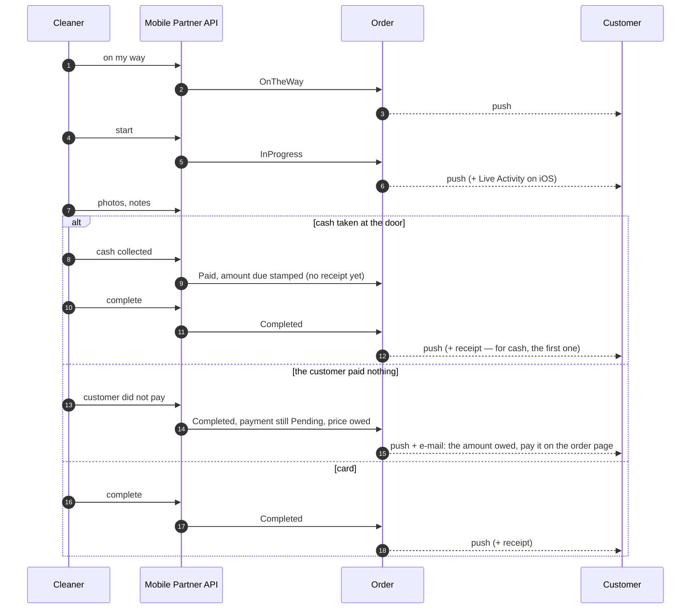
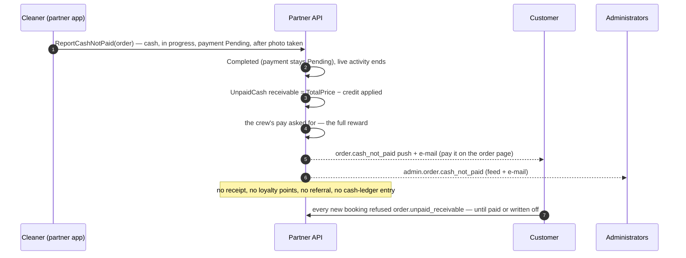

# Execution and completion

From an assigned cleaner to a finished job, a receipt, and a pay row.

## The path

```mermaid
sequenceDiagram
  autonumber
  participant C as Cleaner
  participant API as Mobile Partner API
  participant O as Order
  participant N as Customer

  C->>API: on my way
  API->>O: OnTheWay
  O-->>N: push
  C->>API: start
  API->>O: InProgress
  O-->>N: push (+ Live Activity on iOS)
  C->>API: photos, notes
  alt cash taken at the door
    C->>API: cash collected
    API->>O: Paid, amount due stamped (no receipt yet)
    C->>API: complete
    API->>O: Completed
    O-->>N: push (+ receipt — for cash, the first one)
  else the customer paid nothing
    C->>API: customer did not pay
    API->>O: Completed, payment still Pending, price owed
    O-->>N: push + e-mail: the amount owed, pay it on the order page
  else card
    C->>API: complete
    API->>O: Completed
    O-->>N: push (+ receipt)
  end
```

## Only the assigned cleaner may move the job

`StartOrder`, `CompleteOrder` and `NotifyOnTheWay` each gate on the caller being **assigned to this
order**, not merely on being a cleaner. A non-participant cannot advance somebody else's job.

The customer-facing cancel is the mirror image: it is customer-only and checks `order.UserId` against
the caller in the handler.

## And not without the contract for work {#the-contract-gate}

`StartOrder` **and** `CompleteOrder` refuse a cleaner whose **current seat** on the order has no
acceptance of the contract for work — `contract.acceptance_required`, placed right after the
assignment rule on both ([ADR-0068](/decisions/adr-0068) D3). A cleaner who *took* the job never
meets it: the take wrote the acceptance with the seat. The gate exists for the seat an administrator
formed — `AdminReassignOrder` writes no acceptance, because an admin cannot accept on the cleaner's
behalf — and for a cleaner who dropped and was re-added (a new seat, no row).

Both commands, not one: on a two-seat crew the second cleaner never calls Start (the order is already
`InProgress`) but may complete, and Complete is the last act with a contract behind it — the one a
claim turns on. `NotifyOnTheWay` is **not** gated; travel is not the work. The refusal sits **after**
`order.employee_not_assigned`, so a cleaner not on the crew learns nothing about the contract, and
before the clock rule, so a placed cleaner is told about the contract rather than about the time.

The apps answer the key by opening the contract: the job detail already shows a banner (*Accept the
contract for work before you start*) for an assigned cleaner with no acceptance, Start and Complete
stay offered, and either refusal opens the same sheet in *accept* mode; `AcceptWorkContract` writes
the row for that seat (idempotent — a second accept answers success with the same row) and the act
proceeds. A cleaner placed on an in-progress job can accept and complete.
→ [Offerability and the take — the take carries the acceptance](/flows/offerability-and-take#the-take-carries-the-acceptance),
[Business rules — the contract for work](/product/business-rules#work-contract)

## And not before the job's own clock {#start-grace-window}

`StartOrder` and `NotifyOnTheWay` are also gated on **time**: a job may be moved at most
[60 minutes](/product/business-rules#start-grace-window) ahead of when it is booked for. Earlier is
`order.too_early_to_start`. Later is never blocked.

Before 2026-08-22 there was no such gate, and a cleaner could mark next Tuesday's job started today —
which put *"your cleaner is on the way"* on a customer's lock screen days early.

The rule is deliberately the **last** one evaluated on both commands. A cleaner who is not on the crew
is told they are not on the crew and learns nothing about when the job is scheduled; a test pins that
ordering, because moving the clock check earlier would turn the board into a schedule oracle.

The reminders run off the same clock from the other side: a cleaner is told two hours out, and nudged
about half an hour out. Both come off one query that selects only orders still in `Confirmed`, so
marking yourself on the way switches off whichever has not already been sent — in practice the nudge,
since nobody is on the way two hours early. The nudge is additionally suppressed for a cleaner already
out on another job, because asking someone mid-clean whether they have set off is noise.

**The same sweep watches for a job that never starts** (owner ruling 2026-09-28). An order `Confirmed` or
`OnTheWay` with at least one cleaner on it — a partly filled crew included — whose start passed more than
**30 minutes** ago (looking back 24 h) raises `admin.order.cleaner_not_started` for its company, once per
order, under that company's override and commit. It never cancels or refunds: a missing tap is not
proof of absence, so an administrator confirms the no-show.
→ [Business rules — when the cleaner no-shows](/product/business-rules#when-the-cleaner-cancels-or-no-shows)

## When the customer does not pay at the door {#cash-not-paid}

**Owner ruling 2026-10-06.** A cash job could only be completed after the cash was recorded, so when the
customer paid nothing the job stayed in progress, the cleaner was paid nothing, and nothing the platform
could claim was owed. Now the cleaner reports it.

```mermaid
sequenceDiagram
  autonumber
  participant C as Cleaner (partner app)
  participant API as Partner API
  participant N as Customer
  participant A as Administrators

  C->>API: ReportCashNotPaid(order) — cash, in progress, payment Pending, after photo taken
  API->>API: Completed (payment stays Pending), live activity ends
  API->>API: UnpaidCash receivable = TotalPrice − credit applied
  API->>API: the crew's pay asked for — the full reward
  API-->>N: order.cash_not_paid push + e-mail (pay it on the order page)
  API-->>A: admin.order.cash_not_paid (feed + e-mail)
  Note over API: no receipt, no loyalty points, no referral, no cash-ledger entry
  N->>API: every new booking refused order.unpaid_receivable — until paid or written off
```

- **The command** is `ReportCashNotPaid` (`POST api/Order/ReportCashNotPaid`, on the Partner and Partner
  Mobile hosts only; `Policy.CanCompleteOrder`, the `auth` rate limit). Its one validator chain runs the
  completion's gates first — the caller on the crew (`order.not_found` otherwise), approved, a complete
  profile, the contract for work for the seat (`contract.acceptance_required`) — then the order: in
  progress (`order.not_in_progress`), cash (`order.cash_not_allowed_on_card_order`), not paid
  (`order.cash_already_collected`), payment `Pending` on a signed-in customer's booking
  (`order.payment_not_outstanding`, which also answers a legacy guest cash order), and an *after* photo
  (`order.after_photos.required`). It answers the order id, the new status and the amount owed.
- **One commit.** The order completes, timed from its start as `CompleteOrder` times one, with the payment
  still `Pending`. An `UnpaidCash` receivable opens for `TotalPrice − CreditAppliedAmount`, stamped with
  the order's company. Every seat's pay is asked for as a completion asks for it, so the crew gets the
  full reward. The customer push `order.cash_not_paid` (order number and amount; not mutable), the
  customer e-mail (`email:order-cash-not-paid:{receivableId}`, five locales, its button opening the
  order's page) and the administrators' `admin.order.cash_not_paid` (Support and above, order number and
  amount) ride the same commit. Nothing that needs money runs: no receipt, no loyalty grant, no referral
  qualification, no cash-ledger entry.
- **The customer** is refused every new booking, cash or card, in any company, until the debt is paid
  through its pay link or written off → [Booking and pricing — a customer who owes books nothing](/flows/booking-and-pricing#owes-nothing).
  Paid online, it earns a fee receipt labelled *Unpaid cash payment* and asks for no crew pay.
- **The administrator** corrects a wrong report by writing the debt off (Manager and above). When the
  customer pays the cleaner later, *Record cash received* (`AdminRecordCashReceived`) marks the order
  `Paid`, issues the sale receipt because the order is complete, and writes the open debt off as *Paid in
  cash* in the same commit; it is refused with `order.payment_not_outstanding` once the customer paid the
  debt online.
- **The partner web, Android and iOS** offer *Customer did not pay* beside *Mark cash collected*, on the
  order detail only, to a cleaner on the crew of a cash job in progress whose payment is pending. The
  apps show it once the after photos are in, as they do *Complete*; the web warns as *Complete* does when
  there is none. A confirmation states the consequence first: use it only when nothing was paid (a part
  payment is told to the company); the job completes and the cleaner is paid; the customer will owe the
  price less any credit applied, is told so and cannot book until it is paid. After it the order is read
  again and a notice confirms the report; the web's names the amount owed from the server's answer. Every
  refusal the endpoint can give has its sentence in five locales on all three; on the web a seat without
  its contract acceptance opens the contract.
→ [Business rules — when the customer does not pay at the door](/product/business-rules#cash-not-paid),
[Partner order management](/partner-app/order-management#customer-did-not-pay)

## Photos have windows, and a finished job keeps them {#photo-windows}

**Owner rulings 2026-09-28.** The server decides when a job photo may be taken and removed
(`OrderPhoto.MayBeAddedAt`, `MayBeDeletedAt`): a *before* photo from the moment a cleaner holds the job
until it is finished (`Confirmed`, `OnTheWay`, `InProgress`), an *after* photo only while the work is
under way (`InProgress`). `SaveOrderPhotos` and `UploadOrderPhoto` refuse outside the window
(`order.photo.window_closed`); `DeleteOrderPhoto` refuses once the order is `Completed` or `Cancelled`
(`order.photo.locked`), so a cleaner can no longer delete the only *after* photo of a finished job. A
photo link lives 15 minutes. Android and iOS take job photos with the camera only; the partner web asks
for the rear camera and follows the same windows.

## The customer's details end with the job {#crew-access}

**Owner ruling 2026-09-28.** An assigned cleaner reads the customer's name, phone, address and door
instructions while the job is live and for **24 hours after completion** — for the forgotten key or the
call back — and **not at all once the order is cancelled** (`Order.CustomerDetailsOpenToCrew`; a
completed order with no completion time counts as closed). After that the crew's view of a past job is
the browsing cleaner's redaction plus what is theirs: `GetOrderDetails` answers the past-job shape
(`OrderPiiRedaction.RedactForPastJob` — order number, date, services, their pay, completion notes, their
own notes and contract acceptance), the order list shows past jobs in the browsing shape, `GetOrderPhotos`
returns only the photos the caller took, and `DownloadOrderReceipt` answers `order.not_found` to the crew,
because the receipt names the customer. The partner apps say the customer's details were removed.
Administrators and the customer are unaffected.

## What a cleaner who has *not* taken the job can see

A cleaner browsing the board gets **the job, not the household**. The redaction strips the customer's
name, email, phone, address and coordinates, every free-text field — notes, special instructions,
**entry instructions**, completion notes — the review, and the crew's phone numbers.

List and detail shapes live in **one file** on purpose: when they lived apart, the detail answered with
everything the list had just withheld. A surface test fails the build until a newly-added field is
explicitly classified as kept or stripped.

**The confirmation code is not on the list because it is no longer on the DTO.** It used to be
redacted to an empty string for a browsing cleaner, which left it readable by every cleaner *assigned*
to the job — and it was one third of the key the anonymous guest-cancellation endpoint accepted, so an
assigned cleaner could cancel their own customer's booking and charge them the fee. The code has since
left `OrderItem` entirely and authenticates nothing; a guest proves a booking with a per-order access
token that reaches only their mailbox.
→ [The guest access token](/flows/booking-and-pricing#guest-access-token)

## Edge cases

| Case | What happens |
|---|---|
| Non-assigned cleaner tries to start/complete | Refused — the gate is assignment, not role. |
| A card order an administrator refunded, partly or fully, before the job ended | The cleaner completes it (since 2026-10-04): `CompleteOrder` passes a card payment that is `Paid`, `PartiallyRefunded` or `Refunded` and still refuses `Pending` and `Failed` with `order.payment_not_confirmed`. Completion asks for the crew's pay and takes the points share of what was returned. Until then the crew was refused and only an administrator's status override closed the order, with no pay asked for and no points. → [Business rules — money constants](/product/business-rules#money-constants) |
| Cleaner records the cash (`MarkCashCollected`) | Only while `InProgress`, and only by an approved cleaner on the crew. The order becomes `Paid` and the server stamps the amount due (`CashCollectedAmount` = total − applied credit). No receipt yet: the cash receipt is issued at completion. → [What the receipt says](/flows/payment-and-fiscal#what-the-receipt-says) |
| The cleaner could not record the cash | An administrator records it — which assigned cleaner, when, how much (`AdminRecordCashReceived`); on an order already completed the receipt is issued then. → [Business rules — cash handover](/product/business-rules#cash-handover) |
| The customer paid nothing at the door | The cleaner reports it (`ReportCashNotPaid`): the order completes with the payment pending, the price less credit becomes an `UnpaidCash` receivable, the crew is paid in full, the customer and the administrators are told, and the customer books nothing until it is paid or written off. → [above](#cash-not-paid) |
| The customer paid part of the price | Not covered by the report: the cleaner tells the company, and an administrator records what was received. |
| The customer pays the cleaner after a non-payment report | An administrator records the cash; the open debt is written off as *Paid in cash* in the same commit, and the sale receipt is issued. Refused once the debt was paid online. |
| A photo outside its window, or deleted after the job | Refused — `order.photo.window_closed`, `order.photo.locked`. |
| Admin-placed cleaner taps Start or Complete before accepting the contract | Refused with `contract.acceptance_required`; the app opens the contract, they accept, and the act goes through. A second crew member who neither starts nor completes is never prompted — the stated residual. |
| Photos requested by a non-assignee | Refused by the strict access gate. Browsing detail is redacted; **photographs of a customer's home are not browsable at all**. |
| Status moved out of order | Refused by the transition guard. |
| Cleaner opens tomorrow's job and taps Start | Refused with `order.too_early_to_start` until the job is within an hour. |
| Cleaner is early at the door — 09:50 for a 10:00 job | Allowed. The window is a grace, not an exact time; cleaners arrive early and the platform must not argue with that. |
| Cleaner starts three hours late | Allowed and recorded. Late is a real thing that happened. |
| Admin needs to force a status | A separate admin-only override, which is audited; strictly forward, refuses `Confirmed` on an order with nobody assigned (reassign instead), and dates an override to `Completed` so the order is revenue of a month. `Completed` on an order with no *after* photo needs a written reason (`order.status.force_complete_reason_required`), kept on the audit row; a sale already settled in cash gets its receipt there. |
| A job is still not started 30 minutes after its start | The company's administrators are told once (`admin.order.cleaner_not_started`); nothing is cancelled until one of them confirms the no-show. |
| The last cleaner drops a job | The seat goes back on the board; a `Confirmed` order returns to `New`, one already on the way or in progress keeps its status; the company's administrators are told either way; the customer is not. → [When the last cleaner leaves](/product/business-rules#crew-lost) |
| Live Activity token stale | The push is dropped; the activity ends on its own. |

## Entry instructions

`AccessInstructions` is free text of the form *"key under the mat"*. It is correctly withheld from a
browsing cleaner and needed by an assigned one.

The first detail response serving nonempty instructions to an assigned cleaner records
`employee.order.access_instructions_read`. It names the cleaner and order, never the instructions.
`GetOrderDetails` awaits a separate audit transaction before returning the text: the query has no
UnitOfWork commit, and the separate context cannot flush its tracked order graph. The audit writer
locks the order row before checking and inserting, so concurrent first reads produce one entry per
cleaner and job. A failed audit write fails the response. This is a disclosure-recording exception
to query immutability, not a change to who can see the instructions.

The cleaner trail now has four labels: `employee.order.cover_requested`, `employee.order.dropped`,
`employee.order.contract_accepted` and `employee.order.access_instructions_read`. Its rows expire
under the company's cleaner-audit window, default three years. The instructions themselves stop being
served 24 hours after completion, and at once on cancellation → [above](#crew-access).

> **An admin does not get it with the order.** It is withheld from an administrator read and comes only
> from a reveal — `POST /AdminOrder/{orderId}/access-instructions/reveal` — which is a **command**
> precisely so the audit engine records who asked and when. The order payload carries a
> `hasAccessInstructions` flag instead, so the admin UI can offer the reveal without holding the text,
> and the control the reveal is shaped after is the payout-identifier one in
> [ADR-0034](/decisions/adr-0034).
>
> It was not always so: until 2026-08-14 every admin read it unconditionally, with no record of who
> looked. That was recorded here as an accepted residue, and it stopped being one.
