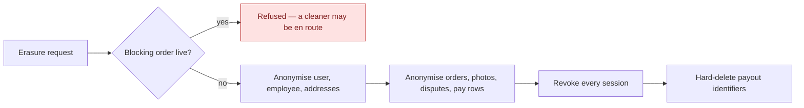
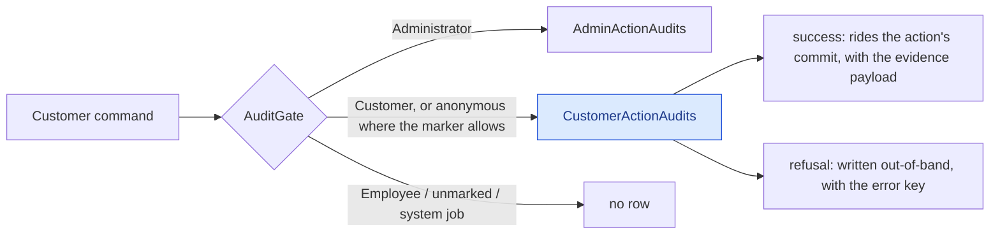

# GDPR, retention and audit

Erasure, what survives it, what is recorded about privileged access — and what is recorded about the
customer's own acts.

## Erasure is anonymise-in-place

The `User` row **survives with its id**, and its personal fields are scrubbed. That single design
choice explains most of what follows.

Twenty repositories are walked: cart, devices, disputes, employee documents, invoices, payout
details, GDPR requests, live-activity tokens, pay rows, order photos, orders, outbox, recurring
templates, saved addresses, consents, memberships, notifications, users, dead letters — and the
customer audit trail, which is **pseudonymised, not deleted**: a tracked load of every row of the
subject, `Pseudonymise()` on each (the IP address, device label and device id go; the act, its
outcome, the evidence and the subject id stay), riding the same single commit as everything above so
a failed erasure leaves the trail exactly as it was. → [The customer trail](#customer-trail)

## A cleaner's own deletion files a request; it does not erase

Everything above describes what happens to a **customer**. A subject who has an `Employee` row is
different, and the same endpoint treats them differently.

A customer's relationship with the platform *is* the account, so erasing the account ends it. A
cleaner's is not: behind the `Employee` row sits a working relationship with a contract, statutory
financial records, and a self-billing agreement whose facts are the authority for invoices that are
themselves retained. None of that ends because someone taps a button, and none of it is the subject's
to delete.

So when a cleaner deletes their own account, a `Pending` `GdprRequest` is **filed** and nothing else
runs — no anonymisation, no membership cancellation, no blob deletion. They stay signed in and keep
working. An administrator fulfils the request afterwards, once the cooperation has been formally ended
and the paperwork signed, and only then does the cascade above run. → [ADR-0052](/decisions/adr-0052)

Three conditions refuse the request outright, and they refuse an **administrator** too — nobody erases
a cleaner out from under a live job:

| Refused when | Because |
|---|---|
| An invoice is `Pending`, `Approved` or `Disputed` | Money is mid-flight. |
| They hold a seat on an order that is not terminal | They are staffed on work. The customer-side blocking check cannot see this: it filters the order's `UserId`, so a cleaner assigned to *someone else's* job is invisible to it. |
| A pay row is uninvoiced, or its pay period has not reached `Paid` | Work has not been paid for. Deliberately one condition rather than two — to a cleaner both are the same situation and have the same remedy. |

### Why loyalty, referral and promo rows are not touched

They carry a **foreign key and non-PII scalars only**. Because the user row survives anonymised, those
rows already point at an anonymised subject. Deleting them would corrupt the loyalty ledger and the
one-shot promo and benefit guards for no privacy gain — a promo code that becomes redeemable again
because its redemption row was erased is a defect, not a right.

Referral codes are randomly generated rather than name-derived, so they leak nothing either.

## Retention

A background sweep prunes expired confirmation and reset codes, stale devices, completed GDPR
requests, old orders, consents, employee documents and notifications — including a per-user
notification cap. It runs across tenants and commits per batch.

**The customer audit trail is on it, per row.** One task (`CustomerActionAudits`, under the same
`DataRetention:Enabled` master switch) deletes every row older than `retention.customer_audit.years`
(default **3**) measured from the row's **own** act — not from the customer's last act, which would
have kept an active customer's IP addresses for the life of the account — in batches until a batch
comes back empty, tenant-agnostic like the GDPR-request clean-up, over the `(OccurredOn)` index. A
window at or below zero is treated as a misconfiguration and the default is kept with a warning: this
is the one delete the append-only discipline sanctions, and a cutoff of "now" would empty the evidence
table on the next tick. The admin and cleaner audit tables have **no** window and the task never
reaches them. → [Business rules — retention](/product/business-rules#customer-record)

## Admin action audit

Every privileged action writes an **append-only** record carrying the actor's session — and it records
**failures as well as successes**, so a refused privileged attempt is visible rather than invisible.

The audit is also the compensating control for the one thing stored in plaintext: revealing a cleaner's
payout identifiers is modelled as a *command* rather than a query so it cannot happen unrecorded, and
the entity stamps who looked and how often. The same reasoning now covers the **admin subject export**:
dumping another person's whole record is a command marked `gdpr.user.export`, so it leaves an audit row
(subject id, scope and row counts — never the exported data) and commits the `GdprRequest` it files.
As a query it left neither.

## The customer trail {#customer-trail}

A **third** audit table, `CustomerActionAudits`, records what a customer did that money or an
entitlement turns on — sixteen acts, opt-in by a marker on the command, written by the same pipeline
as the admin table through the customer arm of `AuditGate` ([ADR-0062](/decisions/adr-0062)):

A success row carries a typed evidence record the handler emitted — the figures and versions the
customer was shown — and the request context (client audience, IP, device). A refusal carries the
error key and no payload. Both carry the operating company of the request. The row holds identifiers,
money, enums and versions and never a name, a contact detail, an address line, free text or a token;
a build-time guard walks every evidence record for a member so named.

Support reads it in three places: the audit log's *Customer actions* segment (list and entry), the
per-resource history from an order or a dispute (the customer's rows interleaved with the admin's and
the cleaner's, newest first), and the customer's page (`/customers/:id`), which has the same timeline
and the **Export subject data** button. Every route is behind `CanViewAuditLog`, and the admin
request log suppresses their bodies wholesale.

What survives what:

| Event | Customer audit rows |
|---|---|
| Erasure of the subject | Kept; IP, device label and device id blanked. The `UserId → OrderId` link stays — after erasure it is the only link from the erased id to its orders. |
| The subject's own data export, or an admin's | Included as `customerActions`, with the payload; IP and device null after an erasure. |
| Three years after the act | Deleted, per row, by the retention sweep. |
| The order's two-year PII anonymisation | Untouched — the order loses its `UserId`; the audit row keeps its own. |

→ [What is recorded about a customer](/product/business-rules#customer-record),
[`customer-action-audit`](/domain/roles/customer-action-audit), [`audit-gate`](/domain/roles/audit-gate)

## Edge cases

| Case | What happens |
|---|---|
| Erasure requested with a job in progress | Refused. Erasing mid-job would anonymise a customer while a cleaner is on the way to their home. |
| Erasure requested twice | Idempotent. |
| A cleaner deletes their own account | A request is filed; nothing is erased. They stay signed in. An admin fulfils it after the paperwork. |
| A cleaner is staffed on a future job, or is owed pay | Refused — for an admin as much as for the cleaner. |
| Order photos | Anonymised individually — they carry a capturer and free text the order-level walk does not reach. |
| An audit row for an erased admin | Survives. The audit is append-only and outlives the actor. |
| A customer audit row for an erased customer | Survives, pseudonymised: the three request-metadata columns are blanked and nothing else changes. An erasure whose commit fails leaves the rows untouched. |
| A guest's booking rows after the guest registers with the same email | Not inherited. Guest rows have no user and are reachable only from the order's history. |
| An anonymous refusal before the market's operator is known | No row — there is no tenant to stamp it with. The sink logs one warning instead of writing an orphan. |
| Notification flood for one user | Capped; the overflow is pruned. |
