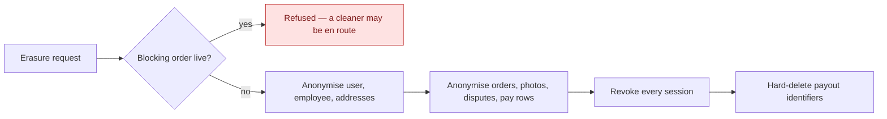

# GDPR, retention and audit

Erasure, what survives it, and what is recorded about privileged access.

## Erasure is anonymise-in-place

The `User` row **survives with its id**, and its personal fields are scrubbed. That single design
choice explains most of what follows.

Nineteen repositories are walked: cart, devices, disputes, employee documents, invoices, payout
details, GDPR requests, live-activity tokens, pay rows, order photos, orders, outbox, recurring
templates, saved addresses, consents, memberships, notifications, users, dead letters.

## A cleaner's own deletion files a request; it does not erase

Everything above describes what happens to a **customer**. A subject who has an `Employee` row is
different, and the same endpoint treats them differently.

A customer's relationship with the platform *is* the account, so erasing the account ends it. A
cleaner's is not: behind the `Employee` row sits a working relationship with a contract, statutory
financial records, and a self-billing agreement whose facts are the authority for invoices that are
themselves retained. None of that ends because someone taps a button, and none of it is the subject's
to delete.

So when a cleaner deletes their own account, a `Pending` `GdprRequest` is **filed** and nothing else
runs — no anonymisation, no membership cancellation, no blob deletion. They stay signed in and keep
working. An administrator fulfils the request afterwards, once the cooperation has been formally ended
and the paperwork signed, and only then does the cascade above run. → [ADR-0052](/decisions/adr-0052)

Three conditions refuse the request outright, and they refuse an **administrator** too — nobody erases
a cleaner out from under a live job:

| Refused when | Because |
|---|---|
| An invoice is `Pending`, `Approved` or `Disputed` | Money is mid-flight. |
| They hold a seat on an order that is not terminal | They are staffed on work. The customer-side blocking check cannot see this: it filters the order's `UserId`, so a cleaner assigned to *someone else's* job is invisible to it. |
| A pay row is uninvoiced, or its pay period has not reached `Paid` | Work has not been paid for. Deliberately one condition rather than two — to a cleaner both are the same situation and have the same remedy. |

### Why loyalty, referral and promo rows are not touched

They carry a **foreign key and non-PII scalars only**. Because the user row survives anonymised, those
rows already point at an anonymised subject. Deleting them would corrupt the loyalty ledger and the
one-shot promo and benefit guards for no privacy gain — a promo code that becomes redeemable again
because its redemption row was erased is a defect, not a right.

Referral codes are randomly generated rather than name-derived, so they leak nothing either.

## Retention

A background sweep prunes expired confirmation and reset codes, stale devices, completed GDPR
requests, old orders, consents, employee documents and notifications — including a per-user
notification cap. It runs across tenants and commits per batch.

## Admin action audit

Every privileged action writes an **append-only** record carrying the actor's session — and it records
**failures as well as successes**, so a refused privileged attempt is visible rather than invisible.

The audit is also the compensating control for the one thing stored in plaintext: revealing a cleaner's
payout identifiers is modelled as a *command* rather than a query so it cannot happen unrecorded, and
the entity stamps who looked and how often.

## Edge cases

| Case | What happens |
|---|---|
| Erasure requested with a job in progress | Refused. Erasing mid-job would anonymise a customer while a cleaner is on the way to their home. |
| Erasure requested twice | Idempotent. |
| A cleaner deletes their own account | A request is filed; nothing is erased. They stay signed in. An admin fulfils it after the paperwork. |
| A cleaner is staffed on a future job, or is owed pay | Refused — for an admin as much as for the cleaner. |
| Order photos | Anonymised individually — they carry a capturer and free text the order-level walk does not reach. |
| An audit row for an erased admin | Survives. The audit is append-only and outlives the actor. |
| Notification flood for one user | Capped; the overflow is pruned. |
