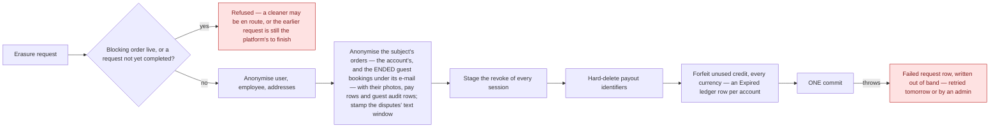
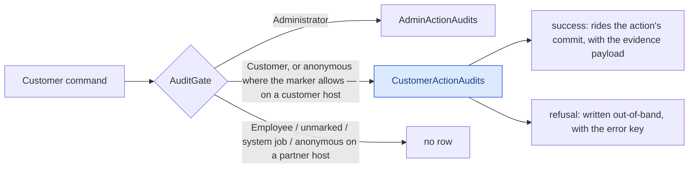

# GDPR, retention and audit

Erasure, what survives it, what is recorded about privileged access — and what is recorded about the
customer's own acts.

## Erasure is anonymise-in-place

The `User` row **survives with its id**, and its personal fields are scrubbed. That single design
choice explains most of what follows.

The erasure walks devices, disputes, employee documents, invoices, payout
details, GDPR requests, live-activity tokens, pay rows, order photos, orders, outbox, recurring
templates, saved addresses, consents, memberships, notifications, users, dead letters — the
customer audit trail, which is **pseudonymised, not deleted**: a tracked load of every row of the
subject — and of every **guest** row on the subject's orders (no user, resource `Order`, an order in
the set below) — `Pseudonymise()` on each (the IP address, device label and device id go; the act, its
outcome, the evidence and the subject id stay) → [The customer trail](#customer-trail) — and, for a
cleaner, their **contract-for-work acceptances**, pseudonymised the same way (the same three columns
go; the seat, the text, the instant and the frozen job facts stay — the row is the formation record of
a retained order, ADR-0068 D5) through a tracked load past the tenant filter riding the one commit. A
customer's erasure leaves the acceptances on their orders untouched: they name no customer. Guest
access-token revocation and address replacement also participate in that same database commit.

**Whose orders.** One predicate, `SubjectOrders.Of(userId, email)`, answers it for the erasure and
for the subject export alike (owner ruling 2026-09-15): the orders booked on the account, **or** the
guest bookings — orders naming no account — whose contact e-mail equals the account's, case-folded.
An order another *account* placed with the subject's address in its contact field is that account's
and never matches. The predicate is asked with the live e-mail, before it is replaced, and **past the
tenant filter**: a guest checkout is stamped with the *market's* operating company while the erasure
runs under the subject's, so a guest booking placed in another market would otherwise be neither
erased nor exported. Every order it yields goes through the same per-order path as the account's own —
photo blob and row, the customer fields, the address, the pay rows — and keeps its operator's stamp.
**A guest booking still live is left out of the walk, not a reason to refuse**: the blocking check
stays the account’s own live orders. Its contact data stays until the job ends and the order-PII sweep
reaches it. **Dated correction, 2026-09-16 (T-0753), amended 2026-09-22:** there is a guest
cancellation path, and since the re-key it is held by **a per-order access token that reaches only
the guest's mailbox** — not by the order number, e-mail and confirmation code it first shipped with.
That changes the earlier “nothing anonymous cancels” premise, but does not change the erasure rule or
answer Q-GDPR-03: an e-mail match alone still proves no right to cancel a booking, and now proves
even less than it did, because the e-mail is no longer part of the key at all.
→ [The guest access token](/flows/booking-and-pricing#guest-access-token)

**An address shared with somebody else is never blanked in place.** Each affected order, and the
erased cleaner's employee record, receives its own anonymised address copy, preserving its country
and operating-company stamp. A reference census across companies determines which original address
rows can be deleted after those replacements and removal of the subject's active saved-address
rows. Other orders, saved addresses and employees keep their original row. The completed-order PII
sweep uses the same copy-before-delete rule; even the subject's own newer order or saved address
protects its original there.

If another reference commits between the census and deletion, the foreign key refuses deletion and the database
commit fails instead of blanking somebody else's address or deleting their new order. The order's
address foreign key uses `Restrict`; if deletion wins the race, the competing reference cannot commit
against the deleted row. This does not extend the erasure to saved-address-only originals
or inactive saved-address rows; those remain reported gaps.

**An erased guest booking loses its access keys with its personal data.** The ended guest orders
in the walk have every live token revoked before anonymisation, staged into the same commit. A live
guest booking left out of the walk keeps its cancellation path. The order-PII sweep starts at least
one year after the cleaning, beyond the token's fixed 30-day lifetime, so it cannot erase an order
while one of those tokens is still live.

**Unused credit is forfeited, last** (owner ruling 2026-09-24). After the Stripe membership cancel and
the blob deletes, `ForfeitCreditAsync` locks the subject's user row and credit accounts, drains every
positive balance in every currency and writes one `Expired` ledger row per account under
`account-deletion:<account id>`, noted with the deletion reason; the lock is held to the commit. Nothing
is paid out. Because every writer that puts credit on an account — a refund's or a cancellation's
credit share, checkout compensation, a grant, the no-show apology — takes the same owner lock and
refuses an erased (anonymised and deactivated) owner, a return that committed first is drained here,
and one that waits finds the erased owner and moves nothing; no account is ever recreated for the
subject. A merely inactive account still receives credit. A card
refund is unaffected: its card share still goes back to the card, and the credit share is simply not
returned. A refused, deferred or failed deletion keeps the balance. Positive credit used to **refuse**
the erasure; it no longer does. → [Credit on a deleted account](/product/business-rules#credit-on-account-deletion)

**The whole walk is one commit.** It used to commit once in the middle — the session revoke carries
its own commit for the logout race — which made everything above it durable while everything below
could still roll back: a half-erased subject with no request on record. The erasure now *stages* the
revoke into its own unit of work, and a commit that throws leaves the subject, their still-valid
sessions and the absent request exactly as they were. A concurrency collision on a token row fails the
erasure as a whole; the retry is the platform's (below).

**What survives, by ruling (2026-09-14).** The **dispute text** — the description, the messages, the
resolution notes — is *not* blanked at erasure any more: the erasure stamps `Dispute.TextRetainedUntil
= now + retention.dispute_text.years` (default 3, floor > 0) and leaves it readable for defence of a
claim; the weekly sweep's `DisputeText` task blanks it once the stamp is past and clears the stamp. The
evidence **files** still go at erasure (they are not text) and the evidence rows are blanked. The
cancellation reason is kept as before. The consent rows are withdrawn, and keep their IP, user agent,
version and document id. A **guest's** booking placed with the account's e-mail is reached by that
e-mail (above) — the one link there is, since a guest booking is never attached to an account later —
and its guest audit rows lose their IP and device with it.

**A failed erasure is on record and finished by the platform.** A throw from the walk or from its
commit, or a refusal after the walk began, is caught outside the rolled-back transaction and written
as a **`Failed` `GdprRequest`** with the reason (exception type and message, any e-mail-shaped token
blanked) and who asked (`self`, the admin's e-mail, `system`); a refusal before the walk — a live
order, a request already pending — stays a plain answer with no row. A `Failed` row, or one left
`Processing` for more than thirty minutes by a host that died mid-walk, is **retryable**: the daily
`RetryFailedUserDeletions` job (05:00 UTC, under the retention master switch) re-runs each once per
row per day in its own scope with the row's tenant set, completes the row on success, and on another
failure appends the new note, logs at Error and **tells the row's company's administrators** — one feed
row each and an e-mail (`admin.erasure.failed`: the request and the day, never the subject), written
in a scope of its own and committed there so the discarded failing walk cannot take the notice with
it; the day is in the notice's subject because a request that fails again tomorrow is meant to be
heard again, and the candidate predicate (last attempt before today) is what keeps one day to one
attempt and so to one notice. An admin can **Retry** it from the data-protection page at any time
(`gdpr.user.delete.retry`, audited). Every
request not yet `Completed` counts as pending, so the subject cannot file a second one over a failed
first — the second used to complete on a row of its own and the sweep then re-walked the erased
subject through the first.

## A cleaner's own deletion files a request; it does not erase

Everything above describes what happens to a **customer**. A subject who has an `Employee` row is
different, and the same endpoint treats them differently.

A customer's relationship with the platform *is* the account, so erasing the account ends it. A
cleaner's is not: behind the `Employee` row sits a working relationship with a contract, statutory
financial records, and a self-billing agreement whose facts are the authority for invoices that are
themselves retained. None of that ends because someone taps a button, and none of it is the subject's
to delete.

So when a cleaner deletes their own account, a `Pending` `GdprRequest` is **filed** and nothing else
runs — no anonymisation, no membership cancellation, no blob deletion. They stay signed in and keep
working. An administrator fulfils the request afterwards, once the cooperation has been formally ended
and the paperwork signed, and only then does the cascade above run. → [ADR-0052](/decisions/adr-0052)

Three conditions refuse the request outright, and they refuse an **administrator** too — nobody erases
a cleaner out from under a live job:

| Refused when | Because |
|---|---|
| An invoice is `Pending`, `Approved` or `Disputed` | Money is mid-flight. |
| They hold a seat on an order that is not terminal | They are staffed on work. The customer-side blocking check cannot see this: it filters the order's `UserId`, so a cleaner assigned to *someone else's* job is invisible to it. |
| A pay row is uninvoiced, or its pay period has not reached `Paid` | Work has not been paid for. Deliberately one condition rather than two — to a cleaner both are the same situation and have the same remedy. |

### Why loyalty, referral and promo rows are not touched

They carry a **foreign key and non-PII scalars only**. Because the user row survives anonymised, those
rows already point at an anonymised subject. Deleting them would corrupt the loyalty ledger and the
one-shot promo and benefit guards for no privacy gain — a promo code that becomes redeemable again
because its redemption row was erased is a defect, not a right.

Referral codes are randomly generated rather than name-derived, so they leak nothing either.

## Retention

A background sweep prunes expired confirmation and reset codes, stale devices, completed GDPR
requests, old orders, consents, employee documents and notifications — including a per-user
notification cap. **It runs once per operating company** (since 2026-09-15): it loops the company
registry, sets the tenant override per company, reads that company's own windows from its settings
(the platform defaults where it has set none — → [Company settings](/product/business-rules#customer-record))
and commits per batch inside each task, so a one-year window on one company touches none of another's
rows.

**The customer audit trail is on it, per row.** One task (`CustomerActionAudits`, under the same
`DataRetention:Enabled` master switch) deletes every row older than `retention.customer_audit.years`
(default **3**) measured from the row's **own** act — not from the customer's last act, which would
have kept an active customer's IP addresses for the life of the account — in batches until a batch
comes back empty, over the `(OccurredOn)` index, under the company's override. The window cannot be
set below one year — the floor is enforced where the value is written, on the admin page, because this
is the one delete the append-only discipline sanctions and a cutoff of "now" would empty the evidence
table on the next tick; a stored value the catalogue no longer accepts falls back to the default. The
admin and cleaner tables have separate tasks and settings since the owner's **2026-09-22** ruling:
`AdminActionAudits` / `retention.admin_audit.years` deletes by `OccurredOn`, and
`EmployeeActionAudits` / `retention.employee_audit.years` by `CreatedOn`, each defaulting to **3 years**.
They remain append-only during that window and survive a subject's erasure; age-based deletion is
the explicit exception. The catalogue currently permits a one-year minimum for both; whether the
minimum must be three years remains an owner question.
→ [Business rules — retention](/product/business-rules#customer-record)

**Order photos expire from completion.** `OrderPhotos` reads `retention.order_photos.days` (default
**7**, owner ruling 2026-09-22) and deletes the row and its blob when the order's `CompletedAt` is
older than that window. Any dispute whose status is neither `Resolved` nor `Closed` holds the photos.
The order's operating company determines the window, including when a photo carries a different
uploader stamp. A blob deletion failure leaves its row for a later run. Deletion is attempted on the
first weekly run after the seven-day window; never-completed orders and disputes raised after the
photos have already gone remain outside that protection.

**Dead guest keys are removed too.** `GuestOrderAccessTokens` deletes rows whose expiry has passed
or whose `RevokedOn` is set, under the token's stored company stamp (copied from the order at issue).
It needs no additional setting. There are **thirteen retention settings and fourteen tasks**, all
under the same master switch.

**The erased customer's dispute text is on it too.** The `DisputeText` task reads only the stamp the
erasure set (`Dispute.TextRetainedUntil`), blanks the description, the messages and the resolution
notes of every dispute whose stamp is past, and clears the stamp so each batch shrinks the backlog —
pure-modify, under the company's override like every task, `RetentionDefaults.BatchSize` at a time.
The window itself (`retention.dispute_text.years`, the erasing company's own value) is read by the
erasure when it stamps, not by the sweep.

**A failed erasure is retried by its own daily job**, not by this sweep — `RetryFailedUserDeletions`
at 05:00 UTC, under the same master switch (→ above).

**Both keep writing after the company has stopped — through the legal-obligation gate.** A company
frozen for archive ([ADR-0064](/decisions/adr-0064) D3) refuses every write to its books at the commit
(`CompanyArchivedException`, 409 `tenant.archived` on a request) — but the order-PII sweep modifies
books rows, the dispute-text sweep does too, and an erasure pseudonymises orders and disputes, and none
of that stops because the company closed: a company's GDPR obligations outlive its trading, and Art. 17
does not care that the books are sealed. So the retention job opens `IArchiveWriteGate.OpenForLegalObligation
("data retention")` around its per-company loop, and `GdprDeletionService` opens it (`"erasure"`) around
the walk, and the guard lets a commit through while the gate is open. **Exactly two call sites**, and
`LegalObligationGateCallSiteTests` reads the `Core.AppServices` sources and fails on a third — the gate is
not a general escape hatch, and fiscal retry is deliberately not a caller (the archive waits for every
receipt to be registered instead). The registry loop the sweep drives (`GetAllIdsAsync`) returns
deactivated and archived companies for the same reason. The bundle the archive wrote holds no account,
consent, customer audit row or bank detail, so nothing the sweep or an erasure blanks has a sealed copy
that outlives it. → [Company archive](/domain/roles/company-archive)

## Admin action audit

Every privileged action writes an **append-only** record carrying the actor's session — and it records
**failures as well as successes**, so a refused privileged attempt is visible rather than invisible.

The audit is also the compensating control for the one thing stored in plaintext: revealing a cleaner's
payout identifiers is modelled as a *command* rather than a query so it cannot happen unrecorded, and
the entity stamps who looked and how often. The same reasoning now covers the **admin subject export**:
dumping another person's whole record is a command marked `gdpr.user.export`, so it leaves an audit row
(subject id, scope and row counts — never the exported data) and commits the `GdprRequest` it files.
As a query it left neither. And it covers the **incident file**: building the PDF is
`gdpr.user.incident_file`, with the subject id, the order scope, the section counts and the SHA-256 of
the file's data section on the row — so a printed copy can be matched to the build that produced it.

**An admin's refusal on an order is traceable by the order.** `AdminCancelOrder`, `AdminReassignOrder`,
`UpdateDisputeStatus` and `AddDisputeMessage` carry a frozen label with a resource type, so a refused
cancel on a job in progress is an admin row with `ResourceType = Order`, the order id and
`order.in_progress_cannot_cancel` — found by the order's history and by the audit list's resource
filter (owner ruling 2026-09-14, Q-AUD-O2: *"the reason is worth nothing if I can't trace the failed
order"*).

## The subject export {#subject-export}

The Art. 15 export is **JSON**, one document for both callers — the customer's own
(`POST api/v1/Gdpr/export`, a `customer.gdpr.export` row with the section counts) and the admin's
(`POST api/v1/AdminGdpr/export/{userId}`, `gdpr.user.export`) — and both commit their `GdprRequest`
(the self-export's row names the fixed actor `self`, never the subject's e-mail, because the row
outlives the erasure). Sections: profile, address, the employee block and payout details when the
subject is a cleaner, **orders** (the account's and the guest bookings under its e-mail — the same set
the erasure reaches, a live guest booking included), **disputes** (owner ruling 2026-09-15 — every
dispute filed on the account or on one of those orders: reason and status by name, the description,
the resolution notes, the refund with its currency code, every message as author role, time and text,
the evidence file names; text as stored, so the three-year window's marker once the sweep has run —
and, through the order term, any dispute on one of the guest bookings, which names no customer; a bank
chargeback on a guest booking is not among them, because none is recorded →
[Cancellation, refund and dispute](/flows/cancellation-refund-dispute#dispute)),
documents, invoices, consents (with IP, user agent, version and document id), the customer trail
(`customerActions` — the account's own rows only, not the guest rows on its orders: their IP and device
belong to whoever placed the booking, a stranger's when the address is a typo) and the metadata.
→ [ADR-0062](/decisions/adr-0062) D5/D6 as amended 2026-09-15

## The incident file {#incident-file}

The document support hands over is a **PDF** (owner ruling 2026-09-14, Q-AUD-L6), built by an admin
from `/customers/:userId` — the whole account, or one typed order id — or from an order's detail,
scoped to that order:

1. **Identity as of export** — name, e-mail, phone, account created, the **operating company and the
   markets it serves** (`Operator: Cleansia CZ s.r.o.`, `Market: Czechia (CZ)` — resolved from the
   market registry, never an internal id; an em-dash when no market names the company), language;
   marked *erased* with the anonymised values after an erasure. The one document that prints it on
   purpose.
2. **Orders** — number, dates, address, lines, price with currency code, payment, status history,
   refunds, assigned cleaners, cancellation.
3. **Disputes** on those orders — reason, description, messages, evidence file names, resolution,
   refund (whatever the three-year window still holds after an erasure).
4. **Consents** — type, version, effective date, granted at, IP, user agent.
5. **The trail** — the subject's customer rows, then the admin rows on the account, the orders and
   their disputes, then the cleaner rows, newest first within each source, capped at the newest 2 000
   per source with the cut said on the page; each payload as a two-column evidence table.
6. **Integrity** — the SHA-256 of the data section, on the last page; the generating admin's e-mail
   and *page x of y* in every footer. No signature.

Whose orders: the ones that name the subject now **or** the ones their own *successful* acts named —
after an erasure the trail is the only link. A stranger's order id is `order.not_found`. Scoped to an
order, the trail is the subject's own rows and the guest rows on that order — never a bystander's
refused probe, whose id, IP and device are not the subject's to export. **What the hash proves:** that
this copy is the file the audit row of the *same* build describes. It does not promise a later build
matches — an unscoped file changes with every act on the account, the previous build's own row
included; an order-scoped file is stable until something on that order changes.
→ [`incident-file`](/domain/roles/incident-file), [ADR-0062](/decisions/adr-0062) D6 as amended

## The customer trail {#customer-trail}

A **third** audit table, `CustomerActionAudits`, records what a customer did that money, an
entitlement or the account itself turns on — twenty-five acts, opt-in by a marker on the command,
written by the same pipeline as the admin table through the customer arm of `AuditGate`
([ADR-0062](/decisions/adr-0062)):

A success row carries a typed evidence record the handler emitted — the figures and versions the
customer was shown — and the request context (client audience, IP, device). A refusal carries the
error key and no payload. Both carry an operating company: the request's, or — for a refusal that
names an account the request did not sign in as — that account's. The row holds identifiers,
money, enums and versions and never a name, a contact detail, an address line, free text or a token;
a build-time guard walks every evidence record for a member so named.

**Guest cancellation (T-0753, backend added 2026-09-16; re-keyed 2026-09-22).** The
`customer.order.cancel` success and refusal rows have `UserId = null`, even if a JWT or a snapshot
names an account: the booking's **access token** proves resource access, not an account actor. The
token is resolved against a guest order before the request adopts that order’s operator, ahead of
validation and writes. The success row records the standard `OrderCancellationEvidence`;
`refundAmount` is the policy amount, while the nullable `actualRefundAmount` records the successful
refund’s amount. A refusal has the error key and no evidence payload. **The token and the
cancellation text are not copied into the trail**: `OrderCancellationEvidence` carries tiers, money,
enums and durations and has no member for either, and the build-time payload guard refuses a live
credential by name.
→ [The guest access token](/flows/booking-and-pricing#guest-access-token)

**Commit boundary.** The refund service durably records a guest refund before the final cancellation
status, audit success and durable e-mail intent commit together. If work after that refund fails,
the order can temporarily remain open and refunded; a retry can reuse the existing refund and
finish cancellation. If cleaning has meanwhile started, the retry is refused under the ordinary
`order.in_progress_cannot_cancel` rule. `Order.CurrentStatus` is a concurrency token, so a stale
cancellation cannot overwrite the cleaner’s newer status. The e-mail consumer loads the persisted
guest order under its operator and sends only for an eligible cancellation and a non-erased
destination. Its refund line uses the successful amount, never the policy estimate.

Support reads it in three places: the audit log's *Customer actions* segment (list and entry), the
per-resource history from an order or a dispute (the customer's rows interleaved with the admin's and
the cleaner's, newest first), and the customer's page (`/customers/:id`), which has the same timeline
and the **Export subject data** and **Incident file (PDF)** buttons. Every route is behind
`CanViewAuditLog`, and the admin request log suppresses their bodies wholesale. The timeline by user
finds the subject's orders by the order's `UserId` **or** by the subject's own successful acts on it,
so an erased subject (whose orders no longer name them) keeps the admin and cleaner rows on their
orders.

What survives what:

| Event | Customer audit rows |
|---|---|
| Erasure of the subject | Kept; IP, device label and device id blanked — on the subject's rows and on the guest rows of the ended bookings under their e-mail. The `UserId → OrderId` link stays — after erasure it is the only link from the erased id to its orders. |
| The subject's own data export, or an admin's | Included as `customerActions`, with the payload; IP and device null after an erasure; the account's own rows only, never the guest rows on its orders. The customer's own export is itself a `customer.gdpr.export` row. |
| A refused sign-in, reset or confirmation on the account | A failure row **naming the account** (owner ruling 2026-09-15), under the account's operating company, with the key and the caller's IP — found by the customer's timeline. An unknown address still names nobody. → [Session rows](/flows/auth-and-identity#session-rows) |
| Three years after the act | Deleted, per row, by the retention sweep. |
| The order's two-year PII anonymisation | Untouched — the order loses its `UserId`; the audit row keeps its own. |
| The incident file | Printed in the trail section, each payload flattened; the guest rows on a scoped order too, a bystander's never. |

→ [What is recorded about a customer](/product/business-rules#customer-record),
[`customer-action-audit`](/domain/roles/customer-action-audit), [`audit-gate`](/domain/roles/audit-gate)

## Edge cases

| Case | What happens |
|---|---|
| Erasure requested with a job in progress | Refused. Erasing mid-job would anonymise a customer while a cleaner is on the way to their home. |
| Erasure of a customer who holds credit | Not refused. Every positive balance, in every currency, is written off in the erasure's commit (`Expired`, key `account-deletion:<account id>`) — no payout. A refused or failed erasure leaves it untouched. |
| A refund or cancellation on an erased customer's order | The card share is refunded as usual; the credit share is not returned — no balance, no new account, no larger card refund. |
| Erasure requested twice | Refused as already pending while any earlier request is not yet `Completed` — a `Failed` one included, which the daily retry or an admin finishes. |
| The erasure's commit throws | Nothing changes — the subject, their sessions, the trail; a `Failed` request row is written out of band with the reason and retried the next day at 05:00 UTC, or by an admin's **Retry**. |
| A `Processing` request row older than thirty minutes | Cannot be a live run — the walk takes seconds — so it is treated like a failure: the daily job retries it and the admin **Retry** is offered on it. |
| An erased customer's dispute | The description, messages and resolution notes stay readable for `retention.dispute_text.years` (3) from the erasure, then the weekly sweep blanks them; the evidence files went at erasure. |
| A cleaner deletes their own account | A request is filed; nothing is erased. They stay signed in. An admin fulfils it after the paperwork. |
| A cleaner is staffed on a future job, or is owed pay | Refused — for an admin as much as for the cleaner. |
| Order photos | For photos on the subject's ended orders, erasure attempts blob deletion and retains each row with `OriginalFileName` anonymised and `Notes` cleared. Its existing blob-name extraction gap can leave the blob behind. Independently, the completion-based seven-day sweep deletes blobs before removing their rows, unless an unresolved dispute holds them. |
| An audit row for an erased admin | Survives erasure, then expires by its own age under the company's admin-audit window (default three years). |
| A customer audit row for an erased customer | Survives, pseudonymised: the three request-metadata columns are blanked and nothing else changes. An erasure whose commit fails leaves the rows untouched. |
| A contract-for-work acceptance of an erased cleaner | Survives, pseudonymised the same way: IP, device label and device id go; the seat, the exact text row, the instant and the frozen facts stay, and the cleaner's id stays as the pseudonymous handle `Employee.Anonymize` keeps. The per-company sweep blanks the same three columns three years after the acceptance for everyone else; nothing ever deletes the row. |
| A guest's booking rows after the guest registers with the same email | Not inherited by the timeline — guest rows have no user and are reachable only from the order's history. The account's **erasure** reaches them all the same, by the e-mail: the ended booking is anonymised and its guest rows lose IP and device. |
| A guest booking under the erased e-mail that is still live | Left out of the walk, not a refusal: its name, contact and address stay until the job ends and the order-PII sweep reaches it, its guest rows until the three-year sweep. T-0753 added guest cancellation, keyed since 2026-09-22 on the booking's access token; the erasure rule is unchanged, and Q-GDPR-03 remains open. |
| A guest booking placed in another market with the account's e-mail | Reached and exported all the same — the read goes past the operating-company filter, because a guest checkout is stamped with the market's company and the erasure runs under the subject's. The anonymised rows keep their own company's stamp. |
| An anonymous refusal before the market's operator is known | No row — there is no tenant to stamp it with. The sink logs one warning instead of writing an orphan. |
| Notification flood for one user | Capped; the overflow is pruned. |
