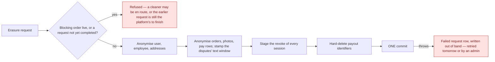
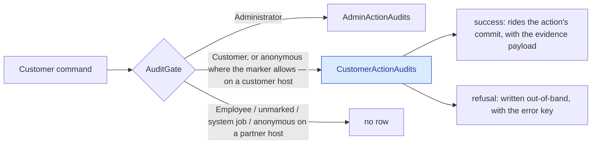

# GDPR, retention and audit

Erasure, what survives it, what is recorded about privileged access — and what is recorded about the
customer's own acts.

## Erasure is anonymise-in-place

The `User` row **survives with its id**, and its personal fields are scrubbed. That single design
choice explains most of what follows.

Twenty repositories are walked: cart, devices, disputes, employee documents, invoices, payout
details, GDPR requests, live-activity tokens, pay rows, order photos, orders, outbox, recurring
templates, saved addresses, consents, memberships, notifications, users, dead letters — and the
customer audit trail, which is **pseudonymised, not deleted**: a tracked load of every row of the
subject, `Pseudonymise()` on each (the IP address, device label and device id go; the act, its
outcome, the evidence and the subject id stay). → [The customer trail](#customer-trail)

**The whole walk is one commit.** It used to commit once in the middle — the session revoke carries
its own commit for the logout race — which made everything above it durable while everything below
could still roll back: a half-erased subject with no request on record. The erasure now *stages* the
revoke into its own unit of work, and a commit that throws leaves the subject, their still-valid
sessions and the absent request exactly as they were. A concurrency collision on a token row fails the
erasure as a whole; the retry is the platform's (below).

**What survives, by ruling (2026-09-14).** The **dispute text** — the description, the messages, the
resolution notes — is *not* blanked at erasure any more: the erasure stamps `Dispute.TextRetainedUntil
= now + retention.dispute_text.years` (default 3, floor > 0) and leaves it readable for defence of a
claim; the weekly sweep's `DisputeText` task blanks it once the stamp is past and clears the stamp. The
evidence **files** still go at erasure (they are not text) and the evidence rows are blanked. The
cancellation reason is kept as before. The consent rows are withdrawn, and keep their IP, user agent,
version and document id. A **guest's** booking rows are not reached: a guest booking is never attached
to an account later, so no row with no user belongs to the subject — reaching them would mean matching
guest orders by e-mail, which is an open owner question.

**A failed erasure is on record and finished by the platform.** A throw from the walk or from its
commit, or a refusal after the walk began, is caught outside the rolled-back transaction and written
as a **`Failed` `GdprRequest`** with the reason (exception type and message, any e-mail-shaped token
blanked) and who asked (`self`, the admin's e-mail, `system`); a refusal before the walk — a live
order, a request already pending — stays a plain answer with no row. A `Failed` row, or one left
`Processing` for more than thirty minutes by a host that died mid-walk, is **retryable**: the daily
`RetryFailedUserDeletions` job (05:00 UTC, under the retention master switch) re-runs each once per
row per day in its own scope with the row's tenant set, completes the row on success, appends the new
note and logs at Error on another failure — the alarm until admin notifications exist; an admin can
**Retry** it from the data-protection page at any time (`gdpr.user.delete.retry`, audited). Every
request not yet `Completed` counts as pending, so the subject cannot file a second one over a failed
first — the second used to complete on a row of its own and the sweep then re-walked the erased
subject through the first.

## A cleaner's own deletion files a request; it does not erase

Everything above describes what happens to a **customer**. A subject who has an `Employee` row is
different, and the same endpoint treats them differently.

A customer's relationship with the platform *is* the account, so erasing the account ends it. A
cleaner's is not: behind the `Employee` row sits a working relationship with a contract, statutory
financial records, and a self-billing agreement whose facts are the authority for invoices that are
themselves retained. None of that ends because someone taps a button, and none of it is the subject's
to delete.

So when a cleaner deletes their own account, a `Pending` `GdprRequest` is **filed** and nothing else
runs — no anonymisation, no membership cancellation, no blob deletion. They stay signed in and keep
working. An administrator fulfils the request afterwards, once the cooperation has been formally ended
and the paperwork signed, and only then does the cascade above run. → [ADR-0052](/decisions/adr-0052)

Three conditions refuse the request outright, and they refuse an **administrator** too — nobody erases
a cleaner out from under a live job:

| Refused when | Because |
|---|---|
| An invoice is `Pending`, `Approved` or `Disputed` | Money is mid-flight. |
| They hold a seat on an order that is not terminal | They are staffed on work. The customer-side blocking check cannot see this: it filters the order's `UserId`, so a cleaner assigned to *someone else's* job is invisible to it. |
| A pay row is uninvoiced, or its pay period has not reached `Paid` | Work has not been paid for. Deliberately one condition rather than two — to a cleaner both are the same situation and have the same remedy. |

### Why loyalty, referral and promo rows are not touched

They carry a **foreign key and non-PII scalars only**. Because the user row survives anonymised, those
rows already point at an anonymised subject. Deleting them would corrupt the loyalty ledger and the
one-shot promo and benefit guards for no privacy gain — a promo code that becomes redeemable again
because its redemption row was erased is a defect, not a right.

Referral codes are randomly generated rather than name-derived, so they leak nothing either.

## Retention

A background sweep prunes expired confirmation and reset codes, stale devices, completed GDPR
requests, old orders, consents, employee documents and notifications — including a per-user
notification cap. It runs across tenants and commits per batch.

**The customer audit trail is on it, per row.** One task (`CustomerActionAudits`, under the same
`DataRetention:Enabled` master switch) deletes every row older than `retention.customer_audit.years`
(default **3**) measured from the row's **own** act — not from the customer's last act, which would
have kept an active customer's IP addresses for the life of the account — in batches until a batch
comes back empty, tenant-agnostic like the GDPR-request clean-up, over the `(OccurredOn)` index. A
window at or below zero is treated as a misconfiguration and the default is kept with a warning: this
is the one delete the append-only discipline sanctions, and a cutoff of "now" would empty the evidence
table on the next tick. The admin and cleaner audit tables have **no** window and the task never
reaches them. → [Business rules — retention](/product/business-rules#customer-record)

**The erased customer's dispute text is on it too.** The `DisputeText` task reads only the stamp the
erasure set (`Dispute.TextRetainedUntil`), blanks the description, the messages and the resolution
notes of every dispute whose stamp is past, and clears the stamp so each batch shrinks the backlog —
pure-modify, no tenant override, `RetentionDefaults.BatchSize` at a time. The window itself
(`retention.dispute_text.years`) is read by the erasure when it stamps, not by the sweep.

**A failed erasure is retried by its own daily job**, not by this sweep — `RetryFailedUserDeletions`
at 05:00 UTC, under the same master switch (→ above).

## Admin action audit

Every privileged action writes an **append-only** record carrying the actor's session — and it records
**failures as well as successes**, so a refused privileged attempt is visible rather than invisible.

The audit is also the compensating control for the one thing stored in plaintext: revealing a cleaner's
payout identifiers is modelled as a *command* rather than a query so it cannot happen unrecorded, and
the entity stamps who looked and how often. The same reasoning now covers the **admin subject export**:
dumping another person's whole record is a command marked `gdpr.user.export`, so it leaves an audit row
(subject id, scope and row counts — never the exported data) and commits the `GdprRequest` it files.
As a query it left neither. And it covers the **incident file**: building the PDF is
`gdpr.user.incident_file`, with the subject id, the order scope, the section counts and the SHA-256 of
the file's data section on the row — so a printed copy can be matched to the build that produced it.

**An admin's refusal on an order is traceable by the order.** `AdminCancelOrder`, `AdminReassignOrder`,
`UpdateDisputeStatus` and `AddDisputeMessage` carry a frozen label with a resource type, so a refused
cancel on a job in progress is an admin row with `ResourceType = Order`, the order id and
`order.in_progress_cannot_cancel` — found by the order's history and by the audit list's resource
filter (owner ruling 2026-09-14, Q-AUD-O2: *"the reason is worth nothing if I can't trace the failed
order"*).

## The incident file {#incident-file}

The document support hands over is a **PDF** (owner ruling 2026-09-14, Q-AUD-L6), built by an admin
from `/customers/:userId` — the whole account, or one typed order id — or from an order's detail,
scoped to that order:

1. **Identity as of export** — name, e-mail, phone, account created, operator, language; marked
   *erased* with the anonymised values after an erasure. The one document that prints it on purpose.
2. **Orders** — number, dates, address, lines, price with currency code, payment, status history,
   refunds, assigned cleaners, cancellation.
3. **Disputes** on those orders — reason, description, messages, evidence file names, resolution,
   refund (whatever the three-year window still holds after an erasure).
4. **Consents** — type, version, effective date, granted at, IP, user agent.
5. **The trail** — the subject's customer rows, then the admin rows on the account, the orders and
   their disputes, then the cleaner rows, newest first within each source, capped at the newest 2 000
   per source with the cut said on the page; each payload as a two-column evidence table.
6. **Integrity** — the SHA-256 of the data section, on the last page; the generating admin's e-mail
   and *page x of y* in every footer. No signature.

Whose orders: the ones that name the subject now **or** the ones their own *successful* acts named —
after an erasure the trail is the only link. A stranger's order id is `order.not_found`. Scoped to an
order, the trail is the subject's own rows and the guest rows on that order — never a bystander's
refused probe, whose id, IP and device are not the subject's to export. **What the hash proves:** that
this copy is the file the audit row of the *same* build describes. It does not promise a later build
matches — an unscoped file changes with every act on the account, the previous build's own row
included; an order-scoped file is stable until something on that order changes.
→ [`incident-file`](/domain/roles/incident-file), [ADR-0062](/decisions/adr-0062) D6 as amended

## The customer trail {#customer-trail}

A **third** audit table, `CustomerActionAudits`, records what a customer did that money, an
entitlement or the account itself turns on — twenty-five acts, opt-in by a marker on the command,
written by the same pipeline as the admin table through the customer arm of `AuditGate`
([ADR-0062](/decisions/adr-0062)):

A success row carries a typed evidence record the handler emitted — the figures and versions the
customer was shown — and the request context (client audience, IP, device). A refusal carries the
error key and no payload. Both carry the operating company of the request. The row holds identifiers,
money, enums and versions and never a name, a contact detail, an address line, free text or a token;
a build-time guard walks every evidence record for a member so named.

Support reads it in three places: the audit log's *Customer actions* segment (list and entry), the
per-resource history from an order or a dispute (the customer's rows interleaved with the admin's and
the cleaner's, newest first), and the customer's page (`/customers/:id`), which has the same timeline
and the **Export subject data** and **Incident file (PDF)** buttons. Every route is behind
`CanViewAuditLog`, and the admin request log suppresses their bodies wholesale. The timeline by user
finds the subject's orders by the order's `UserId` **or** by the subject's own successful acts on it,
so an erased subject (whose orders no longer name them) keeps the admin and cleaner rows on their
orders.

What survives what:

| Event | Customer audit rows |
|---|---|
| Erasure of the subject | Kept; IP, device label and device id blanked. The `UserId → OrderId` link stays — after erasure it is the only link from the erased id to its orders. |
| The subject's own data export, or an admin's | Included as `customerActions`, with the payload; IP and device null after an erasure. The customer's own export is itself a `customer.gdpr.export` row. |
| Three years after the act | Deleted, per row, by the retention sweep. |
| The order's two-year PII anonymisation | Untouched — the order loses its `UserId`; the audit row keeps its own. |
| The incident file | Printed in the trail section, each payload flattened; the guest rows on a scoped order too, a bystander's never. |

→ [What is recorded about a customer](/product/business-rules#customer-record),
[`customer-action-audit`](/domain/roles/customer-action-audit), [`audit-gate`](/domain/roles/audit-gate)

## Edge cases

| Case | What happens |
|---|---|
| Erasure requested with a job in progress | Refused. Erasing mid-job would anonymise a customer while a cleaner is on the way to their home. |
| Erasure requested twice | Refused as already pending while any earlier request is not yet `Completed` — a `Failed` one included, which the daily retry or an admin finishes. |
| The erasure's commit throws | Nothing changes — the subject, their sessions, the trail; a `Failed` request row is written out of band with the reason and retried the next day at 05:00 UTC, or by an admin's **Retry**. |
| A `Processing` request row older than thirty minutes | Cannot be a live run — the walk takes seconds — so it is treated like a failure: the daily job retries it and the admin **Retry** is offered on it. |
| An erased customer's dispute | The description, messages and resolution notes stay readable for `retention.dispute_text.years` (3) from the erasure, then the weekly sweep blanks them; the evidence files went at erasure. |
| A cleaner deletes their own account | A request is filed; nothing is erased. They stay signed in. An admin fulfils it after the paperwork. |
| A cleaner is staffed on a future job, or is owed pay | Refused — for an admin as much as for the cleaner. |
| Order photos | Anonymised individually — they carry a capturer and free text the order-level walk does not reach. |
| An audit row for an erased admin | Survives. The audit is append-only and outlives the actor. |
| A customer audit row for an erased customer | Survives, pseudonymised: the three request-metadata columns are blanked and nothing else changes. An erasure whose commit fails leaves the rows untouched. |
| A guest's booking rows after the guest registers with the same email | Not inherited. Guest rows have no user and are reachable only from the order's history. |
| An anonymous refusal before the market's operator is known | No row — there is no tenant to stamp it with. The sink logs one warning instead of writing an orphan. |
| Notification flood for one user | Capped; the overflow is pruned. |
