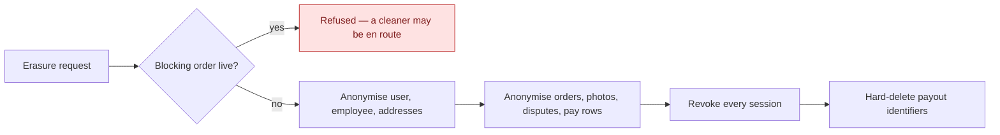

# GDPR, retention and audit

Erasure, what survives it, and what is recorded about privileged access.

## Erasure is anonymise-in-place

The `User` row **survives with its id**, and its personal fields are scrubbed. That single design
choice explains most of what follows.

Nineteen repositories are walked: cart, devices, disputes, employee documents, invoices, payout
details, GDPR requests, live-activity tokens, pay rows, order photos, orders, outbox, recurring
templates, saved addresses, consents, memberships, notifications, users, dead letters.

### Why loyalty, referral and promo rows are not touched

They carry a **foreign key and non-PII scalars only**. Because the user row survives anonymised, those
rows already point at an anonymised subject. Deleting them would corrupt the loyalty ledger and the
one-shot promo and benefit guards for no privacy gain — a promo code that becomes redeemable again
because its redemption row was erased is a defect, not a right.

Referral codes are randomly generated rather than name-derived, so they leak nothing either.

## Retention

A background sweep prunes expired confirmation and reset codes, stale devices, completed GDPR
requests, old orders, consents, employee documents and notifications — including a per-user
notification cap. It runs across tenants and commits per batch.

## Admin action audit

Every privileged action writes an **append-only** record carrying the actor's session — and it records
**failures as well as successes**, so a refused privileged attempt is visible rather than invisible.

The audit is also the compensating control for the one thing stored in plaintext: revealing a cleaner's
payout identifiers is modelled as a *command* rather than a query so it cannot happen unrecorded, and
the entity stamps who looked and how often.

## Edge cases

| Case | What happens |
|---|---|
| Erasure requested with a job in progress | Refused. Erasing mid-job would anonymise a customer while a cleaner is on the way to their home. |
| Erasure requested twice | Idempotent. |
| Order photos | Anonymised individually — they carry a capturer and free text the order-level walk does not reach. |
| An audit row for an erased admin | Survives. The audit is append-only and outlives the actor. |
| Notification flood for one user | Capped; the overflow is pruned. |
