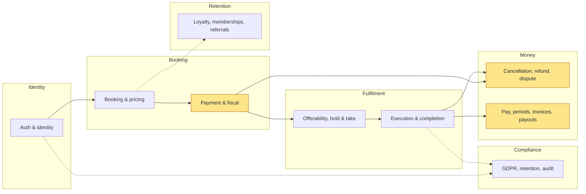

# Flows

How a thing actually happens, end to end, across every layer it touches.

A flow page answers one question a reader has at 2am: *what happens when…* — and, more usefully,
*what happens when it goes wrong*. Each carries the happy path, every branch, the edge cases and how
they are handled, the code seams, and the failure modes.

This is the section the rest of the site hangs off. `/domain` says what the nouns are, `/decisions`
says why a shape was chosen, `/architecture` says how a layer is built — but only a flow page tells
you what a customer tapping *Book* sets in motion.

## The map

Solid edges are the ordinary path. Dashed edges are couplings that are easy to miss and expensive to
forget — a booking touches the loyalty ledger, and completion leaves a trail the erasure sweep has to
reckon with.

Shaded boxes move money. Those three carry the flows where a mistake is measured in currency rather
than in a confused user, and they are the ones to read first.

## Cross-cutting

Some concerns do not belong to a single flow and are documented once rather than repeated in each:
tenancy scoping, the outbox and its drainer, consumer idempotency, notification dispatch, and rate
limiting.

## What is here now

The flow pages are being written from the end-to-end walk recorded in the cleanup track's gap
register. Until each lands, the [Architecture](/architecture/overview) and app sections carry the
current descriptions.
