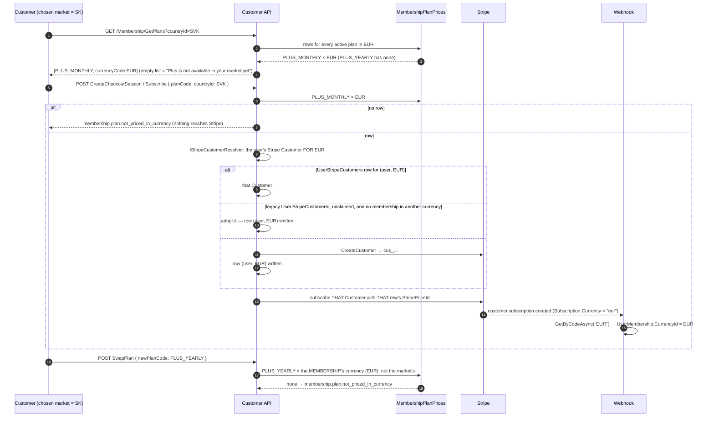
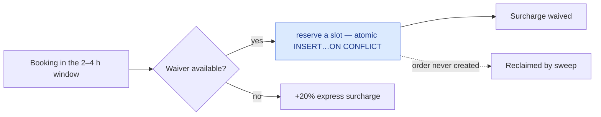

# Loyalty, memberships and referrals

Points, tiers, Cleansia Plus, and the metered benefit that is easiest to get wrong.

## Points

Every grant carries an **idempotency key**, unique per tenant. A retried grant is rejected by the
index rather than doubling someone's balance.

A completed order earns `floor(total / Currency.LoyaltyPointsDivisor)` in the order's currency — 1
point per 10 CZK today — and a partial refund claws back the same fraction of the refund's net through
the same divisor. The divisor is authored per currency on the admin currency form; a currency with no
divisor earns nothing and logs. It is not scaled from another currency's rate.

**A market cannot open without one.** An order completed while its currency has no divisor earns
nothing, permanently: the earn returns before any ledger row is written and nothing re-fires it when
the divisor is set later, so the only remedy is a manual grant per affected customer. That is why the
platform refuses rather than warns: `ActivateCurrency` refuses a currency whose divisor is unset or not
positive, and `UpdateCurrency` refuses to clear the divisor on a currency that is already active — both
as `currency.loyalty_divisor_missing`. A currency that is still switched off may sit without a divisor,
because nothing can be booked in it. The "earns nothing and logs" branch remains as the fail-closed
answer for a row that reaches that state anyway.
→ [Money constants](/product/business-rules#money-constants)

## Cleansia Plus

A membership buys a discount, a wider free-cancellation window, and a quota of express-surcharge
waivers.

**There is no free trial, and a trialing enrolment is not a member** (owner ruling 2026-09-08,
T-0690). Both seeded plans carry `TrialPeriodDays = 0` and the admin plan commands refuse any other
value (`membership.plan.trial_not_permitted`), because a trial is benefits without payment. Every Plus
benefit — the discount, the cancellation window, the waiver quota, recurring schedules and the preferred
cleaner — resolves through the one entitlement predicate (`UserMembershipRepository
.EntitledForUserQuery`), which refuses a `Trialing` enrolment exactly as it refuses `PastDue`, `Paused`,
`Cancelled` or an elapsed period. The `trialEndsAtUtc` / `trialEligible` fields on `GetMyMembership`
still ride the wire for clients built before the ruling; with every plan at zero days no enrolment
carries a trial end. → [Business rules — Cleansia Plus](/product/business-rules#cleansia-plus)

## Plus is priced per market, end to end

**The row is the price.** `MembershipPlan` carries no price; `MembershipPlanPrice` is one row per
(plan, currency) with the charge for one billing period and the Stripe Price id that charges it. The
customer's surfaces ask for the plans **in the chosen market** (`GetPlans?countryId=`, the market's
`countryId` even from inside a booking priced in the address's currency — a subscription belongs to
the customer, not to the booking), the server resolves the market's currency with the same resolver
the quote uses, and only plans with a row in it are listed, labelled `currencyCode`. The subscribe
commands carry the same `countryId`, so the figure shown is the figure charged.

**The subscription keeps its currency for life.** `UserMembership.CurrencyId` is written once — the
webhook confirms it off the Stripe `Subscription` object's own `currency`, and refuses to provision a
code the platform does not know — and never updated. A swap therefore looks the target plan up in
the membership's currency, never the market's, and the clients offer the annual switch only when the
yearly plan is priced in that currency. `GetMine` labels every figure with it, whatever market the
customer browses in now. A customer who wants Plus in another currency cancels and re-subscribes.

**Re-subscribing in another currency works, by construction** (owner ruling 2026-09-13: *"a
must-have"*). Stripe locks a Customer to the currency of its first invoice and refuses a subscription
in another, so the platform holds **one Stripe Customer per currency per user** —
`UserStripeCustomers`, unique `(UserId, CurrencyId)`, unique `StripeCustomerId`. Both subscribe
commands resolve the Customer for the market's currency through `IStripeCustomerResolver` after the
plan and price checks: an existing row for that currency; else the legacy `User.StripeCustomerId`,
**adopted** (a row written) only when it has never billed a membership in another currency and no
row already claims it — a checkout abandoned after adoption leaves a row with no membership, which is
why the row check stands beside the membership check; else a new Stripe Customer, with a row and, if
the user had none, the legacy field. End to end: a customer whose CZK Plus was cancelled picks the SK
market and subscribes in EUR — the CZK membership row blocks adoption, a second Customer is created,
the EUR subscription is born on it, and the CZK Customer keeps its history. The customer's first
currency adopts the legacy Customer, so nothing is orphaned. The legacy field stays for one-off order
payments. `membership.stripe_customer_currency_locked` is kept as the backstop classification for a
Customer Stripe locked for a reason the resolver could not see, never a 500 (the DEV sandbox did not
enforce the rule on 2026-09-13). A user is found by any of their Customer ids
(`FindUserIdByStripeCustomerIdAsync`: the table, then the legacy column); `DeleteCurrency` answers
`currency.in_use` for the rows; GDPR erasure deletes them with the legacy field.

**The benefits are currency-free.** The discount is a percentage of the order's own subtotal; the
window is hours; the waivers are a count. A CZK subscription serves a EUR booking without conversion.

**What an admin authors.** A price and a Stripe Price id per currency on the plan form — every
block optional, a half-filled block refused, currencies not sent left alone. A plan with no row in a
currency is "Plus is not on sale in that market", a valid state that gates nothing:
`ActivateCurrency` does not check plans. → [ADR-0059](/decisions/adr-0059),
[API — markets and memberships](/api/markets-and-memberships)

## The express waiver is metered per calendar month

The quota key is `(TenantId, UserId, BenefitKind, PeriodKey)` **and nothing else**. `PeriodKey` is the
calendar month, computed once at reservation and never recomputed.

> `UserMembershipId` is a support payload column. It must never appear in a `WHERE`, `GROUP BY` or join
> on a counting path — if it does, the quota resets when someone re-subscribes.

Reservation is one atomic statement that derives the smallest free ordinal in SQL and auto-commits
**before the order exists**, so the order id is stamped afterwards. Rows that never get one are
reclaimed by a sweep.

The resolver answers for **everyone, guests included** — a client needs to tell "express, charged"
apart from "not an express slot at all".

## Public promo-code requests

The public site's promo form accepts one request per email address, normalized by trimming
whitespace and ignoring case. The first request creates a deterministic code and its email outbox
message in one database transaction. A successful response means the email is queued for delivery.

A repeated request returns HTTP 400 with `promo.already_sent`; the form displays a localized
"A promo code has already been sent to this email address" message. It does not queue another email
or create another code. The same rule applies when submissions arrive concurrently: the database's
unique constraints choose one successful request and the others receive the same business error.
If saving the email message fails, the code is rolled back so a later request can try again.

The code is sent only by email, never in the HTTP response. Queue redelivery retains the same
idempotency key. This flow does not look up whether the address has a registered account.

## Referrals

A referral code is randomly generated, never derived from a name — which is also why erasure leaves it
alone. You cannot redeem your own code, and you cannot be referred twice.

## Edge cases

| Case | What happens |
|---|---|
| Two bookings race for the last waiver | The unique index decides; the loser pays the surcharge. |
| Quota released mid-month | The smallest **free** ordinal is reused, so capacity genuinely returns. |
| Plan downgraded mid-month | The live count carries across, so a downgrade cannot grant a fourth waiver on a two-waiver plan. |
| Re-subscribing | Quota does **not** reset — the key has no membership id in it. |
| Plus page opened in a market with no priced plan | Empty list; "Plus is not available in your market yet", no price, no button; a subscribe attempt is `membership.plan.not_priced_in_currency`. |
| Market switched while a membership is active | The membership keeps its currency and its labels; no second subscription is offered (`membership.already_active`). |
| Swap to a plan unpriced in the membership's currency | `membership.plan.not_priced_in_currency`; the clients do not offer the switch. |
| Webhook names a currency the platform does not know | Nothing is provisioned; an error is logged. |
| Points granted twice by a retry | Rejected by the idempotency index. |
| Order in a currency with no points divisor | Unreachable through the admin surface — activation refuses without a divisor and an active currency cannot have it cleared (`currency.loyalty_divisor_missing`). A row that reaches the state anyway earns nothing and logs a warning; nothing is borrowed from another currency's rate. |
| Self-referral | Refused. |
