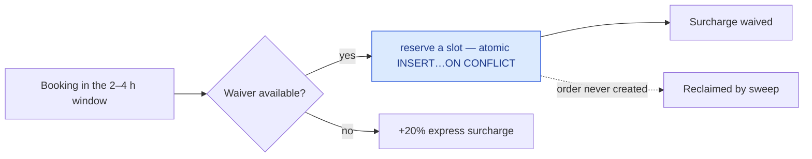

# Loyalty, memberships and referrals

Points, tiers, Cleansia Plus, and the metered benefit that is easiest to get wrong.

## Points

Every grant carries an **idempotency key**, unique per tenant. A retried grant is rejected by the
index rather than doubling someone's balance.

A completed order earns `floor(total / Currency.LoyaltyPointsDivisor)` in the order's currency — 1
point per 10 CZK today — and a partial refund claws back the same fraction of the refund's net through
the same divisor. The divisor is authored per currency on the admin currency form; a currency with no
divisor earns nothing and logs. It is not scaled from another currency's rate.
→ [Money constants](/product/business-rules#money-constants)

## Cleansia Plus

A membership buys a discount, a wider free-cancellation window, and a quota of express-surcharge
waivers.

A **trialing** member is active — they keep the discount and the cancellation window — but earns
**no** waiver. The reported quota still shows the plan's number so a client can say when waivers start
rather than showing zero and looking broken.

## The express waiver is metered per calendar month

The quota key is `(TenantId, UserId, BenefitKind, PeriodKey)` **and nothing else**. `PeriodKey` is the
calendar month, computed once at reservation and never recomputed.

> `UserMembershipId` is a support payload column. It must never appear in a `WHERE`, `GROUP BY` or join
> on a counting path — if it does, the quota resets when someone re-subscribes.

Reservation is one atomic statement that derives the smallest free ordinal in SQL and auto-commits
**before the order exists**, so the order id is stamped afterwards. Rows that never get one are
reclaimed by a sweep.

The resolver answers for **everyone, guests included** — a client needs to tell "express, charged"
apart from "not an express slot at all".

## Referrals

A referral code is randomly generated, never derived from a name — which is also why erasure leaves it
alone. You cannot redeem your own code, and you cannot be referred twice.

## Edge cases

| Case | What happens |
|---|---|
| Two bookings race for the last waiver | The unique index decides; the loser pays the surcharge. |
| Quota released mid-month | The smallest **free** ordinal is reused, so capacity genuinely returns. |
| Plan downgraded mid-month | The live count carries across, so a downgrade cannot grant a fourth waiver on a two-waiver plan. |
| Re-subscribing | Quota does **not** reset — the key has no membership id in it. |
| Points granted twice by a retry | Rejected by the idempotency index. |
| Order in a currency with no points divisor | Earns nothing, and a warning is logged; nothing is borrowed from another currency's rate. |
| Self-referral | Refused. |
