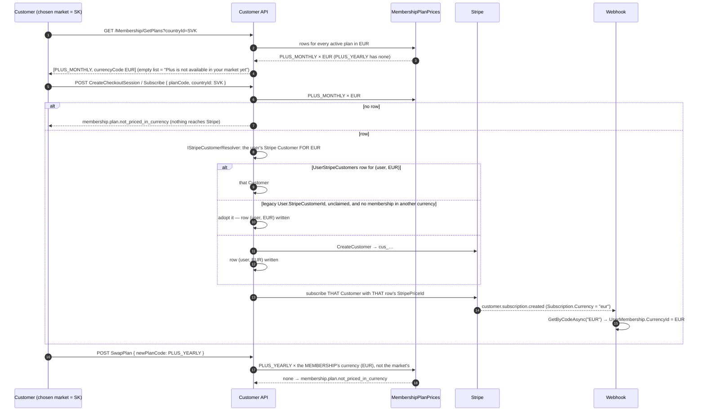
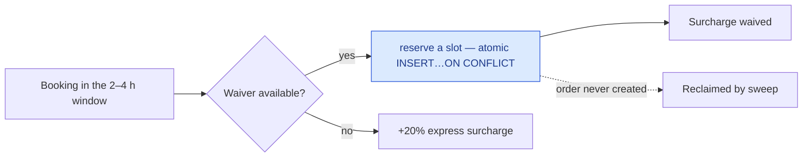

# Loyalty, memberships and referrals

Points, tiers, Cleansia Plus, and the metered benefit that is easiest to get wrong.

## Points

Every grant carries an **idempotency key**, unique per tenant. A retried grant is rejected by the
index rather than doubling someone's balance.

A completed order earns `floor(total / Currency.LoyaltyPointsDivisor)` in the order's currency — 1
point per 10 CZK today. Every refund takes back the same share of the points that order earned as it
returned of the price — card and credit, gross — whatever the divisor is by then (owner rulings
2026-10-03). A partial refund takes its share. A full refund takes everything the earn still holds. A
dispute settlement takes the share of what it returned, on the card or as credit
([Refunds](/flows/cancellation-refund-dispute#refund)). Money given back before the order completes
takes its share at completion (since 2026-10-04). Completion writes the earn on the whole price and,
beside it, a refund row of `floor(earned × returned / TotalPrice)` for everything returned so far.
The divisor is authored per currency on the admin currency form; a currency with no divisor earns
nothing and logs. It is not scaled from another currency's rate.

**Two writes for one customer at the same moment both land** (owner decision 2026-10-03). A loyalty
write loads the account, moves `LifetimePoints` in memory and saves the new total. When two writes
read the same total — two refund clawbacks, or a clawback and a completion grant — the later commit
used to overwrite the earlier one's points, and the tier those points reached, while both ledger rows
landed. `LoyaltyAccount` now carries the Postgres `xmin` concurrency token, registered the way
`UserMemberships` registers it, so the later write conflicts instead. The commit
(`CleansiaDbContext.CommitAsync`) then does the following, up to five attempts:

1. It resets every account the commit changed that another writer has committed to since it was
   loaded to the committed row. A failed save names only the first stale row it met, and a tier edit
   can move thousands of accounts in one commit, so all of them are found in one pass.
2. It replays the points and completed bookings the write moved on top (`LoyaltyAccount.Replay`).
3. It reads the tier again with the thresholds in force, read after the committed rows: the stored
   tier configs, under any threshold edit the same commit is saving. The thresholds the write read
   earlier are not used, because an edit that committed first has already re-tiered the account.
4. It saves again.

The write's ledger rows were never saved, so they are saved once with the replay, and the total stays
the sum of the ledger. The retry sits in the commit rather than in `LoyaltyService` because a refund
with a credit leg still holds the credit lock when its clawback flushes. Only inside the commit is the
replay saved under that lock. The same retry covers every loyalty write the pipeline commits: the
completion grant, the cancellation revoke, referrals and tier edits. An atomic SQL increment was
considered and not chosen. It would need its own transaction on every write path to stay atomic with
the ledger insert, and it would still have to recompute the tier from the stored total.
`LoyaltyAccountConcurrentWriteTests` runs the races on a real Postgres.

**The tier-upgrade notice is decided after the replay** (since 2026-10-04). A completion grant used to
queue `loyalty.tier_upgrade` from its own read of the account, so a replay could leave it naming a tier
the account never reached, or missing when the replay was what crossed a threshold. The grant now
registers a step that runs after the save (`ILoyaltyAccountRepository.AfterSave`).
`CleansiaDbContext.CommitAsync` notes the tier stored in the database before each save attempt. After
the attempt that lands, it runs the step with that tier and saves what the step queued, the feed row
and the push's outbox row, in the same transaction. The step announces only a promotion over that
tier, and names the tier saved. A new account is compared with the tier it was created at. With
Silver at 500 points and Gold at 2 000, and the grant reading an account at 450:

| The grant | What commits first | After the replay | Notice for the grant |
|---|---|---|---|
| +100, Silver on its own read | a 200-point clawback (250) | 350, still Bronze | none |
| +30, Bronze on its own read | another grant of 40 (490) | 520 | Silver |
| +100, Silver on its own read | a grant of 1 500 (1 950), announced as Silver | 2 050 | Gold |

**A market cannot open without one.** An order completed while its currency has no divisor earns
nothing, permanently: the earn returns before any ledger row is written and nothing re-fires it when
the divisor is set later, so the only remedy is a manual grant per affected customer. That is why the
platform refuses rather than warns: `ActivateCurrency` refuses a currency whose divisor is unset or not
positive, and `UpdateCurrency` refuses to clear the divisor on a currency that is already active — both
as `currency.loyalty_divisor_missing`. A currency that is still switched off may sit without a divisor,
because nothing can be booked in it. The "earns nothing and logs" branch remains as the fail-closed
answer for a row that reaches that state anyway.
→ [Money constants](/product/business-rules#money-constants)

**A clawback row reads as a refund** (since 2026-10-04). Every refund's clawback, whether partial, full
or a dispute's, and the share taken at completion, is a `Revoke` row with the source
`OrderPartiallyRefunded`. The points activity on the web, Android and iOS now labels a row by its
source alone:

| Source | Label |
|---|---|
| `OrderCompleted` | the cleaning completed |
| `OrderCancelled` | the booking cancelled |
| `OrderPartiallyRefunded` | *Refunded* (Android and iOS: *Refunded #N*) |
| `Referral` | the referral bonus |
| an administrator's grant or revoke, or a source the client does not know | a manual adjustment |

Until then the web checked the row's type first and read every revoke as a cancelled booking,
including a refund or an administrator's revoke. Android and iOS did not know the source and read a
refund as a manual adjustment. The web label was *Partly refunded*; a full refund writes the same
source, so it now says *Refunded* in all five languages.

## Points are not credit {#points-vs-credit}

A customer holds two balances, and they do different things.

| | Points (`LoyaltyAccount`) | Credit (`CreditAccount`) |
|---|---|---|
| What it is | a count with no currency | money the platform owes the customer, one account per currency |
| Earned by | a completed order, a qualified referral, an administrator's grant | the no-show or no-cleaner apology, a complaint settled in credit, goodwill |
| Spent | never; nothing redeems points | automatically, on the next card booking in the same currency, up to the server's share of it; a refunded or cancelled booking gives back what it spent |
| Taken back | a refund's clawback (partial, full or a dispute's), a cancelled order's points, a reversed referral, an administrator's revoke | account deletion, the operating company's deactivation, an administrator's *Expire credit* |
| Expires | never | 12 months after the last movement |
| What it changes | the tier, and through it the tier discount | what the card is asked for |

The Android and iOS credit explainer sheet, opened from Rewards and from Profile, says the same in
one line: points move the tier and its discount and are never spent, and credit is money off the
bookings. → [Business rules — customer credit](/product/business-rules#credit)

## Tiers {#tiers}

**A tier follows the points total, both ways.** `LoyaltyAccount` recomputes its tier from
`LifetimePoints` against the tier thresholds every time points move. A grant can raise it, and a revoke
lowers the total and can lower the tier. Revokes include a refund's clawback, an
administrator's manual revoke and a reversed referral. Nothing ratchets. The web rewards page says so:
the ladder states that the tier follows the current points total, and the balance note says a tier can
drop.

**Editing the thresholds re-tiers everyone at once** (owner ruling 2026-09-28: the tier follows the
points both ways, and stale tiers after a threshold edit are fixed). `UpdateTierConfig` builds the
thresholds from the saved configuration (`LoyaltyTierThresholds.From`, the same factory
`LoyaltyService` resolves them with) and, in the same save, applies them to every loyalty account of
every company (`LoyaltyAccount.ApplyTierThresholds`, read across tenants because a tier configuration is
the platform's), so an account never keeps a tier its points no longer reach, or misses one they do. An
account whose tier moves is stamped; no upgrade push is sent for a threshold edit.

**A tier's perks are what the rewards page can name.** The page renders each tier's `PerksJson` as
stored. As seeded, that is the welcome badge on every tier plus the tier's discount from the second
tier up. No tier lists priority support or a dedicated cleaner pool, because nothing in the platform
provides either. The customer web's `loyalty-tier-claim` spec fails if a seeded perk has no copy in one of the
five locales, or if the copy promises that a tier cannot drop.

## Cleansia Plus

A membership buys a discount, a wider free-cancellation window, a 60-minute oops window after every
booking instead of the standard 15 — anyone's first booking gets 60 too
([the oops window](/product/business-rules#oops-window)) — a quota of express-surcharge waivers,
recurring schedules and the preferred cleaner, all of them from the first day of a free trial. The
free-cancellation window is 4 hours before the cleaning instead of 24: a fixed term of the customer
contract, frozen on each order at booking, and no longer a plan setting (owner ruling 2026-10-03 →
[Cleansia Plus](/product/business-rules#cleansia-plus)).

**A free trial carries every benefit, and an account gets one** (owner ruling 2026-09-30, reversing
the trial half of the 2026-09-08 ruling, T-0690). The trial is the plan's `TrialPeriodDays` — 14 on both
seeded plans, set per plan by an administrator, `0` for none. It flows like this:

1. **The offer.** `GetPlans` carries each plan's `trialPeriodDays` and `GetMine` the customer's
   `trialEligible`. The web (`offeredTrialDays`) offers a plan's days unless the customer is a member
   or has had a trial, and offers them to a signed-out visitor; Android (`trialDaysOn`) and iOS
   (`offeredTrialDays`) offer them only when the server says `trialEligible`. A surface with no plan
   picker offers the monthly plan's days. No client states a length of its own.
2. **The subscribe.** Checkout and the direct subscribe both ask `MembershipTrialResolver`: the plan's
   days, or `0` when `HasEverStartedTrialAsync` finds a trial end on any of the account's enrolments,
   in any status. Stripe gets `TrialPeriodDays` only when that is above zero; there is no per-card
   check. The subscribe audit row records the days granted.
3. **The trial.** Stripe reports `trialing`; the platform holds it as `Active` and mirrors `trial_end`
   into `UserMembership.TrialEndsAtUtc`, from the subscribe result and from the webhook — which never
   clears it, since a dunning event carries no trial end and clearing it would hand out a second trial.
   The entitlement predicate (`UserMembershipRepository.EntitledForUserQuery`) asks only `Active`
   inside the period, so the discount, both cancellation windows, the 60-minute oops window, the
   waiver quota, recurring schedules and the preferred cleaner all apply from day one. `PastDue`,
   `Paused`, `Cancelled` and an elapsed period stay refused. While `trialEndsAtUtc` is in the future
   the clients show *Free trial until* that date, the day of the first charge.
4. **The end.** Stripe charges when the trial ends. A cancel inside it charges nothing and keeps the
   benefits to the trial's end. A first charge that fails is `PastDue` or `Paused`, like a failed
   renewal. A trial that ends unpaid lapses like a paid period: `GetLatestPaidForUserAsync` reads an
   enrolment with paid proof **or** a trial end, so a recurring schedule the member set up during the
   trial pauses and the member is told once
   ([`recurring.paused`](/architecture/push-notifications#recurring-paused)).

**The one-trial check is tenant-scoped.** `HasEverStartedTrialAsync` reads through the tenant query
filter, so it is asked inside a customer request, where the tenant is the customer's. A caller with no
tenant — a background job — would see no earlier trial on any tenanted row and hand out a second one.
→ [Business rules — the free trial](/product/business-rules#plus-trial)

**A failed renewal pauses the benefits and keeps the membership visible** (owner ruling 2026-09-28).
The lifecycle read (`GetLifecycleForUserAsync`, renamed from `GetActiveForUser*`) answers a live
enrolment — `Active`, `PastDue` or `Paused` within its period — and entitlement stays `Active`. So a
past-due member's `GetMyMembership` is `hasMembership: true, status: PastDue`, every client shows
*payment failed, benefits paused* with a cancel, both subscribe paths refuse a second subscription
(`membership.already_active`), and the unique index over `(TenantId, UserId)` covers the three live
statuses. The member's cancel takes effect **now** — `IStripeClient.CancelSubscriptionNowAsync` cancels
the subscription without proration and voids its open invoice, and the row becomes `Cancelled` with an
effective end of now — while an `Active` member still cancels at period end. Each
`invoice.payment_failed` sends the member `membership.payment_failed`, one per failed attempt; one that
lands after the cancel is ignored. Erasure and a company wind-down cancel a past-due membership at once
too. A plan swap still requires `Active` (`membership.not_found` otherwise).

## Plus is priced per market, end to end

```mermaid
sequenceDiagram
  autonumber
  participant C as Customer (chosen market = SK)
  participant API as Customer API
  participant R as MembershipPlanPrices
  participant S as Stripe
  participant W as Webhook

  C->>API: GET /Membership/GetPlans?countryId=SVK
  API->>R: rows for every active plan in EUR
  R-->>API: PLUS_MONTHLY × EUR (PLUS_YEARLY has none)
  API-->>C: [PLUS_MONTHLY, currencyCode EUR]  (empty list = "Plus is not available in your market yet")

  C->>API: POST CreateCheckoutSession / Subscribe { planCode, countryId: SVK }
  API->>R: PLUS_MONTHLY × EUR
  alt no row
    API-->>C: membership.plan.not_priced_in_currency (nothing reaches Stripe)
  else row
    API->>API: IStripeCustomerResolver: the user's Stripe Customer FOR EUR
    alt UserStripeCustomers row for (user, EUR)
      API->>API: that Customer
    else legacy User.StripeCustomerId, unclaimed, and no membership in another currency
      API->>API: adopt it — row (user, EUR) written
    else
      API->>S: CreateCustomer → cus_…
      API->>API: row (user, EUR) written
    end
    API->>S: subscribe THAT Customer with THAT row's StripePriceId
    S-->>W: customer.subscription.created (Subscription.Currency = "eur")
    W->>W: GetByCodeAsync("EUR") → UserMembership.CurrencyId = EUR
  end

  C->>API: POST SwapPlan { newPlanCode: PLUS_YEARLY }
  API->>R: PLUS_YEARLY × the MEMBERSHIP's currency (EUR), not the market's
  R-->>API: none → membership.plan.not_priced_in_currency
```

**The row is the price.** `MembershipPlan` carries no price; `MembershipPlanPrice` is one row per
(plan, currency) with the charge for one billing period and the Stripe Price id that charges it. The
customer's surfaces ask for the plans **in the chosen market** (`GetPlans?countryId=`, the market's
`countryId` even from inside a booking priced in the address's currency — a subscription belongs to
the customer, not to the booking), the server resolves the market's currency with the same resolver
the quote uses, and only plans with a row in it are listed, labelled `currencyCode`. The subscribe
commands carry the same `countryId`, so the figure shown is the figure charged.

**The subscription keeps its currency for life.** `UserMembership.CurrencyId` is written once — the
webhook confirms it off the Stripe `Subscription` object's own `currency`, and refuses to provision a
code the platform does not know — and never updated. A swap therefore looks the target plan up in
the membership's currency, never the market's, and the clients offer the annual switch only when the
yearly plan is priced in that currency. `GetMine` labels every figure with it, whatever market the
customer browses in now. A customer who wants Plus in another currency cancels and re-subscribes.

**Re-subscribing in another currency works, by construction** (owner ruling 2026-09-13: *"a
must-have"*). Stripe locks a Customer to the currency of its first invoice and refuses a subscription
in another, so the platform holds **one Stripe Customer per currency per user** —
`UserStripeCustomers`, unique `(UserId, CurrencyId)`, unique `StripeCustomerId`. Both subscribe
commands resolve the Customer for the market's currency through `IStripeCustomerResolver` after the
plan and price checks: an existing row for that currency; else the legacy `User.StripeCustomerId`,
**adopted** (a row written) only when it has never billed a membership in another currency and no
row already claims it — a checkout abandoned after adoption leaves a row with no membership, which is
why the row check stands beside the membership check; else a new Stripe Customer, with a row and, if
the user had none, the legacy field. End to end: a customer whose CZK Plus was cancelled picks the SK
market and subscribes in EUR — the CZK membership row blocks adoption, a second Customer is created,
the EUR subscription is born on it, and the CZK Customer keeps its history. The customer's first
currency adopts the legacy Customer, so nothing is orphaned. The legacy field stays for one-off order
payments. `membership.stripe_customer_currency_locked` is kept as the backstop classification for a
Customer Stripe locked for a reason the resolver could not see, never a 500 (the DEV sandbox did not
enforce the rule on 2026-09-13). A user is found by any of their Customer ids
(`FindUserIdByStripeCustomerIdAsync`: the table, then the legacy column); `DeleteCurrency` answers
`currency.in_use` for the rows; GDPR erasure deletes them with the legacy field.

**The benefits are currency-free.** The discount is a percentage of the order's own subtotal; the
window is hours; the waivers are a count. A CZK subscription serves a EUR booking without conversion.

**What an admin authors.** A price and a Stripe Price id per currency on the plan form — every
block optional, a half-filled block refused, currencies not sent left alone. A plan with no row in a
currency is "Plus is not on sale in that market", a valid state that gates nothing:
`ActivateCurrency` does not check plans. → [ADR-0059](/decisions/adr-0059),
[API — markets and memberships](/api/markets-and-memberships)

**A subscribed plan's offer is fixed** (owner ruling 2026-10-03). Once anyone has subscribed to a
plan, in any status and in any company, `UpdateMembershipPlan` refuses a change to its discount or
its express quota (`membership.plan.benefits_locked`). Switching the express waiver off counts as a
quota change while the quota is above zero. A subscriber was shown those figures *for your plan when
you subscribe*, and an edit used to reach every booking they made after it. A different offer is a new
plan, with the old one deactivated. The admin form disables
the two fields when the plan detail says `benefitsLocked`.
→ [Business rules — Cleansia Plus](/product/business-rules#cleansia-plus)

## The express waiver is metered per calendar month

```mermaid
flowchart LR
  A[Booking in the 2–4 h window] --> B{Waiver available?}
  B -- yes --> C["reserve a slot — atomic INSERT…ON CONFLICT"]
  C --> D[Surcharge waived]
  B -- no --> E["+20% express surcharge"]
  C -.->|"order never created"| F[Reclaimed by sweep]

  classDef key fill:#dbeafe,stroke:#1d4ed8,color:#1e3a8a
  class C key
```

The quota key is `(TenantId, UserId, BenefitKind, PeriodKey)` **and nothing else**. `PeriodKey` is the
calendar month, computed once at reservation and never recomputed.

> `UserMembershipId` is a support payload column. It must never appear in a `WHERE`, `GROUP BY` or join
> on a counting path — if it does, the quota resets when someone re-subscribes.

Reservation is one atomic statement that derives the smallest free ordinal in SQL and auto-commits
**before the order exists**, so the order id is stamped afterwards. Rows that never get one are
reclaimed by a sweep.

The resolver answers for **everyone, guests included** — a client needs to tell "express, charged"
apart from "not an express slot at all".

## Public promo-code requests

The public site's promo form accepts one request per email address, normalized by trimming
whitespace and ignoring case. The first request creates a deterministic code and its email outbox
message in one database transaction. A successful response means the email is queued for delivery.

A repeated request returns HTTP 400 with `promo.already_sent`; the form displays a localized
"A promo code has already been sent to this email address" message. It does not queue another email
or create another code. The same rule applies when submissions arrive concurrently: the database's
unique constraints choose one successful request and the others receive the same business error.
If saving the email message fails, the code is rolled back so a later request can try again.

The code is sent only by email, never in the HTTP response. Queue redelivery retains the same
idempotency key. This flow does not look up whether the address has a registered account.

## Referrals

A referral code is randomly generated, never derived from a name — which is also why erasure leaves it
alone. You cannot redeem your own code, and you cannot be referred twice.

## Edge cases

| Case | What happens |
|---|---|
| Two bookings race for the last waiver | The unique index decides; the loser pays the surcharge. |
| Quota released mid-month | The smallest **free** ordinal is reused, so capacity genuinely returns. |
| Plan downgraded mid-month | The live count carries across, so a downgrade cannot grant a fourth waiver on a two-waiver plan. |
| Re-subscribing | Quota does **not** reset — the key has no membership id in it. |
| Plus page opened in a market with no priced plan | Empty list; "Plus is not available in your market yet", no price, no button; a subscribe attempt is `membership.plan.not_priced_in_currency`. |
| Market switched while a membership is active | The membership keeps its currency and its labels; no second subscription is offered (`membership.already_active`). |
| Swap to a plan unpriced in the membership's currency | `membership.plan.not_priced_in_currency`; the clients do not offer the switch. |
| Webhook names a currency the platform does not know | Nothing is provisioned; an error is logged. |
| Points granted twice by a retry | Rejected by the idempotency index. |
| Two loyalty writes for one customer commit at once | The later one conflicts on the account's `xmin` token, is replayed on top of the committed total and saved again; both writes' points land and the tier is the one the total reaches. |
| Several refunds on one order — a partial refund, then a dispute settlement | Each takes its share of the earn under its own key; the cap stops them together at what the order earned. |
| An admin edits a subscribed plan's discount or express quota | Refused, `membership.plan.benefits_locked`; the name, the trial and the prices still save. |
| A revoke takes the total below the current tier's threshold | The tier drops to the one the total now reaches, and its achieved date moves with it. |
| Order in a currency with no points divisor | Unreachable through the admin surface — activation refuses without a divisor and an active currency cannot have it cleared (`currency.loyalty_divisor_missing`). A row that reaches the state anyway earns nothing and logs a warning; nothing is borrowed from another currency's rate. |
| Self-referral | Refused. |
