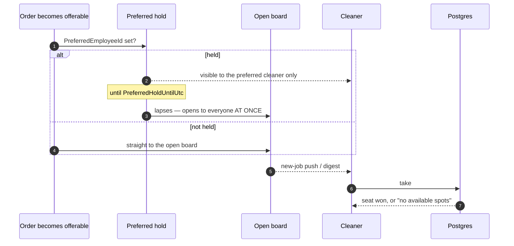

# Offerability and the take

How a job reaches a cleaner's board, and what happens when two of them tap it at the same moment.

The *rule* is documented once in [Offerability](/domain/offerability). This page is the journey.

## The path

## Two synchronised broadcasts

Both arrows into the board wake **many cleaners at the same instant**: the new-job push, and
`NotifyLapsedPreferredOffers` when a hold expires. That is a designed thundering herd onto a single
seat, and it is why the seat needs a real arbiter rather than a check.

## The seat is decided by the database

The take passes three capacity checks — validator, handler re-check, and an in-memory guard — and
**all three are unlocked reads**. Two cleaners loading the order before either commits both pass all
three.

What separates them is a unique index on `(OrderEmployee.OrderId, SeatOrdinal)`. The loser's insert is
rejected at commit and mapped back to the same `no_available_spots` refusal the in-memory path gives,
so the two paths cannot disagree.

The ordinal is the **smallest free** one rather than a count: releasing seat 0 of {0,1} and counting
would derive 1, which is taken — the seat would be permanently unusable while the order read as full.

## Edge cases

| Case | What happens |
|---|---|
| Two cleaners, one seat, same instant | Exactly one assignment survives. The loser sees "no available spots". |
| Two cleaners, **multi-seat** order, same instant | Both derive the same ordinal from the same stale read, so the loser is refused *while a seat is free*. Their next tap succeeds. Known and accepted — a retry loop is real complexity for a self-healing window. |
| Order held for someone else | Indistinguishable from a missing order. The refusal must not reveal that someone else was named. |
| Cleaner already on a conflicting job | Refused by the time-conflict check, last in the cascade. |
| Cleaner over the weekly cap | Refused. |
| Profile incomplete, or contract not approved | Refused before the seat is even considered. |
| Order cancelled but with a free seat | "This job is gone", not "this job is full" — those checks sit *before* offerability on purpose. |

## Taking one job can end another

Confirming a take ends any preferred-cleaner reservation this cleaner can no longer honour in that
time window. Taking a conflicting job **is** a decline: nothing else re-checks the beneficiary's
availability between the grant and the confirmation, so this is the moment it becomes knowable. The
order just taken is excluded, so it earns the assignment notice and never also a closure message.

## The new-jobs digest {#new-jobs-digest}

A timer sweeps the open board and tells each cleaner about work that is **fresh to them personally**.

### Freshness is three sources, not one

`Employee.LastNewJobsDigestAt` is a single per-cleaner scalar, but two of the filters are per-cleaner
and **non-monotone** — an order can become takeable again long after its own status stopped changing.
So freshness is a disjunction, upper-bounded at the sweep's own start instant:

1. the order's **status** moved into an offerable state after the watermark; or
2. one of **this cleaner's commitments was released** after the watermark, and this order sits in the
   window that release freed; or
3. a **preferred hold expired** after the watermark.

Each of the last two exists because of a specific failure:

> **Without the second**, every candidate dropped for a time conflict was burned the moment the cleaner
> was notified about anything else — the watermark moved past it and it never came back.
>
> **Without the third**, a held order is invisible forever. Its only status track is written at
> creation, so by the time the hold opens, its whole history is already older than every other
> cleaner's watermark. It leaves the notification channel permanently and becomes board-only —
> findable solely by someone who happens to scroll.

A cleaner who has never been digested has no watermark and no released window: the whole open board is
new to them.

### Throttling, opt-out, tenancy

The sweep **is** the rate limit — the timer's cadence caps each cleaner to at most one digest per
interval, so no per-event dedup store is needed. Cleaners are only told about orders that are fresh to
them personally.

Each candidate's notification preference gates the enqueue, so the category can be turned off.

The sweep runs across all tenants and stamps each per-recipient queue message with that cleaner's
tenant, so the downstream consumer scopes correctly — see
[Cross-cutting concerns](/flows/cross-cutting#tenancy).
