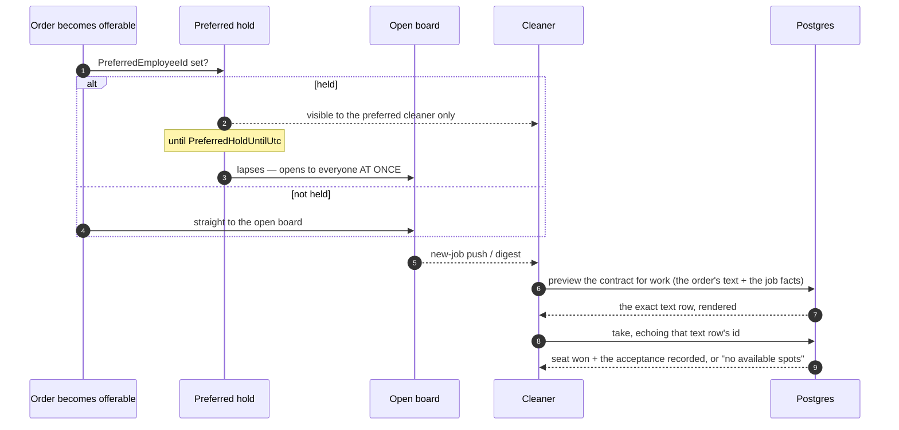

# Offerability and the take

How a job reaches a cleaner's board, and what happens when two of them tap it at the same moment.

The *rule* is documented once in [Offerability](/domain/offerability). This page is the journey.

## The path

## The take carries the acceptance of the contract for work {#the-take-carries-the-acceptance}

Since 2026-09-20 ([ADR-0068](/decisions/adr-0068)) a take is also the cleaner's acceptance of the
contract for work the order was booked under. The order carries its text from booking
(`Orders.WorkContractDocumentId`, the customer-audience `WorkContract` document in force for the
address's market that day — fixed per order, so a new version never binds a job already booked). The
app fetches `GetWorkContractPreview` — the text in the cleaner's language rendered with the order's
currency, plus the job facts the acceptance will freeze (number, window, price, coarse location,
rooms, bathrooms, services, packages, extras) — and the take echoes the **id of the exact text row**
shown: `TakeOrder { orderId, acceptedWorkContractTextId }`. The id **is** the tick.

Two rules join the take's one ordered chain: a blank id is refused `contract.not_accepted` **before**
existence (it depends on nothing about the order, so it can leak neither existence nor the hold); an
id that is not a text of *this* order's document is refused `contract.text_mismatch` **last** (every
refusal ahead of it — gone, full, not approved, a time conflict — is a better answer). Between the
seat and the handler's own commit the acceptance row and its `employee.order.contract_accepted` audit
row are staged, so **the seat, the status row, the acceptance and the audit row are one transaction**:
the seat-race loser below leaves no acceptance for a seat it never won. The preferred cleaner's take
of a held order and the cover take write the row the same way; on a cover the displaced cleaner's
acceptance stays — it is history — and the taker's names the new seat.

The preview is readable exactly where the board would show the job: on the crew, or offerable with a
takeable seat and not held from the caller. A held order is a missing order to everyone but its
beneficiary, and a cancelled, finished, full or unpaid-card job the caller is not on answers
`order.not_found` and discloses no facts. An order with no text (a fixture — the one production
writer always stamps it) answers `legal.document_not_found` on the preview and `contract.text_mismatch`
on the take; nothing resolves a text lazily.

**The admin path writes no acceptance.** `AdminReassignOrder` puts a cleaner on a job without their
act, and an administrator cannot accept a contract on the cleaner's behalf. The placed cleaner sees a
banner on the job detail and accepts through `AcceptWorkContract` — the same act as the take's, for
a seat formed without one, admitted on any order that is not over so a cleaner placed mid-clean can
still accept before completing; a seat that already has its row answers success and writes nothing.
Until they do, **Start and Complete refuse them** with `contract.acceptance_required` →
[Execution and completion](/flows/execution-and-completion#the-contract-gate). The admin's order
detail shows the seat as *contract pending* until then.
→ [Business rules — the contract for work](/product/business-rules#work-contract),
[WorkContractAcceptance](/domain/roles/work-contract-acceptance)

## Two synchronised broadcasts

Both arrows into the board wake **many cleaners at the same instant**: the new-job push, and
`NotifyLapsedPreferredOffers` when a hold expires. That is a designed thundering herd onto a single
seat, and it is why the seat needs a real arbiter rather than a check.

**The same transition tells the company.** The three sites that make an order offerable — a cash
one-off at creation, a card order on its payment, a recurring occurrence on the customer's confirm —
are the three that raise `admin.order.new` to the company's administrators, beside the preferred
cleaner's offer and under the same offerability read; an unpaid card checkout, which the stale sweep
cancels an hour later, announces nothing. A seat that empties again is a second notice: a drop or an
admin rejection that leaves nobody on the order raises `admin.order.crew_lost` at any status, and
walks a `Confirmed` order back to `New` so the fresh row is also the digest's re-advertisement.
→ [Business rules — administrators are told](/product/business-rules#admin-notifications),
[when the last cleaner leaves](/product/business-rules#crew-lost)

## The seat is decided by the database

The take passes three capacity checks — validator, handler re-check, and an in-memory guard — and
**all three are unlocked reads**. Two cleaners loading the order before either commits both pass all
three.

What separates them is a unique index on `(OrderEmployee.OrderId, SeatOrdinal)`. The loser's insert is
rejected at commit and mapped back to the same `no_available_spots` refusal the in-memory path gives,
so the two paths cannot disagree.

The ordinal is the **smallest free** one rather than a count: releasing seat 0 of {0,1} and counting
would derive 1, which is taken — the seat would be permanently unusable while the order read as full.

## Edge cases

| Case | What happens |
|---|---|
| Two cleaners, one seat, same instant | Exactly one assignment survives. The loser sees "no available spots". |
| Two cleaners, **multi-seat** order, same instant | Both derive the same ordinal from the same stale read, so the loser is refused *while a seat is free*. Their next tap succeeds. Known and accepted — a retry loop is real complexity for a self-healing window. |
| Order held for someone else | Indistinguishable from a missing order. The refusal must not reveal that someone else was named. |
| Cleaner already on a conflicting job | Refused by the time-conflict check, last in the cascade. |
| Cleaner over the weekly cap | Refused. |
| Profile incomplete, or contract not approved | Refused before the seat is even considered. |
| Order cancelled but with a free seat | "This job is gone", not "this job is full" — those checks sit *before* offerability on purpose. |
| Take sent without a contract text id | `contract.not_accepted`, judged before existence — a held and a missing order answer the same; no seat. |
| Take echoes a text of another order's document | `contract.text_mismatch`, judged **last** — a full order still says "no available spots". The app re-fetches the preview and asks again. |
| Two cleaners race, both with valid text ids | One seat, **one** acceptance row; the loser's acceptance rolls back with its seat. |
| Cleaner took, dropped, re-took | Two seats, two acceptance rows; the order detail lists only the current seat's. |
| Admin placed a cleaner, then the cleaner drops and the admin re-adds them | A new seat with no acceptance — refused at Start until they accept again. |

## Taking one job can end another

Confirming a take ends any preferred-cleaner reservation this cleaner can no longer honour in that
time window. Taking a conflicting job **is** a decline: nothing else re-checks the beneficiary's
availability between the grant and the confirmation, so this is the moment it becomes knowable. The
order just taken is excluded, so it earns the assignment notice and never also a closure message.

## The new-jobs digest {#new-jobs-digest}

A timer sweeps the open board and tells each cleaner about work that is **fresh to them personally**.

### Freshness is three sources, not one

`Employee.LastNewJobsDigestAt` is a single per-cleaner scalar, but two of the filters are per-cleaner
and **non-monotone** — an order can become takeable again long after its own status stopped changing.
So freshness is a disjunction, upper-bounded at the sweep's own start instant:

1. the order's **status** moved into an offerable state after the watermark; or
2. one of **this cleaner's commitments was released** after the watermark, and this order sits in the
   window that release freed; or
3. a **preferred hold expired** after the watermark.

Each of the last two exists because of a specific failure:

> **Without the second**, every candidate dropped for a time conflict was burned the moment the cleaner
> was notified about anything else — the watermark moved past it and it never came back.
>
> **Without the third**, a held order is invisible forever. Its only status track is written at
> creation, so by the time the hold opens, its whole history is already older than every other
> cleaner's watermark. It leaves the notification channel permanently and becomes board-only —
> findable solely by someone who happens to scroll.

A cleaner who has never been digested has no watermark and no released window: the whole open board is
new to them.

### Throttling, opt-out, tenancy

The sweep **is** the rate limit — the timer's cadence caps each cleaner to at most one digest per
interval, so no per-event dedup store is needed. Cleaners are only told about orders that are fresh to
them personally.

Each candidate's notification preference gates the enqueue, so the category can be turned off.

The sweep runs across all tenants and stamps each per-recipient queue message with that cleaner's
tenant, so the downstream consumer scopes correctly — see
[Cross-cutting concerns](/flows/cross-cutting#tenancy).
