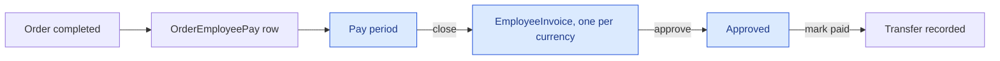

# Pay, periods, invoices and payouts

What a cleaner earns, when it is closed, which document it becomes — and where the platform stops,
because it does not move the money.

## The path

**There is no payout execution path.** The platform issues the document, an admin keys the transfer in
a bank by hand, and `MarkInvoicePaid` records that it happened, with a transfer note. Nothing here talks
to a bank, a PSP payout account or a SEPA file — which is why approval, not payment, is where the
platform does its last checking (below).

**One pay row per assigned employee**, with no crew-size term. That single fact is why there is no
spare seat and why the order seat needs a database-level arbiter — a second cleaner on a one-seat job
is a second full wage against an unchanged customer price.

The formula, and why `extrasPay` is not what it sounds like, is in
[Business rules](/product/business-rules#cleaner-pay). A rate is an amount in a currency, and the pay
writer reads only rates in the order's currency — so every pay row is in the currency of the order that
earned it.

**And the order is in the cleaner's currency, because the board is.** A cleaner is paid in the currency
of the country they work in (owner ruling 2026-09-12), and `OrderVisibility.PayableTo` keeps every
order in another currency off their board, out of their counts, out of their browse and out of their
take — it answers `order.not_found`, like a held order. So under normal operation a cleaner's pay rows
are all in one currency and a period closes into one invoice. The one path across the line is an admin
reassigning a cleaner onto an order (`AdminReassignOrder` is deliberately not gated), which is why the
per-currency invoicing below still exists. → [Business rules](/product/business-rules#cleaner-currency)

## One invoice per employee, per period, per currency {#one-invoice-per-currency}

A pay row is in the currency of its order, and a tax document is in one unit. A cleaner who worked a
CZK job and a EUR job in the same period therefore holds pay in two units, and the close produces **one
payout invoice per currency** — each with its own allocated variable symbol — and sends **one
period-closed e-mail per document**, because the template carries a single attachment. The unique
index is `(EmployeeId, PayPeriodId, CurrencyId)`.

The invoice's currency is **derived from the pay rows it invoices** (`EmployeeInvoice.CreateFromOrderPays`),
never supplied — not from the employee, not from their work country, not from a preference field. That
is also why a mixed-currency period is no longer refused. The old refusal had no admin action that could
resolve it — a EUR job cannot be made a CZK job — so the rows sat un-invoiced forever while the
reconciliation sweep re-enqueued the pair every tick.

The manual admin path (`GenerateInvoice`) does what the auto-close batch does: it groups the employee's
unassigned pay by currency, claims every payout reference **before** staging any invoice, writes one
invoice per group and flushes them together, so a period is invoiced whole or not at all. Its
already-exists guard is per currency too — a late pay row in a currency the period has already invoiced
is refused; one in a currency still open is not.

The reconciliation sweep (ADR-0002 D3.4) matches pay rows against invoices on
`(PayPeriodId, EmployeeId, CurrencyId)`, so a pair whose CZK pay is invoiced and whose EUR pay is not is
still a candidate. The message key stays per pair — `invoice:{payPeriodId}:{employeeId}` — and one
generation invoices every currency the pair still has open.

## Periods are a state machine, and every transition is gated

| Transition | Requires |
|---|---|
| Close | period is `Open` |
| Reopen | period is **not** `Paid` |
| Mark paid | period is `Closed` |
| Delete | period is `Open` |
| Update | period is `Open` |

A paid period cannot be reopened. That is the point of the state: it is the boundary after which the
numbers stop moving.

## Approval is the last point the platform can refuse {#approval-is-the-last-refusal}

An invoice is generated `Pending`, approved by an admin, and marked paid once the transfer has been
keyed (it can also be rejected, disputed or cancelled along the way). The two transitions on the money
path are gated:

| Transition | Requires |
|---|---|
| Approve | invoice is `Pending`, **the cleaner has a usable payout record**, **and that account holds the invoice's currency** — in that order |
| Mark paid | invoice is `Approved`. `Paid` is terminal — a second mark is refused rather than overwriting the first actor's record of a transfer that already left the bank |

**The presence rule** reads the `EmployeePayoutDetails` record itself: it must exist, `Scheme` must be
set and `Status` must be `Provided`, else `payroll.invoice.payout_details_missing`. This is ADR-0034
D7's issuance block, and it sits here rather than at generation where the ADR first put it — the ADR
carries a dated correction banner saying so. Generation would withhold a numbered tax document the
cleaner needs for their own filing, for up to a month; approval withholds only the admin's commitment
to transfer, the document is issued on time, and when the cleaner supplies their details the admin
approves the invoice that already exists. In the shipped tree the three conditions collapse to one,
because the only writer (`UpdateBankDetails`) always stores a scheme and `Provided`; the other two are
checked so the enum cannot quietly grow a state that passes. How a cleaner with pay rows and no record
comes about is narrow — an admin reassignment onto an incomplete cleaner, or GDPR erasure deleting the
record while pay survives — but it is exactly the case where a transfer would be keyed to nowhere.

**The currency rule** runs only once presence has passed (the chain is `Cascade.Stop`, so a missing
record is reported as missing, never as a currency mismatch). It reads `EmployeePayoutDetails
.CurrencyId` — the currency the cleaner declared their account holds — and takes an undeclared account
to hold the currency of the country the cleaner works in (CZ is CZK, SK is EUR, PL is PLN; owner ruling
2026-09-12), resolved through the same work-country chain every partner screen uses and never the
platform default. A mismatch is refused as `payroll.invoice.payout_currency_mismatch`; the cleaner
corrects the declaration (or the account) and the admin approves again. That chain has no fallback for
a named country: a work country the seed left without a real currency makes the approval throw rather
than compare against the platform default — a configuration defect surfaces here as loudly as it does
on the cleaner's own screens. → [Business rules](/product/business-rules#cleaner-currency)

Why here and not earlier or later: generation is too early — it would withhold a numbered tax document
that already carries an allocated payout reference — and Mark paid is too late, because the money has
left. Approval is the admin's commitment to transfer, the transfer is keyed by hand, and so this is the
last moment the platform is still in the loop. The record itself is described in
[Role — EmployeePayoutDetails](/domain/roles/employee-payout-details).

## My Pay shows one currency

The cleaner's period view (`GetPeriodPays`) is denominated in a single currency, and everything on it —
totals and rows — is filtered to that currency. The query takes an optional `currencyId`, the **view**:
when a client names one, that is the currency shown, exactly — a client that opened My Pay from a EUR
invoice must get EUR back, not a fallback to another currency's document, which was the mislabel this
parameter closes. With no view named, the cleaner's resolved currency (the work country's configured
currency — the one the partner dashboard labels with; the platform default only for a cleaner with no
work country) is shown when the period holds an invoice in it or no
invoice at all; when the period is invoiced only in another currency, that invoice's own currency wins,
because the payout document is what the cleaner holds and "My Pay" disagreeing with it was the earlier
defect. Every pay row on the response carries `currencyCode`, and it always equals the summary's. An
unknown `currencyId` is `currency.not_found`. Because the board keeps a cleaner in one currency, a
period with pay in two is reachable only through an admin reassignment; a client that shows one invoice
at a time and passes its currency sees each of them correctly.

So that a client can pass it, `EmployeeInvoiceDto` and `EmployeeInvoiceDetailDto` carry `currencyId`
right after `currencyCode` on every host. Opened from an invoice, My Pay is that invoice's currency view:
both partner apps' invoice detail (Android and iOS) hand `invoice.currencyId` to the period-pay
route, which sends it as `GetPeriodPays`' `currencyId`. The code alone was not enough — the view is keyed by id, and
a client that only had the code would have had to look the id up or fall back to the resolved-currency
rule, which is the mislabel the parameter exists to close.

## Numbering is allocated, never derived

Both the invoice number and the payout variable symbol come from an atomic `ON CONFLICT` counter, and
both carry a unique index. A number is **claimed**, not computed from a row count — a count is not
unique under concurrency, and a duplicate variable symbol is a payment that reconciles against the
wrong invoice.

> The counter is deliberately **global**, not per-tenant, because the unique index behind it is global.
> A tenant-keyed counter under a globally-unique index means two tenants both allocate ordinal 1 and
> the second insert becomes a 500 on the payroll path.

## Payout details never ride an employee DTO

Three routes, three shapes, and a frozen surface test that they are the only DTOs in the feature
allowed to carry a payout identifier:

| Route | Carries |
|---|---|
| the cleaner's own | full identifiers |
| admin list/detail | a masked account only — **there is no unmasked field on the record at all** |
| admin reveal | full identifiers |

The reveal is a **command rather than a query**, precisely so the existing audit engine records it. The
audit trail is the compensating control for storing this in plaintext.

The declared account currency (`CurrencyId`) is not an identifier: it rides the cleaner's own view, the
admin's masked view and the GDPR export, and the reveal does not carry it because the masked view
already does.

## Edge cases

| Case | What happens |
|---|---|
| Close a period twice | Refused — it is no longer `Open`. |
| Reopen a paid period | Refused. |
| A EUR order on a CZ cleaner's board | It is not on their board: not listed, not counted, not browsable, and a take answers `order.not_found`. Only an admin reassignment can put them on it. |
| Pay in two currencies in one period (after an admin reassignment) | Two invoices, two references, two e-mails; the reconciliation sweep re-enqueues a pair while any of its currencies is still un-invoiced. |
| Approve an invoice in a currency the payout account does not hold | Refused — `payroll.invoice.payout_currency_mismatch`. The cleaner updates the declaration, the admin approves again. |
| A cleaner who never declared an account currency | Treated as holding their work country's currency at approval — the normal case; a declaration is only for an account that holds something else. |
| Two invoices allocate a number at once | The `ON CONFLICT` counter serialises them; the unique index is the backstop. |
| A cleaner with no payout destination | Blocked by the profile-completeness gate before they can work. |
| A cleaner with pay rows but no payout record | The invoice is generated and the cleaner gets their document; approval is refused as `payroll.invoice.payout_details_missing` until a record with a scheme and `Provided` exists. Reached by admin reassignment onto an incomplete cleaner or by erasure deleting the record. |
| A cleaner with a legacy `IBAN` but no payout record | Passes the completeness gate (it reads `HasPayoutDetails`, or a non-empty `IBAN` that is not the anonymisation marker), and their invoice is refused at approval by the presence rule above — the `IBAN` mirror is not a record. |
| An anonymised cleaner | Has no payout destination: erasure clears `HasPayoutDetails` and overwrites `IBAN` with the marker, and the gate does not read the marker as a destination — so an erased cleaner is incomplete, not complete-by-accident. |
| My Pay opened from a EUR invoice | A client that passes the invoice's `currencyId` gets the EUR view exactly, whatever the cleaner's resolved currency; one that passes nothing gets the fallback rule above. |
| Bonus or deduction applied later | Re-clamps the same core identically, because the clamp bounds are persisted on the row. |
