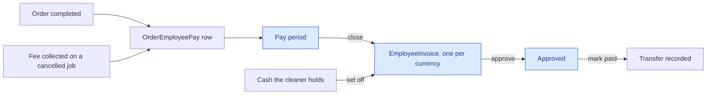

# Pay, periods, invoices and payouts

What a cleaner earns, when it is closed, which document it becomes — and where the platform stops,
because it does not move the money.

## The path

```mermaid
flowchart LR
  A[Order completed] --> B[OrderEmployeePay row]
  X[Fee collected on a cancelled job] --> B
  B --> C[Pay period]
  C -->|close| D[EmployeeInvoice, one per currency]
  L[Cash the cleaner holds] -->|set off| D
  D -->|approve| E[Approved]
  E -->|mark paid| F[Transfer recorded]

  classDef gate fill:#dbeafe,stroke:#1d4ed8,color:#1e3a8a
  class C,D,E gate
```

**There is no payout execution path.** The platform issues the document, an admin keys the transfer —
the invoice's `TransferAmount`, its total less the cash set off against it ([below](#cash-set-off)) — in
a bank by hand, and `MarkInvoicePaid` records that it happened, with a transfer note. Nothing here talks
to a bank, a PSP payout account or a SEPA file — which is why approval, not payment, is where the
platform does its last checking (below).

**One pay row per assigned employee, and each is one seat's share of the job** (owner rulings
2026-09-28). A rate describes the job, so `CalculateOrderPay` divides the job's base, extras and clamp
bounds by its `RequiredEmployees`, clamps the seat, and adds the dirtiness term — the job's clamped pay ×
the rate the order was booked at (`Order.DirtinessRate`), split the same way — after the clamp. Every term's cent residue goes to the first seat,
so a full crew's rows add up to the job; the divisor is the seats the job needs, not the cleaners who
came, so a cleaner who works a two-seat job alone is paid one seat. That is also why there is still no
spare seat and why the order seat needs a database-level arbiter — a cleaner on a seat the job does not
need would be paid a share on top of the whole job's pay, against an unchanged customer price.

The formula, why `extrasPay` is not what it sounds like, why the dirtiness term sits outside the clamp,
and why nothing is paid for distance (`ExpensesPay` is 0 on every new row; older rows keep what they were
calculated with) are in [Business rules](/product/business-rules#cleaner-pay). A rate is an amount in a
currency, and the pay writer reads only rates in the order's currency — so every pay row is in the
currency of the order that earned it.

**A job that did not happen can pay too** (owner ruling 2026-09-28, decision 12). When a late
cancellation or a customer [lockout](/flows/cancellation-refund-dispute#lockout) brings the company a
fee, `CalculateOrderPay` pays each crew member a seat's share of **half of what was collected** — kept
from the card payment, or paid on the cash booking's receivable — and never of a fee still owed, nor more
than the company still holds after refunds. The row is typed `CancellationFeeShare` or `LockoutFeeShare`
(`OrderEmployeePay.LineType`; a completed job's row is `Job`), holds the share as an unclamped base with
no rates read, and is invoiced like any other row, the invoice line saying it is a share of the fee. It
is asked for at the cancel or the lockout confirmation of an order that took a payment, and when the
webhook settles a cash-cancellation or lockout receivable; a cancelled order that collected nothing is
refused with `payroll.no_collected_fee` and writes nothing.
→ [Business rules — the crew's share of a collected fee](/product/business-rules#fee-share)

**And the order is in the cleaner's currency, because the board is.** A cleaner is paid in the currency
of the country they work in (owner ruling 2026-09-12), and `OrderVisibility.PayableTo` keeps every
order in another currency off their board, out of their counts, out of their browse and out of their
take — it answers `order.not_found`, like a held order. So under normal operation a cleaner's pay rows
are all in one currency and a period closes into one invoice. The one path the board does not decide
is an admin reassigning a cleaner onto an order: `AdminReassignOrder` does not read the currency — it
checks that the cleaner works in the order's market (`order.reassign.employee_other_market`) — which
is why the per-currency invoicing below still exists. → [Business rules](/product/business-rules#cleaner-currency)

## One invoice per employee, per period, per currency {#one-invoice-per-currency}

A pay row is in the currency of its order, and a tax document is in one unit. A cleaner who worked a
CZK job and a EUR job in the same period therefore holds pay in two units, and the close produces **one
payout invoice per currency** — each with its own allocated variable symbol — and sends **one
period-closed e-mail per document**, because the template carries a single attachment. The unique
index is `(EmployeeId, PayPeriodId, CurrencyId)`.

The invoice's currency is **derived from the pay rows it invoices** (`EmployeeInvoice.CreateFromOrderPays`),
never supplied — not from the employee, not from their work country, not from a preference field. That
is also why a mixed-currency period is no longer refused. The old refusal had no admin action that could
resolve it — a EUR job cannot be made a CZK job — so the rows sat un-invoiced forever while the
reconciliation sweep re-enqueued the pair every tick.

The manual admin path (`GenerateInvoice`) does what the auto-close batch does: it groups the employee's
unassigned pay by currency, claims every payout reference **before** staging any invoice, writes one
invoice per group and flushes them together, so a period is invoiced whole or not at all. Its
already-exists guard is per currency too — a late pay row in a currency the period has already invoiced
is refused; one in a currency still open is not.

The reconciliation sweep (ADR-0002 D3.4) matches pay rows against invoices on
`(PayPeriodId, EmployeeId, CurrencyId)`, so a pair whose CZK pay is invoiced and whose EUR pay is not is
still a candidate. The message key stays per pair — `invoice:{payPeriodId}:{employeeId}` — and one
generation invoices every currency the pair still has open.

## Cash a cleaner holds is set off against the invoice {#cash-set-off}

A cleaner who took cash at the door holds the company's money, and the company owes them their pay, so
the platform nets the two instead of moving both (owner ruling 2026-09-28, decision 23 (c)). The cash
ledger — collections up; remittances, write-offs and set-offs down — is described in
[Business rules — the company's cash in a cleaner's hands](/product/business-rules#cash-held).

- **At every invoice.** The pay-period close and `GenerateInvoice` each read the cash the cleaner holds
  in the invoice's currency **under a lock on that cleaner's cash in that currency**
  (`ICashLedgerRepository.GetHeldUnderLockAsync`, a Postgres advisory lock held until the flush
  commits — the same one a remittance and a write-off take), and set it off **up to the invoice's
  total**: `EmployeeInvoice.CashSetOffAmount`, and a *Set-off* ledger entry dated at issue.
- **The invoice's amounts do not change.** `SubTotal`, bonus, deduction and `TotalAmount` stay what the
  pay rows make them; **`TransferAmount = TotalAmount − CashSetOffAmount`** is the bank transfer.
  `EmployeeInvoiceDto` and `EmployeeInvoiceDetailDto` carry `cashSetOffAmount` and `transferAmount` on
  every host.
- **The PDF says so.** A payout invoice with a set-off prints a statement below its summary — the
  invoice total, the cash set off, the transfer, and that the invoice amount is unchanged and cash still
  held is carried forward — in the **cleaner's** language (en, cs, sk, uk, ru), while the invoice itself
  stays in its jurisdiction's; a re-render reads the same language.
- **What the invoice could not cover is carried forward** — it stays in the ledger, and after
  `cash.remittance_request_days` (30 by default) past the first close that carried it, the cleaner is
  e-mailed a request to hand it over.
- **Given back when the invoice shrinks.** Cancelling an invoice enters its whole set-off back, since a
  cancelled invoice transfers nothing; lowering an invoice's total below its set-off
  (`UpdateInvoiceAmounts`) releases the difference and enters it back, so `TransferAmount` never goes
  negative and the cleaner's balance, the remittance request, the float cap and the archive all read
  the cash the cleaner really holds.
- **The archive carries it.** The company bundle writes `books/cash-ledger-entries.jsonl` (without the
  notes, which are free text) and the invoice row's `cashSetOffAmount`.

The partner web, Android and iOS show *cash I hold* per currency beside the pay (with the company's
float cap, and whether cash jobs are hidden above it). **No invoice screen shows the set-off or the
transfer yet** — not the partner web, Android or iOS, and not the admin invoice the transfer is keyed
from; the two figures are on the wire and on the PDF the cleaner is e-mailed.

## Periods are a state machine, and every transition is gated

| Transition | Requires |
|---|---|
| Close | period is `Open` |
| Reopen | period is **not** `Paid` |
| Mark paid | period is `Closed` |
| Delete | period is `Open` |
| Update | period is `Open` |

A paid period cannot be reopened. That is the point of the state: it is the boundary after which the
numbers stop moving.

## Approval is the last point the platform can refuse {#approval-is-the-last-refusal}

An invoice is generated `Pending`, approved by an admin, and marked paid once the transfer has been
keyed (it can also be rejected, disputed or cancelled along the way). The two transitions on the money
path are gated:

| Transition | Requires |
|---|---|
| Approve | invoice is `Pending`, **the cleaner has a usable payout record**, **and that account holds the invoice's currency** — in that order |
| Mark paid | invoice is `Approved`. `Paid` is terminal — a second mark is refused rather than overwriting the first actor's record of a transfer that already left the bank |

**The presence rule** reads the `EmployeePayoutDetails` record itself: it must exist, `Scheme` must be
set and `Status` must be `Provided`, else `payroll.invoice.payout_details_missing`. This is ADR-0034
D7's issuance block, and it sits here rather than at generation where the ADR first put it — the ADR
carries a dated correction banner saying so. Generation would withhold a numbered tax document the
cleaner needs for their own filing, for up to a month; approval withholds only the admin's commitment
to transfer, the document is issued on time, and when the cleaner supplies their details the admin
approves the invoice that already exists. In the shipped tree the three conditions collapse to one,
because the only writer (`UpdateBankDetails`) always stores a scheme and `Provided`; the other two are
checked so the enum cannot quietly grow a state that passes. How a cleaner with pay rows and no record
comes about is narrow — an admin reassignment onto an incomplete cleaner, or GDPR erasure deleting the
record while pay survives — but it is exactly the case where a transfer would be keyed to nowhere.

**The currency rule** runs only once presence has passed (the chain is `Cascade.Stop`, so a missing
record is reported as missing, never as a currency mismatch). It reads `EmployeePayoutDetails
.CurrencyId` — the currency the cleaner declared their account holds — and takes an undeclared account
to hold the currency of the country the cleaner works in (CZ is CZK, SK is EUR, PL is PLN; owner ruling
2026-09-12), resolved through the same work-country chain every partner screen uses and never the
platform default. A mismatch is refused as `payroll.invoice.payout_currency_mismatch`; the cleaner
corrects the declaration (or the account) and the admin approves again. That chain has no fallback for
a named country: a work country the seed left without a real currency makes the approval throw rather
than compare against the platform default — a configuration defect surfaces here as loudly as it does
on the cleaner's own screens. → [Business rules](/product/business-rules#cleaner-currency)

Why here and not earlier or later: generation is too early — it would withhold a numbered tax document
that already carries an allocated payout reference — and Mark paid is too late, because the money has
left. Approval is the admin's commitment to transfer, the transfer is keyed by hand, and so this is the
last moment the platform is still in the loop. The record itself is described in
[Role — EmployeePayoutDetails](/domain/roles/employee-payout-details).

## My Pay shows one currency

The cleaner's period view (`GetPeriodPays`) is denominated in a single currency, and everything on it —
totals and rows — is filtered to that currency. The query takes an optional `currencyId`, the **view**:
when a client names one, that is the currency shown, exactly — a client that opened My Pay from a EUR
invoice must get EUR back, not a fallback to another currency's document, which was the mislabel this
parameter closes. With no view named, the cleaner's resolved currency (the work country's configured
currency — the one the partner dashboard labels with; the platform default only for a cleaner with no
work country) is shown when the period holds an invoice in it or no
invoice at all; when the period is invoiced only in another currency, that invoice's own currency wins,
because the payout document is what the cleaner holds and "My Pay" disagreeing with it was the earlier
defect. Every pay row on the response carries `currencyCode`, and it always equals the summary's. An
unknown `currencyId` is `currency.not_found`. Because the board keeps a cleaner in one currency, a
period with pay in two is reachable only through an admin reassignment; a client that shows one invoice
at a time and passes its currency sees each of them correctly.

So that a client can pass it, `EmployeeInvoiceDto` and `EmployeeInvoiceDetailDto` carry `currencyId`
right after `currencyCode` on every host. Opened from an invoice, My Pay is that invoice's currency view:
both partner apps' invoice detail (Android and iOS) hand `invoice.currencyId` to the period-pay
route, which sends it as `GetPeriodPays`' `currencyId`. The code alone was not enough — the view is keyed by id, and
a client that only had the code would have had to look the id up or fall back to the resolved-currency
rule, which is the mislabel the parameter exists to close.

**The switch comes from the period's pay rows, not its invoices** (owner ruling 2026-09-19: the
switch should exist *"for any period holding pays in more than one currency"*). The summary carries
`availableCurrencies` — the view currency first, then every other distinct currency among the
cleaner's pay rows in that period, ordered by code — computed from the rows the handler had already
loaded before it filtered to the view, so it costs no extra query. The partner web shows the currency
switch when there is more than one entry and makes one call per period load; until 2026-09-19 it
derived the switch from the period's invoices, which meant an open (uninvoiced) period with CZK and EUR
pay showed no switch and the EUR rows were unreachable, while a **cancelled** invoice's currency was
offered with no live pay row in it. A pay row is the fact; an invoice is a document over rows, absent
on an open period and present-but-cancelled after a cancel. The view is always first so the switch
always contains the value it shows — a deep link naming a currency the period has no rows in (`EUR`
against CZK-only rows) answers `[EUR, CZK]` with an empty row list rather than a select with no
selected option. The member is additive and nullable; the mobile apps ignore it until a mobile ticket
reads it.

**The dirtiness term is its own figure.** Each pay row carries `dirtinessPay` beside `basePay` and
`extrasPay`, and the period summary totals it as `totalDirtinessPay`, in the view's currency like every
other total. The partner web's period view and its invoice lines, and My Pay on Android and iOS, show it
in the pay breakdown — the partner web only when it is not zero. The company archive's pay row keeps it
beside the other terms, so an archived row on an *Increased* or *Heavy* job reproduces its `TotalPay`
from its own columns.

**What the board promised is one seat.** The pay a cleaner sees before taking a job — the board card,
the job detail, the dashboard estimate and the available-jobs preview — is `OrderPayEstimator`'s
per-seat figure, raised by the level, the same share `CalculateOrderPay` writes for every seat but the
first (which also takes the residue cents). The partner web labels it *per spot*.

## Numbering is allocated, never derived

Both the invoice number and the payout variable symbol come from an atomic `ON CONFLICT` counter, and
both carry a unique index. A number is **claimed**, not computed from a row count — a count is not
unique under concurrency, and a duplicate variable symbol is a payment that reconciles against the
wrong invoice.

> The counter is deliberately **global**, not per-tenant, because the unique index behind it is global.
> A tenant-keyed counter under a globally-unique index means two tenants both allocate ordinal 1 and
> the second insert becomes a 500 on the payroll path.

## Payout details never ride an employee DTO

Three routes, three shapes, and a frozen surface test that they are the only DTOs in the feature
allowed to carry a payout identifier:

| Route | Carries |
|---|---|
| the cleaner's own | full identifiers |
| admin list/detail | a masked account only — **there is no unmasked field on the record at all** |
| admin reveal | full identifiers |

The reveal is a **command rather than a query**, precisely so the existing audit engine records it. The
audit trail is the compensating control for storing this in plaintext.

The declared account currency (`CurrencyId`) is not an identifier: it rides the cleaner's own view, the
admin's masked view and the GDPR export, and the reveal does not carry it because the masked view
already does.

## Edge cases

| Case | What happens |
|---|---|
| Close a period twice | Refused — it is no longer `Open`. |
| Reopen a paid period | Refused. |
| A EUR order on a CZ cleaner's board | It is not on their board: not listed, not counted, not browsable, and a take answers `order.not_found`. Only an admin reassignment can put them on it. |
| Pay in two currencies in one period (after an admin reassignment) | Two invoices, two references, two e-mails; the reconciliation sweep re-enqueues a pair while any of its currencies is still un-invoiced. |
| Approve an invoice in a currency the payout account does not hold | Refused — `payroll.invoice.payout_currency_mismatch`. The cleaner updates the declaration, the admin approves again. |
| A cleaner who never declared an account currency | Treated as holding their work country's currency at approval — the normal case; a declaration is only for an account that holds something else. |
| Two invoices allocate a number at once | The `ON CONFLICT` counter serialises them; the unique index is the backstop. |
| A cleaner with no payout destination | Blocked by the profile-completeness gate before they can work. |
| A cleaner with pay rows but no payout record | The invoice is generated and the cleaner gets their document; approval is refused as `payroll.invoice.payout_details_missing` until a record with a scheme and `Provided` exists. Reached by admin reassignment onto an incomplete cleaner or by erasure deleting the record. |
| A cleaner with a legacy `IBAN` but no payout record | Passes the completeness gate (it reads `HasPayoutDetails`, or a non-empty `IBAN` that is not the anonymisation marker), and their invoice is refused at approval by the presence rule above — the `IBAN` mirror is not a record. |
| An anonymised cleaner | Has no payout destination: erasure clears `HasPayoutDetails` and overwrites `IBAN` with the marker, and the gate does not read the marker as a destination — so an erased cleaner is incomplete, not complete-by-accident. |
| My Pay opened from a EUR invoice | A client that passes the invoice's `currencyId` gets the EUR view exactly, whatever the cleaner's resolved currency; one that passes nothing gets the fallback rule above. |
| An open period with CZK and EUR pay rows | The summary lists both; the partner web shows the switch before any invoice exists. |
| A period whose only second currency is a cancelled invoice's | Not offered — the switch follows pay rows, and a cancelled invoice has no live row in that currency. |
| Bonus or deduction applied later | Re-clamps the same core identically, because the clamp bounds are persisted on the row, and adds the dirtiness term back outside the clamp. |
| A two-seat job | Each cleaner's row is half the job's base, extras and bounds, clamped, plus half the job's dirtiness term; the first seat also takes the residue cents, so the two rows add up to the job. |
| A two-seat job worked by one cleaner | That cleaner is paid one seat — the divisor is the seats the job needs — plus the residue, since they hold the lowest seat on the crew. |
| A *Heavy* job whose rates hit their maximum | The seat is capped, then the dirtiness term (30 % of the job's capped pay, split per seat) is added on top; the cap never swallows it. |
| A dispute finds the cleaner at fault | The administrator's resolution may charge that cleaner's pay row on the order (`chargeToCleaner`): the deduction is linked to the dispute (`DeductionDisputeId`) and carries a reason (`DeductionReason`) that My Pay on the partner web, Android and iOS shows beside the deduction. Refused when the row is missing, already invoiced, already charged or smaller than the charge. A refund alone never touches pay. → [Business rules](/product/business-rules#dispute-cleaner-charge) |
| A cleaner holds 1 200 in cash and their invoice totals 900 | 900 is set off, the transfer is 0, the invoice total stays 900, and 300 is carried forward in the ledger. |
| A cleaner holds 300 in cash and their invoice totals 900 | 300 is set off and the transfer is 600. |
| A remittance and an invoice's set-off take the same cash at once | The per-cleaner, per-currency lock serialises them; the second reads the balance the first left and is refused, or sets off only what is left. |
| An invoice that set cash off is cancelled | The whole set-off goes back into the ledger. |
| A late cancellation of a paid card order | Each crew member gets a `CancellationFeeShare` row: a seat's share of half the fee the company still holds. |
| A lockout on a cash booking whose receivable is still open | No pay row; the crew is paid when the receivable is paid, and nothing if it is written off. |
| An administrator writes a cleaner's rates from a template | Standard 0.5, experienced 0.6 or expert 0.7 of each list price — every template leaves a margin, and like every rate it describes the job, so each seat of a two-seat job earns half; the old junior/medior/senior ranks are refused. → [Business rules — per-employee rates](/product/business-rules#per-employee-rates) |
