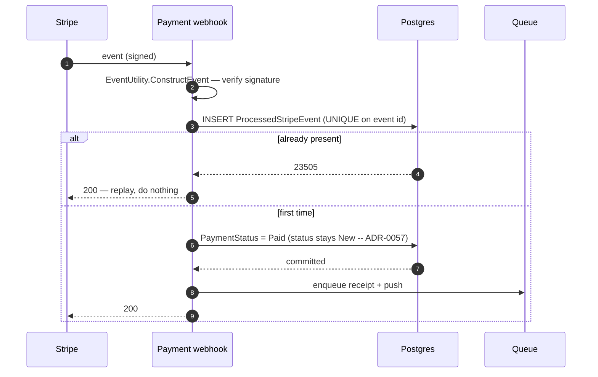

# Payment and fiscal

Money arrives and is recorded on the payment axis — the order stays `New` until a cleaner takes it —
and a receipt is issued: at booking for cash, on settlement for card. Almost all of the difficulty is
in making a webhook that can arrive twice, late, or out of order behave as though it arrived once.

## The path

## The four things that make it safe

- **The signature is the authentication.** The endpoint is anonymous because Stripe is; the signature
  check is what stands in for a credential.
- **Replay is a no-op.** A `UNIQUE` index on the Stripe event id turns a redelivery into a rejected
  insert rather than a second state change.
- **Effects are enqueued only *after* the stamp and the state change commit.** On a commit failure the
  guard is never reached and nothing is dispatched — so a Stripe retry cannot produce a second receipt
  and a second push.
- **A cash-settled order escalates instead of being waved through.** `SettledInCash` is checked
  **before** the terminal-state short-circuit, so a customer who paid cash and then paid by card
  produces a double-settlement escalation rather than a benign-looking duplicate.

## Edge cases

| Case | What happens |
|---|---|
| The same event delivered twice | Second insert violates the unique index; no second effect. |
| Two redeliveries in parallel | One wins the insert, the other gets `23505` and acks. |
| Order already `Paid` or `Refunded` | Short-circuit — but only *after* the cash check. |
| Event for an order that no longer exists | Logged and ignored. |
| Payment fails | Status is left alone so the client can retry. The company's administrators are told of the **first** decline on an order and not of every fumbled card entry: the site reads the feed before raising `admin.payment.failed`, and a decline that lands after the money did, or after the order was cancelled, is news about nothing. |
| Chargeback | The order is found by its stored payment intent (a mobile or recurring-occurrence payment). The chargeback is reflected onto the linked dispute rather than the order's payment status, and the administrators are told (`admin.dispute.chargeback`, the reversed amount and the dispute it landed on). |
| Chargeback on a web card booking, guest or account | The order is not found: a Checkout Session order stores no payment intent. The webhook logs it and acknowledges, so Stripe does not retry. Nothing is recorded and nobody is told. → [Cancellation, refund and dispute](/flows/cancellation-refund-dispute#dispute) |
| Card order paid | `admin.order.new` to the company's administrators — the order became offerable on this write, never at creation; a redelivery never reaches the site. |

## Amounts are never reconciled, and do not need to be

The webhook does not compare what Stripe charged against the order total. It does not have to: the
charge was created from the persisted server-side `order.TotalPrice`, so there is no client-supplied
number anywhere in the chain to disagree with.

## No guessed unit, no guessed regime

A receipt is a statement about a sale, and a fiscal registration is a declaration to a tax authority,
so neither is allowed to fill in what the order did not carry.

**The currency.** Every amount is rendered in the order's own `Currency` row. When that navigation was
not loaded — a loader omission, not a CZK order — the order e-mails (`EmailService`) and the customer
receipt PDF (`ReceiptService`) print the **bare number with no unit** (`order.Currency?.Symbol ??
string.Empty`); nothing substitutes "Kč". The fiscal request goes further and **refuses**:
`FiscalCurrencyCodeOf` throws when the order has no resolved currency, so the request is never built and
the receipt is never registered in a default currency.

**The regime.** The receipt's country is `Order.CustomerAddress.CountryId`, and it decides the
enforcement mode, the provider and the receipt-number counter's issuer scope. The provider is chosen by
ISO 3166-1 **alpha-2** code — each `IFiscalService` declares one (`CZ` for the Czech one) — while
`Country.IsoCode` is stored alpha-3 (`CZE`), so `ReceiptService` translates the stored code through
`CountryIsoCode.ToAlpha2` before it asks the resolver or picks the counter's scope, and the request
carries the alpha-2 as well. A stored code with no alpha-2 counts as unresolved — the case below. With
no country at all the mode is `None` and there is nothing to register. Under any other mode, an order
whose country row or ISO code cannot be resolved is refused on the same landing as a missing currency —
`FiscalCountryCodeOf` throws — never declared to the Czech authority by default. The counter follows
suit: with no ISO code there is no provider key, and `FiscalSequenceScope.Resolve` maps the empty key
to the `DEFAULT` issuer scope (which does not reset annually), not to `cz-eet2`.

**Both refusals land in the same place.** They throw inside `HandleFiscalAsync`'s try, which marks the
receipt `FiscalRegistrationFailed` with `FiscalErrorKind.Unknown` and the exception message, and logs at
error level. The customer flow is not aborted, the receipt PDF is still generated (with a bare number if
the currency was the gap), and the retry job (`RetryFiscalRegistrationAsync`) sees the row like any
other failed registration — and refuses again, identically, until the order is loaded with what it
needs. The cleaner's invoice PDF applies the same rule on its side: no resolved
`EmployeeInvoice.Currency`, no render, `PdfGenerationError` recorded.
→ [Fiscal compliance](/architecture/fiscal-compliance) ·
[Where CZK is hardcoded](/architecture/platform-expandability#_5-where-czk-kc-is-hardcoded-vs-configurable)

## What the receipt says {#what-the-receipt-says}

An order gets one receipt, under a number from its operator's gapless counter: at booking for a cash
sale, when the customer confirms a recurring cash occurrence, and when the payment settles for a card
one. Completion issues one only to an order that still has none and has earned one: a cash booking,
or a card booking the cleaner settled in cash. An unpaid card order gets no receipt. The
`FiscalReconciliation` timer re-sends the issue for an eligible order whose receipt never landed. The
PDF is stored and the customer's download serves that stored copy.

**Its lines add up to its total.** First the catalogue lines at their snapshot prices — each service,
each package (marked *package*), each extra. Then the express surcharge as a line of its own. Then each
discount that came off — loyalty tier, Cleansia Plus, promo code — as a negative line. Together they
equal the total to the cent. The surcharge is stored on the order (`Order.ExpressSurchargeAmount`, zero
when none applied) rather than derived from a gap, and every discount is stored in cents with the
rounding residue on the largest source, so there is no gap to hide. How the figures are computed →
[Business rules — the express-surcharge correction](/product/business-rules#discount-express-correction).

**Its VAT posture is the sale's.** The order froze it at creation (`AppliedVatRate`, null when no VAT
applied), and the receipt reads the order, never the live company row. A sale that charged VAT prints
the subtotal without VAT, the VAT at its rate and the total, and the issuer block carries the company's
VAT number. A sale that charged none prints the total, the statutory non-payer notice (*„Nejsme plátci
DPH"* in Czech) and **no** VAT-number line, even when the company row holds a number: the two
statements contradict each other. A VAT sale whose company row holds no number prints neither.

**It is in the customer's language.** Every label comes from the document's language: headings, line
captions, the payment status and the payment method. Status and method print as words, never as enum
names. Amounts are written the way that language writes numbers ("2 000,00 Kč",
"Kč2,000.00"). Catalogue names come from the entry's translation in that language, then English. Label
sets exist for English, Czech, Slovak, Ukrainian and Russian; any other code prints English. What the
company row holds — name, tagline, address — prints as stored. The language is chosen **once, at
issue**:

1. the language the booking was made in (`Order.LanguageCode`),
2. else the account's preferred language (a recurring occurrence has no booking request of its own),
3. else whatever the producer passed.

The receipt row records the choice, and every later render — a fiscal retry, a restate — reuses it.
→ [The order records its language](/flows/booking-and-pricing#booking-language)

### A cash receipt is restated as paid {#cash-receipt-restated}

A cash sale's receipt is issued at booking, before any money moves, so it says *awaiting payment*.
When the assigned cleaner records the collection (`MarkCashCollected`) on an order that already has its
receipt, the same commit stages a **restate**. The receipt is rendered again from the order as it now
stands — *paid*, by the tender actually taken — over the **same number, issue date, language and
stored PDF**. A restate allocates no number, registers nothing with a fiscal authority and sends no
e-mail, so a redelivery only restates it again.

It rides the receipt queue under a key of its own, `receipt-reissue:{orderId}`, one per order, so it
cannot dedup against the issue's `receipt:{orderId}`. [ADR-0002](/decisions/adr-0002) declares that
queue's key table frozen, and whether this second formula belongs in it is an **open owner question**
— the ADR is not amended.

A signed-in customer who downloads the receipt gets the restated copy. Nothing sends it, though: the
copy already in the customer's inbox, and the only copy a guest has (a guest has no receipt download),
still say *awaiting payment*.

## The stale-checkout sweep

Card orders that never got their webhook are retracted after 15 minutes. The match is on the **money**
axis only — `PaymentStatus == Pending && PaymentType == Card && RecurringTemplateId == null` — with no
status term at all, which is the clearest illustration of why the [two axes](/domain/order-lifecycle)
matter: there is no fulfilment status that identifies this population.
