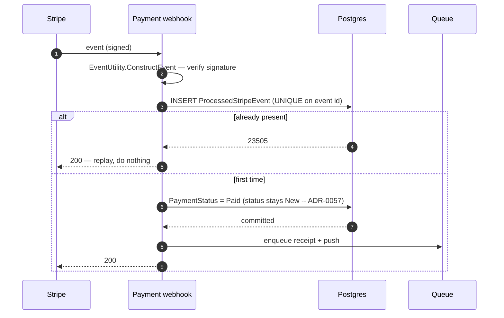

# Payment and fiscal

Money arrives, the order is confirmed, and a receipt is generated. Almost all of the difficulty is in
making a webhook that can arrive twice, late, or out of order behave as though it arrived once.

## The path

## The four things that make it safe

- **The signature is the authentication.** The endpoint is anonymous because Stripe is; the signature
  check is what stands in for a credential.
- **Replay is a no-op.** A `UNIQUE` index on the Stripe event id turns a redelivery into a rejected
  insert rather than a second state change.
- **Effects are enqueued only *after* the stamp and the state change commit.** On a commit failure the
  guard is never reached and nothing is dispatched — so a Stripe retry cannot produce a second receipt
  and a second push.
- **A cash-settled order escalates instead of being waved through.** `SettledInCash` is checked
  **before** the terminal-state short-circuit, so a customer who paid cash and then paid by card
  produces a double-settlement escalation rather than a benign-looking duplicate.

## Edge cases

| Case | What happens |
|---|---|
| The same event delivered twice | Second insert violates the unique index; no second effect. |
| Two redeliveries in parallel | One wins the insert, the other gets `23505` and acks. |
| Order already `Paid` or `Refunded` | Short-circuit — but only *after* the cash check. |
| Event for an order that no longer exists | Logged and ignored. |
| Payment fails | Status is left alone so the client can retry. The company's administrators are told of the **first** decline on an order and not of every fumbled card entry: the site reads the feed before raising `admin.payment.failed`, and a decline that lands after the money did, or after the order was cancelled, is news about nothing. |
| Chargeback | Reflected onto the linked dispute rather than the order's payment status; the administrators are told (`admin.dispute.chargeback`, the reversed amount and the dispute it landed on). |
| Card order paid | `admin.order.new` to the company's administrators — the order became offerable on this write, never at creation; a redelivery never reaches the site. |

## Amounts are never reconciled, and do not need to be

The webhook does not compare what Stripe charged against the order total. It does not have to: the
charge was created from the persisted server-side `order.TotalPrice`, so there is no client-supplied
number anywhere in the chain to disagree with.

## No guessed unit, no guessed regime

A receipt is a statement about a sale, and a fiscal registration is a declaration to a tax authority,
so neither is allowed to fill in what the order did not carry.

**The currency.** Every amount is rendered in the order's own `Currency` row. When that navigation was
not loaded — a loader omission, not a CZK order — the order e-mails (`EmailService`) and the customer
receipt PDF (`ReceiptService`) print the **bare number with no unit** (`order.Currency?.Symbol ??
string.Empty`); nothing substitutes "Kč". The fiscal request goes further and **refuses**:
`FiscalCurrencyCodeOf` throws when the order has no resolved currency, so the request is never built and
the receipt is never registered in a default currency.

**The regime.** The receipt's country is `Order.CustomerAddress.CountryId`, and it decides the
enforcement mode, the provider and the receipt-number counter's issuer scope. With no country at all
the mode is `None` and there is nothing to register. Under any other mode, an order whose country row
or ISO code cannot be resolved is refused on the same landing as a missing currency —
`FiscalCountryCodeOf` throws — never declared to the Czech authority by default. The counter follows
suit: with no ISO code there is no provider key, and `FiscalSequenceScope.Resolve` maps the empty key
to the `DEFAULT` issuer scope (which does not reset annually), not to `cz-eet2`.

**Both refusals land in the same place.** They throw inside `HandleFiscalAsync`'s try, which marks the
receipt `FiscalRegistrationFailed` with `FiscalErrorKind.Unknown` and the exception message, and logs at
error level. The customer flow is not aborted, the receipt PDF is still generated (with a bare number if
the currency was the gap), and the retry job (`RetryFiscalRegistrationAsync`) sees the row like any
other failed registration — and refuses again, identically, until the order is loaded with what it
needs. The cleaner's invoice PDF applies the same rule on its side: no resolved
`EmployeeInvoice.Currency`, no render, `PdfGenerationError` recorded.
→ [Fiscal compliance](/architecture/fiscal-compliance) ·
[Where CZK is hardcoded](/architecture/platform-expandability#_5-where-czk-kc-is-hardcoded-vs-configurable)

## The stale-checkout sweep

Card orders that never got their webhook are retracted after 15 minutes. The match is on the **money**
axis only — `PaymentStatus == Pending && PaymentType == Card && RecurringTemplateId == null` — with no
status term at all, which is the clearest illustration of why the [two axes](/domain/order-lifecycle)
matter: there is no fulfilment status that identifies this population.
