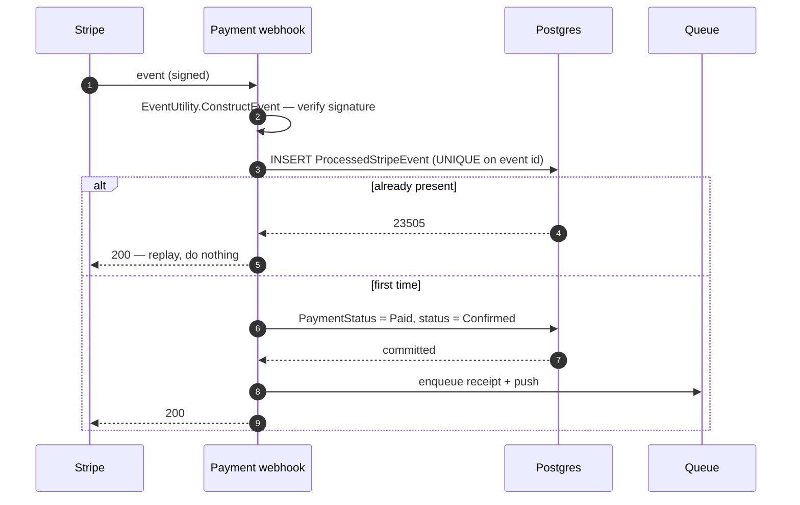

# Payment and fiscal

Money arrives, the order is confirmed, and a receipt is generated. Almost all of the difficulty is in
making a webhook that can arrive twice, late, or out of order behave as though it arrived once.

## The path

## The four things that make it safe

- **The signature is the authentication.** The endpoint is anonymous because Stripe is; the signature
  check is what stands in for a credential.
- **Replay is a no-op.** A `UNIQUE` index on the Stripe event id turns a redelivery into a rejected
  insert rather than a second state change.
- **Effects are enqueued only *after* the stamp and the state change commit.** On a commit failure the
  guard is never reached and nothing is dispatched — so a Stripe retry cannot produce a second receipt
  and a second push.
- **A cash-settled order escalates instead of being waved through.** `SettledInCash` is checked
  **before** the terminal-state short-circuit, so a customer who paid cash and then paid by card
  produces a double-settlement escalation rather than a benign-looking duplicate.

## Edge cases

| Case | What happens |
|---|---|
| The same event delivered twice | Second insert violates the unique index; no second effect. |
| Two redeliveries in parallel | One wins the insert, the other gets `23505` and acks. |
| Order already `Paid` or `Refunded` | Short-circuit — but only *after* the cash check. |
| Event for an order that no longer exists | Logged and ignored. |
| Payment fails | Status is left alone so the client can retry. |
| Chargeback | Reflected onto the linked dispute rather than the order's payment status. |

## Amounts are never reconciled, and do not need to be

The webhook does not compare what Stripe charged against the order total. It does not have to: the
charge was created from the persisted server-side `order.TotalPrice`, so there is no client-supplied
number anywhere in the chain to disagree with.

## The stale-checkout sweep

Card orders that never got their webhook are retracted after 15 minutes. The match is on the **money**
axis only — `PaymentStatus == Pending && PaymentType == Card && RecurringTemplateId == null` — with no
status term at all, which is the clearest illustration of why the [two axes](/domain/order-lifecycle)
matter: there is no fulfilment status that identifies this population.
