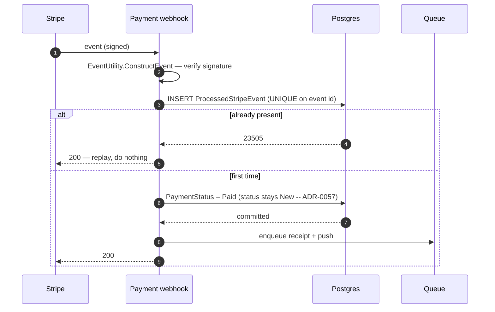

# Payment and fiscal

Money arrives and is recorded on the payment axis — the order stays `New` until a cleaner takes it —
and a receipt is issued once money has been received: on settlement for card, at completion for cash,
after the cleaner has recorded the handover. The same webhook also lands a card a customer saves as the
guarantee for cash, and settles what a customer owes after the booking, which earns a receipt of its
own. Almost all of the difficulty is
in making a webhook that can arrive twice, late, or out of order behave as though it arrived once.

## The path

```mermaid
sequenceDiagram
  autonumber
  participant S as Stripe
  participant W as Payment webhook
  participant DB as Postgres
  participant Q as Queue

  S->>W: event (signed)
  W->>W: EventUtility.ConstructEvent — verify signature
  W->>DB: INSERT ProcessedStripeEvent (UNIQUE on event id)
  alt already present
    DB-->>W: 23505
    W-->>S: 200 — replay, do nothing
  else first time
    W->>DB: PaymentStatus = Paid (status stays New -- ADR-0057)
    DB-->>W: committed
    W->>Q: enqueue receipt + push
    W-->>S: 200
  end
```

## The four things that make it safe

- **The signature is the authentication.** The endpoint is anonymous because Stripe is; the signature
  check is what stands in for a credential.
- **Replay is a no-op.** A `UNIQUE` index on the Stripe event id turns a redelivery into a rejected
  insert rather than a second state change.
- **Effects are enqueued only *after* the stamp and the state change commit.** On a commit failure the
  guard is never reached and nothing is dispatched — so a Stripe retry cannot produce a second receipt
  and a second push.
- **A cash-settled order escalates instead of being waved through.** `SettledInCash` is checked
  **before** the terminal-state short-circuit, so a customer who paid cash and then paid by card
  produces a double-settlement escalation rather than a benign-looking duplicate.

## Edge cases

| Case | What happens |
|---|---|
| The same event delivered twice | Second insert violates the unique index; no second effect. |
| Two redeliveries in parallel | One wins the insert, the other gets `23505` and acks. |
| Order already `Paid` or `Refunded` | Short-circuit — but only *after* the cash check. |
| Event for an order that no longer exists | Logged and ignored. |
| Payment fails | Status is left alone so the client can retry. The company's administrators are told of the **first** decline on an order and not of every fumbled card entry: the site reads the feed before raising `admin.payment.failed`, and a decline that lands after the money did, or after the order was cancelled, is news about nothing. |
| Chargeback | The order is found by its stored payment intent — every card order stores one: a mobile or recurring-occurrence payment when the intent is created, a web Checkout Session on `checkout.session.completed`. The chargeback is reflected onto the linked dispute rather than the order's payment status, and the administrators are told (`admin.dispute.chargeback`, the reversed amount and the dispute it landed on). |
| Chargeback on a web order paid before its intent was recorded | No order carries the intent, so the webhook asks Stripe for the Checkout Session behind it and reads the order id from the session's metadata. The order gets the intent then, and the dispute is written as above. |
| Chargeback that matches no order | Nothing is recorded, and the webhook acknowledges so Stripe does not retry. The administrators of **every** company are told (`admin.dispute.chargeback_unmatched`, the amount and the Stripe dispute id), because the Stripe account is shared. Only `charge.dispute.created` alerts; an update or close for an unknown dispute is logged and ignored. → [Cancellation, refund and dispute](/flows/cancellation-refund-dispute#dispute) |
| Card order paid | `admin.order.new` to the company's administrators — the order became offerable on this write, never at creation; a redelivery never reaches the site. |
| Card payment settles after the order was cancelled | The order is **not** marked `Paid`: the customer paid for a clean that will not happen, so the webhook escalates a dispute for a refund (the customer's open one, or a new one), as it does for a card payment that lands on an order already settled in cash. |
| Checkout expired or payment cancelled (`checkout.session.expired`, `payment_intent.canceled`) | An order not yet cancelled is cancelled through `Order.Cancel` — by the system, `order.cancelled.payment_not_completed`, no fee, no refund — and a guest is e-mailed, with the old links revoked and a fresh one minted. |
| A recurring occurrence's Checkout Session expires | Nothing is cancelled: the session is released and the occurrence stays confirmable until the stale-occurrence sweep's cut-off. |
| A saved card's capture reported twice (setup intent and setup-mode session) | The first lands the card; the second changes nothing. |
| A receivable paid through its pay link | Paid under the receivable's company; the fee receipt is asked for; the order is untouched. |
| A receivable paid twice — the pay link and a charge, or two links | The second payment is refunded in full; a redelivery replays the same refund. |
| A written-off receivable paid anyway | It is paid — the money is the company's — and earns its fee receipt. |

## A saved card and a paid fee arrive by the same webhook {#saved-cards-and-receivables}

Two kinds of money event are not an order's sale (owner rulings 2026-09-28, decisions 16–18). Both
pass the same signature check and event-id stamp.

| Event | What happens |
|---|---|
| `setup_intent.succeeded`, or `checkout.session.completed` of a setup-mode session | The saved card lands: brand, last four and expiry are read from Stripe onto the `SavedCards` row the capture started, and the customer's earlier card in that currency is retired. A second event for the same capture — a web capture raises both — changes nothing; one naming no saved card, or one already captured or removed, is ignored. → [Business rules — a saved card guarantees cash](/product/business-rules#card-guarantee) |
| `checkout.session.completed` of a receivable's pay link | The receivable is paid, under its own company. The session names the receivable (`ReceivableId`) and **never an `OrderId`**, so the order path cannot mistake the fee for the booking's sale; the order's payment status, charge surface and refunds are untouched. |
| `payment_intent.succeeded` of an off-session charge | The same, for a charge on the saved card. |
| A payment for a receivable already paid by another PaymentIntent | Refunded in full on that PaymentIntent under `refund:receivable:{id}:{paymentIntent}`, so a redelivery replays the same refund. |
| `payment_intent.payment_failed` of an off-session charge — a decline, or the bank's `authentication_required` | A pay link is opened, recorded on the receivable and e-mailed to the customer (five locales). None for a receivable no longer open, and none while card payments are switched off. |

A paid receivable asks for its [fee receipt](#fee-receipt) and, when it is a cancellation or lockout
fee, for the crew's share of it → [Business rules — what a customer owes](/product/business-rules#receivables).

**The off-session charges stay switched off.** Only the customer's own pay link moves money on a
receivable today: `ChargeOpenReceivables` (every 15 minutes) does nothing unless
`Payments:OffSessionChargesEnabled` is true, and it stays false until the phase-4 terms carry the
lawyer's consent wording. The failure branch above is dormant until then. When it is on, the charge is
a PaymentIntent with `off_session` and `confirm` on the saved card, keyed on the receivable and its
attempt; the sweep closes a pay link the customer holds before it charges, and does not charge one
they have already paid through it.

**The pay link is one per receivable at a time.** `CreateReceivablePayLink` hands back the session
recorded on the receivable while Stripe reports it open and unexpired, and otherwise opens a new one
keyed `receivable-checkout-{id}-after-{previous session}` — a key reused for a day would replay an
expired session. It returns to the order's page on the customer web, from `Stripe:SuccessUrlBase` —
the customer app's origin on each of the three hosts that mint one: Customer, Customer Mobile, and
Partner, which serves the webhook and so mints the failed-charge e-mail's link.

## Amounts are never reconciled, and do not need to be

The webhook does not compare what Stripe charged against the order total. It does not have to: the
charge was created from the persisted server-side `order.TotalPrice`, so there is no client-supplied
number anywhere in the chain to disagree with.

## No guessed unit, no guessed regime

A receipt is a statement about a sale, and a fiscal registration is a declaration to a tax authority,
so neither is allowed to fill in what the order did not carry.

**The currency.** Every amount is rendered in the order's own `Currency` row. When that navigation was
not loaded — a loader omission, not a CZK order — the order e-mails (`EmailService`) and the customer
receipt PDF (`ReceiptService`) print the **bare number with no unit** (`order.Currency?.Symbol ??
string.Empty`); nothing substitutes "Kč". The fiscal request goes further and **refuses**:
`FiscalCurrencyCodeOf` throws when the order has no resolved currency, so the request is never built and
the receipt is never registered in a default currency.

**The regime.** The receipt's country is `Order.CustomerAddress.CountryId`, and it decides the
enforcement mode, the provider and the receipt-number counter's issuer scope. The provider is chosen by
ISO 3166-1 **alpha-2** code — each `IFiscalService` declares one (`CZ` for the Czech one) — while
`Country.IsoCode` is stored alpha-3 (`CZE`), so `ReceiptService` translates the stored code through
`CountryIsoCode.ToAlpha2` before it asks the resolver or picks the counter's scope, and the request
carries the alpha-2 as well. A stored code with no alpha-2 counts as unresolved — the case below. With
no country at all the mode is `None` and there is nothing to register. Under any other mode, an order
whose country row or ISO code cannot be resolved is refused on the same landing as a missing currency —
`FiscalCountryCodeOf` throws — never declared to the Czech authority by default. The counter follows
suit: with no ISO code there is no provider key, and `FiscalSequenceScope.Resolve` maps the empty key
to the `DEFAULT` issuer scope (which does not reset annually), not to `cz-eet2`.

**Both refusals land in the same place.** They throw inside `HandleFiscalAsync`'s try, which marks the
receipt `FiscalRegistrationFailed` with `FiscalErrorKind.Unknown` and the exception message, and logs at
error level. The customer flow is not aborted, the receipt PDF is still generated (with a bare number if
the currency was the gap), and the retry job (`RetryFiscalRegistrationAsync`) sees the row like any
other failed registration — and refuses again, identically, until the order is loaded with what it
needs. The cleaner's invoice PDF applies the same rule on its side: no resolved
`EmployeeInvoice.Currency`, no render, `PdfGenerationError` recorded.
→ [Fiscal compliance](/architecture/fiscal-compliance) ·
[Where CZK is hardcoded](/architecture/platform-expandability#_5-where-czk-kc-is-hardcoded-vs-configurable)

## What the receipt says {#what-the-receipt-says}

An order gets one sale receipt, under a number from its operator's gapless counter, **once money has
been received** — `GenerateReceiptHandler` requires `Paid` for every tender (owner ruling 2026-09-28) —
and a [fee receipt](#fee-receipt) for each receivable paid on it after the booking. A card
sale's is issued when the payment settles. A cash sale's is issued **at completion**, after the cleaner
has recorded the cash, by the completion fallback that issues one to any order still without it; an
administrator's override to `Completed` and an administrator's *record cash received* on a completed
order issue it too. A cash booking, a confirmed recurring cash occurrence and an unpaid card order get
none, and neither does a cancelled cash order, which is never paid. The `FiscalReconciliation` timer
re-sends the issue for a `Paid` order whose receipt never landed, but not while collected cash waits for
the completion. The PDF is stored and the customer's download serves that stored copy.
→ [Business rules — cash is paid when the cleaner records it](/product/business-rules#cash-handover)

**A cash booking gets an e-mail instead.** Booking cash, or confirming a recurring cash occurrence,
queues an informational booking e-mail (`email:order-booked:{orderId}`): the amount to pay the cleaner
in cash, the slot in market time, the address and this customer's free-cancellation window, in the
booking's language, then the account's. It is skipped for a booking cancelled before it is read. A card
booking gets no such e-mail.

**It names the buyer, not how to reach them.** The receipt prints the customer's name and address only;
the e-mail address and the phone are not printed (owner ruling 2026-09-28) — they add nothing to a tax
document and would outlive the account on it. **Its PDF is kept for the statutory period**: the
retention sweep deletes a receipt's stored PDF ten years (`retention.receipts.years`) after the end of
the calendar year it was issued in, keeps the receipt row stamped `BlobDeletedAt`, and a download
afterwards answers `receipt.not_found` → [Retention](/product/business-rules#customer-record).

**Its lines add up to its total.** First the catalogue lines at their snapshot prices — each service,
each package (marked *package*), each extra. Then the dirtiness surcharge as a line of its own, labelled
by the level in the receipt's language — *Increased dirtiness surcharge* or *Heavy dirtiness
surcharge*. Then the express surcharge as a line of its own. Then each discount that came off — loyalty
tier, Cleansia Plus, promo code — as a negative line. Together they equal the total to the cent. Both
surcharges are stored on the order (`Order.DirtinessSurchargeAmount` and `Order.ExpressSurchargeAmount`,
each zero when none applied, and a zero line is not printed) rather than derived from a gap, and every
discount is stored in cents with the rounding residue on the largest source, so there is no gap to hide.
How the figures are computed →
[Business rules — what the dirtiness rate applies to](/product/business-rules#dirtiness-price),
[the express-surcharge correction](/product/business-rules#discount-express-correction).

**The fiscal registration declares the same lines.** `ReceiptService.BuildFiscalLineItems` builds what
is sent to the fiscal authority from the same stored order fields the PDF prints: the service and
package lines, one line per extra at its snapshot unit price (named by its catalogue name, else its
slug), a *Dirtiness surcharge* line, an *Express surcharge* line, and negative *Loyalty discount*,
*Cleansia Plus discount* and *Promo code discount* lines. A line worth zero is left out. The declared
lines sum to `Order.TotalPrice`. → [Business rules — what the dirtiness rate applies to](/product/business-rules#dirtiness-price)

**Its VAT posture is the sale's.** The order froze it at creation (`AppliedVatRate`, null when no VAT
applied), and the receipt reads the order, never the live company row. A sale that charged VAT prints
the subtotal without VAT, the VAT at its rate and the total, and the issuer block carries the company's
VAT number. A sale that charged none prints the total, the statutory non-payer notice (*„Nejsme plátci
DPH"* in Czech) and **no** VAT-number line, even when the company row holds a number: the two
statements contradict each other. Creating or updating a company with `IsVatPayer = true` requires
a nonblank VAT number. A historical VAT sale whose company row still holds no number prints neither;
the validation does not repair stored company identities.

**Its cleaning time is local to the market.** The stored UTC `CleaningDateTime` is converted with the
receipt's resolved market zone before formatting, including daylight-saving offsets and date rollover.
Initial issuance and later renders use the same conversion: a Prague summer booking at 08:00 UTC
prints 10:00, and 22:30 UTC prints 00:30 on the next day. A receipt issued after the clean also prints
the **completion** time beside the booked slot, and a cash sale the time the **cash was received**, both
in the same market time.

**So are the e-mails** (since 2026-09-28; they used to print UTC, one or two hours early, in the
server's culture). The order status e-mails convert `CleaningDateTime` to the same market zone — the
address country's `TimeZoneId`, else UTC — and format it with the short date-and-time pattern of the
e-mail's language. The receipt e-mail's order date is the booking's creation instant in the market
zone, in that language's short date pattern, so a booking made at 23:30 UTC on 31 March reads 1 April
in Prague. Neither reads the server's culture. **Money in a customer e-mail is written the way the
e-mail's language writes it** — the status total, the refund line, the receipt total and the cash due
("1 234,50 €" in Czech, "€1,234.50" in English). A receipt e-mail sent after the clean has a
post-service subject and a thank-you line; a translation row still wins.

**It is in the customer's language.** Every label comes from the document's language: headings, line
captions, the payment status and the payment method. Status and method print as words, never as enum
names. Amounts are written the way that language writes numbers ("2 000,00 Kč",
"Kč2,000.00"). Catalogue names come from the entry's translation in that language, then English. Label
sets exist for English, Czech, Slovak, Ukrainian and Russian; any other code prints English. What the
company row holds — name, tagline, address — prints as stored. The language is chosen **once, at
issue**:

1. the language the booking was made in (`Order.LanguageCode`),
2. else the account's preferred language (a recurring occurrence has no booking request of its own),
3. else whatever the producer passed.

The receipt row records the choice, and every later render — a fiscal retry — reuses it.
→ [The order records its language](/flows/booking-and-pricing#booking-language)

### A paid fee gets a receipt of its own {#fee-receipt}

**A receivable's payment is a sale of its own, so it gets its own receipt** (since 2026-09-28).
An order holds its sale receipt and one fee receipt per receivable paid on it (`Order.Receipts`;
`Order.Receipt` is the sale's). A fee receipt names its receivable (`OrderReceipts.ReceivableId`, a
unique index allows one per receivable), takes its own number from the operator's same counter, and
states **the fee alone** — one line labelled by the receivable's kind in the receipt's language
(*Late cancellation fee*, *Fee for denied access*, …) — on the PDF and on the fiscal request. It is
issued when the webhook settles the receivable, and stored, fiscally registered and retried like the
sale's; it is **not e-mailed**. So a cancelled cash booking, which never gets a sale receipt, gets a
fee receipt once its fee is paid. The customer's download, the fiscal-reconciliation sweep and the
archive's count of orders awaiting a receipt read the sale receipt only; the archive's count of receipts
awaiting fiscal registration reads every receipt, so a fee receipt still to be registered holds the
archive like a sale receipt. Refunds and the refundable ceiling read the order's own sale, never a
receivable's payment.
→ [Business rules — what a customer owes](/product/business-rules#receivables)

### Nothing restates a receipt {#cash-receipt-restated}

Until 2026-09-28 a cash sale's receipt was issued at booking, before any money moved, said *awaiting
payment*, and was re-rendered as *paid* under the same number when the cleaner recorded the cash
(`receipt-reissue:{orderId}`). That path is deleted — the reissue key, the message flag, the handler
branch and the service method — because the receipt is now issued only once the money is in. A receipt
issued before the change keeps whatever it said.

## The stale-checkout sweep

Card orders that never got their webhook are retracted after 15 minutes. The match is on the **money**
axis only — `PaymentStatus == Pending && PaymentType == Card && RecurringTemplateId == null` — with no
status term at all, which is the clearest illustration of why the [two axes](/domain/order-lifecycle)
matter: there is no fulfilment status that identifies this population.
