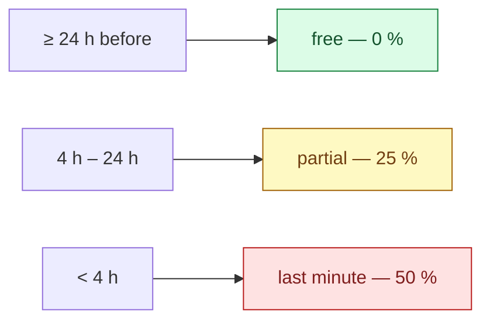

# Business rules

Every number the platform charges, pays or refuses by — and why it is that number.

A constant in a source file reads as arbitrary, so the next person changes it. Written down with its
reasoning it can be argued with, which is the only way a rule stays deliberate.

All values below are the shipped ones, read from `BookingPolicy` and the pay calculator.

## Booking window

| Rule | Value |
|---|---|
| Standard lead time | **4 h** before the cleaning starts |
| Express lead time | **2 h** — the hard floor; below this a booking is refused |
| Express surcharge | **+20 %** of the base price |
| Bookable hours | **08:00 – 20:00**, in 60-minute customer-facing windows |
| Start grace window | **60 min** — a cleaner may start a job at most this far ahead of its time |

Between 2 and 4 hours' notice a booking is accepted but carries the express surcharge. Under 2 hours
it is refused outright — not priced higher, refused.

The customer-facing window is 60 minutes; the internal scheduling grid stays at 30.

### The start grace window — 60 min, and why it is not zero {#start-grace-window}

`StartGraceWindowMinutes = 60`. Until 2026-08-22 there was **no** clock gate at all: a cleaner could
open a job booked for next Tuesday and mark it started today. Nothing downstream noticed, because the
duration a cleaner is paid for comes from the service, not from the elapsed clock — so the only visible
symptom was a customer being told their cleaner had arrived, days early.

The gate is deliberately a **grace window, not an exact time**. Cleaners arrive early; a cleaner
standing at the door at 09:50 for a 10:00 job must be able to start, and a rule that refuses them would
be one the platform loses to reality within a week. An hour is wide enough to cover early arrival and
travel, and narrow enough that "next Tuesday" is refused today.

It bounds **both** the start and the on-the-way notice, because both write to the customer's lock
screen. Late is never blocked — a job started three hours late is a real thing that happened and the
platform records it rather than refusing to.

The error is `order.too_early_to_start`, and it is the **last** rule on both commands: a cleaner who is
not assigned to the order learns that they are not assigned, and learns nothing about when it is
scheduled.

→ [ADR-0055](/decisions/adr-0055)

### Maximum booked duration — 24 h, and it is not about calendars

`MaxBookableOrderSpanHours = 24`. Read it as a **disclosure** bound rather than a scheduling one.

The booked span is a caller-chosen window pointed at the preferred-cleaner availability answer. Left
uncapped, that is a binary-search primitive over a cleaner's private schedule. It is also a crew cap:
24 h implies at most 12 seats.

> `Order.MaxOrderSpanHours = 168` is a **different** number — the overlap-scan floor. `cap ≤ floor` is
> the safety argument, and neither may move alone.

## Cancellation

The fee is a fraction of the order total, decided by how much notice the customer gives:



`CancellationFeeRateFor` is the **only** place a tier is priced.

### A guest cancels under the same policy

The guest cancellation API needs the booking’s **access token** — the one the guest's e-mail link
carries — and accepts only a booking placed without an account. An unknown, expired or revoked token
and an account-owned booking all return the same `order.not_found` answer. Cancelling revokes every
token the booking had outstanding, and a token expires **30 days after the cleaning** regardless.
The preview and cancellation use the same fee assessment
as a signed-in customer: no fee while no cleaner is assigned, the standard 15-minute oops window,
and the standard 24 h / 4 h fee tiers above. A guest has no Plus free-window extension. Cancellation
is refused once cleaning is under way, completed or already cancelled.

The cancellation is confirmed by e-mail to the address stored on the booking. A refund line appears
only when a refund was successfully issued, using that refund’s actual amount; the policy refund
shown in a preview is not proof of a payment. The guest remains without an account, feed or push
notification. Assigned cleaners still receive their cancellation notice.
→ [Guest cancellation](/flows/booking-and-pricing#guest-cancellation),
[the guest access token](/flows/booking-and-pricing#guest-access-token)

### The "oops window"

Free cancellation within **15 minutes** of booking, regardless of how close the cleaning is —
**60 minutes** for a first-time customer. It protects against an accidental tap, and the longer
first-time window buys trust from someone who has not used the platform before.

### When the cleaner cancels or no-shows

The customer is refunded **and** credited the apology figure authored for the order's currency —
**250 CZK** on a CZK order. The credit is the apology; the refund is not.

> Implemented by the unfilled-order sweep (`CancelUnfilledOrders`) — the one no-show the platform can
> prove: the slot was reached and nobody ever took the seat. Every other version of "the cleaner did not
> arrive" rests on a missing tap, which is indistinguishable from a cleaner who turned up and forgot to
> slide to start, so no lateness detector refunds on its own, and a drop refunds nothing. The figure is
> `Currency.NoShowCredit`, authored per currency; a currency with none pays no credit and the push is
> the plain cancellation. The home page states the figure from the market, never from the translation;
> see [Money constants](#money-constants).

### When the last cleaner leaves {#crew-lost}

**A confirmed booking whose last cleaner leaves goes back to `New` and is re-offered; the customer is
told nothing; the company's administrators are** (owner ruling 2026-09-19, [ADR-0067](/decisions/adr-0067):
*"it could go back to New since 'Confirmed' means that cleaner(s) are assigned. Also I want admin know
about it as well."*). Two acts can empty a crew — a cleaner **dropping** the job, and an admin
**rejecting** a cleaner who holds future confirmed work — and both walk a `Confirmed` order back
through one domain writer, `Order.ReturnToBoardIfUnstaffed()`. A cover request removes nobody; a
reassign or a cover swap replaces. Three rules ride with it:

- **The walk-back is `Confirmed`-only; the alarm is not.** A drop is admitted at any offerable status,
  and an order dropped `OnTheWay` or `InProgress` is never walked back — a cleaner may be in the home —
  and no sweep selects it. So the administrators are told **whenever the crew empties, at any status**,
  and the notice says which (`admin.order.crew_lost`, with the cause — *the cleaner dropped it* / *the
  cleaner's account was rejected* — the order number, the slot, and *"the clean was already under way"*
  when it was). A two-seat job losing one of two cleaners keeps its status, re-advertises the seat, and
  tells nobody. → [Administrators are told](#admin-notifications)
- **An administrator cannot set `Confirmed` on an order with no crew.** The status override refuses it
  (`order.status.confirmed_needs_crew`); an administrator who wants a cleaner on the job reassigns,
  which writes `Confirmed` itself. The other forward moves — `OnTheWay`, `InProgress`, `Completed` on an
  unstaffed order — stay open, as the administrator's own audited repair of the work's state.
- **A rejection also ends the hold.** A live preferred-cleaner reservation whose beneficiary is the
  rejected cleaner is ended with the release — an order back on the board must be *on* the board — while
  a hold naming another cleaner is left alone. → [Offerability](/domain/offerability#the-preferred-cleaner-hold)

**The customer's sequence changes, and nothing new is sent** (default O-D2-1, the owner may overrule).
A drop moves no money and cancels nothing — *the customer has lost a cleaner, not their clean* — and the
slot-time sweep is still the one place the customer learns nobody came. But the next take is a
`New → Confirmed` transition again, so it sends a **second "your order is confirmed" e-mail** on top of
the assignment push it already sends: *Confirmed → silence → Confirmed again*, with the timeline's
search step current again in between and no message saying why. Accepted as stated: a new cleaner is
a new confirmation, and the e-mail is true when it is sent. No "your cleaner left, we are looking for
another" message exists.

**No invariant is claimed.** Two releases racing on one order — two same-window drops on a two-seat
job, a drop racing a rejection — can still leave `Confirmed` with nobody on it, because `CurrentStatus`
is the only concurrency token and neither commit changes it. Every sweep therefore keeps reading the
crew: `CancelUnfilledOrders` still selects `{New, Confirmed}` with no assignee, the reminders still
require one, the validators still authorise the caller by their assignment. The status is a summary;
the crew is the fact. Legacy DEV rows holding `Confirmed` with no crew are harmless for the same
reason and are not migrated. → [Order lifecycle](/domain/order-lifecycle)

### When the platform cancels {#platform-cancellation}

Four reasons exist for a cancellation nobody asked for, each a stable key the customer's apps turn into
a sentence (`OrderCancellationReasons`): the card payment never completed
(`order.cancelled.payment_not_completed` — the checkout was abandoned and the slot released), a recurring
occurrence went unconfirmed (`order.cancelled.recurring_not_confirmed`, fee-free at the lead-time
cut-off), nobody took the job by its slot (`order.cancelled.no_cleaner_available` — the no-show above;
**the one key no client renders yet**, a known gap the parity gate names), and **the operating company is
closing** (`order.cancelled.company_wind_down`): the booking fell on or after the company's last day of
service, so the platform cancelled it and — on a card booking — refunded it in full, absorbing the Stripe
fee; a cash booking is simply cancelled. No fee is ever charged on a platform cancellation. →
[A company's lifecycle](#company-lifecycle)

## Disputes {#disputes}

### The reporting window — 24 h, and it gates the guarantee rather than the door

A customer has **24 hours** from the clean to report a problem. Inside it, the platform undertakes to
put the job right — normally by refunding the part that was not done. `DisputeLimits.FilingWindowHours`
is the number, and `IsWithinFilingWindow` is the rule.

**A later dispute is still accepted.** The window decides what is *promised*, not what is *heard*. A
serious claim — something broken, something missing — has to be judged on its merits whenever it
arrives, and a hard cut-off with no override is a support team telling an honest customer that the
system will not let them. `DisputeDetails.FiledWithinWindow` carries the verdict so an admin can tell
"we promised to fix this" from "we are choosing to".

The clock runs from when the clean **ended**, or from when it was **due to start** if it never did. A
cleaner who never arrives leaves no completion time behind, and that is exactly the case the window
most needs to cover.

### What cannot be disputed

A clean that has **not happened yet**. The gate is the scheduled time, deliberately not the order
status: a no-show leaves the order sitting at `Confirmed` or `OnTheWay` with no completion to point
at, so a status gate would refuse the one case the guarantee exists for.

### One dispute at a time, not one per order

A new dispute is refused while an earlier one on that order is still open. Once it reaches a terminal
state — `Resolved` or `Closed` — the customer may raise another. Owner ruling 2026-09-05: a customer
who has a complaint settled and then finds something else is not out of options.

### Cleansia Plus

**Every Plus benefit requires an active, PAID subscription** (owner ruling 2026-09-08, T-0690). There
is no free trial: both seeded plans carry `TrialPeriodDays = 0`, the admin plan commands refuse
anything else, and the admin plan form offers no trial field at all (it sends the zero the server
accepts), because a trial is by definition benefits without payment.

There are **six** benefits, not the three this page used to list:

| Benefit | What it does |
|---|---|
| Discount | 5% off every clean |
| Free-cancellation window | Widened from 24h to 4h before the cleaning |
| Express-upgrade waiver | The express surcharge is waived, N times per calendar month |
| Recurring schedules | Authoring and editing a standing booking is Plus-only |
| Preferred cleaner at booking | Request a specific cleaner when placing the order |
| Preferred cleaner re-pick | Change that choice after booking |

All six resolve through **one** entitlement predicate
(`UserMembershipRepository.EntitledForUserQuery`), so `PastDue`, `Paused`, `Cancelled`, an elapsed
period and a trialing enrolment are refused identically. That predicate is deliberately separate from
the *lifecycle* one that answers "is there a live enrolment?" — the lifecycle question is what stops a
second Stripe subscription, lets a customer cancel, and is what GDPR erasure reads.

**Plus is priced per market, and a subscription keeps its currency for life** (owner ruling
2026-09-12, [ADR-0059](/decisions/adr-0059)). A plan's price is a row per currency
(`MembershipPlanPrice`: the charge for one billing period and the Stripe Price that charges it —
CZK 199 monthly / 2 030 yearly today, no EUR rows). The Plus page, the home teaser, the wizard's Plus
step and both mobile Subscribe screens list the plans priced in the customer's **chosen market**
(`GetPlans?countryId`), and the subscribe commands carry the same `countryId`, so the figure shown is
the figure Stripe charges. Three consequences:

- **A market with no priced plan has no Plus.** The list is empty, the surfaces say *"Plus is not
  available in your market yet"* with no price and no button, and a subscribe attempt is refused as
  `membership.plan.not_priced_in_currency`. That is a valid product state, not a gate on opening the
  market — an admin may price the catalogue in EUR and leave Plus for later.
- **The subscription is born in the market's currency and never changes it.** Stripe refuses a
  currency change on a live subscription, so a plan swap picks the target plan's price in the
  membership's own currency (or refuses), the management screens label every figure with that
  currency whatever market the customer browses in now, and the switch-to-annual offer only appears
  when the yearly plan is priced in it. A customer who wants Plus in another currency cancels and
  re-subscribes in the new market — and that re-subscribe **must work** (owner ruling 2026-09-13).
  Stripe locks a Customer to the currency of its first invoice, so the platform holds **one Stripe
  Customer per currency per user** (`UserStripeCustomers`): the subscribe commands resolve the
  Customer for the market's currency — an existing row, else the legacy `User.StripeCustomerId`
  adopted when it has never billed a membership in another currency and no row claims it, else a
  new Customer. The legacy field stays for one-off order payments. Stripe's refusal is still
  classified as `membership.stripe_customer_currency_locked` ("contact support"), never a 500, as the
  backstop for a Customer locked for a reason the resolver could not see.
  → [Loyalty and memberships](/flows/loyalty-and-memberships#plus-is-priced-per-market-end-to-end)
- **The benefits are currency-free.** The discount is a percentage of the order's own subtotal, the
  cancellation window is hours and the waivers are a count, so a CZK subscription serves a EUR
  booking without conversion. The subscription's currency decides only what Stripe charges for the
  subscription.

**A lapsed membership stops the schedule.** A recurring schedule is one of the six benefits, so when the
membership lapses the sweep stops generating new occurrences. Three deliberate limits on that:

- **The template is not deleted or deactivated.** It stays exactly as authored, so resubscribing
  resumes the schedule on the next nightly tick with no action from the customer.
- **Occurrences already created run.** The sweep works a horizon ahead, so up to a week of orders may
  already exist when the lapse lands. They are real orders, possibly already authorised on a card, and
  they are left alone — retracting them is a refund path that does not exist.
- **The customer is warned before it happens**, by the existing `membership.expiring_soon`
  notification. There is no dedicated "your schedule has stopped" event yet.

## Crew size

```
RequiredEmployees = ceil(EstimatedTime / 120 minutes)
MaxEmployees      = RequiredEmployees + SpareSeatsPerOrder
```

**`SpareSeatsPerOrder` is `0`.** There is no spare seat, by owner ruling, and the reasoning is pay:
a cleaner is paid one row per assignment with **no crew-size term**, so a filled spare seat is a second
full wage against an unchanged customer price.

That single fact is also why the seat is arbitrated by a unique database index rather than by an
in-memory check — see [Offerability](/domain/offerability#seat-allocation).

## Preferred cleaner

| Rule | Value |
|---|---|
| Hold length | **10 %** of the lead time, capped at **12 h** |
| Offer rounds | at most **2** |
| Minimum open board share | **80 %** |

The last one is the constraint that keeps the feature from eating the marketplace: at least 80 % of
offerable work must stay on the open board, so preferred holds cannot starve cleaners who have no
regular customers.

## The contract for work {#work-contract}

**Owner ruling 2026-09-20 → [ADR-0068](/decisions/adr-0068).** The lawyer's model forms an individual
*smlouva o dílo* between the customer and the cleaner the moment the cleaner accepts the job, on the
customer terms. Until 2026-09-20 nothing on the platform could substantiate a claim against a cleaner:
the order named no text, the take wrote a seat the next drop deleted, and an admin's placement left
the same row a cleaner's own act did. The rules below are what is written down now.

| Rule | Value |
|---|---|
| The text an order is booked under | the **customer-audience** `WorkContract` document in force for the **address's market** on the booking day — stamped on the order once (`Orders.WorkContractDocumentId`), never changed; a booking with no text in force is **refused** (the factory throws), never booked without one |
| Where the customer reads it | `/work-contract` beside `/terms` and `/privacy`, and the wizard's confirm step says *"By confirming the order you conclude a contract for work with the cleaner on these terms"* on every client, whether or not the account already consented — a sentence, **not a checkbox** |
| When the acceptance forms | at the **take**: the cleaner reads the text and the job facts in the app and takes the job in one act; the take **carries the id of the exact text row** they read (`acceptedWorkContractTextId`), and a take without it is refused |
| One contract per **seat** | a take → drop → re-take is two seats and **two** contracts; a take → drop → admin re-add of the same cleaner is a new seat with **no** contract until they accept |
| An administrator places a cleaner | **no** acceptance is written — an admin cannot accept on a cleaner's behalf. The cleaner accepts from the job detail (a banner), or is refused at **Start** and at **Complete** with `contract.acceptance_required` and accepts then; a cleaner placed on an **in-progress** job can still accept before completing |
| What binds | the text row (document, version, language, hash by one join) **and a frozen snapshot of the job as shown at acceptance**: order number, date and time window, price and currency (the customer's price — Q-WC-01), the coarse location (*"Praha · 120"*), rooms, bathrooms, services, packages, extras. Never the street, never a name |
| A new version of the text | applies to orders **booked from its date**; an order already booked keeps its text — no re-acceptance, no "stale version" case |
| What survives | the row outlives the seat (a drop, cover, rejection or reassignment leaves it), the order's anonymisation and the cleaner's erasure — it is books, kept with the order, **never deleted** |
| Who can read an accepted contract | the order's customer, the cleaner who accepted it (the server still answers them after they left the job — the read is keyed on the acceptance, not the seat), and the company's administrators — with the stored facts and the text in the reader's language (the page says *accepted in Czech* when it renders another); anyone else is told the order does not exist |

**The three keys.** `contract.not_accepted` — the client sent no text id (a broken or stale client,
shown as an error); `contract.text_mismatch` — the id is not a text of *this* order's document (a
cached id from another job; the app re-fetches the text and asks again); `contract.acceptance_required`
— the caller's seat has no contract yet (a product state the app answers by opening the contract). A
full order still answers `no_available_spots` ahead of a mismatch, and a held order stays
indistinguishable from a missing one — the tick is judged before existence, the echo after everything
else.

**What each party sees.** The partner apps show the contract before every take — the facts, the text,
and on Android and iOS a *Swipe to accept the contract for work* slider under it, on the web a tick
and *Accept and take the job*; the job detail states *You accepted the contract for work on {date},
version {version}* with **Read the contract**. The customer's order detail states *Contract for work
accepted by {given name} on {date}, version {version}* per crew member, with **Read the contract**;
before any acceptance it says nothing (the crew list already shows who is on the job). The admin's
order detail says *accepted {date}, v{version}* or *contract pending* per crew member, with **Read**
— and, for an Administrator, the accepted text row's SHA-256. There is **no PDF** yet: a dispute is
answered from the incident file's *Contracts for work* section plus the admin document read's hash.

**The record, and what is kept of it.** Every acceptance carries the client it came from (partner
web or partner mobile), the IP address, the device label and the session's signed device id, like
every other legal act on the platform. It writes `employee.order.contract_accepted` on the order's
timeline, prints in the incident file, is in the cleaner's own data export in full and in the
customer's export as the order's document version plus each acceptance's date, version and language
(no cleaner id), and goes into a company's archive bundle without the IP and device. **Retention of
the request metadata — 3 years per row, per company** (`retention.work_contract_metadata.years`, the
tenth window in the table below): the IP address, device label and device id are blanked three years
after the acceptance, or at the cleaner's erasure, whichever comes first; the acceptance itself, the
text it names and the facts stay. Nothing is written for a cleaner already on a crew when this
shipped (DEV only, no backfill).

**Open with the owner and the lawyer** (defaults in force, [ADR-0068](/decisions/adr-0068) §Open
questions): which figure is the *cena díla* (the customer's price today), the web gesture (a tick,
not a slider), how the parties are named (given name only), whether a swipe forms a B2C contract for
work or a qualified signature is needed (the swipe; Signi is the upgrade path), the VOP wording that
incorporates the template, whether an admin may force a crew member at all or every seat should be an
offer the cleaner takes, and the coarse location on a permanent row.

## What a cleaner cannot silence {#cleaner-non-mutable}

A cleaner may mute notification categories; **five pushes ignore the mute**, every one about work the
cleaner has already accepted: an admin assigning or unassigning them, the evening *"you have N jobs
tomorrow"* digest (18:00 in the cleaner's local time), *"your job starts in about two hours"*, and
*"your job starts soon and you have not set off"*. The digest is the one that was questioned and
**ruled non-silenceable by the owner on 2026-09-15** (Q-PUSH-01): it is the only notice that arrives
in time to *arrange* the day, and the two-hour notice cannot substitute for it. A cleaner not turning
up is somebody else's morning. → [Push notifications](/architecture/push-notifications),
[ADR-0054](/decisions/adr-0054)

## Administrators are told {#admin-notifications}

**Nine things the platform can prove happened reach the company's administrators through an in-app
feed and an e-mail, both** (owner ruling 2026-09-19, [ADR-0065](/decisions/adr-0065): *"both in-app and
email"*). Until then nothing told an administrator anything: a failed erasure was an Error log line, a
chargeback was a dispute row nobody opened, an order that lost its crew was re-advertised to cleaners
only. One writer, `IAdminNotifier`, turns an event into one feed row per administrator of the **named**
company and one e-mail per recipient address, inside the same unit of work as the event — so the rows
exist iff the event committed, and a failing e-mail can never fail the command, because the command
never sends one; it writes an outbox row. No push: the admin console is a browser, and the partner app
an administrator may also hold cannot render these keys.

| Event | When | What the notice carries (never a person) |
|---|---|---|
| `admin.order.new` | an order the company now has to serve becomes **offerable** — a cash one-off at creation, a card order on its payment, a recurring occurrence on the customer's confirm. Never an unpaid card checkout, which the stale sweep cancels within the hour | order number, amount with its currency, tender, market |
| `admin.order.crew_lost` | a drop or an admin rejection leaves nobody on the order, at any status → [above](#crew-lost) | order number, the cause, the status at the loss, the slot |
| `admin.dispute.filed` | a customer files a dispute | order number, the reason (an enum), the dispute |
| `admin.dispute.chargeback` | the bank reverses a charge — the dispute named is the customer's open one when there is one, else the chargeback's own | order number, the reversed amount, the dispute |
| `admin.payment.failed` | a card payment is declined — **once per order**, the first decline only (default O-6): Stripe fires per attempt and the platform resolves the state itself, by a retry or the stale sweep's cancel | order number |
| `admin.erasure.failed` | the daily retry of a failed account erasure fails again — **once per request per day**, and a request that fails again tomorrow is meant to be heard again | the request, the day |
| `admin.company.wind_down_requested` | an administrator sets the company's last day of service (a re-run announces nothing) | the date |
| `admin.company.wind_down_run` | a wind-down run **that did something** — cancelled, refunded, failed a refund or closed a period; a run that moved nothing is not news | the four counts |
| `admin.company.archived` | the company's books are sealed — the one event written on a frozen company, which the account surface admits | the day |

**Who.** Every active, e-mail-confirmed, non-anonymised administrator of the event's company **whose
role is in the event's audience** — read by the company **argument**, never by whatever tenant happens to
be ambient at a webhook or a job — gets their own feed row with their own read state, so the first
administrator who glances at the bell does not silence it for everyone. The audience is one of the
administrator sets ([ADR-0066](/decisions/adr-0066) D8): the order, dispute and payment events and a
lost crew reach **Support and above**; a failed erasure retry reaches **Manager and above**; the three
company milestones reach **Administrators only**; a **chargeback reaches every role** — Support answers
the bank, the Accountant reconciles the money that left. The e-mail fan-out below is over the same
narrowed set. A company with no eligible administrator in the audience is a logged warning, not an error.

**The e-mail, and the one setting.** One template, one subject and one paragraph per event in five
locales, and a line saying to sign in to the console to act on it — no link, no button, nothing that
carries a secret; the copy is layered under the admin e-mail-template page like the wind-down notices. The address is decided by one company setting, **`notifications.admin_email`**
(category *notifications*, on Company settings): set, **exactly that one mailbox** gets one message per
event, in English; unset — the default — **every administrator in the event's audience** gets their own,
in their preferred language. The feed rows are written either way; the key changes the e-mail fan-out only. An address is
stored trimmed and lower-cased, must have one `@` with something on both sides and no whitespace, and
the empty string is not a value — *unset* is *Reset*. A company that wants three mailboxes has a
distribution list on its own mail server. The volume this implies until a mailbox is set — fifty
offerable orders a day times three administrators is 150 e-mails — is default O-5, the owner's to
overrule.

**What is not built, on purpose.** No digest, no throttling, no per-administrator preference (an
administrator who does not want order e-mails is a company that sets the mailbox), no reason free
text, no holding-wide feed (the row is the company's), and no audit row for a mark-read — a bell click
is not a ledger entry, and the same switch stopped the accidental admin audit rows an administrator
used to write by marking read in the partner app. Rows fall under `retention.notifications.days`
(90): the feed is a bell, not a ledger — the record of a chargeback is the dispute, of a failed
erasure the request row, of a wind-down the company's stamps and the audit trail. Two silent ends are
named: a mistyped mailbox that bounces dead-letters every admin e-mail and the fallback never
engages, and a SendGrid outage dead-letters likewise — the feed is the surviving channel in both,
which is why *both* was the right ruling and not a redundancy. → [Admin notifier](/domain/roles/admin-notifier),
[Push notifications — the admin audience](/architecture/push-notifications#admin-audience)

## Cleaner pay

One `EmployeePayConfig` is selected per selected service **and** per selected package, then summed:

```
basePay     = Σ config.BasePay                                  # one config per service / package
extrasPay   = Σ (config.ExtraPerRoom × max(0, rooms - 1))       # the FIRST room is inside BasePay
            + Σ (config.ExtraPerBathroom × bathrooms)
expensesPay = Σ (config.DistanceRatePerKm × order.TravelDistance)

minPay      = max(config.MinimumPay > 0)     # the strongest guarantee wins; 0 = no bound
maxPay      = min(config.MaximumPay > 0)     # the tightest cap wins;        0 = no bound

TotalPay    = max(0, clamp(base + extras + expenses, minPay, maxPay) + bonus - deduction)
```

`CalculateOrderPay` writes the pay row, and it reads the order's packages beside its services — so a
package-only order is paid like any other, and one with no rate for any of its lines in its currency
is refused (`payroll.no_pay_configuration`). There is one formula, in `PayCalculatorExtensions`, and
the first room is inside `BasePay` everywhere it is applied.

Three things that surprise people:

- **`extrasPay` is rooms and bathrooms, not the extras the customer bought.** The order's extra lines
  (`OrderExtra`) are read by nothing on this path; they earn the cleaner no pay.
- **The clamp bounds are persisted on the pay row.** A later bonus or deduction re-clamps the same
  core identically, instead of silently dropping the clamp.
- **Every assigned cleaner is paid the whole figure.** Pay is one row per assigned cleaner with no
  crew-size term, so a job with a crew of three pays its rates three times against one customer price.
  Whether a rate describes the job or one cleaner is an open owner question; until it is answered,
  this is the rule. → [Pay and payouts](/flows/pay-and-payouts)

### Per-employee rates

`EmployeePayConfig.EmployeeId` is nullable: `null` is the platform-wide rate for that service or
package, non-null is an override for one cleaner. Per target id, the employee-specific config wins,
otherwise the global one.

### Rates are per currency {#rates-per-currency}

A rate is an amount **in a currency** (`EmployeePayConfig.CurrencyId`; the unique index carries it), so
every pay-coverage question is asked in one currency, and one predicate — `PayCoverage.Applies` —
answers all of them: the customer catalogue offers an entry only when it has a platform-wide rate in the
currency being browsed in; a booking is refused (`order.selected_services.invalid` /
`order.selected_package.invalid`) when its selection has no platform-wide rate in the order's currency;
a cleaner is approved only against the rates in their work country's currency; and the last
platform-wide rate for a live entry in a currency cannot be deleted
(`pay_config.last_for_live_catalogue_entry`). A rate in another currency counts for nothing —
`CalculateOrderPay` reads only rows in the order's currency, so an order admitted on a CZK rate would sit
silently unpaid in EUR. That is why the gate and the writer share the predicate rather than paraphrase
it.

The pay a cleaner earns is therefore always in the order's currency, and an invoice is one currency —
a cleaner who worked a CZK job and a EUR job in one period receives two invoices.
→ [Pay and payouts](/flows/pay-and-payouts)

### Each operating company numbers its own payout invoices {#payout-numbering}

Owner ruling 2026-09-15 (*"Separate everything — one holding and child companies per country"*). A
payout invoice carries two references and both are the **issuing company's**, not the holding's:

| Reference | Shape | Series |
|---|---|---|
| Invoice number | `INV-YYYY-NNNNNN` — the year of issue and a six-digit ordinal from 1 | one per company per year |
| Variable symbol (*variabilní symbol*) | `YYYYNNNNNN` — ten digits, never a leading zero, so a bank form cannot shorten it | one per company per year, independent of the number |

Each ordinal is claimed atomically before the invoice exists, so two invoices can never share a
reference within a company; a company's first invoice of the year is `INV-2026-000001` with symbol
`2026000001` whatever another company has issued, and a year's 999 999 ordinals in one series are that
company's alone. The year is the year the number is **claimed** — a December period closed on 2 January
is numbered in the new year. An invoice that fails after its numbers were claimed leaves a gap; a gap
is correct for a payment reference (only fiscal receipts must be gapless). The company printed on the
invoice is the same company that numbered it. → [ADR-0046](/decisions/adr-0046) and its 2026-09-15
superseding note, [ADR-0061](/decisions/adr-0061) D9 as amended

### A cleaner works in one currency {#cleaner-currency}

**A cleaner is paid in the currency of the country they work in** — CZ is CZK, SK is EUR, PL is PLN
(owner ruling 2026-09-12). `Employee.WorkCountryId` resolves through `CountryConfiguration
.DefaultCurrencyCode` to a `Currency` row (`ICurrencyResolutionService.ResolveCurrencyForEmployeeAsync`),
and that one currency scopes everything the cleaner sees and does with money:

- **The board is scoped to it.** An order priced in another currency is not listed, not counted, not
  browsable and not takeable — `OrderVisibility.PayableTo` is conjoined with the preferred-cleaner
  hold into one `OpenTo` predicate that the available-jobs list, the dashboard count, the browse gate
  and `TakeOrder` all read. A take on a foreign-currency order answers `order.not_found`, the same as
  a held one: from that cleaner's side the order does not exist. A null resolved currency fails
  closed — an empty board, never every board.
- **Pay follows the order, so it follows the board.** Because a cleaner can only take orders in their
  currency, every pay row they earn is in it, and a period closes into one invoice in it. The
  per-currency invoicing above still exists for the one path that can cross the line: **an admin
  reassigning a cleaner onto an order is the deliberate override** (`AdminReassignOrder` is not
  gated), and an order the cleaner is already on stays visible to them whatever its currency.
- **My Pay and the dashboard label with it.** Every partner-facing money aggregate is filtered to the
  resolved currency and printed with its code; counts stay over all orders. **A period that holds pay
  in more than one currency offers a switch** (owner ruling 2026-09-19): the period view answers the
  distinct currencies of the cleaner's **pay rows** in that period — the currency shown first, the
  rest by code — and the partner web shows the switch when there is more than one. Pay rows, not
  invoices: an open period has no invoice yet, and a cancelled invoice's currency is not a currency the
  cleaner is owed in. → [Pay and payouts — My Pay](/flows/pay-and-payouts#my-pay-shows-one-currency)
- **Approval checks the account against it.** An undeclared payout account is read as holding the
  work country's currency, never the platform default — so the normal case needs no declaration.
- **A customer can only ask for a cleaner who is paid in the order's currency.** The preferred-cleaner
  request has two terms, judged in this order: a completed order together, then the cleaner's currency
  equals the order's — the service address's country's on `CreateOrder` and `ChoosePreferredCleaner`,
  the saved address's country's on `CreateRecurringBooking` and `UpdateRecurringBooking`. Both terms
  fail as one key, `order.preferred_employee.not_eligible`, because which one failed is not the
  customer's to learn. A hold granted across currencies could only lapse: the cleaner's board would not
  show the job and their take would be refused, while the seat sat withheld for the whole hold.

**There is no fallback for a named country** (owner ruling 2026-09-12, "throw instead, 100 %"). A work
country with no `CountryConfiguration`, a blank `DefaultCurrencyCode`, or a code that names no `Currency`
row makes `CurrencyResolutionService` throw `InvalidOperationException`, naming the country and the
code — so a configuration defect fails loudly on every partner money screen, every board read and
every invoice approval for that country, instead of quietly paying the cleaner in the platform
default. Only a **null** country resolves to the platform default: an unapproved cleaner with no work
country yet, or the customer wizard before an address is known. The seed is what keeps this from ever
firing — see [Money constants](#money-constants).
→ [Pay and payouts](/flows/pay-and-payouts#approval-is-the-last-refusal)

## The revenue report {#revenue-report}

**Revenue is completed and paid orders, by completion date, in one currency, minus every refund on
those orders** (owner ruling 2026-09-19: *"paid and completed orders, minus refunds, per currency, by
completion date"*). Until then the report summed every order whose *cleaning* date fell in the period,
gross, cancelled ones included. The rules, each one a line of the query or the handler
(`GetRevenueReport`):

- **An order counts in the period it was completed in** (`CompletedAt`), not the period it was booked
  for: a clean booked on 31 March and done on 1 April is April's. An order completed by an
  administrator's status override is dated by the override — until now it carried no completion date
  and was revenue of no month. Historic override-completed DEV rows are not backfilled.
- **Only completed, paid orders are revenue.** `Completed` on the fulfilment axis and *paid at some
  point* on the money axis — `Paid`, `PartiallyRefunded`, `Refunded`, `Disputed` — so a fully refunded
  order **stays in the set and nets to zero** rather than vanishing. A `Confirmed`, cancelled or unpaid
  order contributes nothing.
- **Both refund legs are subtracted from the order they belong to, whatever their date.** The card
  share is the succeeded `Refund` rows; the credit share is the credit returned to the customer's
  balance (`OrderPaymentReturned`). Netting the card leg alone would leave 500 of revenue on a 2 000
  order the customer has entirely back. A refund therefore **reduces the month the order completed
  in, not the month it was issued** — a closed month changes when a later refund lands, and the page
  says so. A `Pending` or `Failed` refund row subtracts nothing.
- **The headline is net; the by-tender table stays gross with the refunds beside it.** `TotalRevenue`
  is Σ price (gross), `NetRevenue = TotalRevenue − refunded to card − returned as credit` is the
  ruling's number, and the average order value is net. Per tender the row reads the sale, what was
  settled from credit, what the tender took, what it gave back to the card and what went back as
  credit, and **`NetOnTender = taken − refunded to card` — the figure to reconcile against a Stripe
  statement**, because the gateway never saw the credit. Every derived figure is derived, never
  summed a second time, so the columns close.
- **The daily series and the per-service and per-package splits are net of both legs too.** Each
  day's amount is that day's completions less their card refunds and their returned credit, with both
  legs beside it as `refunded`, so the days add up to `NetRevenue` and growth compares net with net.
  Of the breakdowns, only the by-tender and the by-payment-status tables are gross.
- **Cancelled bookings are counted on their own axis, not in revenue** — by `CancelledAt` in the
  period, so an abandoned card checkout (a `Cancelled` track with no `CancelledAt`) is not a booking
  and is not counted; an accountant reading the order list should not file the difference as a bug.
- **One currency per report**, as before; an order in another currency is absent.

**Two named gaps, stated on the page.** A **lost chargeback is not subtracted**: the platform records
the dispute's outcome, not the amount the bank reversed, and a wrong number in a money report is worse
than a stated gap (default O-D3-2 — the fix, if wanted, is one column stamped from the `lost` webhook).
A **cash order refunded by hand has no refund record** and shows gross. → [Admin reporting](/admin-app/reporting#revenue-report)

## Charging a package and a service together

Selecting a package **and** a service that the package already includes buys that service **twice** —
it is performed twice, priced twice, and takes twice as long.

That is an owner ruling, not a bug, and the doubled crew size and duration follow from it correctly.
It must not be "fixed" with a de-duplication.

## Discounts, and the 12 % cap {#discount-cap}

Three sources can reduce a price: the customer's **loyalty tier**, their **Cleansia Plus** membership,
and a **promo code**.

Tier and Plus are **additive**, then capped at **12 % of the raw subtotal combined**. A promo code
replaces the combined figure when it is larger, and is itself uncapped because it is a per-campaign
decision.

### Why 12 %

It is an **owner ruling, not a tuning value**. The top loyalty tier is already 12 %, so stacking the
5 % Plus rate on top uncapped would be a 17 % discount, which was judged too much.

The consequence is uncomfortable and deliberate: **a subscriber already at the top tier gets nothing
extra for their money.** That reads like a bug and is not one. Raising the cap is a product decision.

> The consequence is also stated in member-facing copy on web, Android and iOS, in five locales each.
> **Change this number and that copy becomes false.**

### How the cap is shared out

When the combined Plus + tier amount would exceed the cap, both are **pro-rated down** so their sum
equals it — rather than zeroing one out — so each source's contribution stays visible on the receipt.
When a promo wins, it fully replaces the combined figure and both go to zero.

### The express-surcharge correction {#discount-express-correction}

Discount resolution happens on the **raw, pre-surcharge** subtotal and stays there: the tier floor and
the 12 % cap must be judged on the same base the quote judged them on, or a booking straddling the
floor qualifies in the wizard and loses the discount at submit.

But the price the discount comes off **carries the surcharge**. On an express order the raw figure
under-states the saving: the customer would have paid `raw × 1.2` and pays `(raw − d) × 1.2`, so they
actually saved `d × 1.2`.

Every consumer composes the amount with the surcharge-inclusive price — the mappers' original-subtotal,
the lifetime-savings sum, every client's `totalPrice − discount` — and reads the stored discount as the
saving. So the correction is made once, before the amount is persisted, and no consumer re-applies it.

**The order stores every term of its price in cents, and the terms add up.** `OrderFactory` stores
the surcharge it charged as an amount — `Order.ExpressSurchargeAmount` = `raw × 1.2 − raw` rounded to
the cent, zero when none applied — and each discount rounded to the cent on its own, with whatever cent
the three roundings leave over added to the largest source. The result holds exactly:

```
Σ lines + ExpressSurchargeAmount
        − (TierDiscountAmount + MembershipDiscountAmount + PromoDiscountAmount) = TotalPrice
```

That identity is what the receipt prints, line by line. The quote reports the discounts before this
rounding, so on a currency with cents the discount a wizard shows can differ by one cent from the one
stored. → [What the receipt says](/flows/payment-and-fiscal#what-the-receipt-says)

### Which discounts know what currency they are in

A percentage is unit-free: the tier rate, the Plus rate, the 12 % cap and a percent promo apply to an
order in any currency. The two **amounts** in this section do not — the tier floor is a number in the
platform default currency and a promo minimum is a number in the code's currency — and each is enforced
only on an order in its own currency. The rules are in [Money constants](#money-constants).

## Money constants and the default currency {#money-constants}

Prices are authored per currency and nothing converts — see [Order currency](#price-stages) — so every
constant that is an **amount** rather than a percentage is an amount in *some* currency. Each one below
says which, and what happens on an order priced in another. The pattern is deliberate: a number the
platform cannot denominate is not applied, rather than applied at the wrong scale — 250 CZK handed over
as 250 EUR is a twenty-five-fold apology.

The same rule holds on the way out. **Nothing prints a unit it was not given.** An order e-mail or a
customer receipt PDF rendered for an order whose currency row was not loaded shows the bare number with
no symbol — never "Kč" — and the two documents of record refuse outright: a cleaner's invoice PDF with
no resolved currency is not rendered (`PdfGenerationError`), and a fiscal registration for an order with
no resolved currency, or no resolved country, is not built — it lands as a recorded failed attempt on
the receipt, never as a CZK declaration to the Czech authority by default.
→ [Payment and fiscal](/flows/payment-and-fiscal#no-guessed-unit-no-guessed-regime)

**An unconfigured serviced country is a deploy-blocking defect.** Every currency the platform decides
is read off `CountryConfiguration.DefaultCurrencyCode` for a named country — the service address's on
the order side, the work country's on the cleaner side — and for a named country there is no
fallback: a missing configuration row, a blank code or a code naming no `Currency` row throws
(owner ruling 2026-09-12). Nothing in the platform writes that column; **the seed must configure a
real currency for every serviced country** (CZE → CZK, SVK → EUR, POL → PLN, GBR → GBP, USA → USD
are seeded, and every one of those codes is a seeded `Currency` row), and a
deploy that services a country without one breaks that country's bookings, boards and approvals on
first use rather than paying anyone in the platform default. → [Cleaner currency](#cleaner-currency)

**No-show credit — `Currency.NoShowCredit`.** Authored per currency on the admin currency form, like
the loyalty divisor; CZK is seeded at **250**, and EUR 10, PLN 40, GBP 9 and USD 10 are **DEV
placeholders** (owner ruling 2026-09-13 — "make it dynamic"; the seed says so, and the owner replaces
each on the currency form before that currency is activated). `CancelUnfilledOrders`
pays the order currency's figure into the customer's credit account **in that currency**; a currency
with no figure pays no credit, logs a warning, leaves the refund unaffected, and sends the plain
cancellation push rather than the one that promises the credit (owner ruling 2026-09-06 — fail closed,
never scaled from another currency's figure). It is not an activation gate: a market may open without
an apology credit. **No locale string states the figure** ([ADR-0060](/decisions/adr-0060)): the home
page's rules card carries `{{amount}}` and formats the market's `noShowCredit` in the market's
currency, or renders the refund-only sentence when the market has none. **The push names the credit
with its own currency** (owner ruling 2026-09-13): `order.no_cleaner_refunded` carries an `amount`
argument formatted on the server from the credit's currency row — the number with no trailing zeros,
a space, the symbol, "250 Kč" / "10 €" — because the credit's currency is the credit's own and the
device cannot derive it from the order; the lock-screen allow-list is `{orderNumber, count, amount}`,
with `amount` on that one key ([ADR-0025](/decisions/adr-0025) Amendment A2).
`check-booking-policy-parity.mjs` pins the *absence* of a figure and the presence of the placeholder
in every locale.

**Plus prices — `MembershipPlanPrice`.** One row per (plan, currency) carrying the charge for one
billing period and the Stripe Price id; CZK 199 / 2 030 seeded, no EUR rows. A plan with no row in a
currency is not on sale in that market; a subscription is created in the chosen market's currency and
keeps it — see [Cleansia Plus](#cleansia-plus).

**Insurance ceiling — `CountryConfiguration.InsuranceCoverageAmount`.** The one marketing figure in
customer copy (the mobile trust badge and FAQ), a number in the country's `DefaultCurrencyCode`, per
country because a policy is written per jurisdiction. Authored on the admin country form's Market
section. **CZE is seeded at 1 000 000 CZK** (owner ruling 2026-09-13: every cleaner is insured for the
amount and buys the insurance themselves); every other configuration is null, so the copy there
reads "Insured" with no figure until the owner authors that market's ceiling — SK's EUR figure is his
to write on the country form when that market opens.

**Loyalty earn — `Currency.LoyaltyPointsDivisor`.** A completed order earns
`floor(total / divisor)` in the order's currency, and the partial-refund clawback removes the same
fraction of the refund's net through the same divisor, so the two cannot disagree about what a unit of
money is worth. The divisor is authored per currency by the admin on the currency form, like a price;
CZK is seeded at **10** — the historical "1 point per 10 CZK". A currency with no divisor earns nothing
and logs; it is never scaled from another currency's rate in either direction. Because an order completed
in that state earns nothing permanently, a market cannot be switched on without a divisor and an active
one cannot have it cleared (`currency.loyalty_divisor_missing`).

**Tier floor — `LoyaltyTierConfig.MinimumOrderAmountForDiscount`.** Seeded at **1000** for every tier
that has one. It is a platform-default-currency number, enforced only on an order in that currency; on
any other currency no floor applies at all. The discount is the promise and the floor only keeps it off
trivially small orders, and comparing 1000 against a subtotal in a stronger currency would withhold the
promise from a whole market. The quote reports the floor it judged (`tierDiscountMinOrderAmount`, null
when none was judged), so the wizard states exactly the rule the order used.

**Promo minimum — `PromoCode.MinimumOrderAmount`.** A code with a minimum is bound to **one** currency:
its own `CurrencyId` when set (a fixed-amount code always has one), otherwise the platform default,
because every percent code with a minimum was authored that way. On an order in any other currency the
code is refused **before** the minimum is compared: the checkout preview (`ValidatePromoCode`, asked in
the quote's currency) answers the `CurrencyMismatch` error code, and the create path **refuses the
booking** with `promo.currency_mismatch` rather than charging a full price the customer did not consent
to. The same holds for every other reason the preview can refuse — a code that expired or hit its cap
between apply and submit is `promo.expired` / `promo.global_limit_reached` on create, never a silent
drop. Nor is a code dropped for want of an account: a redemption is recorded against a user, so an
anonymous `CreateOrder` that names a promo code is refused as `promo.requires_account` — before the
honour check, and instead of quietly charging the undiscounted price. A percent code with no minimum is
global.

**Credit sanity cap — `IssueCustomerCredit.SanityCap = 10 000`.** A typo guard on the *number* typed by
an admin issuing credit, unit-free on purpose: it caps 10 000 in whatever currency the grant names, so
in EUR it is about twenty-five times looser and catches almost nothing. Accepted — a per-currency table
for a typo guard is worse than the typo, and an admin who genuinely owes more issues it twice with both
rows in the ledger under their name.

**Stripe fixed refund fee — `CountryConfiguration.RefundStripeFixedFee`.** A number in the country's
`DefaultCurrencyCode` (6 on the CZE row means 6 CZK), deducted only from a refund whose order is in that
same currency. Since an order is priced in its address country's currency, the two agree by
construction; the guard still exists for the one way they can differ — an order stamped before the
country's configured code was re-pointed at another currency (a named country with no usable code no
longer falls through; it throws) — and there the fixed part is absorbed by the platform while the
percentage (`RefundStripeFeeRate`), being unit-free, still applies.
Both figures are dormant: no production writer sets either today, and while either is null the whole
fee — rate included — is 0.

**The standing risk.** Two of these numbers are bound to *whichever* currency is the platform
default, not to CZK by name — the tier floor, and every promo minimum on a code with no `CurrencyId`.
Promoting a different default (`SetDefaultCurrency`) silently re-denominates both: 1000 becomes 1000
of the new currency. It **no longer moves the default market**: since the 2026-09-13 ruling the
landing-page default is the configuration flagged `IsDefaultMarket`, moved only by
`PUT api/AdminCountry/{id}/default-market` ([ADR-0058](/decisions/adr-0058) amendment); the default
currency reaches the pre-selection only as the logged fallback when nothing is flagged. Promotion is
still an owner-level event, and those two items plus "flag the new default market" are the checklist
for it. (The no-show credit is not on the list — it is authored per currency and does not move.)

## What "price" means at each stage {#price-stages}

**Order currency.** An order is priced, charged and stamped in the currency of the country its
**service address** is in (owner ruling 2026-09-12). The market of an **order** is the address's
country, not the customer's preference: a customer has no currency of their own — a Czech customer
booking a Bratislava flat is quoted in EUR, and the same customer's next Prague booking is in CZK.
(The market a customer **browses** in before there is an address is a separate, chosen thing — see
[The market a customer browses in](#market) — and the address overrides it the moment there is one.)
The chain is `Address.CountryId` → `CountryConfiguration.DefaultCurrencyCode`
→ `Currency`, through `ICurrencyResolutionService.ResolveCurrencyForCountryAsync`, the same chain that
pays a cleaner in the currency of the country they work in. A `currencyId` the caller names is checked,
not trusted: it must equal the address country's, else `currency.invalid` before anything is priced.
That currency must also be one the platform can quote in — switched on and carrying at least one
catalogue price row (`ICurrencyRepository.IsOfferableAsync`) — else `currency.invalid`; a country the
platform does not service is `country.not_serviced`. Prices are authored per currency in
`ServicePrices`, `PackagePrices` and `ExtraPrices`; nothing converts, and an entry with no price row in
the order's currency is not offerable in it — the catalogue overviews withhold it for that country, and
quote and create refuse a selected service or package without one as `order.selected_services.invalid`
/ `order.selected_package.invalid` (an extra without one is dropped from the line items rather than
refused, because no extras-level error key exists). A recurring occurrence is priced in the currency
of its saved address's country. A quote that names no country yet — the wizard's first step, the home
page's quick quote — is in the **chosen market's** currency, because the clients send the market's
`countryId` until the address supplies one; a quote with no country at all (a client whose market
list failed to load) is in the platform default, and that null-country case is the **only** one the
chain defaults. A named country with no configured currency does not fall through — the resolver
throws, because the seed configures every serviced country and a gap is a deploy defect, not a market
([Money constants](#money-constants)).

## The market a customer browses in {#market}

Before there is a service address, every customer surface has a **market**: a serviced country whose
configuration names an active currency **and an operating company**, listed by the anonymous
`Market/GetOverview` read ([ADR-0058](/decisions/adr-0058), owner ruling 2026-09-12: *"customer-chosen
market, defaulting to CZ"*; [ADR-0061](/decisions/adr-0061) for the company). The rules, in precedence
order:

1. **The service address wins.** From the wizard's address step on, for a recurring schedule's saved
   address, for an existing order: the address's country decides, exactly as above, and a market
   chosen afterwards does not touch that booking.
2. **Else the chosen market.** Picked in the navbar/footer selector on the web or in Profile →
   Preferences → Market on the mobile apps, remembered per device like the language (the web keeps
   it in one cookie, `preferred_market`, so the server render and the browser agree; the mobile apps
   in their settings store), keyed by the country's ISO code so a reseed cannot invalidate it. A
   stored code is only ever compared against the list — a delisted market falls to the default.
3. **Else the default market** — the one country configuration flagged `IsDefaultMarket` (owner
   ruling 2026-09-13; CZE today, seeded). At most one row carries the flag, held by a partial unique
   index; an admin moves it with `PUT api/AdminCountry/{id}/default-market`, which refuses a country
   that is not serviced — which, since [ADR-0064](/decisions/adr-0064), includes one whose operating
   company is deactivated — whose configured currency is not active, or that no operating company
   serves (`country.not_serviced`, `country.market_not_ready`) — a default the directory would not list
   is a pre-selection of nothing, and a default nobody operates would refuse every registration that
   names no market. **The reverse holds too: the company that holds the default market cannot be
   deactivated** (`company.operates_default_market`) until the flag has been moved to another company's
   market — with one company in the registry, it cannot be deactivated at all.
   When nothing is flagged, or the flagged country is not listed, an error is logged and the older
   rule decides: the market on the platform default currency, the lowest ISO code among several, none
   when there is none (then the first listed market is pre-selected). A pre-selection, not a pricing
   invariant.

**What reads it:** the home catalogue strips and `/services`, the quick quote and its market chip
("CZ · CZK" — the country's alpha-2 beside the currency code; a static label with one market, a
control with two or more), the property-size presets, the Plus plans and the subscribe commands (the
wizard's Plus step follows the market even inside a booking priced in the address's currency, because
a subscription belongs to the customer, not to the booking), the rewards tier-floor line (shown only
when the market's currency is the platform default, since the floor applies only there), and the copy
figures below. **What does not:** the partner and admin apps, any existing order, dispute, credit
account or invoice (each carries its own currency), and an active membership (its own currency, for
life).

**When the market list cannot be loaded** no chip and no selector render, nothing is persisted, every
reader sends no `countryId` (the platform default), prices are labelled from their own payloads, and
the list is retried on the next navigation.

**Copy figures come from the market, never from the translation** (owner ruling 2026-09-12,
[ADR-0060](/decisions/adr-0060)). A locale string carries a placeholder, never an amount or a
currency word; the client formats the market's figure in the market's currency. The two figures are
the no-show credit (per currency) and the insurance ceiling (per country), both on the market row;
the terms page states the market's currency code; a market with no figure gets the copy variant that
names none. The parity checker fails any locale that types a figure back in.

**A market has an operating company** (owner ruling 2026-09-13, [ADR-0061](/decisions/adr-0061):
*"We'll make a holding company and more companies under it for each region"*). Each market is served
by exactly one company under the holding — Cleansia CZ s.r.o. serves CZ today — and one company may
serve several markets. A market nobody serves is not listed by `Market/GetOverview`, cannot be flagged
the default, and refuses every anonymous write that names it (`tenant.not_found`). What belongs to the
company, from the first write:

- **A registration belongs to the market's company.** Register, Google/Apple sign-up, a promo-code
  request and a referral check name the market (`countryId`); with none named, the default market.
  A cleaner registers with a market too, and must be approved for a work country that market's
  company serves (`employee.work_country_operator_mismatch`).
- **A customer may book in any serviced market with an active operator.** The order belongs to the
  company that serves its address’s country — the same country that decides its currency. The account
  keeps its original company, and “my orders” includes that customer’s bookings across operators.
  A guest still has to agree with the operator resolved for its anonymous request
  (`order.country_operator_mismatch`). Recurring templates and each occurrence resolve their operator
  from the saved address, too. (Q-TENANCY-01/05, 2026-09-15; ADR-0061 D6 amended 2026-09-16.)
- **Loyalty and credit follow the account.** Booking with another operator does not create a second
  loyalty account or move the customer’s credit; credit stays separate by currency. Membership
  entitlement and benefit usage remain with the account, under the existing membership market rule.
  Notifications about those bookings arrive in the recipient’s account feed.
- **The operator’s admin sees the booking, not another company’s customer profile.** An order-keyed
  customer read returns the full account only within the same company. A foreign customer has a
  read-only customer-of-another-company panel with first name and masked e-mail, and no customer-profile
  link. Booking contact details remain the order’s snapshot; cross-company customer listing stays
  closed.
- **One email is one identity across the holding.** An email registered with any company is registered
  with Cleansia; a second registration with the same email in another market is refused
  (`user.existing_email`), and an unconfirmed account can be re-registered only in the market it was
  created in. Login, password reset and social sign-in find the one account wherever it lives.
- **Each company keeps its own books:** receipts and refunds belong to the order’s operator, receipt
  numbers come from that operator’s counter, its pay rates and promo codes are its own, and a site-wide
  campaign reaches its own customers only. Card payments use **one holding Stripe account**, with
  revenue settled intercompany (Q-TENANCY-01/05); there is no per-company Stripe account today.

**Opening a market is data, gated twice** — three times when a *new* company will serve it: the
currency needs a loyalty divisor before `ActivateCurrency` accepts it
(`currency.loyalty_divisor_missing`); a country cannot be switched on as serviced until its
configuration names an **active** currency and an operating company that is **not deactivated**
(`country.market_not_ready`) — otherwise the wizard would offer an address the quote cannot price; and
it is listed, and usable by a visitor, only once a company is assigned to it. Plus prices and the copy
figures are optional steps. **Closing a market is a company's act**, not a country's: a deactivated
company's markets are not markets anywhere — not listed, not quoted, not bookable, not offered to a
cleaner as a work country — the moment the switch is thrown → [A company's lifecycle](#company-lifecycle),
[Platform expandability — the expansion path](/architecture/platform-expandability#expansion-path)

## A company's lifecycle {#company-lifecycle}

An operating company stops trading in three acts, run by **its own administrators** from the admin app's
*Company lifecycle* page, in the order announce → close → seal ([ADR-0064](/decisions/adr-0064), owner
ruling 2026-09-15: *"I'd build up to (c). Archive is also a good functionality to introduce in the
beginning"*). Every act is idempotent, every act is on the admin audit trail with the state before and
after, no act names another company, and **no act deletes a row** — the company's books stay for the ten
years accounting law asks for.

**1. Wind down from a date** (`WindDownCompany(fromDate)`). The last day of service, set **once** — a
date already past in any of the company's markets — "today" is read in its easternmost market — is refused (`company.wind_down_date_in_past`),
a second date is refused (`company.wind_down_already_requested`; an earlier close is an admin cancelling
the stragglers by hand). The request enqueues one sweep, which runs in the background and can be run
again from the page (*Run wind-down again*) until nothing is left; a re-run while one is in flight is
refused (`company.wind_down_in_progress`, for at most an hour). **The company's own administrators are
told of three milestones** through the admin feed and e-mail: the request (the date), each run **that
did something** (how many bookings cancelled, refunds issued, refunds failed, pay periods closed — a
re-run that moved nothing is not news), and the archive (the day the books were sealed)
→ [Administrators are told](#admin-notifications). In order:

1. **Everyone is told first, by e-mail** — every active, e-mail-confirmed customer and every approved
   cleaner of the company; not a deleted account, an unconfirmed sign-up or a rejected applicant. The
   notice names the company as its receipts do (the legal name of each market it serves) and the date.
   A customer reads: bookings on or after the date are cancelled and — on a card booking — refunded in
   full; Plus ends at the end of the current period; unspent credit expires when the company closes; the
   account and its history stay; where to export or delete their data. A cleaner reads: the last day of
   work; jobs before it go ahead; the last pay period is invoiced and paid as usual; sign-in to the
   partner app ends when the company closes; the customer app is where to export or erase. One notice per
   person per wind-down — a re-run sends nothing twice; a later wind-down after a reactivation is
   announced afresh. Not a marketing message: the promo opt-in is not consulted.
2. **Open bookings on or after the date are cancelled and refunded in full** — booked, taken or on the
   way (a clean already under way finishes), card-paid or cash (an unpaid card booking is an abandoned
   checkout and is left to its own sweep), on or after midnight of the date in the address's market
   timezone. The reason the customer sees is `order.cancelled.company_wind_down`; there is no fee; the
   platform absorbs the card fee; every assigned cleaner is told; the express waiver is released; loyalty
   points for the booking are revoked. Each booking is committed before the next refund is attempted. **A
   refund the card processor refused is driven again on the next run**, under the same refund key, until
   it succeeds — the company cannot be archived while one is pending.
3. **Every recurring schedule is paused.**
4. **Every Plus the company's customers hold is ended at the end of its current period, in any currency**
   (the customer can book nowhere else today; a subscription that keeps renewing into a closed company is
   revenue after the books closed). The customer keeps the benefit until the period ends and is told by
   the membership's own ending notice.
5. **Unspent credit is written off — only once the company is deactivated** (below). Until the door
   closes a customer can still spend it on a booking before the date. Credit expires rather than pays out
   (owner ruling 2026-09-05); the write-off is a ledger entry carrying the note *company wind-down*, so a
   later decision to move it to the holding has a row to read.
6. **The last pay period is closed and invoiced — only once the company is deactivated, no job is open
   and no completed job still awaits its pay calculation** — by the same body the nightly close uses
   (one invoice per cleaner per currency, the PDF, the e-mail), and **no new period is opened**. A period
   already closed is never re-invoiced: a pay row an allocation failure left uninvoiced is a fact the
   page shows and the admin settles with the pay-period tools.

Bookings **before** the date still happen, cleaners still work them and credit can still be spent on
them. Nothing refuses a booking after the date while the company is still operating — a booking made
after the announcement for a day after the date is cancelled and refunded by the sweep's re-run at
deactivation, and the notice said so. A guest booking is cancelled and refunded with the standard
cancellation e-mail; guests get no separate notice. The customer's cancellation push says *"the company
is closing"*; the notice that explains it arrived first.

**2. Deactivate** (`DeactivateCompany`). The door closes, instantly and reversibly:

- **The company's markets are not markets any more, anywhere.** The country is not listed by any app, not
  offered by the booking wizard, not quoted; a registration, sign-up, guest booking, quote, recurring
  booking, saved address or Plus purchase that names it is refused `country.not_serviced`; a cleaner
  cannot be approved into or moved into it; the recurring-booking sweep creates no order for it.
- **Its cleaners can no longer sign in to the partner apps** — web, Android, iOS, Google/Apple, and the
  next token refresh — refused `auth.company_deactivated`; a session already open lasts at most thirty
  minutes. A cleaner can still sign in to the **customer** app with the same account, where their data
  export and erasure remain available.
- **Its administrators still sign in** (admin and partner surfaces) — they are the hands that settle the
  company; no holding role exists yet (T-0748), so nobody else could. Any administrator of the company
  can reactivate it.
- **Its customers keep everything**: sign-in, order history, receipts, Plus until its period ends,
  export, erasure. They can book nowhere until cross-market booking exists (Batch 3).
- **The wind-down runs again with no date floor** when a date is set: every open booking is cancelled and
  refunded, unspent credit is written off, and the last pay period is closed and invoiced once no job is
  open. No new pay period is ever opened for a deactivated company.
- **Refused while the company holds the default market** (`company.operates_default_market`): every
  sign-in and registration that names no market is scoped to the default market's company, so delisting
  it would refuse them all, for every company. Move the flag first (`SetDefaultMarket`, which refuses a
  deactivated company's market).

Deactivation cancels nothing, refunds nothing and e-mails nobody by itself — the wind-down does. It
deletes nothing: settings, company record, receipts and invoices all stay. A deactivated company is
`Deactivated` for months, not archived: the archive waits for the chargeback horizon and for the last
Plus period.

**3. Reactivate** (`ReactivateCompany`) reopens a deactivated company — markets listed, cleaners admitted —
and clears the wind-down date so a later wind-down is announced afresh. What the wind-down already did
(cancelled bookings, paused schedules, ended Plus, written-off credit) does not come back; the page's
confirmation says so. A frozen or archived company cannot be reactivated (`company.archived`).

**4. Archive** (`ArchiveCompany`). Admitted only when the company is deactivated **and** wound down
**and** every live fact is settled **and** the chargeback horizon has passed — refused otherwise with the
first unsettled fact as the reason, in this order: an open booking (`company.has_open_orders`), a
completed job awaiting its pay calculation (`…has_orders_awaiting_pay`), a paid or cash booking without
its receipt (`…has_orders_awaiting_receipt`), a receipt still to be fiscally registered
(`…has_receipts_awaiting_fiscal_registration`), a pending refund (`…has_pending_refunds`), a live Plus —
even one already ending at period end (`…has_active_memberships`), a credit balance
(`…has_credit_balances`), an open pay period (`…has_open_pay_period`), an unpaid invoice
(`…has_unpaid_invoices`), an uninvoiced pay row (`…has_uninvoiced_pay`), an open dispute
(`…has_open_disputes`), and the horizon (`company.within_chargeback_horizon`). **The chargeback horizon**
is the company's latest card-paid cleaning date plus `lifecycle.chargeback_horizon_days` (default 180,
range 0–730, set on Company settings): a cardholder can dispute a charge for months, and a chargeback on
sealed books would have nowhere to land. The page shows every count, with a link to the list that
settles it, and the date the archive becomes admissible.

What the archive does, at the click: **the books freeze** — from that commit on, every write to the
company's books is refused (`tenant.archived`, HTTP 409): a late review, a receipt edit, a goodwill credit,
a pay calculation arriving late, a Stripe event for a frozen company's order — the last two are recorded
as dead letters for operations (Stripe is always answered 200, never asked to retry) and never applied.
Then, in the background, **a sealed bundle** is written to the `company-archives` storage container under
the company's id and the freeze instant: the ledgers as one JSON Lines file per table (orders as the
two-year retention sweep leaves them — no name, contact, street, instruction or note; status history; pay
rows; receipts; refunds; disputes without their text or the customer; pay periods; invoices; the cleaners
as the invoice prints them — legal entity, registration number, work country, status, nothing personal;
credit accounts and their ledger; promo codes and redemptions; the company record; the two counters; the
company's settings; the admin and cleaner audit trails), every receipt PDF and every payout-invoice PDF
(copied — the originals stay where customers download them), and a manifest written last with the row
count and SHA-256 of every file, the schema version, and the freeze and build instants. The manifest's
own hash is stamped on the company's row and shown on the page, so a copy in hand can be checked against
the database, and the administrators are told the books were sealed — the one notice written on a
frozen company, admitted because a person's feed row and an outbox row are account surface, not books.
**Not in the bundle**: accounts, consents, customer audit rows, bank details, memberships,
notifications, devices, notes, photos, reviews, dispute messages and evidence — the personal-data estate
stays in the database under the retention and erasure regime, which keeps running on a frozen company.
Retrieval of the bundle is an operations step in the storage account until roles exist. A build that
fails is asked for again from the page (*Build archive again*) and rebuilds the same folder, hash for
hash; two overlapping builds seal with the first manifest to land. There is no un-archive.

**What survives the company, for whom.** *Customers*: sign-in, history, receipt downloads, export and
erasure. *Cleaners*: the invoice PDFs they were e-mailed; export and erasure on the customer app.
*Administrators*: read access to everything, write access to nothing on the books. *The law*: the
retention sweeps and an erasure keep pseudonymising the frozen company's books, because its GDPR
obligations do not end with its trading. *The public*: no market. After ten years is a later decision
with an accountant in the room; nothing is deleted until then.

**Defaults the owner may overrule** (ADR-0064 O-1..O-6): administrators are not refused at deactivation;
every Plus is ended regardless of currency; the bundle holds the books only; credit is written off rather
than transferred; the storage container is not locked; nothing decides the eleventh year.

## What is recorded about a customer {#customer-record}

A money dispute is answered from the record, not from memory ([ADR-0062](/decisions/adr-0062), owner
ask 2026-09-13: *"proofs of customer actions that he performed and how they align with our terms and
conditions, so that we don't give money every time"*). The rules below are what the record holds, for
how long, and what it never holds. The legal texts have not been reviewed; **the owner ruled on every
open question on 2026-09-14** (ADR-0062 §Rulings) and the figures below are the rulings, which a
lawyer's review can still narrow or widen by a setting, a descriptor or a seed file.

**Twenty-five acts are recorded; nothing else is.** A customer act leaves a row in
`CustomerActionAudits` only when its command is marked for it — opt-in, so that nothing is collected
just in case (ADR-0045 D13). The acts, and the evidence each success row carries:

| Act | Label | What the row proves |
|---|---|---|
| Book (signed in or guest) | `customer.order.create` | the server-computed price breakdown — total, net, VAT, currency, tier and promo and membership discounts, express surcharge and whether Plus waived it, credit applied — plus the payment type, the cleaning time and lead time, the line items by id and slug, rooms and bathrooms, the address by id, the language, whether it was a guest booking, the **cancellation policy as shown** (24 h / 4 h / 25 % / 50 % and this customer's free window), and the **terms tick with the version in force** |
| Cancel | `customer.order.cancel` | the fee tier, rate and amount, the refund amount, the notice given in hours, the minutes since booking (the oops window), whether a cleaner had already accepted, the free window applied (Plus or standard), the policy figures at that moment, whether an express-waiver slot was released, whether a refund was initiated, the payment type and status, and that a reason was given (never the reason) |
| Confirm a recurring occurrence | `customer.order.recurring.confirm` | the order, the template, the price, the currency, the payment type, the cleaning time and lead time |
| File a dispute | `customer.dispute.create` | the dispute and order ids, the reason (an enum), hours since completion against the 24 h window, the window shown, the description's length and line count (never its text), the order total and currency |
| Register by email | `customer.account.register` | the method, the language, whether a referral code was given, the terms tick, and the terms and privacy versions in force (the effective dates of the documents shown). A Google or Apple **sign-up** writes no registration row — its proof is the two server-written consent rows with the version, plus `User.CreatedOn` — but a refused one is recorded (see the next row) |
| Sign in — password, Google or Apple | `customer.session.login` | the method, whether "remember me" was asked, the client family the token was minted for, and whether the e-mail was confirmed — a correct password on an unconfirmed address is a success that opens no session, and the row says so. Google and Apple are recorded as the **sign-in** they are; the branch that creates a new account declines this row |
| Sign out | `customer.session.logout` | whether a token was there to revoke |
| Ask for a password reset / complete one | `customer.password.reset_requested` / `.reset_completed` | who — and nothing else. A request for an address that matches no account is a row with **no user and no address**: the address the caller typed reaches no column |
| Confirm the e-mail | `customer.account.email_confirmed` | which shape confirmed it — the 6-digit code or a legacy link |
| Export their own data | `customer.gdpr.export` | how many orders, disputes, consents and trail rows the export held — never the export |
| Grant / withdraw a consent | `customer.consent.grant` / `.withdraw` | the consent type and the document version — this **is** the consent history, because the `UserConsents` row is overwritten in place |
| Subscribe to Plus (either surface) | `customer.membership.subscribe` | the plan, currency, price, monthly equivalent, country, trial days (none today), the channel, and whether the row is an idempotent replay of an earlier confirm (`reconciled`) |
| Swap / cancel Plus | `customer.membership.swap` / `.cancel` | plan and price before and after; or the plan and when the current period ends |
| Change notification preferences | `customer.notification_preferences.update` | the flags before and after — the "I was never told" defence |
| Create / update / pause-resume / delete a recurring schedule | `customer.recurring.create` / `.update` / `.set_active` / `.delete` | the schedule facts before and after: frequency, weekday, time, line items, saved address by id, active flag (a delete records the last state, because the row is gone) |

**A refused attempt is recorded too, with the reason.** A validation reject, a business refusal or an
exception leaves a row with `Success = false` and the **error key** (`order.in_progress_cannot_cancel`,
`order.total_price.not_match`, `order.not_found` on a cross-user probe — with the probed order's id,
`consent.terms_not_accepted`, `auth.invalid_credentials`), never the field name and never a payload.
That includes anonymous refusals: a refused registration, guest booking, sign-in or reset request is
a row with no user and the caller's IP, bounded by the `auth` rate-limit window (10 requests per
minute per real client IP) — except one refused before its market's operating company is known
(`country.not_serviced`, `tenant.not_found`), which has no company to belong to and is logged, not
written. An anonymous act is recorded **only on a customer host**: a cleaner signing in or resetting
a password on a partner host leaves no row anywhere. **A refused sign-in, reset or confirmation on an
account that *exists* names the account** (owner ruling 2026-09-15): a wrong password, a lockout, a
bad reset or confirmation code, a password sign-in or reset asked for a Google/Apple account, a social
token refused onto an account of another type — the row carries the account's id as its subject, is
filed under the account's operating company, and still holds no payload and never the address; the
caller is answered exactly as before. A request for an address that matches no account names nobody.

**An admin's refusal is traceable by the order.** An admin act refused on an order or a dispute
(`AdminCancelOrder` → `order.cancel`, `AdminReassignOrder` → `order.reassign`, `UpdateDisputeStatus`,
`AddDisputeMessage`) leaves an admin row with the resource type and id, so the order's history and
the audit list's resource filter both find it — *"the reason is worth nothing if I can't trace the
failed order"* (owner, Q-AUD-O2).

**The terms have a version, and the version is the date the text started applying.** The terms and
the privacy policy are stored documents (`LegalDocuments`, one per audience, type and market, seeded
from files in the repository at every host start), each identified by its effective date as
`yyyy-MM-dd` — `2026-09-14` today, for the whole platform, in five languages. **A document in force
is immutable**: an edit to its file is refused with a warning, and a wording change is a new file
under a new date, so every text a customer ever accepted stays in the database. The `/terms` and
`/privacy` pages show the version in force for the customer's market (a market's own copy beats the
platform-wide one; a text dated in the future is invisible until its day) with its effective date;
the currency it names is filled in from the market, never written into the text. The version and the
document are stamped on the consent row (`UserConsents.DocumentVersion` + `LegalDocumentId`) and the
version string on the registration and booking rows at the moment of acceptance. A re-acceptance
under a **different document** moves the consent row to it and writes a consent-grant row; the same
document again is a no-op on the row and still a row in the trail. **Nobody is re-prompted on a new
version** — a customer's consent keeps pointing at the text they accepted (a re-prompt is a product
decision per version, not built). → [ADR-0063](/decisions/adr-0063)

**Registration and booking are refused without the terms tick (owner ruling 2026-09-14, Q-AUD-L4).**
A customer registration by e-mail must assert `termsAccepted: true`, and a booking must assert it
**unless the signed-in customer's account already holds both the terms and the privacy consent,
granted and not withdrawn** — that customer sees no box on any client and sends nothing; a guest
always asserts it. The refusal key is **`consent.terms_not_accepted`** (a missing tick and a `false`
one are the same refusal; the failure row records it). A Google or Apple **sign-up** without the tick
is refused as `auth.social_account_not_found` instead — on the shared sign-in-or-sign-up endpoint the
tick is what tells the two screens apart, every sign-up screen refuses client-side first, and the
clients read that key as "sign up first". Confirming a recurring occurrence is not gated (the template
was accepted); an employee's registration is not gated (a cleaner accepts a different document,
ADR-0041). When the tick arrives the server grants `TermsOfService` and `PrivacyPolicy` in the same
commit as the account, with the document in force for the market, the IP and the device — nothing is
parked in the browser; every client (customer web, Android, iOS) sends the tick on registration and
on a booking that showed the box. A partner's registration sends its tick too and the server grants
the two employee consents, unversioned, in the same commit — on the partner web and, since 2026-09-16,
on both mobile partner apps, which no longer park it. One residual, stated: a booking by a
signed-in customer with no consent rows records the tick but grants no rows — in production every
account has both from registration, so only a DEV account created before the grant existed is asked
again.

**What a row never holds.** A name, an email, a phone, an address line, an entry instruction, the
text of a reason or a description, card data, a token or a live code — and not the preferred cleaner
the customer named, because erasure nulls that on purpose. A build-time guard walks every evidence
record and fails on a member so named. Not recorded at all: quotes, promo-code checks, profile and
address edits (the previous phone is PII the row may not hold), refresh-token rotations (the
`RefreshToken` row is that record), reviews, dispute messages and evidence uploads (their own rows are
durable), payments and the Stripe webhook (Stripe is the payment record), and the erasure itself
(`GdprRequests` is its record).

**Retention — 3 years per row (owner ruling 2026-09-14, Q-AUD-L1: keep 3).** Every row is deleted
**three years after its own act** by the weekly retention sweep (`retention.customer_audit.years`,
default 3; the setting cannot be set below one year, because a window of "now" would empty the
evidence table on the next tick). Per row, not three years after the customer's last act:
the anchor form would have kept an active customer's IP addresses for the life of the account. Legal
basis: legitimate interest, defence of claims (GDPR Art. 6(1)(f), Art. 17(3)(e)); three years is the
Czech Civil Code's general subjective limitation period (§ 629) and covers card-scheme chargeback
windows. The admin and cleaner audit tables have **no** window (ADR-0012 D6) and the sweep never
touches them.

**Every retention window is per operating company** (owner ruling 2026-09-15, Q-TENANCY-04). The
ten windows below are the platform defaults; an admin sets **their own company's** value on the admin
app's *Company settings* page, inside the range shown, and resets it to the default. The sweep runs
once per company under that company's values, so two companies keep different windows and neither can
see or set the other's. A value outside the range is refused at the page, and a stored value the
catalogue no longer accepts falls back to the default rather than to zero.

| Window | Setting | Default | Range | What it governs |
|---|---|---|---|---|
| Expired sign-in codes | `retention.expired_codes.enabled` | on | on / off | whether expired confirmation and reset codes are cleared off the account |
| Stale devices | `retention.stale_devices.days` | 90 | 1 – 36 500 days | a device row not seen for that long is deleted |
| GDPR requests | `retention.gdpr_requests.years` | 3 | 1 – 100 years | who processed a completed request is blanked after it |
| Order PII | `retention.order_pii.years` | 2 | 1 – 100 years | the order's customer fields, from the cleaning date of a completed order |
| Withdrawn consents | `retention.withdrawn_consents.years` | 3 | 1 – 100 years | consent rows after withdrawal |
| Superseded documents | `retention.deleted_documents.days` | 365 | 1 – 36 500 days | a cleaner's deactivated document and its file |
| Notifications | `retention.notifications.days` | 90 | 1 – 36 500 days | in-app notification rows (plus a 500-per-user cap that is not a setting) |
| Customer audit rows | `retention.customer_audit.years` | 3 | 1 – 100 years | per row, from its own act |
| Dispute text after erasure | `retention.dispute_text.years` | 3 | 1 – 100 years | the description, messages and resolution notes of an **erased** customer's disputes, from the erasure |
| Contract-acceptance metadata | `retention.work_contract_metadata.years` | 3 | 1 – 100 years | the IP address, device label and device id on a cleaner's acceptance of the contract for work, from the acceptance; the acceptance itself is kept with the order → [The contract for work](#work-contract) |

An eleventh catalogue key sits beside them on the same page under its own category, `lifecycle`: the
**chargeback horizon** (`lifecycle.chargeback_horizon_days`, default **180**, range **0 – 730** days —
zero means no horizon), counted from the company's latest card-paid cleaning; the company cannot be
archived until it has passed → [A company's lifecycle](#company-lifecycle). A twelfth, under
`notifications`, is the first that is not a number: the **shared mailbox for administrator notices**
(`notifications.admin_email`, an e-mail address; empty by default, which means every administrator is
e-mailed individually) → [Administrators are told](#admin-notifications).

**Erasure keeps the row and blanks where it came from — and it is one commit.** Account deletion
nulls the IP address, the device label and the device id on every row of the subject — and on the
guest rows of the ended bookings placed with the subject's e-mail (below) — and nothing
else; the act, its outcome, the evidence and the `UserId → OrderId` link stay — after erasure the
trail is the only link from the erased id to its orders, which is the point of it, and the only route
from that id back to a person is outside the platform, through Stripe (Q-AUD-L1: the link is kept).
The whole walk — the account, the orders, the sessions, the trail — commits **once**: an erasure that
fails leaves the subject, their sessions and everything else exactly as they were, never half done.
**The dispute text survives erasure for three years** (owner ruling 2026-09-14, Q-AUD-L3: *"keep it
for 3 years then delete — cleaner and better for defence"*): the description, the messages and the
resolution notes stay readable under a stamp the erasure sets, and the weekly sweep blanks them once
it is past; the evidence files still go at erasure; the cancellation reason is kept as before.

**Erasure reaches the guest bookings placed with the account's e-mail (owner ruling 2026-09-15).** A
guest booking is never attached to an account, so the e-mail is the only link — and the erasure uses
it: the subject's orders are the account's own **plus** every booking that names no account and
carries the account's e-mail (matched case-insensitively; a booking another account placed with that
address in its contact field is that account's and never matches), in any market. An **ended** guest
booking is anonymised like the account's own — name, contact, address, photos, pay rows — and the
guest rows on it in the trail lose their IP and device. A guest booking **still live** (booked, taken
or under way) is **left out, not a reason to refuse**: only the account’s own live orders block an
erasure. Its contact data stays until the job ends and the two-year order sweep reaches it. The guest
cancellation backend added on 2026-09-16 (T-0753) changes the earlier “only an admin can cancel”
premise, **not this erasure rule**. Cancellation needs the booking’s access token, which reaches only
the guest’s mailbox; an e-mail match alone does not prove that the account holder placed the booking,
and since the 2026-09-22 re-key the e-mail is no part of the cancellation key at all. Whether a live guest booking should
block instead remains the open owner question Q-GDPR-03. The subject’s data export lists the same set
of orders, the live guest booking included.

**A failed erasure is on record and finished by the platform.** If the walk throws or is refused
after it began, a `Failed` GDPR request row is written outside the rolled-back transaction with the
reason (exception type and message, any e-mail blanked) and who asked (`self`, the admin, `system`);
the customer cannot file a second request while one is not yet completed (they see the existing
"already pending" answer). A daily job (05:00 UTC) retries every `Failed` request — and every request
left `Processing` for more than thirty minutes by a host that died mid-walk — once per row per day,
appending the outcome to the row, logging a still-failed one at Error and **telling the company's
administrators** (feed and e-mail, once per request per day — [Administrators are told](#admin-notifications));
an admin can retry it from the data-protection page at any time.

**Support reads it; nobody else does.** The three admin reads and the per-customer timeline are behind
`CanViewAuditLog` — no separate support role yet (owner, Q-AUD-O1: *"a few more roles like Support /
Accountant / Manager … a bit later"* — T-0748) — and the two whole-subject exports behind
`CanAdminExportUserData`: the **JSON export** (Art. 15 — profile, the orders above, **the disputes**
on the account or on those orders with the whole thread — reason, description, messages by author
role, resolution notes, refund, evidence names, text as the three-year window still holds it (owner
ruling 2026-09-15) — consents with IP, device and version, and the account's own trail; the same
document the customer downloads for themselves, whose request row names `self` and never their
e-mail) and the **incident file, a PDF**
(owner ruling 2026-09-14, Q-AUD-L6: *"PDF would be a cleaner approach"*) — the customer's identity as
of the build with the **operating company and its markets** spelled out (never an internal id), their
orders (or one order), the disputes on them, the consents and the whole trail of
customer, admin and cleaner acts on those orders, with a SHA-256 of the data section printed on the
last page and carried on the audit row of the build, so a printed copy can be matched to the act that
produced it. Not a signature: the hash matches the copy to *its own* build, and an unscoped file's
hash changes with every later act on the account (including the previous build's own row); an
order-scoped file is stable until something on that order changes. Every build of either export is
itself an audited admin act (`gdpr.user.export`, `gdpr.user.incident_file`).

The pricing calculator returns a **raw subtotal before any user-level discount** — tier, membership or
promo. The **express surcharge is already folded in**, because the surcharge is a property of the
*slot*, not of the user, so it belongs on the pricing side rather than the discount side.

Discount-aware totals are computed downstream. The broken-out subtotals — services, packages, extras,
surcharge — exist so the booking wizard can show a transparent line-item breakdown rather than one
number.

One flag is easy to misread: *"the slot **is** inside the express window and the surcharge was
nevertheless not charged, because a membership waiver was available and applied."* Without it, a waived
booking and a booking that was never express look identical to a client — both show no surcharge — and
the customer cannot be told what their membership just saved them.

Nothing is consumed during a quote. A guest previews no waiver at all.
