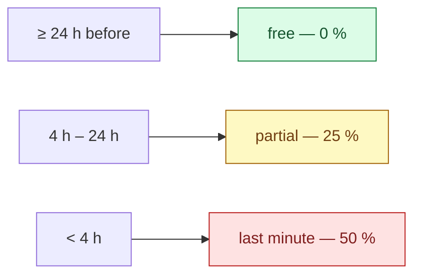

# Business rules

Every number the platform charges, pays or refuses by — and why it is that number.

A constant in a source file reads as arbitrary, so the next person changes it. Written down with its
reasoning it can be argued with, which is the only way a rule stays deliberate.

All values below are the shipped ones, read from `BookingPolicy` and the pay calculator.

## Booking window

| Rule | Value |
|---|---|
| Standard lead time | **4 h** before the cleaning starts |
| Express lead time | **2 h** — the hard floor; below this a booking is refused |
| Express surcharge | **+20 %** of the base price |
| Bookable hours | **08:00 – 20:00**, in 60-minute customer-facing windows |
| Start grace window | **60 min** — a cleaner may start a job at most this far ahead of its time |

Between 2 and 4 hours' notice a booking is accepted but carries the express surcharge. Under 2 hours
it is refused outright — not priced higher, refused.

The customer-facing window is 60 minutes; the internal scheduling grid stays at 30.

### The start grace window — 60 min, and why it is not zero {#start-grace-window}

`StartGraceWindowMinutes = 60`. Until 2026-08-22 there was **no** clock gate at all: a cleaner could
open a job booked for next Tuesday and mark it started today. Nothing downstream noticed, because the
duration a cleaner is paid for comes from the service, not from the elapsed clock — so the only visible
symptom was a customer being told their cleaner had arrived, days early.

The gate is deliberately a **grace window, not an exact time**. Cleaners arrive early; a cleaner
standing at the door at 09:50 for a 10:00 job must be able to start, and a rule that refuses them would
be one the platform loses to reality within a week. An hour is wide enough to cover early arrival and
travel, and narrow enough that "next Tuesday" is refused today.

It bounds **both** the start and the on-the-way notice, because both write to the customer's lock
screen. Late is never blocked — a job started three hours late is a real thing that happened and the
platform records it rather than refusing to.

The error is `order.too_early_to_start`, and it is the **last** rule on both commands: a cleaner who is
not assigned to the order learns that they are not assigned, and learns nothing about when it is
scheduled.

→ [ADR-0055](/decisions/adr-0055)

### Maximum booked duration — 24 h, and it is not about calendars

`MaxBookableOrderSpanHours = 24`. Read it as a **disclosure** bound rather than a scheduling one.

The booked span is a caller-chosen window pointed at the preferred-cleaner availability answer. Left
uncapped, that is a binary-search primitive over a cleaner's private schedule. It is also a crew cap:
24 h implies at most 12 seats.

> `Order.MaxOrderSpanHours = 168` is a **different** number — the overlap-scan floor. `cap ≤ floor` is
> the safety argument, and neither may move alone.

## Cancellation

The fee is a fraction of the order total, decided by how much notice the customer gives:



`CancellationFeeRateFor` is the **only** place a tier is priced.

### The "oops window"

Free cancellation within **15 minutes** of booking, regardless of how close the cleaning is —
**60 minutes** for a first-time customer. It protects against an accidental tap, and the longer
first-time window buys trust from someone who has not used the platform before.

### When the cleaner cancels or no-shows

The customer is refunded **and** credited the apology figure authored for the order's currency —
**250 CZK** on a CZK order. The credit is the apology; the refund is not.

> Implemented by the unfilled-order sweep (`CancelUnfilledOrders`) — the one no-show the platform can
> prove: the slot was reached and nobody ever took the seat. Every other version of "the cleaner did not
> arrive" rests on a missing tap, which is indistinguishable from a cleaner who turned up and forgot to
> slide to start, so no lateness detector refunds on its own, and a drop refunds nothing. The figure is
> `Currency.NoShowCredit`, authored per currency; a currency with none pays no credit and the push is
> the plain cancellation. The home page states the figure from the market, never from the translation;
> see [Money constants](#money-constants).

## Disputes {#disputes}

### The reporting window — 24 h, and it gates the guarantee rather than the door

A customer has **24 hours** from the clean to report a problem. Inside it, the platform undertakes to
put the job right — normally by refunding the part that was not done. `DisputeLimits.FilingWindowHours`
is the number, and `IsWithinFilingWindow` is the rule.

**A later dispute is still accepted.** The window decides what is *promised*, not what is *heard*. A
serious claim — something broken, something missing — has to be judged on its merits whenever it
arrives, and a hard cut-off with no override is a support team telling an honest customer that the
system will not let them. `DisputeDetails.FiledWithinWindow` carries the verdict so an admin can tell
"we promised to fix this" from "we are choosing to".

The clock runs from when the clean **ended**, or from when it was **due to start** if it never did. A
cleaner who never arrives leaves no completion time behind, and that is exactly the case the window
most needs to cover.

### What cannot be disputed

A clean that has **not happened yet**. The gate is the scheduled time, deliberately not the order
status: a no-show leaves the order sitting at `Confirmed` or `OnTheWay` with no completion to point
at, so a status gate would refuse the one case the guarantee exists for.

### One dispute at a time, not one per order

A new dispute is refused while an earlier one on that order is still open. Once it reaches a terminal
state — `Resolved` or `Closed` — the customer may raise another. Owner ruling 2026-09-05: a customer
who has a complaint settled and then finds something else is not out of options.

### Cleansia Plus

**Every Plus benefit requires an active, PAID subscription** (owner ruling 2026-09-08, T-0690). There
is no free trial: both seeded plans carry `TrialPeriodDays = 0` and the admin plan commands refuse
anything else, because a trial is by definition benefits without payment.

There are **six** benefits, not the three this page used to list:

| Benefit | What it does |
|---|---|
| Discount | 5% off every clean |
| Free-cancellation window | Widened from 24h to 4h before the cleaning |
| Express-upgrade waiver | The express surcharge is waived, N times per calendar month |
| Recurring schedules | Authoring and editing a standing booking is Plus-only |
| Preferred cleaner at booking | Request a specific cleaner when placing the order |
| Preferred cleaner re-pick | Change that choice after booking |

All six resolve through **one** entitlement predicate
(`UserMembershipRepository.EntitledForUserQuery`), so `PastDue`, `Paused`, `Cancelled`, an elapsed
period and a trialing enrolment are refused identically. That predicate is deliberately separate from
the *lifecycle* one that answers "is there a live enrolment?" — the lifecycle question is what stops a
second Stripe subscription, lets a customer cancel, and is what GDPR erasure reads.

**Plus is priced per market, and a subscription keeps its currency for life** (owner ruling
2026-09-12, [ADR-0059](/decisions/adr-0059)). A plan's price is a row per currency
(`MembershipPlanPrice`: the charge for one billing period and the Stripe Price that charges it —
CZK 199 monthly / 2 030 yearly today, no EUR rows). The Plus page, the home teaser, the wizard's Plus
step and both mobile Subscribe screens list the plans priced in the customer's **chosen market**
(`GetPlans?countryId`), and the subscribe commands carry the same `countryId`, so the figure shown is
the figure Stripe charges. Three consequences:

- **A market with no priced plan has no Plus.** The list is empty, the surfaces say *"Plus is not
  available in your market yet"* with no price and no button, and a subscribe attempt is refused as
  `membership.plan.not_priced_in_currency`. That is a valid product state, not a gate on opening the
  market — an admin may price the catalogue in EUR and leave Plus for later.
- **The subscription is born in the market's currency and never changes it.** Stripe refuses a
  currency change on a live subscription, so a plan swap picks the target plan's price in the
  membership's own currency (or refuses), the management screens label every figure with that
  currency whatever market the customer browses in now, and the switch-to-annual offer only appears
  when the yearly plan is priced in it. A customer who wants Plus in another currency cancels and
  re-subscribes in the new market — and that re-subscribe **must work** (owner ruling 2026-09-13).
  Stripe locks a Customer to the currency of its first invoice, so the platform holds **one Stripe
  Customer per currency per user** (`UserStripeCustomers`): the subscribe commands resolve the
  Customer for the market's currency — an existing row, else the legacy `User.StripeCustomerId`
  adopted when it has never billed a membership in another currency and no row claims it, else a
  new Customer. The legacy field stays for one-off order payments. Stripe's refusal is still
  classified as `membership.stripe_customer_currency_locked` ("contact support"), never a 500, as the
  backstop for a Customer locked for a reason the resolver could not see.
  → [Loyalty and memberships](/flows/loyalty-and-memberships#plus-is-priced-per-market-end-to-end)
- **The benefits are currency-free.** The discount is a percentage of the order's own subtotal, the
  cancellation window is hours and the waivers are a count, so a CZK subscription serves a EUR
  booking without conversion. The subscription's currency decides only what Stripe charges for the
  subscription.

**A lapsed membership stops the schedule.** A recurring schedule is one of the six benefits, so when the
membership lapses the sweep stops generating new occurrences. Three deliberate limits on that:

- **The template is not deleted or deactivated.** It stays exactly as authored, so resubscribing
  resumes the schedule on the next nightly tick with no action from the customer.
- **Occurrences already created run.** The sweep works a horizon ahead, so up to a week of orders may
  already exist when the lapse lands. They are real orders, possibly already authorised on a card, and
  they are left alone — retracting them is a refund path that does not exist.
- **The customer is warned before it happens**, by the existing `membership.expiring_soon`
  notification. There is no dedicated "your schedule has stopped" event yet.

## Crew size

```
RequiredEmployees = ceil(EstimatedTime / 120 minutes)
MaxEmployees      = RequiredEmployees + SpareSeatsPerOrder
```

**`SpareSeatsPerOrder` is `0`.** There is no spare seat, by owner ruling, and the reasoning is pay:
a cleaner is paid one row per assignment with **no crew-size term**, so a filled spare seat is a second
full wage against an unchanged customer price.

That single fact is also why the seat is arbitrated by a unique database index rather than by an
in-memory check — see [Offerability](/domain/offerability#seat-allocation).

## Preferred cleaner

| Rule | Value |
|---|---|
| Hold length | **10 %** of the lead time, capped at **12 h** |
| Offer rounds | at most **2** |
| Minimum open board share | **80 %** |

The last one is the constraint that keeps the feature from eating the marketplace: at least 80 % of
offerable work must stay on the open board, so preferred holds cannot starve cleaners who have no
regular customers.

## Cleaner pay

One `EmployeePayConfig` is selected per selected service **and** per selected package, then summed:

```
basePay     = Σ config.BasePay                                  # one config per service / package
extrasPay   = Σ (config.ExtraPerRoom × max(0, rooms - 1))       # the FIRST room is inside BasePay
            + Σ (config.ExtraPerBathroom × bathrooms)
expensesPay = Σ (config.DistanceRatePerKm × order.TravelDistance)

minPay      = max(config.MinimumPay > 0)     # the strongest guarantee wins; 0 = no bound
maxPay      = min(config.MaximumPay > 0)     # the tightest cap wins;        0 = no bound

TotalPay    = max(0, clamp(base + extras + expenses, minPay, maxPay) + bonus - deduction)
```

Two things that surprise people:

- **`extrasPay` is rooms and bathrooms, not the `Order.Extras` dictionary.** A separate
  `CalculateExtrasPay` does count those flags and has **no caller** on this path.
- **The clamp bounds are persisted on the pay row.** A later bonus or deduction re-clamps the same
  core identically, instead of silently dropping the clamp.

### Per-employee rates

`EmployeePayConfig.EmployeeId` is nullable: `null` is the platform-wide rate for that service or
package, non-null is an override for one cleaner. Per target id, the employee-specific config wins,
otherwise the global one.

### Rates are per currency {#rates-per-currency}

A rate is an amount **in a currency** (`EmployeePayConfig.CurrencyId`; the unique index carries it), so
every pay-coverage question is asked in one currency, and one predicate — `PayCoverage.Applies` —
answers all of them: the customer catalogue offers an entry only when it has a platform-wide rate in the
currency being browsed in; a booking is refused (`order.selected_services.invalid` /
`order.selected_package.invalid`) when its selection has no platform-wide rate in the order's currency;
a cleaner is approved only against the rates in their work country's currency; and the last
platform-wide rate for a live entry in a currency cannot be deleted
(`pay_config.last_for_live_catalogue_entry`). A rate in another currency counts for nothing —
`CalculateOrderPay` reads only rows in the order's currency, so an order admitted on a CZK rate would sit
silently unpaid in EUR. That is why the gate and the writer share the predicate rather than paraphrase
it.

The pay a cleaner earns is therefore always in the order's currency, and an invoice is one currency —
a cleaner who worked a CZK job and a EUR job in one period receives two invoices.
→ [Pay and payouts](/flows/pay-and-payouts)

### A cleaner works in one currency {#cleaner-currency}

**A cleaner is paid in the currency of the country they work in** — CZ is CZK, SK is EUR, PL is PLN
(owner ruling 2026-09-12). `Employee.WorkCountryId` resolves through `CountryConfiguration
.DefaultCurrencyCode` to a `Currency` row (`ICurrencyResolutionService.ResolveCurrencyForEmployeeAsync`),
and that one currency scopes everything the cleaner sees and does with money:

- **The board is scoped to it.** An order priced in another currency is not listed, not counted, not
  browsable and not takeable — `OrderVisibility.PayableTo` is conjoined with the preferred-cleaner
  hold into one `OpenTo` predicate that the available-jobs list, the dashboard count, the browse gate
  and `TakeOrder` all read. A take on a foreign-currency order answers `order.not_found`, the same as
  a held one: from that cleaner's side the order does not exist. A null resolved currency fails
  closed — an empty board, never every board.
- **Pay follows the order, so it follows the board.** Because a cleaner can only take orders in their
  currency, every pay row they earn is in it, and a period closes into one invoice in it. The
  per-currency invoicing above still exists for the one path that can cross the line: **an admin
  reassigning a cleaner onto an order is the deliberate override** (`AdminReassignOrder` is not
  gated), and an order the cleaner is already on stays visible to them whatever its currency.
- **My Pay and the dashboard label with it.** Every partner-facing money aggregate is filtered to the
  resolved currency and printed with its code; counts stay over all orders.
- **Approval checks the account against it.** An undeclared payout account is read as holding the
  work country's currency, never the platform default — so the normal case needs no declaration.
- **A customer can only ask for a cleaner who is paid in the order's currency.** The preferred-cleaner
  request has two terms, judged in this order: a completed order together, then the cleaner's currency
  equals the order's — the service address's country's on `CreateOrder` and `ChoosePreferredCleaner`,
  the saved address's country's on `CreateRecurringBooking` and `UpdateRecurringBooking`. Both terms
  fail as one key, `order.preferred_employee.not_eligible`, because which one failed is not the
  customer's to learn. A hold granted across currencies could only lapse: the cleaner's board would not
  show the job and their take would be refused, while the seat sat withheld for the whole hold.

**There is no fallback for a named country** (owner ruling 2026-09-12, "throw instead, 100 %"). A work
country with no `CountryConfiguration`, a blank `DefaultCurrencyCode`, or a code that names no `Currency`
row makes `CurrencyResolutionService` throw `InvalidOperationException`, naming the country and the
code — so a configuration defect fails loudly on every partner money screen, every board read and
every invoice approval for that country, instead of quietly paying the cleaner in the platform
default. Only a **null** country resolves to the platform default: an unapproved cleaner with no work
country yet, or the customer wizard before an address is known. The seed is what keeps this from ever
firing — see [Money constants](#money-constants).
→ [Pay and payouts](/flows/pay-and-payouts#approval-is-the-last-refusal)

## Charging a package and a service together

Selecting a package **and** a service that the package already includes buys that service **twice** —
it is performed twice, priced twice, and takes twice as long.

That is an owner ruling, not a bug, and the doubled crew size and duration follow from it correctly.
It must not be "fixed" with a de-duplication.

## Discounts, and the 12 % cap {#discount-cap}

Three sources can reduce a price: the customer's **loyalty tier**, their **Cleansia Plus** membership,
and a **promo code**.

Tier and Plus are **additive**, then capped at **12 % of the raw subtotal combined**. A promo code
replaces the combined figure when it is larger, and is itself uncapped because it is a per-campaign
decision.

### Why 12 %

It is an **owner ruling, not a tuning value**. The top loyalty tier is already 12 %, so stacking the
5 % Plus rate on top uncapped would be a 17 % discount, which was judged too much.

The consequence is uncomfortable and deliberate: **a subscriber already at the top tier gets nothing
extra for their money.** That reads like a bug and is not one. Raising the cap is a product decision.

> The consequence is also stated in member-facing copy on web, Android and iOS, in five locales each.
> **Change this number and that copy becomes false.**

### How the cap is shared out

When the combined Plus + tier amount would exceed the cap, both are **pro-rated down** so their sum
equals it — rather than zeroing one out — so each source's contribution stays visible on the receipt.
When a promo wins, it fully replaces the combined figure and both go to zero.

### The express-surcharge correction {#discount-express-correction}

Discount resolution happens on the **raw, pre-surcharge** subtotal and stays there: the tier floor and
the 12 % cap must be judged on the same base the quote judged them on, or a booking straddling the
floor qualifies in the wizard and loses the discount at submit.

But the price the discount comes off **carries the surcharge**. On an express order the raw figure
under-states the saving: the customer would have paid `raw × 1.2` and pays `(raw − d) × 1.2`, so they
actually saved `d × 1.2`.

Every consumer composes the amount with the surcharge-inclusive price — the mappers' original-subtotal,
the lifetime-savings sum, every client's `totalPrice − discount` — and **the order carries no express
flag for any of them to correct with**. So the correction can only be made once, before the amount is
persisted.

### Which discounts know what currency they are in

A percentage is unit-free: the tier rate, the Plus rate, the 12 % cap and a percent promo apply to an
order in any currency. The two **amounts** in this section do not — the tier floor is a number in the
platform default currency and a promo minimum is a number in the code's currency — and each is enforced
only on an order in its own currency. The rules are in [Money constants](#money-constants).

## Money constants and the default currency {#money-constants}

Prices are authored per currency and nothing converts — see [Order currency](#price-stages) — so every
constant that is an **amount** rather than a percentage is an amount in *some* currency. Each one below
says which, and what happens on an order priced in another. The pattern is deliberate: a number the
platform cannot denominate is not applied, rather than applied at the wrong scale — 250 CZK handed over
as 250 EUR is a twenty-five-fold apology.

The same rule holds on the way out. **Nothing prints a unit it was not given.** An order e-mail or a
customer receipt PDF rendered for an order whose currency row was not loaded shows the bare number with
no symbol — never "Kč" — and the two documents of record refuse outright: a cleaner's invoice PDF with
no resolved currency is not rendered (`PdfGenerationError`), and a fiscal registration for an order with
no resolved currency, or no resolved country, is not built — it lands as a recorded failed attempt on
the receipt, never as a CZK declaration to the Czech authority by default.
→ [Payment and fiscal](/flows/payment-and-fiscal#no-guessed-unit-no-guessed-regime)

**An unconfigured serviced country is a deploy-blocking defect.** Every currency the platform decides
is read off `CountryConfiguration.DefaultCurrencyCode` for a named country — the service address's on
the order side, the work country's on the cleaner side — and for a named country there is no
fallback: a missing configuration row, a blank code or a code naming no `Currency` row throws
(owner ruling 2026-09-12). Nothing in the platform writes that column; **the seed must configure a
real currency for every serviced country** (CZE → CZK, SVK → EUR, POL → PLN, GBR → GBP, USA → USD
are seeded, and every one of those codes is a seeded `Currency` row), and a
deploy that services a country without one breaks that country's bookings, boards and approvals on
first use rather than paying anyone in the platform default. → [Cleaner currency](#cleaner-currency)

**No-show credit — `Currency.NoShowCredit`.** Authored per currency on the admin currency form, like
the loyalty divisor; CZK is seeded at **250**, and EUR 10, PLN 40, GBP 9 and USD 10 are **DEV
placeholders** (owner ruling 2026-09-13 — "make it dynamic"; the seed says so, and the owner replaces
each on the currency form before that currency is activated). `CancelUnfilledOrders`
pays the order currency's figure into the customer's credit account **in that currency**; a currency
with no figure pays no credit, logs a warning, leaves the refund unaffected, and sends the plain
cancellation push rather than the one that promises the credit (owner ruling 2026-09-06 — fail closed,
never scaled from another currency's figure). It is not an activation gate: a market may open without
an apology credit. **No locale string states the figure** ([ADR-0060](/decisions/adr-0060)): the home
page's rules card carries `{{amount}}` and formats the market's `noShowCredit` in the market's
currency, or renders the refund-only sentence when the market has none. **The push names the credit
with its own currency** (owner ruling 2026-09-13): `order.no_cleaner_refunded` carries an `amount`
argument formatted on the server from the credit's currency row — the number with no trailing zeros,
a space, the symbol, "250 Kč" / "10 €" — because the credit's currency is the credit's own and the
device cannot derive it from the order; the lock-screen allow-list is `{orderNumber, count, amount}`,
with `amount` on that one key ([ADR-0025](/decisions/adr-0025) Amendment A2).
`check-booking-policy-parity.mjs` pins the *absence* of a figure and the presence of the placeholder
in every locale.

**Plus prices — `MembershipPlanPrice`.** One row per (plan, currency) carrying the charge for one
billing period and the Stripe Price id; CZK 199 / 2 030 seeded, no EUR rows. A plan with no row in a
currency is not on sale in that market; a subscription is created in the chosen market's currency and
keeps it — see [Cleansia Plus](#cleansia-plus).

**Insurance ceiling — `CountryConfiguration.InsuranceCoverageAmount`.** The one marketing figure in
customer copy (the mobile trust badge and FAQ), a number in the country's `DefaultCurrencyCode`, per
country because a policy is written per jurisdiction. Authored on the admin country form's Market
section. **CZE is seeded at 1 000 000 CZK** (owner ruling 2026-09-13: every cleaner is insured for the
amount and buys the insurance themselves); every other configuration is null, so the copy there
reads "Insured" with no figure until the owner authors that market's ceiling — SK's EUR figure is his
to write on the country form when that market opens.

**Loyalty earn — `Currency.LoyaltyPointsDivisor`.** A completed order earns
`floor(total / divisor)` in the order's currency, and the partial-refund clawback removes the same
fraction of the refund's net through the same divisor, so the two cannot disagree about what a unit of
money is worth. The divisor is authored per currency by the admin on the currency form, like a price;
CZK is seeded at **10** — the historical "1 point per 10 CZK". A currency with no divisor earns nothing
and logs; it is never scaled from another currency's rate in either direction. Because an order completed
in that state earns nothing permanently, a market cannot be switched on without a divisor and an active
one cannot have it cleared (`currency.loyalty_divisor_missing`).

**Tier floor — `LoyaltyTierConfig.MinimumOrderAmountForDiscount`.** Seeded at **1000** for every tier
that has one. It is a platform-default-currency number, enforced only on an order in that currency; on
any other currency no floor applies at all. The discount is the promise and the floor only keeps it off
trivially small orders, and comparing 1000 against a subtotal in a stronger currency would withhold the
promise from a whole market. The quote reports the floor it judged (`tierDiscountMinOrderAmount`, null
when none was judged), so the wizard states exactly the rule the order used.

**Promo minimum — `PromoCode.MinimumOrderAmount`.** A code with a minimum is bound to **one** currency:
its own `CurrencyId` when set (a fixed-amount code always has one), otherwise the platform default,
because every percent code with a minimum was authored that way. On an order in any other currency the
code is refused **before** the minimum is compared: the checkout preview (`ValidatePromoCode`, asked in
the quote's currency) answers the `CurrencyMismatch` error code, and the create path **refuses the
booking** with `promo.currency_mismatch` rather than charging a full price the customer did not consent
to. The same holds for every other reason the preview can refuse — a code that expired or hit its cap
between apply and submit is `promo.expired` / `promo.global_limit_reached` on create, never a silent
drop. Nor is a code dropped for want of an account: a redemption is recorded against a user, so an
anonymous `CreateOrder` that names a promo code is refused as `promo.requires_account` — before the
honour check, and instead of quietly charging the undiscounted price. A percent code with no minimum is
global.

**Credit sanity cap — `IssueCustomerCredit.SanityCap = 10 000`.** A typo guard on the *number* typed by
an admin issuing credit, unit-free on purpose: it caps 10 000 in whatever currency the grant names, so
in EUR it is about twenty-five times looser and catches almost nothing. Accepted — a per-currency table
for a typo guard is worse than the typo, and an admin who genuinely owes more issues it twice with both
rows in the ledger under their name.

**Stripe fixed refund fee — `CountryConfiguration.RefundStripeFixedFee`.** A number in the country's
`DefaultCurrencyCode` (6 on the CZE row means 6 CZK), deducted only from a refund whose order is in that
same currency. Since an order is priced in its address country's currency, the two agree by
construction; the guard still exists for the one way they can differ — an order stamped before the
country's configured code was re-pointed at another currency (a named country with no usable code no
longer falls through; it throws) — and there the fixed part is absorbed by the platform while the
percentage (`RefundStripeFeeRate`), being unit-free, still applies.
Both figures are dormant: no production writer sets either today, and while either is null the whole
fee — rate included — is 0.

**The standing risk.** Two of these numbers are bound to *whichever* currency is the platform
default, not to CZK by name — the tier floor, and every promo minimum on a code with no `CurrencyId`.
Promoting a different default (`SetDefaultCurrency`) silently re-denominates both: 1000 becomes 1000
of the new currency. It **no longer moves the default market**: since the 2026-09-13 ruling the
landing-page default is the configuration flagged `IsDefaultMarket`, moved only by
`PUT api/AdminCountry/{id}/default-market` ([ADR-0058](/decisions/adr-0058) amendment); the default
currency reaches the pre-selection only as the logged fallback when nothing is flagged. Promotion is
still an owner-level event, and those two items plus "flag the new default market" are the checklist
for it. (The no-show credit is not on the list — it is authored per currency and does not move.)

## What "price" means at each stage {#price-stages}

**Order currency.** An order is priced, charged and stamped in the currency of the country its
**service address** is in (owner ruling 2026-09-12). The market of an **order** is the address's
country, not the customer's preference: a customer has no currency of their own — a Czech customer
booking a Bratislava flat is quoted in EUR, and the same customer's next Prague booking is in CZK.
(The market a customer **browses** in before there is an address is a separate, chosen thing — see
[The market a customer browses in](#market) — and the address overrides it the moment there is one.)
The chain is `Address.CountryId` → `CountryConfiguration.DefaultCurrencyCode`
→ `Currency`, through `ICurrencyResolutionService.ResolveCurrencyForCountryAsync`, the same chain that
pays a cleaner in the currency of the country they work in. A `currencyId` the caller names is checked,
not trusted: it must equal the address country's, else `currency.invalid` before anything is priced.
That currency must also be one the platform can quote in — switched on and carrying at least one
catalogue price row (`ICurrencyRepository.IsOfferableAsync`) — else `currency.invalid`; a country the
platform does not service is `country.not_serviced`. Prices are authored per currency in
`ServicePrices`, `PackagePrices` and `ExtraPrices`; nothing converts, and an entry with no price row in
the order's currency is not offerable in it — the catalogue overviews withhold it for that country, and
quote and create refuse a selected service or package without one as `order.selected_services.invalid`
/ `order.selected_package.invalid` (an extra without one is dropped from the line items rather than
refused, because no extras-level error key exists). A recurring occurrence is priced in the currency
of its saved address's country. A quote that names no country yet — the wizard's first step, the home
page's quick quote — is in the **chosen market's** currency, because the clients send the market's
`countryId` until the address supplies one; a quote with no country at all (a client whose market
list failed to load) is in the platform default, and that null-country case is the **only** one the
chain defaults. A named country with no configured currency does not fall through — the resolver
throws, because the seed configures every serviced country and a gap is a deploy defect, not a market
([Money constants](#money-constants)).

## The market a customer browses in {#market}

Before there is a service address, every customer surface has a **market**: a serviced country whose
configuration names an active currency, listed by the anonymous `Market/GetOverview` read
([ADR-0058](/decisions/adr-0058), owner ruling 2026-09-12: *"customer-chosen market, defaulting to
CZ"*). The rules, in precedence order:

1. **The service address wins.** From the wizard's address step on, for a recurring schedule's saved
   address, for an existing order: the address's country decides, exactly as above, and a market
   chosen afterwards does not touch that booking.
2. **Else the chosen market.** Picked in the navbar/footer selector on the web or in Profile →
   Preferences → Market on the mobile apps, remembered per device like the language (the web keeps
   it in one cookie, `preferred_market`, so the server render and the browser agree; the mobile apps
   in their settings store), keyed by the country's ISO code so a reseed cannot invalidate it. A
   stored code is only ever compared against the list — a delisted market falls to the default.
3. **Else the default market** — the one country configuration flagged `IsDefaultMarket` (owner
   ruling 2026-09-13; CZE today, seeded). At most one row carries the flag, held by a partial unique
   index; an admin moves it with `PUT api/AdminCountry/{id}/default-market`, which refuses a country
   that is not serviced or whose configured currency is not active (`country.not_serviced`,
   `country.market_not_ready`) — a default the directory would not list is a pre-selection of nothing.
   When nothing is flagged, or the flagged country is not listed, an error is logged and the older
   rule decides: the market on the platform default currency, the lowest ISO code among several, none
   when there is none (then the first listed market is pre-selected). A pre-selection, not a pricing
   invariant.

**What reads it:** the home catalogue strips and `/services`, the quick quote and its market chip
("CZ · CZK" — the country's alpha-2 beside the currency code; a static label with one market, a
control with two or more), the property-size presets, the Plus plans and the subscribe commands (the
wizard's Plus step follows the market even inside a booking priced in the address's currency, because
a subscription belongs to the customer, not to the booking), the rewards tier-floor line (shown only
when the market's currency is the platform default, since the floor applies only there), and the copy
figures below. **What does not:** the partner and admin apps, any existing order, dispute, credit
account or invoice (each carries its own currency), and an active membership (its own currency, for
life).

**When the market list cannot be loaded** no chip and no selector render, nothing is persisted, every
reader sends no `countryId` (the platform default), prices are labelled from their own payloads, and
the list is retried on the next navigation.

**Copy figures come from the market, never from the translation** (owner ruling 2026-09-12,
[ADR-0060](/decisions/adr-0060)). A locale string carries a placeholder, never an amount or a
currency word; the client formats the market's figure in the market's currency. The two figures are
the no-show credit (per currency) and the insurance ceiling (per country), both on the market row;
the terms page states the market's currency code; a market with no figure gets the copy variant that
names none. The parity checker fails any locale that types a figure back in.

**Opening a market is data, gated twice:** the currency needs a loyalty divisor before
`ActivateCurrency` accepts it (`currency.loyalty_divisor_missing`), and a country cannot be switched
on as serviced until its configuration names an **active** currency (`country.market_not_ready`) —
otherwise the wizard would offer an address the quote cannot price. Plus prices and the copy figures
are optional steps. → [Platform expandability — the expansion path](/architecture/platform-expandability#expansion-path)

The pricing calculator returns a **raw subtotal before any user-level discount** — tier, membership or
promo. The **express surcharge is already folded in**, because the surcharge is a property of the
*slot*, not of the user, so it belongs on the pricing side rather than the discount side.

Discount-aware totals are computed downstream. The broken-out subtotals — services, packages, extras,
surcharge — exist so the booking wizard can show a transparent line-item breakdown rather than one
number.

One flag is easy to misread: *"the slot **is** inside the express window and the surcharge was
nevertheless not charged, because a membership waiver was available and applied."* Without it, a waived
booking and a booking that was never express look identical to a client — both show no surcharge — and
the customer cannot be told what their membership just saved them.

Nothing is consumed during a quote. A guest previews no waiver at all.
