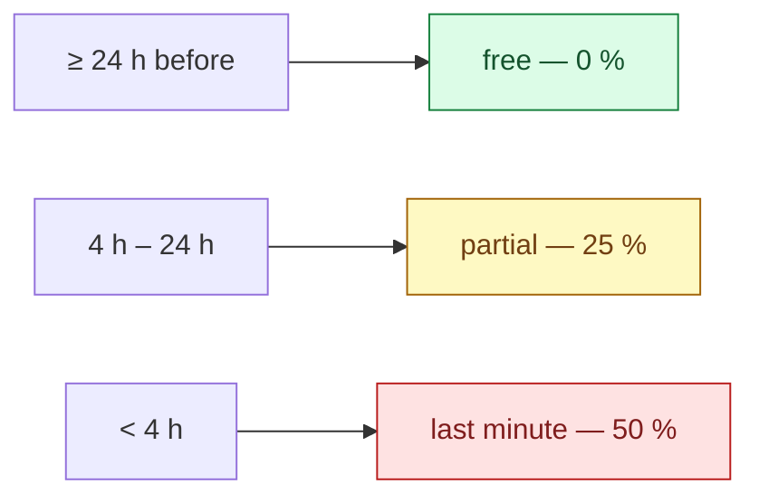

# Business rules

Every number the platform charges, pays or refuses by — and why it is that number.

A constant in a source file reads as arbitrary, so the next person changes it. Written down with its
reasoning it can be argued with, which is the only way a rule stays deliberate.

All values below are the shipped ones, read from `BookingPolicy` and the pay calculator.

## Booking window

| Rule | Value |
|---|---|
| Standard lead time | **4 h** before the cleaning starts |
| Express lead time | **2 h** — the hard floor; below this a booking is refused |
| Express surcharge | **+20 %** of the base price |
| Bookable hours | **08:00 – 20:00**, in 60-minute customer-facing windows |
| Start grace window | **60 min** — a cleaner may start a job at most this far ahead of its time |

Between 2 and 4 hours' notice a booking is accepted but carries the express surcharge. Under 2 hours
it is refused outright — not priced higher, refused.

The customer-facing window is 60 minutes; the internal scheduling grid stays at 30.

### The start grace window — 60 min, and why it is not zero {#start-grace-window}

`StartGraceWindowMinutes = 60`. Until 2026-08-22 there was **no** clock gate at all: a cleaner could
open a job booked for next Tuesday and mark it started today. Nothing downstream noticed, because the
duration a cleaner is paid for comes from the service, not from the elapsed clock — so the only visible
symptom was a customer being told their cleaner had arrived, days early.

The gate is deliberately a **grace window, not an exact time**. Cleaners arrive early; a cleaner
standing at the door at 09:50 for a 10:00 job must be able to start, and a rule that refuses them would
be one the platform loses to reality within a week. An hour is wide enough to cover early arrival and
travel, and narrow enough that "next Tuesday" is refused today.

It bounds **both** the start and the on-the-way notice, because both write to the customer's lock
screen. Late is never blocked — a job started three hours late is a real thing that happened and the
platform records it rather than refusing to.

The error is `order.too_early_to_start`, and it is the **last** rule on both commands: a cleaner who is
not assigned to the order learns that they are not assigned, and learns nothing about when it is
scheduled.

→ [ADR-0055](/decisions/adr-0055)

### Maximum booked duration — 24 h, and it is not about calendars

`MaxBookableOrderSpanHours = 24`. Read it as a **disclosure** bound rather than a scheduling one.

The booked span is a caller-chosen window pointed at the preferred-cleaner availability answer. Left
uncapped, that is a binary-search primitive over a cleaner's private schedule. It is also a crew cap:
24 h implies at most 12 seats.

> `Order.MaxOrderSpanHours = 168` is a **different** number — the overlap-scan floor. `cap ≤ floor` is
> the safety argument, and neither may move alone.

## Cancellation

The fee is a fraction of the order total, decided by how much notice the customer gives:



`CancellationFeeRateFor` is the **only** place a tier is priced.

### The "oops window"

Free cancellation within **15 minutes** of booking, regardless of how close the cleaning is —
**60 minutes** for a first-time customer. It protects against an accidental tap, and the longer
first-time window buys trust from someone who has not used the platform before.

### When the cleaner cancels or no-shows

The customer is refunded **and** credited **250 CZK**. The credit is the apology; the refund is not.

> Implemented by the unfilled-order sweep (`CancelUnfilledOrders`) — the one no-show the platform can
> prove: the slot was reached and nobody ever took the seat. Every other version of "the cleaner did not
> arrive" rests on a missing tap, which is indistinguishable from a cleaner who turned up and forgot to
> slide to start, so no lateness detector refunds on its own, and a drop refunds nothing. The credit is
> paid only on an order in the platform default currency; see [Money constants](#money-constants).

## Disputes {#disputes}

### The reporting window — 24 h, and it gates the guarantee rather than the door

A customer has **24 hours** from the clean to report a problem. Inside it, the platform undertakes to
put the job right — normally by refunding the part that was not done. `DisputeLimits.FilingWindowHours`
is the number, and `IsWithinFilingWindow` is the rule.

**A later dispute is still accepted.** The window decides what is *promised*, not what is *heard*. A
serious claim — something broken, something missing — has to be judged on its merits whenever it
arrives, and a hard cut-off with no override is a support team telling an honest customer that the
system will not let them. `DisputeDetails.FiledWithinWindow` carries the verdict so an admin can tell
"we promised to fix this" from "we are choosing to".

The clock runs from when the clean **ended**, or from when it was **due to start** if it never did. A
cleaner who never arrives leaves no completion time behind, and that is exactly the case the window
most needs to cover.

### What cannot be disputed

A clean that has **not happened yet**. The gate is the scheduled time, deliberately not the order
status: a no-show leaves the order sitting at `Confirmed` or `OnTheWay` with no completion to point
at, so a status gate would refuse the one case the guarantee exists for.

### One dispute at a time, not one per order

A new dispute is refused while an earlier one on that order is still open. Once it reaches a terminal
state — `Resolved` or `Closed` — the customer may raise another. Owner ruling 2026-09-05: a customer
who has a complaint settled and then finds something else is not out of options.

### Cleansia Plus

**Every Plus benefit requires an active, PAID subscription** (owner ruling 2026-09-08, T-0690). There
is no free trial: both seeded plans carry `TrialPeriodDays = 0` and the admin plan commands refuse
anything else, because a trial is by definition benefits without payment.

There are **six** benefits, not the three this page used to list:

| Benefit | What it does |
|---|---|
| Discount | 5% off every clean |
| Free-cancellation window | Widened from 24h to 4h before the cleaning |
| Express-upgrade waiver | The express surcharge is waived, N times per calendar month |
| Recurring schedules | Authoring and editing a standing booking is Plus-only |
| Preferred cleaner at booking | Request a specific cleaner when placing the order |
| Preferred cleaner re-pick | Change that choice after booking |

All six resolve through **one** entitlement predicate
(`UserMembershipRepository.EntitledForUserQuery`), so `PastDue`, `Paused`, `Cancelled`, an elapsed
period and a trialing enrolment are refused identically. That predicate is deliberately separate from
the *lifecycle* one that answers "is there a live enrolment?" — the lifecycle question is what stops a
second Stripe subscription, lets a customer cancel, and is what GDPR erasure reads.

**A lapsed membership stops the schedule.** A recurring schedule is one of the six benefits, so when the
membership lapses the sweep stops generating new occurrences. Three deliberate limits on that:

- **The template is not deleted or deactivated.** It stays exactly as authored, so resubscribing
  resumes the schedule on the next nightly tick with no action from the customer.
- **Occurrences already created run.** The sweep works a horizon ahead, so up to a week of orders may
  already exist when the lapse lands. They are real orders, possibly already authorised on a card, and
  they are left alone — retracting them is a refund path that does not exist.
- **The customer is warned before it happens**, by the existing `membership.expiring_soon`
  notification. There is no dedicated "your schedule has stopped" event yet.

## Crew size

```
RequiredEmployees = ceil(EstimatedTime / 120 minutes)
MaxEmployees      = RequiredEmployees + SpareSeatsPerOrder
```

**`SpareSeatsPerOrder` is `0`.** There is no spare seat, by owner ruling, and the reasoning is pay:
a cleaner is paid one row per assignment with **no crew-size term**, so a filled spare seat is a second
full wage against an unchanged customer price.

That single fact is also why the seat is arbitrated by a unique database index rather than by an
in-memory check — see [Offerability](/domain/offerability#seat-allocation).

## Preferred cleaner

| Rule | Value |
|---|---|
| Hold length | **10 %** of the lead time, capped at **12 h** |
| Offer rounds | at most **2** |
| Minimum open board share | **80 %** |

The last one is the constraint that keeps the feature from eating the marketplace: at least 80 % of
offerable work must stay on the open board, so preferred holds cannot starve cleaners who have no
regular customers.

## Cleaner pay

One `EmployeePayConfig` is selected per selected service **and** per selected package, then summed:

```
basePay     = Σ config.BasePay                                  # one config per service / package
extrasPay   = Σ (config.ExtraPerRoom × max(0, rooms - 1))       # the FIRST room is inside BasePay
            + Σ (config.ExtraPerBathroom × bathrooms)
expensesPay = Σ (config.DistanceRatePerKm × order.TravelDistance)

minPay      = max(config.MinimumPay > 0)     # the strongest guarantee wins; 0 = no bound
maxPay      = min(config.MaximumPay > 0)     # the tightest cap wins;        0 = no bound

TotalPay    = max(0, clamp(base + extras + expenses, minPay, maxPay) + bonus - deduction)
```

Two things that surprise people:

- **`extrasPay` is rooms and bathrooms, not the `Order.Extras` dictionary.** A separate
  `CalculateExtrasPay` does count those flags and has **no caller** on this path.
- **The clamp bounds are persisted on the pay row.** A later bonus or deduction re-clamps the same
  core identically, instead of silently dropping the clamp.

### Per-employee rates

`EmployeePayConfig.EmployeeId` is nullable: `null` is the platform-wide rate for that service or
package, non-null is an override for one cleaner. Per target id, the employee-specific config wins,
otherwise the global one.

### Rates are per currency {#rates-per-currency}

A rate is an amount **in a currency** (`EmployeePayConfig.CurrencyId`; the unique index carries it), so
every pay-coverage question is asked in one currency, and one predicate — `PayCoverage.Applies` —
answers all of them: the customer catalogue offers an entry only when it has a platform-wide rate in the
currency being browsed in; a booking is refused (`order.selected_services.invalid` /
`order.selected_package.invalid`) when its selection has no platform-wide rate in the order's currency;
a cleaner is approved only against the rates in their work country's currency; and the last
platform-wide rate for a live entry in a currency cannot be deleted
(`pay_config.last_for_live_catalogue_entry`). A rate in another currency counts for nothing —
`CalculateOrderPay` reads only rows in the order's currency, so an order admitted on a CZK rate would sit
silently unpaid in EUR. That is why the gate and the writer share the predicate rather than paraphrase
it.

The pay a cleaner earns is therefore always in the order's currency, and an invoice is one currency —
a cleaner who worked a CZK job and a EUR job in one period receives two invoices.
→ [Pay and payouts](/flows/pay-and-payouts)

## Charging a package and a service together

Selecting a package **and** a service that the package already includes buys that service **twice** —
it is performed twice, priced twice, and takes twice as long.

That is an owner ruling, not a bug, and the doubled crew size and duration follow from it correctly.
It must not be "fixed" with a de-duplication.

## Discounts, and the 12 % cap {#discount-cap}

Three sources can reduce a price: the customer's **loyalty tier**, their **Cleansia Plus** membership,
and a **promo code**.

Tier and Plus are **additive**, then capped at **12 % of the raw subtotal combined**. A promo code
replaces the combined figure when it is larger, and is itself uncapped because it is a per-campaign
decision.

### Why 12 %

It is an **owner ruling, not a tuning value**. The top loyalty tier is already 12 %, so stacking the
5 % Plus rate on top uncapped would be a 17 % discount, which was judged too much.

The consequence is uncomfortable and deliberate: **a subscriber already at the top tier gets nothing
extra for their money.** That reads like a bug and is not one. Raising the cap is a product decision.

> The consequence is also stated in member-facing copy on web, Android and iOS, in five locales each.
> **Change this number and that copy becomes false.**

### How the cap is shared out

When the combined Plus + tier amount would exceed the cap, both are **pro-rated down** so their sum
equals it — rather than zeroing one out — so each source's contribution stays visible on the receipt.
When a promo wins, it fully replaces the combined figure and both go to zero.

### The express-surcharge correction {#discount-express-correction}

Discount resolution happens on the **raw, pre-surcharge** subtotal and stays there: the tier floor and
the 12 % cap must be judged on the same base the quote judged them on, or a booking straddling the
floor qualifies in the wizard and loses the discount at submit.

But the price the discount comes off **carries the surcharge**. On an express order the raw figure
under-states the saving: the customer would have paid `raw × 1.2` and pays `(raw − d) × 1.2`, so they
actually saved `d × 1.2`.

Every consumer composes the amount with the surcharge-inclusive price — the mappers' original-subtotal,
the lifetime-savings sum, every client's `totalPrice − discount` — and **the order carries no express
flag for any of them to correct with**. So the correction can only be made once, before the amount is
persisted.

### Which discounts know what currency they are in

A percentage is unit-free: the tier rate, the Plus rate, the 12 % cap and a percent promo apply to an
order in any currency. The two **amounts** in this section do not — the tier floor is a number in the
platform default currency and a promo minimum is a number in the code's currency — and each is enforced
only on an order in its own currency. The rules are in [Money constants](#money-constants).

## Money constants and the default currency {#money-constants}

Prices are authored per currency and nothing converts — see [Order currency](#price-stages) — so every
constant that is an **amount** rather than a percentage is an amount in *some* currency. Each one below
says which, and what happens on an order priced in another. The pattern is deliberate: a number the
platform cannot denominate is not applied, rather than applied at the wrong scale — 250 CZK handed over
as 250 EUR is a twenty-five-fold apology.

**No-show credit — `BookingPolicy.NoShowCreditCzk = 250`.** A CZK scalar, paid by `CancelUnfilledOrders`
only on an order in the platform default currency; on any other currency the credit is skipped and
logged, the refund is unaffected, and the push sent is the plain cancellation rather than the one that
promises the credit (owner ruling 2026-09-06). It is deliberately not a per-currency lookup: the figure
is hand-written into the home page copy and both mobile pushes, five locales each — the lock-screen
loc-arg allowlist cannot interpolate it — and `check-booking-policy-parity.mjs` reads the declaration to
hold that copy to the number. A second number here would be a promise no surface makes until the
customer surfaces know their market.

**Loyalty earn — `Currency.LoyaltyPointsDivisor`.** A completed order earns
`floor(total / divisor)` in the order's currency, and the partial-refund clawback removes the same
fraction of the refund's net through the same divisor, so the two cannot disagree about what a unit of
money is worth. The divisor is authored per currency by the admin on the currency form, like a price;
CZK is seeded at **10** — the historical "1 point per 10 CZK". A currency with no divisor earns nothing
and logs; it is never scaled from another currency's rate in either direction.

**Tier floor — `LoyaltyTierConfig.MinimumOrderAmountForDiscount`.** Seeded at **1000** for every tier
that has one. It is a platform-default-currency number, enforced only on an order in that currency; on
any other currency no floor applies at all. The discount is the promise and the floor only keeps it off
trivially small orders, and comparing 1000 against a subtotal in a stronger currency would withhold the
promise from a whole market. The quote reports the floor it judged (`tierDiscountMinOrderAmount`, null
when none was judged), so the wizard states exactly the rule the order used.

**Promo minimum — `PromoCode.MinimumOrderAmount`.** A code with a minimum is bound to **one** currency:
its own `CurrencyId` when set (a fixed-amount code always has one), otherwise the platform default,
because every percent code with a minimum was authored that way. On an order in any other currency the
code is refused **before** the minimum is compared: the checkout preview (`ValidatePromoCode`) answers
the `CurrencyMismatch` error code, and the create path applies no discount rather than a wrong one. A
percent code with no minimum is global.

**Credit sanity cap — `IssueCustomerCredit.SanityCap = 10 000`.** A typo guard on the *number* typed by
an admin issuing credit, unit-free on purpose: it caps 10 000 in whatever currency the grant names, so
in EUR it is about twenty-five times looser and catches almost nothing. Accepted — a per-currency table
for a typo guard is worse than the typo, and an admin who genuinely owes more issues it twice with both
rows in the ledger under their name.

**Stripe fixed refund fee — `CountryConfiguration.RefundStripeFixedFee`.** A number in the country's
`DefaultCurrencyCode` (6 on the CZE row means 6 CZK), deducted only from a refund in that same currency.
The caller names the order's currency and the address names the country, and nothing ties the two, so
on a CZ-address order priced in EUR the fixed part is absorbed by the platform; the percentage
(`RefundStripeFeeRate`) is unit-free and still applies. Both figures are dormant: no production writer
sets either today, and while either is null the whole fee — rate included — is 0.

**The standing risk.** Three of these numbers are bound to *whichever* currency is the platform
default, not to CZK by name — the no-show credit, the tier floor, and every promo minimum on a code
with no `CurrencyId`. Promoting a different default (`SetDefaultCurrency`) silently re-denominates all
three: 250 becomes 250 of the new currency, 1000 becomes 1000. It is an owner-level event, and those
three numbers are the checklist for it.

## What "price" means at each stage {#price-stages}

**Order currency.** An order is priced and stamped in the currency the caller names on quote and on
create (`currencyId`, null = platform default) — one the platform can quote in: switched on and carrying
at least one catalogue price row (`ICurrencyRepository.IsOfferableAsync`), else `currency.invalid`.
It is not derived from the address. Prices are authored per currency in `ServicePrices`,
`PackagePrices` and `ExtraPrices`; nothing converts, and an entry with no price row in a currency is
not offerable in it. A recurring occurrence is priced in the platform default, because a template
carries no currency.

The pricing calculator returns a **raw subtotal before any user-level discount** — tier, membership or
promo. The **express surcharge is already folded in**, because the surcharge is a property of the
*slot*, not of the user, so it belongs on the pricing side rather than the discount side.

Discount-aware totals are computed downstream. The broken-out subtotals — services, packages, extras,
surcharge — exist so the booking wizard can show a transparent line-item breakdown rather than one
number.

One flag is easy to misread: *"the slot **is** inside the express window and the surcharge was
nevertheless not charged, because a membership waiver was available and applied."* Without it, a waived
booking and a booking that was never express look identical to a client — both show no surcharge — and
the customer cannot be told what their membership just saved them.

Nothing is consumed during a quote. A guest previews no waiver at all.
