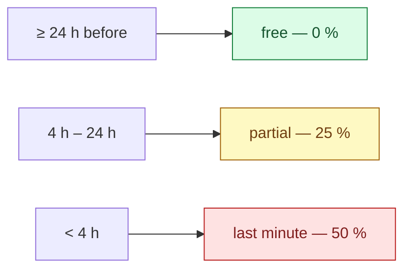

# Business rules

Every number the platform charges, pays or refuses by — and why it is that number.

A constant in a source file reads as arbitrary, so the next person changes it. Written down with its
reasoning it can be argued with, which is the only way a rule stays deliberate.

All values below are the shipped ones, read from `BookingPolicy` and the pay calculator.

## Booking window

| Rule | Value |
|---|---|
| Standard lead time | **4 h** before the cleaning starts |
| Express lead time | **2 h** — the hard floor; below this a booking is refused |
| Express surcharge | **+20 %** of the base price |
| Bookable hours | **08:00 – 20:00**, in 60-minute customer-facing windows |

Between 2 and 4 hours' notice a booking is accepted but carries the express surcharge. Under 2 hours
it is refused outright — not priced higher, refused.

The customer-facing window is 60 minutes; the internal scheduling grid stays at 30.

### Maximum booked duration — 24 h, and it is not about calendars

`MaxBookableOrderSpanHours = 24`. Read it as a **disclosure** bound rather than a scheduling one.

The booked span is a caller-chosen window pointed at the preferred-cleaner availability answer. Left
uncapped, that is a binary-search primitive over a cleaner's private schedule. It is also a crew cap:
24 h implies at most 12 seats.

> `Order.MaxOrderSpanHours = 168` is a **different** number — the overlap-scan floor. `cap ≤ floor` is
> the safety argument, and neither may move alone.

## Cancellation

The fee is a fraction of the order total, decided by how much notice the customer gives:



`CancellationFeeRateFor` is the **only** place a tier is priced.

### The "oops window"

Free cancellation within **15 minutes** of booking, regardless of how close the cleaning is —
**60 minutes** for a first-time customer. It protects against an accidental tap, and the longer
first-time window buys trust from someone who has not used the platform before.

### When the cleaner cancels or no-shows

The customer is refunded **and** credited **500 CZK**. The credit is the apology; the refund is not.

### Cleansia Plus

A membership can widen the free-cancellation window. A **trialing** member is active — they keep the
discount and the cancellation window — but earns **no** express waiver.

## Crew size

```
RequiredEmployees = ceil(EstimatedTime / 120 minutes)
MaxEmployees      = RequiredEmployees + SpareSeatsPerOrder
```

**`SpareSeatsPerOrder` is `0`.** There is no spare seat, by owner ruling, and the reasoning is pay:
a cleaner is paid one row per assignment with **no crew-size term**, so a filled spare seat is a second
full wage against an unchanged customer price.

That single fact is also why the seat is arbitrated by a unique database index rather than by an
in-memory check — see [Offerability](/domain/offerability#seat-allocation).

## Preferred cleaner

| Rule | Value |
|---|---|
| Hold length | **10 %** of the lead time, capped at **12 h** |
| Offer rounds | at most **2** |
| Minimum open board share | **80 %** |

The last one is the constraint that keeps the feature from eating the marketplace: at least 80 % of
offerable work must stay on the open board, so preferred holds cannot starve cleaners who have no
regular customers.

## Cleaner pay

One `EmployeePayConfig` is selected per selected service **and** per selected package, then summed:

```
basePay     = Σ config.BasePay                                  # one config per service / package
extrasPay   = Σ (config.ExtraPerRoom × max(0, rooms - 1))       # the FIRST room is inside BasePay
            + Σ (config.ExtraPerBathroom × bathrooms)
expensesPay = Σ (config.DistanceRatePerKm × order.TravelDistance)

minPay      = max(config.MinimumPay > 0)     # the strongest guarantee wins; 0 = no bound
maxPay      = min(config.MaximumPay > 0)     # the tightest cap wins;        0 = no bound

TotalPay    = max(0, clamp(base + extras + expenses, minPay, maxPay) + bonus - deduction)
```

Two things that surprise people:

- **`extrasPay` is rooms and bathrooms, not the `Order.Extras` dictionary.** A separate
  `CalculateExtrasPay` does count those flags and has **no caller** on this path.
- **The clamp bounds are persisted on the pay row.** A later bonus or deduction re-clamps the same
  core identically, instead of silently dropping the clamp.

### Per-employee rates

`EmployeePayConfig.EmployeeId` is nullable: `null` is the platform-wide rate for that service or
package, non-null is an override for one cleaner. Per target id, the employee-specific config wins,
otherwise the global one.

## Charging a package and a service together

Selecting a package **and** a service that the package already includes buys that service **twice** —
it is performed twice, priced twice, and takes twice as long.

That is an owner ruling, not a bug, and the doubled crew size and duration follow from it correctly.
It must not be "fixed" with a de-duplication.
