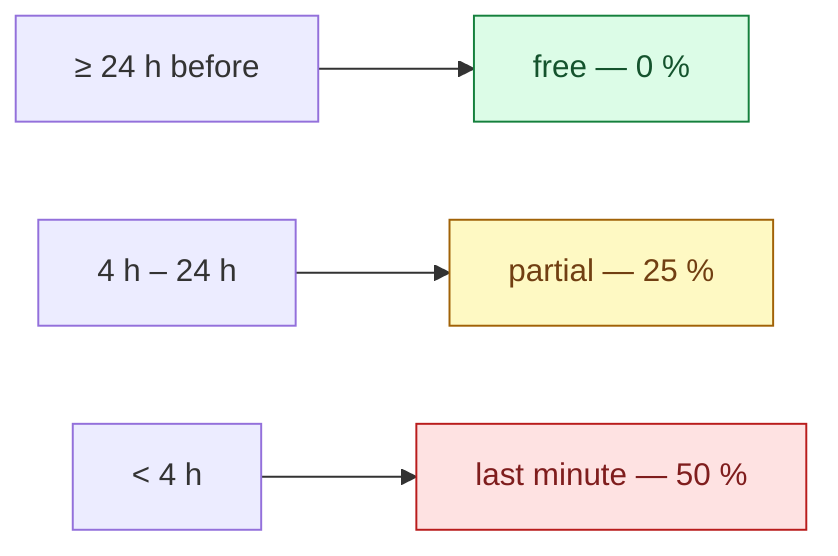

# Business rules

Every number the platform charges, pays or refuses by — and why it is that number.

A constant in a source file reads as arbitrary, so the next person changes it. Written down with its
reasoning it can be argued with, which is the only way a rule stays deliberate.

All values below are the shipped ones, read from `BookingPolicy` and the pay calculator.

## Booking window

| Rule | Value |
|---|---|
| Standard lead time | **4 h** before the cleaning starts |
| Express lead time | **2 h** — the hard floor; below this a booking is refused |
| Express surcharge | **+20 %** of the base price |
| Start time | **08:00 – 19:45**, in **15-minute** steps, read in the market's time zone — enforced by the server |
| Booking horizon | **60 days** ahead at most |
| Maximum home size | **8 rooms and 4 bathrooms** |
| Start grace window | **60 min** — a cleaner may start a job at most this far ahead of its time |

Between 2 and 4 hours' notice a booking is accepted but carries the express surcharge. Under 2 hours
it is refused outright — not priced higher, refused.

### The start-time window is the server's {#start-time-window}

**Owner ruling 2026-09-28.** Until then the range and the grid were only what the pickers offered: the
API took any minute, the iOS recurring wheel accepted 03:07, and the materialiser created same-day
occurrences that were already past or express-charged. Now one predicate, `BookingPolicy.IsBookableStart`,
answers every booking path: the start is on the `SlotGridMinutes = 15` grid, from `FirstWindowHour` (08)
up to the last slot before `LastWindowHour` (20), **read in the service address's market zone** — never
the device's — and no further ahead than `MaxBookingHorizonDays = 60`. The market zone is the address
country's `CountryConfiguration.TimeZoneId`, else the default market's, else UTC
(`TimeZoneResolution.ForMarketAsync`, the same resolution the recurring materialiser walks).

| Path | What it refuses |
|---|---|
| `CreateOrder` | a start off the grid, outside the window or past the horizon — `order.cleaning_date.outside_booking_window`, judged after the future and lead-time rules, so those keep their own keys |
| `QuoteOrder` | the same, with the same key, so a slot the platform will not book never comes back priced |
| `CreateRecurringBooking` / `UpdateRecurringBooking` | a `TimeOfDay` that is not a bookable time of day, and a `StartsOn` more than 60 days out (on an update this is an upper bound only; a past `StartsOn` is kept) |
| The recurring materialiser | an active template whose time is outside the window is **skipped** with a warning and kept as authored; and it never creates an occurrence closer than the 2 h floor |
| `ConfirmRecurringOrder` | an occurrence closer than 2 h — `order.cleaning_date.below_lead_time`, the one-off booking's own floor |

The two-hour lead-time floor and the express window still apply to the exact instant, minutes
included. The clients mirror the window and the horizon: the web's one-off slots stop at the 60-day
horizon and a start the server refuses holds the time step with its reason; Android and iOS offer the
recurring start in quarter-hours from 08:00 to 19:45.

The size limit is enforced by `CreateOrder`, `QuoteOrder`, `QuotePlusSavings`, `CreateRecurringBooking`
and `UpdateRecurringBooking`, with `order.size_exceeds_maximum` when either count exceeds its limit.
It matches the largest selection offered by the web picker. This adds upper bounds only; existing
lower-bound validation is unchanged.

### The start grace window — 60 min, and why it is not zero {#start-grace-window}

`StartGraceWindowMinutes = 60`. Until 2026-08-22 there was **no** clock gate at all: a cleaner could
open a job booked for next Tuesday and mark it started today. Nothing downstream noticed, because the
duration a cleaner is paid for comes from the service, not from the elapsed clock — so the only visible
symptom was a customer being told their cleaner had arrived, days early.

The gate is deliberately a **grace window, not an exact time**. Cleaners arrive early; a cleaner
standing at the door at 09:50 for a 10:00 job must be able to start, and a rule that refuses them would
be one the platform loses to reality within a week. An hour is wide enough to cover early arrival and
travel, and narrow enough that "next Tuesday" is refused today.

It bounds **both** the start and the on-the-way notice, because both write to the customer's lock
screen. Late is never blocked — a job started three hours late is a real thing that happened and the
platform records it rather than refusing to.

The error is `order.too_early_to_start`, and it is the **last** rule on both commands: a cleaner who is
not assigned to the order learns that they are not assigned, and learns nothing about when it is
scheduled.

→ [ADR-0055](/decisions/adr-0055)

### Maximum booked duration — 24 h, and it is not about calendars

`MaxBookableOrderSpanHours = 24`. Read it as a **disclosure** bound rather than a scheduling one.

The booked span is a caller-chosen window pointed at the preferred-cleaner availability answer. Left
uncapped, that is a binary-search primitive over a cleaner's private schedule. It is also a crew cap:
24 h implies at most 12 seats. The span judged is the booked time as the order will store it — the
level and the home's size included ([Crew size](#crew-size)) — on the quote, the Plus preview and the
booking alike (`order.span_exceeds_maximum`).

> `Order.MaxOrderSpanHours = 168` is a **different** number — the overlap-scan floor. `cap ≤ floor` is
> the safety argument, and neither may move alone.

## Cancellation

The fee is a fraction of the order total, decided by how much notice the customer gives:


```mermaid
flowchart LR
  A["≥ 24 h before"] --> F["free — 0 %"]
  B["4 h – 24 h"] --> P["partial — 25 %"]
  C["< 4 h"] --> L["last minute — 50 %"]

  classDef free fill:#dcfce7,stroke:#15803d,color:#14532d
  classDef part fill:#fef9c3,stroke:#a16207,color:#713f12
  classDef late fill:#fee2e2,stroke:#b91c1c,color:#7f1d1d
  class F free
  class P part
  class L late
```

`CancellationFeeRateFor` is the **only** place a tier is priced.

**The figures are the order's, fixed when it is booked** (owner ruling 2026-10-03). The customer terms
keep a booking under the version accepted when it was made (§19), so the five figures that price a
cancellation are frozen on the order at booking and never read from today's `BookingPolicy` again: the
free notice (`Orders.CancellationFreeHours`, 24), the partial threshold (`CancellationPartialHours`, 4),
the two rates (`CancellationPartialFeeRate` 0.25, `CancellationLastMinuteFeeRate` 0.50) and an entitled
Plus member's free notice (`CancellationPlusFreeHours`, 4 → [Cleansia Plus](#cleansia-plus)).
`OrderFactory` stamps them from `BookingPolicy.CancellationTermsAtBooking` on every booking — signed in,
guest, and each recurring occurrence when the materialiser creates it. `Order.Create` cannot be called
without them and the columns carry no database default, so a missing stamp is a build error rather than
a 0 free hours that would make the order free to cancel at any time. The resolver, the assessor behind
both cancels and both previews, the cancel's and the booking's evidence rows and the booking e-mail all
read the order's figures; a change to the ladder is a new terms version and reaches only bookings made
after it. Until 2026-10-03 every one of them read the constants at the cancel, and a Plus member's
window was the plan's, which an administrator could edit — one edit re-priced every member's open
bookings in every company.

**Who the customer is stays live.** Whether they are an entitled Plus member and whether this is their
first booking are judged at the cancel ([the oops window](#oops-window)), because the terms grant the
Plus window *"for as long as the membership is current"* (§10) and *"while you have the Cleansia Plus
benefits"* (§13): a member who lapsed since booking cancels under the standard figures, and one who
joined since under the Plus figure frozen on the order. The oops minutes are read from `BookingPolicy`
at the cancel too; they only matter in the first hour after booking.

**The order detail states the window that applies to that order** (owner ruling 2026-10-03). For a
customer, `GetOrderDetails` carries `freeCancellationHours`, resolved by `CancellationPolicyResolver`
exactly as a cancel would resolve it: the order's frozen `CancellationFreeHours`, or its
`CancellationPlusFreeHours` while the customer is an entitled Plus member at the read. The customer
web's note on the order detail reads that figure and shows no note when it is absent. Until
2026-10-03 the browser worked the note out itself, from a hard-coded 24 h and the customer's
membership. That was correct only as long as the ladder had never changed. The member is
customer-only: it is null for every other caller, and the browsing-cleaner redaction blanks it as
well, because it would reveal whether the customer has Plus.

**A booking that took no payment records no refund.** Every cancellation records the fee rate it
applied. The refund amount it records is what goes back — so on an order whose payment is still
`Pending` or `Failed` (a cash booking not yet collected, a card never charged) it is **0**, whoever
cancelled it. The fee on such an order is owed, not taken. **On a cash booking a signed-in customer
cancels late, the fee becomes a receivable** — money the customer owes the company, which refuses them
cash until it is paid or written off (owner ruling 2026-09-28 → [What a customer owes](#receivables)).
Only a customer's own cancellation and a confirmed [lockout](#lockout) carry a fee at all; on an unpaid
card order nothing collects it. The admin order detail shows both: *Cancellation fee* (the rate) and
*Fee still owed* — the whole fee on an order that took no payment, zero where the card charge covered
it. Only administrators receive those two figures. *Fee still owed* reads the order, not the
receivable, so it keeps showing the fee after the receivable is paid or written off; the Receivables
page says which. The cancellation previews (signed-in and guest) and the cancel's own response report
the same **0** refund on an order that took no payment, and the customer web, Android and iOS cancel sheets
print no refund line on a cash or unpaid booking.

Since 2026-09-28 the rule has **no cash exception**: a confirmed recurring cash occurrence stays
`Pending` until the cleaner records the cash ([Paying in cash](#cash)), so it took no payment in the
server's eyes as in the customer's, and its fee is *still owed* like any other cash booking's.

### After the booked start, the customer does not cancel {#after-the-start}

**Owner ruling 2026-09-28.** Once the booked start has passed with a cleaner on the job and nobody has
started it, self-cancel is refused — `order.start_passed_cannot_cancel`, on the signed-in and the guest
cancel and on both previews (`CancellationAssessor.BlockedReason`). Until then a customer whose cleaner
had not turned up could only cancel, and paid the 50 % last-minute fee for the platform's no-show. The
clients replace *Cancel* with **the cleaner did not arrive**, which feeds the no-show path
[below](#when-the-cleaner-cancels-or-no-shows). Before the start nothing changes; an order still
unassigned at its start stays free to cancel (the unfilled sweep owns it); an order in progress
stays refused (`order.in_progress_cannot_cancel`).

**A card refund that does not go through is owed, not lost.** When a signed-in customer's cancellation
cannot reach Stripe, or Stripe refuses the refund, the `Pending` refund row is left for the hourly re-drive,
the credit share of the order comes back at once on the refund's own key, and the cancel's response
says `refundPending: true`; the customer web reads it as a refund still pending. A guest's cancel still
fails on a Stripe transport fault so the guest can retry it. → [Refund](/flows/cancellation-refund-dispute#refund)

### A guest cancels under the same policy

The guest cancellation API needs the booking’s **access token** — the one the guest's e-mail link
carries — and accepts only a booking placed without an account. An unknown, expired or revoked token
and an account-owned booking all return the same `order.not_found` answer. `CancelGuestOrder` revokes every
token the booking had outstanding, and a token expires **30 days after the cleaning** regardless.
The preview and cancellation use the same fee assessment
as a signed-in customer: no fee while no cleaner is assigned, the oops window — 60 minutes on the
guest's first booking, 15 otherwise ([below](#oops-window)) — and the standard 24 h / 4 h fee tiers
above. A guest has no Plus free-window extension. Cancellation is refused once cleaning is under way,
completed or already cancelled, and once the booked start has passed with a cleaner on the job
([after the start](#after-the-start)); the guest then reports that the cleaner did not arrive
(`POST api/Order/ReportGuestNoShow`, the same access token).

The cancellation is confirmed by e-mail to the address stored on the booking. A refund line appears
only when a refund was successfully issued, using that refund’s actual amount; the policy refund
shown in a preview is not proof of a payment. The guest remains without an account, feed or push
notification. Assigned cleaners still receive their cancellation notice.
→ [Guest cancellation](/flows/booking-and-pricing#guest-cancellation),
[the guest access token](/flows/booking-and-pricing#guest-access-token)

### The "oops window" {#oops-window}

Free cancellation within **15 minutes** of booking — **60 minutes on a customer's first booking, and
for an entitled Plus member** — regardless of how close the cleaning is, and even after a cleaner has
taken the job. It protects against an accidental tap, or a change of mind straight after booking.

**Owner ruling 2026-09-28**, replacing the ruling of 2026-09-24 that put first-time customers at 15:
the meeting gave a new customer 60 minutes, and everyone else keeps 15.

| Customer | Oops window | Rule (`OopsWindowRule`) |
|---|---|---|
| An entitled — current, paid or inside the free trial — Plus member | **60 min** (`BookingPolicy.OopsWindowMinutesPlus`) | `Plus` |
| Anyone else, guest or account, on their **first booking** | **60 min** (`BookingPolicy.OopsWindowMinutesFirstBooking`) | `FirstBooking` |
| Everyone else — a returning guest, any account without an entitled membership (`PastDue`, `Paused`, cancelled or lapsed) | **15 min** (`BookingPolicy.OopsWindowMinutesStandard`) | `Standard` |

**Who counts as new.** The first booking ever on that **account, e-mail or phone**, in any company:
`IOrderRepository.IsFirstBookingAsync` holds when no order created before this one shares the account,
the e-mail (compared case-insensitively — `Orders.CustomerEmail` is `citext`, like `Users.Email`, and
indexed) or the phone. Guest and account bookings count against each other. An abandoned checkout does
not count: an order cancelled as `order.cancelled.payment_not_completed`, and a one-off card order whose
payment is still `Pending` or `Failed`, are ignored. One booking gets the 60 minutes, so it cannot be
farmed by cancelling and rebooking. Newness is computed from earlier orders at each call and adds no
column.

- **The order of the checks is fixed.** No cleaner on the job → free, whatever the timing. Inside the
  oops window → free. Only then do the notice tiers above price the fee. The window is inclusive: a
  cancellation at exactly 15 (or 60) minutes is still free. An entitled Plus member is judged as a
  member first; the first-booking rule is asked only when no membership answers.
- **It is resolved live, at every call.** `ICancellationPolicyResolver.ResolveForOrderAsync` answers it
  for the **order**, from the same entitlement predicate as every other Plus benefit and the
  first-booking read, for the signed-in and the guest cancel, both previews and the booking's evidence
  row alike, so a membership that lapses between the preview and the click is judged as it stands at
  the click. The minutes run from the order's creation — for a recurring occurrence, from when the
  materialiser created it. Only *who* the customer is is live; the notice figures it applies are the
  order's ([fixed at booking](#cancellation)).
- **It is minutes after booking, not hours before the cleaning.** The Plus free notice window
  (24 h → 4 h, `BookingPolicy.PlusFreeCancellationHours`, frozen on the order as
  `CancellationPlusFreeHours`) moves only the free notice window; the 60 minutes is a separate benefit
  and is never derived from it. The partial and last-minute thresholds and rates do not depend on Plus
  or a first booking.
- **Every client states the customer's own number.** The cancellation preview carries
  `oopsWindowMinutes` (15 or 60) beside the tier, and the web, Android and iOS cancellation sheets —
  signed-in and guest — print it rather than a figure of their own. The static grace copy on every
  client says 60 minutes on the first booking or with Plus, 15 otherwise.

The evidence records which window applied and why: a cancellation row carries `oopsMinutesApplied`
and `oopsRuleApplied`, a booking row `cancellationPolicyShown.oopsMinutesForThisCustomer` and
`oopsRuleForThisCustomer`, and the policy figures include `oopsMinutesFirstBooking`
→ [What is recorded about a customer](#customer-record).

### When the cleaner cancels or no-shows

The customer is refunded **and** credited the apology figure authored for the order's currency —
**250 CZK** on a CZK order. The credit is the apology; the refund is not. A guest has no credit account
and gets the refund only.

**Two ways the platform establishes it, and only one moves money without a person.**

- **Nobody ever took the seat** — the unfilled-order sweep (`CancelUnfilledOrders`), 30 minutes past the
  slot, looking back up to **168 h** (a week, so a Functions outage of days still leaves every missed
  order to the first tick after it; it was 6 h until 2026-09-28). The one no-show the platform can
  prove: there was nobody to tap.
- **An assigned cleaner did not come** (owner ruling 2026-09-28) — **an administrator confirms**. Every
  other version of "the cleaner did not arrive" rests on a missing tap, which is indistinguishable from
  a cleaner who turned up and forgot to slide to start, so no timer refunds on its own and a drop
  refunds nothing. Two things raise the question: the customer's report — signed in, a
  *service not provided* dispute, which the clients offer as *the cleaner did not arrive* once the start
  has passed ([after the start](#after-the-start)); a guest, `POST api/Order/ReportGuestNoShow` — and the
  reminder sweep, when a job with a cleaner on it (a partly filled crew included) is still `Confirmed`
  or `OnTheWay` **30 minutes after its start**. Both raise one alert, `admin.order.cleaner_not_started`,
  once per order ([Administrators are told](#admin-notifications)). Neither moves money. A guest's
  report is refused before the start (`order.start_time_not_reached`) and once a cleaner has started
  (`order.cleaner_already_started`); a signed-in customer's dispute is filed either way and raises the
  alert only in that window.
- **The administrator's confirmation** is *Cancel as a no-show* on the order detail
  (`POST api/AdminOrder/cancel-no-show`, Support and above, audited as `order.cancel.no_show`). It runs
  the sweep's own body (`CleanerNoShowCancellation`), so the two pay a customer the same: no fee, the
  whole card refund, the customer's applied credit back, the apology credit, the reason
  `order.cancelled.no_cleaner_available` (which the customer's apps render) and the outcome push. It
  also ends the live activity, releases the express waiver, tells the assigned cleaners, revokes the
  booking's loyalty points and **closes an open *service not provided* dispute** on the order. It
  refuses before the start, on a job in progress (`order.cleaner_already_started` — a cleaner who
  tapped Start after the report did arrive, and the report stands as a dispute), and on a completed or
  cancelled one.
- **One of two cleaners missing stays a dispute** the administrator settles at their discretion;
  crews are rare and never pay cash.

**The push says what happened to the money.** When the apology was issued: `order.no_cleaner_refunded`
when the card refund went through, `order.no_cleaner_refund_pending` when a card refund is owed and has
not gone through (the hourly re-drive owns it), `order.no_cleaner_nothing_charged` when the order took no
payment; all three carry the credit as `amount`. With no apology — a currency with no figure — the
plain `order.cancelled`, which promises nothing. All four render on Android and iOS and land in the
customer's inbox. A guest gets no push; the cancellation e-mail tells them what happened to the money
([When the platform cancels](#platform-cancellation)).

> The figure is `Currency.NoShowCredit`, authored per currency; a currency with none pays no credit
> and the push is the plain cancellation. The home page states the figure from the market, never from
> the translation; see [Money constants](#money-constants).
>
> **Credit the customer spent on the booking comes back exactly once.** A paid card order's full refund
> returns it on the refund's own credit leg; the cancellation returns it itself only when no refund went
> through — a cash or unpaid order, a refund Stripe refused, or Stripe unreachable — and only what is
> still outstanding (applied minus already returned). A later refund of the same order nets off credit
> already returned. The sweep commits **per order**, so an apology balance can never be written back
> over a later order's credit return. Until 2026-09-27 the sweep returned credit after a successful
> refund as well, crediting a card customer twice.

### When the customer does not let the cleaner in {#lockout}

**Owner rulings 2026-09-28 (decisions 11 and 13).** A lockout is the customer's cancellation at the
**whole price**, and the platform establishes it the way it establishes an assigned cleaner's no-show:
a person confirms it. Nothing about a closed door is provable by a timer.

1. **The cleaner reports it.** From **15 minutes past the booked start**
   (`BookingPolicy.LockoutWaitMinutes`, the wait the customer FAQ promises), a cleaner on the crew of a
   job that is not finished saves an **entrance photo** — photo type `Entrance`, accepted from
   `Confirmed` through `InProgress`, camera-only on the partner apps — and taps *I cannot get in* with a
   note of the calls they made (`POST api/Order/ReportLockout`; the note is required, at most 1 000
   characters). It is refused too early (`order.lockout.too_early`), without an entrance photo
   (`order.lockout.photo_required`), when anyone on the crew already reported it
   (`order.lockout.already_reported`), on a cancelled or completed order (`order.lockout.order_closed`)
   and to a caller off the crew (`order.not_found`). The report stamps the order (`LockoutReportedAt`,
   the reporter, `LockoutCallAttempts`) and tells the company's administrators
   (`admin.order.lockout_reported` → [Administrators are told](#admin-notifications)). **Nothing is
   cancelled or charged.** The partner web, Android and iOS open the report at start + 15 and re-read
   the wall clock when the app comes back, so a phone that slept through the wait still opens it.
2. **An administrator confirms it** — *Confirm customer lockout* on the order detail, which shows the
   report, the calls made and the entrance photo (`POST api/AdminOrder/cancel-lockout`, Support and
   above, audited as `order.cancel.lockout` with the status, the money and the report before and
   after). Refused without a report (`order.lockout.not_reported`) and on a cancelled or completed
   order; admitted on a job in progress, because a cleaner may have started at the door. The order is
   cancelled by the administrator at `BookingPolicy.LockoutFeeRate` — **100 %** — with no refund and
   the reason key `order.cancelled.customer_lockout`. The rate is the one in force at the confirmation,
   stamped on the order there (`Order.CancellationFeeRate`) and **not** frozen at booking (owner ruling
   2026-10-03): the money is the whole price — the payment kept, or a receivable for `TotalPrice` —
   whatever the constant says, so a change to it would move only the recorded rate and *Fee still
   owed*, and would come with a new terms version, which states 100 % (§15).

| The booking | What the customer pays |
|---|---|
| A card booking that was paid — signed in or guest | the payment is kept, with the credit applied to it; nothing more is ever charged |
| A signed-in customer's cash booking that took no payment | the credit applied comes back, and **the whole price is owed** as a *Lockout* receivable → [What a customer owes](#receivables) |

A guest's booking is always prepaid, so a guest keeps nothing back and is never charged beyond it
(decision 13 (a)). Either way the express waiver stays consumed, the booking's loyalty points are
revoked, the crew is told the job is off and the live activity ends. A signed-in customer gets the
`order.cancelled` push and a cancellation e-mail; a guest gets the guest cancellation e-mail. Both
e-mails carry a lockout reason line, in five locales, that states the whole price, and no refund or
*nothing charged* line. **The customer web, Android and iOS do not render
`order.cancelled.customer_lockout` yet** — the parity checker lists it as declared and not yet rendered
— so the e-mail is where the customer reads why. The Android and iOS Help FAQ state the 15-minute wait
and that a lockout costs the full price.

**Each seat on the crew is paid its full reward** (owner decision 2026-10-04), exactly what the job
would have paid it, and paid always. That includes a cash customer who never pays the price. Until
then the crew was paid half of the fee once the company had collected it.
→ [A confirmed lockout pays the seat's reward](#lockout-pay).

### When the last cleaner leaves {#crew-lost}

**A confirmed booking whose last cleaner leaves goes back to `New` and is re-offered; the customer is
told nothing; the company's administrators are** (owner ruling 2026-09-19, [ADR-0067](/decisions/adr-0067):
*"it could go back to New since 'Confirmed' means that cleaner(s) are assigned. Also I want admin know
about it as well."*). Two acts can empty a crew — a cleaner **dropping** the job, and an admin
**rejecting** a cleaner who holds future confirmed work — and both walk a `Confirmed` order back
through one domain writer, `Order.ReturnToBoardIfUnstaffed()`. A cover request removes nobody; a
reassign or a cover swap replaces. Three rules ride with it:

- **The walk-back is `Confirmed`-only; the alarm is not.** A drop is admitted at any offerable status,
  and an order dropped `OnTheWay` or `InProgress` is never walked back — a cleaner may be in the home —
  and no sweep selects it. So the administrators are told **whenever the crew empties, at any status**,
  and the notice says which (`admin.order.crew_lost`, with the cause — *the cleaner dropped it* / *the
  cleaner's account was rejected* — the order number, the slot, and *"the clean was already under way"*
  when it was). A two-seat job losing one of two cleaners keeps its status, re-advertises the seat, and
  tells nobody. → [Administrators are told](#admin-notifications)
- **An administrator cannot set `Confirmed` on an order with no crew.** The status override refuses it
  (`order.status.confirmed_needs_crew`); an administrator who wants a cleaner on the job reassigns,
  which writes `Confirmed` itself. The other forward moves — `OnTheWay`, `InProgress`, `Completed` on an
  unstaffed order — stay open, as the administrator's own audited repair of the work's state.
- **A rejection also ends the hold.** A live preferred-cleaner reservation whose beneficiary is the
  rejected cleaner is ended with the release — an order back on the board must be *on* the board — while
  a hold naming another cleaner is left alone. → [Offerability](/domain/offerability#the-preferred-cleaner-hold)

**The customer's sequence changes, and nothing new is sent** (default O-D2-1, the owner may overrule).
A drop moves no money and cancels nothing — *the customer has lost a cleaner, not their clean* — and the
slot-time sweep is still the one place the customer learns nobody came. But the next take is a
`New → Confirmed` transition again, so it sends a **second "your order is confirmed" e-mail** on top of
the assignment push it already sends: *Confirmed → silence → Confirmed again*, with the timeline's
search step current again in between and no message saying why. Accepted as stated: a new cleaner is
a new confirmation, and the e-mail is true when it is sent. No "your cleaner left, we are looking for
another" message exists.

**No invariant is claimed.** Two releases racing on one order — two same-window drops on a two-seat
job, a drop racing a rejection — can still leave `Confirmed` with nobody on it, because `CurrentStatus`
is the only concurrency token and neither commit changes it. Every sweep therefore keeps reading the
crew: `CancelUnfilledOrders` still selects `{New, Confirmed}` with no assignee, the reminders still
require one, the validators still authorise the caller by their assignment. The status is a summary;
the crew is the fact. Legacy DEV rows holding `Confirmed` with no crew are harmless for the same
reason and are not migrated. → [Order lifecycle](/domain/order-lifecycle)

### When the platform cancels {#platform-cancellation}

Four reasons exist for a cancellation nobody asked for, each a stable key the customer's apps turn into
a sentence (`OrderCancellationReasons`): the card payment never completed
(`order.cancelled.payment_not_completed` — the checkout was abandoned and the slot released), a recurring
occurrence went unconfirmed (`order.cancelled.recurring_not_confirmed`, fee-free at the lead-time
cut-off), nobody took the job by its slot or an administrator confirmed that the assigned cleaner did
not come (`order.cancelled.no_cleaner_available` — the no-show above; an admin's no-show confirmation
exposes this key, never the administrator's own words, as the reason the customer sees), and **the operating company is
closing** (`order.cancelled.company_wind_down`): the booking fell on or after the company's last day of
service, so the platform cancelled it and — on a card booking — refunded it in full, absorbing the Stripe
fee; a cash booking is simply cancelled. No fee is ever charged on a platform cancellation. →
[A company's lifecycle](#company-lifecycle). A fifth key, `order.cancelled.customer_lockout`, is not
the platform's cancellation but the customer's, written by an administrator's confirmation and exposed
like a platform reason, never as the administrator's words → [the lockout](#lockout).

**A guest is told by e-mail.** A platform cancellation of a guest booking — by an administrator, the
wind-down, or either sweep — e-mails the booking's address in its language, with the reason (from the
key, never an administrator's own words) and a money line that claims only what happened: the amount a
refund actually returned, *nothing was charged*, or *your refund is being processed*. Every link the
guest held stops working; the e-mail carries the one that still opens the booking.
→ [Guest cancellation](/flows/booking-and-pricing#guest-cancellation)

## Disputes {#disputes}

### The reporting window — 24 h, and it gates the guarantee rather than the door

A customer has **24 hours** from the clean to report a problem. Inside it, the platform undertakes to
put the job right — normally by refunding the part that was not done. `DisputeLimits.FilingWindowHours`
is the number, and `IsWithinFilingWindow` is the rule.

**A later dispute is still accepted.** The window decides what is *promised*, not what is *heard*. A
serious claim — something broken, something missing — has to be judged on its merits whenever it
arrives, and a hard cut-off with no override is a support team telling an honest customer that the
system will not let them. `DisputeDetails.FiledWithinWindow` carries the verdict so an admin can tell
"we promised to fix this" from "we are choosing to".

The clock runs from when the clean **ended**, or from when it was **due to start** if it never did. A
cleaner who never arrives leaves no completion time behind, and that is exactly the case the window
most needs to cover.

### What cannot be disputed

A clean that has **not happened yet**. The gate is the scheduled time, deliberately not the order
status: a no-show leaves the order sitting at `Confirmed` or `OnTheWay` with no completion to point
at, so a status gate would refuse the one case the guarantee exists for.

### One dispute at a time, not one per order

A new dispute is refused while an earlier one on that order is still open. Once it reaches a terminal
state — `Resolved` or `Closed` — the customer may raise another. Owner ruling 2026-09-05: a customer
who has a complaint settled and then finds something else is not out of options.

### A justified complaint is settled to the card, unless the customer chose credit {#dispute-settlement}

**Owner ruling 2026-09-28.** Credit expires and is never paid out, so an administrator may not choose
it for the customer. The customer chooses when filing: `CreateDispute` carries a
`settlementPreference` — `CardRefund` (1), the default, or `Credit` (2) — stored on the dispute
(`Dispute.SettlementPreference`) and shown to the administrator who resolves it. The customer web,
Android and iOS dispute forms ask the question with the card refund preselected; on a cash order the
web offers the money back rather than a card refund.

- **The administrator decides the amount, never the tender.** `ResolveDispute`'s `RefundAmount` is the
  settlement. With `CardRefund` it is the refund through the one refund seam, as before. With `Credit`
  and an account, it is credit in the order's currency (`CreditTransactionReason.DisputeSettlement`,
  keyed `dispute-settlement:{disputeId}`, linked to the order and the dispute), recorded as the
  dispute's `CreditReturnedAmount`. A credit settlement must be whole cents and no more than what the
  order has not already given back — card refunds, credit returned, earlier complaints settled in
  credit — else `dispute.invalid_refund_amount`; a later card settlement on the same order is held to
  what is left the same way. An erased account cannot hold credit, so its settlement goes to the card.
- **An administrator cannot settle with credit any other way.** *Issue credit* refuses the reason
  *Dispute settlement* (`credit.dispute_settlement_not_issuable`), and the admin dialog no longer offers
  it.

### A cleaner is charged for a complaint only when found at fault {#dispute-cleaner-charge}

**Owner ruling 2026-09-28.** A refund alone never reads or writes a cleaner's pay — an automatic,
proportional deduction would punish goodwill refunds and read as an algorithmic sanction. The one way a
complaint reaches a reward is the administrator's explicit finding: `ResolveDispute` takes an optional
`chargeToCleaner` — the cleaner, an amount above zero in whole cents
(`dispute.cleaner_charge_not_whole_minor_units`) and a written reason of at most 500 characters. It adds
to that cleaner's `DeductionPay` on the disputed order through the existing clamp-aware recompute and
records the link (`OrderEmployeePay.DeductionDisputeId`) and the reason (`DeductionReason`), which the
cleaner reads on their pay record in the partner web and both partner apps. It is refused before any
money moves (`dispute.cleaner_charge_not_chargeable`) when that cleaner has no pay row on the order,
or it is already on an invoice, already charged for a dispute, or smaller than the charge — an issued
self-billing document is never silently changed; the administrator then uses the existing invoice
deduction. The audit row records the cleaner and the amount, not the reason; the cleaner's erasure
anonymises the reason on the pay row.

### Cleansia Plus

**Every Plus benefit requires a current subscription, paid or inside its free trial** (owner ruling
2026-09-30, which reverses the trial half of the 2026-09-08 ruling, T-0690, under which a benefit
needed a paid period and no plan could have a trial).

#### The free trial {#plus-trial}

| Rule | Value |
|---|---|
| Trial length | **14 days** on both seeded plans, monthly and yearly — **per plan** (`MembershipPlan.TrialPeriodDays`), set by an administrator; `0` is no trial |
| What a trialing member gets | **Every** benefit below, from day one, exactly as a paying member |
| Trials per account | **One** — any earlier trial, on any enrolment, means none |
| First charge | When the trial ends, unless the member cancels before |

- **The length is the plan's, and an administrator sets it.** The plan form's *Free trial (days)* field
  is 14 on a new plan and `0` means no trial; the plan list shows each plan's days. The create and
  update commands refuse only a negative number (`validation.must_be_positive`). Production plans are
  typed into the admin console, so the seed's 14 decides nothing there.
- **Every benefit, from day one.** Stripe reports a trial as `trialing`, which the platform holds as
  `Active` with the trial's end in `UserMembership.TrialEndsAtUtc`. The entitlement predicate below
  asks only for `Active` inside the period, so the discount, both cancellation windows, the express
  waivers, recurring schedules and the preferred cleaner all apply during the trial.
- **One trial per account, and no per-card check.** Both subscribe paths — Stripe Checkout
  (`CreateCheckoutSession`) and the direct `Subscribe` — ask `MembershipTrialResolver`, which sends
  Stripe the plan's days, or **0** to a customer who has ever started a trial
  (`HasEverStartedTrialAsync`: a trial end on any of the account's enrolments, whatever its status).
  Stripe is only asked for a trial when the answer is above zero.
- **No client states a length of its own.** The web, Android and iOS read the plan's
  `trialPeriodDays` (`GetPlans`) and the customer's `trialEligible` (`GetMine`), and offer a trial only
  while the customer may still have one. A current member, a customer who has had a trial, and any
  plan at `0` days get the paid wording. The web offers the trial to a signed-out visitor; the mobile
  apps offer it only once the server has said the customer is eligible. The subscribe itself grants no
  second trial.
- **Cancelling inside the trial charges nothing.** The benefits run to the trial's end and the
  membership ends there. A first charge that fails pauses the benefits exactly as a failed renewal
  does, below.
- **A trial that ends unpaid is a lapse.** A trialing member may author a recurring schedule, so when
  the trial ends without a payment the schedule stops generating like any other lapsed membership's,
  and the member is told once (`recurring.paused` →
  [Push notifications](/architecture/push-notifications#recurring-paused)).
- **The customer terms say so.** The terms `2026-09-30` offer the 14-day trial on either plan, one per
  account, with the first charge when it ends unless cancelled before ([The legal texts](#legal-texts)).
- **A DEV database seeded before the ruling** keeps `0` days on both seeded plans, because the seed
  never updates a plan that exists; `sql-scripts/fix-plus-trial-14-days.sql` sets them to 14, and
  `execute-sql.yml` refuses it against PRO, whose plans are typed into the admin console.

There are **seven** benefits:

| Benefit | What it does |
|---|---|
| Discount | 5% off every clean |
| Free-cancellation window | Widened from 24h to 4h before the cleaning |
| Longer oops window | 60 minutes after booking to cancel free, instead of 15, on every booking — anyone's first booking gets it too → [The oops window](#oops-window) |
| Express-upgrade waiver | The express surcharge is waived, N times per calendar month |
| Recurring schedules | Authoring and editing a standing booking is Plus-only |
| Preferred cleaner at booking | Request a specific cleaner when placing the order |
| Preferred cleaner re-pick | Change that choice after booking |

**The free-cancellation window is 4 hours, a term of the customer contract** (owner ruling
2026-10-03): `BookingPolicy.PlusFreeCancellationHours`, beside the Plus oops window. The terms state it
as a figure, the same on every plan (§10, §13), so it changes only with a new terms version, and it is
frozen on each order at booking with the rest of the ladder ([Cancellation](#cancellation)). Until
then it was the plan's `FreeCancellationWindowHours`, 0–24 h, which an administrator could change on a
live plan; the field, its admin form control, its validator rule and
`membership.plan.free_cancellation_window_too_long` are gone. The customer reads (`GetPlans`,
`GetMine`) still carry `freeCancellationWindowHours`, filled from the constant, so the customer web,
Android and iOS read it unchanged. The discount and the express waivers stay per plan.

**A plan's discount and express quota are fixed once anyone has subscribed to it** (owner ruling
2026-10-03). The terms state both *for your plan when you subscribe*. From then on,
`UpdateMembershipPlan` refuses a change to `DiscountPercentage` or `ExpressUpgradesPerMonth` with
`membership.plan.benefits_locked`. The lock applies once any membership row exists for the plan, in any
status and in any company, because a plan is platform catalogue. Switching *Allows express upgrade*
either way counts as a quota change while the quota is above zero, because with the switch off a
subscriber is shown a quota of 0. Before the first subscriber both figures stay editable. The name, the
trial, the prices, and the switch on a zero quota are always editable. To make a different offer, an
administrator creates a new plan and deactivates the old one. The admin plan detail carries
`benefitsLocked`, and the form shows the two fields disabled with a note that says why. Until
2026-10-03 either edit applied to every booking made after it, by members who had subscribed on the
old figures.

All seven resolve through **one** entitlement predicate
(`UserMembershipRepository.EntitledForUserQuery`), so `PastDue`, `Paused`, `Cancelled` and an elapsed
period are refused identically, and a trialing enrolment is served like a paying one. That predicate is
deliberately separate from the *lifecycle* one that answers "is there a live enrolment?" — the
lifecycle question is what stops a second Stripe subscription, lets a customer cancel, and is what GDPR
erasure reads.

**A renewal that fails pauses the benefits and never hides the membership** (owner ruling
2026-09-28). Until then a past-due member was told they had no membership, was offered a second,
double-billed subscription and had no way to cancel. The lifecycle read
(`IUserMembershipRepository.GetLifecycleForUserAsync`) now answers a **live** enrolment — `Active`,
`PastDue` or `Paused`, within its period — while entitlement stays `Active` only:

- **The customer sees it.** `GetMyMembership` returns `hasMembership: true` with `status: PastDue`, and
  the web, Android and iOS show *payment failed, benefits paused* with a cancel; the web's benefit gates
  read an active status, not `hasMembership` alone, and Android refuses recurring authoring to a
  past-due or paused member with a paused notice. iOS hides a schedule's *Edit* from them since
  2026-10-05 ([A deactivated service or package](#deactivated-catalogue)).
- **Each failed attempt is a notice.** Stripe's `invoice.payment_failed` sends `membership.payment_failed`
  to the member, keyed on the Stripe event and non-mutable; Android and iOS carry its copy and it lands
  in the customer's inbox. A failure that lands after the member cancelled is ignored.
- **The cancel takes effect now.** An `Active` member still cancels at period end. A `PastDue` or
  `Paused` one has no paid period to run out, so `CancelMembershipSubscription` cancels the Stripe
  subscription at once (no proration, no final invoice) and voids its open invoice; the membership is
  `Cancelled` with an effective end of now. GDPR erasure and a company wind-down follow the same
  split, so Stripe stops retrying the card.
- **No second subscription while one is alive.** Both subscribe paths refuse a live enrolment
  (`membership.already_active`), and the database holds it: the `(TenantId, UserId)` unique index
  covers `Active`, `PastDue` and `Paused`. A plan swap still requires `Active`.

**Plus is priced per market, and a subscription keeps its currency for life** (owner ruling
2026-09-12, [ADR-0059](/decisions/adr-0059)). A plan's price is a row per currency
(`MembershipPlanPrice`: the charge for one billing period and the Stripe Price that charges it —
CZK 199 monthly / 2 030 yearly today, no EUR rows). The Plus page, the home teaser, the wizard's Plus
step and both mobile Subscribe screens list the plans priced in the customer's **chosen market**
(`GetPlans?countryId`), and the subscribe commands carry the same `countryId`, so the figure shown is
the figure Stripe charges. Three consequences:

- **A market with no priced plan has no Plus.** The list is empty, the surfaces say *"Plus is not
  available in your market yet"* with no price and no button, and a subscribe attempt is refused as
  `membership.plan.not_priced_in_currency`. That is a valid product state, not a gate on opening the
  market — an admin may price the catalogue in EUR and leave Plus for later.
- **The subscription is born in the market's currency and never changes it.** Stripe refuses a
  currency change on a live subscription, so a plan swap picks the target plan's price in the
  membership's own currency (or refuses), the management screens label every figure with that
  currency whatever market the customer browses in now, and the switch-to-annual offer only appears
  when the yearly plan is priced in it. A customer who wants Plus in another currency cancels and
  re-subscribes in the new market — and that re-subscribe **must work** (owner ruling 2026-09-13).
  Stripe locks a Customer to the currency of its first invoice, so the platform holds **one Stripe
  Customer per currency per user** (`UserStripeCustomers`): the subscribe commands resolve the
  Customer for the market's currency — an existing row, else the legacy `User.StripeCustomerId`
  adopted when it has never billed a membership in another currency and no row claims it, else a
  new Customer. The legacy field stays for one-off order payments. Stripe's refusal is still
  classified as `membership.stripe_customer_currency_locked` ("contact support"), never a 500, as the
  backstop for a Customer locked for a reason the resolver could not see.
  → [Loyalty and memberships](/flows/loyalty-and-memberships#plus-is-priced-per-market-end-to-end)
- **The benefits are currency-free.** The discount is a percentage of the order's own subtotal, the
  cancellation window is hours and the waivers are a count, so a CZK subscription serves a EUR
  booking without conversion. The subscription's currency decides only what Stripe charges for the
  subscription.

**A lapsed membership stops the schedule.** A recurring schedule is one of the seven benefits, so when the
membership lapses the sweep stops generating new occurrences. Three deliberate limits on that:

- **The template is not deleted or deactivated.** It stays exactly as authored, so resubscribing
  resumes the schedule on the next nightly tick with no action from the customer.
- **Occurrences already created run.** The sweep works a horizon ahead, so up to a week of orders may
  already exist when the lapse lands. They are real orders, possibly already authorised on a card, and
  they are left alone — retracting them is a refund path that does not exist.
- **The customer is warned before it happens**, by the existing `membership.expiring_soon`
  notification, and told once when it does, by `recurring.paused` — a trial that ends unpaid included
  → [Push notifications](/architecture/push-notifications#recurring-paused).

**Monthly is the nth weekday** (owner ruling 2026-09-28). A monthly schedule visits on the same
ordinal weekday every month — the 2nd Thursday stays the 2nd Thursday — which is twelve visits a year
and keeps the weekday. The ordinal is read off the first chosen weekday on or after the schedule's
start date, in the market's calendar; a schedule that began on a 5th weekday takes the **last** one,
since most months have none. Until then the materialiser added 30 days and moved to the weekday, about
a 35-day interval and ten visits a year. Every cadence is counted from the start date, never stepped
from the previous visit, so an edit — which clears the resume pointer — keeps a monthly schedule on
its weekday and a fortnightly one on its own weeks. → [Recurring bookings](/flows/booking-and-pricing#recurring-bookings)

## The dirtiness level {#dirtiness}

**Owner rulings 2026-09-28** (decisions 28–40 of the meeting plan); the rates are the owner's ruling of
2026-10-03, which lowered them from +30 % and +60 %. The customer says how dirty the home is, and that one
statement moves the price, the booked time and the cleaner pay by the same rate:

| Level | On the wire | Price | Booked time | Cleaner pay |
|---|---|---|---|---|
| Normal | `0` | — | × 1 | × 1 |
| Increased | `1` | **+15 %** | × 1.15 | × 1.15 |
| Heavy | `2` | **+30 %** | × 1.3 | × 1.3 |

`DirtinessLevel` is an integer enum, append-only on the wire, and **Normal is `0`**, so a request that
carries no level books at Normal. That default is for old clients and API callers: every shipped
booking flow — web, Android and iOS — asks as a required step of its own after the services, with the
three descriptions and the hint to pick the higher level when unsure, and picks nothing for the
customer. An unknown value is `common.invalid_enum_value` on the quote, the Plus preview, the booking,
the serving-cleaners picker and both recurring commands. The order stores the level
(`Order.DirtinessLevel`), and nothing changes it after booking. It stores the level's rate beside it
(`Order.DirtinessRate`), and [cleaner pay](#cleaner-pay) and every pay estimate read that rate, not
today's, so a later change of rate moves no booked job's pay.
→ [ADR-0069](/decisions/adr-0069)

### What the rate applies to {#dirtiness-price}

**The whole basket — packages, services and extras — inside the raw subtotal** (decision 28):

```
lines     = Σ packages + Σ services (base + per-room × (rooms + bathrooms)) + Σ extras
dirtiness = round(lines × rate(level), 2)     # BookingPolicy.DirtinessSurchargeFor, half away from zero
raw       = lines + dirtiness                 # the base the discounts come off and the 12 % cap judges
express   = raw × 0.20 on an express slot     # compounds on top: Heavy + express = × 1.56
```

The discounts come off a price that already carries the surcharge, and the tier floor and the 12 %
cap are judged on it; express is measured on top. It is the base express already used, so refunds
needed no change. The quote and the Plus preview price at the level they are asked about, and the
quote echoes it with the surcharge (`dirtinessLevel`, `dirtinessSurchargeAmount`); the booking re-prices
at the level it carries, so the quote is the charge. `OrderFactory` stores the surcharge in cents as `Order.DirtinessSurchargeAmount`,
computed from the lines it stores, so the order's terms add up
([the identity](#discount-express-correction)).

**The rates are constants** (decision 29) — `BookingPolicy.IncreasedDirtinessSurchargeRate = 0.15` and
`HeavyDirtinessSurchargeRate = 0.30` — the same in every market, like express, until a market needs
others. The customer terms state them too, so a change of rate is also a new terms version: the
2026-10-03 terms carry +15 % and +30 %, and the 2026-09-30 version keeps the rates it was accepted with. `check-booking-policy-parity.mjs` reads both and pins every copy that states them: the web mirror
constants in `booking-window.models.ts`, the web chip that renders `{{rate}}` and bakes no percentage in,
and the Android and iOS level chips and surcharge lines, each of which must state its own level's rate
and no other.

**The descriptions are client strings in five locales** (decision 30). The order stores the level, not
the words the customer read; if the on-site top-up comes to depend on that exact wording, the text moves
to a catalogue the server serves and snapshots on the order.

### Where the surcharge is shown

It is **a line of its own** wherever a price is itemised. The receipt prints *Increased* or *Heavy
dirtiness surcharge* in the receipt's language, and the fiscal request carries a *Dirtiness surcharge*
line, so the declared lines still sum to the total. The customer web, Android and iOS summaries and
order details name the level and itemise its surcharge. **A booked order's line states no rate**: the
order detail on all three says *Increased* or *Heavy dirtiness surcharge* beside the stored amount, as the
receipt does, because the order was priced at its own `DirtinessRate` and today's figure could misstate
it — the Android and iOS order details printed today's +15 % / +30 % until 2026-10-03. Their booking
confirm steps still state the rate, which at booking is the one charged. The admin order detail shows both; the partner
board flags an *Increased* or *Heavy* home and the job detail names the level. The booking and
recurring-confirmation audit rows and the company-archive order row carry the level.
→ [What the receipt says](/flows/payment-and-fiscal#what-the-receipt-says)

### A schedule carries its level {#dirtiness-recurring}

A recurring schedule has a level of its own (decision 34) — by the descriptions the customer reads, a
home cleaned once a month (last cleaned 3–6 weeks ago) is *Increased*.
`RecurringBookingTemplate.DirtinessLevel` is Normal when a client sends none, editable on update and
refused as an unknown value, and **every occurrence is priced, timed, crewed and paid at it**: the
materialiser hands it to `OrderFactory`, which stores it on the occurrence. The cash check on create and
update, the list's `requiresPaymentMethodChange` flag and the schedule's audit facts read it too, so
raising a cash schedule's level can make it a two-cleaner job the [cash rule](#cash) no longer admits.
The web, Android and iOS schedule forms ask for the level on a new schedule — the web starts with none
chosen and names it as missing on save — and keep the stored one on an edit; the web form's quote prices
at the chosen level (Normal until one is picked), and its schedule cards are quoted at their own. →
[Recurring bookings](/flows/booking-and-pricing#recurring-bookings)

### The catalogue does not charge twice

**The pet-hair extra is retired** (decision 35) — seeded inactive — because *Increased* covers a home
with pets and a pet owner would otherwise pay twice for the same effort. The deep-cleaning services stay:
they are scope, and the level applies on top of them.

### Fixed at booking {#dirtiness-fixed}

The **on-site top-up** — the cleaner finds a dirtier home than booked, and the customer, present,
approves and pays the difference — is approved in principle (decision 36) and **not built**: it waits for
the lawyer's answer to PR-10 and ships after launch. When it does it raises pay by the same rule and never
re-crews the order, so a one-cleaner cash job stays one cleaner. **Extra work on site is not offered**
(decision 37): the cleaner does the booked scope, and anything else is a new order. The cleaner brings the
supplies, included in the price (decision 38).

## Crew size

```
EstimatedTime     = ceil( Σ (service.EstimatedTime + service.MinutesPerRoom × (rooms + bathrooms))
                          × (1 + rate(level)) )       # a packaged service is counted the same way
RequiredEmployees = ceil(EstimatedTime / 120 minutes)
MaxEmployees      = RequiredEmployees + SpareSeatsPerOrder
```

**The booked time follows the home** (owner rulings 2026-09-28, decisions 32 and 39). A dirtier home is
given longer — the minutes × (1 + the level's rate), up to the next whole minute, so it is never booked
shorter than the work — and so is a bigger one: each service has **minutes per room**
(`Service.MinutesPerRoom`, edited on the admin catalogue's service form) added for every room and
bathroom, the same count its per-room price multiplies. `OrderDuration.EstimateMinutes` is the one
definition; its SQL twins sum the catalogue in the database and scale through the same
`OrderDuration.ScaleForDirtiness`.

> **Per-room minutes are 0 until the real durations are supplied.** The column is seeded 0 on every
> service and only the admin form writes it, so today an 8-room flat and a 1-room flat with the same
> services still get the same time and the same crew; only the level lengthens a job. Size scaling
> starts when the real service durations — a launch value the owner supplies (decision 77) — are typed
> into the catalogue. An order stores its `EstimatedTime` and `RequiredEmployees` at booking, so a
> catalogue edit changes the next booking and never one already made.

**The level can add a cleaner, and with it take cash away.** A 120-minute job is one cleaner; the same
job is 156 minutes at *Increased* and 192 at *Heavy*, so it needs two, and a two-cleaner job pays by card
([Paying in cash](#cash)). With the seeded catalogue a lone *General Cleaning* (120 min) is exactly that
case. The quote answers `estimatedDurationMinutes` and `requiredEmployees` at the level it priced, so
every client knows before the customer submits.

Every reader of "how long is this job" asks the same estimate: the order, the quote, the Plus preview,
the [24 h span cap](#maximum-booked-duration-24-h-and-it-is-not-about-calendars) on all three, the
preferred-cleaner picker's availability window (`GetMyServingCleaners` takes rooms, bathrooms and the
level with the slot), recurring cash eligibility, and everything that later reads the order's stored
`EstimatedTime`. A booking with a negative room or bathroom count is refused
(`validation.must_be_positive`): a negative count would shorten the job and shrink the crew.

**`SpareSeatsPerOrder` is `0`.** There is no spare seat, by owner ruling, and the reasoning is pay: a
job's pay is split across its `RequiredEmployees` seats ([Cleaner pay](#cleaner-pay)), so a filled spare
seat would be paid a seat's share on top of the whole job's pay, against an unchanged customer price.

That single fact is also why the seat is arbitrated by a unique database index rather than by an
in-memory check — see [Offerability](/domain/offerability#seat-allocation).

`OrderDuration.RequiredEmployees` is the one implementation of that formula — one cleaner per started
120 minutes, never fewer than one, so a selection with no recorded duration still sends somebody. The
order, the quote and the cash rule below all call it: 120 booked minutes is one cleaner, 121 is two.

## Paying in cash {#cash}

**Cash is taken only from a signed-in customer on a job one cleaner does alone** (owner ruling
2026-09-24). A guest pays by card; a booking whose **required** crew is two or more pays by card.

```
AllowsCash = signedIn && RequiredEmployees == 1        # BookingPolicy.AllowsCash
```

Beyond that rule, the customer's own standing decides (owner rulings 2026-09-28): no debt and at most
two open unpaid cash bookings. **No saved card is asked for, and no card is charged** (owner ruling
2026-10-04) → [Cash needs no card](#card-guarantee).

- **The crew is the server's, from the duration.** `RequiredEmployees` is computed from the selected
  services and packages, the home's size and the [dirtiness level](#dirtiness) exactly as the order will
  be staffed ([Crew size](#crew-size)) — never a count a client sends, never the assigned crew, and never
  spare seats: capacity is not a second cleaner the work needs. The command carries no duration, so
  nothing a client says can make a two-cleaner job cash-eligible — but the level it carries can make a
  one-cleaner selection a two-cleaner job, and so take cash away.
- **A refusal is `order.cash_not_available`**, on the `paymentType` field, and it comes before anything
  moves: on `CreateOrder` it is a rule in the validator's price chain, after the price match and before
  the promo rules, so a refused booking has reserved no express waiver, debited no credit, accepted no
  referral and dispatched no payment. `CreateRecurringBooking` and `UpdateRecurringBooking` refuse a cash
  template whose selection needs more than one cleaner, judged on the live catalogue; `OrderFactory`
  throws as the backstop for any caller that skips a validator.
- **Nothing already booked is converted** (owner ruling 2026-09-24). A confirmed booking keeps its
  payment type. A cash recurring template the rule now refuses is neither switched to card nor charged
  to a saved card: the materialiser **skips it** — no new occurrence — until the customer moves it to
  card or to a selection one cleaner can do, and the customer's schedule list marks it
  (`requiresPaymentMethodChange`). An unconfirmed cash occurrence the rule refuses cannot be confirmed;
  the customer cancels it — free while nobody has taken it — and corrects the template.
  → [Recurring bookings](/flows/booking-and-pricing#recurring-bookings)
- **Cash at the door follows it on a card order.** A cleaner recording cash on an order in progress
  (`MarkCashCollected`) may do so on a cash order whatever the rule says today — that booking chose cash
  when it was allowed. On a **card** order the cleaner may take cash only where the booking itself could
  have chosen it (signed-in customer, one cleaner); otherwise `order.cash_not_allowed_on_card_order`,
  checked after the Stripe repair (a card payment Stripe already settled still becomes `Paid`) and before
  any open card intent is cancelled. Either way cash is recorded only while money is still owed —
  payment `Pending` or `Failed`: a paid order answers `order.cash_already_collected`, and a refunded,
  part-refunded or disputed one `order.payment_not_outstanding`. The partner apps offer the action only in
  that window.

The customer web, Android and iOS apps ask the quote for `requiredEmployees` and read the live
sign-in: cash is disabled with the reason — not signed in, the number of cleaners the booking needs, or
no quote yet for the selection on screen — a cash choice that stops being allowed is taken away and
never replaced by card, and an ineligible cash booking is never sent. The *not signed in* reason shows
only on the web: both mobile booking flows run inside a signed-in session, so the mobile apps keep that
branch for parity but never reach it.

### Cash is paid when the cleaner records it, and the receipt comes after {#cash-handover}

**Owner rulings 2026-09-28.** A cash sale is paid at the door, so nothing about it says *paid* until the
cleaner has the money:

| Moment | What the platform writes |
|---|---|
| A cash booking is made | the order, `Pending`, and an **informational booking e-mail** — the amount to pay the cleaner in cash, the slot in market time, the address and this customer's free-cancellation window, in the booking's language, with the booking confirmation PDF attached ([durable confirmations](#durable-confirmations)). **No receipt.** A card booking gets the same e-mail, without the cash line, once its payment completes, and its receipt then too |
| A recurring cash occurrence is confirmed | `Order.CustomerConfirmedAt` — the confirmation is its own marker. The occurrence stays `Pending`, gets the same booking e-mail, and no receipt and no *payment confirmed* push. Confirming again is refused (`order.recurring_already_confirmed`) |
| The cleaner records the cash (`MarkCashCollected`) | `Paid`, who, when, and **the amount** — the server stamps the amount due (`TotalPrice − CreditAppliedAmount`) as `Order.CashCollectedAmount`; the cleaner's action stays a confirmation, with no amount to type. The same amount enters the cash ledger as cash the cleaner now holds for the company → [below](#cash-held) |
| The job is completed | the **receipt**, from the existing completion fallback: it prints the booked slot, the completion time and the cash-received time, all in market time |

- **An administrator can record the handover** the cleaner could not (`POST api/AdminOrder/record-cash`,
  audited `order.cash.record`): which assigned cleaner took it, when (not in the future and not before
  the clean could begin) and how much (above zero, whole cents — `order.cash_amount_invalid`,
  `order.cash_received_at_in_future`, `order.cash_received_at_before_clean`). Only on a cash order in
  progress or completed that still owes its money. On an order an administrator already completed, the
  receipt is issued there; an administrator's override to `Completed` issues it for a sale already
  settled in cash. The admin order detail shows who took the cash, when and how much. Either record
  enters the cash ledger, once per order.
- **A cancelled cash order is never paid, so it never gets a receipt.** The fiscal-reconciliation timer
  has no cash arm any more: it re-sends only a `Paid` order's receipt, and not while collected cash
  waits for completion.
- **Nothing restates a receipt.** The old path — a receipt issued at booking as *awaiting payment* and
  re-rendered as *paid* when the cash arrived — is deleted, key and queue branch with it.
- **A recurring cash occurrence is offered to cleaners once it is confirmed**, not once paid
  ([Offerability](/domain/offerability)); the stale-occurrence sweep and the confirm reminders select
  only occurrences still awaiting that confirmation (`Order.AwaitsCustomerConfirmation`).
→ [What the receipt says](/flows/payment-and-fiscal#what-the-receipt-says)

### Cash needs no card {#card-guarantee}

**Owner rulings 2026-09-28 (decisions 18 (a) and 24), and 2026-10-04.** A signed-in customer books cash
only while they meet two more conditions, asked in this order after the one-cleaner rule
(`CustomerCashStanding`):

| # | The customer must | Else |
|---|---|---|
| 1 | owe no operating company an open receivable → [What a customer owes](#receivables) | `order.cash_unpaid_receivable` |
| 2 | hold fewer than **2** open unpaid cash bookings (`BookingPolicy.MaxOpenUnpaidCashBookings`) | `order.cash_open_bookings_limit_reached` |

- **Where it is asked.** `CreateOrder`, `CreateRecurringBooking` and `UpdateRecurringBooking` in their
  validators — on `CreateOrder` inside the price chain, after `order.cash_not_available` and before the
  promo rules, so a refused booking has moved nothing — and `ConfirmRecurringOrder` in its handler,
  after the crew rule. Card bookings need none of it, and a guest was already refused cash.
- **Open unpaid** is cash, payment `Pending`, neither cancelled nor completed; a recurring occurrence
  counts from the customer's confirmation, and the one being confirmed does not count. The debt and the
  limit are both counted **across every operating company**. There is **no amount ceiling** (decision
  24): the one-cleaner rule already bounds the price.

**No saved card is asked for, and no card is charged** (owner ruling 2026-10-04). Until then a third
condition asked for a usable card saved in the booking's currency (`order.cash_requires_saved_card`).
The card was captured at the first cash booking, under a consent that a late-cancellation fee, a
lockout fee, unpaid cash and an approved top-up could be charged to it (decisions 16 and 17). The
condition, `CustomerCashStanding.HoldsUsableCardAsync` and the error key are gone from the server and
from every client's translations and parity lists. So is every client's capture step on the cash path:

- **The customer web** no longer opens a card-capture step from the order wizard or the schedule form,
  and no longer parks a booking or a schedule to bring the customer back after Stripe.
- **Android** no longer shows the guarantee tick on the review step, reads the saved cards when cash is
  chosen, opens a setup sheet or waits for a saved card to land.
- **iOS** no longer reads the saved cards before it books, shows the guarantee box or captures a card.

A cash slide now books at once. The two refusals that remain behave as before; on the web, a debt
refusal lists what is owed with *Pay now*. What a cash booking leaves owing is a receivable, paid through
its pay link or written off ([What a customer owes](#receivables)). The off-session charge that could
have taken it from a saved card stays switched off.

**Saved cards stay** (owner ruling 2026-10-04). A signed-in customer still keeps a card by ticking *Save
this card for my next bookings* on a card payment ([below](#save-card)), lists it and can remove it
([below](#saved-cards)). On iOS, *Save a card* under Profile → Payments still saves one through a setup
sheet, under the same consent. Nothing on the platform charges a saved card today.

#### Saving a card while paying by card {#save-card}

**Owner decision 2026-10-01.** A signed-in customer who pays a booking by card may tick *Save this card
for my next bookings*. The web offers it on the payment step and Android and iOS directly under the card
option, **unticked by default**, each with the saved-card consent sentence printed with it, and it
is the only way a card payment keeps a card:

| | Ticked | Unticked |
|---|---|---|
| Asked of Stripe | the payment, on the customer's Stripe Customer for the booking's currency, with `setup_future_usage=off_session` and the row's `SavedCardId` | the payment alone, with no `setup_future_usage` and no `SavedCardId` — on the web on no Stripe Customer, on the apps on the account's own Stripe Customer |
| Recorded before the redirect or the sheet | a `SavedCards` row with the consent evidence — `SavedCard.ConsentTextVersionInForce`, the IP and the device | no `SavedCards` row; on the apps, a Stripe Customer created and recorded on the account when it had none |
| Once the payment succeeds | the card lands on the row, the customer's earlier card in that currency is retired, and the card is listed | no card, here or at Stripe: Stripe attaches it to no Customer. An app payment stays in the history of the account's Stripe Customer it was made on |

- **The tick is the consent.** There is no second box: the sentence printed with it is the consent
  wording of the version the row records, `saved-card-draft-2026-10-05` since 2026-10-05: the card is
  saved to the account, never charged unless the customer pays with it, and can be removed at any time.
  Until then it was `card-guarantee-draft-2026-09-28`, which said the company may charge the card for a
  cash booking's fees and unpaid cash; a card saved under it keeps that version on its row, and nothing
  charges it either ([Cash needs no card](#card-guarantee), [below](#legal-texts-lag)). The web sends
  the tick as `CreateOrder`'s `saveCard`, `true` only for an offered, ticked box; the apps send it as
  `CreatePaymentIntent`'s `saveCard` (`POST api/Payment/CreatePaymentIntent`), because a mobile booking
  has no charge surface until then. Both default to `false`.
- **A guest never sees it.** The clients offer it only to a signed-in customer who chose card, and
  `CreateOrder` refuses a guest's `saveCard: true` with `saved_card.requires_account`. A cash booking
  never offers it.
- **Unticked keeps no card, on the apps too.** The web opens the booking's Checkout Session on no
  Stripe Customer. The apps' intent is opened on the account's own Stripe Customer, which
  `CreatePaymentIntent` creates and records on the account when there is none, and the response still
  carries that Customer and an ephemeral key. The booking's sheet is opened without them, because a
  sheet given them draws Stripe's own save box on an intent that keeps nothing, and a card saved through
  that box would stay on the Stripe Customer with no `SavedCards` row and no consent.
- **Until the ruling every card paid in the apps was kept.** Every PaymentIntent the apps opened, a
  booking's and a recurring occurrence's alike, asked Stripe for `setup_future_usage=off_session`
  unconditionally, so each card paid in the apps was kept on the Stripe Customer silently, with no
  `SavedCards` row and no consent. Since 2026-10-01 only a ticked intent asks for it.
- **A recurring occurrence confirmed by card offers the same tick** (owner decision 2026-10-02), off by
  default, on every client. The web sends `saveCard` with `ConfirmRecurringOrder`: ticked, the
  occurrence's Checkout Session asks Stripe to keep the card on the account's Stripe Customer and the
  row is recorded with the consent; unticked, nothing is kept. Android and iOS show the tick above
  *Confirm and pay* and after the confirm take the sheet's intent from `CreatePaymentIntent` with it:
  unticked it gets the confirm's own intent back and opens the sheet without the Customer; ticked, the
  row is recorded, the intent is replaced by a card-saving one, the old one is cancelled as `duplicate`,
  and the sheet opens on the Customer ([ADR-0070, amended 2026-10-01](/decisions/adr-0070#amended-2026-10-01)).
- **The card is the account's, the booking the market's.** A customer booking a home in another
  company's market still has the card and its Stripe Customer recorded in their own account's company,
  as their promo codes are; the booking commits in the market's.
- **A payment that never completes saves nothing.** Its row is never captured, so it is never listed and
  never counts as usable.
- **Re-opening the sheet** hands back the order's open PaymentIntent while Stripe still lets the
  customer confirm it — the same amount, the same Stripe Customer, the same tick — and records no second
  row. Anything else opens a new intent and cancels the old one with Stripe's reason `duplicate`, which
  the webhook reads as replaced and leaves the order as it is
  → [Payment and fiscal](/flows/payment-and-fiscal#saved-cards-and-receivables).

#### The saved cards {#saved-cards}

**Kept on the web, Android and iOS by owner decision 2026-10-01.** The customer web lists the cards
under **Saved cards** on `/profile`, Android and iOS under Profile → Payments
(`GET api/SavedCard/GetMine`): brand, last four, expiry and currency, at most one per currency, each with
*Remove*. A card saved either way is listed once Stripe confirms it; one still awaiting that
confirmation is not.

**No client's copy ties a card to cash** (since 2026-10-04). The customer web introduces the cards as
*Cards saved to your account*, says *No card saved.* when there is none, and *Remove* asks only to
confirm; its capture dialog and texts are gone. Android and iOS introduce the card word for word as *The
card saved to your account. It is never charged unless you pay with it, and you can remove it at any
time.* It promises no quicker payment, because no card payment offers the saved card. With no card they
say *You can save one the next time you pay by card*, and *Remove* says the card can be saved again the
same way. iOS keeps *Save a card* on the same screen; its note says only that saving charges nothing,
and its consent tick asks only to agree to saving the card. On every client the consent refusal
(`saved_card.consent_not_accepted`) asks only for that consent, where it used to ask the customer to
agree that fees and unpaid cash may be charged. Until then Android and iOS introduced the card as the
one that guarantees cash bookings, listed what could be charged to it, and with no card said a cash
booking needs one. The versioned consent sentence printed with the tick says the same since
2026-10-05 ([The texts in force and the rulings](#legal-texts-lag)).

- **Removing a card** (`DELETE api/SavedCard/Remove/{id}`, the customer's own; another's is
  `saved_card.not_found`) deactivates the row and leaves the payment method on the Stripe Customer,
  because a Plus subscription may renew on the same card; the platform charges only the card its own
  active row names. It works the same whichever way the card was saved.
- **Erasure deletes the saved cards** with the per-currency Stripe Customers they hang on.

→ [ADR-0070](/decisions/adr-0070), and its amendments of [2026-10-01](/decisions/adr-0070#amended-2026-10-01)
and [2026-10-04](/decisions/adr-0070#amended-2026-10-04)

## What a customer owes {#receivables}

**Owner rulings 2026-09-28 (decisions 17 and 18).** A **receivable** is money a customer owes a company
on one order beyond what the order collected: its kind, amount, currency, order, customer, status
(`Open`, `Paid`, `WrittenOff`) and the number of charges tried. It is the company's books: an erasure
keeps it, pseudonymous.

| Kind | Opened when | Amount |
|---|---|---|
| Cash cancellation fee | a signed-in customer cancels a cash booking that took no payment, late enough to owe a fee → [Cancellation](#cancellation) | the assessed fee |
| Lockout | an administrator confirms a lockout on a signed-in customer's cash booking that took no payment → [the lockout](#lockout) | the whole price |
| Unpaid cash, top-up | declared for decision 17; **nothing opens either yet** — the top-up waits for the on-site top-up (decision 36) | — |

A free cancellation, a card booking and a guest open none: a card booking keeps its fee out of the
refund, and a guest always prepays.

**While one is open, the customer books no cash** — with any company; card bookings stay open, since
they are prepaid (decision 18 (a)) → [Cash needs no card](#card-guarantee).

**How it is paid.**

- **Through the pay link — the only way today.** The customer's apps list what they owe
  (`GET api/Receivable/GetMine`, across companies) with *Pay now* (`POST api/Receivable/CreatePayLink/{id}`):
  a payment-mode Stripe Checkout Session for the amount that returns to the order's page. The link is
  recorded on the receivable (`PayLinkSessionId`) and handed back while Stripe still has it open; a
  closed one is replaced by a new session keyed on the old. Only an open receivable gets one
  (`receivable.not_open`); another customer's is `receivable.not_found`. The customer web shows the
  amount due on the order's page and, when cash is refused for a debt, on the payment step; Android and
  iOS under Profile → Payments.
- **By an off-session charge on the saved card — built, and switched off for good.**
  `ChargeOpenReceivables` (Functions, every 15 minutes) charges each open receivable **once** to the
  customer's usable card in its currency, with the customer absent, company by company, the attempt
  committed before the call. It does nothing unless `Payments:OffSessionChargesEnabled` is true; the
  switch is false in code and deliberately absent from `Cleansia.Functions/appsettings.json`, where a
  committed value would beat the Azure app setting. **It stays off: no card is charged** (owner ruling
  2026-10-04, replacing decision 16's *until the phase-4 terms carry the lawyer's consent wording*). The
  code is kept, not deleted. Were it switched on: it charges **only a card saved under a
  `card-guarantee-*` consent** — the consent printed with *Save this card* since
  `saved-card-draft-2026-10-05` promises the card is never charged unless the customer pays with it, so a
  card saved under that or any later consent is never charged, and the receivable stays open as for a
  customer with no card; a pay link the customer holds is closed first, and one they have already paid is
  not charged; a customer with no usable card is not charged and the receivable stays open; a frozen
  company's receivables are left out; a decline or the bank's demand for
  authentication e-mails the customer a pay link (decision 18 (a)), unless the receivable was settled or
  written off meanwhile.
- **Paid once.** Stripe's webhook settles a receivable under its own company, without touching the
  order's payment status, charge surface or refunds; a second payment of one already paid is refunded
  in full. A receivable written off and then paid anyway is paid — the money is the company's.
  → [Payment and fiscal](/flows/payment-and-fiscal#saved-cards-and-receivables)
- **Its payment earns a fee receipt** of its own, next to the order's sale receipt
  → [Payment and fiscal](/flows/payment-and-fiscal#fee-receipt); and a paid cancellation fee pays the
  crew their share → [The crew's share of a collected fee](#fee-share). A lockout's crew is paid at the
  confirmation, whether its receivable is paid or not
  → [A confirmed lockout pays the seat's reward](#lockout-pay). A paid lockout receivable asks for no
  pay (since 2026-10-04). It used to ask for the crew's pay again under the key the confirmation had
  used, which the outbox holds for at least 14 days, so the webhook's commit failed on that key's
  unique index on every Stripe retry: the payment was never recorded and the customer stayed blocked
  from cash.

**Administrators** list the company's receivables — Orders → Receivables, filtered by status, kind,
customer or order (`GET api/AdminReceivable/get-paged`, any administrator) — and write an open one off
with a required note of at most 500 characters (`POST api/AdminReceivable/write-off`, Manager and
above, audited as the sensitive `receivable.write_off`). A receivable that is not open is
`receivable.not_open`, and another company's `receivable.not_found`. A write-off lifts the cash
refusal.
→ [ADR-0070](/decisions/adr-0070)

## Preferred cleaner

| Rule | Value |
|---|---|
| Hold length | **10 %** of the lead time, capped at **12 h** |
| Offer rounds | at most **2** |
| Minimum open board share | **80 %** |

The last one is the constraint that keeps the feature from eating the marketplace: at least 80 % of
offerable work must stay on the open board, so preferred holds cannot starve cleaners who have no
regular customers.

## The legal texts {#legal-texts}

**Owner rulings 2026-09-28 on the 2026-09-27 meeting plan (decisions 45–47, 54, 61, 62 and 70), built
2026-09-29.** Each operating company sells cleaning in its own name, so every text a customer or a
cleaner is bound by names that company as the party. The texts are stored documents, one per audience,
type and market, identified by the date they apply from ([ADR-0063](/decisions/adr-0063)), and **every
one of them is our own draft until the lawyer delivers** ([below](#legal-drafts)).

| Text | Audience | In force | Who is bound, and how |
|---|---|---|---|
| Terms of service | customer | `2026-10-05` | the customer's contract with the operating company of the market the home is in, concluded at booking — a card booking once its payment completes. Accepted by the tick at registration and at booking, and again before the next booking when a newer version applies ([What is recorded about a customer](#customer-record)); shown at `/terms` |
| Privacy policy | customer | `2026-10-03` | the operating company is the controller; accepted with the terms, and again before the next booking when a newer version applies; shown at `/privacy` |
| Complaints procedure | customer | `2026-09-29` | read, never accepted; shown at `/complaints` on the customer web and linked from its footer |
| Framework cooperation agreement, self-billing agreement | employee | `2026-10-05` | the cleaner's agreements with the operating company of the market they work in, each accepted in the partner apps → [A cleaner's own documents](#cleaner-documents) |
| Data-processing agreement | employee | `2026-09-29` | the cleaner's third agreement with the same company, accepted the same way |
| Contract for work | employee | `2026-10-05` | one per seat of a job, between the operating company and the cleaner, stamped on the order at booking and accepted at the take → [The contract for work](#work-contract) |

Earlier versions stay in the database as the texts earlier customers and orders were bound by: the
terms `2026-09-14`, `2026-09-27`, `2026-09-29`, `2026-09-30` and `2026-10-03`, the privacy policy
`2026-09-14` and `2026-09-29`, the framework and self-billing agreements `2026-09-29`, and the contract
for work `2026-09-29` and `2026-09-20`, the latter naming the customer and the cleaner as its
parties. The terms `2026-09-30` differ from `2026-09-29` only where Plus is concerned: they offer the
free trial, and the Plus cancellation terms follow having the Plus benefits rather than a paid
membership ([The free trial](#plus-trial)). The terms `2026-10-03` differ from `2026-09-30` only in the
dirtiness rates, +15 % and +30 % ([The dirtiness level](#dirtiness)).

**The `2026-10-05` versions carry the owner's rulings of 2026-10-04**, and differ from the versions
they replace only there:

- **Terms of service** (from `2026-10-03`). §7 no longer makes a saved card a condition of cash, and in
  every language counts the booking being made among the two unpaid cash bookings a customer may hold
  at a time — *including this booking*, as `CustomerCashStanding` refuses a third. §8, until
  then *The saved card for cash bookings*, is *Amounts you owe*: a cash booking's cancellation fee or
  lockout price is owed and paid through its pay link in the app or on the website, cash is refused
  while it is owed but card is not, and no card is ever charged for it
  ([Cash needs no card](#card-guarantee)). §9 names the referral reward as a source of credit: the
  friend enters the code when creating their account or later on a booking, and when their first
  booking to be completed is completed within 90 days of the code being accepted, both sides receive
  the referral credit set for that booking's currency, under the section's credit rules. The company may
  take that credit back from both when the booking is refunded or the referral was not genuine, never
  more than the credit it granted nor more than the balance in that currency holds at the time — the
  smaller of the two — so no balance goes below zero ([The referral reward](#referral-credit)). §13
  and §14 send a card refund within 3 days, where they said 5 working days, and return credit at once.
- **Framework agreement** (from `2026-09-29`). §5 drops the insurance certificate from approval and adds
  the business-register check only where the company consults the register of the country the cleaner
  will work in — in Czechia ARES: the company ID (IČO) is registered there, the business has not ended
  and a trade licence is in force ([The business register](#business-register)). §8, §10 and §16
  settle after each 14-day pay period ([Pay periods are 14 days](#pay-periods)). §9 adds the extras share to the
  reward ([Cleaner pay](#cleaner-pay)) and pays a confirmed lockout the seat's full reward
  ([A confirmed lockout pays the seat's reward](#lockout-pay)); a late cancellation still pays half of
  the fee collected. §11 recommends the insurance instead of requiring it, and §16 no longer ends the
  agreement when it lapses.
- **Self-billing agreement** (from `2026-09-29`). §3 invoices after each 14-day pay period; §2 and §3
  cover jobs completed or locked out and shares of a collected late-cancellation fee.
- **Contract for work** (from `2026-09-29`). The price is paid on *the* invoice, not the monthly one; a
  confirmed lockout pays the price of the work in full, and a late cancellation the share of the fee
  collected. It applies to orders booked from 2026-10-05; an order booked earlier keeps its text.

Like every new version, the terms bring the tick back before a customer's next booking, and the two
agreements must be accepted again before a cleaner's next take ([below](#legal-drafts)).

The privacy policy `2026-10-03` differs from `2026-09-29` only in where personal-data questions go
(owner ruling 2026-10-03). The sentence under *1. The controller* that invites them, and the sentence
after the list of rights in *6. Your rights*, name `privacy@cleansia.cz` instead of the company
record's e-mail. The line that identifies the controller still prints the record's e-mail and phone,
the company's general contact. The address is written into the text, not filled from the record, so
a second operating company's market would print it too. Like any newer version, it brings the tick
back before a customer's next booking ([below](#customer-record)). It took effect on the same day as
the terms `2026-10-03`, so one tick accepts both.

### The seller is named from the company record {#company-identity}

**Decision 54.** A text never spells out the company. It carries the placeholders `companyLegalName`,
`companyRegistrationNumber` (IČO), `companySeat`, `companyEmail` and `companyPhone`, and every read
fills them from the active company record of the operator, as its receipts print it: a customer page
from the market's operator, a cleaner's own documents from the operator of the market they work in,
a contract for work from the order's operator. A value the record does not hold is left as the
placeholder, visible on the page, rather than invented. No text uses `companyVatNumber` (DIČ): the
launch company is not a VAT payer and holds no VAT number. The currency is filled the same way, from
the market — or from the order, on a contract for work.

- **Every e-mail footer** names the company its receipts name — the company of the order's market, or
  the ambient company where there is no order — instead of a fixed *Cleansia s.r.o.*; the period-end
  reminder names the company that owns the pay period.
- **The customer web footer** prints fixed contacts — `support@cleansia.cz` and the phone — and no
  longer the *IČO [IČO] · DIČ [DIČ]* placeholder line: a fixed footer for a one-company launch. The
  privacy page points questions at `privacy@cleansia.cz`, every other legal page at
  `support@cleansia.cz`.
- **`support@cleansia.cz` is the one support contact** a customer or a cleaner is shown or linked to
  (owner ruling 2026-10-02). That covers the web footer, the FAQ's *write to us*, the order detail's
  payment-help note, the partner *How jobs are offered* review line, and Help on Android and iOS. It
  also covers *Contact support* on a rejected cleaner's registration lock, and the support line of
  every e-mail. The server fills that line from one constant, whatever a template's translation row
  says. Before, the e-mails named the SendGrid sender `it@cleansia.cz`, a `.com` address or
  `info@cleansia.cz`, and Help named `info@cleansia.cz`. The sender (`SendGrid:AddressFrom`) only
  delivers mail and is never shown as the contact. Every e-mail, to a customer, a cleaner or an
  administrator, sets its Reply-To to `support@cleansia.cz` from the same constant, so pressing Reply
  writes to support, not to the sender (since 2026-10-03; before, no Reply-To was set). One other
  address is unchanged. `privacy@cleansia.cz` is the
  data-protection contact on the privacy page and in the partner GDPR copy, and since the privacy
  policy `2026-10-03` in the policy's own personal-data sentences ([above](#legal-texts)).
- **The company record's e-mail is `support@cleansia.cz` too** (owner ruling 2026-10-03). It is the
  seller's address as the record holds it, the `companyEmail` the legal texts print. The customer terms,
  privacy policy and complaints procedure and the cleaner's three agreements print it. So do the receipt
  (the company block and the footer), the payout invoice footer and the booking confirmation's seller
  section. A customer and a cleaner therefore see one address wherever the company is named. The
  development seed writes it; until then it held `info@cleansia.cz`. A DEV database seeded earlier is
  moved by `sql-scripts/fix-company-contact-placeholders.sql`, which changes only a row that still
  holds the old address; `execute-sql.yml` refuses it against PRO. Production's record is typed into
  the admin console ([The first production deploy](/deployment/ci-cd#first-production-deploy)). No
  e-mail prints the company record's e-mail or phone.
- **The seeded phone is the placeholder `<company_phone_number>`** (owner ruling 2026-10-03). It stays
  that until the real number is entered in the admin console's company form. It prints as written
  wherever the record's phone appears. A legal page shows it as text, never as a tag or a link: the
  HTML carries it escaped, `&lt;company_phone_number&gt;`, and a PDF built from a text prints the
  literal. The receipt's company block and footer, the payout invoice footer and the booking
  confirmation's seller section print the literal too. The seed used to hold `+420 123 456 789`, which
  read like a real number in the legal texts and the cleaner's agreements. The same DEV script moves
  a row that still holds it. The line the customer web footer prints and the apps' Help dials,
  +420 739 788 108, does not come from the company record and is unchanged.
- **Help in the customer apps opens the contact** (since 2026-10-03). On Android and iOS, *Email us*
  opens the mail app on `support@cleansia.cz` and *Call support* opens the dialer on
  +420 739 788 108, the line the customer web footer prints. When nothing on the phone takes the link,
  the app copies the address or the number and says so. On iOS the address is also copied, with a
  notice, when no Mail account is set up, and the link still opens the default mail app. Before, neither row did anything on Android,
  and iOS showed both as plain text. Android also offered a *Live chat* row; there is no chat, and the
  row is gone. Both apps list *Email us* first and *Call support* second, under the same titles in
  every language: iOS is the reference for this screen (owner ruling 2026-10-03). Until then Android
  listed *Call support* first, and in Czech, Slovak, Ukrainian and Russian its two titles were
  infinitives (*Napsat e-mail*, *Zavolat na podporu*) where iOS addresses the customer (*Napište nám*,
  *Zavolejte podpoře*). Since 2026-10-04 the whole screen follows iOS (owner ruling 2026-10-04): the
  same title, two sections under small upper-case labels, *Contact us* first with both rows in one card
  split by a divider, then the five questions in iOS's order, each in a card of its own. Every title,
  question, answer and notice reads as on iOS in all five languages but one, and *Email us* shows the
  address it opens. The one is the notice when the address is copied, because the two apps copy it for
  different reasons. iOS copies it when no Mail account is set up too, and its notice says *Address
  copied, in case your mail app isn't set up.* Android copies it only when no app on the phone takes
  a `mailto:` link, and its notice says *No mail app found, so the address was copied.* (since
  2026-10-04, in all five languages; until then Android gave iOS's reason, which is false there).
  `MarketCopyStringsTest` exempts exactly that key, `help_email_unavailable`, from the iOS-parity
  check, and fails if it reads as iOS's again. Before 2026-10-04 Android drew each contact row as a
  card of its own with a round icon badge, put the five questions in one card with a help icon on
  each, and worded the title and most questions and answers differently in at least one language (in
  Slovak the title read *Pomocník a podpora*, where iOS says *Pomoc a podpora*).
- **The registered name comes with the registration.** Whether the company is *Cleansia CZ s.r.o.* or
  *Cleansia s.r.o.* is written once, on the company record, and every text, receipt, confirmation and
  e-mail footer follows it; the footer's copyright line still reads *Cleansia s.r.o.*

### Every contract is confirmed on a durable medium {#durable-confirmations}

Both contracts are confirmed by e-mail with a PDF built from what the platform stored when the contract
was concluded, in five languages, through the receipt's PDF and attachment path. Each e-mail is staged
in the commit that concludes the contract, so nothing is sent for an act that did not commit.

| Contract | Sent | To | The PDF states |
|---|---|---|---|
| The customer's booking | when the terms conclude it: a cash booking when it is made, a recurring cash occurrence when the customer confirms it, a card booking once its payment completes | the e-mail on the booking, signed-in and guest alike, in the booking's language, attached to the booking e-mail | the seller from the company record (name, IČO, DIČ when it has one, seat, e-mail, phone); the customer; the booking — number, slot in market time, address, rooms and bathrooms; the price, the credit applied and how it is paid; when the contract was concluded; the terms in force for the market on the booking day, by version and SHA-256; and the request to start within the withdrawal period, with its instant and wording version ([below](#early-performance)) |
| A contract for work | at every acceptance — the take, or the cleaner's acceptance after a placement | the cleaner, in their preferred language | the operating company as the client and the cleaner as the contractor, by name and IČO; the job as frozen at acceptance; the seat's reward; when it was accepted; the version and SHA-256 of the text accepted; and the text itself |

A card booking now gets the booking e-mail too — until 2026-09-29 only a cash booking did — and the
e-mail no longer tells a card customer to pay in cash.

### Every text is our draft until the lawyer delivers {#legal-drafts}

Every text in the table above is **our own draft**, written to the owner's rulings and not yet reviewed
by the lawyer. Each opens with the draft banner (*Návrh —* in Czech and Slovak, *Draft —*, *Черновик —*,
*Чернетка —*), and **the production deploy refuses to run** while any text in force, or still to come,
carries it ([CI/CD — Deploy to PRO](/deployment/ci-cd)). The lawyer's wording arrives as a new dated
version of each text, a seed folder plus a deploy — a version in force is never edited — and a customer
accepts it before their next booking and a cleaner before their next take, while an order already booked
keeps its contract for work.

**Two more wordings are our draft, and the deploy gate does not see them.** The request to start within
the withdrawal period (`early-performance-draft-2026-09-29`) and the saved-card consent
(`saved-card-draft-2026-10-05`) are not seeded texts: they are translation strings on the web,
Android and iOS clients, keyed by the version the server records
(`Order.EarlyPerformanceConsentTextVersionInForce`, `SavedCard.ConsentTextVersionInForce`). They carry
no banner, `check-legal-drafts.mjs` reads only the seed tree, and nothing else in the production deploy
checks them — so **they have to be checked by hand before launch**. The lawyer's wording replaces each
as a new wording key on all three clients plus a bump of that constant, not a seed folder. The
off-session charge on a saved card stays switched off: since 2026-10-04 no card is charged
→ [What a customer owes](#receivables).

### The texts in force and the rulings of 2026-10-04 {#legal-texts-lag}

**No text in force lags the owner's rulings of 2026-10-04.** The seeded texts carry them since their
`2026-10-05` versions ([above](#legal-texts)): the terms of service, the framework agreement, the
self-billing agreement and the contract for work. The one wording that is not a seeded text, the consent
printed with *Save this card* on the clients, carries them since its own 2026-10-05 version:

| Consent version | Says | In force |
|---|---|---|
| `card-guarantee-draft-2026-09-28` | the card may be charged, without asking each time, for a cash booking's late-cancellation fee, lockout fee and unpaid cash, and for an approved top-up | until 2026-10-05 |
| `saved-card-draft-2026-10-05` | the card is saved to the account, is never charged unless the customer pays with it, and can be removed at any time | since 2026-10-05 |

It was reworded as a new wording key on the web, Android and iOS plus a bump of
`SavedCard.ConsentTextVersionInForce` ([above](#legal-drafts)); the old key is gone from all three. A
card saved under the old version keeps it on its row, and nothing charges it
→ [Cash needs no card](#card-guarantee).

## The contract for work {#work-contract}

**The customer's contract is with the company; the contract for work is the company's subcontract with
the cleaner** (owner ruling 2026-09-27; decisions 45 and 46, 2026-09-28; built 2026-09-29 →
[ADR-0068 §Amended 2026-09-29](/decisions/adr-0068#company-cleaner-contract)). The customer buys the
cleaning from the operating company of the market the home is in, which sells it in its own name under
its terms of service ([above](#legal-texts)). The company buys the work from a cleaner as a subcontract:
**one contract for work per seat of a job, between the company as the client and the cleaner as the
contractor**, under the framework cooperation agreement ([below](#cleaner-documents)), priced at **that
seat's reward**. There is no commission — the company keeps the margin between the customer's price and
the rewards. The cleaner is no party to the customer's contract, and the customer is no party to the
contract for work and never sees it.

The machinery is the one [ADR-0068](/decisions/adr-0068) built on 2026-09-20 for the lawyer's earlier
model, in which the contract formed between the customer and the cleaner; its parties, its price and
its readers changed on 2026-09-29, and nothing else did. Until 2026-09-20 nothing on the platform could
substantiate a claim against a cleaner: the order named no text, the take wrote a seat the next drop
deleted, and an admin's placement left the same row a cleaner's own act did.

| Rule | Value |
|---|---|
| The text an order is booked under | the **employee-audience** `WorkContract` document in force for the **address's market** on the booking day — stamped on the order once (`Orders.WorkContractDocumentId`), never changed; a booking with no text in force is **refused** (the factory throws), never booked without one. The company ↔ cleaner text is `2026-10-05`; an order booked before it keeps the text in force on its booking day, `2026-09-29` or, before that, `2026-09-20` |
| Who it names | the client through the company placeholders, filled from the company record of the order's operator when the text is shown ([above](#company-identity)); the cleaner as *you* |
| What the customer is told | the confirm step's sentence, on every client and whether or not the account already consented: the booking concludes a contract for the cleaning with the operating company of the market where the home is, under its terms of service, and the cleaner carries it out as the company's subcontractor and is no party to it — a sentence, **not a checkbox**. There is no contract-for-work page, no order-detail line and no read for the customer |
| When the acceptance forms | at the **take**: the cleaner reads the text and the job facts in the app and takes the job in one act; the take **carries the id of the exact text row** they read (`acceptedWorkContractTextId`), and a take without it is refused |
| One contract per **seat** | a take → drop → re-take is two seats and **two** contracts; a take → drop → admin re-add of the same cleaner is a new seat with **no** contract until they accept |
| An administrator places a cleaner | **no** acceptance is written — an admin cannot accept on a cleaner's behalf. The placement is an offer the cleaner may decline ([below](#placement-is-an-offer)); a cleaner who keeps it accepts from the job detail (a banner), or is refused at **Start** and at **Complete** with `contract.acceptance_required` and accepts then; a cleaner placed on an **in-progress** job can still accept before completing |
| What binds | the text row (document, version, language, hash by one join) **and a frozen snapshot of the job as shown at acceptance**: order number, date and time window, **the seat's reward** and currency — the accepting cleaner's own rates for one seat, as the board quotes them, never what the customer pays — the coarse location (*"Praha · 120"*), rooms, bathrooms, services, packages, extras. Never the street, never a name. Since 2026-10-03 the seat also keeps the job figures that reward was priced from, and is paid from them ([Cleaner pay](#cleaner-pay)) |
| A new version of the text | applies to orders **booked from its date**; an order already booked keeps its text — no re-acceptance, no "stale version" case |
| What survives | the row outlives the seat (a drop, cover, rejection or reassignment leaves it), the order's anonymisation and the cleaner's erasure — it is books, kept with the order, **never deleted** |
| Who can read an accepted contract | the cleaner who accepted it (the server still answers them after they left the job — the read is keyed on the acceptance, not the seat) and the company's administrators — with the stored facts and the text in the reader's language (the page says *accepted in Czech* when it renders another); anyone else, **the order's customer included**, is told the order does not exist. The customer hosts still mount the read, and it answers every customer that way |

**The three keys.** `contract.not_accepted` — the client sent no text id (a broken or stale client,
shown as an error); `contract.text_mismatch` — the id is not a text of *this* order's document (a
cached id from another job; the app re-fetches the text and asks again); `contract.acceptance_required`
— the caller's seat has no contract yet (a product state the app answers by opening the contract). A
full order still answers `no_available_spots` ahead of a mismatch, and a held order stays
indistinguishable from a missing one — the tick is judged before existence, the echo after everything
else.

**What each party sees.** The partner apps show the contract before every take — the facts, with the
price labelled as the reward for the seat, the text naming the operating company as the client and the
cleaner as the contractor, and on Android and iOS a *Swipe to accept the contract for work* slider
under it, on the web a tick and *Accept and take the job*; the job detail states *You accepted the
contract for work on {date}, version {version}* with **Read the contract**. The admin's order detail
says *accepted {date}, v{version}* or *contract pending* per crew member, with **Read** — and, for an
Administrator, the accepted text row's SHA-256. The customer sees none of it: until 2026-09-29 the
customer's order detail listed each acceptance and `/work-contract` published the text. **Every
acceptance is confirmed to the cleaner by e-mail with a PDF copy** ([above](#durable-confirmations));
a dispute is answered from the incident file's *Contracts for work* section plus the admin document
read's hash.

**The record, and what is kept of it.** Every acceptance carries the client it came from (partner
web or partner mobile), the IP address, the device label and the session's signed device id, like
every other legal act on the platform. It writes `employee.order.contract_accepted` on the order's
timeline, prints in the incident file, is in the cleaner's own data export in full, and goes into a
company's archive bundle without the IP and device; the customer's export carries no contract-for-work
entries (until 2026-09-29 it listed the order's document version and each acceptance's date, version
and language). **Retention of the request metadata — 3 years per row, per company**
(`retention.work_contract_metadata.years`, the tenth window in the table below): the IP address,
device label and device id are blanked three years after the acceptance, or at the cleaner's erasure,
whichever comes first; the acceptance itself, the text it names and the facts stay. Nothing is written
for a cleaner already on a crew when this shipped (DEV only, no backfill).

**Open with the lawyer** (defaults in force, [ADR-0068](/decisions/adr-0068) §Open questions): the
wording of the text itself, which is our draft ([above](#legal-drafts)); the web gesture (a tick, not a
slider); whether a swipe forms the contract or a qualified signature is needed (the swipe; Signi is
the upgrade path); and the coarse location on a permanent row. The *cena díla* is answered — the seat's
reward — and so is how the parties are named: the company from its record, the cleaner by name and IČO
on the PDF copy.

### An administrator's placement is an offer {#placement-is-an-offer}

**Owner ruling 2026-09-28**, which answers ADR-0068's open question on forcing a crew member. An
administrator may still place a cleaner on a job (`AdminReassignOrder`), and the placed cleaner still
accepts the contract for work before Start or Complete — but the placement is an **offer the cleaner
may decline without consequence**: a drop costs nothing and feeds no metric (`DropOrder` writes only its
audit row, which only the action timeline reads). A placement is refused while the cleaner has not
accepted the cleaner documents in force ([below](#cleaner-documents)), exactly as their own take would
be.

**Taking someone off needs a written reason, and they see it.** A reassignment that removes a cleaner
is refused without `removalReason` (`order.reassign.removal_reason_required`, at most 500 characters).
The reason goes on the audit row's own column; the removed cleaner's `order.assignment_revoked` notice
carries only the order, and the cleaner reads the reason by asking for it (`GetMyAssignmentRemoval`) —
shown above the job on the partner web and both partner apps. **A weekly job limit carries a reason
too**: setting a cap without one is refused (`employee.weekly_limit_reason_required`), the reason is
cleared with the cap and at erasure, and the cleaner sees the cap and its reason on their profile.

A partner-facing page, **How jobs are offered**, states the rules behind the board — the order of the
list, the favourite-cleaner hold, the notification radius, the automatic steps (including the
not-started alert), that no score decides access, how approval works, and a human address for a review
— linked from the partner web's sidebar and from both partner apps.

## A cleaner's own documents {#cleaner-documents}

**Owner ruling 2026-09-28: an in-app click-through, versioned, enforced at approval and at every take.**
A cleaner accepts three documents of their own — the **framework contract**
(`LegalDocumentType.CleanerFrameworkContract`), the **self-billing agreement** (`SelfBillingAgreement`)
and the **data-processing agreement** (`CleanerDataProcessingAgreement`) — stored as employee-audience
legal documents per market, like the customer terms. **All three are in force since 2026-09-29**, as
our own drafts ([The legal texts](#legal-drafts)), for every market, so the gates below are live: a
cleaner who has not accepted the three is not approved, takes no job and is not placed. A market with
no text in force would gate nothing.

- **What the drafts say.** *The framework cooperation agreement:* the company is the operating company
  of the market the cleaner works in — until they are approved, of the market their address is in — and
  the cleaner a self-employed contractor; the company sells cleaning in its own name and buys the work
  as a subcontract at the reward, with **no commission**; each job is its own contract for work
  ([above](#work-contract)); the cleaner is free to take no job and to work for anyone; rewards are
  settled after each 14-day pay period on an invoice the company issues in the cleaner's name, with the
  cash they hold for the company set off ([below](#cash-held)); a confirmed lockout pays the seat's full
  reward; an administrator's placement is an offer they may decline
  without consequence ([above](#placement-is-an-offer)); the rules of *How jobs are offered*; approval
  after a business-register check, with liability insurance recommended, not required
  ([Insurance ceiling](#money-constants)); a promise not
  to work directly for customers met through the platform, for 12 months after the last job, and **no
  non-compete**; and **one** contractual penalty per breach — ten times the reward for the last job
  for that customer — instead of stacked sums. *The self-billing agreement:* the company issues the
  cleaner's invoices in their name, for a supplier who is not a VAT payer. *The data-processing
  agreement:* the cleaner processes customer data and home photos for the company, keeps no copies —
  job photos only through the app's camera — and loses access 24 hours after completion
  ([Photos](#photos-and-access)), with one penalty for intentional or grossly negligent misuse.
  That is the framework and self-billing agreements `2026-10-05`. Their `2026-09-29` versions settled
  monthly, required the insurance certificate for approval and paid a lockout half of the fee collected
  ([The legal texts](#legal-texts)).

- **Reading and accepting.** `GET Employee/GetMyLegalDocuments` (both partner hosts) lists the documents
  in force for the cleaner's work market — their address's market until they are approved — with the
  text id and whether the current version is accepted. `POST Employee/AcceptLegalDocument` echoes the
  text id the cleaner read, which must be a text of the document in force (`legal.document_not_in_force`
  otherwise). Accepting the version already held is a success that writes nothing. The partner web
  profile, Android and iOS show the documents with their version and date and record acceptance.
- **The gates.** `ApproveEmployee`, `TakeOrder` and an administrator's placement refuse with
  `employee.legal_documents_not_accepted` while any document in force has a current version the cleaner
  has not accepted; a refused take points the cleaner to the documents.
- **The record.** The consent row of each type is the *now* the gates read and moves to each new version;
  every acceptance is also its own append-only row (`CleanerLegalDocumentAcceptance`) — text, version,
  instant, client, IP and device — so the version a cleaner worked and was self-billed under stays
  provable after they accept the next one. The row is in the cleaner's data export; its IP address,
  device label and device id are blanked under the contract-acceptance metadata window
  (`retention.work_contract_metadata.years`, 3) or at the cleaner's erasure.
- **No customer consent for a cleaner.** A cleaner's registration no longer records the customer terms
  and privacy consents (`termsAccepted` stays on the wire, unread), and the partner web's GDPR page
  lists the cleaner's own documents with version and date, read-only.
- **The complaints procedure** (`ComplaintsProcedure`) is a customer-audience document, read and never
  accepted — in force since 2026-09-29 and published at `/complaints` ([The legal texts](#legal-texts)).

## The papers a cleaner uploads {#employee-documents}

The files a cleaner uploads for review — identity card, passport, work permit, the liability insurance
certificate and the other `DocumentType`s — are `EmployeeDocument` rows, each approved or rejected on
its own by an administrator; approval of the cleaner reads the ones the work country requires
([Approval criteria](/admin-app/user-management#approval-criteria)). They are not the three agreements
above, which are accepted in the app, never uploaded.

- **Every upload is its own document.** `SaveMyDocuments` creates one row per file, version 1 and
  `Pending`, and nothing makes a type unique per cleaner: a cleaner may hold several documents of one
  type — both sides of an identity card, a second certificate — each reviewed on its own.
- **The same file twice is refused** (owner remark 2026-10-01). Every document records the SHA-256 of
  its bytes (`ContentSha256`). An upload or a replacement whose bytes are identical to one of the same
  cleaner's documents that is **active and not rejected**, of any type, or to another file in the same
  upload, is refused with `employee_document.duplicate_file`. A **rejected** document never blocks: its
  type may be what was wrong (a passport filed as an identity card), and a replacement keeps the type,
  so the cure is the same file uploaded again under the right type. A version already retired — replaced,
  or removed on request — is not active and blocks nothing. The partner web, Android and iOS show the
  refusal as a sentence in all five languages.
- **A new version exists only through Replace.** `ReplaceMyDocument` writes version *n*+1 of the same
  type, `Pending`, linked to the document it supersedes, and retires that one in the same commit, so the
  count never dips ([Replacing and removing](/partner-app/onboarding#document-replace-and-remove)).
  Uploading a file of a type the cleaner already holds adds a document beside the old one; it is never a
  new version of it.
- **A rejected cleaner can be approved again.** A cleaner whose contract was rejected is approved from
  `Rejected` once the usual gates pass ([Approve Employee](/admin-app/user-management#approve-employee)),
  and approving clears the rejection reason. The admin console offers **Approve** on a `Pending` or
  `Rejected` contract and **Reject** only on a `Pending` one. **There is no automatic return to
  `Pending`:** uploading documents or completing the profile leaves the contract `Rejected` until an
  administrator approves it.
- **The insurance certificate is recommended, not required** (owner ruling 2026-10-04, replacing the
  requirement of 2026-09-28). `InsuranceDocument` is seeded as an **optional** requirement for Czechia
  in `prod-bootstrap.sql`, and the DEV seed copies Czechia's rows to Slovakia. It stays on the cleaner's
  checklist as a prompt and gates nothing: approval reads only the required rows. The seed inserts with
  `ON CONFLICT DO NOTHING`, so a database seeded before the ruling keeps the row required until it is
  reseeded or an administrator clears the flag on the document-requirements screen
  ([Document requirements](/admin-app/user-management#document-requirements)).
  The framework agreement recommends the insurance since `2026-10-05`; its `2026-09-29` version
  required the certificate ([The legal texts](#legal-texts)).

## The cleaner's business is checked in its register {#business-register}

**Owner ruling 2026-10-04.** A Czech cleaner's company ID (IČO) is looked up in ARES, the Czech
register of economic subjects. Before the ruling, only its format (`^\d{8}$` for Czechia) was checked.

- **One lookup.** `IBusinessRegistry` answers for the country whose register holds the number;
  `AresBusinessRegistry` asks ARES only for a Czech number (country `CZE`) and consults nothing for any
  other country. A number that is not eight digits counts as not registered, with no call made. It
  reads three facts and **stores none**: the number exists (a `404` means it does not), the business
  has not ended (no `datumZaniku`), and a trade licence is in force (`stavZdrojeRzp` is `AKTIVNI`).
  **No name is matched.** The client is a named HTTP client with a budget of its own: 12 s in all, at
  most three attempts of 4 s. An error, a timeout, a rate limit or a reply it cannot read is
  *unavailable*. **Since 2026-10-04 nothing wraps that budget and nothing logs the request.** Every host
  gives each HTTP client the standard resilience handler, and until then it wrapped the lookup's own, so
  a register that kept failing was asked twelve times in up to 30 s while a save or an approval waited.
  The client's request logging wrote the URL, which ends in the IČO, at Information. The client now
  drops both.
- **The cleaner's own save checks only that the number exists.** `UpdateEmployee` (the partner web
  profile) and `UpdateIdentificationInfo` (the apps' identification section) refuse, after the format
  check, a number the register does not hold, with `validation.registration_number.not_registered`.
  **An outage lets the save through**, because the check that binds comes at approval. It runs on
  every save, so an approved cleaner cannot swap in an unchecked number either.
- **The save asks the register approval asked** (since 2026-10-04). That is the register of the
  cleaner's work country once they are approved, and before it the register of their address country
  (the one `UpdateEmployee` is saving). The business country the apps send is not used: no column keeps
  it, and until then the save asked that country's register, so an approved Czech cleaner who named any
  other country, for which no register is consulted, could swap in any number.
- **Approval checks all three, and an outage refuses.** `ApproveEmployee` asks the register of the work
  country the cleaner is approved for. It refuses a number the register does not hold
  (`validation.registration_number.not_registered`), an ended business (`employee.business_ceased`), no
  trade licence in force (`employee.trade_licence_inactive`), and a register that did not answer
  (`employee.business_registry_unavailable`, *try again in a few minutes*). It runs after the profile,
  document and country rules, so those are reported first. A person is approving, so a retry is cheap.
- **A switch for development.** `Ares:Enabled` is on unless a host says otherwise, so a deployment that
  forgets the section still checks. The Development settings of the Partner, Partner Mobile and Admin
  hosts switch it off, as do the integration-test and host-test settings, so local runs and CI never
  call ares.gov.cz. Switched off, nothing is consulted and both the save and approval pass, so
  `12345678`, which ARES does not hold, is approved on a local run. **The deployed DEV hosts skip
  ARES too** (since 2026-10-04, owner default). They run as `Production`
  ([Infrastructure](/architecture/infrastructure)), so the Development settings never load there, and
  `deploy/bicep/main.bicep` sets `Ares__Enabled` on every API host: `true` on prod, `false` elsewhere.
  Until then DEV checked ARES, and a test cleaner with a made-up IČO could not be approved.
- **What the cleaner and the administrator read.** The admin web has all four keys in its five locales.
  The partner web and, since 2026-10-04, the Android and iOS partner apps have
  `validation.registration_number.not_registered` in their five, worded alike; until then a refused save
  in the apps showed the raw key. The three approval-only keys answer the admin host alone.

The framework agreement names the register check among its approval conditions since `2026-10-05`
(§5); its `2026-09-29` version did not ([The legal texts](#legal-texts)).

## Photos, and the customer's details after the job {#photos-and-access}

**Owner rulings 2026-09-28.** A photo of a customer's home and the customer's address, phone and door
instructions are held by a cleaner only for as long as the job needs them.

| Rule | Value |
|---|---|
| A *before* photo may be added | while a cleaner holds the job and it is not finished — `Confirmed`, `OnTheWay`, `InProgress` |
| An *after* photo may be added | only while the work is under way — `InProgress` |
| A photo may be deleted by the cleaner | until the order is `Completed` or `Cancelled`, never after |
| A photo link lives | **15 minutes** (it was an hour) |
| The crew reads the customer's name, phone, address and door instructions | while the job is live, and until **24 h after completion**; **not at all** once the order is cancelled |
| A job is completed without an *after* photo | only by an administrator's override with a written reason |

- **The windows are the server's** (`OrderPhoto.MayBeAddedAt`, `MayBeDeletedAt`): an upload outside
  them is `order.photo.window_closed`, a delete after the job `order.photo.locked`. Every partner
  client follows the same windows. On Android and iOS a job photo is **camera-only** — no gallery, no
  photo library (Android also deletes the capture file after upload); the partner web asks for the
  rear camera, which a browser cannot guarantee.
- **After the 24 hours** (`Order.CustomerDetailsOpenToCrew`) the crew's order detail is the browsing
  cleaner's redaction plus what is theirs — order number, date, services, their pay, completion notes,
  their own notes and their own contract acceptance; the order list shows past jobs in the browsing
  shape; the photos are only the ones they took; and the receipt, which names the customer, answers
  `order.not_found`. The partner apps say why the customer is gone. Administrators and the customer
  are unaffected.
- **Force-completing without an after photo** is the only way to close an order stuck in progress, so it
  stays — with a reason: the admin status override refuses `Completed` on an order with no *after* photo
  unless it carries one (`order.status.force_complete_reason_required`, at most 500 characters), and the
  reason is kept on the audit row.
- **Photo retention is unchanged** — 7 days after completion or cancellation ([below](#customer-record))
  — until the lawyer answers on the 180-day chargeback horizon.

## What a cleaner cannot silence {#cleaner-non-mutable}

A cleaner may mute notification categories; **five pushes ignore the mute**, every one about work the
cleaner has already accepted: an admin assigning or unassigning them, the evening *"you have N jobs
tomorrow"* digest (18:00 in the cleaner's local time), *"your job starts in about two hours"*, and
*"your job starts soon and you have not set off"*. The digest is the one that was questioned and
**ruled non-silenceable by the owner on 2026-09-15** (Q-PUSH-01): it is the only notice that arrives
in time to *arrange* the day, and the two-hour notice cannot substitute for it. A cleaner not turning
up is somebody else's morning. → [Push notifications](/architecture/push-notifications),
[ADR-0054](/decisions/adr-0054)

## Administrators are told {#admin-notifications}

**Fourteen things the platform can prove happened reach the company's administrators through an in-app
feed and an e-mail, both** (owner ruling 2026-09-19, [ADR-0065](/decisions/adr-0065): *"both in-app and
email"*; the not-started alert, the two refund alerts and the lockout report were added by the rulings
of 2026-09-28). Until then nothing told an administrator anything: a failed erasure was an Error log line, a
chargeback was a dispute row nobody opened, an order that lost its crew was re-advertised to cleaners
only. One writer, `IAdminNotifier`, turns an event into one feed row per administrator of the **named**
company and one e-mail per recipient address, inside the same unit of work as the event — so the rows
exist iff the event committed, and a failing e-mail can never fail the command, because the command
never sends one; it writes an outbox row. No push: the admin console is a browser, and the partner app
an administrator may also hold cannot render these keys.

| Event | When | What the notice carries (never a person) |
|---|---|---|
| `admin.order.new` | an order the company now has to serve becomes **offerable** — a cash one-off at creation, a card order on its payment, a recurring occurrence on the customer's confirm. Never an unpaid card checkout, which the stale sweep cancels within the hour | order number, amount with its currency, tender, market |
| `admin.order.crew_lost` | a drop or an admin rejection leaves nobody on the order, at any status → [above](#crew-lost) | order number, the cause, the status at the loss, the slot |
| `admin.order.cleaner_not_started` | a job with a cleaner on it is still not started 30 minutes after its start, or the customer reports that the cleaner did not arrive — **once per order**, whichever comes first → [the no-show](#when-the-cleaner-cancels-or-no-shows) | order number, the slot |
| `admin.order.lockout_reported` | the assigned cleaner reports that they cannot get in, 15 minutes or more past the start, with an entrance photo; nothing moves until an administrator confirms it → [the lockout](#lockout) | order number, the slot |
| `admin.dispute.filed` | a customer files a dispute | order number, the reason (an enum), the dispute |
| `admin.dispute.chargeback` | the bank reverses a charge — the dispute named is the customer's open one when there is one, else the chargeback's own | order number, the reversed amount, the dispute |
| `admin.dispute.chargeback_unmatched` | the bank reverses a charge that **no order carries**, so no dispute can be written. The Stripe account is shared by every operating company, so **every company** is told, each on its own row. The e-mail and the console's feed row carry the figures | the reversed amount with its currency, the Stripe dispute id to answer it by in the Stripe dashboard |
| `admin.payment.failed` | a card payment is declined — **once per order**, the first decline only (default O-6): Stripe fires per attempt and the platform resolves the state itself, by a retry or the stale sweep's cancel | order number |
| `admin.payment.refund_stuck` | a cancelled order's card refund is still not through **24 h** after it was asked for, although the hourly re-drive keeps trying — once per order | order number, the amount |
| `admin.payment.refund_needs_retry` | any other refund — a dispute's, an administrator's, a partial one — still `Pending` after 24 h; the re-drive does not touch it, so the administrator retries it from the action that asked for it — once per order | order number, the amount |
| `admin.erasure.failed` | the daily retry of a failed account erasure fails again — **once per request per day**, and a request that fails again tomorrow is meant to be heard again | the request, the day |
| `admin.company.wind_down_requested` | an administrator sets the company's last day of service (a re-run announces nothing) | the date |
| `admin.company.wind_down_run` | a wind-down run **that did something** — cancelled, refunded, failed a refund or closed a period; a run that moved nothing is not news | the four counts |
| `admin.company.archived` | the company's books are sealed — the one event written on a frozen company, which the account surface admits | the day |

**Who.** Every active, e-mail-confirmed, non-anonymised administrator of the event's company **whose
role is in the event's audience** — read by the company **argument**, never by whatever tenant happens to
be ambient at a webhook or a job — gets their own feed row with their own read state, so the first
administrator who glances at the bell does not silence it for everyone. The audience is one of the
administrator sets ([ADR-0066](/decisions/adr-0066) D8): the order, dispute and payment events, a
lost crew, a cleaner not started and a lockout report reach **Support and above**; a failed erasure retry reaches **Manager and above**; the three
company milestones reach **Administrators only**; a **chargeback and a stuck refund reach every role**, a
chargeback matched to an order or not — Support answers the customer or the bank, the Accountant
reconciles the money. The e-mail fan-out below is over the same
narrowed set. A company with no eligible administrator in the audience is a logged warning, not an error.

**The e-mail, and the one setting.** One template, one subject and one paragraph per event in five
locales, and a line saying to sign in to the console to act on it — no link, no button, nothing that
carries a secret; the copy is layered under the admin e-mail-template page like the wind-down notices. The address is decided by one company setting, **`notifications.admin_email`**
(category *notifications*, on Company settings): set, **exactly that one mailbox** gets one message per
event, in English; unset — the default — **every administrator in the event's audience** gets their own,
in their preferred language. The feed rows are written either way; the key changes the e-mail fan-out only. An address is
stored trimmed and lower-cased, must have one `@` with something on both sides and no whitespace, and
the empty string is not a value — *unset* is *Reset*. A company that wants three mailboxes has a
distribution list on its own mail server. The volume this implies until a mailbox is set — fifty
offerable orders a day times three administrators is 150 e-mails — is default O-5, the owner's to
overrule.

**What is not built, on purpose.** No digest, no throttling, no per-administrator preference (an
administrator who does not want order e-mails is a company that sets the mailbox), no reason free
text, no holding-wide feed (the row is the company's), and no audit row for a mark-read — a bell click
is not a ledger entry, and the same switch stopped the accidental admin audit rows an administrator
used to write by marking read in the partner app. Rows fall under `retention.notifications.days`
(90): the feed is a bell, not a ledger — the record of a chargeback is the dispute, of a failed
erasure the request row, of a wind-down the company's stamps and the audit trail. Two silent ends are
named: a mistyped mailbox that bounces dead-letters every admin e-mail and the fallback never
engages, and a SendGrid outage dead-letters likewise — the feed is the surviving channel in both,
which is why *both* was the right ruling and not a redundancy. → [Admin notifier](/domain/roles/admin-notifier),
[Push notifications — the admin audience](/architecture/push-notifications#admin-audience)

## Cleaner pay

**A rate describes the job, and each seat earns an equal share of it** (owner rulings 2026-09-28,
decisions 33 and 40). One `EmployeePayConfig` is selected per selected service **and** per selected
package, at the paid cleaner's rates, and summed into the job's figures; one seat of the job's
`RequiredEmployees` is paid an equal share of each, and the [dirtiness level](#dirtiness) raises it by
the rate the order was booked at (`Order.DirtinessRate`) after the clamp:

```
# the job
jobBase     = Σ config.BasePay                                  # one config per service / package
jobExtras   = Σ (config.ExtraPerRoom × max(0, rooms - 1))       # the FIRST room is inside BasePay
            + Σ (config.ExtraPerBathroom × bathrooms)
            + round(Σ OrderExtra.UnitPrice × share / 100, 2)    # the extras booked; pay.extras_share_percent
jobMin      = max(config.MinimumPay > 0)     # the strongest guarantee wins; 0 = no bound
jobMax      = min(config.MaximumPay > 0)     # the tightest cap wins;        0 = no bound
jobDirt     = round(clamp(jobBase + jobExtras, jobMin, jobMax) × Order.DirtinessRate, 2)

# one seat, n = RequiredEmployees
share(x)    = floor(x × 100 / n) / 100       # the first seat takes x − share(x) × (n − 1)
basePay     = share(jobBase)       extrasPay    = share(jobExtras)
minPay      = share(jobMin)        maxPay       = share(jobMax)
dirtinessPay = share(jobDirt)      expensesPay  = 0          # no distance component

TotalPay    = max(0, clamp(basePay + extrasPay, minPay, maxPay) + dirtinessPay + bonus - deduction)
```

`CalculateOrderPay` writes one assigned cleaner's pay row, and it reads the order's packages beside its
services — so a package-only order is paid like any other, and one with no rate for any of its lines in
its currency is refused (`payroll.no_pay_configuration`). There is one formula,
`PayCalculatorExtensions.CalculateSeatPay`, and the first room is inside `BasePay` everywhere it is
applied. For a one-cleaner job at *Normal* it is exactly the old figure.

**The rates are the ones the seat's contract for work was priced at** (owner ruling 2026-10-03). When a
seat's [contract for work](#work-contract) forms — at the take, or at the cleaner's acceptance of an
administrator's placement — the job's four figures above (`jobBase`, `jobExtras`, `jobMin`, `jobMax`, at
that cleaner's rates then) are frozen on the seat (`OrderEmployees.JobBasePay`, `JobExtrasPay`,
`JobMinPay`, `JobMaxPay`, written once by `WorkContractAcceptor`), and `CalculateOrderPay` pays the seat
from them with the order's own `DirtinessRate`, `RequiredEmployees` and the first-seat residue. The
reward the contract states and the pay row come from one read of the rates
(`WorkContractFactsBuilder`), so they differ only by the first seat's residue cents. **A rate edit —
`UpdatePayConfig`, a template overwrite, a new override or a deleted one — reaches only jobs taken
after it**, and a seat with figures needs no current rate to be paid. A seat with no contract yet — a
placement its cleaner has not accepted — carries none and is paid at the rates in force when its pay is
calculated. Until 2026-10-03 every seat was paid at those live rates, so a re-grade between the take
and the completion re-priced contracted work and the self-billed invoice disagreed with the contract.

Six things that surprise people:

- **`extrasPay` carries a share of the extras the customer bought** (owner decision 2026-10-04). Until
  then it was rooms and bathrooms only, and an extra earned the cleaner nothing. The job's extras now
  also carry the company's share of the prices the order froze for its extras (`OrderExtra.UnitPrice`):
  `round(Σ prices × pay.extras_share_percent / 100, 2)`, rounded half away from zero. The share is a
  company setting, `pay.extras_share_percent` in the *pay* category of Company settings: a whole number
  from 0 to 100, default **50**, the standard rate template's 0.5. Because it rides `jobExtras`, it is
  frozen on the seat at the take with the other job figures, split equally across the seats with the
  cent residue on the first, sits inside the clamp, is raised by the dirtiness level, and is paid on the
  existing *Extras* line. The contract for work states the reward with it, so the pay row is what the
  contract said; a seat with no contract is paid at the share in force when its pay is calculated.
  Two seats of a job whose base is 333.33, with one extra booked at 250: the share is 125, the job
  458.33, *Heavy* adds 137.50, and the seats are paid 297.92 and 297.91. No schema or wire change.
- **A cleaner is not paid for distance** (owner ruling 2026-09-24). Neither calculator path in
  `PayCalculatorExtensions`, nor any pay estimate or preview, reads a kilometre rate or a travel
  distance: every new pay row carries `ExpensesPay = 0` and a breakdown with no distance term (`Base`,
  `Extras` and `Dirtiness` only), whatever an old configuration or order still stores. The two legacy
  columns (`EmployeePayConfig.DistanceRatePerKm`, `Order.TravelDistance`) stay in the schema, unread —
  nothing writes a travel distance, and no admin command, form or DTO carries a kilometre rate any more,
  so a rate stored before the ruling is neither shown nor applied. Pay rows, invoices and manual
  adjustments written before it are not recalculated; a pay view that still draws an *Expenses* line
  shows 0 on every new row. Neither partner app's address screen (Android `AddressSectionScreen`, iOS
  `AddressSectionView`) gives travel pay as a reason for asking for the address.
- **The clamp bounds are persisted on the pay row** — the seat's share of them. A later bonus or
  deduction re-clamps the same core identically, instead of silently dropping the clamp.
- **The dirtiness term sits outside the clamp.** It is the job's clamped pay × the rate the order was
  booked at, split like the rest and added after the seat's clamp, so a maximum cannot swallow it; a
  later bonus or deduction re-clamps base + extras (and any legacy expenses) and adds it back outside the clamp. It
  is stored as `OrderEmployeePays.DirtinessPay` and named in the breakdown
  (`Base: …, Extras: …, Dirtiness: …`).
- **A full crew adds up to the job, and an empty seat's share is nobody's.** The divisor is
  `RequiredEmployees`, not the number of cleaners who turned up. Every term's cent residue goes to the
  first seat — the crew member with the lowest `SeatOrdinal` when the pay is calculated — so a full
  crew's rows sum to the job's figures exactly; a cleaner who works a two-seat job alone is paid one
  seat. Until 2026-09-28 every assigned cleaner was paid the whole figure, so a crew of three paid its
  rates three times against one customer price.
- **What a cleaner is shown is the seat's share.** The board, the job detail, the dashboard estimate and
  the available-jobs preview quote `OrderPayEstimator`'s figure — one seat, raised by the level, without
  the first seat's residue cents — and the partner web labels it *per spot*. On a job the cleaner
  holds, the job detail, *My jobs* and the dashboard (a completed job not yet paid included) quote
  their own seat's contract reward from its frozen figures; an open job is quoted at today's rates,
  because an offer is made at them. **An open job's quote includes the extras share** (since
  2026-10-04): `OrderPayEstimator.Estimate` adds the company's `pay.extras_share_percent` of the extras
  booked on the board, the job detail, the dashboard estimate and the preview, so each quotes the reward
  the contract the cleaner reads before the take (`GetWorkContractPreview`) states. Until then it passed
  none, and a job with extras was quoted low until it was taken. My Pay carries the term as
  `dirtinessPay` on each row and `totalDirtinessPay` on the period summary, and the partner web, Android
  and iOS show it in the pay breakdown. → [Pay and payouts](/flows/pay-and-payouts)

### Per-employee rates

`EmployeePayConfig.EmployeeId` is nullable: `null` is the platform-wide rate for that service or
package, non-null is an override for one cleaner. Per target id, the employee-specific config wins,
otherwise the global one.

**The admin writes one cleaner's whole rate card from a neutral rate template** (owner ruling
2026-09-28): **standard 0.5**, **experienced 0.6** or **expert 0.7** of each entry's list price in the
chosen currency (`BulkCreateEmployeePayConfigs`, field `grade`). Every template leaves the company a
margin. Until then the tool offered ranks — junior 0.5, medior 0.75 and senior 1.0, the last paying the
cleaner the whole customer price; the rank names are now refused (`common.invalid_enum_value`). The
seed's platform-wide default is the standard template's 0.5. A template's rate describes the job like
any other rate, so on a two-cleaner job each seat earns half of it.

**A deduction linked to a complaint carries its reason.** An administrator's finding that the cleaner
was at fault in a dispute is recorded on the pay row with the dispute and a reason the cleaner sees;
the unlinked manual deduction is unchanged → [A cleaner is charged only when found at fault](#dispute-cleaner-charge).

### The crew's share of a collected fee {#fee-share}

**Owner ruling 2026-09-28 (decision 12).** A late cancellation pays the cleaners who lost the job
**half of the fee** (`BookingPolicy.CleanerFeeShareRate = 0.50`) — **once the company has collected
it**, never on a fee that is still owed. Until then the company kept every fee. A
[lockout](#lockout) was paid the same way until 2026-10-04, and now pays each seat its full reward
([below](#lockout-pay)).

```
collected = on an order that took a payment:
              max(0, min(TotalPrice − the cancellation refund,
                         TotalPrice − succeeded card refunds − credit returned on it))
            on an order that took no payment:
              Σ its paid cash-cancellation-fee receivables
seat      = share(collected × 0.50)    # over RequiredEmployees, the residue on the first seat, as job pay is
```

- **When it is asked for.** At a customer's cancellation of an order that took a payment and owes a
  fee, signed in or guest, and when the webhook settles a cash-cancellation-fee receivable. Each asks
  for every crew member's pay on the existing pay queue, as a completion does.
- **Never more than the company still holds.** An order refunded before it was cancelled pays nothing,
  and one partly refunded pays on what is left: a late cancellation at 50 % of a 1 000 order after a
  700 refund pays its one seat 150, half of the 300 still held. A cancellation refund still waiting for
  its re-drive does not lower the figure — the first term keeps it to the fee. A cancelled order that
  collected nothing writes no row (`payroll.no_collected_fee`, which only the queue consumer sees and
  logs).
- **A pay line of its own.** The row's `LineType` is `CancellationFeeShare` (`PayLineType`, beside
  `Job` and `LockoutFeeShare`; wire integers 0–2, append-only). Its base is the seat's share with no
  rates read and no clamp. The self-billed invoice line says it is a share of the late-cancellation fee
  — in Czech for a Czech cleaner, in English elsewhere — and My Pay on the partner web, Android and iOS,
  like the admin invoice, names each line's type.
- Two seats of a 666.66 fee are paid 166.67 and 166.66; a paid 400 cash-cancellation fee receivable
  pays one seat 200.
- **The share in force when the fee is collected.** Unlike job pay, the share is not frozen when the
  contract for work forms: `CleanerFeeShareRate` is read when the pay is asked for — at the cancel or
  the receivable's settlement, which can be weeks later — and stored nowhere (owner ruling 2026-10-03,
  left as it is and written down). It is a constant and the framework agreement states *half* in words
  (§9), so it moves only with a deploy and a new framework version, and the ADR that makes that change
  decides what a fee owed before it but collected after receives.

### A confirmed lockout pays the seat's reward {#lockout-pay}

**Owner decision 2026-10-04.** Once an administrator confirms a [lockout](#lockout), each seat on the
crew is paid **what the completed job would have paid it**, and paid always: on a paid card order, on a
cash booking whose lockout receivable is still open or was written off, on a guest's booking, and on an
order refunded before the lockout. Until then a lockout paid half of the fee the company had collected,
and nothing while the fee was owed.

- **The amount is the job's.** A seat whose contract for work formed is paid from the four figures
  frozen on it at the take, with the order's `DirtinessRate`, `RequiredEmployees` and the first-seat
  residue. A seat with no contract, such as a placement the cleaner never accepted, is paid at the
  rates in force, the extras share included. One with no rate in the order's currency is refused
  `payroll.no_pay_configuration` and writes nothing. No collected fee is read.
- **Asked for at the confirmation, on every lockout.** `AdminCancelOrderAsLockout` asks for every crew
  member's pay on the pay queue, whether or not the order took a payment.
- **Only that confirmation makes a lockout** (since 2026-10-04). The pay recognises one by three facts
  that only the confirmation writes together: the order was cancelled by an administrator, a lockout
  report is stamped on it, and its reason is the key `order.cancelled.customer_lockout`
  (`Order.IsConfirmedLockout`). Until then it read the reason alone, and a customer's cancellation
  carries free text as its reason. A late cancellation whose text was that key paid each seat its full
  reward instead of its share of the fee collected, and on a cash booking skipped the wait for the fee.
- **An erasure does not undo it** (since 2026-10-04). Anonymising the customer clears an administrator's
  or a customer's reason text, but keeps the lockout key on a confirmed lockout, as it keeps a platform
  reason, and keeps the report's stamp. Until then an erasure that ran before the queued pay cleared the
  key, so the seat was paid a share of the fee on a card order, and nothing on a cash one.
- **The row keeps the wire type `LockoutFeeShare`** (`PayLineType` 2) and carries the job's base,
  extras, dirtiness, minimum and maximum, so a later bonus or deduction re-clamps it as on a completed
  job. The order is not marked `EmployeePayCalculated`, because it was never completed.
- **What the line is called.** The copy now names the job's reward: *Your reward for the job — the
  customer did not let you in* on the partner web, *Your reward for a job you could not get into* on
  Android and iOS, *Job reward — customer lockout* in the admin console, in five languages each, and
  *Job reward, customer lockout — order* (*Odměna za zakázku, znemožněný vstup — objednávka*) on the
  self-billed invoice PDF, which until the same day still printed *Share of the fee for denied access*.

A one-seat job frozen at a base of 500 and extras of 100, at *Normal*, pays 600 when the cleaner is
locked out, as it would on completion. The framework agreement and the contract for work say so since
`2026-10-05`; their `2026-09-29` versions paid half of the fee collected ([The legal texts](#legal-texts)).

### Pay periods are 14 days {#pay-periods}

**Owner decision 2026-10-04.** A pay period runs **14 days**, start and end inclusive
(`PayPeriod.CreateBiWeekly`: the end is the start + 13). Until then it ran a calendar month.

- **The nightly close rolls it.** `CloseExpiredPayPeriods` (02:00, company by company) closes every open
  period that has ended, invoices it, and opens the next one from **the day after the closed one
  ended**, so periods follow each other with no gap and no calendar alignment.
- **The first period starts today.** When pay is calculated and the company has no open period, one is
  opened from the current day, 14 days long.
- **By hand, 14 days too.** An administrator who creates or edits a period
  ([Pay periods](/admin-app/pay-periods)) is held to the same length: the end must be 13 days after the
  start (`PayPeriod.LengthInDays`), and any other span is refused (`pay_period.invalid_duration`, whose
  text says so). Until 2026-10-05 the admin endpoints took an end 7 to 31 days after the start.
- **What did not change.** An invoice is due 14 days after it is issued
  (`Constants.PayoutInvoice.PaymentTermsDays`). The request to hand over cash still counts
  `cash.remittance_request_days` from the first close after a balance began ([below](#cash-held)). The
  period-end reminder still goes 3 days and 1 day before the end.

A period open when this shipped keeps its month and the next one is 14 days. The framework agreement and
the self-billing agreement say 14 days since `2026-10-05`, and the contract for work no longer says
monthly; their `2026-09-29` versions said monthly ([The legal texts](#legal-texts)).

### Rates are per currency {#rates-per-currency}

A rate is an amount **in a currency** (`EmployeePayConfig.CurrencyId`; the unique index carries it), so
every pay-coverage question is asked in one currency, and one predicate — `PayCoverage.Applies` —
answers all of them: the customer catalogue offers an entry only when it has a platform-wide rate in the
currency being browsed in; a booking is refused (`order.selected_services.invalid` /
`order.selected_package.invalid`) when its selection has no platform-wide rate in the order's currency;
a cleaner is approved only against the rates in their work country's currency; and the last
platform-wide rate for a live entry in a currency cannot be deleted
(`pay_config.last_for_live_catalogue_entry`). A rate in another currency counts for nothing —
`CalculateOrderPay` reads only rows in the order's currency, so an order admitted on a CZK rate would sit
silently unpaid in EUR. That is why the gate and the writer share the predicate rather than paraphrase
it.

The pay a cleaner earns is therefore always in the order's currency, and an invoice is one currency —
a cleaner who worked a CZK job and a EUR job in one period receives two invoices.
→ [Pay and payouts](/flows/pay-and-payouts)

### Each operating company numbers its own payout invoices {#payout-numbering}

Owner ruling 2026-09-15 (*"Separate everything — one holding and child companies per country"*). A
payout invoice carries two references and both are the **issuing company's**, not the holding's:

| Reference | Shape | Series |
|---|---|---|
| Invoice number | `INV-YYYY-NNNNNN` — the year of issue and a six-digit ordinal from 1 | one per company per year |
| Variable symbol (*variabilní symbol*) | `YYYYNNNNNN` — ten digits, never a leading zero, so a bank form cannot shorten it | one per company per year, independent of the number |

Each ordinal is claimed atomically before the invoice exists, so two invoices can never share a
reference within a company; a company's first invoice of the year is `INV-2026-000001` with symbol
`2026000001` whatever another company has issued, and a year's 999 999 ordinals in one series are that
company's alone. The year is the year the number is **claimed** — a December period closed on 2 January
is numbered in the new year. An invoice that fails after its numbers were claimed leaves a gap; a gap
is correct for a payment reference (only fiscal receipts must be gapless). The company printed on the
invoice is the same company that numbered it. → [ADR-0046](/decisions/adr-0046) and its 2026-09-15
superseding note, [ADR-0061](/decisions/adr-0061) D9 as amended

### A cleaner works in one currency {#cleaner-currency}

**A cleaner is paid in the currency of the country they work in** — CZ is CZK, SK is EUR, PL is PLN
(owner ruling 2026-09-12). `Employee.WorkCountryId` resolves through `CountryConfiguration
.DefaultCurrencyCode` to a `Currency` row (`ICurrencyResolutionService.ResolveCurrencyForEmployeeAsync`),
and that one currency scopes everything the cleaner sees and does with money:

- **The board is scoped to it.** An order priced in another currency is not listed, not counted, not
  browsable and not takeable — `OrderVisibility.PayableTo` is conjoined with the preferred-cleaner
  hold into one `OpenTo` predicate that the available-jobs list, the dashboard count, the browse gate
  and `TakeOrder` all read. A take on a foreign-currency order answers `order.not_found`, the same as
  a held one: from that cleaner's side the order does not exist. A null resolved currency fails
  closed — an empty board, never every board.
- **Pay follows the order, so it follows the board.** Because a cleaner can only take orders in their
  currency, every pay row they earn is in it, and a period closes into one invoice in it. The
  per-currency invoicing above still exists as the backstop for the one path the board does not
  decide: **an admin reassigning a cleaner onto an order is the deliberate override**.
  `AdminReassignOrder` does not read the cleaner's currency; it checks that the cleaner works in the
  order's **market** (`order.reassign.employee_other_market`), is approved and is free at the time.
  An order the cleaner is already on stays visible to them whatever its currency.
  → [Admin order management — reassignment](/admin-app/order-management#order-reassignment)
- **My Pay and the dashboard label with it.** Every partner-facing money aggregate is filtered to the
  resolved currency and printed with its code; counts stay over all orders. **A period that holds pay
  in more than one currency offers a switch** (owner ruling 2026-09-19): the period view answers the
  distinct currencies of the cleaner's **pay rows** in that period — the currency shown first, the
  rest by code — and the partner web shows the switch when there is more than one. Pay rows, not
  invoices: an open period has no invoice yet, and a cancelled invoice's currency is not a currency the
  cleaner is owed in. → [Pay and payouts — My Pay](/flows/pay-and-payouts#my-pay-shows-one-currency)
- **Approval checks the account against it.** An undeclared payout account is read as holding the
  work country's currency, never the platform default — so the normal case needs no declaration.
- **A customer can only ask for a cleaner who is paid in the order's currency.** The preferred-cleaner
  request has two terms, judged in this order: a completed order together, then the cleaner's currency
  equals the order's — the service address's country's on `CreateOrder` and `ChoosePreferredCleaner`,
  the saved address's country's on `CreateRecurringBooking` and `UpdateRecurringBooking`. Both terms
  fail as one key, `order.preferred_employee.not_eligible`, because which one failed is not the
  customer's to learn. A hold granted across currencies could only lapse: the cleaner's board would not
  show the job and their take would be refused, while the seat sat withheld for the whole hold.
- **Editing a schedule keeps its favourite cleaner.** `UpdateRecurringBooking` writes every schedule
  column from the command, so the web, Android and iOS edit forms send the stored favourite cleaner and
  end date back unchanged. When the edit is refused with `order.preferred_employee.not_eligible` — say,
  the address is now in another country — the client says so and offers an explicit *save without your
  favourite cleaner*; it never drops the cleaner on its own.

**There is no fallback for a named country** (owner ruling 2026-09-12, "throw instead, 100 %"). A work
country with no `CountryConfiguration`, a blank `DefaultCurrencyCode`, or a code that names no `Currency`
row makes `CurrencyResolutionService` throw `InvalidOperationException`, naming the country and the
code — so a configuration defect fails loudly on every partner money screen, every board read and
every invoice approval for that country, instead of quietly paying the cleaner in the platform
default. Only a **null** country resolves to the platform default: an unapproved cleaner with no work
country yet, or the customer wizard before an address is known. The seed is what keeps this from ever
firing — see [Money constants](#money-constants).
→ [Pay and payouts](/flows/pay-and-payouts#approval-is-the-last-refusal)

## The company's cash in a cleaner's hands {#cash-held}

**Owner rulings 2026-09-28 (decisions 23 and 25).** A cleaner who takes cash at the door holds the
company's money, while the company owes them their pay. A ledger records the first, each invoice sets
it off against the second, and a limit stops the pile from growing.

**The ledger** (`CashLedgerEntries`, the company's books): cleaner, order, currency, kind, a signed
amount, when, and a note. The cash a cleaner holds in a currency is the sum of their entries in it.

| Entry | Written by | Moves the balance |
|---|---|---|
| Collection | the cleaner's *cash collected* (`MarkCashCollected`, a card order paid in cash included) or an administrator's *record cash received*, with the amount, currency and moment stamped on the order. **One per order**, held by a unique index, so two racing taps cannot count the cash twice; a refused collection enters nothing | up |
| Remittance | an administrator records cash the cleaner handed back (`POST api/AdminCashHeld/record-remittance`, Accountant and above, audited as `cash_held.remittance`) | down |
| Write-off | an administrator writes cash off with a required note of at most 500 characters (`POST api/AdminCashHeld/write-off`, Manager and above, audited as the sensitive `cash_held.write_off`) | down |
| Set-off | an invoice sets the cash off against the pay it states → below | down; up again when an invoice gives it back |

A remittance or a write-off is a positive amount of money (`cash_held.amount_invalid`) and never more
than the cleaner holds in that currency (`cash_held.amount_exceeds_balance`); a cleaner or currency the
company does not have is refused. The validator answers first, and the handler checks again under a
lock on that cleaner's cash in that currency, held until the commit — so a double-submitted
remittance, or a remittance and a write-off posted together, cannot leave the cleaner holding less than
nothing. The admin app's *Cash held* page (under Pay periods; `GET api/AdminCashHeld/get-all`,
Accountant and above) lists every cleaner holding cash, per currency. A cleaner reads *cash I hold*, per
currency, on My Pay on the partner web and Pay & Earnings on Android and iOS
(`GET api/EmployeePayroll/GetCashHeld`).

**Set off at every invoice** (decision 23 (c)). Both invoice writers — the pay-period close and
`GenerateInvoice` — take the cash the cleaner holds in the invoice's currency off against it, **up to
the invoice's total**, under the same lock: `EmployeeInvoice.CashSetOffAmount`, and a *Set-off* ledger
entry dated at issue. The invoice's own amounts do not change; **`TransferAmount = TotalAmount −
CashSetOffAmount`** is what the bank transfer carries. What the invoice could not cover stays in the
ledger: that is the balance carried forward. Cancelling an invoice gives its set-off back to the ledger,
and lowering an invoice's total below its set-off gives back the difference.
→ [Pay and payouts — cash set off](/flows/pay-and-payouts#cash-set-off)

**A request to hand the cash over, after 30 days.** A balance is the run of a cleaner's cash in one
currency above zero; it counts as carried from the **first pay-period close after it began**. Once that
close is more than `cash.remittance_request_days` ago (company setting, default **30**, 1–365), the
daily `RequestCashRemittances` timer (08:00, company by company, a frozen company left out) e-mails the
cleaner a request to hand it over, in five locales — **once per balance**; one that falls to zero and
rises again is asked about afresh.

**A float cap** (decision 25 (a)). `cash.float_cap` (company setting, default **0** — no cap). A cleaner
holding **strictly more** than it no longer sees cash jobs: not on the board, the dashboard preview and
count, or their pending offers, and a take is refused (`order.cash_float_cap_exceeded`). A cash job
they are already on stays, and card jobs are never hidden. *Cash I hold* states the cap and whether
cash jobs are hidden (`floatCap`, `cashJobsHidden`), per currency, which is the reason the partner apps
show. → [Money constants](#money-constants)

**The archive waits for it.** A company cannot be archived while a cleaner holds a non-zero balance
(`company.has_cash_held`); the wind-down's last close sets cash off like any other
→ [A company's lifecycle](#company-lifecycle).

## The revenue report {#revenue-report}

**Revenue is completed and paid orders, by completion date, in one currency, minus every refund on
those orders** (owner ruling 2026-09-19: *"paid and completed orders, minus refunds, per currency, by
completion date"*). Until then the report summed every order whose *cleaning* date fell in the period,
gross, cancelled ones included. The rules, each one a line of the query or the handler
(`GetRevenueReport`):

- **An order counts in the period it was completed in** (`CompletedAt`), not the period it was booked
  for: a clean booked on 31 March and done on 1 April is April's. An order completed by an
  administrator's status override is dated by the override — until now it carried no completion date
  and was revenue of no month. Historic override-completed DEV rows are not backfilled.
- **Only completed, paid orders are revenue.** `Completed` on the fulfilment axis and *paid at some
  point* on the money axis — `Paid`, `PartiallyRefunded`, `Refunded`, `Disputed` — so a fully refunded
  order **stays in the set and nets to zero** rather than vanishing. A `Confirmed`, cancelled or unpaid
  order contributes nothing.
- **Both refund legs are subtracted from the order they belong to, whatever their date.** The card
  share is the succeeded `Refund` rows; the credit share is the credit returned to the customer's
  balance (`OrderPaymentReturned`). Netting the card leg alone would leave 500 of revenue on a 2 000
  order the customer has entirely back. A refund therefore **reduces the month the order completed
  in, not the month it was issued** — a closed month changes when a later refund lands, and the page
  says so. A `Pending` or `Failed` refund row subtracts nothing.
- **The headline is net; the by-tender table stays gross with the refunds beside it.** `TotalRevenue`
  is Σ price (gross), `NetRevenue = TotalRevenue − refunded to card − returned as credit` is the
  ruling's number, and the average order value is net. Per tender the row reads the sale, what was
  settled from credit, what the tender took, what it gave back to the card and what went back as
  credit, and **`NetOnTender = taken − refunded to card` — the figure to reconcile against a Stripe
  statement**, because the gateway never saw the credit. Every derived figure is derived, never
  summed a second time, so the columns close.
- **The daily series and the per-service and per-package splits are net of both legs too.** Each
  day's amount is that day's completions less their card refunds and their returned credit, with both
  legs beside it as `refunded`, so the days add up to `NetRevenue` and growth compares net with net.
  Of the breakdowns, only the by-tender and the by-payment-status tables are gross.
- **Cancelled bookings are counted on their own axis, not in revenue** — by `CancelledAt` in the
  period, so an abandoned card checkout (a `Cancelled` track with no `CancelledAt`) is not a booking
  and is not counted; an accountant reading the order list should not file the difference as a bug.
- **One currency per report**, as before; an order in another currency is absent.

**Two named gaps, stated on the page.** A **lost chargeback is not subtracted**: the platform records
the dispute's outcome, not the amount the bank reversed, and a wrong number in a money report is worse
than a stated gap (default O-D3-2 — the fix, if wanted, is one column stamped from the `lost` webhook).
A **cash order refunded by hand has no refund record** and shows gross. → [Admin reporting](/admin-app/reporting#revenue-report)

## Charging a package and a service together

Selecting a package **and** a service that the package already includes buys that service **twice** —
it is performed twice, priced twice, and takes twice as long. Two chosen packages that include the same
service do the same, and every further package or pick that includes it books it once more.

That is an owner ruling, not a bug, and the doubled crew size and duration follow from it correctly.
It must not be "fixed" with a de-duplication.

**The clients mark the pair and ask before it is made by hand; they never merge it** (owner remark
2026-10-03). Wherever a customer picks services and packages — the booking and the schedule form, on
the web, Android and iOS — the same four things hold:

- **A service a chosen package includes is marked** *In your package: {package}* under its name, or
  *In your packages: {packages}*, the names joined by commas, when two or more chosen packages
  include it (the plural since 2026-10-04; until then the line said *package* over the list too).
  Either line is part of what a screen reader announces for the row (on the web booking, the add
  button's description; on the web schedule form the whole row is the button, and the line is part of
  its name), and the row stays selectable.
  **The mark reads at a glance, and looks the same on every client** (owner remark 2026-10-04; iOS is
  the reference). The row takes a tint of the brand primary over its card (8 % in light mode, 16 % in
  dark) and a 1.5 pt border of the primary at 60 %, in place of the row's neutral look. The line
  is a badge straight under the service's name: a check in a circle, then the same words in semibold,
  never smaller than the row's secondary text, on the primary at 14 % (24 % in dark mode). Its corners
  (12 on the apps, 1em on the web) make it a capsule on one line and a rounded box when a long package
  name wraps it to two.
  The words are in the primary container's ink (sky-900 in light mode, sky-100 in dark), not in the
  primary, which reads only about 3.1:1 on the badge; the ink reads 7.2:1 in light mode, and in dark
  mode 6.1:1 on the apps and 7.0:1 on the web. A picked row keeps its picked look where its list has
  one, and still carries the badge. The add
  control is unchanged, so adding is still allowed after the question below. Until 2026-10-04 the line
  was a small grey caption after a box glyph (on the web, a 13px line in the accent colour), easy to
  read past. → [Mobile: a covered service](/mobile-app/patterns#package-covered),
  [Web: the services step](/customer-app/ordering-flow#step-0-services-packages)
- **Adding that service asks first.** *Already in your package* — *"{service} is part of {package}.
  Adding it again books it twice: it is done twice and charged twice."* — with *Add again* and
  *Cancel*. When two or more chosen packages already include it, *twice* would be false, so the
  question is titled *Already in your packages* and says *"{service} is already part of {packages}.
  Adding it again books it once more: it is done once more and charged once more."* (since
  2026-10-04; until then it said *twice* there too, under the singular title).
- **Adding a package asks the other way round** when it includes a service already in the booking,
  chosen on its own **or through another chosen package**; the package never counts against itself.
  *Already in your booking* — *"{package} also includes what is already in your booking: {services}.
  Adding the package books that once more: it is done once more and charged once more."* — with *Add
  package* and *Cancel*. The wording reads the same for one service or several, and the services are
  named from the package's own list, in its order. Until 2026-10-04 only a service chosen on its own
  asked, so a second package sharing a service with the first doubled it without a word, and the
  message read *"…also includes what you already added separately: {services}. Adding the package
  books that twice: done twice and charged twice."* On Android and iOS the package's details sheet
  stays open under the question, closes once the package is in, and stays open on *Cancel*.
- ***Cancel* leaves the selection as it was**, and it is the way out: it is the alert's cancel action
  on iOS, Back or a tap outside answers it on Android, and on the web it is the focused button and
  Escape answers it. **Removing either half never asks.**

**A selection the form is handed is only marked.** A package card on Home, the quick-size card's *See
my price*, *Order again*, a booking resumed or parked, a schedule started from an order or opened for
editing, and on the web a catalogue link all fill the form without a tap, so none of them asks, not
even for two packages that share a service; the pair shows marked, as it will be charged. The web
booking's Plus step suggests services not chosen on their own, which can include one a chosen package
holds, and its *Add* asks the same question.

The marker matches the package's `IncludedServices[].ServiceId` (`PackageServiceSummary`), which the
package list already sent; a client given an item without it still prints the item, but neither marks
that service nor asks about it. The web, Android and iOS word it alike in all five languages. Slovak
calls a package *balík* on every client and Czech *balíček* (owner ruling 2026-10-04); until then the
apps' Slovak, and older strings on the web, said *balíček* too. One Slovak text still says *balíčky*:
the customer terms of service in force. A text in force is never edited, so it changes only with its
next version ([above](#legal-drafts)), and only with one made for a real change of terms: a version for
this word alone would bring the booking tick back for every customer (owner ruling 2026-10-04; filed as
T-0802).

## A deactivated service or package {#deactivated-catalogue}

An administrator retires a service or a package by deactivating it: a soft delete, so the row and every
order that booked it stay, and the admin lists still show it under their active filter
([ADR-0007](/decisions/adr-0007)). **It leaves every customer catalogue.** The service and package
overviews the web, Android and iOS book from list only active entries, as they list only entries priced
and paid in the market's currency.

**A deactivated service stays inside every package that includes it.** What a package includes is the
package's content, not a customer's selection, so deactivating one of its services changes nothing about
the package. Its card still lists the service among what it includes, and an order with the package books
it, times it and staffs it: the order gets a line for it, its minutes count toward the booked time and
so the crew, and the order detail the customer and the cleaner read lists it. The package overview
(`GetPackageOverview`) and the order (`OrderFactory`) read the same list on purpose: hiding the service
from the card alone would sell a package without a service the cleaner is then sent to do. To take a
service out of a package, an administrator edits the package. `CatalogActiveVisibilityTests` pins that
the overview lists exactly what an order with the package books, a deactivated service among them.

**An administrator cannot put a deactivated service into a package** (since 2026-10-05). `CreatePackage`
asks that every service is active (`ExistActiveWithIdsAsync`), and `UpdatePackage` asks it of every
service the edit adds, so a service deactivated after it was added stays in the package, as above,
and an edit of the package's price or wording does not force it out. Both refuse with the key they
already used for a service that does not exist, `service.not_found`, which the admin reads as
*Service not found* and which does not say the service was deactivated. Until 2026-10-05 both editors
asked only that the service exists, which a deactivated row still does.

**The admin marks a deactivated service, and does not offer it to add** (owner decision 2026-10-05:
mark retired services, do not hide them). The package form's service picker labels one with the
admin's own status word, *Name (Inactive)* (`enums.active_status.inactive`), and offers it disabled,
so it cannot be picked. One the loaded package already includes stays enabled, so it can be taken out
and put back, which is what `UpdatePackage` allows. The chips of the chosen services and their weight
rows carry the same label, and a hint under the picker, shown only when some service is deactivated,
says why (`pages.package_form.retired_services_hint`, five languages). The list of packages shows
*Includes an inactive service* beside the name of a package that includes one
(`pages.package_management.includes_inactive_service`). Both read which services are deactivated from
the services list's own filter (`AdminService` get-paged with `Filter.IsActive=false`), because neither
a listed service (`ServiceListItem`) nor a package's included one (`PackageServiceSummary`) carries an
active flag, and both are shared with the customer web and the mobile APIs. The form reads it beside
the full list and the package list once, with the currency, before the page; a read that fails marks
nothing, and the server still refuses the add. The admin list of packages now carries what each one
includes (`GetPagedPackages` loads `IncludedServices`, as `GetPackageOverview` does); until then that
list's `IncludedServices` was always empty, which no admin screen had read. Until 2026-10-05 the form
listed every service unmarked (`loadAvailableServices` reads them with no active filter), so picking a
deactivated one was refused only when the form was saved, as *Service not found*.

**A customer cannot select one by id either** (since 2026-10-05). `QuoteOrder`, `QuotePlusSavings`,
`CreateOrder` (guest and signed-in) and `CreateRecurringBooking` ask that every selected service and
package exists **and is active** (`ExistActiveWithIdsAsync`), `UpdateRecurringBooking` asks it of every
one an edit adds (below), and they refuse one that is not with the codes an entry with no price or pay
rate in the market's currency already gets: `order.selected_services.invalid` and
`order.selected_package.invalid`. Every client already words both, in all five languages. Until then
the three order gates asked only that the row exists, which a deactivated row still does, so a client
holding an old catalogue, or an *Order again* sent before the catalogue had loaded, could price and book
an entry no catalogue showed; a new schedule checked its selection not at all, so it also took an id
that never existed. The clients already drop retired entries when they rebook, and the apps' rebook
comments expected the booking to fail loudly. What it deliberately leaves alone:

- **A schedule created before the deactivation keeps booking it.** The materialiser hands the
  template's ids to `OrderFactory` without asking the catalogue again, so its occurrences still carry
  the entry. That is also why the pay-coverage gap check over a selection does not filter by
  `IsActive`: the template route would otherwise mint an order no rate covers. Confirming and paying
  such an occurrence do not ask either: `ConfirmRecurringOrder`, on both channels, and
  `CreatePaymentIntent` read no catalogue. They charge the occurrence's stored price (`TotalPrice`, set
  when the materialiser made it), less any credit the card confirm takes (`AmountDueOnCard`)
  → [Payment and fiscal](/flows/payment-and-fiscal#amounts-are-never-reconciled-and-do-not-need-to-be).
- **Editing a schedule keeps what it holds, and asks about what it adds** (owner ruling 2026-10-05).
  `UpdateRecurringBooking` asks that every service and package id the edit adds, one the stored
  template does not hold, is active, and refuses one that is not, or one that never existed, with the
  codes above. An id the template already holds passes even if it was deactivated since, so the server
  never refuses an edit over an entry the schedule already books. The template is read for the caller
  only, and one they do not own holds nothing for them, so every id is asked.
  Until 2026-10-05 the edit checked only that the selection was not empty, so it could add a
  deactivated entry, or an id that never existed, and the schedule then booked it every week. The
  three schedule forms trim the selection as they load (below), so a held entry comes back to the
  server only from a client that skipped the trim, an out-of-date app among them, and is kept.
- **A deactivated service inside an active package** is the package's content, above, not a selection.

**A schedule still booking a deactivated entry says so on its card, and shows the customer no
error.** The quote refuses its selection, so every client that quotes it fails quietly, and the
schedules list says why:

- **Its card says so** (owner ruling 2026-10-05). On the web, Android and iOS the schedule's card on
  the schedules list carries one line in the list's secondary hint style, an info icon and *Includes
  a service no longer offered — edit to update* (`recurring_booking.card_item_no_longer_offered` on
  the web, `recurring_card_item_no_longer_offered` on the apps, five languages). It says "a service"
  for a package too, the owner's wording. The rule is the same on every client: the schedule's
  selected service or package ids include one that the current customer catalogue of the schedule's
  market does not list. That market is the country of the schedule's saved address, or the platform
  default for an address with none, and its overviews list only active entries priced in its
  currency, which is what the quote asks of a selection. Each list reads those overviews itself,
  quietly, once for each market its schedules are priced in, on every visit (and on Android and iOS
  on every pull to refresh). It reads them straight from the API, so the catalogue that Home, the
  booking and the form share is left alone. A schedule is judged only once its own market has been
  read: before that read succeeds, or while the list does not know the schedule's saved address, its
  card says nothing rather than guess.
- **A card with no *Edit* says it without pointing at one** (owner decision 2026-10-05): *Includes a
  service no longer offered* (`recurring_card_item_no_longer_offered_no_edit`, five languages). On
  Android and iOS a customer whose Plus has lapsed or whose benefits are paused (past due or paused)
  has no *Edit* on the card, and each app picks the wording from the condition that draws the card's
  *Edit*: Android's `retiredEntryLine(showEdit)` (`RecurringAuthoring.kt`), iOS's
  `L10n.Recurring.cardItemNoLongerOffered(canEdit:)` from `RecurringListAffordances.showEdit`. Until
  then their line said *edit to update* too, a step they could take only once Plus was back.
- **A paused member's card has no *Edit* on iOS either** (owner decision 2026-10-05: *"Hide"*). A
  past-due or paused member keeps a live enrolment, so `GetMyMembership` answers `hasMembership: true`,
  while the server refuses them authoring (`recurring_booking.membership_required`). Android's list
  resolves them to its `Paused` gate and has never shown them *Edit*. iOS read only `hasMembership`,
  so until 2026-10-05 their cards offered *Edit*, the form opened and the save was refused, and a card
  holding a retired entry read *… — edit to update*. iOS's `RecurringListAffordances.of` now also
  takes the membership's `benefitsPaused`, and shows *Edit* only to a member who is allowed to author
  and whose benefits are not paused. The card's one `showEdit` also draws the cash schedule's *Change
  the schedule* and picks the retired entry's wording, so those match Android's too. `benefitsPaused`
  is `false` until the membership has loaded, so a slow read leaves *Edit* showing, as `hasMembership`
  does. Pause, resume and delete stay on both apps: the server gates only creating and editing a
  schedule on Plus. Two differences from
  Android remain on iOS for such a member, reported and not changed: the list still offers to create
  a schedule (the bottom button and the empty state's), which the server refuses, and it has no notice
  that the benefits are paused.
- **The web has no second wording because it needs none:** its list shows the cards only to an active member,
  and anyone else sees in their place a Plus paywall on the list itself, with links to the Plus page
  (the list route has no guard and does not redirect), so every card it draws has *Edit*; its edit
  route admits the same members (`customerMembershipGuard`).
- **Its card on the web has no price.** The web's schedules list, *Recurring cleanings*, quotes each
  card for its price per clean (`quoteTemplate`); a card whose quote is refused leaves the price out,
  with no message of its own, the line above being the explanation. Those quotes go through the
  toast-suppressing client (`errorToastSuppressingHttpClient`), since the shared error interceptor
  would otherwise toast the refusal (*One of the selected services is no longer available.*) on every
  visit to the list. Android's and iOS's schedule lists show no price on any card and quote nothing,
  and no client has a schedule screen besides the edit form.
- **Editing it removes the entry, with a notice that it is no longer offered.** The web, Android and
  iOS trim an edited schedule's selection to its market's catalogue as the form loads, so saving the
  edit takes the entry off the schedule, and that trim says *Some of this schedule's choices are no
  longer offered and were removed.* (`recurring_booking.selection_no_longer_offered` on the web,
  `recurring_selection_no_longer_offered` on the apps, five languages; owner ruling 2026-10-05).
  Until 2026-10-05 it gave the booking's market message, that part of the selection *is not offered
  at this address*, which blamed an address nobody had changed. That message stays where it is true:
  a trim the customer causes by moving the schedule to an address in another market, every trim of a
  new schedule (blank, or filled in from an order priced elsewhere), and the booking's own. The web
  marks a schedule loaded for edit as unjudged and judges it once, as soon as both lists priced for
  its address are in the store (`loadedSelectionUnjudged`); its market trim (`keepSelected`) waits
  until then. Until 2026-10-05 the web had only that market trim, which ran when a list landed after
  the schedule, so in the usual order, the list first, a retired entry was not dropped and went back
  to the server on save. A pick of a different address ends that load-time check, whether in the
  form's address select or its inline new-address form (both go through
  `RecurringBookingsFacade.pickAddress`), so a trim after the move gives the market message even when
  the customer moved before the schedule's own list had landed; picking the address the schedule
  already has changes nothing. Until 2026-10-05 a move made that early still got *no longer offered*
  on the web. Android raises the notice for a
  trim while the edited schedule is still at its own address, whichever read lands it (the entry
  read, a retry, or the read of the schedule's own market), and the market message once the customer
  has picked another address. iOS does the same: it remembers whether the customer has picked an
  address, so a retry after a failed read says *no longer offered* only while the schedule is still at
  its own address, and the market message once the customer has moved it to another market's address.
  So the three clients answer a move the same way. A quote sent before the
  trim fails as quietly as the card's: the web form shows no price, and every form leaves the cash
  choice undecided rather than refused. Android trims when the template is prefilled and again once
  the form's first catalogue lands, because an untrimmed selection's crew quote is refused and a cash
  save would be held back (*We couldn't confirm whether this schedule can be paid in cash*).
- **Its occurrences are confirmed and paid as any other**, from the stored price (above).

`CatalogActiveVisibilityTests` pins the active check on the repository, a schedule refused a
deactivated service and package, an edit refused a deactivated or unknown entry it adds but allowed to
keep one the schedule holds, a new package refused a deactivated or unknown service, a package edit
refused one it adds but allowed to keep one the package includes, the admin list of packages listing
what each one includes, a deactivated service among them, and the factory still booking one a
schedule holds; the admin package form's and list's specs pin the label, the disabled and the
enabled option, the hint, the list's pill and a failed read marking nothing; the order and quote
validator suites pin the three order gates. The web recurring facade spec runs the real error interceptor over a card refused for a deactivated service and an edit
form refused for a deactivated package, and asserts no price and no message. Android's `CreateRecurringViewModelTest` pins an edited
cash schedule dropping a deactivated service with the notice and saving in cash, and a template
trimmed when the catalogue lands after it; iOS's
`testEditingPrunesWhatTheTemplatesMarketNoLongerOffersWithANotice` pins the trim on load. The card's
line is pinned on each client for a retired service, a retired package, everything listed, and a
market not yet read or an address the list does not know: the web's recurring facade and list
specs, Android's `RecurringBookingsViewModelTest` (with `RecurringNoLongerOfferedCopyTest` holding
the copy verbatim in all five languages) and iOS's `RecurringBookingsViewModelTests`; all three also
pin that each schedule is judged against its own market's catalogue. Both apps pin the two wordings:
a card with *Edit* reads the first and one without it the second, for a member, a lapsed member and,
on Android, a paused one (Android's `RecurringAuthoringTest`, with the new copy in
`RecurringNoLongerOfferedCopyTest`; iOS's `RecurringBookingsViewModelTests`, in all five languages). The edit's notice is pinned the
same way: a trim on load says *no longer offered* and a trim after an address change the market
message, in the web's recurring facade spec (with the list landing before the schedule and after
it, and a move to another address before the schedule's own list has landed), Android's `CreateRecurringViewModelTest` and iOS's `CreateRecurringViewModelTests+Edit`.

## Discounts, and the 12 % cap {#discount-cap}

Three sources can reduce a price: the customer's **loyalty tier**, their **Cleansia Plus** membership,
and a **promo code**.

Tier and Plus are **additive**, then capped at **12 % of the raw subtotal combined**. A promo code
replaces the combined figure when it is larger, and is itself uncapped because it is a per-campaign
decision.

### Why 12 %

It is an **owner ruling, not a tuning value**. The top loyalty tier is already 12 %, so stacking the
5 % Plus rate on top uncapped would be a 17 % discount, which was judged too much.

The consequence is uncomfortable and deliberate: **a subscriber already at the top tier gets nothing
extra for their money.** That reads like a bug and is not one. Raising the cap is a product decision.

> The consequence is also stated in member-facing copy on web, Android and iOS, in five locales each.
> **Change this number and that copy becomes false.**

### How the cap is shared out

When the combined Plus + tier amount would exceed the cap, both are **pro-rated down** so their sum
equals it — rather than zeroing one out — so each source's contribution stays visible on the receipt.
When a promo wins, it fully replaces the combined figure and both go to zero.

### The express-surcharge correction {#discount-express-correction}

Discount resolution happens on the **raw, pre-express** subtotal and stays there: the tier floor and
the 12 % cap must be judged on the same base the quote judged them on, or a booking straddling the
floor qualifies in the wizard and loses the discount at submit. The dirtiness surcharge is **inside**
that raw subtotal — lines + dirtiness — so the discounts come off it
([What the rate applies to](#dirtiness-price)).

But the price the discount comes off **carries the surcharge**. On an express order the raw figure
under-states the saving: the customer would have paid `raw × 1.2` and pays `(raw − d) × 1.2`, so they
actually saved `d × 1.2`.

Every consumer composes the amount with the surcharge-inclusive price — the mappers' original-subtotal,
the lifetime-savings sum, every client's `totalPrice − discount` — and reads the stored discount as the
saving. So the correction is made once, before the amount is persisted, and no consumer re-applies it.

**The order stores every term of its price in cents, and the terms add up.** `OrderFactory` stores
both surcharges it charged as amounts — `Order.DirtinessSurchargeAmount`, the level's rate on the stored
lines rounded to the cent, and `Order.ExpressSurchargeAmount` = `raw × 1.2 − raw` on the raw subtotal
(lines + dirtiness) rounded to the cent, each zero when none applied — and each discount rounded to the
cent on its own, with whatever cent the three roundings leave over added to the largest source. The
result holds exactly:

```
Σ lines + DirtinessSurchargeAmount + ExpressSurchargeAmount
        − (TierDiscountAmount + MembershipDiscountAmount + PromoDiscountAmount) = TotalPrice
```

That identity is what the receipt prints, line by line. The quote reports the discounts before this
rounding, so on a currency with cents the discount a wizard shows can differ by one cent from the one
stored. → [What the receipt says](/flows/payment-and-fiscal#what-the-receipt-says)

### Which discounts know what currency they are in

A percentage is unit-free: the tier rate, the Plus rate, the 12 % cap and a percent promo apply to an
order in any currency. The two **amounts** in this section do not — the tier floor is a number in the
platform default currency and a promo minimum is a number in the code's currency — and each is enforced
only on an order in its own currency. The rules are in [Money constants](#money-constants).

## Money constants and the default currency {#money-constants}

Prices are authored per currency and nothing converts — see [Order currency](#price-stages) — so every
constant that is an **amount** rather than a percentage is an amount in *some* currency. Each one below
says which, and what happens on an order priced in another. The pattern is deliberate: a number the
platform cannot denominate is not applied, rather than applied at the wrong scale — 250 CZK handed over
as 250 EUR is a twenty-five-fold apology.

The same rule holds on the way out. **Nothing prints a unit it was not given.** An order e-mail or a
customer receipt PDF rendered for an order whose currency row was not loaded shows the bare number with
no symbol — never "Kč" — and the two documents of record refuse outright: a cleaner's invoice PDF with
no resolved currency is not rendered (`PdfGenerationError`), and a fiscal registration for an order with
no resolved currency, or no resolved country, is not built — it lands as a recorded failed attempt on
the receipt, never as a CZK declaration to the Czech authority by default.
→ [Payment and fiscal](/flows/payment-and-fiscal#no-guessed-unit-no-guessed-regime)

**An unconfigured serviced country is a deploy-blocking defect.** Every currency the platform decides
is read off `CountryConfiguration.DefaultCurrencyCode` for a named country — the service address's on
the order side, the work country's on the cleaner side — and for a named country there is no
fallback: a missing configuration row, a blank code or a code naming no `Currency` row throws
(owner ruling 2026-09-12). Nothing in the platform writes that column; **the seed must configure a
real currency for every serviced country** (CZE → CZK, SVK → EUR, POL → PLN, GBR → GBP, USA → USD
are seeded, and every one of those codes is a seeded `Currency` row), and a
deploy that services a country without one breaks that country's bookings, boards and approvals on
first use rather than paying anyone in the platform default. → [Cleaner currency](#cleaner-currency)

**No-show credit — `Currency.NoShowCredit`.** Authored per currency on the admin currency form, like
the loyalty divisor; CZK is seeded at **250**, and EUR 10, PLN 40, GBP 9 and USD 10 are **DEV
placeholders** (owner ruling 2026-09-13 — "make it dynamic"; the seed says so, and the owner replaces
each on the currency form before that currency is activated). `CancelUnfilledOrders`
pays the order currency's figure into the customer's credit account **in that currency**; a currency
with no figure pays no credit, logs a warning, leaves the refund unaffected, and sends the plain
cancellation push rather than the one that promises the credit (owner ruling 2026-09-06 — fail closed,
never scaled from another currency's figure). It is not an activation gate: a market may open without
an apology credit. **No locale string states the figure** ([ADR-0060](/decisions/adr-0060)): the home
page's rules card carries `{{amount}}` and formats the market's `noShowCredit` in the market's
currency, or renders the refund-only sentence when the market has none. **The push names the credit
with its own currency** (owner ruling 2026-09-13): the three no-show outcome keys
(`order.no_cleaner_refunded`, `order.no_cleaner_refund_pending`, `order.no_cleaner_nothing_charged`)
carry an `amount` argument formatted on the server from the credit's currency row — the number with no
trailing zeros, a space, the symbol, "250 Kč" / "10 €" — because the credit's currency is the credit's
own and the device cannot derive it from the order; the lock-screen allow-list is
`{orderNumber, count, amount}`, with `amount` on those three keys ([ADR-0025](/decisions/adr-0025)
Amendment A2).
`check-booking-policy-parity.mjs` pins the *absence* of a figure and the presence of the placeholder
in every locale.

**Referral credit — `Currency.ReferralCredit`.** The credit each side of a qualified referral receives
(owner ruling 2026-10-04). Authored per currency on the admin currency form, like the no-show credit;
CZK is seeded at **150**, and EUR, PLN, GBP and USD at nothing. A referral is paid in the currency of
the friend's completed order, from that currency's figure; a currency with none, or with 0, pays no
referral credit and logs a warning, and the referral still qualifies. Nothing is scaled from another
currency's figure. It is not an activation gate. The form refuses a negative figure
(`validation.must_be_positive`), and saving it empty clears it. **No locale string states the figure**:
every client formats the market's `referralCredit` into the copy, and a market with none reads copy
that promises nothing. → [The referral reward](#referral-credit)

**Plus prices — `MembershipPlanPrice`.** One row per (plan, currency) carrying the charge for one
billing period and the Stripe Price id; CZK 199 / 2 030 seeded, no EUR rows. A plan with no row in a
currency is not on sale in that market; a subscription is created in the chosen market's currency and
keeps it — see [Cleansia Plus](#cleansia-plus).

**Insurance ceiling — `CountryConfiguration.InsuranceCoverageAmount`.** The one marketing figure in
customer copy (the mobile trust badge and FAQ), a number in the country's `DefaultCurrencyCode`, per
country because a policy is written per jurisdiction. Authored on the admin country form's Market
section. **No market states a figure** (owner ruling 2026-09-28, replacing the 1 000 000 CZK seeded
for CZE on 2026-09-13): every configuration is seeded null. **Without a figure, no client says the
cleaners are insured** (owner ruling 2026-10-04). Until then Android and iOS read *Insured*, with no
figure, on the Home trust strip, on the confirm step's trust badge and in the Help FAQ's *Are cleaners
insured?*. Now the Home trust strip shows only *Same-day*, and the badge and the FAQ question appear
only for a market with a figure, as *Insured up to …*. The three no-figure strings are deleted in all
five languages; the customer web never made the claim. The field and the figured copy stay for the day
the owner decides whose policy covers a booking, the cleaner's own or the company's, and at what
amount. The "background-checked" and "vetted" claims are gone from every client. **A cleaner is
approved without a liability insurance certificate** (owner ruling 2026-10-04, replacing the
requirement of 2026-09-28): it is recommended, not required
→ [The papers a cleaner uploads](#employee-documents).

**Loyalty earn — `Currency.LoyaltyPointsDivisor`.** A completed order earns
`floor(total / divisor)` in the order's currency, at the divisor of the day it completes. **Every
refund takes back the same share of the points that order earned as it returned of the price** (owner
rulings 2026-10-03), **worked on the order's running total** (since 2026-10-04):

```
target = floor(earned × min(returned so far, TotalPrice) / TotalPrice)
taken  = target − the points this order's refunds and completion already took back     # never below 0
```

*Returned so far* is everything the order has given back, gross: the succeeded card refunds, the credit
legs returned with them, and dispute settlements in credit, counting a settlement the same command has
staged and not yet saved, because a dispute settled in credit takes its points before its commit. A
refund also hands in its own amount and the larger figure is used, so a full refund, which hands in the
whole price, takes everything left. It reads no divisor, so an admin's divisor edit after completion
cannot move it, and VAT cancels out of a share. That is the customer terms' *"a refund removes points in
the same proportion"* (§11). There is one rule (`ILoyaltyService.RevokeForRefundAsync`), keyed per refund
so a retried refund takes nothing twice, and three refunds call it:

| Refund | *Returned* | Key |
|---|---|---|
| Partial (`IssuePartialRefund`) | the card leg plus the credit leg | the refund's own |
| Full (`AdminRefundOrder`) | the whole `TotalPrice`, whatever each tender returned, so it takes **everything the earn still holds** | the refund's own (`refund:{orderId}:admin:full`) |
| Dispute settlement (`ResolveDispute`) | what the settlement gave back, `CardRefundedAmount + CreditReturnedAmount` — the credit-settled one too, or a customer could keep the points by choosing credit; nothing when nothing went back | `dispute-settlement:{disputeId}`, the key the credit ledger already uses |

**Two refunds of one order cannot both take the whole share.** The clawback takes the customer's owner
lock before it reads the running total, the same `Users`-row lock the credit ledger takes, held until the
commit, and the completion grant takes it too. A second refund therefore reads what the first took, and
a refund that settles while the order completes is either counted by the completion or finds its earn.
Until 2026-10-04 each refund floored its own share, capped at what the earn still held. *N* refunds
that together returned the whole price could leave up to *N* − 1 points behind: 255 then 245 of a
1 000 order that earned 100 kept 51, where one refund of 500 keeps 50. A refund settling during the
completion could also keep its points. The shares now floor once, on the total, so 255 then 245 keep 50.

Until 2026-10-03 the clawback divided the card leg's net by the divisor at the refund: a halved divisor
took every point for refunding half the order, a VAT order refunded in full kept 21 of its 121 points,
and the credit leg counted for nothing. A full refund and a dispute refund took back no points at all
until the second ruling that day. The divisor is authored per
currency by the admin on the currency form, like a price;
CZK is seeded at **10** — the historical "1 point per 10 CZK". A currency with no divisor earns nothing
and logs; it is never scaled from another currency's rate in either direction. Because an order completed
in that state earns nothing permanently, a market cannot be switched on without a divisor and an active
one cannot have it cleared (`currency.loyalty_divisor_missing`).

**Money given back before the order completes is taken at completion** (since 2026-10-04). A refund
or a dispute settlement before completion found no earn to take from, so completion used to earn on the
whole price and the points stayed. Completion still writes the earn on the whole `TotalPrice`, and now
writes beside it a refund row for the target on what the order has given back so far, by the rule
above. Both rows commit together. A 1 000 CZK order earns 100 points; with 300 returned before
completion it keeps 70, and refunds of the rest after it take those 70. The earn row itself is not
reduced, because every later refund takes its share of it on the running total. So a refund before
completion and one after take back what one refund of their sum would: 200 before and 300 after take
50, and so do 255 before and 245 after (25 at completion, 25 after). A refund that settled before the
earn was written finds nothing left to take when it is replayed after completion.

**A card order refunded before the job ends can be completed** (since 2026-10-04). `CompleteOrder`
passes a card order whose payment is `Paid`, `PartiallyRefunded` or `Refunded`; `Pending` and `Failed`
are still refused with `order.payment_not_confirmed`, and the cash rule is unchanged. Until then an
administrator's refund before the end, partial or full, left the crew refused at completion, and only
an administrator's status override could close the order. That override asks for no crew pay and
grants no points, so the share above was never taken. Now a 1 000 CZK order refunded 200 before the end
completes, asks for its crew's pay, and writes the earn of 100 with a refund row of −20; refunded 1 000,
the row is −100.

**A full refund's clawback can be run again** (since 2026-10-04). The full refund settles and marks the
order `Refunded` before its clawback runs. A clawback that failed therefore left an order the full
refund refused from then on, with the points kept. `AdminRefundOrder` now also accepts an order whose
own full refund (`refund:{orderId}:admin:full`) has succeeded. The refund seam answers with that refund
and moves no money, and the clawback, keyed on the same refund, takes what is left of the earn exactly
once. The refund notice is sent when none is queued on its key. The first call staged it with the
clawback, so a clawback that failed lost the notice as well; one that committed is not sent twice. An
order refunded any other way, or whose full refund never settled, is still refused
(`refund.order_not_refundable`). **A re-run with nothing left to do is refused** (since 2026-10-04): when
the notice was already queued and the clawback finds no points left to take, `AdminRefundOrder` answers
`refund.nothing_refundable`, where it used to answer that a refund was issued. A first full refund
succeeds whatever the clawback finds.

**The tier-upgrade notice names the tier that was saved** (since 2026-10-04). Two writes for one
customer at the same moment both land, the later one replayed onto the earlier one's commit
([Loyalty — points](/flows/loyalty-and-memberships#points)). A completion grant used to decide
`loyalty.tier_upgrade` from its own read of the account, before any replay. It could then name a tier
the account never reached, or say nothing when the replay was what crossed a threshold. It is now
decided after the save, against the tier the account held in the database just before it, and names
the tier saved. Only a promotion is announced. An earn that crosses a threshold while the share taken
at completion keeps the account below it announces nothing.

**Only a loyalty write takes the owner lock** (since 2026-10-04). A first grant for a customer with no
account takes it and reads again, so two first grants land on one account
([Loyalty — points](/flows/loyalty-and-memberships#points)). The customer's own loyalty page
(`GetMyLoyalty`) and an administrator's lookup (`GetUserLoyaltyAccount`) read a customer with no account
as Bronze with no points, take no lock and create nothing; the account is the first grant's to open.
Until then both went through the same get-or-create, so on a miss a page view opened a transaction and
held the customer's `Users` row until the request ended, and a grant or credit write for that customer
waited behind it.

**Tier floor — `LoyaltyTierConfig.MinimumOrderAmountForDiscount`.** Seeded at **1000** for every tier
that has one. It is a platform-default-currency number, enforced only on an order in that currency; on
any other currency no floor applies at all. The discount is the promise and the floor only keeps it off
trivially small orders, and comparing 1000 against a subtotal in a stronger currency would withhold the
promise from a whole market. The quote reports the floor it judged (`tierDiscountMinOrderAmount`, null
when none was judged), so the wizard states exactly the rule the order used.

**Promo minimum — `PromoCode.MinimumOrderAmount`.** A code with a minimum is bound to **one** currency:
its own `CurrencyId` when set (a fixed-amount code always has one), otherwise the platform default,
because every percent code with a minimum was authored that way. On an order in any other currency the
code is refused **before** the minimum is compared: the checkout preview (`ValidatePromoCode`, asked in
the quote's currency) answers the `CurrencyMismatch` error code, and the create path **refuses the
booking** with `promo.currency_mismatch` rather than charging a full price the customer did not consent
to. The same holds for every other reason the preview can refuse — a code that expired or hit its cap
between apply and submit is `promo.expired` / `promo.global_limit_reached` on create, never a silent
drop. Nor is a code dropped for want of an account: a redemption is recorded against a user, so an
anonymous `CreateOrder` that names a promo code is refused as `promo.requires_account` — before the
honour check, and instead of quietly charging the undiscounted price. A percent code with no minimum is
global.

**Credit sanity cap — `IssueCustomerCredit.SanityCap = 10 000`.** A typo guard on the *number* typed by
an admin issuing credit, unit-free on purpose: it caps 10 000 in whatever currency the grant names, so
in EUR it is about twenty-five times looser and catches almost nothing. Accepted — a per-currency table
for a typo guard is worse than the typo, and an admin who genuinely owes more issues it twice with both
rows in the ledger under their name.

**Cash float cap — `cash.float_cap`.** A company setting, a whole number (0 = no cap, at most
10 000 000), compared with the cash a cleaner holds **in the currency being judged** — the cleaner's own
on the board, the order's at a take. It is unit-free on purpose: a cleaner works in one currency, so for
every cleaner it is read in that one. A company that pays cleaners in two currencies has one figure for
both. → [The company's cash in a cleaner's hands](#cash-held)

**Stripe fixed refund fee — `CountryConfiguration.RefundStripeFixedFee`.** A number in the country's
`DefaultCurrencyCode` (6 on the CZE row means 6 CZK), deducted only from a refund whose order is in that
same currency. Since an order is priced in its address country's currency, the two agree by
construction; the guard still exists for the one way they can differ — an order stamped before the
country's configured code was re-pointed at another currency (a named country with no usable code no
longer falls through; it throws) — and there the fixed part is absorbed by the platform while the
percentage (`RefundStripeFeeRate`), being unit-free, still applies.
Both figures are dormant: no production writer sets either today, and while either is null the whole
fee — rate included — is 0.

**The standing risk.** Two of these numbers are bound to *whichever* currency is the platform
default, not to CZK by name — the tier floor, and every promo minimum on a code with no `CurrencyId`.
Promoting a different default (`SetDefaultCurrency`) silently re-denominates both: 1000 becomes 1000
of the new currency. It **no longer moves the default market**: since the 2026-09-13 ruling the
landing-page default is the configuration flagged `IsDefaultMarket`, moved only by
`PUT api/AdminCountry/{id}/default-market` ([ADR-0058](/decisions/adr-0058) amendment); the default
currency reaches the pre-selection only as the logged fallback when nothing is flagged. Promotion is
still an owner-level event, and those two items plus "flag the new default market" are the checklist
for it. (The no-show and referral credits are not on the list — they are authored per currency and
do not move.)

## What "price" means at each stage {#price-stages}

**Order currency.** An order is priced, charged and stamped in the currency of the country its
**service address** is in (owner ruling 2026-09-12). The market of an **order** is the address's
country, not the customer's preference: a customer has no currency of their own — a Czech customer
booking a Bratislava flat is quoted in EUR, and the same customer's next Prague booking is in CZK.
(The market a customer **browses** in before there is an address is a separate, chosen thing — see
[The market a customer browses in](#market) — and the address overrides it the moment there is one.)
The chain is `Address.CountryId` → `CountryConfiguration.DefaultCurrencyCode`
→ `Currency`, through `ICurrencyResolutionService.ResolveCurrencyForCountryAsync`, the same chain that
pays a cleaner in the currency of the country they work in. A `currencyId` the caller names is checked,
not trusted: it must equal the address country's, else `currency.invalid` before anything is priced.
That currency must also be one the platform can quote in — switched on and carrying at least one
catalogue price row (`ICurrencyRepository.IsOfferableAsync`) — else `currency.invalid`; a country the
platform does not service is `country.not_serviced`. Prices are authored per currency in
`ServicePrices`, `PackagePrices` and `ExtraPrices`; nothing converts, and an entry with no price row in
the order's currency is not offerable in it — the catalogue overviews withhold it for that country, and
quote and create refuse a selected service or package without one as `order.selected_services.invalid`
/ `order.selected_package.invalid` (an extra without one is dropped from the line items rather than
refused, because no extras-level error key exists). A recurring occurrence is priced in the currency
of its saved address's country. A quote that names no country yet — the wizard's first step, the home
page's quick quote — is in the **chosen market's** currency, because the clients send the market's
`countryId` until the address supplies one; a quote with no country at all (a client whose market
list failed to load) is in the platform default, and that null-country case is the **only** one the
chain defaults. A named country with no configured currency does not fall through — the resolver
throws, because the seed configures every serviced country and a gap is a deploy defect, not a market
([Money constants](#money-constants)).

### Sales VAT and cleaner-invoice VAT {#vat-sources}

Customer sales read `CountryConfiguration.StandardVatRate`; cleaner invoices read
`CountryInvoiceConfig.VatRate`. They remain separate live values. Whether both must use one market
standard rate, or whether cleaner invoices may differ, awaits an owner decision. The unused
`ReducedVatRate` has been removed from the domain, database model and seed; that removal does not
choose between the two live rates or change an order's stored VAT snapshot.

## The market a customer browses in {#market}

Before there is a service address, every customer surface has a **market**: a serviced country whose
configuration names an active currency **and an operating company**, listed by the anonymous
`Market/GetOverview` read ([ADR-0058](/decisions/adr-0058), owner ruling 2026-09-12: *"customer-chosen
market, defaulting to CZ"*; [ADR-0061](/decisions/adr-0061) for the company). The rules, in precedence
order:

1. **The service address wins.** From the wizard's address step on, for a recurring schedule's saved
   address, for an existing order: the address's country decides, exactly as above, and a market
   chosen afterwards does not touch that booking.
2. **Else the chosen market.** Picked in the navbar/footer selector on the web or in Profile →
   Preferences → Market on the mobile apps, remembered per device like the language (the web keeps
   it in one cookie, `preferred_market`, so the server render and the browser agree; the mobile apps
   in their settings store), keyed by the country's ISO code so a reseed cannot invalidate it. A
   stored code is only ever compared against the list — a delisted market falls to the default.
3. **Else the default market** — the one country configuration flagged `IsDefaultMarket` (owner
   ruling 2026-09-13; CZE today, seeded). At most one row carries the flag, held by a partial unique
   index; an admin moves it with `PUT api/AdminCountry/{id}/default-market`, which refuses a country
   that is not serviced — which, since [ADR-0064](/decisions/adr-0064), includes one whose operating
   company is deactivated — whose configured currency is not active, or that no operating company
   serves (`country.not_serviced`, `country.market_not_ready`) — a default the directory would not list
   is a pre-selection of nothing, and a default nobody operates would refuse every registration that
   names no market. **The reverse holds too: the company that holds the default market cannot be
   deactivated** (`company.operates_default_market`) until the flag has been moved to another company's
   market — with one company in the registry, it cannot be deactivated at all.
   When nothing is flagged, or the flagged country is not listed, an error is logged and the older
   rule decides: the market on the platform default currency, the lowest ISO code among several, none
   when there is none (then the first listed market is pre-selected). A pre-selection, not a pricing
   invariant.

**What reads it:** the home catalogue strips and `/services`, the quick quote and its market chip
("CZ · CZK" — the country's alpha-2 beside the currency code; a static label with one market, a
control with two or more), the property-size presets, the Plus plans and the subscribe commands (the
wizard's Plus step follows the market even inside a booking priced in the address's currency, because
a subscription belongs to the customer, not to the booking), the rewards tier-floor line (shown only
when the market's currency is the platform default, since the floor applies only there), and the copy
figures below. **What does not:** the partner and admin apps, any existing order, dispute, credit
account or invoice (each carries its own currency), and an active membership (its own currency, for
life).

**When the market list cannot be loaded** no chip and no selector render, nothing is persisted, every
reader sends no `countryId` (the platform default), prices are labelled from their own payloads, and
the list is retried on the next navigation.

**Copy figures come from the market, never from the translation** (owner ruling 2026-09-12,
[ADR-0060](/decisions/adr-0060)). A locale string carries a placeholder, never an amount or a
currency word; the client formats the market's figure in the market's currency. The two figures are
the no-show credit (per currency) and the insurance ceiling (per country), both on the market row;
the terms page states the market's currency code; a market whose currency has no no-show credit gets
the copy variant that names none, and a market with no insurance ceiling makes no insurance claim at
all (owner ruling 2026-10-04) → [Insurance ceiling](#money-constants). The parity checker fails any
locale that types a figure back in.

**A market has an operating company** (owner ruling 2026-09-13, [ADR-0061](/decisions/adr-0061):
*"We'll make a holding company and more companies under it for each region"*). Each market is served
by exactly one company under the holding — Cleansia CZ s.r.o. serves CZ today — and one company may
serve several markets. A market nobody serves is not listed by `Market/GetOverview`, cannot be flagged
the default, and refuses every anonymous write that names it (`tenant.not_found`). What belongs to the
company, from the first write:

- **A registration belongs to the market's company.** Register, Google/Apple sign-up, a promo-code
  request and a referral check name the market (`countryId`); with none named, the default market.
  A cleaner registers with a market too, and must be approved for a work country that market's
  company serves (`employee.work_country_operator_mismatch`).
- **A customer may book in any serviced market with an active operator.** The order belongs to the
  company that serves its address’s country — the same country that decides its currency. The account
  keeps its original company, and “my orders” includes that customer’s bookings across operators.
  A guest still has to agree with the operator resolved for its anonymous request
  (`order.country_operator_mismatch`). Recurring templates and each occurrence resolve their operator
  from the saved address, too. (Q-TENANCY-01/05, 2026-09-15; ADR-0061 D6 amended 2026-09-16.)
- **Loyalty and credit follow the account.** Booking with another operator does not create a second
  loyalty account or move the customer’s credit; credit stays separate by currency. Membership
  entitlement and benefit usage remain with the account, under the existing membership market rule.
  Notifications about those bookings arrive in the recipient’s account feed.
- **The operator’s admin sees the booking, not another company’s customer profile.** An order-keyed
  customer read returns the full account only within the same company. A foreign customer has a
  read-only customer-of-another-company panel with first name and masked e-mail, and no customer-profile
  link. Booking contact details remain the order’s snapshot; cross-company customer listing stays
  closed.
- **One email is one identity across the holding.** An email registered with any company is registered
  with Cleansia; a second registration with the same email in another market is refused
  (`user.existing_email`), and an unconfirmed account can be re-registered only in the market it was
  created in. Login, password reset and social sign-in find the one account wherever it lives.
- **Each company keeps its own books:** receipts and refunds belong to the order’s operator, receipt
  numbers come from that operator’s counter, its pay rates and promo codes are its own, and a site-wide
  campaign reaches its own customers only. **Card payments are taken on the operating company's own
  Stripe account**, so the payee a customer sees is the company that issues the receipt (decision 49,
  owner ruling 2026-09-28; it replaces the holding account with intercompany settlement of
  Q-TENANCY-01/05). The platform configures one Stripe account per environment, so this holds while
  there is one operating company: a second company that takes card payments needs its own account
  first → [Environment configuration — Stripe](/deployment/environment-config#stripe)

**Opening a market is data, gated twice** — three times when a *new* company will serve it: the
currency needs a loyalty divisor before `ActivateCurrency` accepts it
(`currency.loyalty_divisor_missing`); a country cannot be switched on as serviced until its
configuration names an **active** currency and an operating company that is **not deactivated**
(`country.market_not_ready`) — otherwise the wizard would offer an address the quote cannot price; and
it is listed, and usable by a visitor, only once a company is assigned to it. Plus prices and the copy
figures are optional steps. **Closing a market is a company's act**, not a country's: a deactivated
company's markets are not markets anywhere — not listed, not quoted, not bookable, not offered to a
cleaner as a work country — the moment the switch is thrown → [A company's lifecycle](#company-lifecycle),
[Platform expandability — the expansion path](/architecture/platform-expandability#expansion-path)

## A company's lifecycle {#company-lifecycle}

An operating company stops trading in three acts, run by **its own administrators** from the admin app's
*Company lifecycle* page, in the order announce → close → seal ([ADR-0064](/decisions/adr-0064), owner
ruling 2026-09-15: *"I'd build up to (c). Archive is also a good functionality to introduce in the
beginning"*). Every act is idempotent, every act is on the admin audit trail with the state before and
after, no act names another company, and **no act deletes a row** — the company's books stay for the ten
years accounting law asks for.

**1. Wind down from a date** (`WindDownCompany(fromDate)`). The last day of service, set **once** — a
date already past in any of the company's markets — "today" is read in its easternmost market — is refused (`company.wind_down_date_in_past`),
a second date is refused (`company.wind_down_already_requested`; an earlier close is an admin cancelling
the stragglers by hand). The request enqueues one sweep, which runs in the background and can be run
again from the page (*Run wind-down again*) until nothing is left; a re-run while one is in flight is
refused (`company.wind_down_in_progress`, for at most an hour). **The company's own administrators are
told of three milestones** through the admin feed and e-mail: the request (the date), each run **that
did something** (how many bookings cancelled, refunds issued, refunds failed, pay periods closed — a
re-run that moved nothing is not news), and the archive (the day the books were sealed)
→ [Administrators are told](#admin-notifications). In order:

1. **Everyone is told first, by e-mail** — every active, e-mail-confirmed customer and every approved
   cleaner of the company; not a deleted account, an unconfirmed sign-up or a rejected applicant. The
   notice names the company as its receipts do (the legal name of each market it serves) and the date.
   A customer reads: bookings on or after the date are cancelled and — on a card booking — refunded in
   full; Plus ends at the end of the current period; unspent credit expires when the company closes; the
   account and its history stay; where to export or delete their data. A cleaner reads: the last day of
   work; jobs before it go ahead; the last pay period is invoiced and paid as usual; sign-in to the
   partner app ends when the company closes; the customer app is where to export or erase. One notice per
   person per wind-down — a re-run sends nothing twice; a later wind-down after a reactivation is
   announced afresh. Not a marketing message: the promo opt-in is not consulted.
2. **Open bookings on or after the date are cancelled and refunded in full** — booked, taken or on the
   way (a clean already under way finishes), card-paid or cash (an unpaid card booking is an abandoned
   checkout and is left to its own sweep), on or after midnight of the date in the address's market
   timezone. The reason the customer sees is `order.cancelled.company_wind_down`; there is no fee; the
   platform absorbs the card fee; every assigned cleaner is told; the express waiver is released; loyalty
   points for the booking are revoked. Each booking is committed before the next refund is attempted. **A
   refund the card processor refused is driven again on the next run**, under the same refund key, until
   it succeeds — the company cannot be archived while one is pending.
3. **Every recurring schedule is paused.**
4. **Every Plus the company's customers hold is ended at the end of its current period, in any currency**
   (the customer can book nowhere else today; a subscription that keeps renewing into a closed company is
   revenue after the books closed). The customer keeps the benefit until the period ends and is told by
   the membership's own ending notice.
5. **Unspent credit is written off — only once the company is deactivated** (below). Until the door
   closes a customer can still spend it on a booking before the date. Credit expires rather than pays out
   (owner ruling 2026-09-05); the write-off is a ledger entry carrying the note *company wind-down*, so a
   later decision to move it to the holding has a row to read.
6. **The last pay period is closed and invoiced — only once the company is deactivated, no job is open
   and no completed job still awaits its pay calculation** — by the same body the nightly close uses
   (one invoice per cleaner per currency, the PDF, the e-mail, and the cash each cleaner holds set off
   against it → [cash held](#cash-held)), and **no new period is opened**. A period
   already closed is never re-invoiced: a pay row an allocation failure left uninvoiced is a fact the
   page shows and the admin settles with the pay-period tools.

Bookings **before** the date still happen, cleaners still work them and credit can still be spent on
them. Nothing refuses a booking after the date while the company is still operating — a booking made
after the announcement for a day after the date is cancelled and refunded by the sweep's re-run at
deactivation, and the notice said so. A guest booking is cancelled and refunded with the standard
cancellation e-mail; guests get no separate notice. The customer's cancellation push says *"the company
is closing"*; the notice that explains it arrived first.

**2. Deactivate** (`DeactivateCompany`). The door closes, instantly and reversibly:

- **The company's markets are not markets any more, anywhere.** The country is not listed by any app, not
  offered by the booking wizard, not quoted; a registration, sign-up, guest booking, quote, recurring
  booking, saved address or Plus purchase that names it is refused `country.not_serviced`; a cleaner
  cannot be approved into or moved into it; the recurring-booking sweep creates no order for it.
- **Its cleaners can no longer sign in to the partner apps** — web, Android, iOS, Google/Apple, and the
  next token refresh — refused `auth.company_deactivated`; a session already open lasts at most thirty
  minutes. A cleaner can still sign in to the **customer** app with the same account, where their data
  export and erasure remain available.
- **Its administrators still sign in** (admin and partner surfaces) — they are the hands that settle the
  company; no holding role exists yet (T-0748), so nobody else could. Any administrator of the company
  can reactivate it.
- **Its customers keep everything**: sign-in, order history, receipts, Plus until its period ends,
  export, erasure. They can book nowhere until cross-market booking exists (Batch 3).
- **The wind-down runs again with no date floor** when a date is set: every open booking is cancelled and
  refunded, unspent credit is written off, and the last pay period is closed and invoiced once no job is
  open. No new pay period is ever opened for a deactivated company.
- **Refused while the company holds the default market** (`company.operates_default_market`): every
  sign-in and registration that names no market is scoped to the default market's company, so delisting
  it would refuse them all, for every company. Move the flag first (`SetDefaultMarket`, which refuses a
  deactivated company's market).

Deactivation cancels nothing, refunds nothing and e-mails nobody by itself — the wind-down does. It
deletes nothing: settings, company record, receipts and invoices all stay. A deactivated company is
`Deactivated` for months, not archived: the archive waits for the chargeback horizon and for the last
Plus period.

**3. Reactivate** (`ReactivateCompany`) reopens a deactivated company — markets listed, cleaners admitted —
and clears the wind-down date so a later wind-down is announced afresh. What the wind-down already did
(cancelled bookings, paused schedules, ended Plus, written-off credit) does not come back; the page's
confirmation says so. A frozen or archived company cannot be reactivated (`company.archived`).

**4. Archive** (`ArchiveCompany`). Admitted only when the company is deactivated **and** wound down
**and** every live fact is settled **and** the chargeback horizon has passed — refused otherwise with the
first unsettled fact as the reason, in this order: an open booking (`company.has_open_orders`), a
completed job awaiting its pay calculation (`…has_orders_awaiting_pay`), a paid or cash booking without
its receipt (`…has_orders_awaiting_receipt`), a receipt still to be fiscally registered
(`…has_receipts_awaiting_fiscal_registration`), a pending refund (`…has_pending_refunds`), a live Plus —
even one already ending at period end (`…has_active_memberships`), a credit balance
(`…has_credit_balances`), an open pay period (`…has_open_pay_period`), an unpaid invoice
(`…has_unpaid_invoices`), an uninvoiced pay row (`…has_uninvoiced_pay`), an open dispute
(`…has_open_disputes`), cash a cleaner still holds — remitted or written off first
(`…has_cash_held`, counted per cleaner and currency) — and the horizon (`company.within_chargeback_horizon`). **The chargeback horizon**
is the company's latest card-paid cleaning date plus `lifecycle.chargeback_horizon_days` (default 180,
range 0–730, set on Company settings): a cardholder can dispute a charge for months, and a chargeback on
sealed books would have nowhere to land. The page shows every count, with a link to the list that
settles it, and the date the archive becomes admissible.

What the archive does, at the click: **the books freeze** — from that commit on, every write to the
company's books is refused (`tenant.archived`, HTTP 409): a late review, a receipt edit, a goodwill credit,
a pay calculation arriving late, a Stripe event for a frozen company's order — the last two are recorded
as dead letters for operations (Stripe is always answered 200, never asked to retry) and never applied.
Then, in the background, **a sealed bundle** is written to the `company-archives` storage container under
the company's id and the freeze instant: the ledgers as one JSON Lines file per table (orders as the
two-year retention sweep leaves them — no name, contact, street, instruction or note; status history; pay
rows; receipts; refunds; disputes without their text or the customer; pay periods; invoices, with their
cash set-off; the cash ledger, without its notes; the cleaners
as the invoice prints them — legal entity, registration number, work country, status, nothing personal;
credit accounts and their ledger; promo codes and redemptions; the company record; the two counters; the
company's settings; the admin and cleaner audit trails), every receipt PDF and every payout-invoice PDF
(copied — the originals stay where customers download them), and a manifest written last with the row
count and SHA-256 of every file, the schema version, and the freeze and build instants. The manifest's
own hash is stamped on the company's row and shown on the page, so a copy in hand can be checked against
the database, and the administrators are told the books were sealed — the one notice written on a
frozen company, admitted because a person's feed row and an outbox row are account surface, not books.
**Not in the bundle**: accounts, consents, customer audit rows, bank details, memberships,
notifications, devices, notes, photos, reviews, dispute messages and evidence — the personal-data estate
stays in the database under the retention and erasure regime, which keeps running on a frozen company.
Retrieval of the bundle is an operations step in the storage account until roles exist. A build that
fails is asked for again from the page (*Build archive again*) and rebuilds the same folder, hash for
hash; two overlapping builds seal with the first manifest to land. There is no un-archive.

**What survives the company, for whom.** *Customers*: sign-in, history, receipt downloads, export and
erasure. *Cleaners*: the invoice PDFs they were e-mailed; export and erasure on the customer app.
*Administrators*: read access to everything, write access to nothing on the books. *The law*: the
retention sweeps and an erasure keep pseudonymising the frozen company's books, because its GDPR
obligations do not end with its trading. *The public*: no market. After ten years is a later decision
with an accountant in the room; nothing is deleted until then.

**Defaults the owner may overrule** (ADR-0064 O-1..O-6): administrators are not refused at deactivation;
every Plus is ended regardless of currency; the bundle holds the books only; credit is written off rather
than transferred; the storage container is not locked; nothing decides the eleventh year.

## Customer credit {#credit}

**Credit is money the platform owes a customer, and the platform spends it for them** (owner rulings
2026-09-05 and 2026-09-09). It is not loyalty points: points move the tier and its discount and are
never spent → [Points are not credit](/flows/loyalty-and-memberships#points-vs-credit).

| Rule | Value |
|---|---|
| Where it comes from | the apology when the cleaner does not arrive or nobody takes the job (`Currency.NoShowCredit`, [above](#money-constants)); a justified complaint the customer chose to settle in credit ([disputes](#dispute-settlement)); a qualified referral, to both sides ([below](#referral-credit)); an administrator's goodwill grant |
| How it is spent | **automatically**, on the customer's next **card** booking in the **same currency** — a one-off at `CreateOrder`, a recurring occurrence when the customer confirms it. There is no *spend it now* control |
| How much of one booking | at most **70 %** of the booking's total (`BookingPolicy.MaxCreditShareOfOrder`), rounded **down** to whole cents. The card always pays the rest |
| When it comes back | when the booking it paid for is refunded or cancelled, exactly once → [above](#when-the-cleaner-cancels-or-no-shows) |
| When it expires | **12 months after the account's last movement** (`CreditAccount.ExpiryMonths`). Every grant, spend or return restarts the clock, and `ExpireStaleCredit` takes what has lapsed, daily at 03:30 UTC |
| When it is lost | on account deletion ([below](#credit-on-account-deletion)), when the operating company is deactivated ([a company's lifecycle](#company-lifecycle)) and when an administrator discharges it with *Expire credit* |
| Across currencies | one account per currency. A CZK balance never pays a EUR booking and is never converted |

**Why never the whole booking.** Every booking still produces a real card charge, so there is a
payment to refund against if the next clean goes wrong too, and a live card on file. At 70 % a goodwill
credit for a bad clean is usually spent in one booking. The cap is a share of the booking's **total**,
after every discount and surcharge, the promo code included: credit is a *tender*, so the sale keeps
its size and only the figure the card is asked for moves (`Order.CreditAppliedAmount`,
`AmountDueOnCard = TotalPrice − CreditAppliedAmount`). It is floored to whole cents so the figure on the
order and the figure sent to Stripe are cent-identical.

**Why card only.** A cash booking is settled into the cleaner's hand on the doorstep, and the job sheet
has one figure on it. A cash booking spends no credit. The Android and iOS confirm steps and, since
2026-10-02, the web booking summary say so when a customer who holds a balance picks cash (the web also
before a method is chosen).

**The checkout takes the credit before it asks Stripe for anything.** `CreateOrder` debits through a
conditional update, then records on the order what it actually took. Two checkouts racing for one
balance cannot both spend it: the loser simply pays in full, which is what it would have seen a second
later.

**The credit surfaces show the server's figures, not a sentence that bakes them in.** `GET /api/Credit/GetMy`
returns every balance with its expiry date, and the share as a number (`maxShareOfOrder`), so no client
states *70 %* of its own and the credit surfaces show the server's date. **One literal remains:** the
dispute-settlement choice still names the 12-month rule as text — `pages.disputes.settlement_hint` and
`settlement_hint_cash` on the web, `dispute_settlement_credit_desc` on Android and iOS, in all five
locales — and no gate ties those strings to `CreditAccount.ExpiryMonths`, so changing the constant means
changing them by hand. The quote returns the balance in the quote's currency and the
share (`creditBalance`, `creditMaxShareOfOrder`), the two *inputs* to the cap and not its answer,
because a promo code entered at checkout still moves the price. Each client applies the same cap to the
total it is displaying. That figure is a preview: the order's `creditAppliedAmount` and
`amountDueOnCard` are what happened, and they are what the screens after the booking read. Where each
client shows it → [Features](/product/features).

## Credit on a deleted account {#credit-on-account-deletion}

**A completed account deletion forfeits the customer's unused credit, in every currency, with no
payout** (owner ruling 2026-09-24). Credit is not money the customer paid in — it expires rather than
pays out (owner ruling 2026-09-05) — and an erased account can never spend it.

- **When it happens:** in the erasure itself, inside its one commit — the customer's own deletion, an
  administrator's, the daily retry of a failed request and an administrator's *Retry*, a company frozen
  for archive included. `GdprDeletionService` drains every positive balance and writes one `Expired`
  ledger row per account under the key `account-deletion:<account id>`, with the note
  *Account deletion: {reason}*, so the balance and the ledger stay reconciled.
- **When it does not:** a deletion that is refused (a live order, a request already pending), a
  cleaner's own request (filed, not erased) and an erasure that fails (the walk rolls back) all leave
  the balance exactly as it was.
- **No credit comes back afterwards.** Every writer that puts credit on an account — the credit share
  of a refund or a cancellation, an expired checkout's compensation, a goodwill grant, the no-show
  apology, the referral reward — checks the owner under the same lock the erasure takes, and moves nothing onto an erased
  (anonymised and deactivated) account and opens no new one for it. An account that is merely
  inactive still receives credit.
- **Card refunds are unchanged.** A refund still returns its card share to the card; the credit share
  an erased account can no longer take is simply not returned — never converted into a larger card
  refund, never recorded as returned, and never a reason for the card refund to fail.

Until 2026-09-24 a positive balance **refused** the deletion, and an administrator had to discharge
each account with *Expire credit* first; that refusal and its error key are gone. The customer web,
Android and iOS deletion screens warn that unused credit is forfeited and cannot be paid out or
restored, and the admin console's erasure and *Retry* confirmations say it is written off.
→ [GDPR — erasure](/flows/gdpr-and-audit#erasure-is-anonymise-in-place),
[Customer credit in the admin console](/admin-app/user-management#customer-credit)

## The referral reward {#referral-credit}

**A qualified referral pays both sides credit, not points** (owner ruling 2026-10-04, since
2026-10-05). A customer enters a friend's code at registration, or on a booking when they have not
accepted one before. When that customer's first completed order completes within **90 days** of
accepting the code (`ReferralPolicy.QualifyingWindowDays`), the referral qualifies. The customer who
shared the code and the customer who used it each receive the credit of the completed order's
currency, `Currency.ReferralCredit`: **150 Kč on a CZK booking**. Until 2026-10-05 each side received
150 tier points instead, which moved the tier and paid nothing.

| Rule | Value |
|---|---|
| How much | the order currency's `ReferralCredit`, the same to both sides; CZK 150, the other seeded currencies none → [Money constants](#money-constants) |
| In which currency | the currency of the order that qualified the referral, for both sides, a referrer whose own market is elsewhere included. Each side can spend it only on a booking in that currency |
| A currency with no figure, or 0 | no credit, a warning in the log, and the referral still qualifies. Nothing is borrowed from another currency's figure |
| Where it lands | each side's credit account in that currency, opened if absent, under a ledger row with the reason `Referral` and the key `referral:{referralId}:{side}`. From there the [customer credit](#credit) rules apply: it is spent automatically on the next card booking in that currency, at most 70 % of that booking, and expires 12 months after the account last moved |
| An erased side | receives nothing; the other side is still paid ([Credit on a deleted account](#credit-on-account-deletion)) |
| A side on a frozen company's books | receives nothing, no account is opened for it and the log warns; the other side is still paid and the referral qualifies, recording what each side received. Such a side's credit account in that currency sits on — or, with none, would open on — the books of a company frozen for archive (the customer's own company), and a write to those books would refuse the whole commit of the qualifying order, which may be another, active company's ([A company's lifecycle](#company-lifecycle)). The admin force-qualify skips such a side the same way |
| Points | none. A referral earns no tier points; the `Referral` rows a points history shows are from before 2026-10-05 |

**An administrator can force-qualify** a referral still waiting (`Accepted`), for one the automatic path
missed. There is no completed order to read the currency from, so it pays in the currency of the
referred customer's **latest order of any status**, a cancelled one included, or in the platform
default currency when they have never booked, at that currency's figure. Each side's grant carries the
key the automatic path uses, so the two can never both pay a side, and a referral that is no longer
`Accepted` is refused (`referral.not_accepted`).

**Reversing a referral takes back what the ledger shows was granted, and no more than the balance
still holds** (owner default 2026-10-04). An administrator reverses a `Qualified` referral; per side,
the reversal reads the `Referral` grant under that side's key, and debits the smaller of the grant and
the side's balance in that currency, under a `ReferralReversed` row (`referral-reverse:{referralId}:{side}`).
Credit never goes negative: a side whose balance in that currency holds less than the grant gives up
the whole balance and no more, and the log records the shortfall. The referral is then `Reversed` for good, and a second reversal is
refused (`referral.not_qualified`). The amounts recorded on the referral stay as the record of the
grant.

**What the customer is told.** The customer web's sign-up referral dialog and rewards invite card, and
the Android and iOS Home referral card, referral-code sheet, Rewards invite section and share text,
state the chosen market's `referralCredit` (`Market/GetOverview`) formatted in that market's
currency. A market with none renders a twin of each line that names no amount and promises no
credit. No locale string states the figure or promises points, in any of the five languages on the
three clients; `check-booking-policy-parity.mjs` pins each line's slot and each twin. The figure shown
is the **chosen market's**, while the credit is paid in the **order's** currency, so the two differ
when the friend's order is in another currency than the market the reader has chosen. The customer
terms name the referral as a source of
credit from their `2026-10-05` version ([The legal texts](#legal-texts)).

**What the administrator sees.** The currency form edits the figure. The referral lists, the reverse
dialog and the notices after a force-qualify or a reversal show the credit with its currency, and the
customer's credit ledger labels the two rows *Referral* and *Referral reversed*.
→ [Loyalty — referrals](/flows/loyalty-and-memberships#referrals)

## Consents, cookies and fonts {#consents}

**Owner rulings 2026-09-28: only necessary cookies, no tracker before launch, and opt-in promo push as
the only marketing channel.**

- **Two consents, both read-only.** The terms and the privacy policy are the only consents a customer
  grants, and they are granted by the tick above. `GrantConsent` accepts nothing else — the
  marketing-e-mail and data-processing types and the cleaner document types are refused with
  `gdpr.consent_not_editable` — and `WithdrawConsent` refuses every document-backed type (terms,
  privacy, the three cleaner documents) with the same key; an older marketing or data-processing row can
  still be withdrawn. The customer web's GDPR page shows the terms and privacy read-only with the
  accepted version and date, and the promo push preference as the marketing consent. Two more acts sit
  beside them, recorded on what they govern rather than as consent rows: the request to start within
  the withdrawal period, on every booking ([below](#early-performance)), and the saved-card consent,
  on the saved card ([The saved cards](#saved-cards)), which since 2026-10-04 no cash booking asks for.
- **Necessary cookies only.** The customer, partner and admin web apps show a necessary-only cookie
  notice — no accept, no decline, no categories — and the customer banner no longer writes consent
  rows.
- **No page loads from Google.** Nunito and Poppins are self-hosted in all three web apps, so no visitor's
  address reaches Google Fonts.

### The request to start within the withdrawal period {#early-performance}

**Owner ruling 2026-09-28 (decision 61).** A consumer may withdraw from the contract within 14 days of
concluding it, and a booking can start two hours after it is made. Performance may begin inside that
period only at the customer's express request, and the right to withdraw is lost once the cleaning has
been fully performed — so every booking asks for that request, as a tick of its own beside the terms.

- **Asked on every booking and every new schedule.** `CreateOrder`, signed-in and guest alike, and
  `CreateRecurringBooking` refuse without `earlyPerformanceRequested: true`
  (`consent.early_performance_not_requested`) — a customer whose consents already cover the terms
  included: unlike the terms tick, it is never skipped. The customer web wizard, signed-in and guest,
  its new-schedule form, and the Android and iOS booking and new-schedule screens show the tick and do
  not send the booking without it. Updating a schedule or confirming an occurrence asks nothing new.
- **Recorded on the booking, like the other legal acts.** The order stores the wording's version, the
  instant, the host it came from, the IP address and the device label. The version is
  `Order.EarlyPerformanceConsentTextVersionInForce`, `early-performance-draft-2026-09-29` — a draft until
  the lawyer's wording arrives, bumped with every change to the wording, and the key the clients show
  the wording under, so each booking records the text it was made under. A schedule stores the act once
  and every occurrence it creates copies it, so each order carries it even after the schedule is
  deleted.
- **Where it shows.** The incident file prints it on each order; the customer's data export carries it
  on each order row — without the IP address and device label on a guest booking found under the
  subject's e-mail, whose sender may be someone else; and the booking confirmation states it
  ([durable confirmations](#durable-confirmations)).
- **What is kept.** The act is kept with the order. Its IP address and device label are blanked with
  the order's other customer details — at the customer's erasure and by the order-PII window
  ([below](#customer-record)).
- **What the terms say.** Section 18 of the terms `2026-09-29`: the request, the loss of the right once
  the cleaning is fully performed, the proportional price when withdrawing after the start, and how to
  withdraw — our draft, like the tick's wording ([The legal texts](#legal-drafts)).

## What is recorded about a customer {#customer-record}

A money dispute is answered from the record, not from memory ([ADR-0062](/decisions/adr-0062), owner
ask 2026-09-13: *"proofs of customer actions that he performed and how they align with our terms and
conditions, so that we don't give money every time"*). The rules below are what the record holds, for
how long, and what it never holds. The legal texts have not been reviewed; **the owner ruled on every
open question on 2026-09-14** (ADR-0062 §Rulings) and the figures below are the rulings, which a
lawyer's review can still narrow or widen by a setting, a descriptor or a seed file.

**Twenty-five acts are recorded; nothing else is.** A customer act leaves a row in
`CustomerActionAudits` only when its command is marked for it — opt-in, so that nothing is collected
just in case (ADR-0045 D13). The acts, and the evidence each success row carries:

| Act | Label | What the row proves |
|---|---|---|
| Book (signed in or guest) | `customer.order.create` | the server-computed price breakdown — total, net, VAT, currency, tier and promo and membership discounts, express surcharge and whether Plus waived it, credit applied — plus the payment type, the cleaning time and lead time, the line items by id and slug, rooms and bathrooms, the address by id, the language, whether it was a guest booking, the **cancellation policy as shown** (the figures frozen on the order — 24 h / 4 h / 25 % / 50 % today — this customer's free window and this customer's oops window — `oopsMinutesForThisCustomer`, 15 or 60, and `oopsRuleForThisCustomer`, *Standard*, *FirstBooking* or *Plus*), and the **terms tick with the terms and privacy versions the booking is made under** (`termsVersionAccepted`, `privacyVersionAccepted`: the texts in force when the box was ticked, else the versions the customer's consents hold) |
| Cancel | `customer.order.cancel` | the fee tier, rate and amount, the refund amount (0 on an order that took no payment), the notice given in hours, the minutes since booking, the oops window applied and why (`oopsMinutesApplied` — 15 or 60 — and `oopsRuleApplied`), whether a cleaner had already accepted, the free window applied (Plus or standard), the policy figures it priced by (the order's frozen notice figures and rates since 2026-10-03, and today's `oopsMinutesStandard`, `oopsMinutesPlus` and `oopsMinutesFirstBooking` among them — a row written before 2026-09-24 carries `oopsMinutesFirstTime` instead), whether an express-waiver slot was released, whether a refund was initiated, the payment type and status, and that a reason was given (never the reason) |
| Confirm a recurring occurrence | `customer.order.recurring.confirm` | the order, the template, the price, the currency, the payment type, the cleaning time and lead time, and since 2026-10-03 the **terms tick with the terms and privacy versions the occurrence is confirmed under** (`termsAccepted`, `termsVersionAccepted`, `privacyVersionAccepted`), as on a booking |
| File a dispute | `customer.dispute.create` | the dispute and order ids, the reason (an enum), hours since completion against the 24 h window, the window shown, the description's length and line count (never its text), the order total and currency |
| Register by email | `customer.account.register` | the method, the language, whether a referral code was given, the terms tick, and the terms and privacy versions in force (the effective dates of the documents shown). A Google or Apple **sign-up** writes no registration row — its proof is the two server-written consent rows with the version, plus `User.CreatedOn` — but a refused one is recorded (see the next row) |
| Sign in — password, Google or Apple | `customer.session.login` | the method, whether "remember me" was asked, the client family the token was minted for, and whether the e-mail was confirmed — a correct password on an unconfirmed address is a success that opens no session, and the row says so. Google and Apple are recorded as the **sign-in** they are; the branch that creates a new account declines this row |
| Sign out | `customer.session.logout` | whether a token was there to revoke |
| Ask for a password reset / complete one | `customer.password.reset_requested` / `.reset_completed` | who — and nothing else. A request for an address that matches no account is a row with **no user and no address**: the address the caller typed reaches no column |
| Confirm the e-mail | `customer.account.email_confirmed` | which shape confirmed it — the 6-digit code or a legacy link |
| Export their own data | `customer.gdpr.export` | how many orders, disputes, consents and trail rows the export held — never the export |
| Grant / withdraw a consent | `customer.consent.grant` / `.withdraw` | the consent type and the document version — this **is** the consent history, because the `UserConsents` row is overwritten in place. Since 2026-09-28 only the terms and the privacy policy can be granted here, and no document-backed consent can be withdrawn here (`gdpr.consent_not_editable`) → [Consents](#consents) |
| Subscribe to Plus (either surface) | `customer.membership.subscribe` | the plan, currency, price, monthly equivalent, country, the trial days granted (none recorded when there were none — a plan without a trial, or a customer who has had theirs), the channel, and whether the row is an idempotent replay of an earlier confirm (`reconciled`) |
| Swap / cancel Plus | `customer.membership.swap` / `.cancel` | plan and price before and after; or the plan and when the current period ends |
| Change notification preferences | `customer.notification_preferences.update` | the flags before and after — the "I was never told" defence |
| Create / update / pause-resume / delete a recurring schedule | `customer.recurring.create` / `.update` / `.set_active` / `.delete` | the schedule facts before and after: frequency, weekday, time, line items, saved address by id, active flag (a delete records the last state, because the row is gone); a create also carries the terms tick and the terms and privacy versions the schedule is made under |

**A refused attempt is recorded too, with the reason.** A validation reject, a business refusal or an
exception leaves a row with `Success = false` and the **error key** (`order.in_progress_cannot_cancel`,
`order.total_price.not_match`, `order.not_found` on a cross-user probe — with the probed order's id,
`consent.terms_not_accepted`, `auth.invalid_credentials`), never the field name and never a payload.
That includes anonymous refusals: a refused registration, guest booking, sign-in or reset request is
a row with no user and the caller's IP, bounded by the `auth` rate-limit window (10 requests per
minute per real client IP) — except one refused before its market's operating company is known
(`country.not_serviced`, `tenant.not_found`), which has no company to belong to and is logged, not
written. An anonymous act is recorded **only on a customer host**: a cleaner signing in or resetting
a password on a partner host leaves no row anywhere. **A refused sign-in, reset or confirmation on an
account that *exists* names the account** (owner ruling 2026-09-15): a wrong password, a lockout, a
bad reset or confirmation code, a password sign-in or reset asked for a Google/Apple account, a social
token refused onto an account of another type — the row carries the account's id as its subject, is
filed under the account's operating company, and still holds no payload and never the address; the
caller is answered exactly as before. A request for an address that matches no account names nobody.

**An admin's refusal is traceable by the order.** An admin act refused on an order or a dispute
(`AdminCancelOrder` → `order.cancel`, `AdminReassignOrder` → `order.reassign`, `UpdateDisputeStatus`,
`AddDisputeMessage`) leaves an admin row with the resource type and id, so the order's history and
the audit list's resource filter both find it — *"the reason is worth nothing if I can't trace the
failed order"* (owner, Q-AUD-O2).

**The terms have a version, and the version is the date the text started applying.** The terms and
the privacy policy are stored documents (`LegalDocuments`, one per audience, type and market, seeded
from files in the repository at every host start), each identified by its effective date as
`yyyy-MM-dd`. For the whole platform, in five languages, the terms in force are `2026-10-05`, the
privacy policy `2026-10-03` and the complaints procedure `2026-09-29` — our drafts, naming the operating
company as the seller ([The legal texts](#legal-texts)); the terms `2026-10-03`, `2026-09-30`,
`2026-09-29`, `2026-09-27` and `2026-09-14` and the privacy policy `2026-09-29` and `2026-09-14` stay as
the texts earlier customers accepted. **A document in force
is immutable**: an edit to its file is refused with a warning, and a wording change is a new file
under a new date, so every text a customer ever accepted stays in the database. The `/terms`,
`/privacy` and `/complaints` pages show the version in force for the customer's market (a market's own
copy beats the platform-wide one; a text dated in the future is invisible until its day) with its
effective date; the currency it names is filled in from the market and the company from its record
([The seller is named from the company record](#company-identity)), never written into the text. The
version and the document are stamped on the consent row (`UserConsents.DocumentVersion` + `LegalDocumentId`) and the
version string on the registration and booking rows at the moment of acceptance. A re-acceptance
under a **different document** moves the consent row to it and writes a consent-grant row; the same
document again is a no-op on the row and still a row in the trail. → [ADR-0063](/decisions/adr-0063)

**A newer text is accepted before the next booking** (owner ruling 2026-09-28). A consent *covers* the
text in force (`UserConsent.Covers`) when it is granted, not withdrawn and points at **that very
document** — so a newer version, or a market's own copy, is not covered by an acceptance of the old one.
The tick reappears whenever the customer's terms or privacy consent does not cover the text in force for
the booking's market; no new booking or new schedule is made, and no recurring occurrence is confirmed
(since 2026-10-03), until they accept; bookings already made run on the versions they were made under.
The consent reads carry `documentVersion` and `coversCurrentVersion` for the clients to decide the box
by. The booking evidence records the version
actually accepted, not the newest one.

**Registration and booking are refused without the terms tick (owner ruling 2026-09-14, Q-AUD-L4).**
A customer registration by e-mail must assert `termsAccepted: true`. A booking must assert it too —
a one-off order (`CreateOrder`), since 2026-09-28 a new recurring schedule (`CreateRecurringBooking`),
and since 2026-10-03 the confirmation of a recurring occurrence (`ConfirmRecurringOrder`) — **unless the
signed-in customer's terms and privacy consents both cover the texts in force for the booking's
market** (above). That customer sees no box and sends nothing, and a guest always asserts it. A booking
and a confirm are judged by one method, `CustomerLegalConsents.AssertedOrCoverTextsInForceAsync`.
The refusal key is **`consent.terms_not_accepted`** (a missing tick and a `false` one are the same
refusal; the failure row records it). A Google or Apple **sign-up** without the tick
is refused as `auth.social_account_not_found` instead — on the shared sign-in-or-sign-up endpoint the
tick is what tells the two screens apart, every sign-up screen refuses client-side first, and the
clients read that key as "sign up first". An employee's registration is not gated and records no
customer consent (a cleaner accepts their own documents →
[A cleaner's own documents](#cleaner-documents)).

**Confirming a recurring occurrence asks for the terms in force** (owner ruling 2026-10-03, *ask at
confirm*). An occurrence is created up to 7 days ahead, under the terms in force on that day, and the
customer may not have accepted a newer version by the time they confirm. Until 2026-10-03 the confirm
was not gated, on the reasoning that the template had been accepted. The confirm is judged for the
market of the occurrence's own address. An order the confirm would refuse anyway (not the caller's,
not a recurring occurrence, or no longer awaiting confirmation) passes this rule, so the confirm's own
refusal is the one returned and another customer's order id reads like a missing one. An unconfirmed
occurrence is still retracted an hour before its slot with no fee, as before.

**An occurrence cannot be paid before it is confirmed** (since 2026-10-04). Until then
`CreatePaymentIntent`, which opens the apps' PaymentSheet intent, would pay an occurrence still
awaiting confirmation, so a hand-made call could skip the confirm and its terms check. It now refuses an
occurrence with no `CustomerConfirmedAt` as `order.invalid_status_transition`, the key
`ResumeOrderCheckout` already gives every occurrence. A confirmed occurrence (a retry after a failed
payment included) and a one-off booking pay as before. The apps confirm first and pay after, and the
web confirm opens its own Checkout Session, so no client changed.

When the tick arrives the server grants `TermsOfService` and `PrivacyPolicy` with the document in force
for the market, the IP and the device; nothing is parked in the browser. On registration this happens
in the same commit as the account. On a booking, and on a recurring confirm, the signed-in customer's
two rows move to the texts in force, or are created where none exists. A confirm does this under the
account's own company, before either tender moves to the order's company. The web wizard, Android and
iOS show the box when the consents on record do not cover the texts in force, and send the tick when it
was ticked. The new-schedule forms on the web, Android and iOS do the same; an edit asks nothing. The
web and iOS forms have done so since 2026-10-04: until then they never sent the tick, so a customer
behind on the version was refused with no box to tick. The order detail on the web, Android and iOS
shows the same box above the confirm of an occurrence awaiting confirmation, by the same rule, and holds
the confirm until it is ticked
([Recurring bookings](/flows/booking-and-pricing#recurring-bookings)).

**A refusal over the terms shows the box at once** (since 2026-10-04). The consent read the clients
decide by is judged for the default market, while the server judges the market of the booking's
address, so the two can disagree. When the server refuses with `consent.terms_not_accepted`, the
recurring confirm on Android and iOS, and the new-schedule form on the web and iOS, show the box at once,
unticked.
They take the refusal as the answer rather than read the consents again, because a second read could
call the account covered and hide the box. On iOS, an order detail refreshed by a push reads the
consents as opening the screen does, so an occurrence that first arrives that way never leaves the
confirm disabled with no box.

**What a row never holds.** A name, an email, a phone, an address line, an entry instruction, the
text of a reason or a description, card data, a token or a live code — and not the preferred cleaner
the customer named, because erasure nulls that on purpose. A build-time guard walks every evidence
record and fails on a member so named. Not recorded at all: quotes, promo-code checks, profile and
address edits (the previous phone is PII the row may not hold), refresh-token rotations (the
`RefreshToken` row is that record), reviews, dispute messages and evidence uploads (their own rows are
durable), payments and the Stripe webhook (Stripe is the payment record), and the erasure itself
(`GdprRequests` is its record).

**Retention — 3 years per row (owner ruling 2026-09-14, Q-AUD-L1: keep 3).** Every row is deleted
**three years after its own act** by the weekly retention sweep (`retention.customer_audit.years`,
default 3; the setting cannot be set below one year, because a window of "now" would empty the
evidence table on the next tick). Per row, not three years after the customer's last act:
the anchor form would have kept an active customer's IP addresses for the life of the account. Legal
basis: legitimate interest, defence of claims (GDPR Art. 6(1)(f), Art. 17(3)(e)); three years is the
Czech Civil Code's general subjective limitation period (§ 629) and covers card-scheme chargeback
windows. **Owner ruling, 2026-09-22:** admin and cleaner audit rows also have a **three-year default**,
under separate company settings, measured from each row's own act. This supersedes the earlier
no-auto-delete default in [ADR-0012 D6](/decisions/adr-0012#audit-retention-2026-09-22). All three
settings currently permit one to one hundred years; whether the admin and cleaner floors must be
three years is still an owner question.

**Every retention window is per operating company** (owner ruling 2026-09-15, Q-TENANCY-04). The
fourteen retention settings below are the platform defaults; an admin sets **their own company's**
value on the admin app's *Company settings* page, inside the range shown, and resets it to the default. The sweep runs
once per company under that company's values, so two companies keep different windows and neither can
see or set the other's. A value outside the range is refused at the page, and a stored value the
catalogue no longer accepts falls back to the default rather than to zero.

| Window | Setting | Default | Range | What it governs |
|---|---|---|---|---|
| Expired sign-in codes | `retention.expired_codes.enabled` | on | on / off | whether expired confirmation and reset codes are cleared off the account |
| Stale devices | `retention.stale_devices.days` | 90 | 1 – 36 500 days | an active device not seen for that long is deleted, and so is a signed-out one whose sign-out (or, undated, its last activity) is that old |
| GDPR requests | `retention.gdpr_requests.years` | 3 | 1 – 100 years | who processed a completed request is blanked after it |
| Order PII | `retention.order_pii.years` | 2 | 1 – 100 years | the order's customer fields — name, contact details, address copy, floor, flat, access mode, the cleaner's note of the calls made on a [lockout](#lockout) report, the IP address and device label of the [request to start within the withdrawal period](#early-performance), and a customer's or administrator's cancellation reason — from the cleaning date of a completed or cancelled order |
| Withdrawn consents | `retention.withdrawn_consents.years` | 3 | 1 – 100 years | consent rows after withdrawal |
| Superseded documents | `retention.deleted_documents.days` | 365 | 1 – 36 500 days | a cleaner's deactivated document and its file; a file that will not delete is left for a later run |
| Notifications | `retention.notifications.days` | 90 | 1 – 36 500 days | in-app notification rows (plus a 500-per-user cap that is not a setting) |
| Customer audit rows | `retention.customer_audit.years` | 3 | 1 – 100 years | per row, from its own act |
| Dispute text after erasure | `retention.dispute_text.years` | 3 | 1 – 100 years | the description, messages and resolution notes of an **erased** customer's disputes, from the erasure |
| Contract-acceptance metadata | `retention.work_contract_metadata.years` | 3 | 1 – 100 years | the IP address, device label and device id on a cleaner's acceptance of the contract for work — and, since 2026-09-28, of their own documents — from the acceptance; the acceptance itself is kept → [The contract for work](#work-contract), [A cleaner's own documents](#cleaner-documents) |
| Order photos | `retention.order_photos.days` | 7 | 1 – 36 500 days | photo rows and blobs, from the order's completion or its cancellation, held while any dispute is unresolved; an order stuck in progress keeps them |
| Receipt PDFs | `retention.receipts.years` | 10 | 10 – 100 years | a receipt's stored PDF, counted from the end of the calendar year it was issued in — the statutory period for a tax document, pending the lawyer's figure (owner ruling 2026-09-28). The receipt row stays as the record, stamped `BlobDeletedAt`; a download of a deleted PDF answers `receipt.not_found`, and the company archive skips it. The floor is the default because nothing re-renders a deleted PDF |
| Admin audit rows | `retention.admin_audit.years` | 3 | 1 – 100 years | per row, from `OccurredOn` |
| Cleaner audit rows | `retention.employee_audit.years` | 3 | 1 – 100 years | per row, from `CreatedOn` |

The weekly sweep has **fifteen tasks**: the fourteen settings above plus expired or revoked guest
access tokens, whose own timestamps decide deletion. Photo eligibility begins seven days after
`CompletedAt` — or, on a cancelled order, after `CancelledAt`; deletion is attempted on the first
weekly run after that window. An existing dispute holds them until it is `Resolved` or `Closed`. An
order that is neither completed nor cancelled is outside this photo rule. A later dispute cannot
recover photos already deleted; the adequacy of that window for later claims remains an owner
question.

Four further keys bring the catalogue to **eighteen**. Under `lifecycle` sits the
**chargeback horizon** (`lifecycle.chargeback_horizon_days`, default **180**, range **0 – 730** days —
zero means no horizon), counted from the company's latest card-paid cleaning; the company cannot be
archived until it has passed → [A company's lifecycle](#company-lifecycle). Under
`notifications` sits the **shared mailbox for administrator notices**
(`notifications.admin_email`, an e-mail address; empty by default, which means every administrator is
e-mailed individually) → [Administrators are told](#admin-notifications). Under `cash` sit the
**float cap** (`cash.float_cap`, default **0** — no cap, range 0 – 10 000 000) and the **days before a
cleaner is asked to hand cash over** (`cash.remittance_request_days`, default **30**, range 1 – 365)
→ [The company's cash in a cleaner's hands](#cash-held).

**Erasure keeps the row and blanks where it came from — and it is one commit.** Account deletion
nulls the IP address, the device label and the device id on every row of the subject — and on the
guest rows of the ended bookings placed with the subject's e-mail (below) — and nothing
else; the act, its outcome, the evidence and the `UserId → OrderId` link stay — after erasure the
trail is the only link from the erased id to its orders, which is the point of it, and the only route
from that id back to a person is outside the platform, through Stripe (Q-AUD-L1: the link is kept).
The whole walk — the account, the orders, the sessions, the trail, the forfeited credit — commits
**once**: an erasure that fails leaves the subject, their sessions, their credit and everything else
exactly as they were, never half done → [Credit on a deleted account](#credit-on-account-deletion).
**The dispute text survives erasure for three years** (owner ruling 2026-09-14, Q-AUD-L3: *"keep it
for 3 years then delete — cleaner and better for defence"*): the description, the messages and the
resolution notes stay readable under a stamp the erasure sets, and the weekly sweep blanks them once
it is past; the evidence files still go at erasure. The cancellation reason is cleared with the
order's other customer fields — unless the platform wrote it, because a platform reason is a code
(`order.cancelled.company_wind_down`), not personal data, and the wind-down retries its refunds by it;
or, since 2026-10-04, unless it is the key `order.cancelled.customer_lockout` on a lockout an
administrator confirmed (`LockoutReportedAt` stamped), because the crew's pay recognises the lockout by
it → [A confirmed lockout pays the seat's reward](#lockout-pay).
**Every saved address goes**, inactive ones included, and an address the subject only ever saved is
deleted unless another customer's order, saved address or employee record still uses it.
→ [GDPR — erasure](/flows/gdpr-and-audit#erasure-is-anonymise-in-place)

**Erasure reaches the guest bookings placed with the account's e-mail (owner ruling 2026-09-15).** A
guest booking is never attached to an account, so the e-mail is the only link — and the erasure uses
it: the subject's orders are the account's own **plus** every booking that names no account and
carries the account's e-mail (matched case-insensitively; a booking another account placed with that
address in its contact field is that account's and never matches), in any market. An **ended** guest
booking is anonymised like the account's own — name, contact, address, photos, pay rows — its live
access tokens are revoked in the same commit, and the guest rows on it in the trail lose their IP and
device. A guest booking **still live** (booked, taken or under way) is **left out, not a reason to
refuse**: only the account’s own live orders block an
erasure. Its contact data stays until the job ends and the two-year order sweep reaches it. The guest
cancellation backend added on 2026-09-16 (T-0753) changes the earlier “only an admin can cancel”
premise, **not this erasure rule**. Cancellation needs the booking’s access token, which reaches only
the guest’s mailbox; an e-mail match alone does not prove that the account holder placed the booking,
and since the 2026-09-22 re-key the e-mail is no part of the cancellation key at all. Whether a live guest booking should
block instead remains the open owner question Q-GDPR-03. The subject’s data export lists the same set
of orders, the live guest booking included.

**A failed erasure is on record and finished by the platform.** If the walk throws or is refused
after it began, a `Failed` GDPR request row is written outside the rolled-back transaction with the
reason (exception type and message, any e-mail blanked) and who asked (`self`, the admin, `system`);
the customer cannot file a second request while one is not yet completed (they see the existing
"already pending" answer). A daily job (05:00 UTC) retries every `Failed` request — and every request
left `Processing` for more than thirty minutes by a host that died mid-walk — once per row per day,
appending the outcome to the row, logging a still-failed one at Error and **telling the company's
administrators** (feed and e-mail, once per request per day — [Administrators are told](#admin-notifications));
an admin can retry it from the data-protection page at any time.

**Support reads it; nobody else does.** The three admin reads and the per-customer timeline are behind
`CanViewAuditLog` — no separate support role yet (owner, Q-AUD-O1: *"a few more roles like Support /
Accountant / Manager … a bit later"* — T-0748) — and the two whole-subject exports behind
`CanAdminExportUserData`: the **JSON export** (Art. 15 — profile, the orders above, **the disputes**
on the account or on those orders with the whole thread — reason, description, messages by author
role, resolution notes, refund, evidence names, text as the three-year window still holds it (owner
ruling 2026-09-15) — consents with IP, device and version, and the account's own trail; the same
document the customer downloads for themselves, whose request row names `self` and never their
e-mail) and the **incident file, a PDF**
(owner ruling 2026-09-14, Q-AUD-L6: *"PDF would be a cleaner approach"*) — the customer's identity as
of the build with the **operating company and its markets** spelled out (never an internal id), their
orders (or one order), the disputes on them, the consents and the whole trail of
customer, admin and cleaner acts on those orders, with a SHA-256 of the data section printed on the
last page and carried on the audit row of the build, so a printed copy can be matched to the act that
produced it. Not a signature: the hash matches the copy to *its own* build, and an unscoped file's
hash changes with every later act on the account (including the previous build's own row); an
order-scoped file is stable until something on that order changes. Every build of either export is
itself an audited admin act (`gdpr.user.export`, `gdpr.user.incident_file`).

The pricing calculator returns a **raw subtotal before any user-level discount** — tier, membership or
promo. The **express surcharge is already folded in**, because the surcharge is a property of the
*slot*, not of the user, so it belongs on the pricing side rather than the discount side.

Discount-aware totals are computed downstream. The broken-out subtotals — services, packages, extras,
surcharge — exist so the booking wizard can show a transparent line-item breakdown rather than one
number.

One flag is easy to misread: *"the slot **is** inside the express window and the surcharge was
nevertheless not charged, because a membership waiver was available and applied."* Without it, a waived
booking and a booking that was never express look identical to a client — both show no surcharge — and
the customer cannot be told what their membership just saved them.

Nothing is consumed during a quote. A guest previews no waiver at all.
